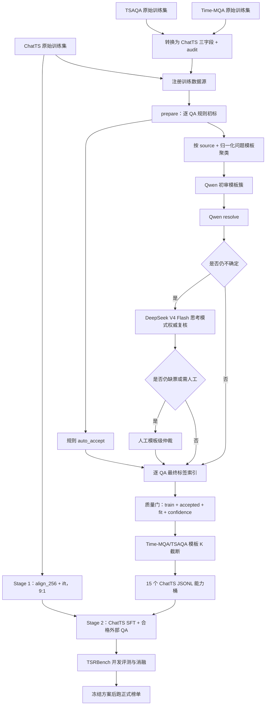

# ChatTS × TSRBench：从原始 QA 到训练与打榜的端到端运行手册

这份文档说明当前 `datataste` 代码从原始数据、逐 QA 标注、Qwen 初审、DeepSeek 权威复核、训练集物化，到 ChatTS 两阶段训练和 TSRBench 评测的完整流程。

所有命令默认从项目目录运行：

```bash
cd /Users/mac/Documents/finllm/datataste
```

## 1. 先回答最关键的问题

是的，最终目标是给**每个有效 QA 样本**一个 TSRBench 4 大类 / 15 小类标签。代码会为每条 QA 生成一行 `final_labels*.jsonl`。

但这不等于 DeepSeek 要逐条调用：

1. `prepare` 先对每个 QA 做规则初标，生成逐样本 `provisional_labels.jsonl`。
2. 规则不能高置信确定的 QA，会按“数据源 + 归一化问题模板”组成模板簇。
3. Qwen 对每个待复核模板簇调用一次，而不是对簇中的每条 QA 调用一次。
4. Qwen 仍无法确定的模板簇，再交给 DeepSeek V4 Flash 调用一次。
5. `resolve` 把模板簇的最终结论传播给簇内每条 QA，因此最终文件仍然是一条 QA 对应一条标签记录。

例如，某个模板簇包含 2,000 条仅数值不同的异常检测题：

```text
2,000 条 QA
  → 1 个 source-aware 模板簇
  → 1 次 Qwen 调用
  → 如果 Qwen 未解决，再做 1 次 DeepSeek 调用
  → resolve 展开为 2,000 条逐 QA 最终标签
```

因此要区分两个粒度：

| 粒度 | 文件 | 含义 |
| --- | --- | --- |
| QA 样本级 | `provisional_labels.jsonl`、`final_labels*.jsonl` | 每个 QA 一行，训练筛选以它为准 |
| 模板簇级 | `review_clusters.jsonl`、`votes-*.jsonl` | 每个模板一行，减少模型调用并保持同模板标签一致 |

另外，Qwen/DeepSeek 标注请求不会塞入完整时间序列数组。模型只看到：数据源、任务类型、归一化后的代表问题、代表答案和规则候选标签。代表问题中的序列仍是 `<ts><ts/>` 占位符。这里标的是“回答这道题需要什么能力”，不是重新计算答案，所以通常不需要读取成百上千个数值。

## 2. 总体流程图



整条链路的核心产物不是模型投票文件，而是逐 QA 的 `final_labels.jsonl`。模型票只是生成它的中间证据。

## 3. 目录和数据契约

### 3.1 原始数据

```text
data/raw/chatts_training/
├── align_256/train.jsonl
├── align_random/train.jsonl
├── ift/train.jsonl
├── sft/train.jsonl
└── dev/train.jsonl

data/raw/time_mqa_tsqa/
data/raw/tsaqa/train.parquet
```

### 3.2 统一的 ChatTS 训练格式

模型训练文件严格只有三个字段：

```json
{"input":"... <ts><ts/> ...","timeseries":[[1.0,2.0,3.0]],"output":"..."}
```

- `input`：问题文本；`<ts><ts/>` 与 `timeseries` 中序列一一对应。
- `timeseries`：数值时间序列列表。
- `output`：目标回答。

来源、原始行号、任务类型、domain 等信息写在同序的 `*.audit.jsonl` 中，不污染 ChatTS 训练器的数据契约。

### 3.3 标签为什么不直接写回训练 JSONL

当前代码把标签保存在 sidecar 索引 `final_labels*.jsonl` 中。这样做有两个原因：

- 不改变 ChatTS 原始的 `input + timeseries + output` 三字段格式。
- 可以重新调整标签、置信度阈值和模板 K，而不复制或重写大体积序列。

执行 `materialize` 后，样本会进入以 15 个能力命名的 JSONL 文件。文件名已经表达主标签，文件内部仍保持 ChatTS 三字段。

## 4. 第 0 步：固定一次运行目录

不要直接覆盖旧结果。为本轮全量标注使用一个新目录：

```bash
export TSR_RUN_DIR=artifacts/tsr-taxonomy-v2
mkdir -p "$TSR_RUN_DIR"
```

下面命令都沿用 `$TSR_RUN_DIR`。同一轮中不要切换注册表、源文件或源文件顺序。

先运行测试：

```bash
python -m unittest \
  tests/test_tsr_taxonomy_annotation.py \
  tests/test_convert_tsqa_to_chatts.py \
  -v
```

验收条件：所有测试通过，再开始全量运行。

## 5. 第 1 步：准备三组训练数据

### 5.1 ChatTS 原始训练数据

ChatTS 已经是目标三字段格式，不需要再次转换。确认五个文件存在：

```bash
ls data/raw/chatts_training/align_256/train.jsonl
ls data/raw/chatts_training/align_random/train.jsonl
ls data/raw/chatts_training/ift/train.jsonl
ls data/raw/chatts_training/sft/train.jsonl
ls data/raw/chatts_training/dev/train.jsonl
```

`dev` 可以进入标注统计，但后续 `materialize --splits train` 不会把它用于训练。

### 5.2 下载 Time-MQA 和 TSAQA

如果原始数据已下载，可以跳过本节。否则：

```bash
python -m pip install 'huggingface_hub>=0.27' 'pyarrow>=14,<22' httpx

hf auth login

python scripts/convert_tsqa_to_chatts.py download \
  --dataset time-mqa \
  --output-dir data/raw/time_mqa_tsqa \
  --revision main

python scripts/convert_tsqa_to_chatts.py download \
  --dataset tsaqa \
  --output-dir data/raw/tsaqa \
  --revision main
```

正式实验应把 `main` 换成下载时的 Hugging Face commit SHA，便于复现。

### 5.3 转换为 ChatTS 格式

先检查 Time-MQA 实际字段：

```bash
python scripts/convert_tsqa_to_chatts.py inspect \
  --input data/raw/time_mqa_tsqa \
  --rows 3
```

再转换训练切分：

```bash
python scripts/convert_tsqa_to_chatts.py convert \
  --dataset time-mqa \
  --input data/raw/time_mqa_tsqa \
  --output data/chatts/time_mqa_train.jsonl

python scripts/convert_tsqa_to_chatts.py convert \
  --dataset tsaqa \
  --input data/raw/tsaqa/train.parquet \
  --output data/chatts/tsaqa_train.jsonl
```

每个数据集会产生：

- `*_train.jsonl`：ChatTS 三字段训练数据。
- `*_train.audit.jsonl`：来源和任务元数据。
- `*_train.manifest.json`：过滤、去重、坏行和任务分布统计。

默认保护包括：排除非 train 文件、排除 Time-MQA Classification、排除 TSAQA sunspot，以及转换后精确重复样本去重。不要为了增加数量而开启 `--include-nontrain` 或 `--include-contaminated`。

## 6. 第 2 步：确认数据源注册表

标注入口是：

```text
configs/tsr_annotation_sources.json
```

当前注册了：

- `chatts_align_256`
- `chatts_align_random`
- `chatts_ift`
- `chatts_sft`
- `chatts_dev`
- `time_mqa`
- `tsaqa`

其中 Time-MQA/TSAQA 同时配置 audit 文件，标注器可利用 `task_type`、`question_type`、domain 等元数据判断能力类别。

注册表中的源顺序不能在 `prepare` 和 `materialize` 之间改变，因为逐 QA 标签索引会按该顺序和 `source_index` 与源数据流式对齐。

## 7. 第 3 步：逐 QA 规则初标并做模板聚类

```bash
python scripts/annotate_tsr_taxonomy.py prepare \
  --registry configs/tsr_annotation_sources.json \
  --output-dir "$TSR_RUN_DIR"
```

这一阶段会逐条读取所有有效 QA，并做以下工作：

1. 校验样本是否严格符合 ChatTS 三字段格式。
2. 结合数据源、任务元数据、问题和答案产生规则候选标签。
3. 为每个 QA 生成稳定的 `sample_id`。
4. 把问题中的数值、实体差异等归一化，生成模板文本。
5. 使用“数据源 + 模板文本”生成 `cluster_id`。
6. 高置信规则样本标为 `auto_accept`。
7. 其他样本标为 `review`，每个模板簇导出一个代表样本。

主要输出：

| 文件 | 粒度 | 用途 |
| --- | --- | --- |
| `provisional_labels.jsonl` | 每个 QA 一行 | 所有有效样本的规则候选和索引 |
| `review_clusters.jsonl` | 每个待复核模板一行 | Qwen 的输入 |
| `invalid_source_rows.jsonl` | 每个坏行一行 | 隔离原始无效数据 |
| `annotation_state.sqlite` | 模板簇数据库 | 记录簇成员数和恢复状态 |
| `prepare_manifest.json` | 一次运行一份 | 样本数、模板数、状态和初始分布 |

这里的模板聚类是 source-aware 的。即使两道题文字相同，只要来自不同数据源，也不会被强行合并。

典型例子：

```text
原题 1：Given <ts><ts/>, identify the anomaly at index 18.
原题 2：Given <ts><ts/>, identify the anomaly at index 43.
归一化模板：Given <ts><ts/>, identify the anomaly at index <NUM>.
候选能力：AD
```

它们可以共享一次模板复核，但最终仍保留两个不同 `sample_id` 和两行标签。

验收：查看运行清单，并记录基线数量。

```bash
python -m json.tool "$TSR_RUN_DIR/prepare_manifest.json"
wc -l "$TSR_RUN_DIR/provisional_labels.jsonl"
wc -l "$TSR_RUN_DIR/review_clusters.jsonl"
wc -l "$TSR_RUN_DIR/invalid_source_rows.jsonl"
```

## 8. 第 4 步：Qwen 复核全部模糊模板

先确认服务：

```bash
curl --noproxy '*' \
  http://10.112.164.1:30001/v1/chat/completions \
  -H 'Content-Type: application/json' \
  -d '{"model":"/share/global/pymaip/models/Qwen3.6-27B","messages":[{"role":"user","content":"只回答 OK"}],"max_tokens":32,"temperature":0}'
```

执行全量模板级标注：

```bash
python scripts/annotate_tsr_taxonomy.py annotate-online \
  --input "$TSR_RUN_DIR/review_clusters.jsonl" \
  --output "$TSR_RUN_DIR/votes-qwen36-all.jsonl" \
  --base-url http://10.112.164.1:30001/v1 \
  --model /share/global/pymaip/models/Qwen3.6-27B \
  --allow-no-key \
  --workers 8 \
  --max-tokens 1024 \
  --json-mode
```

行为说明：

- 输入是一簇一行的 `review_clusters.jsonl`，不是完整 QA 文件。
- 请求不包含完整 `timeseries` 数组。
- 输出是一簇一票的 `votes-qwen36-all.jsonl`。
- 失败记录写入同目录的 `votes-qwen36-all.errors.jsonl`。
- 命令支持断点续跑；重新运行时会跳过已经成功写入的 `cluster_id`。

如果接口不支持 `response_format=json_object`，去掉 `--json-mode` 后重跑；脚本仍会解析最终文本中的 JSON。

## 9. 第 5 步：先解析一次 Qwen 结果

```bash
python scripts/annotate_tsr_taxonomy.py resolve \
  --provisional "$TSR_RUN_DIR/provisional_labels.jsonl" \
  --clusters "$TSR_RUN_DIR/review_clusters.jsonl" \
  --votes "$TSR_RUN_DIR/votes-qwen36-all.jsonl" \
  --output "$TSR_RUN_DIR/final_labels.qwen.jsonl"
```

这次解析会得到：

- `final_labels.qwen.jsonl`：每个有效 QA 一行的 Qwen 阶段结果。
- `final_labels.qwen.human_review.jsonl`：Qwen 后仍未解决的**模板簇**，也是 DeepSeek 的输入。

Qwen 单票不会无条件覆盖规则。当前逻辑中，单模型标签只有与规则候选一致且模型置信度至少为 0.85 时才直接接收；否则留给 DeepSeek。

## 10. 第 6 步：DeepSeek V4 Flash 权威复核剩余模板

先测试服务：

```bash
curl http://localhost:30000/v1/chat/completions \
  -H 'Content-Type: application/json' \
  -d '{"model":"/models","messages":[{"role":"user","content":"只回答 OK"}],"max_tokens":64,"temperature":1.0,"top_p":1.0}'
```

再对 Qwen 未解决的模板簇运行 DeepSeek：

```bash
python scripts/annotate_tsr_taxonomy.py annotate-online \
  --input "$TSR_RUN_DIR/final_labels.qwen.human_review.jsonl" \
  --output "$TSR_RUN_DIR/vote-deepseek-v4-flash-authoritative.jsonl" \
  --base-url http://localhost:30000/v1 \
  --model /models \
  --allow-no-key \
  --workers 8 \
  --max-tokens 2048 \
  --json-mode \
  --thinking-mode enabled \
  --reasoning-effort max
```

`--reasoning-effort` 支持 `high` 和 `max`。`max` 更适合最终权威复核，但更慢；如果吞吐压力大，可以先用 `high`，将低置信或关键少数类别再用 `max` 复核。

思考模式的处理方式：

- 请求中发送 `thinking={"type":"enabled"}` 和 `reasoning_effort=max`。
- 思考正文不写入投票文件，避免产物膨胀和泄露内部推理。
- 文件只记录是否返回过 `reasoning_content`。
- 只有最终 `content` 中的合法 JSON 进入标签解析。
- 如果报 `model response has no final content`，应提高 `--max-tokens`，然后断点续跑。

DeepSeek 的“权威”含义是：对原本处于 `review` 的模板，它优先于普通模型票；它不会覆盖规则已经 `auto_accept` 的样本，也不会覆盖人工标签。

## 11. 第 7 步：生成逐 QA 最终标签

```bash
python scripts/annotate_tsr_taxonomy.py resolve \
  --provisional "$TSR_RUN_DIR/provisional_labels.jsonl" \
  --clusters "$TSR_RUN_DIR/review_clusters.jsonl" \
  --votes "$TSR_RUN_DIR/votes-qwen36-all.jsonl" \
  --authoritative-votes "$TSR_RUN_DIR/vote-deepseek-v4-flash-authoritative.jsonl" \
  --output "$TSR_RUN_DIR/final_labels.jsonl"
```

最终优先级是：

```text
人工覆盖
  > 规则 auto_accept
  > DeepSeek authoritative vote
  > 多个普通模型共识
  > 单模型与规则一致
  > human_review
```

`final_labels.jsonl` 每条有效 QA 一行，关键字段包括：

```json
{
  "sample_id": "...",
  "source": "time_mqa",
  "split": "train",
  "source_index": 123,
  "cluster_id": "...",
  "final": {
    "primary_label": "AD",
    "secondary_labels": ["TR"],
    "taxonomy_fit": "exact",
    "confidence": 0.94,
    "status": "accepted",
    "method": "authoritative_model"
  }
}
```

所以，虽然 DeepSeek 是按模板簇调用，最后确实完成了逐 QA 标注。

## 12. 第 8 步：做四个完整性检查

### 12.1 Qwen 是否覆盖全部待复核模板

```bash
python - "$TSR_RUN_DIR/review_clusters.jsonl" "$TSR_RUN_DIR/votes-qwen36-all.jsonl" <<'PY'
import json, sys

def ids(path):
    with open(path, encoding="utf-8") as stream:
        return [json.loads(line)["cluster_id"] for line in stream if line.strip()]

expected = ids(sys.argv[1])
actual = ids(sys.argv[2])
print({
    "expected_clusters": len(expected),
    "vote_rows": len(actual),
    "missing": len(set(expected) - set(actual)),
    "unexpected": len(set(actual) - set(expected)),
    "duplicate_vote_rows": len(actual) - len(set(actual)),
})
PY
```

验收：`missing=0`、`unexpected=0`、`duplicate_vote_rows=0`。

### 12.2 DeepSeek 是否覆盖全部 Qwen 未解决模板

```bash
python - "$TSR_RUN_DIR/final_labels.qwen.human_review.jsonl" "$TSR_RUN_DIR/vote-deepseek-v4-flash-authoritative.jsonl" <<'PY'
import json, sys

def ids(path):
    with open(path, encoding="utf-8") as stream:
        return [json.loads(line)["cluster_id"] for line in stream if line.strip()]

expected = ids(sys.argv[1])
actual = ids(sys.argv[2])
print({
    "expected_clusters": len(expected),
    "vote_rows": len(actual),
    "missing": len(set(expected) - set(actual)),
    "unexpected": len(set(actual) - set(expected)),
    "duplicate_vote_rows": len(actual) - len(set(actual)),
})
PY
```

权威票要求每个 `cluster_id` 恰好一票；重复权威票会被 `resolve` 拒绝。

### 12.3 最终文件是否仍是一 QA 一标签

```bash
wc -l \
  "$TSR_RUN_DIR/provisional_labels.jsonl" \
  "$TSR_RUN_DIR/final_labels.jsonl"
```

两行数量必须相同。坏行不在两者中，而是在 `invalid_source_rows.jsonl` 中。

### 12.4 最终还有多少未解决样本

```bash
python - "$TSR_RUN_DIR/final_labels.jsonl" <<'PY'
import collections, json, sys

status = collections.Counter()
method = collections.Counter()
labels = collections.Counter()
with open(sys.argv[1], encoding="utf-8") as stream:
    for line in stream:
        item = json.loads(line)
        final = item["final"]
        status[final.get("status")] += 1
        method[final.get("method")] += 1
        labels[final.get("primary_label") or "NONE"] += 1
print("status:", dict(status))
print("method:", dict(method))
print("labels:", dict(labels))
PY
```

正式物化前，至少要解释清楚所有 `human_review` 的来源。API 漏票和解析失败必须补跑，不能当作低质量样本静默丢弃。

## 13. 第 9 步：只对剩余模板做人工仲裁

如果最终仍有 `human_review`，脚本已经自动生成：

```text
$TSR_RUN_DIR/final_labels.human_review.jsonl
```

导出为 CSV：

```bash
python scripts/annotate_tsr_taxonomy.py export-human \
  --input "$TSR_RUN_DIR/final_labels.human_review.jsonl" \
  --output "$TSR_RUN_DIR/human-labels.csv"
```

填写 `human_primary_label`、`human_secondary_labels`、`human_taxonomy_fit`、`human_rationale` 和 `reviewer` 后，生成一个新版本，不覆盖旧结果：

```bash
python scripts/annotate_tsr_taxonomy.py resolve \
  --provisional "$TSR_RUN_DIR/provisional_labels.jsonl" \
  --clusters "$TSR_RUN_DIR/review_clusters.jsonl" \
  --votes "$TSR_RUN_DIR/votes-qwen36-all.jsonl" \
  --authoritative-votes "$TSR_RUN_DIR/vote-deepseek-v4-flash-authoritative.jsonl" \
  --human "$TSR_RUN_DIR/human-labels.csv" \
  --output "$TSR_RUN_DIR/final_labels-reviewed.jsonl"
```

此后把 `final_labels-reviewed.jsonl` 作为正式标签；如果没有人工剩余，则继续使用 `final_labels.jsonl`。

人工仍然是模板级标注，`resolve` 会再次传播到簇内每条 QA。

## 14. 第 10 步：查看三个数据集的 15 类分布

以下命令以未经人工覆盖的文件为例；如果生成了 reviewed 版本，请替换 `--labels`：

```bash
python scripts/annotate_tsr_taxonomy.py report-distribution \
  --labels "$TSR_RUN_DIR/final_labels.jsonl" \
  --splits train \
  --output-json "$TSR_RUN_DIR/distribution-by-dataset.json" \
  --output-csv "$TSR_RUN_DIR/distribution-by-dataset.csv"
```

重点检查：

- ChatTS、Time-MQA、TSAQA 的 `accepted/excluded/human_review`。
- 15 类是否出现意外空类或极端偏斜。
- DeepSeek 是否把大量 `out_of_scope` 强行变成某一个大类。
- `PR/ER/NR/DR` 等容易混淆的类别是否符合题目真正要求的操作。
- 小类不能只看总体随机抽检；应按“数据集 × 标签 × 模板簇大小”分层抽检。

## 15. 第 11 步：质量过滤和模板去重后物化训练集

首轮推荐只保留：

- `split=train`
- `status=accepted`
- `taxonomy_fit in {exact, compatible}`
- `confidence >= 0.85`
- Time-MQA/TSAQA 每个 source-aware 模板最多 8 条

命令：

```bash
python scripts/annotate_tsr_taxonomy.py materialize \
  --registry configs/tsr_annotation_sources.json \
  --labels "$TSR_RUN_DIR/final_labels.jsonl" \
  --output-dir data/chatts/tsr15-final-k8 \
  --splits train \
  --min-confidence 0.85 \
  --include-fit exact compatible \
  --max-per-template 8 \
  --template-cap-sources time_mqa tsaqa \
  --template-sample-seed 42
```

如果正式标签是 reviewed 版本，只替换 `--labels`。

输出目录包含 15 个能力 JSONL 和一个 `manifest.json`。模板截断在质量门之后执行，不会让低质量样本占用 K 个名额。选样按 `seed + sample_id` 的 SHA-256 排序，同一 seed 可复现，也不会偏向源文件前部。

这里“从 172,241 条压到 50,371 条”一类统计只表示：通过基本质量门的 Time-MQA/TSAQA 候选中，大量样本属于重复模板，K 截断只保留每模板最多若干代表样本。被过滤的数据没有被删除，仍保留在原始 JSONL 和 `final_labels` 中，换 K 即可重新物化。

推荐做 `K=4/8/16` 消融，而不是把 K=8 当作永久真值。

## 16. 第 12 步：组织 ChatTS 两阶段训练

### 16.1 Stage 1：时序—文本对齐

按 ChatTS 原始训练数据说明，推荐：

```text
align_256 : ift = 9 : 1
```

理由：

- `align_256` 的目标是让时间序列编码器、投影层和语言模型建立稳定对齐。
- 少量 `ift` 防止模型只学会描述序列而丢失指令跟随。
- Time-MQA/TSAQA 的问题复杂且模板重复，主要价值在任务推理和回答，不适合替代基础对齐监督。
- Stage 1 不建议对 `align_256` 做激进模板 K 截断；重复的数值变化本身就是对齐监督。

如果从 ChatTS 官方已完成对齐的 checkpoint 继续训练，可以跳过完整 Stage 1，或只做很短的低学习率恢复；如果更换了基础语言模型、时序编码器或连接层，应完整执行 Stage 1。

### 16.2 Stage 2：能力 SFT

ChatTS 官方基础比例是：

```text
sft : ift : align_random = 3 : 1 : 1
```

为了加入已标注的 Time-MQA/TSAQA，第一版建议使用总采样比例：

| 来源 | 建议占比 | 作用 |
| --- | ---: | --- |
| ChatTS `sft` | 36% | 保留开放回答、解释和复杂指令能力 |
| ChatTS `ift` | 12% | 保持指令遵循 |
| ChatTS `align_random` | 12% | 保持 64–1024 随机长度泛化与模态对齐 |
| Time-MQA 合格子集 | 20% | 增加跨领域预测、异常、数值与推理任务 |
| TSAQA 合格子集 | 20% | 增加 15 类覆盖和直接 QA 监督 |

这相当于把 60% 预算留给 ChatTS 原始 `3:1:1` 配方，40% 留给新增 QA。首轮不要让模板化数据超过一半，否则容易提高模板题表现，却损伤开放回答和泛化。

需要注意：当前 `materialize` 的直接输出是“跨数据源的 15 个能力桶”，不是上述五来源的最终混合文件。精确实现来源比例时，应：

1. ChatTS 三个原始源继续分别注册到训练采样器。
2. 使用 `final_labels` 的 `source` 字段，只从 `time_mqa` 和 `tsaqa` 取通过质量门与 K 截断的样本。
3. 在 ChatTS 训练配置或 dataloader 中按上述权重采样。
4. 15 类标签用于分层采样和统计，不应添加到模型输入文本中。

不要把 15 个能力桶简单等量复制到同样大小。合理做法是设置每类最小曝光量、对极低频类温和上采样，同时限制同模板重复；否则会产生严重的过采样记忆。

## 17. 第 13 步：训练前必须通过的门槛

训练启动前逐项确认：

- [ ] 标注与转换两组单元测试全部通过。
- [ ] Time-MQA/TSAQA 转换 manifest 已保存，非 train 和已知污染源未进入训练。
- [ ] `provisional_labels` 与最终标签行数相同。
- [ ] Qwen 所有预期模板均有且只有一票。
- [ ] DeepSeek 所有预期模板均有且只有一张权威票。
- [ ] API 错误文件为空，或错误簇已经补跑成功。
- [ ] `human_review` 为 0，或每个剩余项都有明确处置记录。
- [ ] 训练只取 `train + accepted + exact/compatible + confidence>=0.85`。
- [ ] Time-MQA/TSAQA 已做模板 K 截断并保存 seed。
- [ ] `manifest.json` 中候选数、保留数、过滤数与预期一致。
- [ ] 按数据集、15 类、模板簇大小完成分层抽检。
- [ ] TSRBench valid/test 没有进入下载、转换、标注或训练注册表。
- [ ] 如果能够取得 benchmark 样本，已经做序列指纹和问题模板的样本级去污染。

当前转换器完成的是已知源级去污染；与 TSRBench 文件的样本级指纹比对是正式打榜前仍需单独完成的门槛，不能仅凭数据集名称判断无泄漏。

## 18. 第 14 步：训练、消融和正式打榜

本仓库负责数据准备与标签索引，不包含 ChatTS-Training 的完整训练入口。训练时把上述数据路径和采样比例接入 ChatTS-Training 的 Stage 1 / Stage 2 配置，不要凭空修改模型所需的 `<ts><ts/>` 和 `timeseries` 对齐规则。

推荐实验顺序：

1. 复现 ChatTS 原始 Stage 2 配方，作为本地 baseline。
2. 加入 Time-MQA/TSAQA 的 `K=8` 合格子集，保持总步数或 token 预算可比。
3. 做 `K=4/8/16` 消融。
4. 做无 DeepSeek 权威复核、无模板截断、无类别平衡等消融，确认收益来自哪里。
5. 在 TSRBench 开发切分上选择训练比例和 checkpoint。
6. 冻结数据版本、随机种子、训练参数与 checkpoint 后，只运行一次正式测试/榜单评测。

至少保存以下复现信息：

- 原始数据 revision/commit SHA。
- `configs/tsr_annotation_sources.json` 的版本和哈希。
- `prepare_manifest.json`。
- Qwen/DeepSeek 的模型名、服务版本、思考模式和强度。
- Qwen 普通票、DeepSeek 权威票、人工覆盖文件。
- 最终标签文件及 SHA-256。
- `materialize/manifest.json`、K、seed、置信度阈值。
- Stage 1/2 数据比例、随机种子、训练超参数和 checkpoint。

## 19. 常见误解和故障恢复

### 19.1 “DeepSeek 没逐条调用，所以不是逐 QA 标注”

不对。DeepSeek 的调用单位是模板簇，最终标签单位是 QA。`resolve` 负责将模板结论展开到所有成员 QA。

### 19.2 “规则自动接收的 QA 也必须再过 DeepSeek”

默认不需要。规则 `auto_accept` 是为高精度场景保留的低成本路径，并且在解析优先级中高于 DeepSeek。应该通过分层抽检检验规则精度，而不是无差别增加模型调用。

### 19.3 “DeepSeek 输出低置信标签后就能直接训练”

不一定。权威票会进入最终索引，但 `materialize --min-confidence 0.85` 会把低置信样本过滤掉。权威代表冲突处理优先级，不代表置信度被伪造为 1.0。

### 19.4 “`human_review` 就是负样本或无效样本”

不对。它表示当前证据不足，不能作为任何一个 15 类的金标。必须补模型票、人工裁决，或明确排除。

### 19.5 API 中途失败

查看相应 `*.errors.jsonl`，修复服务后原命令重跑。`annotate-online` 会从现有成功投票文件断点续跑。完成后重新做 cluster ID 覆盖检查。

### 19.6 想更换模型或标注策略

不要覆盖旧票。写入新的 `votes-模型名.jsonl`，再用 `resolve --votes` 传入多个普通票，或把最终裁决模型作为 `--authoritative-votes`。这样可以审计不同模型对结果的影响。

### 19.7 想调整模板 K 或置信度

不需要重新标注。保留原始源文件和最终标签，换一个新的空输出目录重新执行 `materialize` 即可。

## 20. 最终产物清单

完成一轮正式流程后，应至少保留：

```text
artifacts/tsr-taxonomy-v2/
├── prepare_manifest.json
├── provisional_labels.jsonl
├── review_clusters.jsonl
├── invalid_source_rows.jsonl
├── annotation_state.sqlite
├── votes-qwen36-all.jsonl
├── vote-deepseek-v4-flash-authoritative.jsonl
├── final_labels.qwen.jsonl
├── final_labels.qwen.human_review.jsonl
├── final_labels.jsonl
├── final_labels.human_review.jsonl
├── human-labels.csv                    # 如有人工仲裁
├── final_labels-reviewed.jsonl         # 如有人工仲裁
├── distribution-by-dataset.json
└── distribution-by-dataset.csv

data/chatts/tsr15-final-k8/
├── PR_pattern_recognition.jsonl
├── ...其余 14 类...
├── QuantDM_quantitative_decision_making.jsonl
└── manifest.json
```

最终训练时要使用的不是所有标注样本，而是经过切分隔离、标签确认、置信度过滤、适配度过滤、模板去重和训练配比控制后的子集。`final_labels` 是完整审计索引，`tsr15-final-k8` 是其中满足当前训练策略的可用物化版本。
