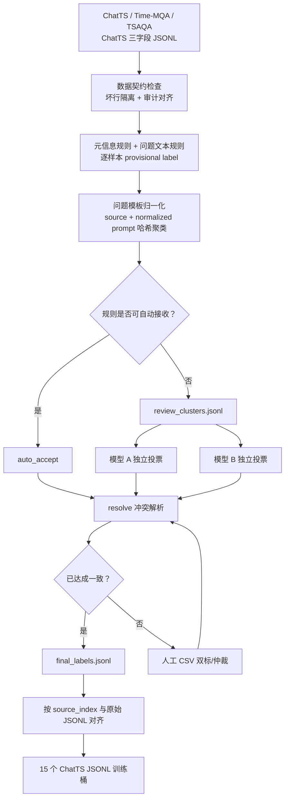

# TSRBench 4×15 QA 数据标注管线技术文档

> 文档版本：1.0  
> 分类体系版本：`tsrbench-4x15-v1`  
> 实现脚本：`scripts/annotate_tsr_taxonomy.py`  
> 数据注册表：`configs/tsr_annotation_sources.json`

## 1. 文档目标

本文档说明如何将 ChatTS、Time-MQA/TSQA、TSAQA 等“文本问题 + 数值时间序列 + 文本答案”QA 数据，映射到 TSRBench 的 4 个大类、15 个小类，并最终生成可供 ChatTS 训练使用的 15 个 JSONL 数据桶。

这里的重点不是简单做一次关键词分类，而是建立一条可复现、可审计、可断点恢复的弱监督标注流水线：

1. 保持原始训练样本不变；
2. 利用数据集自带元信息和高精度规则做第一轮标注；
3. 将重复问题压缩为模板簇，减少模型和人工标注量；
4. 用两个独立模型标注不确定模板；
5. 用人工标注覆盖模型分歧和体系外任务；
6. 将最终标签索引与原始数据流式对齐，生成 15 个 ChatTS 格式训练文件。

本文档描述的是当前代码的实际行为。简化版操作说明见 `docs/annotate-tsr-taxonomy.md`。

## 2. 为什么不能直接把所有 QA 强行分成 15 类

TSRBench 的 15 类不是对所有时间序列任务的穷举。例如：

- 缺失值插补与未来预测相似，但插补发生在已观测时间范围内部，不是标准 `TSF`；
- 通用类别分类可能依赖序列模式，但不一定等价于 TSRBench 的 `PR`；
- 一道 ChatTS 指令可能同时要求趋势、异常、原因和决策，不能用一个标签完整描述；
- 数据变换可能是应用给定规则，也可能只是预处理操作，需要区分 `DR` 与体系外任务。

因此，管线同时记录“主任务标签”和“与 TSRBench 的适配程度”。这样可以避免为了增加训练量而引入错误监督。

## 3. 总体架构



下面严格按照图中的 A→O 节点说明每一步。第 3 节本身是一条可以照着执行的完整主线；第 4 节及以后用于补充标签定义、规则表、数据结构和质量控制细节。

### 3.1 图中节点与实际文件的对应关系

| 图中节点 | 实际对象或文件 | 这一节点解决的问题 |
|---|---|---|
| A | 注册表中的 7 个 ChatTS 格式 JSONL 数据源 | 统一不同 QA 数据集的输入格式 |
| B | `iter_source()`、审计 JSONL、`invalid_source_rows.jsonl` | 确保源数据可解析、三字段正确、审计没有错位 |
| C | `rule_label()`、逐样本 `provisional` | 给每条样本产生保守的第一轮标签建议 |
| D | `normalize_template()`、`annotation_state.sqlite` | 合并同源、同问题模板的重复样本 |
| E | `status=auto_accept/review` | 决定规则结果能否直接接收 |
| F | `provisional.status=auto_accept` 的样本 | 保存高精度规则结果，等待统一解析 |
| G | `review_clusters.jsonl` | 只把不确定的模板送给模型或人工 |
| H/I | `vote-model-a.jsonl`、`vote-model-b.jsonl` | 两个模型独立给出第二意见 |
| J | `resolve` 子命令 | 按优先级合并规则、模型和人工结果 |
| K | 共识判断逻辑 | 判断某模板能否成为最终标签 |
| M | `human-labels.csv` | 处理模型分歧、体系外任务和低置信标签 |
| L | `final_labels*.jsonl` | 保存逐样本最终标签索引 |
| N | `materialize` 的源行—标签行对齐检查 | 防止标签贴到错误的时序样本上 |
| O | `data/chatts/tsr15-*/*.jsonl` | 生成 15 个可直接训练的 ChatTS 数据桶 |

管线始终把“标签索引”和“原始数值序列”分开。标注索引只保存源文件位置、哈希和标签，不复制数值数组；只有最后的物化阶段才重新读取原始数组并写出训练数据。

### 3.2 A：准备统一格式的数据源

#### 输入是什么

本次管线处理三个数据集家族：

1. ChatTS Training Dataset：包括 `align_256`、`align_random`、`ift`、`sft` 和 `dev`；
2. Time-MQA/TSQA：已经转换成 ChatTS 三字段格式；
3. TSAQA：已经转换成 ChatTS 三字段格式。

管线不直接读取 Time-MQA 的 CSV 或 TSAQA 的 Parquet。它们先经过 `scripts/convert_tsqa_to_chatts.py`，统一转换为：

```json
{
  "input": "问题文本，其中用 <ts><ts/> 引用序列",
  "timeseries": [[1.0, 2.0, 3.0]],
  "output": "监督答案"
}
```

#### 为什么先统一格式

如果标注器同时处理 CSV、Parquet、HDF5 和不同字段名，规则、索引和异常处理都会与数据集实现耦合。先统一成 ChatTS 三字段后，分类管线只需要处理一种输入契约；原始来源信息放在旁路审计文件中。

#### 如何登记数据源

所有输入写入：

```text
configs/tsr_annotation_sources.json
```

一个条目示例：

```json
{
  "name": "time_mqa",
  "path": "data/chatts/time_mqa_train.jsonl",
  "audit": "data/chatts/time_mqa_train.audit.jsonl",
  "split": "train"
}
```

这里必须保证：

- `name` 唯一；
- `path` 存在；
- 声明了 `audit` 时，审计文件也必须存在；
- 数据源顺序固定，因为后面的标签索引按这个顺序生成；
- `chatts_dev` 明确标成 `dev`，防止物化时混进训练集。

#### 这一步的输出

没有生成新数据，输出是一个经过人工确认的数据源注册表。运行 `prepare` 时，`load_registry()` 会再次自动检查注册表。

### 3.3 A→B：逐行读取、格式检查和审计对齐

#### 如何执行

```bash
cd datataste

python scripts/annotate_tsr_taxonomy.py prepare \
  --registry configs/tsr_annotation_sources.json \
  --output-dir artifacts/tsr-taxonomy
```

`prepare` 的第一件事不是分类，而是逐行验证输入。

#### 每一行怎么检查

对注册表中的每个数据源，按物理顺序读取 JSONL。假设当前是第 `i` 行：

1. 跳过空行；
2. 如果存在审计文件，同时读取一条审计记录；
3. 检查审计中的 `sample_index == i`；
4. 对原始 JSON 行去掉行末换行后计算完整 SHA-256；
5. 调用 `json.loads()`；
6. 检查结果必须是 JSON 对象；
7. 检查键集合必须严格等于 `input/timeseries/output`；
8. 通过后才进入规则标注。

#### 为什么要检查审计索引

Time-MQA 和 TSAQA 的 `task/domain/question_type` 在单独的 audit JSONL 中。如果 audit 少一行或顺序改变，后面的所有任务元信息都会贴错样本。`sample_index` 检查会在第一个错位位置直接停止，而不是生成一整批错误标签。

#### 坏行怎么办

JSON 损坏或字段结构错误时，不修补原始数据，也不让整个 55 万条任务失败。坏行写入：

```text
artifacts/tsr-taxonomy/invalid_source_rows.jsonl
```

每条审计包括：

- 数据源名；
- 零基 `source_index`；
- 一基 `line_number`；
- 原始行 SHA-256；
- 错误类型和错误位置；
- 前 200 个字符。

本次扫描隔离了 133 条坏行：`align_256` 51 条，`align_random` 82 条。

#### B 节点的验收条件

```text
有效样本数 + 坏行数 = 原始非空总行数
549,971 + 133 = 550,104
```

审计文件不存在索引错位，有效记录全部满足 ChatTS 三字段契约。

### 3.4 B→C：给每条有效样本生成第一轮候选标签

#### 传给规则标注器的内容

每条有效样本调用：

```python
rule_label(
    source=数据源配置,
    prompt=sample["input"],
    output=sample["output"],
    audit=对应审计记录
)
```

当前规则实际主要使用：

- `source.name`；
- `audit.task`；
- `input` 问题文本。

`output` 被保留在接口中，供后续扩展答案一致性规则；当前第一轮正则没有依赖答案内容。

#### 先看数据集明确元信息

高精度任务名先产生候选分数。例如：

```text
TSAQA task=anomaly_detection  → AD, 0.995, exact
TSAQA task=comparison         → CA, 0.985, exact
TSAQA task=classification     → PR, 0.84, closest
Time-MQA task=forecasting     → TSF, 0.995, exact
Time-MQA task=imputation      → closest TSF, 0.65, out_of_scope
```

这里没有把 imputation 强行变成 TSF。它只记录“最接近 TSF”，主标签稍后会置空，等待排除或人工确认。

#### 再看问题要求执行什么操作

随后在小写后的 `input` 上执行 15 类英文正则。例如：

```text
"locate the anomalous segment"      → AD 0.95
"compare the two trends"            → CA 0.94
"predict the next 12 values"        → TSF 0.97
"put events in chronological order" → TR 0.95
"backtest and choose best return"    → QuantDM 0.96
```

规则匹配的是“动作”，不是领域。例如输入出现 “weather forecasting dataset”，但实际问题是“找异常点”，主任务仍应该是 AD。

#### 多条规则同时命中怎么办

为每个标签保存一个最高分：

```text
scores = {
    AD: 0.95,
    TR: 0.95,
    PR: 0.91
}
```

然后：

1. 按分数降序排序；
2. 同分按标签字符串排序，保证结果确定；
3. 第一名成为候选 `primary_label`；
4. 其他标签分数不低于 0.90，且与第一名差值不超过 0.08，进入 `secondary_labels`；
5. 保存每次命中的文字证据到 `evidence`。

#### 输出什么

每条样本生成一个 `Decision`：

```json
{
  "primary_label": "AD",
  "secondary_labels": ["TR"],
  "closest_label": "AD",
  "taxonomy_fit": "exact",
  "confidence": 0.95,
  "status": "auto_accept",
  "method": "rules",
  "evidence": [
    "AD: detects/localizes abnormal observations",
    "TR: asks for chronology or temporal ordering"
  ]
}
```

这个结果仍叫 provisional，不是最终金标。

### 3.5 C→D：为样本建立身份，并把重复问题压缩成模板簇

这一阶段同时生成“逐样本身份”和“问题模板身份”。两者用途不同。

#### 建立逐样本身份

```text
sample_id = source_name : source_index : 原始行SHA256前16位
```

例如：

```text
chatts_align_256:0:5513c021b987ec31
```

逐样本 provisional 索引还保存完整 SHA-256。`source_index` 用来重新找到原始数据，SHA-256 用于后续审计或检测原始内容是否发生变化；当前物化器自动检查的是 `source + source_index` 对齐。

#### 为什么需要模板聚类

合成 QA 数据中很多问题只改变了数字、序列长度或数据实例。如果逐条调用模型，93 个完全相同的问题会付 93 次成本，人工也会重复判断。

因此对问题做确定性归一化：

1. 全部转为小写；
2. `<ts><ts/>` 统一成 `<ts>`；
3. URL 替换为 `<url>`；
4. 整数、浮点数、科学计数法替换为 `<num>`；
5. 多个空白合并；
6. 去除首尾空白。

#### 模板 ID 怎么生成

```text
normalized_prompt = normalize_template(input)
cluster_payload = source_name + "\n" + normalized_prompt
cluster_id = SHA256(cluster_payload) 的前 24 位
```

`source_name` 参与哈希，所以不同数据集不会因为问题措辞相同而互相传播标签。

#### 聚类结果保存在哪里

保存到：

```text
artifacts/tsr-taxonomy/annotation_state.sqlite
```

第一次出现该模板时保存：

- 代表问题；
- 代表答案；
- 代表样本的 task/question_type/domain；
- 第一轮标签；
- 第一个 sample_id；
- `member_count=1`。

以后命中相同模板，只执行：

```text
member_count = member_count + 1
```

#### 模板传播的限制

当前是“同数据源 + 完全相同归一化模板”聚类，不是 embedding 语义聚类。它不会自动合并同义改写。`task/question_type/domain` 作为审计和模型提示保存，但不参与当前 `cluster_id`。

对于成员数特别大的模板，人工复核时仍应抽取多个成员检查，因为代表样本只取簇中第一条记录。

### 3.6 D→E：判断规则结果是否足够可靠

E 是第一道质量闸门。它不问“规则是否产生了标签”，而是问“规则标签能否无需第二意见直接接收”。

#### 自动接收条件

必须同时满足：

```text
taxonomy_fit == exact
confidence >= 0.94
没有被识别为 compound/mixed
```

#### mixed 怎么判断

如果问题包含至少两个换行编号问题，例如：

```text
1. Describe the trend.
2. Locate the anomalies.
```

并且规则识别出多个接近的能力标签，则：

```text
taxonomy_fit = mixed
status = review
```

#### 为什么 PR 大量进入 review

当前 `PR` 文本规则基础分为 0.91，低于自动接收阈值 0.94。因此即使问题明显包含 trend/periodicity，仍先进入复核队列。这样做是为了防止把“预测趋势”“比较趋势”“趋势引发的决策”等复杂问题仅凭一个 trend 词归为 PR。

#### E→F：可以直接接收

满足阈值的逐样本 provisional 状态设置为：

```text
status = auto_accept
```

它不会立即写入训练文件，而是在 J 节点与模型/人工结果一起解析成统一的 final schema。

#### E→G：需要复核

以下情况进入复核：

- 没有规则命中；
- 置信度低于 0.94；
- `closest`；
- `compatible`；
- `mixed`；
- `out_of_scope`；
- 规则能找到候选，但不满足保守自动接收条件。

### 3.7 G：生成模板级复核队列

`prepare` 完成逐样本扫描后，从 SQLite 中选择代表 provisional 不是 `auto_accept` 的模板，按成员数降序导出：

```text
artifacts/tsr-taxonomy/review_clusters.jsonl
```

一行代表一个模板，而不是一个样本：

```json
{
  "cluster_id": "700e1f03905345beb62c508f",
  "source": "time_mqa",
  "representative_input": "...",
  "representative_output": "...",
  "source_task": "imputation",
  "question_type": "unknown",
  "domain": "Web",
  "provisional": {
    "primary_label": null,
    "closest_label": "TSF",
    "taxonomy_fit": "out_of_scope"
  },
  "member_count": 12397
}
```

为什么按 `member_count` 降序：先正确标注一个 12,397 成员的大模板，比先标 12,397 个单例模板更快提高有效数据覆盖率。

本次得到：

```text
266,825 条待复核样本
       ↓ 模板压缩
 93,301 个待复核模板
```

这里要区分“逐样本状态”和“模板代表状态”：模板是否导出由簇中第一条代表样本决定，`member_count` 统计该模板的全部成员；最终 `resolve` 仍对每条样本分别处理，原本 `auto_accept` 的成员不会被模型票覆盖。本次审计中，所有 266,825 条 review 样本都进入了复核模板范围，另有 1 条 auto-accept 样本与某个 review 模板同簇，因此复核簇的成员数求和会比逐样本 review 数多 1。

### 3.8 G→H/I：两个模型独立标注同一批模板

#### 为什么要两个模型

单模型容易受规则建议、关键词和自身偏好影响。两个独立模型的作用不是简单增加票数，而是暴露边界不清、任务体系不适配或问题本身多义的模板。

#### 模型 A 怎么运行

```bash
python scripts/annotate_tsr_taxonomy.py annotate-online \
  --input artifacts/tsr-taxonomy/review_clusters.jsonl \
  --output artifacts/tsr-taxonomy/vote-model-a.jsonl \
  --base-url http://127.0.0.1:8000/v1 \
  --model MODEL_A \
  --workers 8 \
  --allow-no-key
```

#### 模型 B 怎么运行

```bash
python scripts/annotate_tsr_taxonomy.py annotate-online \
  --input artifacts/tsr-taxonomy/review_clusters.jsonl \
  --output artifacts/tsr-taxonomy/vote-model-b.jsonl \
  --base-url http://127.0.0.1:8001/v1 \
  --model MODEL_B \
  --workers 8 \
  --allow-no-key
```

两个输出文件必须分开。模型 B 不能读取 `vote-model-a.jsonl`，否则不再是独立投票。

对于当前 DeepSeek V4 API，已经通过冒烟测试的参数是：

```bash
python scripts/annotate_tsr_taxonomy.py annotate-online \
  --input artifacts/tsr-taxonomy/review_clusters.jsonl \
  --output artifacts/tsr-taxonomy/vote-deepseek-v4-flash.jsonl \
  --base-url https://api.deepseek.com \
  --model deepseek-v4-flash \
  --api-key-env DEEPSEEK_API_KEY \
  --workers 8 \
  --json-mode \
  --disable-thinking
```

`--json-mode` 会发送 `response_format={"type":"json_object"}`，`--disable-thinking` 会发送 `thinking={"type":"disabled"}`。这两个参数是可选项，只有目标 API 支持相应字段时才应开启。

#### 每次请求给模型什么

系统提示提供 15 类定义和关键边界。用户消息提供：

```text
source
source_task
question_type
representative question
representative answer
rule proposal
```

模型返回：

```json
{
  "primary_label": "PR",
  "secondary_labels": [],
  "taxonomy_fit": "exact",
  "confidence": 0.90,
  "rationale": "The task asks for the observed trend."
}
```

#### 如何保证输出可用

解析器检查：

- 主标签和辅助标签必须属于 15 类；
- fit 必须属于五种适配度；
- confidence 必须在 0 到 1；
- JSON 代码围栏可以去除；
- rationale 最多保留 1,000 字符。

无效响应写入 `.errors.jsonl`。

#### 如何断点续跑

投票文件按成功结果追加写入。再次运行时先读取已有 `cluster_id`，成功过的模板自动跳过；失败模板没有成功记录，下次会重新尝试。

建议先加：

```text
--limit 100
```

确认模型严格返回 JSON 后再全量运行。

### 3.9 F/H/I→J：把规则和模型结果送入统一解析器

执行：

```bash
python scripts/annotate_tsr_taxonomy.py resolve \
  --provisional artifacts/tsr-taxonomy/provisional_labels.jsonl \
  --clusters artifacts/tsr-taxonomy/review_clusters.jsonl \
  --votes artifacts/tsr-taxonomy/vote-model-a.jsonl \
          artifacts/tsr-taxonomy/vote-model-b.jsonl \
  --output artifacts/tsr-taxonomy/final_labels.v1.jsonl
```

`resolve` 不是重新分类，而是按照固定优先级选择可信来源：

```text
人工覆盖
  > 规则 auto_accept
  > 两模型主标签共识
  > 单模型与规则一致
  > human_review
```

#### 第一优先级：人工覆盖

如果 `cluster_id` 已经有人工标签，直接使用人工结果，置信度记为 1.0。

#### 第二优先级：规则 auto_accept

没有人工覆盖且逐样本 provisional 是 `auto_accept` 时，变为：

```json
{
  "status": "accepted",
  "method": "rules"
}
```

#### 第三优先级：模型共识

至少有两个投票，并且同一个 `primary_label` 至少获得两票时：

- 该标签成为最终主标签；
- 同意该主标签的模型对 fit 做多数决；
- 辅助标签取并集；
- confidence 取平均；
- `method=model_consensus`。

#### 第四优先级：一个模型与规则一致

只有一个模型票时，模型主标签等于规则主标签或规则 `closest_label`，且模型置信度至少为 0.85，才接收为 `rule_model_agreement`。

### 3.10 J→K：判断是否形成最终共识

K 节点只有两个出口。

#### K→L：已经解决

以下情况直接进入最终标签索引：

- 人工已标；
- 规则已自动接收；
- 两个模型对主标签达成共识；
- 单模型与规则满足一致条件。

如果最终主标签非空：

```text
status = accepted
```

如果两个模型或人工共同认定体系外，主标签为空：

```text
status = excluded
```

#### K→M：仍未解决

模型没有投票、两个模型不同意、置信度不足或规则与单模型冲突时：

```json
{
  "primary_label": null,
  "secondary_labels": [],
  "confidence": 0.0,
  "status": "human_review",
  "method": "unresolved"
}
```

对应模板导出到：

```text
final_labels.v1.human_review.jsonl
```

### 3.11 M：人工如何标注分歧模板

#### 导出成表格

```bash
python scripts/annotate_tsr_taxonomy.py export-human \
  --input artifacts/tsr-taxonomy/final_labels.v1.human_review.jsonl \
  --output artifacts/tsr-taxonomy/human-labels-v1.csv
```

#### 标注者实际填写什么

每行重点填写：

```text
human_primary_label
human_secondary_labels
human_taxonomy_fit
human_rationale
reviewer
```

判断顺序：

1. 先用一句话写出题目要求执行的操作；
2. 对照 15 类边界选唯一主标签；
3. 只有不可忽略的其他能力才写辅助标签；
4. 判断 exact/compatible/closest/mixed/out_of_scope；
5. 用一句理由说明为什么；
6. 写 reviewer ID。

`human_taxonomy_fit` 为空表示这行没有完成，导入时自动忽略。

#### 体系外样本怎么写

以插补任务为例：

```text
human_primary_label = 空
human_secondary_labels = 空
human_taxonomy_fit = out_of_scope
human_rationale = 缺失值位于历史区间内部，不是预测未来数值
reviewer = annotator_01
```

#### 如何做双标

不要让两名标注者编辑同一个 CSV。复制成 A、B 两份独立标注表，完成后比较主标签和 fit。分歧行由第三人仲裁，最终合并为一份 adjudicated CSV。

### 3.12 M→J：导入人工结果并重新解析

人工完成后再次运行同一个 `resolve`：

```bash
python scripts/annotate_tsr_taxonomy.py resolve \
  --provisional artifacts/tsr-taxonomy/provisional_labels.jsonl \
  --clusters artifacts/tsr-taxonomy/review_clusters.jsonl \
  --votes artifacts/tsr-taxonomy/vote-model-a.jsonl \
          artifacts/tsr-taxonomy/vote-model-b.jsonl \
  --human artifacts/tsr-taxonomy/human-labels-adjudicated.csv \
  --output artifacts/tsr-taxonomy/final_labels.v2.jsonl
```

因为人工标签优先级最高，CSV 中完成的模板会覆盖规则和模型结果。没有填写的行继续按规则和模型解析，不会被当作人工排除。

这一轮结束后检查：

```text
accepted 数量
excluded 数量
human_review 数量
15 类逐类数量
exact/compatible/closest/mixed/out_of_scope 数量
```

如果关键大簇仍为 `human_review`，继续标注并生成 `final_labels.v3.jsonl`；不要急着物化不完整结果。

### 3.13 L：最终标签索引是什么

`final_labels.v2.jsonl` 每个有效源样本一行：

```json
{
  "sample_id": "time_mqa:0:e58274580642359c",
  "source": "time_mqa",
  "split": "train",
  "source_index": 0,
  "cluster_id": "4c34fec22651ce1a7cd2c5b5",
  "final": {
    "primary_label": "AD",
    "secondary_labels": [],
    "taxonomy_fit": "exact",
    "confidence": 0.995,
    "status": "accepted",
    "method": "rules"
  }
}
```

它仍然不包含 `timeseries` 数组。标签索引的职责只是告诉物化器：注册表中的哪个数据源、哪一行、应该进入哪个训练桶。

### 3.14 L→N：重新读取原始数据并严格对齐标签

执行：

```bash
python scripts/annotate_tsr_taxonomy.py materialize \
  --registry configs/tsr_annotation_sources.json \
  --labels artifacts/tsr-taxonomy/final_labels.v2.jsonl \
  --output-dir data/chatts/tsr15-v2 \
  --splits train \
  --min-confidence 0.85 \
  --include-fit exact compatible
```

物化器按注册表顺序重新读取每个原始 JSONL，同时顺序读取最终标签。对每条有效源记录检查：

```text
label.source == 当前 source.name
label.source_index == 当前源文件物理行号
```

如果任一项不相等，立即停止。不能“猜测”标签应该对应哪一行。

#### 为什么需要重新读取，而不是在标注时复制数组

时间序列数组占据绝大部分磁盘空间。标注阶段只保存索引可以：

- 降低中间产物体积；
- 让多轮模型/人工标注不重复复制数据；
- 保留原始数据单一事实来源；
- 通过 source/index 做严格物化对齐，并通过 provisional 索引中的 hash 保留内容审计能力。

#### 哪些样本能通过 N 节点

必须同时满足：

```text
split 是 train
status 是 accepted
primary_label 属于 15 类
confidence >= 0.85
taxonomy_fit 是 exact 或 compatible
```

其他记录计入 `EXCLUDED` 或 `EXCLUDED_SPLIT`，不会进入训练文件。

### 3.15 N→O：写出 15 个最终训练桶

物化器预先创建 15 个文件。样本只按 `primary_label` 写入一个文件，例如：

```text
AD → AD_anomaly_detection.jsonl
TR → TR_temporal_relation_reasoning.jsonl
TSF → TSF_time_series_forecasting.jsonl
```

即使样本有辅助标签，也不会重复写入辅助标签文件，避免同一训练样本被重复采样。

写出的每一行重新序列化为严格 ChatTS 三字段：

```json
{
  "input": "...",
  "timeseries": [[...]],
  "output": "..."
}
```

输出目录同时生成 `manifest.json`，记录：

- 使用的标签索引；
- 最低置信度；
- 允许的 split；
- 允许的 fit；
- 每个标签写入数量；
- 排除数量；
- 再次遇到的坏行数量。

### 3.16 当前图中哪些步骤已经完成

截至当前本地状态：

| 图中步骤 | 状态 | 产物 |
|---|---|---|
| A 数据准备 | 已完成 | ChatTS、Time-MQA、TSAQA 均为三字段 JSONL |
| B 输入检查 | 已完成 | 549,971 条有效，133 条坏行隔离 |
| C 规则初标 | 已完成 | `provisional_labels.jsonl` |
| D 模板聚类 | 已完成 | 203,262 个模板，SQLite 状态库 |
| E/F 自动接收 | 已完成 | 283,146 条规则自动接收 |
| G 复核队列 | 已完成 | 93,301 个待复核模板 |
| H/I 双模型投票 | **未执行** | 尚未指定两个模型服务 |
| J/K 首次解析 | 已执行规则-only 版本 | 其余 266,825 条保持 human_review |
| M 人工仲裁 | **未执行** | 已生成空白可编辑 CSV |
| L 完整最终索引 | **未完成** | 当前文件只是保守中间结果 |
| N/O 正式物化 | **未执行** | 应等待模型与人工复核完成 |

因此，目前真正完成的是图中的“数据准备 → 规则初标 → 模板复核队列”。接下来必须完成 H/I 和 M，才能把 L 称为完整最终标签，再执行 N/O 生成正式训练集。

### 3.17 沿图执行时的检查点

| 完成节点 | 必须检查什么 | 失败时怎么处理 |
|---|---|---|
| B | 有效数 + 坏行数等于源数据总数；audit 无错位 | 修复注册表或重新转换数据 |
| C | 标签、fit、confidence、evidence 字段齐全 | 调整规则并重新 prepare |
| D | 相同 source+模板得到相同 cluster_id | 检查归一化函数和哈希输入 |
| E | auto_accept 只包含 exact、≥0.94、非 mixed | 降低自动传播范围，不要直接放宽阈值 |
| H/I | 每个模型每簇只有一票，JSON 全部合法 | 清理重复投票，重跑 error 项 |
| J/K | accepted/excluded/review 数量总和等于有效样本数 | 检查票文件和 cluster_id |
| M | 双标一致率和每类抽检达到要求 | 继续仲裁或改进标注指南 |
| N | 标签 source/index 全部与原文件对齐 | 不要跳过错误；重新生成标签索引 |
| O | 15 文件可全量解析，只有三字段，dev 未进入 | 使用新空目录重新物化 |

## 4. TSRBench 4×15 分类体系

### 4.1 Perception：感知

| 标签 | 英文名称 | 操作定义 | 正例特征 |
|---|---|---|---|
| `PR` | Pattern Recognition | 识别已经观测到的趋势、周期、季节性、平稳性、结构或核心统计特征 | “描述趋势”“是否周期”“序列是否平稳” |
| `NU` | Noise Understanding | 描述或量化随机噪声的尺度、幅度、形态或信噪比 | “噪声水平多大”“比较噪声特征” |
| `AD` | Anomaly Detection | 识别、定位或分类异常点、异常片段、结构突变 | “找出异常区间”“是否存在 outlier” |
| `CA` | Comparative Analysis | 比较两个及以上序列的模式、分布、统计量、噪声、趋势或相关性 | “两条曲线是否相似”“哪个波动更大” |

### 4.2 Reasoning：推理

| 标签 | 英文名称 | 操作定义 | 正例特征 |
|---|---|---|---|
| `ER` | Etiological Reasoning | 推断整段序列的生成来源或底层致因 | “什么因素生成了这种模式” |
| `CD` | Causal Discovery | 判断多个序列间因果关系的存在或方向 | “A 是否导致 B”“给出因果图” |
| `AR` | Abductive Reasoning | 根据变化前后证据，推断解释局部变化的最可能隐事件 | “突变期间可能发生了什么” |
| `TR` | Temporal Relation Reasoning | 定位事件并判断先后、重叠、持续或其他时间关系 | “哪个事件先发生”“两段是否重叠” |
| `NR` | Numerical Reasoning | 结合题目上下文对时间序列执行数值计算 | “计算平均值、方差、距离、时长” |
| `DR` | Deductive Reasoning | 应用题目预先给出的规则、方程或约束推出结论 | “根据该公式”“若超过阈值则……” |
| `IR` | Inductive Reasoning | 从观察中归纳潜在规律，再应用到新案例或未来事件 | “先找规律，再预测下一个符号” |

### 4.3 Prediction：预测

| 标签 | 英文名称 | 操作定义 | 正例特征 |
|---|---|---|---|
| `TSF` | Time Series Forecasting | 根据历史序列和可选上下文预测未来连续数值 | 输出未来一个或多个数值 |
| `EP` | Event Prediction | 根据历史序列与领域知识预测未来离散事件 | “设备是否会故障”“未来是否下雨” |

### 4.4 Decision-Making：决策

| 标签 | 英文名称 | 操作定义 | 正例特征 |
|---|---|---|---|
| `QualDM` | Qualitative Decision-Making | 根据序列模式和上下文选择行动，不要求定量模拟行动后果 | “应该采取哪种治疗/干预” |
| `QuantDM` | Quantitative Decision-Making | 定量模拟或比较不同操作的结果，再选择最优行动 | “回测策略并选择收益最高者” |

### 4.5 核心边界规则

标注时优先判断“回答所需的操作”，不能按领域名或表面关键词判断。

| 容易混淆的标签 | 判定边界 |
|---|---|
| `PR` vs `IR` vs `TSF` | `PR` 描述已经观测到的模式；`IR` 先归纳规则再应用；`TSF` 直接输出未来数值 |
| `CA` vs `CD` | `CA` 比较相关、相似或差异；`CD` 判断有方向的因果关系 |
| `ER` vs `AR` | `ER` 解释整段序列的生成原因；`AR` 解释一个局部变化最可能对应的隐事件 |
| `NR` vs `DR` | `NR` 的核心是计算；`DR` 的核心是应用题目明确给出的规则或约束 |
| `NR` vs `QuantDM` | `NR` 计算一个结果；`QuantDM` 计算多个行动后果并据此选行动 |
| `TSF` vs `EP` | `TSF` 输出未来连续值；`EP` 输出未来离散事件 |
| `EP` vs `QualDM` | `EP` 问“将发生什么”；`QualDM` 问“应该做什么” |
| `DR` vs `IR` | `DR` 的规则由题目给出；`IR` 的规则需要从样本中归纳 |

## 5. 标签数据模型

每个逐样本标注使用以下结构：

```json
{
  "primary_label": "AD",
  "secondary_labels": ["TR"],
  "closest_label": "AD",
  "taxonomy_fit": "exact",
  "confidence": 0.95,
  "status": "auto_accept",
  "method": "metadata+rules",
  "evidence": [
    "AD: detects/localizes abnormal observations"
  ],
  "major_label": "perception",
  "minor_name": "anomaly_detection"
}
```

### 5.1 `primary_label`

唯一主标签，表示回答该问题不可回避的主要能力。最终训练数据只按照主标签进入一个训练桶，不会因为 `secondary_labels` 被复制到多个桶。

如果问题不属于 TSRBench 15 类，`primary_label` 为 `null`。

### 5.2 `secondary_labels`

记录明显存在但不是主要目标的能力。例如“找出异常点并判断它发生在事件 A 之前还是之后”，主标签可以是 `AD`，辅助标签可以是 `TR`。

辅助标签用于：

- 多任务分析；
- 后续拆题；
- 课程学习或采样；
- 质量审计。

它不直接决定当前的物化训练桶。

### 5.3 `taxonomy_fit`

| 取值 | 含义 | 默认是否进入最终训练桶 |
|---|---|---|
| `exact` | 与 TSRBench 某小类定义直接一致 | 是 |
| `compatible` | 任务与该类能力兼容，但定义不完全相同 | 是，可通过命令关闭 |
| `closest` | 只能找到最相近标签，不应视为同一任务 | 否 |
| `mixed` | 一条样本同时包含多个不可分割的主要任务 | 否，建议先拆题 |
| `out_of_scope` | 不属于 15 类 | 否 |

默认物化参数是 `--include-fit exact compatible`。

### 5.4 `status`

第一阶段使用：

- `auto_accept`：规则满足保守自动接收条件；
- `review`：需要模型或人工复核。

最终解析阶段使用：

- `accepted`：允许进入后续置信度和适配度过滤；
- `excluded`：人工或模型认为应排除；
- `human_review`：仍未解决。

## 6. 输入数据契约

### 6.1 ChatTS 三字段 JSONL

每一行必须是独立 JSON 对象，而且键集合必须严格等于：

```json
{
  "input": "Time series is <ts><ts/>. Describe its trend.",
  "timeseries": [[1.2, 1.4, 1.8, 2.0]],
  "output": "The series shows an upward trend."
}
```

要求：

- `input` 包含一个或多个 `<ts><ts/>` 占位符；
- `timeseries` 保存与占位符对应的数值序列；
- `output` 是监督答案；
- 不允许在同一对象中增加标签字段，否则会违反严格三字段检查。

标签放在独立索引文件中，最终训练文件仍保持该三字段结构。

### 6.2 数据源注册表

`configs/tsr_annotation_sources.json` 描述扫描顺序：

```json
{
  "taxonomy_version": "tsrbench-4x15-v1",
  "sources": [
    {
      "name": "time_mqa",
      "path": "data/chatts/time_mqa_train.jsonl",
      "audit": "data/chatts/time_mqa_train.audit.jsonl",
      "split": "train"
    }
  ]
}
```

字段说明：

| 字段 | 必需 | 含义 |
|---|---:|---|
| `name` | 是 | 全局唯一数据源名；同时参与模板簇哈希 |
| `path` | 是 | ChatTS 三字段 JSONL 路径 |
| `split` | 否 | 默认为 `train`；物化时默认只选择 `train` |
| `audit` | 否 | 转换阶段产生的逐样本审计 JSONL |

注册表中的数据源顺序非常重要。`final_labels.jsonl` 与物化阶段均依赖这一顺序进行流式对齐。

### 6.3 审计文件

Time-MQA 和 TSAQA 的审计文件提供下列元信息：

```json
{
  "sample_index": 0,
  "sample_sha256": "...",
  "source_dataset": "time-mqa",
  "source_file": ".../anomaly_detection.csv",
  "source_row": 2,
  "task": "anomaly detection",
  "question_type": "unknown",
  "dataset_name": "",
  "domain": "The Web",
  "series_count": 1,
  "series_lengths": [8],
  "used_missing_mask": false
}
```

扫描时会检查 `audit.sample_index == JSONL 的零基物理行号`。审计文件提前结束、存在多余行或索引错位都会立即报错，防止元信息贴到错误样本上。

## 7. 第一步：输入检查与坏行隔离

执行命令：

```bash
cd datataste

python scripts/annotate_tsr_taxonomy.py prepare \
  --registry configs/tsr_annotation_sources.json \
  --output-dir artifacts/tsr-taxonomy
```

### 7.1 逐行验证

`iter_source()` 对每个非空行执行：

1. 读取可选审计记录；
2. 检查审计索引；
3. 对原始行去除行末换行后计算 SHA-256；
4. 解析 JSON；
5. 检查该行是对象；
6. 检查键集合严格等于 `input/timeseries/output`；
7. 将有效行交给标注器。

### 7.2 坏行处理

坏行不会静默修复，也不会中断整个全量任务，而是写入 `invalid_source_rows.jsonl`：

```json
{
  "source": "chatts_align_256",
  "source_index": 30568,
  "line_number": 30569,
  "source_sha256": "...",
  "reason": "JSONDecodeError",
  "detail": "Expecting ',' delimiter: ...",
  "line_prefix": "{\"input\": ..."
}
```

这样既能继续处理其他有效样本，也能根据源名、行号和哈希追查原始问题。

### 7.3 样本身份

有效样本的身份定义为：

```text
sample_id = source_name + ":" + source_index + ":" + sha256_prefix_16
```

同时保存完整 `source_sha256`。行位置用于流式对齐，哈希用于检测原始行是否发生变化。

## 8. 第二步：元信息规则标注

规则标注函数为 `rule_label()`。它分别维护每个候选标签的分数和命中证据，同一标签命中多条规则时取最高分，不累加分数。

### 8.1 数据集级高精度映射

这些映射来自原数据集明确的任务元信息。

| 数据源元信息 | 候选标签 | 分数 | 适配度处理 |
|---|---:|---:|---|
| TSAQA `anomaly_detection` | `AD` | 0.995 | `exact` |
| TSAQA `comparison` | `CA` | 0.985 | `exact` |
| TSAQA `temporal_relationship` | `TR` | 0.985 | `exact` |
| TSAQA `classification` | `PR` | 0.84 | 强制 `closest` |
| TSAQA `data_transformation` | `DR` | 0.80 | 强制 `compatible` |
| Time-MQA `anomaly detection/anomaly_detection` | `AD` | 0.995 | `exact` |
| Time-MQA `forecasting` | `TSF` | 0.995 | `exact` |
| Time-MQA `imputation` | 最邻近 `TSF` | 0.65 | 强制 `out_of_scope`，主标签置空 |
| Time-MQA `classification` | `PR` | 0.80 | 强制 `closest` |

数据集元信息只是先验，随后仍会扫描问题文本。若文本中出现分数更高的明确操作，主标签由最高候选分数决定；但 `forced_fit` 仍保留保守适配度。

## 9. 第三步：问题文本规则标注

文本规则在小写后的 `input` 上执行，使用正则表达式匹配。当前规则组的基础分数如下：

| 标签 | 基础分数 | 典型匹配概念 |
|---|---:|---|
| `QuantDM` | 0.96 | backtest、maximum drawdown、best return、optimal strategy、模拟行动结果 |
| `QualDM` | 0.94 | most appropriate management、what should、which action/treatment、recommend intervention |
| `CD` | 0.97 | causal direction/graph、cause nodes、adjacency matrix、Granger causality |
| `AR` | 0.94 | what might have happened、latent event、解释局部 change/shift/spike |
| `ER` | 0.92 | underlying cause/factor/source、generative source |
| `TR` | 0.95 | chronological order、temporal relationship、which occurred first |
| `TSF` | 0.97 | forecast next/future、predict next values、future numerical values |
| `EP` | 0.94 | predict whether、will occur/happen/fail、future event |
| `DR` | 0.91 | given rule、according to equation、apply formula、threshold、if-then |
| `IR` | 0.91 | infer underlying rule、identify rule then predict |
| `NR` | 0.89 | calculate/compute mean、variance、duration、range、sum 等 |
| `CA` | 0.94 | compare、similarity、correlation、relationship between series |
| `AD` | 0.95 | anomaly、outlier、abnormal segment、structural break、change point、spike |
| `NU` | 0.95 | noise level/scale/magnitude/profile、SNR、stochastic noise |
| `PR` | 0.91 | trend、periodic、seasonal、cyclic、stationarity、describe/summarize series |

完整正则表达式以脚本中的 `keyword_rules` 为准，文档中的词只是概括。

### 9.1 主标签计算

设所有命中候选为：

```text
scores = {label_1: score_1, ..., label_n: score_n}
```

排序规则是：

1. 分数从高到低；
2. 分数相同时按标签字符串排序。

第一名成为候选主标签：

```text
primary = argmax(scores[label])
```

### 9.2 辅助标签计算

其他候选同时满足以下条件时进入 `secondary_labels`：

```text
candidate_score >= 0.90
primary_score - candidate_score <= 0.08
```

这个设计只保留与主能力分数接近的明确辅助能力，避免把所有弱关键词都当作多任务标签。

### 9.3 多问题检测

如果问题中存在两个以上形如以下格式的编号问题：

```text
1. ...
2. ...
```

并且规则同时识别出辅助标签，则认为该样本可能包含多个主要任务：

```text
taxonomy_fit = mixed
```

当前多问题检测只识别换行后的数字编号，不覆盖所有自然语言并列问法，所以 `mixed` 仍需模型或人工复核。

### 9.4 没有规则命中

若没有任何候选标签：

```json
{
  "primary_label": null,
  "closest_label": null,
  "taxonomy_fit": "out_of_scope",
  "confidence": 0.0,
  "status": "review"
}
```

这里的 `out_of_scope` 是待复核提议，不表示已经最终排除。

### 9.5 自动接收阈值

只有同时满足下列条件才标为 `auto_accept`：

```text
taxonomy_fit == exact
confidence >= 0.94
不是检测到的 compound/mixed 问题
```

这意味着基础分为 0.91 的 `PR/DR/IR` 和 0.89 的 `NR` 不会仅凭关键词自动接收。该设计牺牲覆盖率换取第一阶段精度。

## 10. 第四步：问题模板归一化与聚类

逐样本调用 `normalize_template(input)`：

1. 转成小写；
2. 将 `<ts><ts/>` 统一替换为 `<ts>`；
3. URL 替换为 `<url>`；
4. 整数、浮点数和科学计数法数值替换为 `<num>`；
5. 连续空白压缩为一个空格；
6. 去除首尾空白。

例如：

```text
Series 12.5 is <ts><ts/>. Predict next 8 values.
Series 99.1 is <ts><ts/>. Predict next 20 values.
```

都会变为近似相同模板：

```text
series <num> is <ts> . predict next <num> values.
```

### 10.1 簇 ID

当前实现使用：

```text
cluster_payload = source_name + "\n" + normalized_prompt
cluster_id = SHA256(cluster_payload)[0:24]
```

因此：

- 不同数据源的相同问题不会自动合并；
- 同一数据源中归一化后完全相同的问题进入同一簇；
- 这不是向量语义聚类，不会因为“语义相似”而合并措辞不同的问题；
- `task/question_type/domain` 会作为模型提示和审计字段保存，但当前不参与簇 ID。

采用精确归一化哈希的原因是标签传播边界清晰、结果稳定、无需额外 embedding 模型，并且每个簇都能追溯到代表样本。代价是措辞稍有变化的等价问题可能仍属于不同簇。

### 10.2 SQLite 状态库

模板簇写入 `annotation_state.sqlite`：

```sql
CREATE TABLE clusters (
    cluster_id TEXT PRIMARY KEY,
    source TEXT NOT NULL,
    template_text TEXT NOT NULL,
    representative_input TEXT NOT NULL,
    representative_output TEXT NOT NULL,
    source_task TEXT NOT NULL,
    question_type TEXT NOT NULL,
    domain TEXT NOT NULL,
    provisional_json TEXT NOT NULL,
    first_sample_id TEXT NOT NULL,
    member_count INTEGER NOT NULL
);
```

首次出现的样本成为代表样本；以后相同 `cluster_id` 只增加 `member_count`。数据库默认每 5,000 条提交一次，可以用 `--commit-every` 调整。

### 10.3 代表文本截断

为了控制审阅文件大小，簇数据库只保存：

- 归一化模板最多 5,000 字符；
- 代表问题最多 12,000 字符；
- 代表答案最多 3,000 字符。

可以分别通过 `--max-template-chars`、`--max-prompt-chars` 和 `--max-output-chars` 修改。截断只影响模型/人工看到的代表文本，不修改原始训练样本和逐样本标签索引。

### 10.4 复核队列

数据库按 `member_count` 从大到小导出所有非 `auto_accept` 簇到 `review_clusters.jsonl`。优先处理大簇可以用较少标注覆盖更多训练样本。

## 11. `prepare` 阶段输出

### 11.1 `provisional_labels.jsonl`

每个有效样本一行：

```json
{
  "sample_id": "chatts_align_256:0:5513c021b987ec31",
  "source": "chatts_align_256",
  "split": "train",
  "source_index": 0,
  "source_sha256": "5513c021...",
  "cluster_id": "853a944693d213d963d27475",
  "source_task": "",
  "question_type": "",
  "domain": "",
  "series_count": 16,
  "provisional": {
    "primary_label": "PR",
    "secondary_labels": [],
    "closest_label": "PR",
    "taxonomy_fit": "exact",
    "confidence": 0.91,
    "status": "review",
    "method": "rules",
    "evidence": ["PR: recognizes observed temporal patterns/properties"],
    "major_label": "perception",
    "minor_name": "pattern_recognition"
  }
}
```

### 11.2 `review_clusters.jsonl`

每个待复核模板一行，包含代表问题、代表答案、规则提议和该簇覆盖的样本数。

### 11.3 `invalid_source_rows.jsonl`

保存无法解析或不符合三字段契约的源记录。

### 11.4 `prepare_manifest.json`

保存：

- 分类体系版本与完整定义；
- 注册表绝对路径；
- 数据源清单；
- 有效样本数；
- 模板簇总数和待复核簇数；
- 按数据源、主标签、适配度、状态、坏行来源统计的数量；
- 所有主要输出路径。

### 11.5 原子写入

`provisional_labels.jsonl`、`invalid_source_rows.jsonl`、`review_clusters.jsonl` 和 SQLite 状态库先写临时文件，成功后通过 `os.replace` 原子替换。若中途异常，临时文件会被清理，避免把半截结果误认为完成结果。

## 12. 第五步：模型标注待复核模板

`annotate-online` 支持任何实现 OpenAI-compatible `/chat/completions` 的服务，例如 vLLM、SGLang、llama.cpp server 或兼容云 API。

### 12.1 建议使用两个独立标注器

两个模型必须：

- 独立运行；
- 各自写入不同投票文件；
- 第二个模型不能看到第一个模型的答案；
- 每个模型对每个 `cluster_id` 只产生一个投票。

示例：

```bash
python scripts/annotate_tsr_taxonomy.py annotate-online \
  --input artifacts/tsr-taxonomy/review_clusters.jsonl \
  --output artifacts/tsr-taxonomy/vote-model-a.jsonl \
  --base-url http://127.0.0.1:8000/v1 \
  --model MODEL_A \
  --allow-no-key \
  --workers 8

python scripts/annotate_tsr_taxonomy.py annotate-online \
  --input artifacts/tsr-taxonomy/review_clusters.jsonl \
  --output artifacts/tsr-taxonomy/vote-model-b.jsonl \
  --base-url http://127.0.0.1:8001/v1 \
  --model MODEL_B \
  --allow-no-key \
  --workers 8
```

本地服务可使用 `--allow-no-key`。云 API 应通过 `--api-key-env` 指定环境变量，不能把密钥写进命令历史或代码。

### 12.2 模型输入

系统提示包含：

- 15 个标签的定义；
- `PR/IR`、`CA/CD`、`ER/AR`、`NR/QuantDM`、`TSF/EP/DM` 边界；
- 插补和通用分类不能直接视为 exact；
- 固定 JSON 输出格式。

用户消息为：

```json
{
  "source": "time_mqa",
  "source_task": "imputation",
  "question_type": "unknown",
  "question": "...代表问题...",
  "answer": "...代表答案...",
  "rule_proposal": {
    "primary_label": null,
    "closest_label": "TSF",
    "taxonomy_fit": "out_of_scope"
  }
}
```

模型应判断所需能力，而不是机械复述 `rule_proposal`。

### 12.3 模型输出契约

```json
{
  "primary_label": "AD",
  "secondary_labels": ["TR"],
  "taxonomy_fit": "exact",
  "confidence": 0.91,
  "rationale": "The question asks to locate an anomalous segment."
}
```

解析器会执行：

- 去除可选 Markdown JSON 代码围栏；
- 截取第一个 `{` 到最后一个 `}`；
- 检查主标签和辅助标签属于 15 类；
- 检查 `taxonomy_fit` 属于五种允许值；
- 检查置信度位于 `[0,1]`；
- 删除辅助标签中与主标签重复的项；
- 将理由截断到 1,000 字符。

无效响应会进入错误文件，不会作为投票使用。

### 12.4 并发、重试和断点恢复

默认参数：

- 并发线程：8；
- 请求超时：90 秒；
- 失败后额外重试：3 次；
- 退避等待：1、2、4 秒；
- 最大输出 token：500。

投票文件使用追加写入。重新运行时，脚本先读取已有投票文件中的 `cluster_id`，跳过已经成功的簇。因此任务可以断点续跑。失败项写入同名 `.errors.jsonl`，由于没有进入成功投票文件，下一次运行仍会再次尝试。

建议先用 `--limit 100` 做小规模协议测试，再启动全量任务。

## 13. 第六步：规则、模型和人工标签解析

解析优先级从高到低为：

```text
人工标签 > 规则 auto_accept > 模型共识 > 单模型与规则一致 > human_review
```

执行示例：

```bash
python scripts/annotate_tsr_taxonomy.py resolve \
  --provisional artifacts/tsr-taxonomy/provisional_labels.jsonl \
  --clusters artifacts/tsr-taxonomy/review_clusters.jsonl \
  --votes artifacts/tsr-taxonomy/vote-model-a.jsonl \
          artifacts/tsr-taxonomy/vote-model-b.jsonl \
  --output artifacts/tsr-taxonomy/final_labels.jsonl
```

### 13.1 人工标签优先

只要某个 `cluster_id` 存在人工标注，就无条件覆盖规则和模型：

- 主标签非空：`status=accepted`；
- 主标签为空：`status=excluded`；
- `confidence=1.0`；
- `method=human`。

### 13.2 规则自动接收

没有人工覆盖且 provisional 状态为 `auto_accept` 时，直接使用规则结果：

```text
status = accepted
method = rules
```

### 13.3 两个及以上模型达成共识

当至少有两个投票，并且同一个主标签获得至少两票时：

```text
method = model_consensus
primary_label = 多数票标签
taxonomy_fit = 同意该主标签的模型中的多数适配度
secondary_labels = 同意该主标签的模型辅助标签并集
confidence = 同意该主标签的模型置信度平均值
```

主标签可以是 `null`；若共识为 `null`，最终状态是 `excluded`。

投票加载器假设每个投票文件对每个簇只有一条记录。不要把同一模型的重复输出当成两个独立投票。

### 13.4 单模型与规则一致

只有一个模型投票时，如果：

```text
model.primary_label == provisional.primary_label 或 provisional.closest_label
model.confidence >= 0.85
```

则接收该投票，`method=rule_model_agreement`。

### 13.5 未解决样本

不满足上述条件时：

```json
{
  "primary_label": null,
  "secondary_labels": [],
  "taxonomy_fit": "继承 provisional fit",
  "confidence": 0.0,
  "status": "human_review",
  "method": "unresolved"
}
```

如果传入 `--clusters`，所有未解决簇会同时导出为 `final_labels.human_review.jsonl`。

## 14. 第七步：人工标注和仲裁

### 14.1 导出 CSV

```bash
python scripts/annotate_tsr_taxonomy.py export-human \
  --input artifacts/tsr-taxonomy/final_labels.human_review.jsonl \
  --output artifacts/tsr-taxonomy/human-labels.csv
```

CSV 包含：

| 字段 | 用途 |
|---|---|
| `cluster_id` | 模板簇唯一 ID，不得修改 |
| `source/source_task/question_type/domain` | 数据源审计信息 |
| `member_count` | 该决策会覆盖多少样本 |
| `representative_input/output` | 代表问题和答案 |
| `rule_primary_label/secondary_labels/taxonomy_fit` | 规则建议，仅供参考 |
| `human_primary_label` | 人工主标签 |
| `human_secondary_labels` | 人工辅助标签，可用逗号、分号、空格或 `|` 分隔 |
| `human_taxonomy_fit` | 五种适配度之一；该字段为空表示尚未完成 |
| `human_rationale` | 简短判定理由 |
| `reviewer` | 标注者 ID |

### 14.2 人工标注步骤

每个标注者按以下顺序判断：

1. 阅读问题，写出“回答需要执行什么操作”；
2. 判断输出是描述、计算、预测事件、预测数值还是选择行动；
3. 根据边界表选择唯一主标签；
4. 记录不可忽略的辅助能力；
5. 判断是 exact、compatible、closest、mixed 还是 out_of_scope；
6. 写一句理由，不能只写“看起来像 AD”；
7. 填写标注者 ID。

对体系外样本这样填写：

```text
human_primary_label = 留空
human_taxonomy_fit = out_of_scope
human_rationale = 例如“任务是历史区间内部缺失值插补，不是未来预测”
```

没有完成的行必须保持 `human_taxonomy_fit` 为空，加载器会忽略它们。

### 14.3 双标与仲裁建议

推荐至少执行：

1. 每类先精标 150 个模板；
2. 低频类全部或过采样标注；
3. 10%–20% 模板由两名标注者独立标注；
4. 主标签不一致、适配度不一致或任一方低置信时交给第三人仲裁；
5. 主标签 Cohen's kappa 达到 0.80 后再扩大模板传播；
6. 每类抽检精度达到 95%，不能只检查总体准确率。

由于 `member_count` 差异很大，建议同时做两种抽样：

- 按簇等概率抽样：防止只关注大模板；
- 按成员数加权抽样：保证对最终训练样本量的质量控制。

### 14.4 导入人工 CSV

```bash
python scripts/annotate_tsr_taxonomy.py resolve \
  --provisional artifacts/tsr-taxonomy/provisional_labels.jsonl \
  --clusters artifacts/tsr-taxonomy/review_clusters.jsonl \
  --votes artifacts/tsr-taxonomy/vote-model-a.jsonl \
          artifacts/tsr-taxonomy/vote-model-b.jsonl \
  --human artifacts/tsr-taxonomy/human-labels.csv \
  --output artifacts/tsr-taxonomy/final_labels.v2.jsonl
```

建议输出新文件名，不覆盖上一版，以便比较每一轮的接受数、排除数和人工复核数。

## 15. 第八步：物化 15 类 ChatTS 训练数据

只有当关键模板已经完成模型/人工复核后再物化：

```bash
python scripts/annotate_tsr_taxonomy.py materialize \
  --registry configs/tsr_annotation_sources.json \
  --labels artifacts/tsr-taxonomy/final_labels.v2.jsonl \
  --output-dir data/chatts/tsr15-v2 \
  --splits train \
  --min-confidence 0.85 \
  --include-fit exact compatible
```

### 15.1 输入输出对齐

物化阶段按注册表顺序重新流式读取原始数据，并同步读取一行最终标签：

```text
label_row.source == current_source.name
label_row.source_index == current_physical_line_index
```

任一条件不满足立即报错。这样可以防止注册表顺序改变、源文件插入新行或标签索引错位后仍生成错误训练数据。

原始坏行会再次跳过，并记为 `INVALID_SOURCE_ROW`；坏行没有对应标签行，因此跳过坏行时不会消费标签索引。

### 15.2 默认入桶条件

样本同时满足以下条件才进入主标签训练桶：

```text
source.split in --splits
final.status == accepted
final.primary_label 是有效的 15 类标签
final.confidence >= --min-confidence
final.taxonomy_fit in --include-fit
```

默认只选择 `train`，因此注册表中的 `chatts_dev` 不会混入训练集。

### 15.3 输出文件

物化器创建 15 个文件，即使某个类别暂时为空也会创建：

```text
PR_pattern_recognition.jsonl
NU_noise_understanding.jsonl
AD_anomaly_detection.jsonl
CA_comparative_analysis.jsonl
ER_etiological_reasoning.jsonl
CD_causal_discovery.jsonl
AR_abductive_reasoning.jsonl
TR_temporal_relation_reasoning.jsonl
NR_numerical_reasoning.jsonl
DR_deductive_reasoning.jsonl
IR_inductive_reasoning.jsonl
TSF_time_series_forecasting.jsonl
EP_event_prediction.jsonl
QualDM_qualitative_decision_making.jsonl
QuantDM_quantitative_decision_making.jsonl
```

每行仍然只有：

```text
input + timeseries + output
```

标签信息留在外部 `final_labels` 索引中，不污染 ChatTS 训练器的输入契约。

物化输出目录必须为空。如果上一次任务失败留下部分文件，应先将整个输出目录改名保存为失败快照，再使用新的空目录重新运行。

## 16. 当前全量运行结果

### 16.1 输入规模

注册表当前包含：

| 数据源 | 有效样本 | 规则自动接收 | 待复核样本 |
|---|---:|---:|---:|
| ChatTS align-256 | 102,374 | 46,398 | 55,976 |
| ChatTS align-random | 103,190 | 46,509 | 56,681 |
| ChatTS IFT | 6,373 | 0 | 6,373 |
| ChatTS SFT | 44,802 | 17,525 | 27,277 |
| ChatTS dev | 1,000 | 473 | 527 |
| Time-MQA | 151,367 | 85,262 | 66,105 |
| TSAQA | 140,865 | 86,979 | 53,886 |
| **合计** | **549,971** | **283,146** | **266,825** |

另外隔离了 133 条 ChatTS 原始坏行：

- `chatts_align_256`：51 条；
- `chatts_align_random`：82 条。

因此原始总行数为：

```text
549,971 有效 + 133 无效 = 550,104
```

### 16.2 模板压缩

```text
有效样本数：           549,971
模板簇总数：           203,262
待复核样本数：         266,825
待复核模板簇数：        93,301
```

待复核部分平均每标一个模板可覆盖约 2.86 条样本。实际收益高度不均匀，例如最大插补模板簇可以覆盖 12,397 条样本，所以复核队列按 `member_count` 降序排列。

### 16.3 第一轮候选标签分布

| 候选主标签 | 样本数 |
|---|---:|
| `PR` | 157,838 |
| `CA` | 117,994 |
| `AD` | 85,421 |
| `NONE/out_of_scope` | 80,051 |
| `TSF` | 40,296 |
| `TR` | 39,654 |
| `DR` | 19,719 |
| `NU` | 4,613 |
| `NR` | 3,457 |
| `AR` | 764 |
| `ER` | 115 |
| `QuantDM` | 41 |
| `CD` | 6 |
| `EP` | 2 |

第一轮没有稳定识别出 `IR` 和 `QualDM` 主样本。这不意味着可以把其他类别重命名填补空缺，而是说明当前训练源对这些类别覆盖不足，或者需要模型/人工从未命中规则的模板中识别。

### 16.4 适配度分布

| 适配度 | 样本数 |
|---|---:|
| `exact` | 423,640 |
| `out_of_scope` | 80,051 |
| `closest` | 20,948 |
| `compatible` | 19,687 |
| `mixed` | 5,645 |

### 16.5 当前产物状态

当前 `artifacts/tsr-taxonomy/final_labels.jsonl` 是在没有模型投票和人工覆盖的情况下运行 `resolve` 得到的保守中间索引：

- `accepted`：283,146；
- `human_review`：266,825；
- 未解决模板：93,301。

它不是完整金标，尤其 `PR/NR/DR/ER` 等低规则置信类别大量保持 `human_review`。不应把当前未解决样本当作负样本，也不应把当前文件描述为已经完成的 15 类标注结果。

## 17. 质量控制

### 17.1 自动检查

当前测试覆盖：

- 15 个类别的代表性规则；
- `classification` 与 `imputation` 的边界处理；
- 模板数值归一化；
- 模型 JSON 验证；
- 坏 JSONL 行隔离；
- 人工 CSV 的空行忽略和标签读取；
- 物化时默认排除非 train split；
- Time-MQA/TSAQA 转 ChatTS 的格式和污染过滤测试。

运行：

```bash
python -m unittest \
  tests/test_tsr_taxonomy_annotation.py \
  tests/test_convert_tsqa_to_chatts.py

python -m py_compile scripts/annotate_tsr_taxonomy.py
```

当前共 19 项测试通过。

### 17.2 标注质量指标

建议维护以下指标：

| 指标 | 建议阈值 |
|---|---:|
| 主标签双标 Cohen's kappa | ≥ 0.80 |
| 每类人工抽检精度 | ≥ 95% |
| exact/compatible 适配度一致率 | ≥ 90% |
| 高成员数模板人工覆盖率 | 100% |
| 物化标签与源行对齐错误 | 0 |
| 无效 JSONL 行进入训练集 | 0 |

对于 15 类长尾分布，不建议只报告总体准确率。`CD/EP/QualDM/IR` 等低频类别必须单独报告精度、召回和样本来源。

## 18. 断点恢复和版本管理

### 18.1 `prepare`

`prepare` 的主要产物使用原子替换，但它不是逐样本断点恢复任务。若进程在完成前中断，应重新运行整个 `prepare`。可以先使用：

```bash
--limit 1000
```

完成冒烟测试，再进行全量扫描。

### 18.2 `annotate-online`

模型投票支持断点续跑。成功记录追加到投票 JSONL，重新运行时按 `cluster_id` 跳过。

### 18.3 `resolve`

解析是确定性的全量重建，输出使用原子替换。加入新模型票或人工 CSV 后，建议写入 `final_labels.v2.jsonl`、`v3.jsonl` 等新版本。

### 18.4 `materialize`

物化目录必须为空，建议目录名包含标签版本，例如：

```text
data/chatts/tsr15-v1-rules-only
data/chatts/tsr15-v2-model-consensus
data/chatts/tsr15-v3-human-adjudicated
```

同时保存对应的：

- 注册表；
- `prepare_manifest.json`；
- 模型名和模型版本；
- 模型投票文件；
- 人工标注文件；
- 最终标签索引；
- 物化 `manifest.json`。

## 19. 已知限制

### 19.1 规则主要面向英文问题

当前关键词和正则主要针对这些数据集中的英文 prompt。如果增加中文或其他语言数据，需要增加语言专用规则，或完全交给多语种模型复核。

### 19.2 精确模板聚类不是语义聚类

它能稳定合并数值不同、形式相同的问题，但不能自动合并同义改写。若未来加入 embedding 聚类，应设置很高相似度阈值，并保留 source/task 边界与人工抽检，避免语义近似但所需能力不同的问题互相传播标签。

### 19.3 元信息可能噪声较大

Time-MQA 的 `task` 字段包含大量生成式变体和同义写法。当前只有少数高精度任务名直接映射，其余主要依赖问题文本和模型。

### 19.4 代表样本来自簇中首条记录

同一精确模板的 `task/domain` 可能存在生成式变体。当前 SQLite 只保存第一条记录的代表元信息并累加成员数。对于高风险大簇，人工标注前应额外抽取多个成员检查，而不是只看第一条代表样本。

### 19.5 规则标签分布不等于真实类别分布

高置信规则对 `AD/CA/TSF/TR` 覆盖较好，但对 `PR/NR/DR/IR/QualDM` 更保守。不能用 provisional 计数推断真实训练集分布。

### 19.6 分类标注不等于 benchmark 防泄漏

这条管线解决“任务属于哪一类”，不自动保证训练集与 TSRBench 测试题没有语义或模板重叠。正式打榜前还应独立执行：

- 精确文本哈希去重；
- 归一化模板哈希去重；
- question/output n-gram 或 MinHash 近重复检测；
- 与 TSRBench 测试源数据集、题目和答案的来源级排除；
- 对合成数据生成模板进行交叉检查。

任何 benchmark contamination 过滤都应在训练集物化前完成，并生成独立审计报告。

## 20. 推荐的实际执行顺序

### 阶段 A：冒烟测试

```bash
python scripts/annotate_tsr_taxonomy.py prepare \
  --registry configs/tsr_annotation_sources.json \
  --output-dir /tmp/tsr-taxonomy-smoke \
  --limit 1000
```

确认：

- JSONL 可解析；
- 审计索引对齐；
- 标签结构正确；
- 模板簇可打开；
- 坏行按预期进入审计文件。

### 阶段 B：全量规则标注

```bash
python scripts/annotate_tsr_taxonomy.py prepare \
  --registry configs/tsr_annotation_sources.json \
  --output-dir artifacts/tsr-taxonomy
```

### 阶段 C：双模型标注

先分别使用 `--limit 100` 验证两个服务的输出协议，再去掉限制全量执行。

### 阶段 D：首次解析

生成模型共识结果和 `human_review` 队列。

### 阶段 E：人工双标与仲裁

优先处理：

1. `member_count` 最大的簇；
2. 模型分歧簇；
3. `mixed/closest/compatible/out_of_scope`；
4. `IR/EP/QualDM/QuantDM/CD/ER/AR` 等低频类别；
5. 每个类别的分层质量抽样。

### 阶段 F：最终解析与物化

生成新版本 `final_labels`，检查统计分布，最后只物化 `train + accepted + exact/compatible + confidence≥0.85`。

### 阶段 G：训练前审计

在开始 ChatTS SFT 前完成：

- benchmark 污染检查；
- 15 类样本量与来源分布检查；
- 单一模板最大占比检查；
- train/dev/test 来源隔离；
- 随机抽样人工阅读；
- 物化 JSONL 全量解析和有限数值检查。

## 21. 一条样本的完整生命周期示例

假设问题为：

```text
Locate the anomalous segment and put the detected events in chronological order.
```

### 21.1 规则阶段

- `anomalous segment` 命中 `AD=0.95`；
- `chronological order` 命中 `TR=0.95`；
- 最高分并列时按标签字符串排序，候选主标签可能为 `AD`；
- 另一标签分数不低于 0.90，且与主标签差不超过 0.08，进入辅助标签；
- 若题目不是编号多问，`fit` 暂为 `exact`；
- 置信度 0.95，满足自动接收阈值。

得到类似：

```json
{
  "primary_label": "AD",
  "secondary_labels": ["TR"],
  "taxonomy_fit": "exact",
  "confidence": 0.95,
  "status": "auto_accept"
}
```

### 21.2 模板阶段

序列编号和数值被归一化，生成稳定 `cluster_id`。同源同模板样本共享簇，但逐样本索引仍各自保留。

### 21.3 解析阶段

因为规则已经 `auto_accept` 且没有人工覆盖，最终记录为：

```json
{
  "primary_label": "AD",
  "secondary_labels": ["TR"],
  "taxonomy_fit": "exact",
  "confidence": 0.95,
  "status": "accepted",
  "method": "rules"
}
```

### 21.4 物化阶段

如果源 split 为 `train`，最终记录满足置信度和适配度条件，原始三字段样本被写入：

```text
AD_anomaly_detection.jsonl
```

不会再复制一份到 `TR` 文件。辅助标签只保留在标签索引中。

## 22. 关键文件索引

| 文件 | 作用 |
|---|---|
| `scripts/annotate_tsr_taxonomy.py` | 完整 CLI 标注实现 |
| `configs/tsr_annotation_sources.json` | 数据源、split 和审计文件注册表 |
| `tests/test_tsr_taxonomy_annotation.py` | 标注规则和管线单元测试 |
| `docs/annotate-tsr-taxonomy.md` | 简明操作手册 |
| `artifacts/tsr-taxonomy/provisional_labels.jsonl` | 全量第一轮逐样本标签 |
| `artifacts/tsr-taxonomy/review_clusters.jsonl` | 模型复核模板 |
| `artifacts/tsr-taxonomy/annotation_state.sqlite` | 模板状态库 |
| `artifacts/tsr-taxonomy/invalid_source_rows.jsonl` | 原始坏行审计 |
| `artifacts/tsr-taxonomy/human-labels.csv` | 可编辑人工标注表 |
| `artifacts/tsr-taxonomy/final_labels.jsonl` | 当前保守最终索引 |
| `artifacts/tsr-taxonomy/prepare_manifest.json` | 全量扫描清单和统计 |
