# MADI：从跨模态一致性走向互补性

> 论文：*From Consistency to Complementarity: Aligned and Disentangled Multi-modal Learning for Time Series Understanding and Reasoning*  
> 作者：Hang Ni, Weijia Zhang, Fei Wang, Zezhi Shao, Hao Liu  
> 版本：arXiv:2601.21436v2，2026-02-05  
> 汇报建议时长：20-25 分钟  
> 论文主页：[arXiv](https://arxiv.org/abs/2601.21436) ｜ [PDF](https://arxiv.org/pdf/2601.21436)

---

## 0. 汇报摘要

### 一句话概括

MADI 让多模态大模型同时使用时间序列的**精确数值**和**视觉形态**：先在局部 patch 上建立数值、曲线图和文本描述的一一对应，再把跨模态的共有信息与独有信息分开，最后只让两个模态交换真正互补的内容。

### 这篇论文最重要的观点

> 多模态时间序列学习不能停留在“让不同模态表示一致”。  
> 对齐只解决“说的是不是同一段信号”；解耦和交互才解决“两个模态能否互相补充”。

### 汇报路线

1. 时间序列理解与推理是什么；
2. 为什么只看数值、只看图、直接拼接都不够；
3. MADI 的三个模块：PA、DDI、CTH；
4. 实验是否支持作者的主张；
5. 论文的亮点、局限和可延伸方向。

---

## 1. 研究问题：不是预测，而是理解与推理

论文研究的是 **Time Series Understanding and Reasoning，TSUR**。给定一条或多条时间序列、背景文本和自然语言问题，模型生成自然语言答案：

$$
f:(X,C,Q)\rightarrow A
$$

- $X$：一条或多条时间序列；
- $C$：业务背景，例如交通、天气或系统监控；
- $Q$：用户问题；
- $A$：模型生成的分析或推理答案。

典型问题包括：

- **理解类**：趋势是什么？周期多长？噪声多大？第 150 个点附近发生了什么？
- **多变量理解**：两条序列是否相关？多个变量能否聚类？
- **推理类**：异常可能由什么导致？满足某个规则时是否应报警？两条曲线的变化意味着什么？

与预测、分类和异常检测不同，TSUR 的目标不是输出一个固定格式的数值或标签，而是支持用户用自然语言灵活提问，并给出可读的解释。

> **讲解提示（约 1 分钟）**  
> 可以先问听众：“如果把 256 个浮点数直接粘给一个 LLM，它真的能看出第 129 个点有一个尖峰吗？”由此引出数值、图像两种表征各有优缺点。

---

## 2. 动机：三类已有方案各自缺什么？

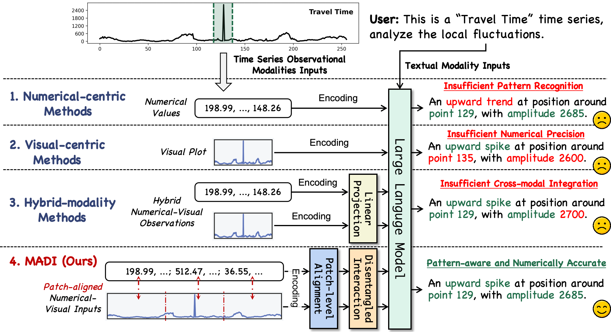

**图 1：论文对 numerical-centric、visual-centric、hybrid 和 MADI 的比较。绿色是正确部分，红色是错误部分。**

### 2.1 只输入数值：精确，但不擅长看结构

数值序列保留了每个观测值，适合精确计算位置和幅度。但普通 LLM 的预训练主要面向自然语言，对长串数字的 token 化和结构识别都不理想：

- 一个浮点数可能被拆成多个 token，输入成本高；
- 容易忽略周期、趋势和局部形态；
- 能读到数，不代表能稳定识别形状。

### 2.2 只输入曲线图：结构直观，但难以精确读数

视觉语言模型容易识别上升、下降、周期和尖峰，但图像经过渲染、缩放和 patch 化后，精确的索引及幅度会丢失。因此它可能知道“这里有尖峰”，却说错尖峰发生的位置和幅度。

### 2.3 数值和图像直接拼接：信息更多，不一定效果更好

数值和曲线来自同一信号，存在大量重复信息。若只是把两组 token 拼接起来：

- 数值的第 $j$ 个 patch 与图像的第 $j$ 个 patch 未必在表示空间中对应；
- 重复的共有信息可能压过每个模态真正独有的信息；
- 两个分支可能相互干扰，而不是互补。

论文把问题概括为两个挑战：

1. **Fine-grained Cross-modal Alignment**：怎样让不同模态在局部时间范围上精确对齐？
2. **Disentangled Cross-modal Interaction**：对齐之后，怎样去除冗余并融合互补信息？

---

## 3. 核心思想：Consistency 是基础，Complementarity 才是目标

可以把论文标题理解成两步：

### 第一步：Consistency

确认数值、曲线图和文本描述中的第 $j$ 个 patch 都在表达同一段物理信号。它解决的是：

> “这三种表示说的是不是同一个时间区间？”

### 第二步：Complementarity

把两个模态都包含的共有信息提取出来，再从原表示中减掉共有部分，得到模态独有信息：

$$
\text{Unique} = \text{Original} - \text{Common}
$$

它解决的是：

> “数值和图片各自还知道哪些对方不知道的内容？”

其中：

- 数值分支的优势是精确值、幅度和位置；
- 视觉分支的优势是趋势、周期和高层形态；
- 共有部分是两边重复描述的局部动态。

---

## 4. MADI 总体架构

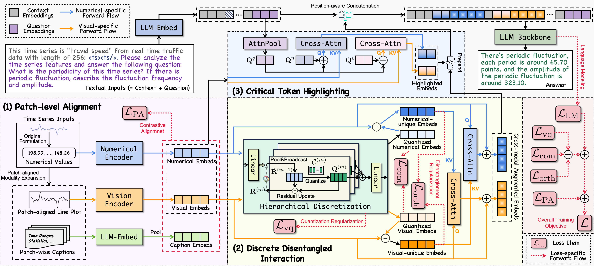

**图 2：MADI 的完整数据流。左下为 Patch-level Alignment，中下为 Discrete Disentangled Interaction，上方为 Critical-token Highlighting，右侧为 LLM 解码与联合训练目标。**

整体流程可以压缩成五步：

```text
原始时间序列
    ↓
数值 patch + 对齐的图像 patch + patch 统计描述
    ↓
PA：把三种局部表示拉到同一语义空间
    ↓
DDI：分离共有/独有信息，并交换独有信息
    ↓
CTH：根据问题和信号本身突出关键 token
    ↓
Qwen2.5-VL-7B-Instruct 生成答案
```

三个模块的分工非常明确：

| 模块 | 全称 | 解决的问题 | 关键词 |
|---|---|---|---|
| PA | Patch-level Alignment | 不同模态的局部位置对不上 | 对齐 |
| DDI | Discrete Disentangled Interaction | 共有信息与独有信息纠缠 | 解耦与互补 |
| CTH | Critical-token Highlighting | 关键局部信号容易被长序列淹没 | 聚焦 |

---

## 5. 模块一：Patch-level Alignment（PA）

### 5.1 Patch-level Modality Expansion

首先把第 $i$ 条时间序列 $x_i$ 切成不重叠的数值 patch：

$$
P_i^n=\operatorname{Patching}(x_i)\in\mathbb{R}^{\tilde T_i\times p_n}
$$

其中 $p_n$ 是数值 patch 的长度，$\tilde T_i$ 是 patch 数量。论文实现中 $p_n=8$。

随后为每个数值 patch 构造两个对应模态。

#### A. Patch-aligned Visualization

作者把序列渲染成一张没有标题、坐标轴、刻度、标签和图例的折线图，并把图片宽度设置成 $\tilde T_i\cdot p_v$，高度设置成 $p_v$。这样视觉编码器切出的每个图像 patch，能够和一个数值 patch 一一对应。

这里的关键不是“把时间序列画成图”，而是**控制渲染尺寸，建立物理位置上的对应关系**。

#### B. Patch-wise Captioning

每个数值 patch 还会生成一段结构化描述，包含：

- 时间范围；
- 最大值、最小值；
- 均值、标准差等统计量。

这些文本相当于数值和语言语义之间的桥梁，并不是由另一个模型自由生成的自然语言描述。

### 5.2 三种编码器

- 数值 patch：轻量级时间序列 Transformer；
- 图像 patch：Qwen2.5-VL 的预训练视觉编码器；
- 文本描述：LLM tokenizer 和 embedding，随后做均值池化。

得到三组形状一致的局部表示：

$$
E_i^n,E_i^v,E_i^s\in\mathbb{R}^{\tilde T_i\times D}
$$

### 5.3 Patch-wise Contrastive Alignment

数值 patch 是 anchor，与它对应的图像 patch、caption patch 是正样本；同一序列中的其他 patch 是负样本。以数值-视觉对齐为例：

$$
\mathcal{L}_{align}^{n-v}
=-\sum_{i,j}\log
\frac{\exp(\operatorname{sim}(e_{i,j}^n,\operatorname{sg}(e_{i,j}^v))/\tau)}
{\sum_{j'}\exp(\operatorname{sim}(e_{i,j}^n,\operatorname{sg}(e_{i,j'}^v))/\tau)}
$$

总对齐损失为：

$$
\mathcal{L}_{PA}=\mathcal{L}_{align}^{n-v}+\mathcal{L}_{align}^{n-s}
$$

作者对视觉和文本表示使用 stop-gradient，主要用它们来监督数值编码器适配已有的视觉-语言语义空间。

> **直觉**  
> 如果第 10 段数值表示的是“突然上升”，那么第 10 段图像和第 10 段统计描述都应靠近它；第 3 段、第 20 段则不应被当成同一事件。

---

## 6. 模块二：Discrete Disentangled Interaction（DDI）

PA 让不同模态“对得上”，但没有解决信息重复。DDI 的目标是：

1. 把数值和视觉的共有信息压缩成稳定、紧凑的表示；
2. 用残差得到各自的独有信息；
3. 只围绕独有信息进行跨模态交互。

### 6.1 为什么使用离散表示？

常见解耦方法在连续空间中用两个投影头分别提取 common 和 unique 表示。但连续空间没有明确边界，容易把噪声和冗余相关性也吸收到 common 分支。

MADI 使用向量量化（Vector Quantization，VQ）：把连续特征映射到一个有限的 codebook。可以把 codebook 理解成一套可学习的“共有模式词典”，例如局部上升、平稳、周期片段或尖峰形态。

离散化带来的归纳偏置是：共有信息必须由有限原型表示，因此更紧凑，也更难无限制地吞入模态特有细节。

### 6.2 Hierarchical Residual Vector Quantization

作者不是只量化一次，而是使用 $M=3$ 层分层 RVQ，从粗到细量化残差：

1. 把 token 投影到较低维空间，论文中 $d=512$；
2. 粗粒度层在较长时间片上池化，捕捉低频和整体结构；
3. 后续层继续量化上一层残差，逐渐捕捉细粒度变化；
4. 多层量化结果相加，形成模态共有表示 $Z^n,Z^v$。

得到共有表示后，独有部分直接由残差分解获得：

$$
U_i^n=E_i^n-Z_i^n,\qquad U_i^v=E_i^v-Z_i^v
$$

### 6.3 解耦正则项

DDI 使用三类约束：

- $\mathcal{L}_{vq}$：量化承诺损失，使连续特征靠近所选 code；
- $\mathcal{L}_{com}$：让数值和视觉的 common 表示相似；
- $\mathcal{L}_{orth}$：让 common 与 unique 尽量正交，减少信息泄漏。

$$
\mathcal{L}_{DDI}=\mathcal{L}_{vq}+\alpha\mathcal{L}_{com}+\beta\mathcal{L}_{orth}
$$

论文设置 $\alpha=5,\beta=1$。

### 6.4 Unique-centric Interaction

最后，每个模态的原始 token 去读取另一模态的独有信息：

$$
\bar E_i^n=E_i^n+\operatorname{CrossAttn}(E_i^n,U_i^v,U_i^v)
$$

$$
\bar E_i^v=E_i^v+\operatorname{CrossAttn}(E_i^v,U_i^n,U_i^n)
$$

- 数值 token 从视觉 unique 中补充高层结构；
- 视觉 token 从数值 unique 中补充精确细节；
- 已经共有的内容不再被重复交换。

> **这是全篇最值得讲清楚的一点：**  
> MADI 不是“先把两个模态分开，再各做各的”，而是“先提取共有部分，再让两个分支围绕剩余的独有部分互相补充”。

---

## 7. 模块三：Critical-token Highlighting（CTH）

即使 PA 和 DDI 得到了对齐、互补的 token，长序列中的关键点仍可能被 LLM 忽略。CTH 使用两条并行分支产生少量高亮 token。

### 7.1 Question-conditioned Branch

先把问题压缩成 $H$ 个可学习 query，再由这些 query 从数值和视觉 token 中读取与问题相关的信息。

例如，问题问“周期多长”时，应关注重复形态；问题问“尖峰发生在哪里”时，应关注局部极值。

### 7.2 Modality-intrinsic Branch

另一组可学习 query 不看问题，只寻找模态本身显著的模式，例如尖峰、转折或异常波动。

### 7.3 Prepend，而不是丢弃

两条分支的结果相加并放到原 token 序列前面。CTH 不删除任何原始 token，而是增加一份“重点摘要”，降低关键信息被长上下文稀释的风险。

---

## 8. 训练目标与实现细节

MADI 以 Qwen2.5-VL-7B-Instruct 为骨干，完整目标为：

$$
\mathcal{L}=\mathcal{L}_{LM}+\lambda_1\mathcal{L}_{PA}+\lambda_2\mathcal{L}_{DDI}
$$

论文设置 $\lambda_1=0.02,\lambda_2=0.2$。

主要训练配置：

| 项目 | 设置 |
|---|---|
| 数值 patch size | 8 |
| 统一 embedding 维度 $D$ | 3584 |
| VQ 维度 $d$ | 512 |
| 分层 codebook 数 | 3 |
| 优化器 | AdamW |
| 学习率 | $1\times10^{-5}$，cosine scheduler |
| 训练步数 | 1200 |
| 训练硬件 | 4 × NVIDIA A800 |
| 有效 batch size | $4\times2\times64=512$ |
| 解码温度 | 0.01 |

训练初始 2% 的 warm-up 阶段冻结 LLM 和视觉编码器，只训练新增模块；之后解冻全部参数进行全量微调。

### Statistics-Preserved Prompt

模型会先对时间序列做零中心归一化。为了恢复原始量纲，作者把以下统计信息直接写进提示词：

```text
[offset=... | scaling=... | length=... | max=... |
 min=... | left=... | right=...]
```

这能帮助模型回答精确数值问题，但也是评价实验时必须注意的设计：某些关于最大值、最小值或首尾值的问题，答案的一部分已经显式出现在 prompt 中。

---

## 9. 实验设计

### 9.1 数据集

论文使用 ChatTS 发布的训练和评测数据。

训练数据以合成为主，生成属性包括：

- Trend；
- Periodicity；
- Noise；
- Local Fluctuations，例如尖峰和相位变化。

同时使用 Time Series Evol-Instruct（TSEvol）从种子问答逐步演化出更复杂的问题。

评测集包含合成数据和真实数据。真实数据来自：

- AIOps；
- 天气；
- 金融；
- 交通流。

论文称真实数据由领域专家人工标注，用于测试分布外泛化。

### 9.2 任务

| 大类 | 子任务 |
|---|---|
| Understanding | Noise、Local Fluctuation、Seasonality、Trend、Correlation、Clustering |
| Reasoning | Inductive、Deductive、Causal、Comparison |

### 9.3 基线

作者按照输入模态把基线分成三组：

1. **Numerical-centric**：GPT-4o、Qwen3、DeepSeek-V3.2、Gemini 3 Pro、GPT-5.2，以及 ChatTime、ChatTS、ITFormer、InstructTime；
2. **Visual-centric**：GPT-4o、Qwen3-VL、Gemini 3 Pro、GPT-5.2；
3. **Numerical + Visual**：上述通用模型和 GEM。

时间序列专用模型被统一到 Qwen2.5-7B-Instruct 或 Qwen2.5-VL-7B-Instruct，并使用相同训练数据和实验环境；这一组比较比闭源 API 模型之间的比较更公平。

### 9.4 指标

- 分类问题：Accuracy 或 F1；
- 数值问题：Relative Accuracy；
- 开放式推理：RAGAS Answer Correctness，由 GPT-4o-mini 抽取标准答案中的关键事实并计算覆盖率。

数值指标为：

$$
Acc_{rel}=\max\left(0,1-\frac{|v_{pred}-v_{label}|}{|v_{label}|}\right)
$$

---

## 10. 主实验结果

### 10.1 Understanding

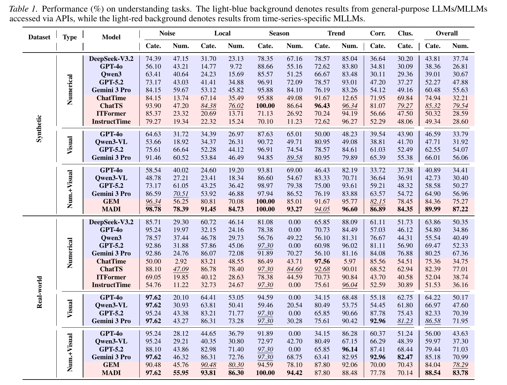

**表 1：合成数据和真实数据上的理解任务。蓝色为通用 LLM/MLLM，红色为时间序列专用模型。**

建议汇报时只强调下面四个总体数字：

| 数据 | 指标 | MADI | 最强对比结果 | 绝对提升 |
|---|---:|---:|---:|---:|
| Synthetic | Overall Categorical | 89.99 | 85.32（ChatTS） | +4.67 |
| Synthetic | Overall Numerical | 87.22 | 79.54（ChatTS） | +7.68 |
| Real-world | Overall Categorical | 88.54 | 86.58（Gemini 3 Pro, Visual） | +1.96 |
| Real-world | Overall Numerical | 83.78 | 78.29（GEM） | +5.49 |

可以得到四个观察：

1. MADI 的总体结果最好，数值问题上的提升尤其明显；
2. 对通用模型而言，visual-only 经常优于 numerical-only；
3. numerical + visual 的简单拼接经常不如 visual-only，支持作者“结构化融合是必要的”的论点；
4. 合成数据上很强的专用模型，在真实数据的相关性和聚类等任务上可能明显退化。

但不要把结果讲成“每一项都第一”：MADI 在真实数据的趋势、相关性和聚类等个别单元格中并非最佳。

### 10.2 Reasoning

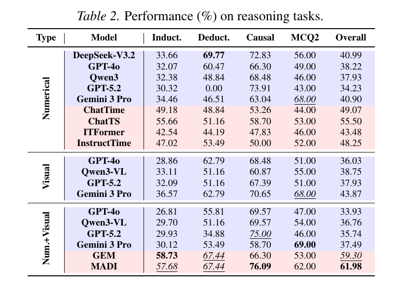

**表 2：推理任务结果。MADI 的 Overall 为 61.98，GEM 为 59.30。**

- MADI 总体得分：**61.98**；
- 最强整体基线 GEM：**59.30**；
- 绝对提升：**2.68**；
- MADI 的 causal reasoning 为 **76.09**，是表中最高结果；
- MADI 的 inductive reasoning（57.68）略低于 GEM（58.73），deductive reasoning 与 GEM 持平（67.44）。

这说明 MADI 是**综合结果最好**，但还没有在所有高级推理类型上形成压倒性优势。推理任务整体也明显难于基础理解任务。

### 10.3 Token 成本

论文附录给出的真实数据理解任务平均 token 成本：

| 方法 | 平均 token 数 |
|---|---:|
| 通用模型 Numerical + Visual | 约 7,699-10,801 |
| GEM | 1,174.99 |
| MADI | 1,517.79 |

MADI 不是 token 最少的方法，但远低于把长数字序列和图片直接拼给通用 MLLM 的成本，性能-成本折中较好。

---

## 11. 消融实验与表示分析

### 11.1 消融实验：三个主模块是否真的有用？

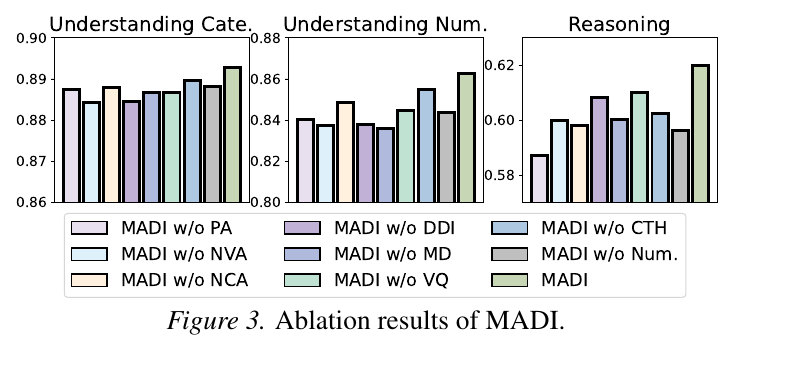

**图 3：完整 MADI 在类别理解、数值理解和推理三个总体指标上均最高。**

图例中的主要变体：

- w/o PA：去掉 patch-level alignment；
- w/o DDI：去掉离散解耦交互；
- w/o CTH：去掉关键 token 高亮；
- w/o NVA：去掉 numerical-visual alignment；
- w/o NCA：去掉 numerical-caption alignment；
- w/o MD：去掉 modality disentanglement；
- w/o VQ：用连续共享编码器替代分层离散化；
- w/o Num.：去掉数值模态。

关键结论：

1. 去掉 PA 或 DDI 都会下降，说明“先对齐、再互补”两步缺一不可；
2. 去掉 PA 对推理的影响最明显，局部错误会向高级推理传播；
3. numerical-visual 和 numerical-caption 两种对齐同时使用最好；
4. 用连续编码器替代 VQ 会下降，支持离散 common space 的设计；
5. 去掉数值输入会下降，说明视觉形态不能完全替代精确数值。

### 11.2 PA 是否真的实现了局部对齐？

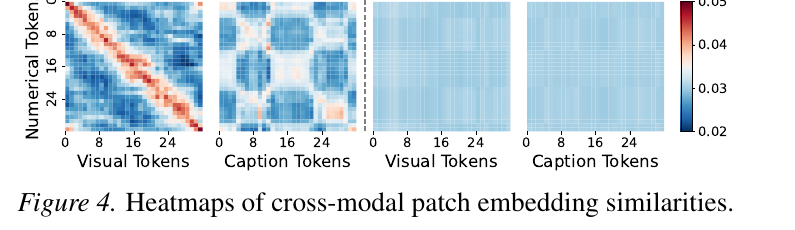

**图 4：左侧为完整 MADI，右侧为去掉 PA。**

- 数值-视觉矩阵出现明显高相似度对角线，说明相同位置的 patch 被拉近；
- 去掉 PA 后，对角结构基本消失；
- 数值-caption 的对齐比数值-视觉弱，作者认为原因是模板化 caption 之间高度重复，导致局部文本难以区分。

这是对 PA 最直接的表示层证据。不过它展示的是一个可视化案例，而不是全测试集上的对齐统计。

### 11.3 DDI 是否真的分离了 common 和 unique？

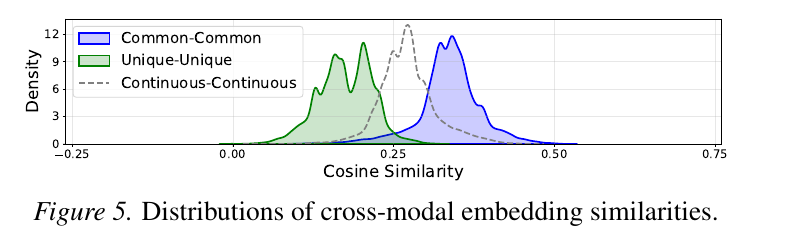

**图 5：蓝色为 common-common，绿色为 unique-unique，灰色虚线为原始 continuous-continuous。**

- common-common 分布向右移动：两个模态的共有表示更相似；
- unique-unique 分布向左移动：两个模态的独有残差相关性更低；
- 原始连续表示位于两者之间。

这与作者期望的解耦方向一致：共享信息被集中进 common space，剩余 unique 表示保留差异。

---

## 12. 案例分析

### 12.1 噪声识别

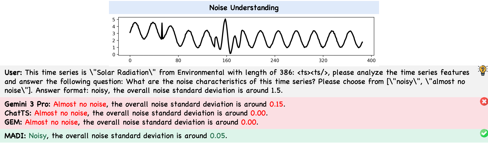

**图 6：在太阳辐射序列上，Gemini 3 Pro、ChatTS 和 GEM 都判断为几乎无噪声，MADI 判断为 noisy，并给出标准差约 0.05。**

这个案例体现了数值局部信息的重要性：视觉上明显的周期结构容易掩盖叠加其上的细微高频噪声。

### 12.2 局部形态与位置识别

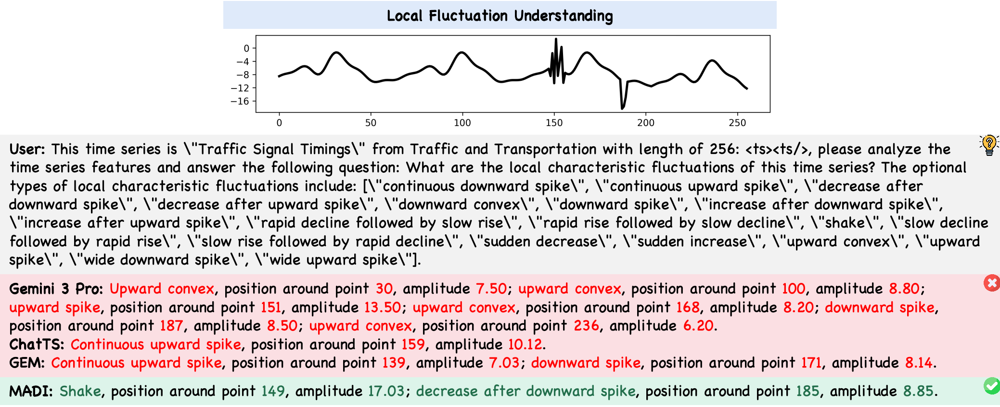

**图 7：MADI 定位出约第 149 点的 shake，以及第 185 点的 decrease after downward spike。**

这对应论文最核心的能力主张：视觉分支负责识别形态，数值分支负责校准位置和幅度，patch 对齐减少“形状对、位置错”的局部幻觉。

### 12.3 多变量相关性与归纳推理

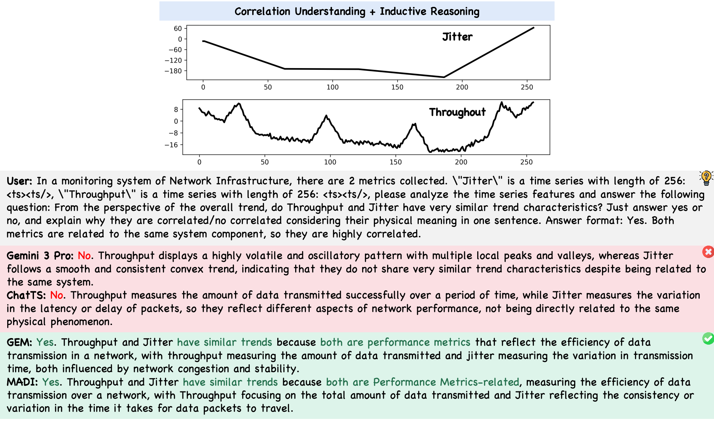

**图 10：MADI 和 GEM 能越过局部平滑度差异，从整体趋势与网络业务语义出发判断 Jitter 和 Throughput 相关。**

这个案例也提醒我们：MADI 并不是唯一正确模型，GEM 同样回答正确。案例图更适合说明能力类型，不能替代整体统计结果。

### 12.4 规则约束下的演绎推理

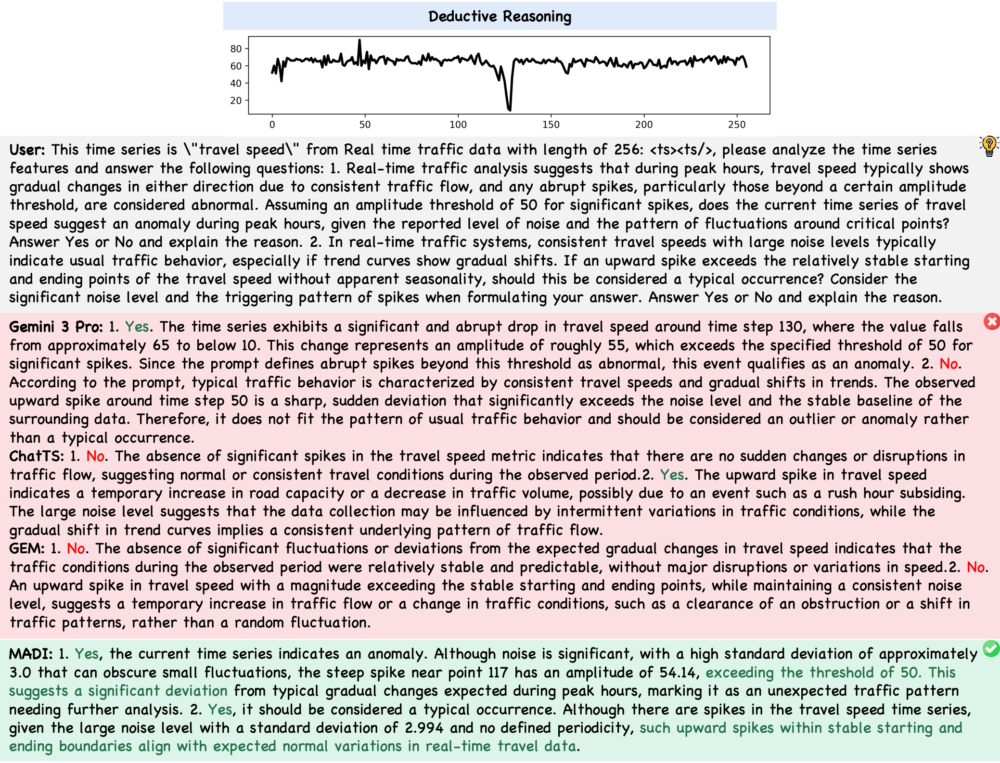

**图 13：问题给定尖峰幅度阈值 50。MADI 识别约第 117 点、幅度 54.14 的异常，并结合噪声条件回答后续问题。**

这一案例要求模型同时完成局部定位、数值比较和条件推理，比单纯识别趋势更接近真实告警分析。

---

## 13. 如何评价这篇论文？

### 13.1 优点

#### 1. 问题定义清楚

论文没有泛泛地说“多模态有帮助”，而是把失败原因拆成：

- patch 级位置没有对齐；
- 共有信息和模态独有信息发生纠缠。

两个问题分别由 PA 和 DDI 对应解决，动机、方法和实验形成闭环。

#### 2. “先对齐，再解耦，后交互”的顺序合理

如果还没有确认两个模态的局部对应关系，就直接做 common/unique 分解，得到的共有空间可能没有物理意义。因此 PA 在 DDI 之前是合理的结构选择。

#### 3. 对数值精度和视觉抽象进行了明确分工

论文充分利用两种表征的归纳偏置，而不是假设一种模态可以完全替代另一种。

#### 4. 证据链相对完整

不仅有主实验，还有：

- 模块消融；
- patch 相似度热力图；
- common/unique 分布；
- token 成本分析；
- 多种真实案例。

### 13.2 局限与可能被追问的点

#### 1. 训练数据主要是合成数据

真实评测覆盖 AIOps、天气、金融和交通，但仍来自 ChatTS 的同一套数据构建体系。能否泛化到医疗长序列、高频金融数据、缺失值或不规则采样，还没有充分证明。

#### 2. Patch caption 带有明显的人工特征工程

每个 patch 的 max、min、mean、std 是确定性统计特征。性能提升究竟来自真正的跨模态学习，还是部分来自把有用统计量显式喂给模型，需要更细的对照实验。

#### 3. Statistics-Preserved Prompt 可能形成数值捷径

全局 max、min、left、right 被直接放进提示词。这对恢复归一化前的量纲是合理的，但也会让部分数值题变简单。最好报告去掉这些字段后的分任务结果。

#### 4. 开放式推理依赖 LLM-as-a-Judge

Answer Correctness 由 GPT-4o-mini 判断。该指标比关键词匹配合理，但仍可能偏好特定表达方式，论文没有同步报告系统性人工复核结果。

#### 5. 缺少统计显著性

论文没有报告多随机种子均值、标准差或置信区间。部分总体提升只有 1-3 个百分点，是否稳定仍需复现。

#### 6. 并非所有子任务都领先

MADI 的主要优势体现在总体分数和数值理解，但在若干归纳、趋势、相关性或选择题子项上没有取得第一。结论应表述为“综合效果最好”，不是“所有任务全面领先”。

#### 7. 可解释性仍然有限

相似度热力图和 KDE 分布说明表示朝预期方向变化，但还不能证明 codebook 中每个离散 code 具有稳定、可读的时间序列语义。

#### 8. 复现材料尚不完整

截至 2026-09-03，公开的 [MADI GitHub 仓库](https://github.com/KennyNH/MADI)为空。论文给出了较详细的超参数，但训练数据处理、codebook 配置和完整实现仍需代码补齐。

---

## 14. 可以继续做什么？

### 方向一：验证真正的跨数据集泛化

- 在 TimeSeriesExam、TSRBench、MTBench 等独立基准上测试；
- 增加不规则采样、缺失值、不同序列长度和不同采样频率；
- 做跨领域训练-测试拆分，而不是只在同一数据生成体系内拆分。

### 方向二：减少统计信息捷径

- 分别移除 patch caption 和 statistics-preserved prompt；
- 只提供归一化参数，不直接提供 max/min/left/right；
- 区分“模型自己算出的统计量”和“提示词直接给出的统计量”。

### 方向三：让离散 codebook 更可解释

- 可视化每个 code 对应的典型时间序列片段；
- 检查 code 是否稳定对应趋势、周期、尖峰等语义；
- 测试 codebook 在不同领域间能否共享。

### 方向四：面向金融场景扩展

- 数值分支保留收益率、成交量和波动率等精确信息；
- 视觉分支识别形态、状态切换与多尺度结构；
- 文本分支加入事件、公告和宏观背景；
- 重点防止未来信息泄漏，并按时间顺序进行严格回测。

---

## 15. 汇报结论

最后可以用三句话收束：

1. **MADI 解决的不是“要数值还是要图片”，而是怎样让两者正确协作。**
2. **PA 建立局部一致性，DDI 提取并交换互补信息，CTH 把关键片段送到 LLM 注意力前排。**
3. **实验支持该设计在总体理解和推理上有效，但真实泛化、数值捷径、统计显著性和复现性仍需进一步验证。**

---

## 16. 可能的 Q&A

### Q1：为什么一定要先对齐，再解耦？

因为没有局部对齐时，数值的第 $j$ 段和图像的第 $j$ 段可能并不表示同一事件。此时提取出的 common feature 未必是物理上共有的语义。PA 先建立局部参照系，DDI 才能有意义地分离共有和独有信息。

### Q2：为什么 VQ 比普通连续投影更适合 common space？

VQ 使用有限 codebook，对 shared feature 施加了信息瓶颈，使其倾向于表达反复出现、跨模态稳定的模式，减少把噪声和模态私有细节都吸收进 common 分支的风险。但这是一种归纳偏置，不代表理论上必然优于连续空间，最终仍依赖消融实验支持。

### Q3：Patch caption 算不算第三个模态？

形式上是文本模态，但它由数值确定性生成，更接近“数值统计语义桥梁”而非独立观测模态。它帮助数值编码器进入 LLM 熟悉的语言空间，也可能带来手工特征捷径。

### Q4：为什么 CTH 不直接删掉不重要的 token？

硬筛选一旦选错会丢失信息。CTH 保留原 token，只把少量重点摘要 prepend 到序列前面，风险更低，但会略微增加 token 成本。

### Q5：这篇论文能直接用于时间序列预测吗？

不能直接等价。论文面向观察序列上的自然语言理解与推理，输出是文本；预测任务通常要求未来数值和专门的预测损失。PA/DDI 的多模态思想可以迁移，但模型头、训练目标和评测方式都需要重新设计。

### Q6：最有说服力的实验是哪一个？

主结果说明总体有效；真正对应论文方法主张的是图 4 和图 5：图 4 验证 patch 对齐，图 5 验证 common/unique 表示朝相反方向分离。两者共同支撑“从 consistency 到 complementarity”的核心叙事。

---

## 17. 参考资料与图片来源

1. Ni, H., Zhang, W., Wang, F., Shao, Z., & Liu, H. *From Consistency to Complementarity: Aligned and Disentangled Multi-modal Learning for Time Series Understanding and Reasoning*. arXiv:2601.21436, 2026.
2. 本文档中的图 1-图 7、图 10、图 13及表 1-表 2均截取自论文原文，仅用于学术技术分享。
3. 论文使用的训练与评测数据来自 ChatTS：Xie et al., 2025。

