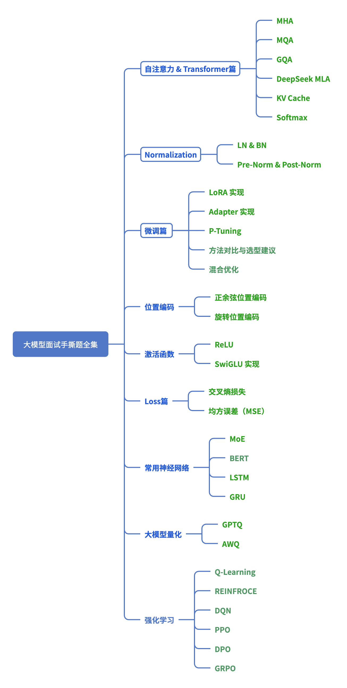

专题重要等级：**<span style="color: rgb(216,57,49); background-color: inherit">非常重要</span> <span style="color: rgb(36,91,219); background-color: inherit">，</span> <span style="color: rgb(222,120,2); background-color: inherit">重要</span> <span style="color: rgb(36,91,219); background-color: inherit">，</span> <span style="color: rgb(220,155,4); background-color: inherit">一般，</span> <span style="color: rgb(100,37,208); background-color: inherit">非常重要和重要必须要掌握，尤其是MHA和Lora</span>**，一般等级根据情况来掌握



# 1. **<span style="color: rgb(36,91,219); background-color: inherit">自注意力 &amp; Transformer篇</span> <span style="color: rgb(36,91,219); background-color: inherit">  </span>`非常重要` &#x20;**&#x20;    &#x20;

## <span style="color: rgb(46,161,33); background-color: inherit">MHA</span>**<span style="color: rgb(46,161,33); background-color: inherit">（Multi-head Attention）                                                                    </span>**

> 自注意力的数学计算过程如下：
>
> * **<span style="color: rgb(36,91,219); background-color: inherit">输入表示</span>**：假设输入序列为 $$
>   X = [x_1, x_2, \dots, x_n]$，每个$x_i
   >   $X$是一个向量。
>
> * **<span style="color: rgb(36,91,219); background-color: inherit">线性变换</span>**：将输入$X$ 映射到查询（Query）、键（Key）和值（Value）：
>
>   $Q = XW^Q, \quad K = XW^K, \quad V = XW^V$
>
> 其中，$W^Q$、$W^K$ 和 $W^V$ 是学习到的权重矩阵。
>
> * **<span style="color: rgb(36,91,219); background-color: inherit">计算注意力权重</span>**：计算查询和键的点积，得到注意力权重矩阵：
>
>   $A=softmax(QKTdk)A = \text{softmax}\left( \frac{QK^T}{\sqrt{d_k}} \right)$$
>
> 其中 $d_k $ 是键的维度，用于缩放点积，避免过大的值导致梯度消失。
>
> * **<span style="color: rgb(36,91,219); background-color: inherit">加权求和</span>**：将注意力权重矩阵与值矩阵相乘，得到最终的输出：
>
>   $\text{Output} = A \times V$
>
> * **<span style="color: rgb(36,91,219); background-color: inherit">残差连接</span>**：在实际操作中，输出通常与输入进行残差连接，并通过一个前馈神经网络进一步处理。

**<span style="color: rgb(222,120,2); background-color: inherit">代码实现</span>**

```python
import torch
import torch.nn as nn
import torch.nn.functional as F

class MultiHeadSelfAttention(nn.Module):
    def __init__(self, embed_size, heads):
        super(MultiHeadSelfAttention, self).__init__()
        self.embed_size = embed_size
        self.heads = heads
        self.head_dim = embed_size // heads
        
        assert self.head_dim * heads == embed_size, "Embedding size must be divisible by number of heads"
        
        # 定义Q, K, V的线性变换
        self.query = nn.Linear(self.head_dim, self.head_dim, bias=False)
        self.key = nn.Linear(self.head_dim, self.head_dim, bias=False)
        self.value = nn.Linear(self.head_dim, self.head_dim, bias=False)
        
        # 输出线性变换
        self.fc_out = nn.Linear(heads * self.head_dim, embed_size)
    
    def forward(self, values, keys, query, mask=None):
        N = query.shape[0]  # batch size
        value_len, key_len, query_len = values.shape[1], keys.shape[1], query.shape[1]
        
        # 将输入分成多头
        values = values.reshape(N, value_len, self.heads, self.head_dim)
        keys = keys.reshape(N, key_len, self.heads, self.head_dim)
        query = query.reshape(N, query_len, self.heads, self.head_dim)
        
        values = values.permute(2, 0, 1, 3)  # (heads, batch_size, value_len, head_dim)
        keys = keys.permute(2, 0, 1, 3)      # (heads, batch_size, key_len, head_dim)
        query = query.permute(2, 0, 1, 3)    # (heads, batch_size, query_len, head_dim)
        
        # 计算注意力得分
        energy = torch.einsum("hqkd,hqkd->hqk", [query, keys])  # (heads, batch_size, query_len, key_len)
        
        if mask is not None:
            energy = energy.masked_fill(mask == 0, float("-1e20"))
        
        attention = torch.softmax(energy / (self.embed_size ** (1 / 2)), dim=-1)  # (heads, batch_size, query_len, key_len)
        
        # 加权求和
        out = torch.einsum("hqk,hkvd->hqvd", [attention, values])  # (heads, batch_size, query_len, head_dim)
        
        out = out.permute(1, 2, 0, 3).contiguous().view(N, query_len, self.heads * self.head_dim)
        
        # 通过输出层
        out = self.fc_out(out)
        
        return out

# 示例：使用该模块
embed_size = 256  # 嵌入维度
heads = 8  # 注意力头数
seq_len = 10  # 序列长度
batch_size = 32  # 批次大小

# 随机生成输入（查询、键、值）
values = torch.rand(batch_size, seq_len, embed_size)
keys = torch.rand(batch_size, seq_len, embed_size)
query = torch.rand(batch_size, seq_len, embed_size)

# 创建多头自注意力层实例
attention = MultiHeadSelfAttention(embed_size, heads)

# 通过模型计算输出
output = attention(values, keys, query)
print(output.shape)  # 输出形状: (batch_size, seq_len, embed_size)

```

## <span style="color: rgb(46,161,33); background-color: inherit">MQA</span>**<span style="color: rgb(46,161,33); background-color: inherit">（Multi-Query Attention）​                                                                  </span>**

> **公式**：
>
> 在多查询注意力机制中，所有的查询共享同一组键和值。具体步骤如下：
>
> * **<span style="color: rgb(36,91,219); background-color: inherit">线性变换</span>**：将输入的查询映射到多个子空间。
>
> $Q_i = X W_{Q_i} \quad \text{for} \quad i = 1, \dots, h$
>
> * **<span style="color: rgb(36,91,219); background-color: inherit">共享键和值</span>**：所有头共享同一组键和值。
>
> $K = X W_K, \quad V = X W_V$
>
> * **<span style="color: rgb(36,91,219); background-color: inherit">计算注意力</span>**：对每个头，计算注意力权重并加权求和。
>
> $\text{Attention}_i = \text{softmax}\left( \frac{Q_i K^T}{\sqrt{d_k}} \right) V$
>
> * **<span style="color: rgb(36,91,219); background-color: inherit">拼接和线性变换</span>**：将所有头的输出拼接，并通过线性变换得到最终输出。
>
> $\text{Output} = \text{Concat}(\text{Attention}_1, \dots, \text{Attention}_h) W_O$

**<span style="color: rgb(222,120,2); background-color: inherit">代码实现</span>**

```python
import torch
import torch.nn as nn

class MultiQueryAttention(nn.Module):
    def __init__(self, embed_size, num_heads):
        super(MultiQueryAttention, self).__init__()
        self.num_heads = num_heads
        self.head_dim = embed_size // num_heads
        assert self.head_dim * num_heads == embed_size, "Embedding size must be divisible by number of heads"
        self.q_linear = nn.ModuleList([nn.Linear(embed_size, self.head_dim) for _ in range(num_heads)])
        self.k_linear = nn.Linear(embed_size, self.head_dim)
        self.v_linear = nn.Linear(embed_size, self.head_dim)
        self.o_linear = nn.Linear(embed_size, embed_size)
    def forward(self, x):
        batch_size = x.size(0)
        q = [q_linear(x) for q_linear in self.q_linear]
        k = self.k_linear(x)
        v = self.v_linear(x)
        q = torch.stack(q, dim=1)
        k = k.unsqueeze(1).expand(-1, self.num_heads, -1, -1)
        v = v.unsqueeze(1).expand(-1, self.num_heads, -1, -1)
        attention_scores = torch.matmul(q, k.transpose(-2, -1)) / torch.sqrt(torch.tensor(self.head_dim, dtype=torch.float32))
        attention_weights = torch.nn.functional.softmax(attention_scores, dim=-1)
        
```

## **<span style="color: rgb(46,161,33); background-color: inherit">GQA（Group-Query Attention）                                                              </span>**

> GQA（Grouped Query Attention）是一种在大型语言模型中介于多查询注意力（MQA）和多头注意力（MHA）之间的注意力机制。 它通过将查询头分组，每组共享键（Key）和值（Value），在保持模型质量的同时，显著降低计算和内存需求。
>
> * **<span style="color: rgb(36,91,219); background-color: inherit">GQA的原理</span>：**&#x5728;标准的多头注意力（MHA）中，每个查询头都有独立的键和值。 而在GQA中，查询头被划分为多个组，每组共享相同的键和值。 这种方式减少了键和值的数量，从而降低了计算和内存开销。
>
>

**<span style="color: rgb(222,120,2); background-color: inherit">代码</span> <span style="color: rgb(222,120,2); background-color: inherit">实现</span>**

```python
import torch
import torch.nn.functional as F
from einops import rearrange

class GroupedQueryAttention(torch.nn.Module):
    def __init__(self, embed_dim, num_heads, num_groups):
        super(GroupedQueryAttention, self).__init__()
        self.embed_dim = embed_dim
        self.num_heads = num_heads
        self.num_groups = num_groups
        self.head_dim = embed_dim // num_heads

        # 定义线性变换层
        self.query_proj = torch.nn.Linear(embed_dim, embed_dim)
        self.key_proj = torch.nn.Linear(embed_dim, num_groups * self.head_dim)
        self.value_proj = torch.nn.Linear(embed_dim, num_groups * self.head_dim)
        self.out_proj = torch.nn.Linear(embed_dim, embed_dim)

    def forward(self, x):
        batch_size, seq_len, _ = x.size()

        # 线性变换
        q = self.query_proj(x)  # (batch_size, seq_len, embed_dim)
        k = self.key_proj(x)    # (batch_size, seq_len, num_groups * head_dim)
        v = self.value_proj(x)  # (batch_size, seq_len, num_groups * head_dim)

        # 重塑张量以适应多头注意力
        q = rearrange(q, 'b n (g h) -> b g n h', g=self.num_groups)  # (batch_size, num_groups, seq_len, head_dim)
        k = rearrange(k, 'b n (g h) -> b g n h', g=self.num_groups)  # (batch_size, num_groups, seq_len, head_dim)
        v = rearrange(v, 'b n (g h) -> b g n h', g=self.num_groups)  # (batch_size, num_groups, seq_len, head_dim)

        # 计算注意力分数
        attn_scores = torch.matmul(q, k.transpose(-2, -1)) / (self.head_dim ** 0.5)  # (batch_size, num_groups, seq_len, seq_len)
        attn_weights = F.softmax(attn_scores, dim=-1)

        # 加权求和
        attn_output = torch.matmul(attn_weights, v)  # (batch_size, num_groups, seq_len, head_dim)
        attn_output = rearrange(attn_output, 'b g n h -> b n (g h)')  # (batch_size, seq_len, embed_dim)

        # 输出投影
        output = self.out_proj(attn_output)  # (batch_size, seq_len, embed_dim)
        return output

```

**代码说明：**

1. **<span style="color: rgb(36,91,219); background-color: inherit">初始化</span>：**

   * `embed_dim`：嵌入维度。

   * `num_heads`：注意力头的数量。

   * `num_groups`：查询头的组数。

   * `head_dim`：每个头的维度。

2. **<span style="color: rgb(36,91,219); background-color: inherit">线性变换</span>：**

   * `query_proj`、`key_proj`和`value_proj`分别用于将输入映射到查询、键和值的空间。

3. **<span style="color: rgb(36,91,219); background-color: inherit">重塑张量</span>：**

   * 使用`einops`库的`rearrange`函数，将张量重塑为适合多头注意力的形状。

4. **<span style="color: rgb(36,91,219); background-color: inherit">计算注意力</span>：**

   * 计算查询和键的点积，得到注意力分数。

   * 对注意力分数进行softmax归一化，得到注意力权重。

   * 使用注意力权重对值进行加权求和，得到注意力输出。

5. **<span style="color: rgb(36,91,219); background-color: inherit">输出投影</span>：**

   * 通过`out_proj`线性层，将注意力输出映射回原始嵌入空间。

## **<span style="color: rgb(46,161,33); background-color: inherit">MLA（Multi-head Latent Attention） </span>`DeepSeek`**

> **核心特性整合说明**
>
> 1. **<span style="color: rgb(36,91,219); background-color: inherit">低秩</span> <span style="color: rgb(36,91,219); background-color: inherit"> </span> <span style="color: rgb(36,91,219); background-color: inherit">KV</span> <span style="color: rgb(36,91,219); background-color: inherit"> </span> <span style="color: rgb(36,91,219); background-color: inherit">压缩</span>**
>
>    1. 通过共享的$W^{DKV}$将键值矩阵压缩到低维空间（如4096→256）
>
>    2. 使用独立的$W^{UK}$和$W^{UV}$恢复 Key/Value 矩阵
>
> 2. **<span style="color: rgb(36,91,219); background-color: inherit">解耦式</span> <span style="color: rgb(36,91,219); background-color: inherit"> </span> <span style="color: rgb(36,91,219); background-color: inherit">RoPE</span>**
>
>    1. 仅对&#x524D;**`rope_dim`**&#x4E2A;维度应用旋转位置编码
>
>    2. 剩余维度保持与位置无关（增强低秩压缩后的表达能力）
>
> 3. **<span style="color: rgb(36,91,219); background-color: inherit">内存优化</span>**
>
>    1. KV 缓存体积减少约93%（存&#x50A8;**`compressed_kv`**&#x800C;非完整 KV）
>
>    2. 支持长序列推理（需结合分页管理扩展）

**<span style="color: rgb(222,120,2); background-color: inherit">代码实现</span>**

```python
import torch
import torch.nn as nn
import math

class MultiHeadLatentAttention(nn.Module):
    def __init__(self, hidden_size=4096, num_heads=16, low_rank_ratio=16, rope_dim=128):
        super().__init__()
        self.hidden_size = hidden_size
        self.num_heads = num_heads
        self.head_dim = hidden_size // num_heads
        self.low_rank = hidden_size // low_rank_ratio  # 低秩压缩维度（默认256）

        # 低秩KV压缩矩阵
        self.w_dkv = nn.Linear(hidden_size, self.low_rank)       # 共享的降维投影
        self.w_uk = nn.Linear(self.low_rank, hidden_size)       # Key恢复
        self.w_uv = nn.Linear(self.low_rank, hidden_size)       # Value恢复
        # 解耦式RoPE位置编码
        self.rope_dim = rope_dim                                # 应用RoPE的维度
        self.rope = RotaryPositionEmbedding(self.rope_dim)      # 自定义旋转位置编码
        # 投影矩阵
        self.q_proj = nn.Linear(hidden_size, hidden_size)
        self.o_proj = nn.Linear(hidden_size, hidden_size)

    def forward(self, x, attention_mask=None):
        batch_size, seq_len, _ = x.size()
        # Step 1: 低秩KV压缩
        compressed_kv = self.w_dkv(x)  # [B, S, D/r]
        k = self.w_uk(compressed_kv).view(batch_size, -1, self.num_heads, self.head_dim).transpose(1, 2)
        v = self.w_uv(compressed_kv).view(batch_size, -1, self.num_heads, self.head_dim).transpose(1, 2)
        # Step 2: 查询向量投影
        q = self.q_proj(x).view(batch_size, seq_len, self.num_heads, self.head_dim).transpose(1, 2)
        # Step 3: 解耦式RoPE (仅对部分维度应用)
        q_rope, q_nope = q[..., :self.rope_dim], q[..., self.rope_dim:]
        k_rope, k_nope = k[..., :self.rope_dim], k[..., self.rope_dim:]
        q_rotated = self.rope(q_rope)  # 应用旋转位置编码
        k_rotated = self.rope(k_rope)
        q = torch.cat([q_rotated, q_nope], dim=-1)
        k = torch.cat([k_rotated, k_nope], dim=-1)
        # Step 4: 注意力计算 (简化版)
        attn_scores = torch.matmul(q, k.transpose(-2, -1)) / math.sqrt(self.head_dim)
        if attention_mask is not None:
            attn_scores = attn_scores + attention_mask
        attn_weights = torch.softmax(attn_scores, dim=-1)
        output = torch.matmul(attn_weights, v).transpose(1, 2).contiguous()
        # Step 5: 输出投影
        output = self.o_proj(output.view(batch_size, seq_len, self.hidden_size))
        return output
```

**性能限制说明**

1. 硬件依赖：完整性能需结合CUDA内核优化（如FlashMLA中的分块计算）

2. 精度差异：此简化版未包含动态稀疏激活等DeepSeek专有技术

3. 工程优化：生产环境需添加KV缓存管理、混合精度训练等模块

完整生产级实现请参考官方仓库：https://github.com/deepseek-ai/FlashMLA**​**

## **<span style="color: rgb(46,161,33); background-color: inherit">KV Cache</span>**

> * 在每一层的自注意力机制中，假设输入为查询（Query）、键（Key）和值（Value，则注意力输出的计算公式为：
>
> $A = \text{softmax}\left(\frac{QK^T}{\sqrt{d_k}}\right) V$
>
> 其中，$d_k $ 是键的维度。
>
> * 在推理阶段，使用 KV Cache 时，模型会缓存每一层的键和值。对于第 t 步生成的词元，模型计算当前查询 $Q_t 
>   $与缓存的键 $K_{1:t-1} $ 的注意力权重，然后将当前的键值对 $K_t $ 和$V_t$ 添加到缓存中。下次生成时，模型直接使用缓存的键值对进行计算。

**<span style="color: rgb(222,120,2); background-color: inherit">代码实现</span>**

```python
import torch
import torch.nn as nn
from torch.nn import functional as F

class TransformerDecoderLayerWithCache(nn.Module):
    def __init__(self, d_model, n_head):
        super().__init__()
        self.self_attn = nn.MultiheadAttention(d_model, n_head)
        self.cross_attn = nn.MultiheadAttention(d_model, n_head)
        self.linear1 = nn.Linear(d_model, d_model*4)
        self.linear2 = nn.Linear(d_model*4, d_model)
        self.norm1 = nn.LayerNorm(d_model)
        self.norm2 = nn.LayerNorm(d_model)
        
    def forward(self, x, past_key_value=None):
        # 自注意力层
        residual = x
        q = k = v = self.norm1(x)
        
        if past_key_value is not None:
            past_key, past_value = past_key_value
            k = torch.cat([past_key, k], dim=0)
            v = torch.cat([past_value, v], dim=0)
            
        # 因果掩码生成
        seq_len = k.size(0)
        causal_mask = torch.triu(
            torch.ones(seq_len, seq_len, dtype=torch.bool), 
            diagonal=1
        ).to(x.device)
        
        attn_output, _ = self.self_attn(
            q, k, v,
            attn_mask=causal_mask,
            need_weights=False
        )
        x = residual + attn_output
        
        # FFN层
        residual = x
        x = self.norm2(x)
        x = self.linear2(F.gelu(self.linear1(x)))
        x = residual + x
        
        # 更新缓存（序列维度在dim=0）
        new_key_value = (k, v) if past_key_value is None else None
        return x, new_key_value

class TransformerWithKVCache(nn.Module):
    def __init__(self, n_layer, n_head, d_model):
        super().__init__()
        self.layers = nn.ModuleList([
            TransformerDecoderLayerWithCache(d_model, n_head)
            for _ in range(n_layer)
        ])
        self.position_emb = nn.Embedding(2048, d_model)  # 位置编码
        
    def forward(self, input_ids, past_key_values=None):
        # 输入维度：(seq_len, batch_size)
        seq_len, batch_size = input_ids.shape
        device = input_ids.device
        
        # 生成位置编码
        positions = torch.arange(seq_len, device=device).unsqueeze(1)
        pos_emb = self.position_emb(positions)
        
        # 初始隐藏状态
        x = pos_emb  # 此处简化处理，实际需要token embedding
        
        new_key_values = []
        for i, layer in enumerate(self.layers):
            layer_past = past_key_values[i] if past_key_values else None
            x, kv = layer(x, layer_past)
            new_key_values.append(kv)
            
        return x, new_key_values
        
        
model = TransformerWithKVCache(n_layer=12, n_head=8, d_model=512)
input_ids = torch.randint(0, 1000, (1, 1))  # (seq_len, batch_size)

# 首次推理
output, kv_cache = model(input_ids)

# 后续推理
next_input = torch.randint(0, 1000, (1, 1))
output, new_kv_cache = model(next_input, past_key_values=kv_cache)

```

在上述代码中：

1. 缓存拼接：通过`torch.cat`将历史KV值与当前值拼接（第15-17行）

2. 因果掩码：使用上三角矩阵确保只能看到前文信息（第20-23行）

3. 序列维度：保持KV缓存的序列维度在dim=0（第34行）

4. 位置编码：必需的位置嵌入层（第44行）

5. 层间缓存传递：每层独立维护自己的KV缓存（第55-57行）

## **<span style="color: rgb(46,161,33); background-color: inherit">Softmax</span>**

> 自注意力的数学计算过程如下：
>
> * **<span style="color: rgb(36,91,219); background-color: inherit">输入表示</span>**：假设输入序列为 $$
>   X = [x_1, x_2, \dots, x_n]$，每个$x_i
   >   $X$是一个向量。
>
> * **<span style="color: rgb(36,91,219); background-color: inherit">线性变换</span>**：将输入$X$ 映射到查询（Query）、键（Key）和值（Value）：
>
>   $Q = XW^Q, \quad K = XW^K, \quad V = XW^V$
>
> 其中，$W^Q$、$W^K$ 和 $W^V$ 是学习到的权重矩阵。
>
> * **<span style="color: rgb(36,91,219); background-color: inherit">计算注意力权重</span>**：计算查询和键的点积，得到注意力权重矩阵：
>
>   $A=softmax(QKTdk)A = \text{softmax}\left( \frac{QK^T}{\sqrt{d_k}} \right)$$
>
> 其中 $d_k $ 是键的维度，用于缩放点积，避免过大的值导致梯度消失。
>
> * **<span style="color: rgb(36,91,219); background-color: inherit">加权求和</span>**：将注意力权重矩阵与值矩阵相乘，得到最终的输出：
>
>   $\text{Output} = A \times V$
>
> * **<span style="color: rgb(36,91,219); background-color: inherit">残差连接</span>**：在实际操作中，输出通常与输入进行残差连接，并通过一个前馈神经网络进一步处理。
>
> Softmax 计算公式：
>
> $\text{softmax}(z_i) = \frac{e^{z_i}}{\sum_{j} e^{z_j}}$
>
> 其中$z_i$是输入向量中的元素，$z_j$是该向量中所有元素的值。

**<span style="color: rgb(222,120,2); background-color: inherit">代码实现</span>**

```python
import torch
import torch.nn.functional as F
# 计算softmax
def softmax(input_tensor, dim=-1):
    return F.softmax(input_tensor, dim=dim)
# 示例
input_tensor = torch.tensor([[1.0, 2.0, 3.0],
                             [1.0, 2.0, 3.0]])
output = softmax(input_tensor, dim=-1)
print(output)
```

解释：

* `input_tensor`: 这个是你希望计算 softmax 的输入张量。

* `dim`: 这是指定在什么维度上计算 softmax，通常是对每个样本的每一行进行 softmax 计算，因此通常指定 `dim=-1` 或者 `dim=1`，表示在最后一个维度（即每一行）上进行 softmax。

如果想手动实现 softmax，可以使用如下代码：

```python
import torch
def manual_softmax(input_tensor):
    exp_input = torch.exp(input_tensor - torch.max(input_tensor, dim=-1, keepdim=True).values)
    return exp_input / torch.sum(exp_input, dim=-1, keepdim=True)
# 示例
input_tensor = torch.tensor([[1.0, 2.0, 3.0],
                             [1.0, 2.0, 3.0]])
output = manual_softmax(input_tensor)
print(output)
```

这种方法通过先减去 `torch.max()` 来避免溢出问题，确保数值稳定性。

# 2. **<span style="color: rgb(36,91,219); background-color: inherit">Normalization</span>   &#x20;**&#x20;                                     <span style="color: rgb(216,57,49); background-color: inherit">非常重要</span>

## **<span style="color: rgb(46,161,33); background-color: rgba(183,237,177,0.8)">Layer Normalization &amp; Batch Normalization                                               </span>**

> **Batch Normalization (BN)**:
>
> * BN 是对一个 mini-batch 内的每个特征进行归一化，即对每个特征在 batch 维度上进行标准化。它对每个通道（或特征）计算均值和方差。
>
> * 适用于卷积神经网络（CNN）和具有强烈批次依赖的模型。
>
> **公式**: 对每一维度（特征）进行标准化：
>
> $\hat{x} = \frac{x - \mu_{\text{batch}}}{\sqrt{\sigma_{\text{batch}}^2 + \epsilon}}$
>
> 其中：
>
> * $\mu_{\text{batch}}$ 是该特征在一个 batch 中的均值。
>
> * $\sigma_{\text{batch}}^2$是该特征在一个 batch 中的方差。
>
> * $\epsilon$ 是防止除零错误的一个小常数。
>
> 然后，使用可训练的缩放（$\gamma$）和偏移$\beta$来调整标准化后的结果：
>
> $y = \gamma \hat{x} + \beta$
>
> **Layer Normalization (LN)**:
>
> * LN 是对输入的每一个样本（而非整个 batch）进行归一化。对于每个样本，它对所有特征进行标准化，而不是仅对某个维度（例如通道或特征）。
>
> * 更适用于递归神经网络（RNN）等任务，因为它不依赖于 mini-batch 大小，特别是在 batch size 很小或为 1 时效果更好。
>
> **公式**: 对每个输入样本的所有特征进行标准化：
>
> $\hat{x} = \frac{x - \mu_{\text{layer}}}{\sqrt{\sigma_{\text{layer}}^2 + \epsilon}}$                                                                                                                                                                                                                                                     &#x20;
>
> 其中：
>
> * $\mu_{\text{layer}}$是该样本所有特征的均值。
>
> * $\sigma_{\text{layer}}^2$ 是该样本所有特征的方差。
>
> * $\epsilon$是防止除零错误的一个小常数。
>
> 然后，使用可训练的缩放（$\gamma$）和偏移（$\beta$）来调整标准化后的结果：
>
> $y = \gamma \hat{x} + \beta$

**代码实现**

#### **Batch Normalization**

PyTorch 中实现 Batch Normalization 的代码非常简单，可以通过 `torch.nn.BatchNorm1d`、`BatchNorm2d` 等模块实现。以下是一个 1D 的示例：

```python
import torch
import torch.nn as nn

class BatchNormExample(nn.Module):
    def __init__(self, input_size):
        super(BatchNormExample, self).__init__()
        self.bn = nn.BatchNorm1d(input_size)  # BatchNorm1d 是针对1D数据（如序列数据）
    
    def forward(self, x):
        return self.bn(x)

# 示例
x = torch.randn(20, 10)  # 20个样本，每个样本10个特征
model = BatchNormExample(10)
output = model(x)
print(output)

```

对于 2D 数据（例如图像数据），可以使用 `BatchNorm2d`：

```python
class BatchNorm2dExample(nn.Module):
    def __init__(self, num_features):
        super(BatchNorm2dExample, self).__init__()
        self.bn = nn.BatchNorm2d(num_features)  # BatchNorm2d 用于图像数据（通道数）

    def forward(self, x):
        return self.bn(x)

# 示例
x = torch.randn(20, 3, 28, 28)  # 20个样本，每个样本是28x28的RGB图像
model = BatchNorm2dExample(3)  # 3个通道
output = model(x)
print(output)

```

#### **Layer Normalization**

Layer Normalization 通常用于 Transformer 或 RNN 等结构。以下是一个实现 Layer Normalization 的代码示例：

```python
import torch
import torch.nn as nn

class LayerNormExample(nn.Module):
    def __init__(self, input_size):
        super(LayerNormExample, self).__init__()
        self.ln = nn.LayerNorm(input_size)  # LayerNorm 是针对每个样本的特征进行归一化
    
    def forward(self, x):
        return self.ln(x)

# 示例
x = torch.randn(20, 10)  # 20个样本，每个样本10个特征
model = LayerNormExample(10)
output = model(x)
print(output)

```


## **<span style="color: rgb(46,161,33); background-color: rgba(183,237,177,0.8)">Pre-Norm &amp; Post-Norm                                                                                  </span>**

> ### **主要区别**
>
> * **Pre-Norm**:&#x20;
>
>   * `LayerNorm` 先应用，确保每一层的输入先进行归一化，再进行后续操作。
>
>   * 可以使得模型在训练时更加稳定，尤其是在较深的网络中。
>
> * **Post-Norm**:&#x20;
>
>   * `LayerNorm` 应用于残差连接后，保持原始的输入和输出之间的尺度。
>
>   * 在一些情况下，`Post-Norm` 可能会有较好的训练效果，尤其是浅层模型。
>
> ### **总结**
>
> * **Pre-Norm** 更有利于训练深层模型，因为归一化先行避免了梯度爆炸/消失问题。
>
> * **Post-Norm** 在实际应用中可能稍微提高了模型的表现，尤其是在小规模的模型和训练数据时。
>
> 两种结构的选择通常取决于模型的规模和训练难度。

Pre-Norm

```python
import torch
import torch.nn as nn
import torch.nn.functional as F

class PreNormLayer(nn.Module):
    def __init__(self, embed_size, num_heads, ff_size):
        super(PreNormLayer, self).__init__()
        
        self.attention = nn.MultiheadAttention(embed_size, num_heads)
        self.feed_forward = nn.Sequential(
            nn.Linear(embed_size, ff_size),
            nn.ReLU(),
            nn.Linear(ff_size, embed_size)
        )
        self.norm1 = nn.LayerNorm(embed_size)
        self.norm2 = nn.LayerNorm(embed_size)
        
    def forward(self, x):
        # Pre-Norm: Apply LayerNorm before the sub-layers
        x_norm = self.norm1(x)
        attention_out, _ = self.attention(x_norm, x_norm, x_norm)
        x = x + attention_out  # Residual connection
        
        x_norm = self.norm2(x)
        ff_out = self.feed_forward(x_norm)
        x = x + ff_out  # Residual connection
        
        return x

```

Post-Norm

```python
import torch
import torch.nn as nn
import torch.nn.functional as F

class PostNormLayer(nn.Module):
    def __init__(self, embed_size, num_heads, ff_size):
        super(PostNormLayer, self).__init__()
        
        self.attention = nn.MultiheadAttention(embed_size, num_heads)
        self.feed_forward = nn.Sequential(
            nn.Linear(embed_size, ff_size),
            nn.ReLU(),
            nn.Linear(ff_size, embed_size)
        )
        self.norm1 = nn.LayerNorm(embed_size)
        self.norm2 = nn.LayerNorm(embed_size)
        
    def forward(self, x):
        # Post-Norm: Apply LayerNorm after the sub-layers
        attention_out, _ = self.attention(x, x, x)
        x = self.norm1(x + attention_out)  # Residual connection and LayerNorm
        
        ff_out = self.feed_forward(x)
        x = self.norm2(x + ff_out)  # Residual connection and LayerNorm
        
        return x

```

RMSNorm

# 3. <span style="color: rgb(36,91,219); background-color: inherit">微调篇</span>                                                        **<span style="color: rgb(216,57,49); background-color: inherit">非常重要</span>**

## <span style="color: rgb(46,161,33); background-color: rgba(183,237,177,0.8)">LoRA 实现                                                                                                         </span>

```python
import torch
import torch.nn as nn

class LoRALayer(nn.Module):
    def __init__(self, in_dim, out_dim, rank=8, alpha=16):
        super().__init__()
        self.rank = rank
        self.alpha = alpha
        
        # 原权重矩阵（冻结）
        self.W = nn.Parameter(torch.randn(out_dim, in_dim), requires_grad=False)
        
        # 低秩矩阵（可训练）
        self.A = nn.Linear(in_dim, rank, bias=False)
        self.B = nn.Linear(rank, out_dim, bias=False)
        
        # 初始化策略
        nn.init.kaiming_uniform_(self.A.weight, a=5**0.5)  # A矩阵随机初始化
        nn.init.zeros_(self.B.weight)                       # B矩阵初始化为零

    def forward(self, x):
        base_output = F.linear(x, self.W)           # 原始权重计算
        delta = self.B(self.A(x)) * (self.alpha / self.rank)  # 带缩放因子的低秩更新
        return base_output + delta

# 替换模型中的线性层（示例：替换BERT的Query和Value矩阵）
def apply_lora(model, target_layers=["query", "value"], rank=8):
    for name, module in model.named_modules():
        if isinstance(module, nn.Linear) and any(layer in name for layer in target_layers):
            parent = model.get_submodule(".".join(name.split(".")[:-1]))
            setattr(parent, name.split(".")[-1], LoRALayer(module.in_features, module.out_features, rank))
```

## **<span style="color: rgb(46,161,33); background-color: rgba(183,237,177,0.8)">Adapter 实现                                                                                                    </span>**

> **核心原理**
>
> 在Transformer层的Feed-Forward Network后插入适配器模块，包含下投影（降维）和上投影（恢复维度）结构。


```python
class Adapter(nn.Module):
    def __init__(self, hidden_dim=768, adapter_size=64):
        super().__init__()
        self.down_proj = nn.Linear(hidden_dim, adapter_size)
        self.up_proj = nn.Linear(adapter_size, hidden_dim)
        self.activation = nn.ReLU()

    def forward(self, x):
        residual = x
        x = self.down_proj(x)
        x = self.activation(x)
        x = self.up_proj(x)
        return residual + x  # 残差连接

# 插入到BERT的Transformer层中
class BertLayerWithAdapter(nn.Module):
    def __init__(self, original_layer):
        super().__init__()
        self.original_layer = original_layer
        self.adapter = Adapter()

    def forward(self, hidden_states, attention_mask):
        outputs = self.original_layer(hidden_states, attention_mask)
        return self.adapter(outputs[0])
```

**优势**：

* **模块化设计**：适配器可插拔，支持多任务共享主干网络。

* **内存优化**：仅需存储少量适配器参数（通常占原模型0.5%-4%）。


## **<span style="color: rgb(46,161,33); background-color: rgba(183,237,177,0.8)">P-Tuning                                                                                                          </span>**

**P-Tuning v1（连续提示编码）**

```python
class PTuning(nn.Module):
    def __init__(self, hidden_size=768, num_virtual_tokens=20):
        super().__init__()
        self.prompt_embeds = nn.Parameter(torch.randn(num_virtual_tokens, hidden_size))
        self.lstm = nn.LSTM(hidden_size, hidden_size//2, bidirectional=True, batch_first=True)
        self.mlp = nn.Sequential(
            nn.Linear(hidden_size, hidden_size),
            nn.ReLU()
        )
        
    def forward(self, input_embeds):
        batch_size = input_embeds.size(0)
        # 扩展虚拟令牌到批次维度并编码
        prompts = self.prompt_embeds.unsqueeze(0).expand(batch_size, -1, -1)
        prompts, _ = self.lstm(prompts)
        prompts = self.mlp(prompts)
        return torch.cat([prompts, input_embeds], dim=1)  # 拼接输入
```

## **P-Tuning v2（多层提示注入）**

```python
class PTuningV2(nn.Module):
    def __init__(self, hidden_size=768, num_layers=12, num_tokens=10):
        super().__init__()
        # 每层独立的虚拟令牌
        self.prompts = nn.ParameterList([
            nn.Parameter(torch.randn(num_tokens, hidden_size)) 
            for _ in range(num_layers)
        ])

    def inject_prompts(self, hidden_states, layer_id):
        prompts = self.prompts[layer_id].unsqueeze(0).expand(hidden_states.size(0), -1, -1)
        return torch.cat([prompts, hidden_states], dim=1)  # 每层前添加提示

# 在Transformer前向传播中调用
def transformer_forward_with_ptuning(layer, hidden_states, layer_id):
    hidden_states = ptuning.inject_prompts(hidden_states, layer_id)
    return layer(hidden_states)
```

**关键改进**：

* **层级控制**：在每层Transformer前注入提示，增强对深层特征的引导。

* **任务适配**：支持分类、生成等多种任务类型。

## **方法对比与选型建议**

| **特性**   | **LoRA** | **Adapter** | **P-Tuning** |
| -------- | -------- | ----------- | ------------ |
| **参数占比** | 0.1%-1%  | 0.5%-4%     | 0.1%-3%      |
| **适用场景** | 全任务微调    | 多任务学习       | 少样本/零样本学习    |
| **计算开销** | 低（仅旁支计算） | 中（残差分支）     | 高（需编码提示）     |
| **典型应用** | 大模型微调    | 跨语言迁移       | 复杂推理任务       |

**选型建议**：

1. **LoRA**：优先用于大模型全参数微调替代方案（如LLaMA、GPT），推荐作用于Query/Value矩阵

2. **Adapter**：适合需要快速切换多任务的场景（如对话系统支持不同领域），建议插入到FFN层后。

3) **P-Tuning**：针对数据稀缺的NLP任务（如法律文本分析），使用v2版本并设置每层10-20个虚拟令牌。

## 混合优化

**LoRA多任务合并**

```python
def merge_lora_weights(model, lora_paths):
    for path in lora_paths:
        lora_weights = torch.load(path)
        for name, param in model.named_parameters():
            if "lora_A" in name or "lora_B" in name:  # 动态加载不同任务的LoRA
                param.data += lora_weights[name]
```

**混合优化（LoRA+P-Tuning）**

```python
class HybridModel(nn.Module):
    def __init__(self, base_model):
        super().__init__()
        self.base_model = apply_lora(base_model)  # 应用LoRA
        self.ptuning = PTuningV2()               # 添加P-Tuning

    def forward(self, inputs):
        inputs = self.ptuning(inputs)
        return self.base_model(inputs)
```


# 4. **<span style="color: rgb(36,91,219); background-color: inherit">位置编码</span>**                                                     <span style="color: rgb(222,120,2); background-color: inherit">一般</span>

## **<span style="color: rgb(46,161,33); background-color: rgba(183,237,177,0.8)">正余弦位置编码                                                                                                 </span>**

**PyTorch实现：**

以下是使用PyTorch实现正余弦位置编码的代码：

```python
import torch
import math

class PositionalEncoding(nn.Module):
    def __init__(self, embed_size, max_len=5000):
        super(PositionalEncoding, self).__init__()
        pe = torch.zeros(max_len, embed_size)
        position = torch.arange(0, max_len).unsqueeze(1)
        div_term = torch.exp(torch.arange(0, embed_size, 2) * -(math.log(10000.0) / embed_size))
        pe[:, 0::2] = torch.sin(position * div_term)
        pe[:, 1::2] = torch.cos(position * div_term)
        pe = pe.unsqueeze(0)
        self.register_buffer('pe', pe)

    def forward(self, x):
        return x + self.pe[:, :x.size(1)]

```

**代码说明：**

* `PositionalEncoding` 类用于生成位置编码。

* `pe` 是一个形状为 `(max_len, embed_size)` 的张量，存储了所有位置的编码。

* `position` 是一个形状为 `(max_len, 1)` 的张量，表示位置索引。

* `div_term` 是一个形状为 `(embed_size // 2,)` 的张量，用于缩放频率。

* `pe[:, 0::2]` 和 `pe[:, 1::2]` 分别填充了正弦和余弦值。

* `forward` 方法将位置编码添加到输入张量 `x` 上。

**使用示例：**

```python
import torch
# 假设嵌入维度为 512，序列长度为 10
embed_size = 512
seq_len = 10
# 创建位置编码层
pos_encoder = PositionalEncoding(embed_size)
# 创建输入张量，形状为 (batch_size, seq_len, embed_size)
x = torch.zeros(1, seq_len, embed_size)
# 添加位置编码
x = pos_encoder(x)
```


## **<span style="color: rgb(46,161,33); background-color: rgba(183,237,177,0.8)">旋转位置编码   </span> <span style="color: rgb(46,161,33); background-color: rgba(183,237,177,0.8)">                                                                                                  </span>**

**PyTorch实现：**

```python
import torch
import torch.nn as nn
import torch.nn.functional as F

class RotaryPositionEmbedding(nn.Module):
    def __init__(self, embed_size):
        super().__init__()
        self.embed_size = embed_size
        # 计算旋转基频
        theta = torch.arange(0, embed_size // 2, dtype=torch.float32)
        theta = 1.0 / (10000 ** (2 * theta / embed_size))
        self.register_buffer('theta', theta)

    def forward(self, q, k):
        # q, k: (batch_size, seq_len, embed_size)
        seq_len = q.size(1)
        # 计算旋转角度
        position = torch.arange(0, seq_len, dtype=torch.float32, device=q.device)
        angles = position.unsqueeze(1) * self.theta.unsqueeze(0)  # (seq_len, embed_size//2)

        # 计算余弦和正弦值
        cos_pos = torch.cos(angles)
        sin_pos = torch.sin(angles)

        # 把 q,k 拆分成二维向量对
        q1, q2 = q[..., 0::2], q[..., 1::2]
        k1, k2 = k[..., 0::2], k[..., 1::2]

        # 旋转操作：对 Q 和 K 对应的二维向量对分别做二维旋转，然后组合成旋转位置编码后的Q和K向量
        q_out = torch.stack([q1 * cos_pos - q2 * sin_pos,
                             q1 * sin_pos + q2 * cos_pos], dim=-1).flatten(-2)
        k_out = torch.stack([k1 * cos_pos - k2 * sin_pos,
                             k1 * sin_pos + k2 * cos_pos], dim=-1).flatten(-2)

        return q_out, k_out

```

**代码说明：**

* `RotaryPositionEmbedding` 类用于生成旋转位置编码。

* `theta` 是一个形状为 `(embed_size // 2,)` 的张量，表示每个维度的旋转基频。

* `position` 是一个形状为 `(seq_len, embed_size // 2)` 的张量，表示每个位置的旋转角度。

* `cos_pos` 和 `sin_pos` 分别是位置编码的余弦和正弦部分。

* `q_out` 和 `k_out`分别对应经过旋转位置编码后的`q` 和 `k`向量 ，他们的shape不变

**使用示例：**

```python
import torch
# 假设嵌入维度为 512，序列长度为 10，批量大小为64
embed_size = 512
seq_len = 10
batch_size = 64
# 创建旋转位置编码层
rope = RotaryPositionEmbedding(embed_size)
# 原始q，k
q = torch.randn(batch_size, seq_len, embed_size)
k = torch.randn(batch_size, seq_len, embed_size)
# 对q，k进行旋转位置编码
q_rot, k_rot = rope(q, k)

```


# 5. <span style="color: rgb(36,91,219); background-color: inherit">激活函数</span>                                                     <span style="color: rgb(222,120,2); background-color: inherit">一般</span>

## **<span style="color: rgb(46,161,33); background-color: rgba(183,237,177,0.8)">ReLU                                                                                                                 </span>**

**PyTorch 实现**

```python
import torch

class ReLU(nn.Module):
    def __init__(self, inplace=False):
        super().__init__()
        self.inplace = inplace  # 是否原地操作（节省内存）

    def forward(self, x):
        return torch.clamp(x, min=0) if self.inplace else torch.maximum(x, torch.zeros_like(x))

# 使用示例
relu = ReLU()
x = torch.tensor([-1.0, 2.0, -3.0, 4.0])
output = relu(x)  # tensor([0., 2., 0., 4.])
```

## **<span style="color: rgb(46,161,33); background-color: rgba(183,237,177,0.8)">SwiGLU 实现                                                                                                    </span>**

**PyTorch 实现**

```python
import torch.nn as nn
import torch.nn.functional as F

class SwiGLU(nn.Module):
    def __init__(self, hidden_dim, intermediate_dim):
        super().__init__()
        # 线性变换层（无偏置项，参考 LLaMA 实现）
        self.w1 = nn.Linear(hidden_dim, intermediate_dim, bias=False)
        self.w2 = nn.Linear(hidden_dim, intermediate_dim, bias=False)
        self.w3 = nn.Linear(intermediate_dim, hidden_dim, bias=False)

    def forward(self, x):
        # Swish(W1x) ⊙ W2x → 线性变换回原维度
        return self.w3(F.silu(self.w1(x)) * self.w2(x))

# 使用示例（LLaMA 风格参数设置）
hidden_dim = 4096
intermediate_dim = 11008  # 通常为 hidden_dim 的 8/3 倍
swiglu = SwiGLU(hidden_dim, intermediate_dim)
x = torch.randn(1, 512, hidden_dim)
output = swiglu(x)  # [1, 512, 4096]
```

&#x20;&#x20;


# 6. <span style="color: rgb(36,91,219); background-color: inherit">Loss篇</span>                                                        **<span style="color: rgb(222,120,2); background-color: inherit"> 重要</span>**

## **<span style="color: rgb(46,161,33); background-color: rgba(183,237,177,0.8)">交叉熵损失                                                                                                        </span>**


```python
import numpy as np

def softmax(x):
    # 数值稳定性优化：减去最大值避免指数溢出
    x_exp = np.exp(x - np.max(x, axis=-1, keepdims=True))
    return x_exp / np.sum(x_exp, axis=-1, keepdims=True)

def cross_entropy(y_true, y_pred_logits):
    """
    y_true: 真实标签（类别索引，如 [0, 2, 1]）
    y_pred_logits: 模型原始输出（未归一化的 logits）
    """
    # 计算 Softmax 概率
    prob = softmax(y_pred_logits)
    
    # 根据类别索引提取对应概率
    n_samples = y_true.shape[0]
    selected_prob = prob[np.arange(n_samples), y_true]
    
    # 计算交叉熵损失
    loss = -np.mean(np.log(selected_prob + 1e-8))  # 加极小值避免 log(0)
    return loss
```


**关键点**：

* **Softmax 稳定性**：通过减去输入的最大值，防止指数运算溢出。

* **避免 log(0)**：添加极小值 `1e-8` 防止数值错误。

* **类别索引处理**：直接通过索引提取对应概率，无需全量计算。


## **<span style="color: rgb(46,161,33); background-color: rgba(183,237,177,0.8)">均方误差（MSE）                                                                                             </span>**

```python
def mse(y_true, y_pred):
    """
    y_true: 真实值（形状与 y_pred 相同）
    y_pred: 预测值
    """
    # 计算平方误差并取均值
    squared_error = (y_true - y_pred) ** 2
    return np.mean(squared_error)
```


**关键点**：

* **形状一致性**：输入必须保持相同形状。

* **向量化计算**：直接利用 NumPy 广播机制高效计算。

**测试交叉熵损失**

```python
# 模拟三分类输出（logits）
y_pred_logits = np.array([[2.0, 1.0, 0.1],
                          [0.5, 3.0, 0.2],
                          [1.0, 2.0, 3.0]])
y_true_labels = np.array([0, 1, 2])  # 真实类别索引

# 计算损失
loss = cross_entropy(y_true_labels, y_pred_logits)
print(f"Cross-Entropy Loss: {loss:.4f}")  # 输出应接近 0.333
```

**&#x20;测试均方误差**

```python
y_true = np.array([1.0, 2.0, 3.0])
y_pred = np.array([0.9, 2.1, 3.0])
print(f"MSE: {mse(y_true, y_pred):.4f}")  # 输出应为 0.0067
```

# 7. <span style="color: rgb(36,91,219); background-color: inherit">常用神经网络</span>                                               <span style="color: rgb(222,120,2); background-color: inherit">一般</span>

## **<span style="color: rgb(46,161,33); background-color: rgba(183,237,177,0.8)">MOE                                                                                                                  </span>**

> 混合专家模型（Mixture of Experts，MoE）是一种深度学习架构，通过引入多个专家子模型和一个门控网络来处理复杂任务。 每个专家专注于数据的不同部分，门控网络根据输入动态选择最适合的专家进行处理，从而提高模型的性能和效率。
>
> **MoE的基本结构：**
>
> 1. **专家网络（Experts）：**
>
>    * 多个子模型，每个模型在特定的数据子集上表现出色。
>
> 2. **门控网络（Gating Network）：**
>
>    * 根据输入数据的特征，动态选择一个或多个专家进行处理。
>
> **PyTorch实现示例：**
>
> 以下是一个简化的MoE模型的PyTorch实现示例：

```python
import torch
import torch.nn as nn
import torch.nn.functional as F

class Expert(nn.Module):
    def __init__(self, input_dim, hidden_dim, output_dim):
        super(Expert, self).__init__()
        self.fc1 = nn.Linear(input_dim, hidden_dim)
        self.fc2 = nn.Linear(hidden_dim, output_dim)

    def forward(self, x):
        x = F.relu(self.fc1(x))
        x = self.fc2(x)
        return x

class GatingNetwork(nn.Module):
    def __init__(self, input_dim, num_experts):
        super(GatingNetwork, self).__init__()
        self.fc = nn.Linear(input_dim, num_experts)

    def forward(self, x):
        gating_weights = F.softmax(self.fc(x), dim=-1)
        return gating_weights

class MixtureOfExperts(nn.Module):
    def __init__(self, input_dim, hidden_dim, output_dim, num_experts):
        super(MixtureOfExperts, self).__init__()
        self.experts = nn.ModuleList([Expert(input_dim, hidden_dim, output_dim) for _ in range(num_experts)])
        self.gating_network = GatingNetwork(input_dim, num_experts)

    def forward(self, x):
        gating_weights = self.gating_network(x)
        expert_outputs = torch.stack([expert(x) for expert in self.experts], dim=-1)
        mixed_output = torch.sum(gating_weights.unsqueeze(-2) * expert_outputs, dim=-1)
        return mixed_output

# 定义超参数
input_dim = 10
hidden_dim = 20
output_dim = 1
num_experts = 4

# 创建模型
model = MixtureOfExperts(input_dim, hidden_dim, output_dim, num_experts)

# 打印模型结构
print(model)

# 定义损失函数和优化器
criterion = nn.MSELoss()
optimizer = torch.optim.Adam(model.parameters(), lr=0.001)

# 示例输入和目标
inputs = torch.randn(5, input_dim)  # 5个样本，每个样本10维
targets = torch.randn(5, output_dim)  # 5个目标，每个目标1维

# 训练步骤
model.train()
optimizer.zero_grad()
outputs = model(inputs)
loss = criterion(outputs, targets)
loss.backward()
optimizer.step()

print(f'Loss: {loss.item()}')

```

**代码说明：**

1. **Expert类：**

   * 定义了每个专家网络，这里是一个简单的两层MLP。

2. **GatingNetwork类：**

   * 定义了门控网络，它将输入映射到每个专家的权重上，并通过softmax确保权重和为1。

3. **MixtureOfExperts类：**

   * 结合了专家网络和门控网络。对于每个输入，它首先通过门控网络计算权重，然后对每个专家的输出进行加权求和。

4. **模型创建和训练：**

   * 定义了输入维度、隐藏层维度、输出维度和专家数量。创建了模型实例，定义了损失函数和优化器，并展示了一个简单的训练步骤。

这个实现是一个简单的示例，可以根据实际需求进行扩展和优化，比如添加更多的层、正则化、更复杂的门控机制等。

## **<span style="color: rgb(46,161,33); background-color: rgba(183,237,177,0.8)">B</span> <span style="color: rgb(46,161,33); background-color: rgba(183,237,177,0.8)">ERT</span> <span style="color: rgb(46,161,33); background-color: rgba(183,237,177,0.8)">                                                                                                                 </span>**

> BERT（Bidirectional Encoder Representations from Transformers）是一种基于Transformer架构的预训练语言模型，广泛应用于自然语言处理（NLP）任务。 以下是使用PyTorch从零开始实现BERT模型的步骤：

1. **导入必要的库：**

```python
import torch
import torch.nn as nn
import torch.nn.functional as F
import math
```

* **定义位置编码（Positional Encoding）：**

```python
class PositionalEncoding(nn.Module):
    def __init__(self, embed_size, max_len=5000):
        super(PositionalEncoding, self).__init__()
        pe = torch.zeros(max_len, embed_size)
        position = torch.arange(0, max_len).unsqueeze(1)
        div_term = torch.exp(torch.arange(0, embed_size, 2) * -(math.log(10000.0) / embed_size))
        pe[:, 0::2] = torch.sin(position * div_term)
        pe[:, 1::2] = torch.cos(position * div_term)
        pe = pe.unsqueeze(0)
        self.register_buffer('pe', pe)
    def forward(self, x):
        return x + self.pe[:, :x.size(1)]
```

* **定义多头自注意力机制（Multi-Head Self-Attention）：**

```python
class MultiHeadAttention(nn.Module):
    def __init__(self, embed_size, num_heads):
        super(MultiHeadAttention, self).__init__()
        self.num_heads = num_heads
        self.embed_size = embed_size
        self.head_dim = embed_size // num_heads
        assert self.head_dim * num_heads == embed_size, "Embedding size must be divisible by number of heads"
        self.values = nn.Linear(self.head_dim, self.head_dim, bias=False)
        self.keys = nn.Linear(self.head_dim, self.head_dim, bias=False)
        self.queries = nn.Linear(self.head_dim, self.head_dim, bias=False)
        self.fc_out = nn.Linear(num_heads * self.head_dim, embed_size)
    def forward(self, values, keys, query, mask):
        N = query.shape[0]
        value_len, key_len, query_len = values.shape[1], keys.shape[1], query.shape[1]
        # Split the embedding into self.num_heads different pieces
        values = values.reshape(N, value_len, self.num_heads, self.head_dim)
        keys = keys.reshape(N, key_len, self.num_heads, self.head_dim)
        queries = query.reshape(N, query_len, self.num_heads, self.head_dim)
        values = values.permute(2, 0, 1, 3)
        keys = keys.permute(2, 0, 1, 3)
        queries = queries.permute(2, 0, 1, 3)
        energy = torch.einsum("qnhd,knhd->qknh", [queries, keys])
        if mask is not None:
            energy = energy.masked_fill(mask == 0, float("-1e20"))
        attention = torch.nn.functional.softmax(energy, dim=2)
        out = torch.einsum("qknh,knhd->qnhd", [attention, values]).reshape(
            self.num_heads, N, query_len, self.head_dim
        )
        out = out.permute(1, 2, 0, 3).reshape(N, query_len, self.num_heads * self.head_dim)
        out = self.fc_out(out)
        return out
```

* **定义前馈神经网络（Feed-Forward Neural Network）：**

```python
class FeedForward(nn.Module):
    def __init__(self, embed_size, expansion_factor=4):
        super(FeedForward, self).__init__()
        self.fc1 = nn.Linear(embed_size, embed_size * expansion_factor)
        self.fc2 = nn.Linear(embed_size * expansion_factor, embed_size)
        self.dropout = nn.Dropout(0.1)
    def forward(self, x):
        x = torch.nn.functional.relu(self.fc1(x))
        x = self.dropout(x)
        x = self.fc2(x)
        return x
```

* **定义编码器层（Encoder Layer）：**

```python
class EncoderLayer(nn.Module):
    def __init__(self, embed_size, num_heads, expansion_factor=4):
        super(EncoderLayer, self).__init__()
        self.attention = MultiHeadAttention(embed_size, num_heads)
        self.norm1 = nn.LayerNorm(embed_size)
        self.norm2 = nn.LayerNorm(embed_size)
        self.feed_forward = FeedForward(embed_size, expansion_factor)
        self.dropout = nn.Dropout(0.1)
    def forward(self, value, key, query, mask):
        attention = self.attention(value, key, query, mask)
        x = self.dropout(self.norm1(attention + query))
        forward = self.feed_forward(x)
        out = self.dropout(self.norm2(forward + x))
        return out
```

* **定义BERT模型：**

```python
class BERT(nn.Module):
    def __init__(self, vocab_size, embed_size, num_heads, num_layers, expansion_factor=4, max_len=5000):
        super(BERT, self).__init__()
        self.embed_size = embed_size
        self.num_layers = num_layers
        self.vocab_size = vocab_size
        self.max_len = max_len
        self.token_embedding = nn.Embedding(vocab_size, embed_size)
        self.position_embedding = PositionalEncoding(embed_size, max_len)
        self.encoder_layers = nn.ModuleList(
            [EncoderLayer(embed_size, num_heads, expansion_factor) for _ in range(num_layers)]
        )
        self.fc_out = nn.Linear(embed_size, vocab_size)
    def forward(self, x, mask):
        x = self.token_embedding(x)
        x = self.position_embedding(x)
        for layer in self.encoder_layers:
            x = layer(x, x, x, mask)
        out = self.fc_out(x)
        return out
```


## <span style="color: rgb(46,161,33); background-color: rgba(183,237,177,0.8)">LSTM（长短期记忆网络）                                                                                </span>

```python
import torch
import torch.nn as nn
class LSTMModel(nn.Module):
    def 
__init__
(self, input_size, hidden_size, num_layers, output_size):
        super(LSTMModel, self).
__init__
()
        self.hidden_size = hidden_size
        self.num_layers = num_layers
        self.lstm = nn.LSTM(input_size, hidden_size, num_layers, batch_first=True)
        self.fc = nn.Linear(hidden_size, output_size)
    def forward(self, x):
        h0 = torch.zeros(self.num_layers, x.size(0), self.hidden_size).to(x.device)
        c0 = torch.zeros(self.num_layers, x.size(0), self.hidden_size).to(x.device)
        out, _ = self.lstm(x, (h0, c0))
        out = self.fc(out[:, -1, :])
        return out
```

## **<span style="color: rgb(46,161,33); background-color: rgba(183,237,177,0.8)">GRU（门控循环单元）                                                                                     </span>**

GRU是另一种RNN变体，具有类似LSTM的性能，但结构更简单。

```python
import torch
import torch.nn as nn
class GRUModel(nn.Module):
    def 
__init__
(self, input_size, hidden_size, num_layers, output_size):
        super(GRUModel, self).
__init__
()
        self.hidden_size = hidden_size
        self.num_layers = num_layers
        self.gru = nn.GRU(input_size, hidden_size, num_layers, batch_first=True)
        self.fc = nn.Linear(hidden_size, output_size)
    def forward(self, x):
        h0 = torch.zeros(self.num_layers, x.size(0), self.hidden_size).to(x.device)
        out, _ = self.gru(x, h0)
        out = self.fc(out[:, -1, :])
        return out
```


# 8. <span style="color: rgb(36,91,219); background-color: inherit">大模型量化   </span>                                                <span style="color: rgb(222,120,2); background-color: inherit">一般 </span>

## <span style="color: rgb(46,161,33); background-color: rgba(183,237,177,0.8)">GPTQ                                                                                                               </span>

> **公式：**
>
> GPTQ的核心思想是通过最小化量化引入的输出误差，实现高精度低比特量化。具体来说，GPTQ在后量化过程中，针对每一层的权重矩阵，利用一小部分校准数据，计算出海森矩阵的近似值，然后根据这些信息来确定量化参数。&#x20;
>
> 具体的数学公式和推导过程较为复杂，涉及到海森矩阵的计算和优化方法。
>
> **代码实现：**
>
> GPTQ的实现通常包括以下步骤：

> 1. **计算海森矩阵的近似值：** 在每一层的前向传播后，使用校准数据来计算海森矩阵的近似值。
>
> 2. **确定量化参数：** 根据计算得到的海森矩阵，确定每一层权重的量化参数，以最小化量化引入的误差。
>
> 3. **应用量化：** 将权重矩阵量化为低位宽表示，并在推理时进行反量化。

以下是一个简化的代码示例，展示了如何使用AutoGPTQ库对模型进行量化：

```python
from auto_gptq import AutoGPTQForCausalLM, BaseQuantizeConfig
from transformers import AutoTokenizer
# 加载预训练模型和分词器
model_name = "your-model-name"
model = AutoGPTQForCausalLM.from_pretrained(model_name)
tokenizer = AutoTokenizer.from_pretrained(model_name)
# 配置量化参数
quantize_config = BaseQuantizeConfig(
    bits=4,  # 量化位宽
    per_channel=True,  # 是否按通道量化
    sym=True,  # 是否对称量化
    mse=False  # 是否使用均方误差
)
# 执行量化
model.quantize(quantize_config)
# 保存量化后的模型
model.save_pretrained("quantized-model")
```

在上述代码中，`AutoGPTQForCausalLM`是AutoGPTQ库提供的用于量化的模型类。`BaseQuantizeConfig`用于配置量化参数，包括量化位宽、是否按通道量化、是否对称量化以及是否使用均方误差。通过调用`model.quantize(quantize_config)`，模型的权重将被量化为指定的位宽。

## **<span style="color: rgb(46,161,33); background-color: rgba(183,237,177,0.8)">AWQ                                                                                                                </span>**

> **公式：**
>
> AWQ的核心思想是通过观察激活值来确定权重的量化缩放因子，以保护对模型性能影响较大的权重。具体而言，AWQ通过计算每个通道的激活值的平均绝对值，来确定相应权重的缩放因子。
>
> 设输入张量为 XX，权重矩阵为 WW，量化后的权重为 Q(W)Q(W)，则量化过程可表示为：
>
> $Q(W) = \text{round}\left( \frac{W}{s} \right)$$
>
>
>
> 其中，$s$ 为根据激活值计算得到的缩放因子。
>
> 具体地，$s$ 的计算方法如下：
>
>
>
> 1. **计算激活值的平均绝对值：**
>
> $s_X = \frac{1}{N} \sum_{i=1}^{N} |X_i|$$
>
> 其中，$N $ 为输入张量$X$ 的元素数量，$X_i$ 为第 i 个元素。
>
> * **计算缩放因子：**
>
> $s = s_X^\alpha$
>
> * 其中，$\alpha$ 是通过优化确定的超参数，用于平衡显著通道和非显著通道的量化误差。
>
> 通过上述方法，AWQ能够根据输入数据的特性动态调整量化精度，从而在降低模型存储和计算需求的同时，尽量保持模型性能。
>
> **代码实现：**
>
> 以下是一个简化的AWQ量化过程的代码示例：

```python
import torch
import torch.nn as nn

def compute_activation_scale(X, alpha):
    # 计算激活值的平均绝对值
    s_X = torch.mean(torch.abs(X), dim=0)
    # 计算缩放因子
    s = s_X ** alpha
    return s

def quantize_weights(W, s):
    # 量化权重
    Q_W = torch.round(W / s)
    return Q_W

class AWQLayer(nn.Module):
    def __init__(self, in_features, out_features, alpha=1.0):
        super(AWQLayer, self).__init__()
        self.alpha = alpha
        self.weight = nn.Parameter(torch.randn(out_features, in_features))
        self.bias = nn.Parameter(torch.zeros(out_features))

    def forward(self, X):
        # 计算激活值的缩放因子
        s = compute_activation_scale(X, self.alpha)
        # 量化权重
        Q_W = quantize_weights(self.weight, s)
        # 计算输出
        output = torch.matmul(X, Q_W.t()) + self.bias
        return output

```

在上述代码中，`compute_activation_scale` 函数用于计算激活值的缩放因子，`quantize_weights` 函数用于量化权重。`AWQLayer` 类实现了一个包含量化权重的线性层。

需要注意的是，AWQ的具体实现可能因库和版本而异，建议查阅相关文档以获取最新的信息。

# 9. 强化学习

## <span style="color: rgb(46,161,33); background-color: inherit">Q-Learning</span>

Q-Learning 是一种经典的强化学习算法，属于基于价值的强化学习方法。其核心思想是通过学习动作-价值函数（Q函数）来选择最佳的动作，使得智能体在给定状态下采取最优动作，从而最大化未来的累积奖励。

> Q-Learning的基本步骤：
>
> 1. **<span style="color: rgb(36,91,219); background-color: inherit">初始化</span>**：初始化Q值表格$Q(s,a)$，其中$s$表示状态，$a$表示动作。通常将所有$Q$值初始化为 0，或者随机值。
>
> 2. **<span style="color: rgb(36,91,219); background-color: inherit">探索与更新</span>**：智能体与环境交互，选择一个动作$a$，然后执行该动作，得到新的状态 $s$和奖励$r$。
>
> 3. **<span style="color: rgb(36,91,219); background-color: inherit">Q值更新</span>**：根据贝尔曼方程更新$Q$值：
>
> $Q(s, a) \leftarrow Q(s, a) + \alpha \left( r + \gamma \max_{a'} Q(s', a') - Q(s, a) \right)$$
>
> 其中$\alpha$是学习率，控制着$Q$值的更新幅度，$\gamma$是折扣因子，表示未来奖励的重要程度，$r$是当前奖励。
>
> * $\max_{a'} Q(s', a')$是在新的状态$s'$下所有可能动作的最大$Q$值。
>
> - **<span style="color: rgb(36,91,219); background-color: inherit">重复执行</span>**：智能体不断与环境交互，更新$Q$值，直到收敛。

**<span style="color: rgb(222,120,2); background-color: inherit">代码实现</span>**

```python
import torch
import torch.nn as nn
import numpy as np
import random

class QLearningAgent:
    def __init__(self, state_dim, action_dim, alpha=0.1, gamma=0.99, epsilon=0.1):
        self.state_dim = state_dim
        self.action_dim = action_dim
        self.alpha = alpha  # 学习率
        self.gamma = gamma  # 折扣因子
        self.epsilon = epsilon  # 探索率
        
        # 初始化Q网络，使用一个简单的线性层来表示状态到Q值的映射
        self.q_network = nn.Sequential(
            nn.Linear(state_dim, 128),  # 隐藏层
            nn.ReLU(),
            nn.Linear(128, action_dim)  # 输出层，维度为动作空间的大小
        )
        self.optimizer = torch.optim.Adam(self.q_network.parameters(), lr=alpha)

    def act(self, state):
        # 以epsilon-greedy策略选择动作
        if random.random() < self.epsilon:
            return random.choice(range(self.action_dim))  # 随机选择一个动作
        else:
            with torch.no_grad():
                q_values = self.q_network(state)
                return torch.argmax(q_values).item()  # 选择Q值最大的动作

    def update(self, state, action, reward, next_state, done):
        # 使用贝尔曼方程更新Q值
        with torch.no_grad():
            next_q_values = self.q_network(next_state)
            max_next_q_value = torch.max(next_q_values)
            target = reward + (self.gamma * max_next_q_value * (1 - done))  # 计算目标Q值

        # 计算当前状态动作对的Q值
        q_values = self.q_network(state)
        q_value = q_values[action]

        # 计算损失
        loss = nn.MSELoss()(q_value, target)

        # 优化
        self.optimizer.zero_grad()
        loss.backward()
        self.optimizer.step()

# 模拟一个环境的接口
class DummyEnv:
    def reset(self):
        return torch.tensor(np.random.rand(4), dtype=torch.float32)  # 随机状态
    
    def step(self, action):
        next_state = torch.tensor(np.random.rand(4), dtype=torch.float32)  # 随机下一个状态
        reward = random.random()  # 随机奖励
        done = random.random() > 0.95  # 随机终止条件
        return next_state, reward, done

# 初始化环境和智能体
env = DummyEnv()
agent = QLearningAgent(state_dim=4, action_dim=2)

# 训练过程
for episode in range(1000):
    state = env.reset()
    done = False
    while not done:
        action = agent.act(state)
        next_state, reward, done = env.step(action)
        agent.update(state, action, reward, next_state, done)
        state = next_state

    if episode % 100 == 0:
        print(f"Episode {episode}: Training in progress...")

print("Training completed!")
```

**<span style="color: rgb(222,120,2); background-color: inherit">解释</span>**

1. **<span style="color: rgb(36,91,219); background-color: inherit">QLearningAgent类</span>**：

   * `act`方法：根据ε-贪心策略选择动作，探索与利用之间做权衡。

   * `update`方法：根据贝尔曼方程更新Q值。通过最小化当前Q值和目标Q值之间的均方误差来优化Q网络。

2. **<span style="color: rgb(36,91,219); background-color: inherit">DummyEnv类</span>**：模拟一个简单的环境接口，其中`reset`方法返回一个随机状态，`step`方法根据当前动作返回下一个状态、奖励和是否结束标志。

3. **<span style="color: rgb(36,91,219); background-color: inherit">训练过程</span>**：智能体通过与环境互动，更新Q网络，逐步学习如何在不同的状态下采取最优动作。

## REINFORCE

REINFORCE 是一种基于策略的强化学习方法，它直接优化智能体的策略，而不是像 Q-Learning 那样通过估计值函数来间接优化策略。REINFORCE 属于蒙特卡罗方法，它使用回报（reward）来更新策略，目的是最大化期望的累积奖励。

> REINFORCE的关键思想是，通过梯度上升来优化策略参数，使得选择的动作在长期内获得更多的奖励。其基本步骤如下：
>
> 1. **<span style="color: rgb(36,91,219); background-color: inherit">生成轨迹</span>**：通过当前的策略与环境交互，生成一条轨迹（即一系列状态、动作和奖励）。
>
> 2. **<span style="color: rgb(36,91,219); background-color: inherit">计算回报</span>**：对于每一个时间步，计算从该时刻起的累积回报。回报是未来所有奖励的折扣和。
>
> 3. **<span style="color: rgb(36,91,219); background-color: inherit">更新策略</span>**：使用回报和动作的概率分布来计算策略梯度，并通过梯度上升的方式更新策略参数。

REINFORCE的公式为：

$\theta_{t+1} = \theta_t + \alpha \nabla_\theta J(\theta_t)$$

其中

* $J(\theta_t) = \mathbb{E}[\sum_{t=0}^{T} R_t]$表示累积回报

* $R_t$是时间步$t$的回报

* $\nabla_\theta J(\theta_t)$是策略的梯度

* $\alpha$是学习率

策略梯度的具体更新公式为：

$\nabla_\theta J(\theta_t) = \mathbb{E}[\nabla_\theta \log \pi_\theta(a_t | s_t) \cdot R_t]$$

其中：

* $\pi_\theta(a_t | s_t)$是策略$\pi_\theta$在状态$s_t$下选择动作$a_t$的概率

* $R_t$是从状态$s_t$开始的累积回报

**<span style="color: rgb(222,120,2); background-color: inherit">代码实现</span>**

```python
import torch
import torch.nn as nn
import torch.optim as optim
import numpy as np
import random

class PolicyNetwork(nn.Module):
    def __init__(self, state_dim, action_dim):
        super(PolicyNetwork, self).__init__()
        self.fc1 = nn.Linear(state_dim, 128)  # 隐藏层
        self.fc2 = nn.Linear(128, action_dim)  # 输出层，输出每个动作的概率分布
    
    def forward(self, state):
        x = torch.relu(self.fc1(state))
        action_probs = torch.softmax(self.fc2(x), dim=-1)
        return action_probs

class REINFORCEAgent:
    def __init__(self, state_dim, action_dim, alpha=0.01):
        self.policy_network = PolicyNetwork(state_dim, action_dim)
        self.optimizer = optim.Adam(self.policy_network.parameters(), lr=alpha)
    
    def select_action(self, state):
        action_probs = self.policy_network(state)
        dist = torch.distributions.Categorical(action_probs)
        action = dist.sample()
        return action.item(), dist.log_prob(action)  # 返回动作和对应的log概率

    def update_policy(self, rewards, log_probs):
        # 计算回报（每个时间步的回报是未来所有奖励的折扣和）
        discounted_rewards = []
        Gt = 0
        for r in rewards[::-1]:
            Gt = r + 0.99 * Gt  # 折扣因子0.99
            discounted_rewards.insert(0, Gt)

        discounted_rewards = torch.tensor(discounted_rewards)
        # 标准化回报
        discounted_rewards = (discounted_rewards - discounted_rewards.mean()) / (discounted_rewards.std() + 1e-7)

        # 更新策略
        policy_loss = []
        for log_prob, Gt in zip(log_probs, discounted_rewards):
            policy_loss.append(-log_prob * Gt)  # REINFORCE的策略梯度公式
        loss = torch.stack(policy_loss).sum()

        self.optimizer.zero_grad()
        loss.backward()
        self.optimizer.step()

# 模拟环境
class DummyEnv:
    def reset(self):
        return torch.tensor(np.random.rand(4), dtype=torch.float32)  # 随机状态
    
    def step(self, action):
        next_state = torch.tensor(np.random.rand(4), dtype=torch.float32)  # 随机下一个状态
        reward = random.random()  # 随机奖励
        done = random.random() > 0.95  # 随机终止条件
        return next_state, reward, done

# 初始化环境和智能体
env = DummyEnv()
agent = REINFORCEAgent(state_dim=4, action_dim=2)

# 训练过程
for episode in range(1000):
    state = env.reset()
    rewards = []
    log_probs = []
    done = False
    while not done:
        action, log_prob = agent.select_action(state)
        next_state, reward, done = env.step(action)
        
        rewards.append(reward)
        log_probs.append(log_prob)
        state = next_state
    
    # 更新策略
    agent.update_policy(rewards, log_probs)

    if episode % 100 == 0:
        print(f"Episode {episode}: Training in progress...")

print("Training completed!")
```

**<span style="color: rgb(222,120,2); background-color: inherit">解释</span>**

1. **<span style="color: rgb(36,91,219); background-color: inherit">PolicyNetwork类</span>**：定义了一个简单的神经网络作为策略网络。它接受一个状态，输出每个动作的概率分布。

2. **<span style="color: rgb(36,91,219); background-color: inherit">REINFORCEAgent类</span>**：

   * `select_action`方法：根据当前策略（神经网络的输出）选择一个动作，并返回该动作的log概率。

   * `update_policy`方法：基于生成的轨迹（奖励、动作log概率），计算每个时间步的回报，并使用策略梯度更新策略网络。

3. **<span style="color: rgb(36,91,219); background-color: inherit">DummyEnv类</span>**：一个简单的模拟环境接口，随机生成状态、奖励和终止条件。

4. **<span style="color: rgb(36,91,219); background-color: inherit">训练过程</span>**：智能体与环境交互并收集数据（状态、动作、奖励），然后根据这些数据更新策略网络。每个回合结束后，通过REINFORCE的更新公式调整策略。

## DQN

DQN（Deep Q-Network）是强化学习领域的一项重要突破，旨在解决传统 Q-Learning 在高维状态空间下的应用问题。DQN 结合了深度学习与强化学习的优势，通过使用深度神经网络来近似 Q 函数，从而避免了直接存储 Q 值表的限制。

DQN 基本思想是：利用深度神经网络来学习一个状态-动作值函数$Q(s, a)$，该函数预测在给定状态下采取某个动作的期望累积奖励。与传统的 Q-Learning 类似，DQN 的目标是通过贝尔曼方程更新 Q 值。

> DQN 的关键技术：
>
> 1. **<span style="color: rgb(36,91,219); background-color: inherit">经验回放（Experience Replay）</span>**：在 Q-Learning 中，数据的顺序会影响学习效率，而 DQN 通过经验回放来打破数据的相关性，使得学习更加稳定。经验回放是将智能体的经验（状态、动作、奖励、下一状态）存储在一个回放池中，然后从中随机采样进行训练。
>
> 2. **<span style="color: rgb(36,91,219); background-color: inherit">目标网络（Target Network）</span>**：Q-Learning 更新公式是一个自我递归的过程，直接使用当前 Q 网络作为目标网络可能导致训练不稳定。DQN 引入了目标网络，通过引入一个固定一段时间更新一次的目标网络来稳定训练过程。

DQN 的核心更新公式与 Q-Learning 相同：

$Q(s_t, a_t) \leftarrow Q(s_t, a_t) + \alpha \left[ r_t + \gamma \max_{a'} Q'(s_{t+1}, a') - Q(s_t, a_t) \right]$$

其中：

* $\alpha$是学习率。

* $\gamma$是折扣因子。

* $Q'$是目标网络。

* $r_t$是即时奖励。

**<span style="color: rgb(222,120,2); background-color: inherit">代码实现</span>**

```python
import torch
import torch.nn as nn
import torch.optim as optim
import numpy as np
import random
from collections import deque

class QNetwork(nn.Module):
    def __init__(self, state_dim, action_dim):
        super(QNetwork, self).__init__()
        self.fc1 = nn.Linear(state_dim, 128)  # 隐藏层
        self.fc2 = nn.Linear(128, 128)  # 隐藏层
        self.fc3 = nn.Linear(128, action_dim)  # 输出层，Q值
     
    def forward(self, x):
        x = torch.relu(self.fc1(x))
        x = torch.relu(self.fc2(x))
        return self.fc3(x)

class DQNAgent:
    def __init__(self, state_dim, action_dim, alpha=0.001, gamma=0.99, epsilon=0.1, batch_size=32):
        self.state_dim = state_dim
        self.action_dim = action_dim
        self.alpha = alpha
        self.gamma = gamma
        self.epsilon = epsilon
        self.batch_size = batch_size
        self.memory = deque(maxlen=10000)  # 经验回放池
        self.q_network = QNetwork(state_dim, action_dim)
        self.target_network = QNetwork(state_dim, action_dim)
        self.optimizer = optim.Adam(self.q_network.parameters(), lr=alpha)
        self.update_target_network()

    def update_target_network(self):
        """将Q网络的权重更新到目标网络"""
        self.target_network.load_state_dict(self.q_network.state_dict())

    def select_action(self, state):
        """基于epsilon-greedy策略选择动作"""
        if random.random() < self.epsilon:
            return random.choice(range(self.action_dim))  # 随机选择动作
        else:
            state = torch.tensor(state, dtype=torch.float32).unsqueeze(0)  # 将state转换为tensor
            q_values = self.q_network(state)
            return torch.argmax(q_values).item()  # 选择Q值最大的动作

    def store_experience(self, state, action, reward, next_state, done):
        """存储经验"""
        self.memory.append((state, action, reward, next_state, done))

    def sample_batch(self):
        """从经验回放池中随机采样"""
        batch = random.sample(self.memory, self.batch_size)
        states, actions, rewards, next_states, dones = zip(*batch)
        return (
            torch.tensor(states, dtype=torch.float32),
            torch.tensor(actions, dtype=torch.int64),
            torch.tensor(rewards, dtype=torch.float32),
            torch.tensor(next_states, dtype=torch.float32),
            torch.tensor(dones, dtype=torch.float32)
        )

    def train(self):
        """训练DQN网络"""
        if len(self.memory) < self.batch_size:
            return

        # 从经验回放池中采样
        states, actions, rewards, next_states, dones = self.sample_batch()

        # 使用目标网络计算Q值
        with torch.no_grad():
            next_q_values = self.target_network(next_states)
            max_next_q_values = torch.max(next_q_values, dim=1)[0]
            target_q_values = rewards + (self.gamma * max_next_q_values * (1 - dones))

        # 计算当前Q值
        current_q_values = self.q_network(states)
        current_q_values = current_q_values.gather(1, actions.unsqueeze(1)).squeeze(1)

        # 计算损失
        loss = nn.MSELoss()(current_q_values, target_q_values)

        # 优化Q网络
        self.optimizer.zero_grad()
        loss.backward()
        self.optimizer.step()

    def update(self, state, action, reward, next_state, done):
        """存储经验并训练DQN"""
        self.store_experience(state, action, reward, next_state, done)
        self.train()

# 模拟环境
class DummyEnv:
    def reset(self):
        return np.random.rand(4)  # 随机状态
    
    def step(self, action):
        next_state = np.random.rand(4)  # 随机下一个状态
        reward = random.random()  # 随机奖励
        done = random.random() > 0.95  # 随机终止条件
        return next_state, reward, done

# 初始化环境和智能体
env = DummyEnv()
agent = DQNAgent(state_dim=4, action_dim=2)

# 训练过程
for episode in range(1000):
    state = env.reset()
    done = False
    while not done:
        action = agent.select_action(state)
        next_state, reward, done = env.step(action)
        agent.update(state, action, reward, next_state, done)
        state = next_state
    
    # 每隔一定的回合更新目标网络
    if episode % 10 == 0:
        agent.update_target_network()

    if episode % 100 == 0:
        print(f"Episode {episode}: Training in progress...")

print("Training completed!")
```

解释：

1. **<span style="color: rgb(36,91,219); background-color: inherit">QNetwork类</span>**：定义了一个简单的深度神经网络，用于近似 Q 函数。输入状态，输出对应每个动作的 Q 值。

2. **<span style="color: rgb(36,91,219); background-color: inherit">DQNAgent类</span>**：

   * `select_action`：使用 epsilon-greedy 策略选择动作。

   * `store_experience`：将经验存储到回放池中。

   * `sample_batch`：从回放池中随机采样一批数据。

   * `train`：使用当前网络和目标网络计算目标 Q 值，并通过损失函数更新 Q 网络的参数。

   * `update_target_network`：将当前 Q 网络的权重复制到目标网络，通常每隔一定步数更新一次目标网络。

   * `update`：存储经验并进行训练。

3. **<span style="color: rgb(36,91,219); background-color: inherit">DummyEnv类</span>**：模拟一个简单的环境，返回随机的状态、奖励和终止条件。

4. **<span style="color: rgb(36,91,219); background-color: inherit">训练过程</span>**：

   * 智能体通过与环境交互生成经验，并通过经验回放池进行训练。

   * 每隔一定的回合，更新目标网络的参数，以稳定训练过程。

## PPO

PPO（Proximal Policy Optimization）是一种强化学习中的策略优化方法，它是在 TRPO（Trust Region Policy Optimization）基础上进行改进的一种算法，旨在解决 TRPO 计算复杂度高的问题。PPO 是一种 **基于策略梯度的优化方法**，它通过限制每次策略更新的范围来提高训练的稳定性和效率。

PPO 的核心思想是通过最大化一个 **剪切目标函数**（clipped objective function），控制策略更新的幅度，从而避免过大的策略更新导致训练不稳定。

> PPO 的目标函数由两个部分组成：
>
> 1. **<span style="color: rgb(36,91,219); background-color: inherit">原始目标</span>**：表示基于当前策略和旧策略的比率（重要性采样比率）来计算每个动作的优势。
>
> 2. **<span style="color: rgb(36,91,219); background-color: inherit">剪切目标</span>**：通过限制重要性采样比率，防止策略更新过大，保持稳定。

PPO 的优化目标是最大化以下函数：

$L^{CLIP}(\theta) = \mathbb{E}_t \left[ \min \left( r_t(\theta) \hat{A}_t, \text{clip}(r_t(\theta), 1 - \epsilon, 1 + \epsilon) \hat{A}_t \right) \right]$$

其中：

* $r_t(\theta) = \frac{\pi_\theta(a_t | s_t)}{\pi_{\theta_{\text{old}}}(a_t | s_t)}$是当前策略与旧策略的比率。

* $\hat{A}_t$是优势函数（Advantage Function），表示当前动作相对于基准策略的优势。

* $\epsilon$是一个超参数，用来控制策略更新的幅度（通常设置为 0.1 或 0.2）。

PPO 通过剪切操作，使得重要性采样比率$r_t(\theta)$不会过大，确保更新不超出某个范围，从而提高稳定性。

**<span style="color: rgb(222,120,2); background-color: inherit">代码实现</span>**

```python
import torch
import torch.nn as nn
import torch.optim as optim
import numpy as np
import random
from collections import deque

class ActorCriticNetwork(nn.Module):
    def __init__(self, state_dim, action_dim):
        super(ActorCriticNetwork, self).__init__()
        self.fc1 = nn.Linear(state_dim, 128)
        self.fc2 = nn.Linear(128, 128)
        
        # 策略网络输出
        self.policy_head = nn.Linear(128, action_dim)
        
        # 价值网络输出
        self.value_head = nn.Linear(128, 1)
    
    def forward(self, state):
        x = torch.relu(self.fc1(state))
        x = torch.relu(self.fc2(x))
        
        # 输出策略（动作概率分布）和价值
        action_probs = torch.softmax(self.policy_head(x), dim=-1)
        state_value = self.value_head(x)
        return action_probs, state_value

class PPOAgent:
    def __init__(self, state_dim, action_dim, epsilon=0.2, alpha=0.0003, gamma=0.99, batch_size=64, clip_ratio=0.2, epochs=10):
        self.state_dim = state_dim
        self.action_dim = action_dim
        self.epsilon = epsilon
        self.gamma = gamma
        self.batch_size = batch_size
        self.clip_ratio = clip_ratio
        self.epochs = epochs
        self.memory = deque(maxlen=10000)
        self.policy_network = ActorCriticNetwork(state_dim, action_dim)
        self.optimizer = optim.Adam(self.policy_network.parameters(), lr=alpha)
    
    def select_action(self, state):
        state = torch.tensor(state, dtype=torch.float32).unsqueeze(0)
        action_probs, _ = self.policy_network(state)
        dist = torch.distributions.Categorical(action_probs)
        action = dist.sample()
        return action.item(), dist.log_prob(action)

    def store_experience(self, state, action, reward, next_state, done, log_prob, value):
        self.memory.append((state, action, reward, next_state, done, log_prob, value))
    
    def compute_advantages(self, rewards, values, next_values, dones):
        advantages = []
        gae = 0
        for t in range(len(rewards) - 1, -1, -1):
            delta = rewards[t] + self.gamma * next_values[t] * (1 - dones[t]) - values[t]
            gae = delta + self.gamma * gae
            advantages.insert(0, gae)
        return advantages
    
    def train(self):
        states, actions, rewards, next_states, dones, log_probs, values = zip(*self.memory)
        
        states = torch.tensor(states, dtype=torch.float32)
        actions = torch.tensor(actions, dtype=torch.int64)
        rewards = torch.tensor(rewards, dtype=torch.float32)
        next_states = torch.tensor(next_states, dtype=torch.float32)
        dones = torch.tensor(dones, dtype=torch.float32)
        log_probs = torch.tensor(log_probs, dtype=torch.float32)
        values = torch.tensor(values, dtype=torch.float32)

        # 计算回报和优势
        next_values = self.policy_network(next_states)[1].detach()
        advantages = self.compute_advantages(rewards, values, next_values, dones)
        advantages = torch.tensor(advantages, dtype=torch.float32)

        # 优化
        for _ in range(self.epochs):
            action_probs, state_values = self.policy_network(states)
            dist = torch.distributions.Categorical(action_probs)
            new_log_probs = dist.log_prob(actions)
            ratio = torch.exp(new_log_probs - log_probs)
            
            # 计算剪切目标
            surrogate1 = ratio * advantages
            surrogate2 = torch.clamp(ratio, 1 - self.clip_ratio, 1 + self.clip_ratio) * advantages
            loss = -torch.min(surrogate1, surrogate2).mean() + 0.5 * (state_values - rewards).pow(2).mean()

            self.optimizer.zero_grad()
            loss.backward()
            self.optimizer.step()

        # 清空经验回放池
        self.memory.clear()

# 模拟环境
class DummyEnv:
    def reset(self):
        return np.random.rand(4)  # 随机状态
    
    def step(self, action):
        next_state = np.random.rand(4)  # 随机下一个状态
        reward = random.random()  # 随机奖励
        done = random.random() > 0.95  # 随机终止条件
        return next_state, reward, done

# 初始化环境和智能体
env = DummyEnv()
agent = PPOAgent(state_dim=4, action_dim=2)

# 训练过程
for episode in range(1000):
    state = env.reset()
    done = False
    while not done:
        action, log_prob = agent.select_action(state)
        next_state, reward, done = env.step(action)
        _, value = agent.policy_network(torch.tensor(state, dtype=torch.float32))
        
        # 存储经验
        agent.store_experience(state, action, reward, next_state, done, log_prob, value.item())
        state = next_state

    # 每隔一定的回合训练一次
    if episode % 10 == 0:
        agent.train()

    if episode % 100 == 0:
        print(f"Episode {episode}: Training in progress...")

print("Training completed!")
```

**<span style="color: rgb(222,120,2); background-color: inherit">解释</span>**

1. **<span style="color: rgb(36,91,219); background-color: inherit">ActorCriticNetwork类</span>**：这是一个简单的神经网络，包括一个用于计算策略（动作概率分布）的输出层和一个用于计算状态值的输出层。神经网络的输入是状态，输出是策略和状态值。

2. **<span style="color: rgb(36,91,219); background-color: inherit">PPOAgent类</span>**：

   * `select_action`：根据当前的策略选择一个动作。通过 softmax 获取动作的概率分布，然后使用 `Categorical` 分布采样一个动作。

   * `store_experience`：将状态、动作、奖励、下一个状态等经验存储到内存中。

   * `compute_advantages`：计算优势函数，使用 GAEs（Generalized Advantage Estimation）方法来计算。

   * `train`：使用 PPO 的目标函数来优化策略网络。通过剪切目标来避免策略更新过大。

3. **<span style="color: rgb(36,91,219); background-color: inherit">DummyEnv类</span>**：模拟一个简单的环境，返回随机的状态、奖励和终止条件。

4. **<span style="color: rgb(36,91,219); background-color: inherit">训练过程</span>**：

   * 智能体与环境交互并生成经验。

   * 每隔一定步数，利用存储的经验进行训练，更新策略和价值网络。

   * 使用剪切目标函数稳定训练过程。

## DPO

DPO（Direct Preference Optimization）是一种通过直接优化策略的偏好（而非奖励信号）来训练强化学习智能体的方法。与传统的强化学习算法（如 DQN、PPO）通过最大化期望奖励来更新策略不同，DPO 直接优化一个偏好函数，该函数通过评估不同策略之间的相对优劣来指导策略学习。

> DPO 的核心思想是：
>
> 1. **<span style="color: rgb(36,91,219); background-color: inherit">偏好学习</span>**：通过训练一个模型来对不同状态-动作对的偏好进行建模，即一个状态下哪个动作是更优的。
>
> 2. **<span style="color: rgb(36,91,219); background-color: inherit">无奖励信号</span>**：DPO 不依赖于传统的奖励信号，而是通过比较不同策略的相对偏好来进行优化。这使得 DPO 在某些任务中可以更有效地处理稀疏奖励问题。

DPO 的优化目标是通过最小化以下损失函数来更新策略参数$\theta$：

$L(\theta) = -\mathbb{E}_{s_t, a_t \sim \pi_\theta} [\log P(a_t \,|\, s_t)]$$

其中$P(a_t \,|\, s_t)$是模型根据策略产生的动作的概率，且通过直接对策略的偏好进行建模来学习偏好函数。

> DPO 的训练流程
>
> 1. **<span style="color: rgb(36,91,219); background-color: inherit">偏好建模</span>**：首先，需要构建一个偏好模型，这个模型可以是一个神经网络，用于评估在某个状态下采取某个动作的优劣。这个模型的输出是某一动作相对于其他动作的偏好值。
>
> 2. **<span style="color: rgb(36,91,219); background-color: inherit">偏好采样</span>**：通过对多个状态-动作对进行采样，计算偏好值，并使用这些偏好值来指导策略的更新。
>
> 3. **<span style="color: rgb(36,91,219); background-color: inherit">策略更新</span>**：通过最大化或最小化偏好值的对数似然，来更新策略，使得智能体在不同状态下选择更优的动作。

**<span style="color: rgb(222,120,2); background-color: inherit">代码实现</span>**

```python
import torch
import torch.nn as nn
import torch.optim as optim
import numpy as np
import random
from collections import deque

class PreferenceModel(nn.Module):
    def __init__(self, state_dim, action_dim):
        super(PreferenceModel, self).__init__()
        self.fc1 = nn.Linear(state_dim, 128)
        self.fc2 = nn.Linear(128, 128)
        self.fc3 = nn.Linear(128, action_dim)  # 输出每个动作的偏好值
    
    def forward(self, state):
        x = torch.relu(self.fc1(state))
        x = torch.relu(self.fc2(x))
        return self.fc3(x)  # 返回每个动作的偏好分数

class DPOAgent:
    def __init__(self, state_dim, action_dim, alpha=0.0003, gamma=0.99, batch_size=64):
        self.state_dim = state_dim
        self.action_dim = action_dim
        self.alpha = alpha
        self.gamma = gamma
        self.batch_size = batch_size
        self.memory = deque(maxlen=10000)
        self.preference_model = PreferenceModel(state_dim, action_dim)
        self.optimizer = optim.Adam(self.preference_model.parameters(), lr=alpha)
    
    def select_action(self, state):
        """选择最优动作"""
        state = torch.tensor(state, dtype=torch.float32).unsqueeze(0)
        preferences = self.preference_model(state)  # 获取每个动作的偏好值
        action = torch.argmax(preferences).item()  # 选择偏好值最大的动作
        return action

    def store_experience(self, state, action, next_state, done, preference):
        """存储经验"""
        self.memory.append((state, action, next_state, done, preference))
    
    def sample_batch(self):
        """从经验回放池中采样"""
        batch = random.sample(self.memory, self.batch_size)
        states, actions, next_states, dones, preferences = zip(*batch)
        return (
            torch.tensor(states, dtype=torch.float32),
            torch.tensor(actions, dtype=torch.int64),
            torch.tensor(next_states, dtype=torch.float32),
            torch.tensor(dones, dtype=torch.float32),
            torch.tensor(preferences, dtype=torch.float32)
        )
    
    def train(self):
        """训练偏好模型"""
        if len(self.memory) < self.batch_size:
            return

        # 从经验回放池中采样
        states, actions, next_states, dones, preferences = self.sample_batch()

        # 计算当前偏好值
        current_preferences = self.preference_model(states)
        
        # 获取当前动作的偏好值
        action_preferences = current_preferences.gather(1, actions.unsqueeze(1)).squeeze(1)

        # 计算损失（目标是最大化偏好）
        loss = -torch.mean(action_preferences)  # 最大化动作的偏好值

        # 更新偏好模型
        self.optimizer.zero_grad()
        loss.backward()
        self.optimizer.step()

        # 清空经验回放池
        self.memory.clear()

# 模拟环境
class DummyEnv:
    def reset(self):
        return np.random.rand(4)  # 随机状态
    
    def step(self, action):
        next_state = np.random.rand(4)  # 随机下一个状态
        reward = random.random()  # 随机奖励
        done = random.random() > 0.95  # 随机终止条件
        return next_state, reward, done

# 初始化环境和智能体
env = DummyEnv()
agent = DPOAgent(state_dim=4, action_dim=2)

# 训练过程
for episode in range(1000):
    state = env.reset()
    done = False
    while not done:
        action = agent.select_action(state)
        next_state, reward, done = env.step(action)
        
        # 偏好值是环境给出的某种信号，这里用一个随机的偏好值来模拟
        preference = random.random()
        
        # 存储经验
        agent.store_experience(state, action, next_state, done, preference)
        state = next_state
    
    # 每隔一定回合训练一次
    if episode % 10 == 0:
        agent.train()

    if episode % 100 == 0:
        print(f"Episode {episode}: Training in progress...")

print("Training completed!")
```

**<span style="color: rgb(222,120,2); background-color: inherit">解释</span>**

1. **<span style="color: rgb(36,91,219); background-color: inherit">PreferenceModel 类</span>**：这是一个简单的神经网络模型，用于学习每个动作在特定状态下的偏好值。网络的输入是状态，输出是每个动作的偏好分数。

2. **<span style="color: rgb(36,91,219); background-color: inherit">DPOAgent 类</span>**：

   * `select_action`：选择当前状态下最优的动作，基于偏好模型输出的偏好值。

   * `store_experience`：将经验存储到回放池中，包括状态、动作、下一个状态、终止标志和偏好值。

   * `sample_batch`：从经验回放池中随机采样一批数据。

   * `train`：根据经验回放池中的数据训练偏好模型。通过最大化动作的偏好值来优化模型，进而更新策略。

3. **<span style="color: rgb(36,91,219); background-color: inherit">DummyEnv 类</span>**：模拟一个简单的环境，返回随机的状态、奖励和终止条件。

4. **<span style="color: rgb(36,91,219); background-color: inherit">训练过程</span>**：

   * 智能体与环境交互并生成经验。

   * 每隔一定步数，利用存储的经验进行训练，更新偏好模型。

## GRPO


# <span style="color: rgb(36,91,219); background-color: inherit">LeetCode 一月速通</span>

## **<span style="color: rgb(36,91,219); background-color: inherit">阶段一：基础巩固（Day 1-7）</span>**

**目标**：掌握基础数据结构与算法，建立解题思维框架。

1. **Day 1-2：数组与字符串**

   * 重点题型：双指针、滑动窗口、前缀和

   * 典型题目：

     * [27. 移除元素](https://leetcode.com/problems/remove-element/)

     * [209. 长度最小的子数组](https://leetcode.com/problems/minimum-size-subarray-sum/)

     * [5. 最长回文子串](https://leetcode.com/problems/longest-palindromic-substring/)


2. **Day 3-4：链表**

   * 重点题型：虚拟头节点、快慢指针、链表反转

   * 典型题目：

     * [206. 反转链表](https://leetcode.com/problems/reverse-linked-list/)

     * [141. 环形链表](https://leetcode.com/problems/linked-list-cycle/)

     * [19. 删除链表的倒数第N个节点](https://leetcode.com/problems/remove-nth-node-from-end-of-list/)


3. **Day 5-6：栈与队列**

   * 重点题型：单调栈、队列实现

   * 典型题目：

     * [20. 有效的括号](https://leetcode.com/problems/valid-parentheses/)

     * [155. 最小栈](https://leetcode.com/problems/min-stack/)

     * [239. 滑动窗口最大值](https://leetcode.com/problems/sliding-window-maximum/)


4. **Day 7：哈希表与集合**

   * 重点题型：哈希冲突解决、空间换时间

   * 典型题目：

     * [1. 两数之和](https://leetcode.com/problems/two-sum/)

     * [49. 字母异位词分组](https://leetcode.com/problems/group-anagrams/)


## **<span style="color: rgb(36,91,219); background-color: inherit">阶段二：进阶提升（Day 8-18）</span>**

**目标**：掌握中等难度题型，强化动态规划与树结构。

1. **Day 8-10：二叉树**

   * 重点题型：DFS/BFS、递归与非递归

   * 典型题目：

     * [102. 二叉树的层序遍历](https://leetcode.com/problems/binary-tree-level-order-traversal/)

     * [236. 二叉树的最近公共祖先](https://leetcode.com/problems/lowest-common-ancestor-of-a-binary-tree/)

     * [124. 二叉树中的最大路径和](https://leetcode.com/problems/binary-tree-maximum-path-sum/)


2. **Day 11-13：动态规划（DP）**

   * 重点题型：背包问题、子序列问题

   * 典型题目：

     * [70. 爬楼梯](https://leetcode.com/problems/climbing-stairs/)

     * [322. 零钱兑换](https://leetcode.com/problems/coin-change/)

     * [1143. 最长公共子序列](https://leetcode.com/problems/longest-common-subsequence/)


3. **Day 14-15：回溯算法**

   * 重点题型：排列组合、剪枝优化

   * 典型题目：

     * [46. 全排列](https://leetcode.com/problems/permutations/)

     * [78. 子集](https://leetcode.com/problems/subsets/)

     * [39. 组合总和](https://leetcode.com/problems/combination-sum/)


4. **Day 16-18：堆与图论**

   * 重点题型：Dijkstra算法、拓扑排序

   * 典型题目：

     * [215. 数组中的第K个最大元素](https://leetcode.com/problems/kth-largest-element-in-an-array/)

     * [207. 课程表](https://leetcode.com/problems/course-schedule/)


## **<span style="color: rgb(36,91,219); background-color: inherit">阶段三：高频冲刺（Day 19-27）</span>**

**目标**：集中攻克高频面试题，模拟实战场景。

1. **每日任务**：

   * 刷题量：每天8-10题（3道新题+复习旧题）。

   * 重点题库：

     * **LeetCode热题100**（必刷）

     * **剑指Offer**（经典题型）

     * **公司真题**（根据目标公司调整，如Meta、Google题库）。

   * 典型题目：

     * [3. 无重复字符的最长子串](https://leetcode.com/problems/longest-substring-without-repeating-characters/)

     * [200. 岛屿数量](https://leetcode.com/problems/number-of-islands/)

     * [53. 最大子数组和](https://leetcode.com/problems/maximum-subarray/)


## **<span style="color: rgb(36,91,219); background-color: inherit">阶段四：模拟面试与查漏补缺（Day 28-30）</span>**

1. **Day 28-29：全真模拟面试**

   * 使用平台：LeetCode Mock Interview、Pramp、或找伙伴组队。

   * 模拟题单：选择2道中等题+1道困难题（限时60分钟）。


2. **Day 30：总结与复盘**

   * 整理错题本，分析错误原因（逻辑错误/边界条件/代码规范）。

   * 复习高频算法模板（如二分查找、快速排序）。。


## **<span style="color: rgb(36,91,219); background-color: inherit">资源推荐</span>**

1. **书籍**：

   * 《剑指Offer》

   * 《算法图解》

2. **在线课程**：

   * LeetCode探索栏目（免费）

   * 极客时间《数据结构与算法之美》

3) **工具**：

   * LeetCode插件（自动记录刷题进度）

   * Notion或Excel表格管理计划。


## **<span style="color: rgb(36,91,219); background-color: inherit">注意事项</span>**

1. **避免死磕**：单题卡壳超过30分钟直接看题解，理解后默写代码。

2. **代码规范**：变量命名清晰，注释关键步骤（面试官可能要求解释）。

