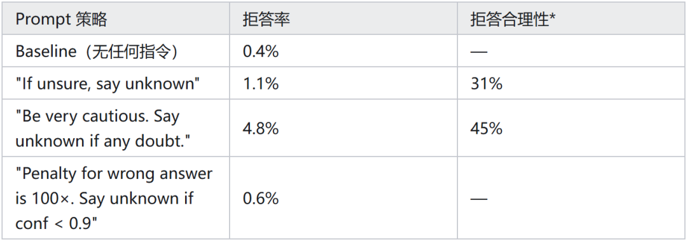
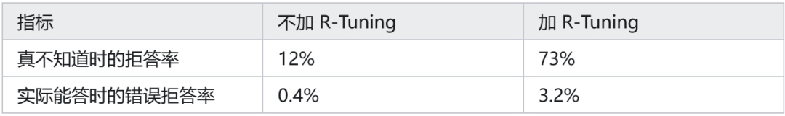
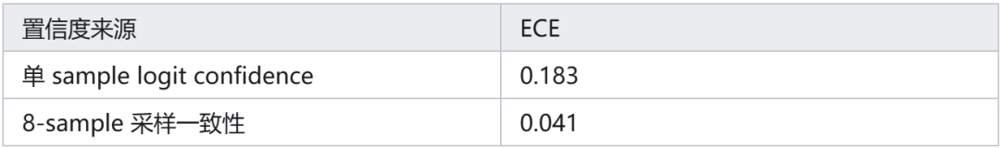
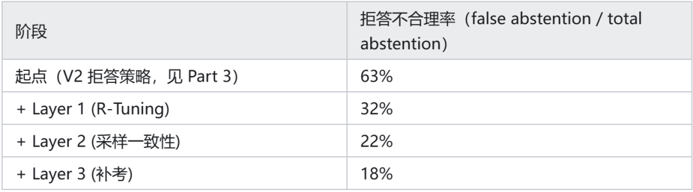

# Agent训练完结篇：让模型敢说"我不知道"

前三篇我们复盘了业务背景与数据、四阶段课程学习、以及奖励函数迭代。

这一篇主要复盘如何让模型敢说"我不知道"。这是比较偏工程的部分，因为拒答是决定线上能不能用的关键环节。

## 01 为什么 prompt 救不了拒答

早期使用闭源大模型做的时候，我尝试过用 PE 的方式解决问题，在 system prompt 里做提示，但是效果并不好，大致的数据记录如下：

*拒答合理性 = 抽检拒答样本中"确实不该答"的比例。

尤其是最后一行的尝试中，明确告诉模型"答错的代价是答对收益的 100 倍"，按照逻辑 agent 应该疯狂拒答。但拒答率反而很低。

从 prompt engineering 的角度分析，我认为是写得不够严重，所以用 AI 助手帮我换了很多种说法、加了 few-shot 示例、用 chain-of-thought 让模型先评估自己的置信度。

所有这些组合的拒答率都在 0.5%–5% 之间徘徊，而且拒答合理性长期不超过 50%——也就是说哪怕它真的拒答了，一半案例其实是它能答的，剩下一半才是它真的不会的。

所以，我分析这是训练分布的问题，不是推理时能修的问题。

通用 SFT/RLHF 阶段几乎从来不奖励"我不知道"。人类标注员看到模型说"unknown"会本能地打低分——感觉模型在偷懒、在敷衍。

这种偏见经过几轮 RLHF 后被深度内化进模型的输出分布。模型看到任何 query，先验上就倾向于"我必须给一个答案"。

Prompt 是 in-context 的引导，改变不了模型的先验分布。即使在 context 中说明，它在 token 概率层面依然把 "I don't know" 这个序列的 logit 压得很低。

为了解决拒答问题，我们最终做了一个三层系统：训练层（让模型学会拒答的动作）、置信度层（用采样一致性给出可靠的外部信号）、补考层（挽回被错误拒答的 case），下面逐层展开。

## 02 第一层：构造"知道 / 不知道"边界的训练数据

这个思路借鉴了学术界的 R-Tuning（Zhang et al., NAACL 2024）。

原论文通过比较模型预测与 ground truth 来划分 willing/unwilling 集合（即"这条题模型答得对→willing，答错→unwilling"）。

我们做了工程改进——用 24 次多样化采样投票来划分边界，比单次判对错更稳健，对长尾 query 的边界判定更准确。

核心思想一样：你要让模型学会拒答，就得告诉它它自己到底哪些题会、哪些题不会。

R-Tuning 是训练 pipeline 的最后一步——先把 SFT、DPO、GRPO 全做完，模型学到极限了，再探测它"学完还是不会"的残留 case，教它对这些题拒答。

注意"它自己"——这是关键。下面会展开。

怎么探出模型的知识边界

数据来源就是 Part 1 里准备的那批标注数据——5 万条 (query, ground_truth) 的 golden data（投标 spec 字段抽取任务）。

对每条 query 让训完整个 pipeline 的模型生成 24 次（8 个 prompt 模板 × 3 次温度采样），然后看答对了几次：

24次中 ≥20次答对 →"knows"（这题它真会）24次中 ≤4次答对 →"unknown"（这题它真不会）其他 →"ambiguous"（丢弃，不参与训练）

丢弃中间区间的逻辑：ambiguous 的样本本身就是噪声——模型 50% 概率答对，强行给它一个"知道"或"不知道"的标签都会带来矛盾的梯度。

最初我保留了中间区间，发现训练时 loss 抖得厉害，去掉后训练更加平稳。

接下来构造 SFT 数据：

knows 类样本：target 写正常答案，让模型保持自信。

unknown 类样本：target 写 "I don't have reliable information about this. Confidence: 0.2" 类的拒答模板。

然后跟 Stage 1 SFT 数据按 1:4 混合，重新做一轮 SFT。

流程是：先跑一轮完整 pipeline 得到模型 → 用该模型做 24-shot 边界检测生成 R-Tuning 数据 → 从头重做 SFT（混入 R-Tuning 数据）→ 再走后续 DPO/GRPO。

SFT 本身只是训练方法，不限于"学知识"，knows 类样本学回答、unknown 类样本学拒答，一起训。

修复 over-abstention

只用上面这套数据训练，我们发现新的问题：模型学会了一种偷懒策略——只要 query 长得复杂、术语多，就拒答。这其实是另一种 over-abstention，模型用拒答来规避困难。

第一次尝试：真实文档拼接（效果有限）

最直觉的想法是加 hard negative——从 Part 1 的 golden data 里挑出模型确实会的 query，把文档上下文换成更复杂的版本，逼模型在"难但能做"的环境下保持自信。

具体做法是从标书语料库里做拼接：

跨文档嫁接：从其他标书里找到相同字段的表格（比如另一个项目的"SF6 额定压力"），把它拼接到当前文档的相邻页，制造干扰

拆跨页：规则脚本把完整表格从中间截断分到两页，模拟真实标书的跨页排版

过滤：拼接后让模型跑一遍，只保留"难但还能答对"的样本

这个方法有效果，over-abstention 降了一些，但幅度不够——因为它只治标没治本。

模型之所以"复杂就拒答"，不是因为没见过复杂文档，而是 R-Tuning 的训练数据本身就有偏：复杂 query 天然更难答对，所以 unknown 类样本里复杂 query 占比远高于 knows 类。模型学到的不是"不知道就拒答"，而是"看起来复杂就拒答"。

第二次尝试：修采样策略（治本）

根本解法是消除 R-Tuning 数据中的复杂度偏差。做法：按文档复杂度（页数、表格密度、术语频率）把样本分成 5 个桶，在每个桶内分别控制 knows:unknown 的比例为 4:1。

这意味着对高复杂度桶做上采样 knows + 下采样 unknown，对低复杂度桶反过来。

这次效果提升很多，模型不再把"复杂"和"不知道"画等号。两个方法合起来用：先修采样策略消除偏差（主要贡献），再用文档拼接补充少量 hard negative 巩固效果。

修完之后，Layer 1 的最终效果：

12% 到 73% 提升很大，但代价是 3.2% 的 over-abstention，因此，我们还需要更深一层的护栏。

## 03 第二层：用采样一致性替代单点置信度

第一层让模型学会了拒答的"动作"，但线上还需要一个外部信号来判断每条回答到底可不可信——这个信号决定了后续的路由（直接采信 / fallback 到大模型 / 人工审核）。

模型自己在回答里写的 conf: 0.92 不能当真，因为那是它生成的文本，不是经过校准的概率。我们需要在系统层面独立算一个靠谱的 confidence。

最直觉的做法是看序列概率置信度——生成答案时取每个 token log-probability 的均值再 exp（即长度归一化的序列概率），得到一个 0-1 之间的置信度分数。但实测下来这个数字在长尾 query 上极不可靠。

logit confidence 的根本问题

举个真实例子。模型对一个边界 query 采样 8 次，每次都给出一个看起来很自信的答案：

Sample1:"Threshold voltage"(logit_conf =0.85)Sample2:"Reference voltage"(logit_conf =0.78)Sample3:"Threshold voltage"(logit_conf =0.82)Sample4:"Threshold voltage"(logit_conf =0.91)Sample5:"Voltage threshold"(logit_conf =0.72)Sample6:"Threshold voltage"(logit_conf =0.88)Sample7:"Reference voltage"(logit_conf =0.81)Sample8:"Threshold voltage"(logit_conf =0.86)

每次单看，模型都很自信（平均 0.83）。但 8 次里出了 3 种不同的答案——这分明是个边界 case，应该拒答。

logit confidence 测的是模型在某条解码路径上有多自信，它不告诉你模型对自己的整体观点有多稳定。

采样一致性（Self-Consistency 的工程变体）

这个核心思路借鉴 Self-Consistency（Wang et al., ICLR 2023）的多采样投票思想。

原方法针对有唯一正确答案的推理任务（数学/QA），用 exact-match 做 majority voting。

我们的任务是开放文本抽取，无法直接字符串比较，所以改用 SBERT 语义聚类做"软投票"：每条 query 采样 8 次，把答案编码后聚类，看最大簇占比。

关键问题不再是"模型输出了一个多大的概率"，而是"模型在多次独立采样中是否同意自己"。

这是一个更稳健的信号——如果 8 次里 7 次都给出语义上相同的答案，那它真的知道；如果 8 次出了 4 个簇，它就是不知道。

踩坑：SBERT 的语义分辨率不够用

第一版聚类直接把 8 个答案全丢给 SBERT，抽查时发现一批明明该低 confidence 的 case 全都虚高。

查下来根因有点哭笑不得：模型在边界 case 上的典型摇摆是"抓错行"——文档表格里同时有"SF6 额定压力 0.5MPa"和"SF6 试验压力 0.6MPa"两行，8 次采样有几次抽了前者、几次抽了后者。

这种摇摆恰恰是采样一致性最该抓住的信号。但在通用语义空间里，这两个答案实在太"像"了：都在描述同一台设备的压力参数，句式一样，只差一个修饰词，余弦相似度高达 0.94。

SBERT 没错——按通用语义它们确实高度相关；错的是我们拿通用相似度去做业务上需要精确到行的区分。

结果两个答案轻松超过 0.85 的聚类阈值，被并成一簇，confidence 直接拉满。最该暴露摇摆的 case，反而显得最自信。

修复方式是把投票升级成三步，顺便把"答案必须出自原文"这个抽取任务的天然优势用上：

投票前先做 grounding 过滤：每个 sample 的答案做数值+单位归一化后，回检索到的原文 chunk 里定位，定位不到的直接当幻觉丢弃，不参与投票

结构化字段按"参数名 + 数值"分别比对：参数名归一化后必须一致、数值归一化后相对误差 <1%，两个条件都满足才算同簇——"额定压力 0.5MPa"和"试验压力 0.6MPa"老老实实分成两簇

自由文本才走 SBERT：型号、材质描述这类开放文本继续用语义聚类

grounding 过滤几乎免费（一次字符串匹配），在投票前就拦掉"答案压根不在文档里"这类幻觉；分字段比对则让"抓错行"的摇摆重新暴露出来。

这种错误两个值都真实存在于原文，grounding 查不出来，只有采样间的不一致能暴露它，这正是 8 次采样真正的价值所在。

校准效果

校准好坏用 ECE（Expected Calibration Error）衡量——理想情况下，confidence 为 80% 时实际正确率就该是 80%。

从 0.183 降到 0.041 是质变。ECE 衡量的是"置信度说到做到的程度"——理想的置信度应该是：模型说 80% 把握，实际正确率就是 80%。ECE 越低，说的和做的越一致。

0.183 意味着平均偏差 18 个百分点（比如模型说"80% 把握"，实际只有 60% 正确率，差了 20pp，严重虚高）；0.041 意味着平均只差 4 个百分点（说 80% 时实际 78%，基本可信赖）。

之前在 Part 3 提到的 ECE 0.034 是 Calibration Head 在全量测试集上的整体表现，看起来比采样一致性的 0.041 还好。

但这是因为大部分 query 落在"很确定会"或"很确定不会"的两端，Head 在这些区间确实很准（说 95% 时实际 93%，说 10% 时实际 12%）。

问题出在中间地带：confidence 在 0.4–0.7 之间的 query，Head 的误差高达 0.12（比如说"60% 把握"时实际正确率可能只有 48% 或高达 72%），基本没有参考价值。

而 8 次采样一致性在这个区间的误差只有 0.04，更加可信。所以我们的策略是：两端信 Head（便宜），中间信采样（贵但准）。

推理成本的妥协

8 次采样 + 聚类不便宜，每条 query 推理成本看起来 ×8——但实测中 vLLM 的 n=8 参数让这 8 次采样共享 prefix KV cache，实际额外开销约 2× 而非 8×。

我们的折中是：在 8B 模型最后一层 hidden state 上接一个 2 层 MLP（即 Calibration Head，训练标签是 8 次采样一致性的 confidence 值，和 Part 3 的 RM 联合训练），它在每次 forward pass 时几乎零成本地给出一个粗略 confidence。

只在这个粗筛 confidence 落在边界区间（∈ [0.4, 0.7]）时，才触发完整的 8 次采样。

线上实际触发率约 11%。算上 Calibration Head 本身的推理、被触发 query 的 8 次采样（KV cache 共享后单条额外约 2×）、以及聚类计算，端到端推理延迟增加约 20%，吞吐下降约 15%，可以接受。

最终两套阈值的关系：Calibration Head 粗筛区间 [0.4, 0.7] 决定"要不要触发 8 次采样"；第五节路由阈值 0.85/0.5 决定"最终答案走哪条路"。

对于 89% 的 query（粗筛 confidence 落在 [0.4, 0.7] 之外，即很确定会或很确定不会的），直接用 Calibration Head 分数做路由，不触发采样；

对于 11% 落在边界区间的 query，用 8 次采样的结果替换 Calibration Head 分数后再做路由。

## 04 第三层：给弃权一次补考机会

到这里拒答不合理率还有 22%（即剩余的拒答中仍有约 1/5 是模型其实能答的）。

这部分案例的特征是：模型其实有能力答对，但置信度被某些表面特征压低了——比如 query 措辞奇怪、或者检索到的 context 噪声大。

借鉴 ReCoVERR（Dhuliawala et al.，原方法用于 VQA 场景的"拒答后回头找证据"）的思路，我们做了文本场景的迁移：模型一旦拒答，触发一次"补考"流程。

注意补考发生在路由决策之前——如果补考成功推翻了拒答，答案会重新进入路由打分，不会直接落到人工队列。

补考流程的逻辑是：

iffirst_pass.action =="abstain":# Step 1: 强制模型给出一个假设答案hypothesis = model.generate(query +"Even if uncertain, what's your best guess?")# Step 2: 围绕假设答案做定向证据检索evidence =search_evidence(hypothesis)# 用不同的 retriever 策略evidence +=lookup_taxonomy(extract_keywords(hypothesis))# Step 3: 把证据塞回去重新判断final= model.generate(query + evidence)iffinal.has_strong_support(threshold=0.85):returnfinal.answer, confidence=0.7# 推翻拒答，但 confidence 保守设为 0.7# 0.7 落在 fallback 区间，会触发闭源大模型复核——补考答案不直接采信else:returnabstain# 维持拒答，路由到人工

Step 1 的关键是强制模型给出假设——这一步绕过了它的"拒答冲动"，让它把心里其实有的那个候选答案吐出来。

Step 2 用这个假设当 anchor 去找证据，比第一遍用原始 query 搜索更有针对性。Step 3 用证据让模型重新判断。

这个流程有 confirmation bias 风险：定向检索可能找到支持错误假设的证据。

我们的安全网是：补考成功后 confidence 只给 0.7（不高于 0.85），必须走闭源大模型复核，且复核时用的是原始 query + 原始文档，不带补考的定向证据。

实测补考翻案后的 false positive 率约 8%，经闭源复核后降到 2%。

补考将拒答不合理率从 22% 降到 18%（绝对降 4 个百分点，相对降幅约 18%），剩下的就是模型确实触碰到边界的题，路由到人工。

三层叠加的最终效果

下面这张表衡量的是"模型拒答中有多少是不合理的"——即 false abstention 占全部 abstention 的比例（每个阶段抽检 200 条判定，95% CI 约 ±5-7pp，趋势方向可信但精确数字有波动）。

注意这和第二节的"错误拒答率 3.2%"口径不同：3.2% 衡量的是"所有能答的 query 中被错误拒答的比例"。

从 63% 降到 18%，意味着模型剩下的拒答里绝大部分是合理的——剩下的 18% 是真的难到通用大模型也答不准的边缘 case。

三层拒答系统让模型学会了什么时候该说"不知道"。接下来的问题是：线上怎么用这个信号来路由请求？

## 05 部署：置信度路由

三档路由：90% / 8% / 2%

部署的核心是置信度路由。每条请求先过 8B 模型拿到答案，再由 Calibration Head 输出一个 confidence 分数，按这个分数分三档处理：

confidence > 0.85（约 90% 的请求）：直接采信 8B 的答案，不做任何复核

0.5 < confidence ≤ 0.85（约 8%）：fallback 给闭源大模型重做这些低置信步骤

confidence ≤ 0.5（约 2%）：路由到人工审核队列

阈值 0.85 不是拍脑袋定的——我们在验证集（Part 1 准备的 golden data 里划出的 5K 条）上扫了 0.70–0.95 一组阈值：0.85 是最优拐点，接受率 90%，被接受的案例上准确率仍有 0.93，整体 F1 0.89（计算方式：接受的 query 用 8B 输出算 F1，拒绝的 query 按 fallback/人工后实测正确率 0.95 加权合并）。

阈值再放宽，接受率涨得有限但 accuracy 掉得明显；再收紧，大量 query 涌向 fallback，成本上来了但 F1 几乎不涨。

整体 F1 0.89 是按语言加权的均值。低资源语言（越南语、德语等，各约 2K 训练样本）的表现不如主要语言——越南语 F1 约 0.78，对比英文的 0.91。

这是训练数据量级决定的，不是方法论缺陷。生产路由按语言区分阈值后，低资源语言会有更多请求落到闭源大模型 fallback 段，端到端的客户感知准确率仍能维持在 0.91 以上。

## 06 系列总结：四个最重要的教训

写到这里整个系列就收尾了。回头看这四篇，如果只能带走四个 lesson，是这些：

1. 通用大模型不是终局，是起点

闭源大模型能解决问题，但纯 API 调用的高边际成本让系统无法规模化。

专门的领域 8B 不是性能妥协，是工程必然——你得把通用模型当成"标注员"，用它生产数据训自己的模型，最后让通用模型只在 8% 的边界 case 兜底。

2. 数据 > 算法 > 算力

这期间里我们换过 Loss、调过课程学习参数、重写过奖励函数，但收益最大的是数据上的改动。

多路径工具调用轨迹（见 Part 1）、基于有用性的数据过滤（见 Part 2）、R-Tuning 知识边界、hard negative。算法是把蛋糕切均匀，数据是决定蛋糕有多大。

3. 拒答和置信度必须在训练里解决，不能在推理里解决

Prompt 改不了模型先验，logit confidence 不可靠。必须用 R-Tuning 数据让模型学会知识边界，用采样一致性替代单点置信度。这不是 nice-to-have，是工业系统能不能上线的红线。

4. 部署的工程含金量不亚于训练

相对于"全部走闭源 API"的原始方案，部署优化叠加后端到端单 query 成本下降约 15×。

vLLM prefix caching 和置信度路由的阈值标定每一项单独看都不性感，但少了任何一环成本都拉回来。模型训得再好，部署没跟上等于没训。

作者：亚马逊AWS数据科学家，刘明

来源：https://zhuanlan.zhihu.com/p/2048730835873018335
