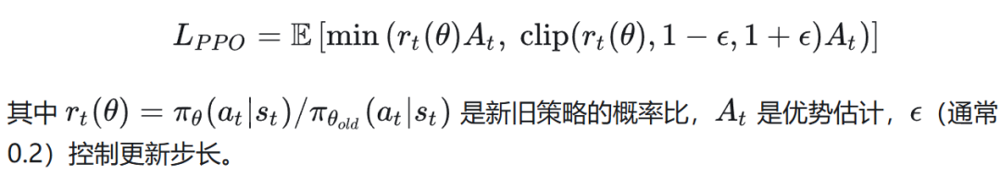
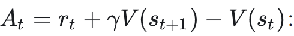
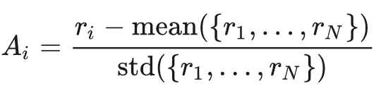
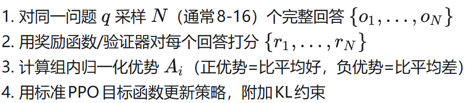
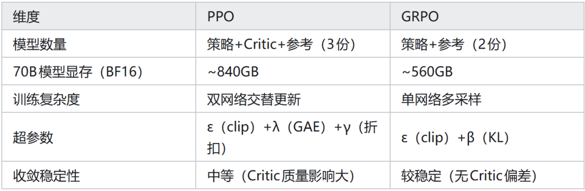

# GRPO vs PPO：大模型RL到底该选谁？

PPO（Proximal Policy Optimization）是 RLHF 训练的主流算法，但其对 Critic 网络的依赖和内存开销使大模型训练成本高昂。

GRPO（Group Relative Policy Optimization），由 DeepSeek 团队在 DeepSeek-R1 训练中提出，通过完全移除 Critic 网络、使用组内相对优势替代值函数估计，在显著降低内存和计算开销的同时保持了训练效果。

理解二者的本质区别和适用场景，是设计 LLM 强化学习训练系统的核心决策之一。

## 01 PPO 的核心机制与代价

（1）PPO 算法框架

PPO 通过以下目标函数在策略改善与防止过大偏移之间取得平衡：

（2）Critic 网络的作用与开销

PPO 需要一个与策略模型同等规模的Critic（价值函数网络）来估计优势。

内存开销翻倍：70B 策略模型 + 70B Critic = 140B 参数，需要约 560GB 显存（BF16）。

训练复杂度增加：策略和 Critic 需要交替更新，且 Critic 的训练目标（TD 误差最小化）可能与策略改善存在矛盾

方差-偏差权衡：GAE（Generalized Advantage Estimation）虽然降低了方差，但引入了自举偏差（bootstrapping bias），对长序列任务尤为明显

（3）PPO 在 LLM 中的实际问题

奖励归因困难：LLM 的”状态”是文本序列，”动作”是下一个 token，Critic 需要对每个中间 token 的价值进行估计，而许多 token（连接词、标点）本身没有语义价值，Critic 学习信号极弱。

训练不稳定：InstructGPT 报告显示，PPO 训练在约 500 步后出现奖励退化（reward regression），表现为 Critic 过估计导致策略过于激进地偏离参考模型。

## 02 GRPO 的设计与优势

（1）无 Critic 的组内相对优势

GRPO（Shao et al., DeepSeek-AI, 2024）的核心创新是完全移除 Critic 网络，转而使用同一问题的多次采样（组内 N 个样本）的相对奖励作为优势估计：

具体流程：

这等价于将REINFORCE 算法与基线函数（组均值作为基线）结合，完全基于蒙特卡洛回报，无需自举。

（2）GRPO 的内存和效率优势

GRPO 在 DeepSeek-R1-Zero（纯 RL 训练，无 SFT warm-up）中展现了惊人效果：模型自发涌现出长思考（long chain-of-thought）和反思（reflection）行为，这在 PPO 训练中极难实现。

（3）REINFORCE++ 的改进

REINFORCE++（Hu et al., 2025）在 GRPO 基础上进一步改进：

Token-level KL 惩罚：逐 token 计算 KL 散度（而非序列级），提供更精细的约束

小批次更新（Mini-batch updates）：对同一批采样数据多轮更新，提升样本利用率

优势归一化：在 mini-batch 内归一化优势，稳定梯度量级

实验表明，REINFORCE++ 在数学推理任务上比标准 GRPO 高约 1-2% 的准确率。

## 03 适用场景对比

（1）GRPO 更适合的场景

有清晰可验证结果的任务：数学推理（答案对/错）、代码生成（单元测试通过/失败）——组内相对比较只需最终结果奖励，不需要中间价值估计。

资源受限环境：节省 30-40% 显存，使单机训练更大模型成为可能。

训练初期探索：GRPO 的蒙特卡洛方法在策略随机性高时（训练初期）方差较小，因为组内多样性天然提供了丰富的对比信号。

研究快速迭代：超参数少，调参成本低。

（2）PPO 更适合的场景

密集奖励任务：连续控制类任务或有步骤级奖励信号（PRM）的场景，PPO 的自举能更好利用中间奖励信号。

长期依赖任务：序列非常长（>1000 步）且奖励在序列中间出现时，GAE 的时序信用分配优于蒙特卡洛回报。

价值估计稳定后：当 Critic 网络已预训练且质量高时，PPO 的偏差-方差权衡优于纯 MC 方法（GRPO 高方差）。

（3）混合策略

实践中，越来越多团队采用混合方案：

SFT 预热 + GRPO 微调：DeepSeek-R1 路线，用 SFT 奠定基础格式，GRPO 强化推理

PPO + 无 Critic 初始化：先用 GRPO 训练若干轮，用训练好的策略初始化 PPO 的 Critic，降低 Critic 冷启动难度

## 04 工程实践建议

数学/代码任务首选 GRPO：可验证奖励+无 Critic 使实现更简单、训练更稳定。

采样数 N 建议 8-16：N 太小（4）组内方差高，N 太大（32+）组内开始出现”全对/全错”导致无效梯度，8-16 是经验最优。

监控组内奖励方差：若 std(r_group) < 0.05（奖励极度集中），说明任务太简单或太难，均需调整。

GRPO 对采样温度敏感：temperature 过低（0.5）导致组内多样性不足，建议 temperature=0.8-1.0。

参考文献：

Schulman et al., Proximal Policy Optimization Algorithms, arXiv 2017

Shao et al., DeepSeekMath: Pushing the Limits of Mathematical Reasoning in Open Language Models, 2024

DeepSeek-AI, DeepSeek-R1: Incentivizing Reasoning Capability in LLMs via RL, 2025

Hu et al., REINFORCE++: A Simple and Efficient Approach for Aligning LLMs, 2025

作者：硅基趣玩喵

来源：https://zhuanlan.zhihu.com/p/2019158299094832834
