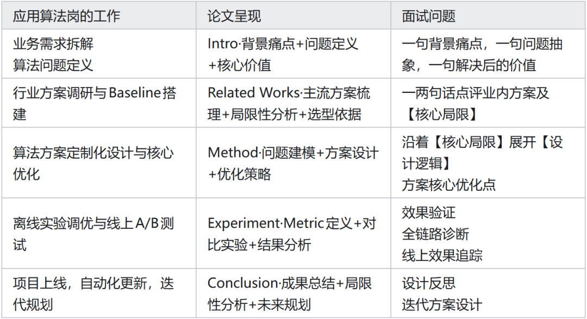

# 大模型算法岗面什么？面试流程全拆解~

前两天分享了面试官视角看应届生找应用算法岗——心态和用人标准篇，今天继续分享面试流程部分。

我一般的顺序是这样的（可能跟大部分同学见到的不太一样）：

团队和岗位介绍（要求候选人有不清楚的直接问）

闲聊候选人个人经历

请候选人讲项目，并逐步深挖技术问题

扩展聊技术视野

要求反问

👆🏻这种逻辑里，技术问题都包含在讲项目的过程中，考察得也会非常深入，但对面试官本人的技术储备和反应能力要求比较高。

体感层面：候选人虽然有可能体感更轻松，真实感强（这也是面试官的追求，你不紧张时表现的水平才是我能放心评价的），但坑多，而且很难。

而且面试官在这个体系下，都会在明确摸到你的极限的时候才会停，所以压力会在过程中不断地积累。

结果上：如果，同一个维度，你被问的问题越多，越深，即便你自己觉得答得拉，整体评价都会不错。

但如果你被问的问题少，甚至没体会到面试官对你的雷点在哪儿，那么反而有可能要完。

多说一句，体感轻松的面试最好问一下面评——“您建议我在哪个方向重点提升？”这时候，有可能你会听到面试官的“但是……”部分。

👇🏻下面这种可能是同学更常碰到的：

要求自我介绍

拷问八股文/手撕 Code/智力题

请候选人讲项目，并逐步深挖技术问题

要求反问

这种设置下， 2 这个环节就是代替笔试的考卷部分，面试官对正确答案是什么是有预期的（他也看过八股，十之有九是他自己背过的……），没有答出八股的通用答案，通常会被降分（私以为没什么道理，但是这种面试工厂化程度高，也不能算是不好吧，只要事前设计好……）

下面先捡重要的环节介绍——讲项目。

## 01 请候选人讲项目并逐步提问技术问题

这是个经典环节。但应届生在准备时，通常会丢掉一些面试官真正关注的重点。

可以使用👇🏻这个框架自查一下：

1. 像准备论文一样准备项目介绍

这个环节是完全可以在事前充分打磨的。 而且，打磨的不是“写演讲稿”，而是“如何从事应用算法开发工作”。

2. 功夫做在事前

当然，我说功夫做在事前，是指在平时做项目时就多想深一层。如果想不到应该关注的问题，除了应用“准备论文”这样的大纲以外，还可以想象自己明天要开“组会”：

面试官/同事 A/师兄问：“你这里是不是存在 XX 问题？”

你：“对，这个点我当时考虑过了，我也觉得有这个问题，所以我后来做了 XX 改进……”

面试官/同事 B/同学问：“那你当时如果用 XX 方法做，是不是会更好？”

你：“对，这个方案我也考虑过。但我具体在业务场景里试了一下，发现它有如下几个缺陷，所以我最终选择了现在的方案……”

👆🏻举的是我们组前两天开组会的实际例子。通常在做事的阶段，同事会说我 overthinking。

但是吧，做这行第一天（那时候还是 CNN 时代）到现在，我每天都在担心一个问题，“乱拳打死老师傅”——为了防止被打死，每个项目也都会看看能不能真出乱拳解决问题😂（换言之，多想想有什么问题）。

如果你现在回想起来，发现之前实习或做项目时有些实验没做、有些对比没跑，现在做依然来得及（比如在类似的场景或开源数据集上，自己重新跑一下、验证一下），想做就永远都来的及。

回到讲项目这个环节。这部分非常重要，面试官实际并不是要求候选人【快速讲解自己的一篇论文】，而是让候选人在面试官面前完整的展现一下自己怎么做事。

候选人可以按照这个东西对比着看：

## 02 每个环节需要注意的点

下面展开提一下每个环节需要注意的点：

1. Intro 问题是什么？Setup 是什么？

🎯 核心考察：业务理解力、问题抽象与建模能力

这里面试官观察的重点有几个：

其一、候选人能不能用最精炼的语言，把一个复杂的现实问题翻译成算法问题。

其二、候选人是基于什么价值判断，选择解决这个问题的（是实习的 mentor 要求做的没关系，候选人要理解这里面的价值，以及判断逻辑）

其三、候选人是否关注产出的影响（做事不是重点，做有价值的事，做出事情的价值是重点）

💡 这跟实际工作有什么关联？

实际工作中，并不是所有的业务需求都要接。优秀的算法工程师，往往是看到了问题中可抽象、可泛化或者业务价值极高的地方，才会投入精力去解。

更重要的是，只有能精准 Define 问题的算法工程师，才能在解决方案中，快速找到那条迁移和改造成本最小、距离最近的路径。

难点/坑点

Intro 这部分对应届生的要求不太高，只有一类是常见的卡点：如果你做的这个项目是为了优化某个线上指标，或者你谈到了某个指标被优化了。

面试官在这里可能会问你：这个指标核心逻辑是测什么？和另外一个常用指标有什么不同（搜推广最常见这类问题）？为什么你这个场景应该看这个指标？

2. Related Works

要点 1：简要提一两句：业界已有的方法有哪些？把它们直接用在你的场景里，会有什么问题？（不说的话，面试官通常也会问，他要是不问，要不然是他自己做事习惯不好，要不然就是他对你……）

要点 2：类似“这个领域大概有这样几条路……”这样的表述，能很好的展现自己的技术视野。

💡 这跟实际工作有什么关联？

遇到一个问题，应用算法工程师通常会在大致的抽象之后做调研，即便是一个已经抽象很好的场景，也还是要再看看最近几个月有什么新进展，有没有更好的路径。

🙅🏻‍♂️反面案例

有个候选人说：我改造了 Transformer。

我：Transformer 的改造在 19 年以后，曾经涌现了很多方法。你面向的 XX 问题，有几个经典的改造呢？

候选人：没有，（然后候选人讲了方法）

我：亲，你之前看过 Informer 吗？logformer 呢？

候选人：没有。

我：你确实应该看看，你看了就不会说你自己这个是创新了……那你看 deepseek 的 NSA 了吗？ 候选人：也没有。

我：啊……希望你能站在巨人的肩膀上。

评价：有创新的思维非常好！但是需要建立在科学的方法论上。

👆🏻那个场景，就是面试官给你机会时候的逻辑，一般是领域里很火的方法先问（informer），和候选人思路很近的工作后问（logformer），时下比较热点的方法（NSA）最后问。

一些跟八股相关的技术问题：

你调研的这个某某方法（通常是领域里的经典方法），用一句话总结一下他的核心思路？

这个方法的某某组件，为什么要这么设计？（这个方法一定是比较经典，且有拆解意义的，不然不会问，大概率八股里的也有）

某某方法的效率怎么样？（提问频率较高的问题）优化或者卡点在他的哪个设计上呢？（出现频率较低，但如果你有两篇工作/两个项目在相同的领域内，这个就很可能被问了）

3. Method

要点 1：一句话说清楚方法的核心思路：这点反过来对工作和学习也有好处，可以看看我其他帖子里面的一句话总结。

要点 2：实现时候的核心难点，举一个具象的例子说明：这点是需要让面试官共情和共识的。

要点 3：大部分火力要集中怎么解决难题这点上：而不是解决难题，这其中的差距在于“你的动作”比结果更重要。（当然，如果你有 10 篇 A 会，你不会在这儿看我的帖子，对不对😂）

一些需要准备的问题：

怎么想到这个解法的？这一定是个好故事，但不是所有人都有。有的话，可以用从现象发现，现象分析，因果诊断，到提出解法这一套，在讲方法之前说一下。

你认为实现当中的重点是什么？这是很好的展现自己的判断力的地方。判断的第一要素当然是业务效果，也要想想速度、成本、泛用性、扩展性等等问题。

当时没想？没关系，现在想起来觉得可以再改改，这个也可以。但是最好伴有一些相应的验证行为。有动作比没动作强，补救永远不晚。

你实际动手做了什么，是面试官判断的标准。

为什么这个方法在设计上是合理的？更优的？这个问题不一定会被问到，因为在前面阐述场景问题（Intro）和阐述相关工作（Related Works）的时候，都可能提到。

你实现的时候做了什么 Trad-off？因为这个 trade off 做了什么其他的适配或者补丁吗？

trade-off 在现实层面是必然会发生的，尤其是考虑运行效率（前台场景，比如搜推广，客服 都非常注重响应时间和并发）和自动更新的场景（安全场景注重自动更新和快速迭代和泛化）

## 03 关于八股

这种渐进式的面试，八股问题通常会出现在 Method 部分，面试官会直接根据你的技术选型往下问：

比如：你说选了某个方法，面试官接着就问你，loss 选的什么？这个 loss 和领域里经典的某个 loss什么区别?……

比如：你说选了某个基座模型，面试官马上问，它和同类模型的关键区别是什么？（多模态的基模更常问结构）具体结构是怎么设计的？优势在哪？（文本模型常问热门组件，比如，注意力，编码，MOE）

比如：你说你用了 RL 来训练，面试官会插进来问，选的方法是啥啊（最经典 GRPO/DAPO 绕不过去的）？这个方法容易出什么问题啊？最近流行的版本是怎么解决问题的？具体是加了个什么设计？这个设计什么好处？你当时怎么没用啊？……

BottomLine就是：准备八股是必要的，围绕着你的项目所有选型和设计推就行了。

## 04 实验分析

要点 1：说结果好，不能只说指标好，至少要有Case Study或Ablation中的一种。

指标 Gap：分清在线和离线指标，有 Gap 正常，说清楚为什么有即可。

应用岗更重 Case 分析：优化需求几乎每周都有，怎么优化很大程度基于对 Case 背后的分析。

除了 Metric，可以抽一类改善明显的样本，拿出来说为什么好；如果说得清楚，还可以抽一类改善不明显的样本，说为什么没提升，并延伸后续怎么提升（如果这类不改善也不影响业务价值，可以不用提）。

Case study 要有穿透性：现象举一例说清 Case 什么样即可，不用展开，但Case到设计的穿透要尽所能地深入。

反面案例：“数据上有这类问题……可能原因是训练数据有毛病吧。”（等于没说） 正确思路：什么样的样本引发了这情况？影响了模型的什么表达？为什么该多加/少加？数据要怎么调整？

Ablation 的重点：不在于证明“我的哪些配置合理”，而是回答“为什么这么做，而不是那么做”。

更深一步，最好先告诉面试官，你对这里面的什么最为好奇（设计方法时猜想什么东西会 work，你的猜测有没有得到印证）。

测评的可靠性：近两年的测评（LLM-as-Judge、人打 win rate 不稳定、生成式任务回归不稳定等）缺乏线上验证，要追加交叉印证和线上追踪。

介绍这类新验证方法时，请一定引用至少一篇相关 paper 的结果 > 结果不 solid 没关系，但没做相关动作去尽量保证 solid，不行。

要点 2：方案的工程考量。

要讲出自己的工程考虑：复杂度、成本、效率、泛用性、扩展性，至少要提一个。

扩展性说清楚很难：得把“未来可扩展场景”和“可扩展的内在逻辑”说清楚。应届生可以不挑战（大厂看潜力，小厂看能不能干活，都不要求面面俱到）。

关于复杂度：应用场域不 prefer“复杂度高但 Margin 一般”的优化。但不等于不能说，自己主动把复杂度高说出来，堵上面试官的嘴（既然准备堵嘴了，怎么简化方案这点也请一并堵上吧😁）。

要点 3：训练过程的反复与诊断：训练过程有反复，是好故事。重点说明：问题是怎么发现的？Bug 是如何诊断出来的（在数据上？训练监护上？还是算子上？） ？

要点 4：区分“我的工作/Idea”和“我们的工作/Idea”。介绍实验和结果的时候，更容易牵扯到其他人的工作。

项目有其他人指导或参与很正常，但你在其中扮演什么角色，这很重要。千万别夸大哈，被问出来就完蛋了。信用分比能力分还重要。

一些常见的场景及应对

没覆盖到的欢迎评论区告诉我，我力所能及之内，Cover 上😂。

被问调参过程：没故事可以不主动讲，但面试官一般会问，必须准备哈。

最好是在做事的时候就参考下面的逻辑：

先参考同行的经验配置，再铆钉关键维度，再细化调参。

关键维度什么什么？跟任务，方法都有很大关系。

调了半天还是同行的经验配置更好？这不要紧，「调过」展现的是你的探究热情，没调过，你很难解释为嘛不干啊 _(:з」∠)_

如果实习只做了提示工程（Prompt）

虽然现在很多实习场景（包括正式岗）都在疯狂的开发提示工程，Agent 相关开发都不太重。

但是啊，但是！算法岗依然看重“炼丹”能力，如果只做了 Prompt/数据/业务流程，必须准备好应对以下连环问：

调试的数据集你怎么准备的？

通过模型反应你有什么猜测？（哪些猜测有同行论文支撑？）

你怎么保障回归效果？

你怎么保障提示工程的扩展性？（涉及 Agent/Skill 设计）

怎么管理业务问题 Agent 化/Skill 化过程中的 Experience？

应对不同类型的面试官

经验丰富的面试官：更看重你的判断逻辑和实际行为（为什么这么选）。

经验浅的面试官：更看重具体方法，有时候甚至会热衷于讨论具体方案，倒不一定是在套你反感，而是技术人的一种难以自持的倾向😂。

初面遇到经验浅的面试官的可能性比较高，所以方法的细节务必准备全面。可以参考 rebutallo(*￣︶￣*)o……

不行，码不动了，诸位过两天再来看吧😅

作者：一脑袋浆糊

链接：https://www.zhihu.com/question/11013588902/answer/2017965718516290608
