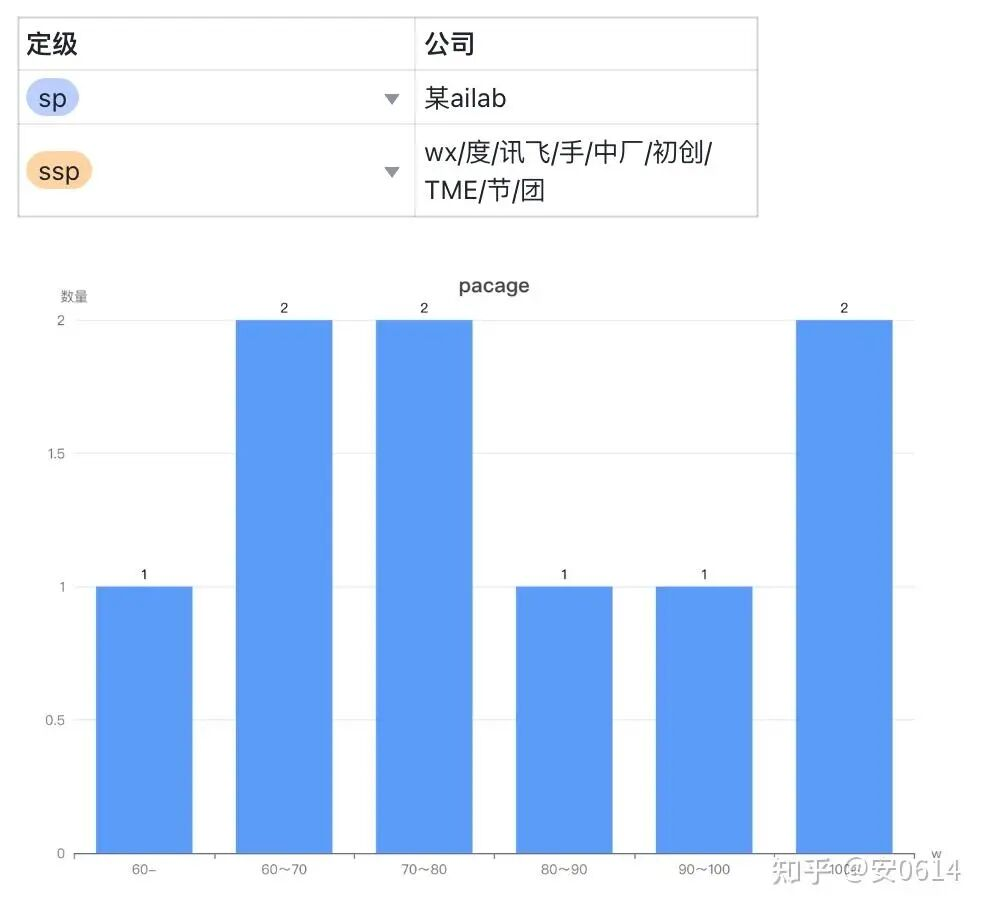
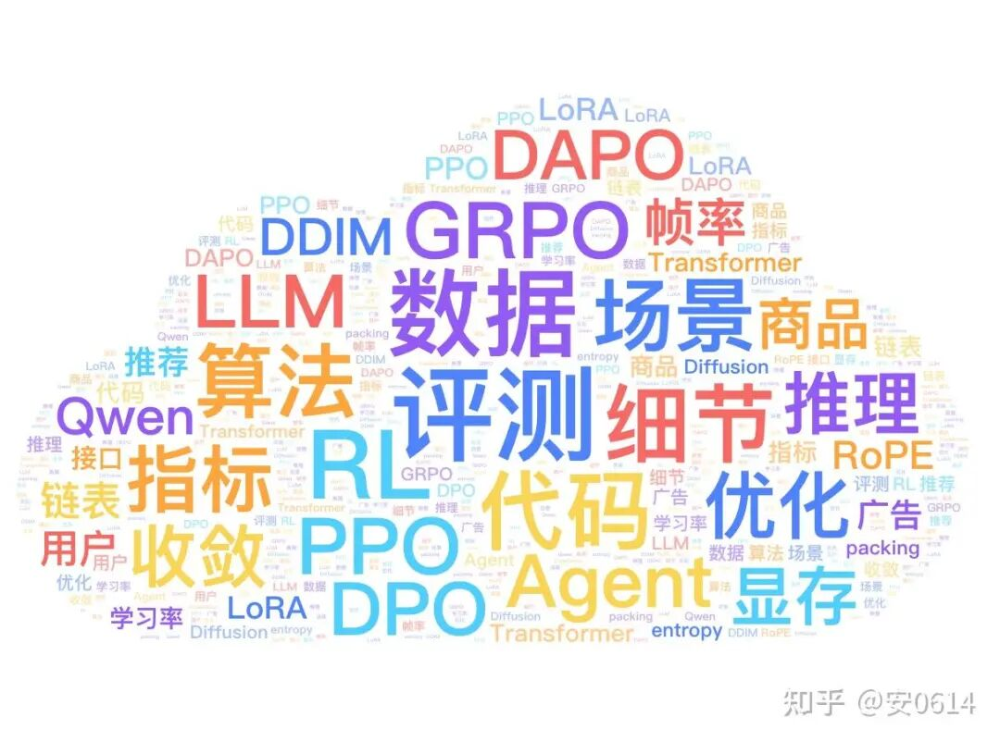

# 2本水硕+0论文,拿下大模型算法:1SP+8SSP

## 01 个人背景

学历：中下 211 信管本，港硕 CS

Paper：0，0，0（不是 3 篇 A，是三个鸭蛋）

实习：3 大厂 1 初创，4 段共 2 年（1 LLM/VLM 后训练，1 RL research， 2 音乐/TTS 基座，好像突然跑偏了）

## 02 offer 情况

面试情况：

投递较为保守，进面率 15/44=34%，拒面 2，通过率 9/13=70%（按公司统计所以会高）。

其中某蓝色软件一面挂，某海外电商平台一面挂，某自驾终面挂，某头部量化子公司横向挂。

大厂×6（字节/团/手/度/WX/TME/讯飞）

研究院×1（上海 ai lab），中厂×1，初创×1

offer 方向：

LLM 应用（后训练/Agent）：团/度/wx

多模态（vision）应用（Agent）：手/节

多模态基座：初创（tts），中厂（视频理解/生成），TMEå

RL research（lab）

## 03 秋招面经

（待整理）.....

## 04 总结与回顾

26 年 2 月 14 日，春节假期的第一天晚上，我终于点击了秋招第一个正式 offer 确认键。

有些恍惚——因为总觉得这个时刻好像是很多个过往的重放——高中时的入学确认，大学的录取通知，研招网上的灰色圈圈，申请时的留位费提交......

24 岁的我好像在一个单行的巨大游船上，就这么被潮水推着驶离了一个个港口，却不知道下一个岸在哪里。

我感受到的是一种混杂着喜悦和如释重负，又夹杂了许多奇怪的无措与迷茫，痛苦与疲惫交织的情绪，像距离我很远的天边传来的隆隆春雷，听不真切又震耳欲聋。

如愿以偿并不总是伴随着欢呼，有时它更像是一场漫长高烧后的退烧。我本以为我会很开心的。

26 年 1 月从 startup 实习离职之后一直到现在，我获得了大概是几年来唯一一次可以持续这么久的放空机会。

这段时间里好像突然对各种知识型公众号和 paper/tech report 产生了一些生理性厌恶一样的感受，打开看一眼标题就想退出，退出后犹豫了一下又点开扔到收藏夹，有些甚至没有打开的欲望，可能是秋招后遗症。

离职后决定出去看看，从上海出发，辗转西安/兰州/甘南/大理/丽江/汕头/福州/威海，花光了实习攒下的身上几乎所有的钱，像是在进行一场精神上的破产清算。

淡季没什么人，中间很多城市都是独自旅行，不刻意打卡景点，也不太考虑下一个目的地，边走边放空，感觉精神上和世界获得了更深刻的链接，然后回到家过了一个轻松的年。

是有一些戒断反应的，想到在麦积山石窟外的岩壁走廊眺向北方片刻的澎湃，在洱海边躺下边傻笑边被水打湿袖口。

以及在汕头的小雨天骑电动车漫无目的穿梭在大大小小的十字路口，更能让我深刻感受到：生活不该只是简历的堆砌，还应该是这些“无用”瞬间的集合。

旅行也是一个“用新的眼睛看自己”的过程。突然发现已经好久没做阶段性的总结了，特别是对于过往这段时间经历的校招，起起伏伏的心理状态、断断续续的喜悦与恐惧——它们太复杂，我不知道该怎么讲。

但我清楚地知道一件事：自己真的算不上多努力。作为一个算法从业人员，我对自己的评价一直就是 65%～70% 的技术人，翻译一下就是，比及格线多一点点。

这两年认识了很多人，他们中有的人在我的视角里生活就只有 AI，他们的朋友圈是论文/技术贴的跑马场，对话是模型的布道会。

一开始确实有动过念头，我觉得好厉害，自己也想这样，但是都以失败告终。

很多时候都是被裹挟着往前走，虽然确实对 AI 保有着一些小小的兴趣，但更多的因素是行业的卷度，peer pressure，不辜负别人的期望，想要多拿点钱的渴望等等。

所以很多时候都不得不面对一个真相——自己的动力好像大多来自外部。可想而知后续工作之后也不会轻松罢了，变成被绩效压力，领导 push，生活的身不由己裹挟着继续往前走。

这种状态自己真的不喜欢。但是除了这个我还能做什么呢？从小循规蹈矩的乖学生，突然有点想不明白了。

哎？怎么有点负能量，打住一下，感觉是需要在工作的前一两年再重新去仔细思考这个问题的，毕竟人的心境受环境的影响是巨大的。

其实是有过挣扎的。25 年 10 月经猎头推荐入职了一家不足 10 人的初创，这段日子是有重塑我的整个职业观的。

过往的两年，好像自己的唯一目标就是要进大厂做算法，不管做什么都好，并且觉得这是一个非常坚定且不会动摇的目标，就像学生时代的名校崇拜——执着于无论如何一定要上一个别人耳熟能详的一听就觉得很厉害的地方读书。

但是这段时间突然打开了另一种模式，我遇到了一个很有实力且很有人格魅力的老板；经历了非常纯粹，自由度非常高的工作模式；以及被深度信任和鼓励的工作环境和一群很好的同事。

初创基座团队的工作内容是很吸引人的——每天好像都可以去思考通过什么样的方式去提升模型效果，非常乐意并且会很主动的追国内外同领域的技术进展，会主动关心数据与评测端状态，这是以前大厂业务团队实习里我从来没有体会过的一种爽感。

几个月的投入（虽然自己也没做什么贡献 hhh），终于在春节后听到了很好的消息，好像努努力真的可以做到是世界第一的模型。

不过......我退缩了，外部的喧嚣盖过了内心的声音。也可能几年前自己不会这样，我发现自己变“成熟”了，也变“胆小”了。

记得那天下午老板在会议室跟我讲，他从读博写 paper 做东西，到后面几次创业，至少在当时是从来没做过世界第二的东西，他日常对工作的执着，热爱学习的态度和满满的自信始终很能感染我。

其实没有选择这个 offer 对我来说是放弃了这样一种生活方式，不过至少对于现在的我来说觉得这是个好的决策，因为我犹豫不决，瞻前顾后，所以我判断自己并不适合。人无法做出认知之外的决策，也就很难获得认知之外的收益。

25 年 9 月是面试频率最高的一个月，工作日日均两场，有两天排了四场面试。

开始的时候经常感觉自己像一个面试工具，对着 ppt 僵硬的念着我怎么处理数据，怎么训模型，怎么评测，效果怎么样。

每次面完试也会立刻一头扎到床上放空一会儿，觉得这个月讲了自己前半辈子一样多的话。并且每次面试前都会很紧张，呼吸不畅。

不过后来我发现一个问题，后来我悟出了一套“面试玄学”——面试不是考试，而是能量的流动。

当你的能量是饱满的，你本身是无惧的，把面试当做一个分享与交流，把面试官作为你的观众，这个时候本身会有很好的发挥，也很容易带动面试官，调动他的情绪，让他更容易对你产生正向的印象（嗯，后面基本都在研究这些乱七八糟的玄学了......）。

到最后阶段的面试我居然会夸面试官头发边上的设计很好看，会跟面试官聊周末做什么，会对着面试官傻笑，对面有时候可能觉得我脑子多少有点问题，但是整体面试通过率还是奇怪的挺高的。

可能觉得这人就算招进来也没什么心眼比较好进行一些 pua？我其实不太懂。所以归结到如果在自身能量高的时候面试，能量是会向对方流动的。

哪怕被问到不会的技术栈，也会有很自然的表达，恰到好处的请教，然后表现自己的一些看法，讲自己的故事，面对对方提出的一些观点如果觉得对就自然的赞美。一个真诚的好印象，往往比完美的答案更重要。

25 年 8 月，觉得自己好像还行，然后赶着 ddl 疯狂投各家人才计划。

本着试试又不亏的心态，发现很多所谓的人才计划其实也不会区分你到底想怎么样，只要能到普通批的标准，业务方感觉你可以面就正常面着，中间转普通批就好了省得你再投别的部门，变相在提前批面试阶段就把一部分普通批锁定了。

流程也一般都会拖（字节除外），所以一开始还是抱有一些不实际的希望的。

后来发现大厂的 LLM/多模态方向的人才计划对于 paper 这件事情是有执念的，不过搜推除外（还是有看到 0 paper 拿到搜推人才计划的例子的）。

8 月被筋斗云挂了又捞，捞了又挂，然后转普通批；后面北斗 2 面后面试官说对论文有硬性要求建议转普通批；青云 6 面之后 hr 面的时候说在论文方面有缺陷问是否愿意转普通批，当时 0 offer 呢我哪里敢不愿意......

不过确实如果重来一次的话自己肯定不会投一些看起来容易拿 offer 的部门的人才计划了，就投自己最想去的，不然流程走到后面都没什么反悔的机会了。

还有个很神奇的点是阿里系基本没什么面试机会，可能是学历差，也可能是暑期淘天测评笔试做得很烂，总之官网投了就隔天挂，简历甚至感觉都到不了业务方。

xhs 投了一个达摩院的正职邮箱说可以面，让官网补投递，结果后续还是被挂了简历，可能从实习开始就一直跟阿里系缺点缘分吧。

零零碎碎写了很多流水账，很感谢你愿意看到这里。

自己确实只是一个再普通不过的校招生，没有什么漂亮的学历，光鲜的履历，也没有多聪明的头脑。就只是遵循着最初的想法，顺势而为的走了下来罢了。

实习中踩了很多坑，浪费了很多时间，所以可能这两年的筹备都不一定赶得上其他人一年拿到的结果好，但我现在愿意相信自己不会比别人差多少。

未来也还会继续走下去。

不过在 23 年末的时候还会非常有动力的把自己的笔记放到小红书；24 年想做一个技术博主，扮演一些所谓的“精英”身份。

后来决定还是回归初心，记录自己乱七八糟学习的内容，同时会多多分享自己阶段性的心路历程。

里尔克说：“你要耐心对待心中所有未解的问题”。在人生的新阶段，我希望自己有深度思考的能力，乐于自我剖析，时刻发现自身认知的局限；

希望自己能够少受他人情绪影响，分清楚什么才是自己的人生课题；希望自己在有限的青春里，一直像 21 岁生日时写下的那句话：永远生动不麻木，永远鲜活不褪色。

最近的一个梦想是 35 岁可以退休。“所谓无底深渊，下去，也是前程万里”。所以，小蝴蝶请自己做好人生的第六个五年计划吧。

（全文完）

作者：安0614，已获作者授权发布

来源：https://zhuanlan.zhihu.com/p/2015806125904249105
