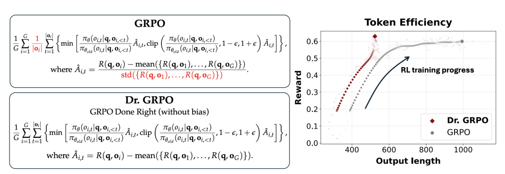

# 面试官突然问：GRPO为啥让模型推理变长？

这道题是我一个学员前段时间去某头部 AI 独角兽算法岗面试遇到的，面试官直接问：“GRPO 为什么会使得模型的推理变长？”

这个问题其实非常好，它考的不是你有没看过 DeepSeek-R1 的论文，而是你有没有真正理解 GRPO 的 loss 设计里藏着的那个隐式偏差。我们来拆解一下。

首先我们得搞清楚一个背景。

DeepSeek-R1-Zero 在训练过程中有一个非常显著的现象：随着 RL 训练的推进，模型的输出长度一直在涨。很多人第一反应是“哇，模型学会了自我反思、学会了长链推理”，觉得这是能力涌现。

但 Sea AI Lab 的一篇论文 Dr. GRPO 给出了一个更冷静的解释——这个长度增长，至少有一部分是 GRPO 目标函数里的优化偏差人为造成的，不完全是推理能力的体现。

好，接下来我们看核心机制。

GRPO 的 loss 公式里有一个关键操作：它在计算每个 sample 的梯度贡献时，会除以这个 response 的长度，也就是那个 1/|o_i|。

这个操作看起来很自然——做个平均嘛，但它引入了一个非对称的长度偏差。

我们分两种情况来想。

第一种，如果一个 response 答对了，它的 advantage 是正的。

这时候除以长度意味着什么？短回答的每个 token 分到的梯度权重更大，长回答的每个 token 权重被稀释了。

所以优化方向是：对于正确答案，模型倾向于学习那些更短的回答。第二种情况，如果 response 答错了，advantage 是负的。

除以长度之后，长的错误回答每个 token 被惩罚的力度反而更小了，因为惩罚被摊薄了。

换句话说，模型对长的错误回答“下手不够狠”，没有足够强的梯度去抑制它。

这两个方向叠加起来，效果就是：正确答案被推向简短，错误答案的长度得不到有效抑制，甚至会越来越长。

而在训练过程中，错误回答本身就占了相当大的比例，所以整体的平均输出长度就不断膨胀。

除了长度归一化之外，GRPO 还有第二个偏差来源：它在计算 advantage 的时候，会除以组内 reward 的标准差。

这个操作导致那些太简单或太难的题目——组内 reward 几乎全是 1 或者全是 0 的——标准差很小，除完之后 advantage 被放大了。这些题目在优化中获得了不成比例的权重，进一步扰乱了训练的平衡。

所以你看，Sea AI Lab 做了一个很干净的实验：他们把 1/|o_i| 和 std 归一化这两项都去掉，提出了 Dr. GRPO。

结果非常明显——模型的推理准确率基本持平，但错误回答的长度大幅缩短了约 30%，整体输出不再无限膨胀。

这就证明了之前那个“长度持续增长”的现象，相当一部分确实是优化偏差，而不是什么推理能力的涌现。

论文里还有一个很有意思的发现：这个长度偏差不只是 GRPO 的问题，几乎所有主流开源 PPO 实现——包括 TRL、OpenRLHF、HybridFlow——都在 loss 里除以了 response 长度。

这个习惯可能是从预训练阶段继承下来的，预训练时所有 token 打包成固定长度的 context，除以长度做归一化是合理的。

但到了 RL 阶段，response 长度是变化的，这个除法就不再是无害的常数缩放了，而是引入了真实的优化偏差。

最后总结一下面试时怎么答这道题。你可以分三层来讲：

第一层，GRPO 的 loss 对每个 sample 按 response 长度做了归一化，这导致短的正确回答梯度贡献大、长的错误回答惩罚被稀释，优化方向隐式鼓励输出变长。

第二层，advantage 计算中的 std 归一化进一步放大了极端难度题目的权重，加剧了训练不稳定。

第三层，如果面试官追问解决方案，你就提 Dr. GRPO——直接移除长度归一化和 std 归一化，恢复无偏的策略梯度估计，同时提一下 DAPO 用非对称 clip 来缓解长尾崩溃也是相关的改进方向。

这道题的精髓在于：不要把训练中观察到的所有现象都归因为“能力涌现”，有时候它只是你 loss 函数里一个不起眼的除法带来的副作用。

能看到这一层，面试官会觉得你是真的理解了 RL for LLM 这套东西。
