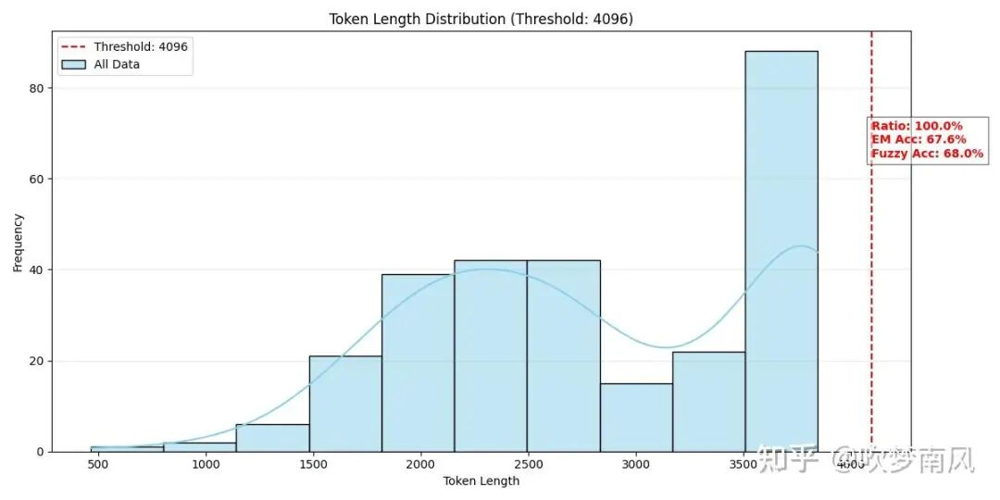
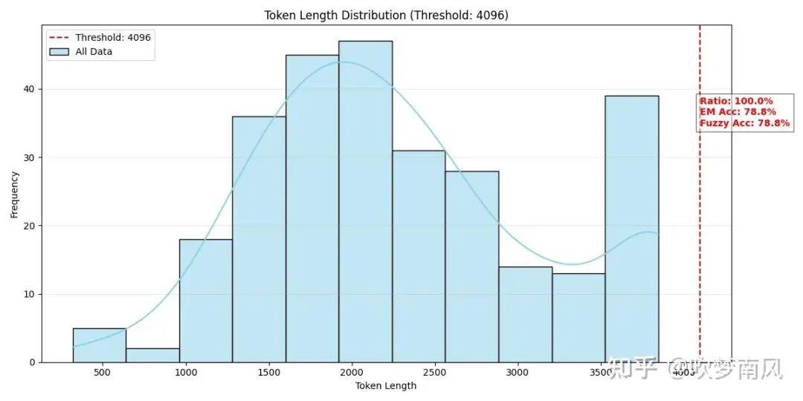
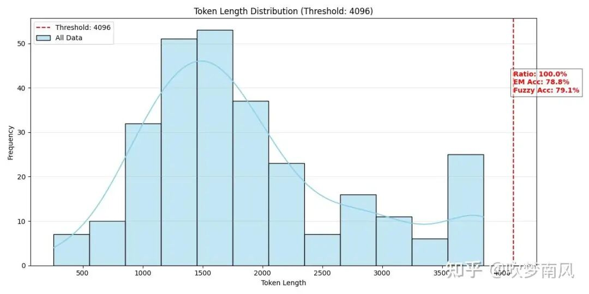
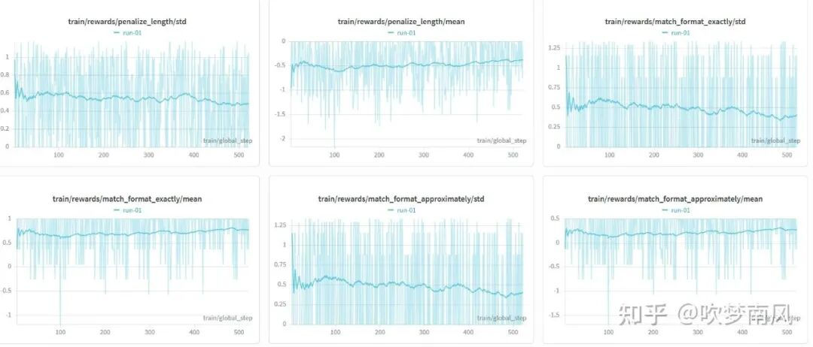
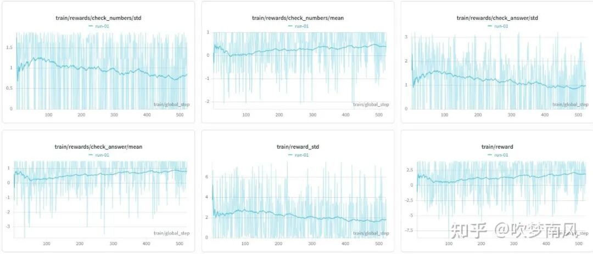
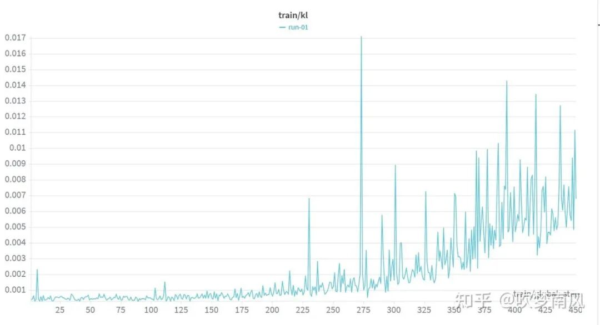
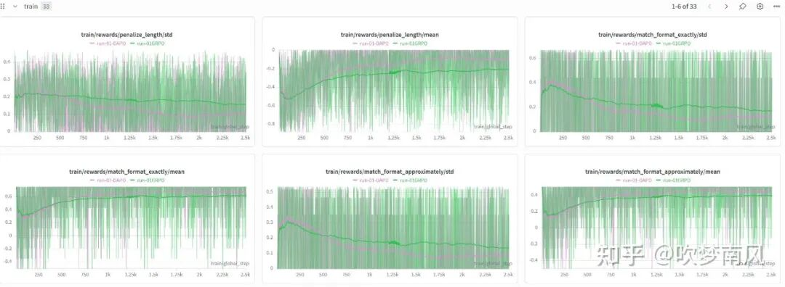
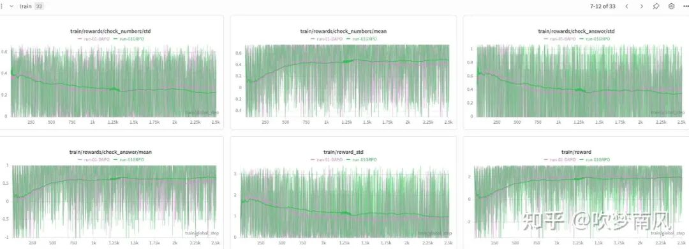
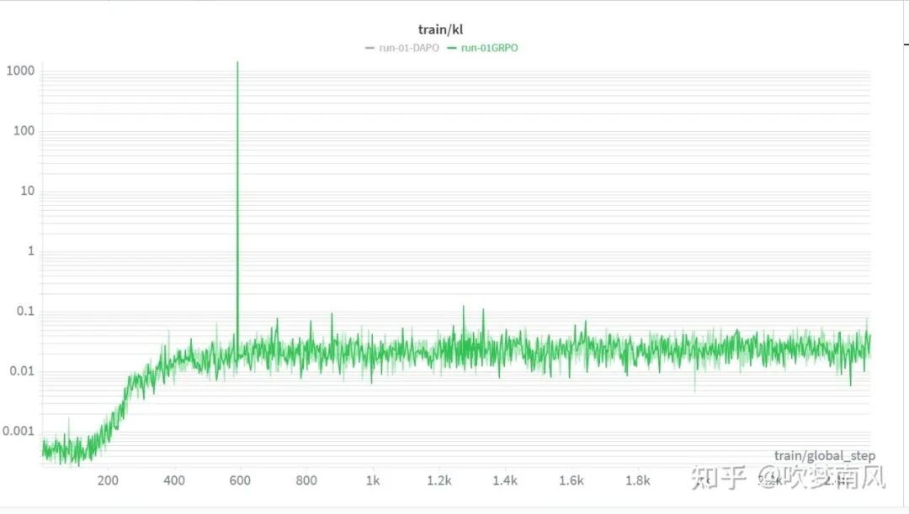

# 24GB显卡GRPO训练Qwen3-4B模型记录~

目标：训练 QWEN3-4B 在 2k-4k 上下文中，保持 acc 的同时减少推理长度。

方法：使用 GRPO 和 DAPO 的方法，对比效果，设计五种奖励函数，使用 unlstoh 训练，最大化利用显存，vllm 负责 rollout。使用 DAPO-MATH-17K 数据集。

## 01 前言

为什么笔者选取 DAPO-MATH-17K 这个数据集，因为这个数据集经过清洗处理，里面的答案都是数字，这个数据集是 DAPO 论文一并提出的数据集，他们在处理数据时候，巧妙的引导 llm 将答案 reshape 成整数数字。

为什么选取 2K-4K 这个区间。因为笔者发现，Qwen3-4B-Instruct-2507 在 2k 以下的 pass@1 已经很出色， 而再往上到 4K 以上，笔者的 24GB 的 4090D 可能就 OOM 了。。。

选择 2K-4K，我就可以使用奖励重塑，在确保 acc 的前提下，大幅度降低推理长度。

而且现在 agent 很火，openclaw 特别的耗费 token，如果我们可以将 model 的输出长度在确保 acc 的前提下，大幅度降低，这是一个很棒的想法，也很有用。

说干就干....

## 02 方法

使用两种方法，GRPO 和 DAPO，严谨来说，是根据这两种方法，结合自己的实际，设计了两种方法：

A：GRPO，on policy，使用 DAPO 的 token level loss

B：DAPO，on policy，使用 DAPO 的 token level loss（to be honesty，其实只是把方法 A 的 kl 散度约束去了）

总共五种奖励函数：

精准格式奖励

模糊格式奖励

精准 acc 奖励

模糊 acc 奖励

长度的惩罚

考虑到本身 acc 的准确率很高了，而且奖励过于稀疏。在训练中调整了很多，最终确定了针对 acc 的奖励和惩罚施加和长度相干的二次衰减惩罚，发现效果不错，最后放上对比图。

epoch 是 1，num_generations 8，mini_batch_size 是 8，相当于一次只送入一个 prompt，生成 8 个进行训练。

采用 LORA 进行训练，rank 是 32，alpha 是 2*rank，训练 了 33hour 左右。

## 03 结果

开门见山，直接先放 eval 的结果。

eval 的 instruct model：

输出 token 的长度，注意最大不是 4K，因为还包含了 prompt 的长度

原始数据统计：

未截断数据的平均长度：2821.66

被截断的数据占比：22.66%

截断阈值（4096 tokens）统计：

范围内的精确匹配（EM）准确率：67.63%

该范围内的模糊匹配准确率：67.99%

A 的：

原始数据统计：

未截断数据的平均长度：2298.18

被截断的数据占比：12.23%

截断阈值（4096 tokens）统计：

该范围内的精确匹配（EM）准确率：78.78%

该范围内的模糊匹配准确率：78.78%

B 的：

原始数据统计：

未截断数据的平均长度：1889.40

被截断的数据占比：7.19%

截断阈值（4096 tokens）统计：

该范围内的精确匹配（EM）准确率：78.78%

该范围内的模糊匹配准确率：79.14%

可以看到效果很不错的！！！！！！

## 04 训练曲线

没有调整 reward 模型之前的（主要调整就是分值，还有长度惩罚，长度衰减平方惩罚)。

可以看到，基本上没怎么变化：

A B 的训练对比曲线，对比就很明显了，缓慢爬升，然后稳定。特别的 B 去掉 KL 的散度，效果更好，这也验证了 DAPO 论文里面谈到去掉 KL 的必要性，会限制模型的更新。

可以看到，训练曲线还可以，至于为什么曲线看起来挺震荡，我认为很可能就是 batch 太小了 ，一次只有一个 prompt。

## 05 结语

成功完成了目标，很开心，而且效果最好的就是方法 B 了。希望和大家多多交流！ 谢谢

作者：吹梦南风，已获作者授权发布

来源：https://zhuanlan.zhihu.com/p/2021610515311411615
