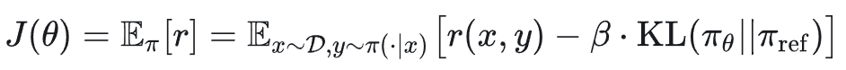
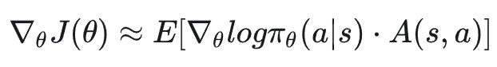
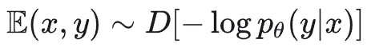

# RLHF/PPO为什么一定要rollout？

PPO 特点是反复交替：rollout → update → rollout → update …

rollout：采集数据（sampling/generation/interaction）

update：用采集的数据反向传播更新模型参数（optimization）

RLHF/PPO 需要用 rolllout 样本去更新模型参数，核心原因在于：PPO 是 on-policy（或近似 on-policy）强化学习算法，更新目标依赖“当前策略在其自身分布上产生的数据”。

换句话说：你想优化的就是“当前策略会生成什么”，所以训练数据必须来自它（或非常接近它）。

## 01 RLHF/PPO为什么需要rolllout？

下面用几条最关键的逻辑解释清楚。

1) 目标函数本身就是对“当前策略的采样分布”求期望

RLHF 里常见目标：

这里期望是对 y ~ π_θ（当前策略生成的回答分布）取的。所以要估计这个期望以及梯度∇_θJ（θ）。

最直接的方法是：

从π_θ里采样得到 y（这就是 rollout）

用这些样本做蒙特卡洛估计，再反向传播更新参数

没有 rollout，你就没有办法知道“当前策略到底会生成哪些 y”，期望就算不出来。

2) 强化学习的梯度需要“动作/序列 + 产生它们的概率”

PPO 本质上是策略梯度方法。最经典的形式（REINFORCE）。详见：

在语言模型里：

状态（s）：prompt + 已生成前缀 tokens

动作（a）：下一个 token

logπ_θ（a|s）：生成这个token的对数概率 logprobs

A：优势（来自 reward、value、KL shaping 等）

这些量必须在“策略实际生成时”记录，因此 rollout 是产生训练所需监督信号的唯一来源。

3) 如果不用 rollout（而是用旧数据），会出现分布漂移，训练目标就不对了

假设用旧策略π_θold生成的数据去训练新策略π_θ。

问题：π_θ 和π_θold 生成的文本分布不同。模型一更新，就会倾向生成新的模式、进入新的文本区域。

reward model 在新区域的统计可能不同

KL 惩罚在新区域的效果不同

value/advantage 估计在新区域误差更大

这叫 distribution shift/off-policy。如果直接拿旧样本做新策略更新，梯度会偏（甚至发散）。

PPO 的 Proximal，就是通过 clip 或 KL 约束让每次更新别离旧策略太远，从而让“用 rollout 样本计算的梯度”仍然可信。但前提仍是：样本得来自“当前/刚刚的策略”。

4) 在 RLHF 中，reward 依赖“完整生成结果”，而生成结果会随策略变化

RLHF 的 reward 通常是：

由 reward model 对完整回答 y 打分（或者对 query+response 打分）

这个 reward 不是一个固定 label，而是生成什么就得什么分

因此策略一变，生成的 y 变，reward 分布也变。必须不断 rollout，才能看到：

当前策略到底在生成哪些回答

这些回答在 reward model 下的得分是多少

哪些 token/哪些序列相对更好（优势更大）

不 rollout 就等于闭眼优化。

5) 为什么不像监督学习那样用静态数据集训练？

监督学习的目标是：

数据分布 D 是固定的，所以可以反复用同一个数据集训练。

但 PPO/RLHF 的目标里，数据分布的一部分就是π_θ，它随着训练实时变化，因此数据集不是静态的，必须动态生成——这就是 rollout。

6) 一个直观比喻

监督学习：老师给你固定题库（数据集），你刷题提分。

RLHF/PPO：你每次都在写“开放作文”（模型生成），老师（reward model）根据你写的内容打分。

你想提高分数，就必须不断写新作文拿新评分（rollout），再根据评分调整写作策略（update）。

## 02 总结一句话

RLHF/PPO 需要用 rollout 样本更新参数，因为优化目标依赖当前策略自身的生成分布；rollout 提供了估计期望与策略梯度所必需的“当前策略生成的轨迹、logprob 与 reward”。

作者：Shard Zhang

来源：https://zhuanlan.zhihu.com/p/2016981784856908646
