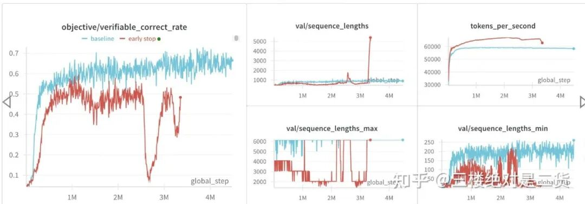
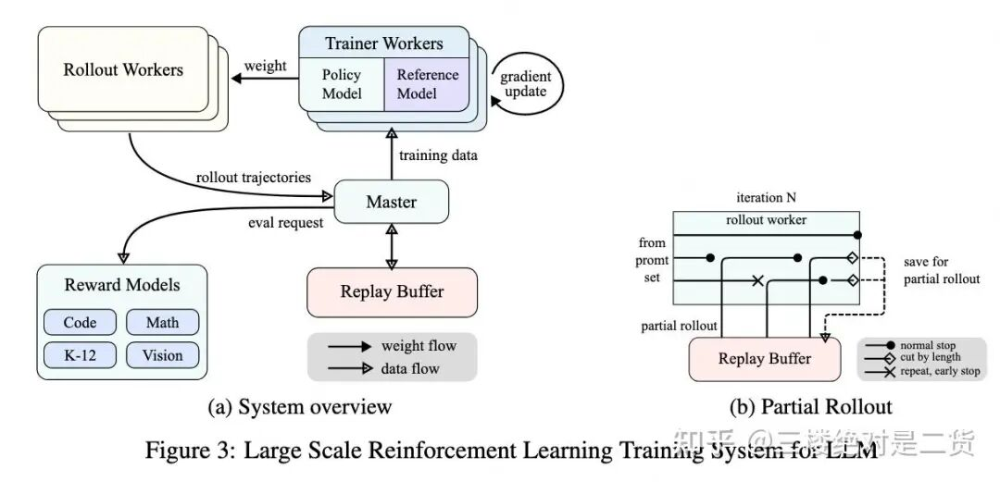
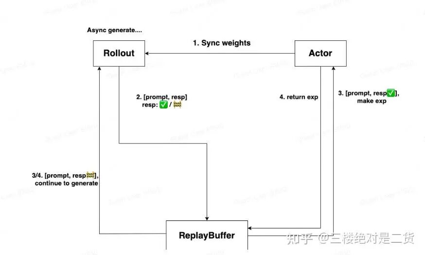
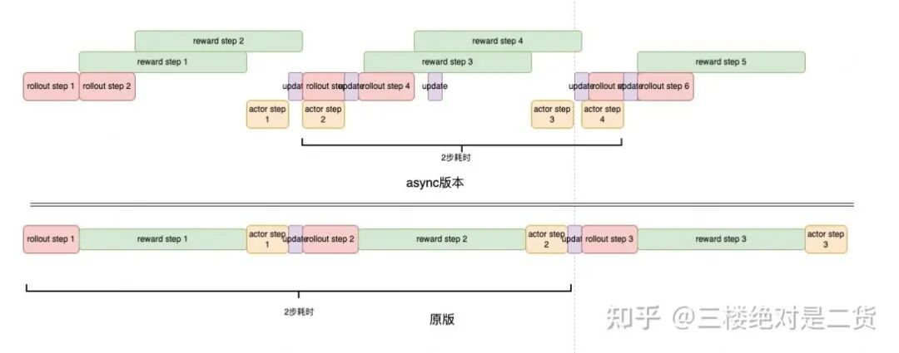
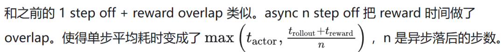
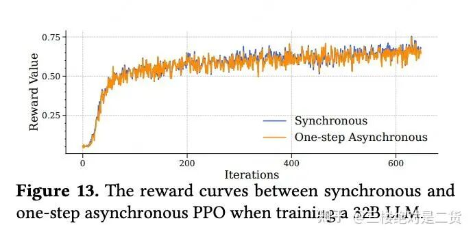
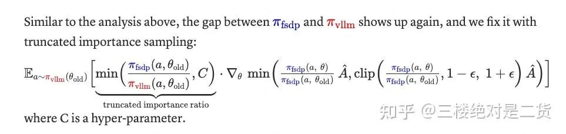
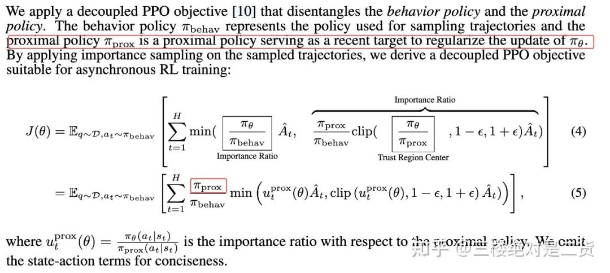

# RL训不动？干掉Bubble就对了

## 01 背景

从流程上看 RL 训练通常包含以下几个关键阶段：

Rollout 阶段（采样）：使用当前策略模型采样生成 respond 轨迹

Reward 阶段（奖励）：计算生成内容的奖励分数

Train 阶段（训练）：根据奖励信号更新模型策略

rollout 阶段一般耗时较长但对显存的需求小，train 阶段耗时短，但对显存的需求大。

尤其对于小业务组来说，显卡资源和训练数据制约，batch size 开不大。导致 rollout decode 阶段资源利用率更加不足。

Bubble 可能出现在 reward 阶段和 rollout 阶段。一些任务生成 reward 需要使用 llm 打分，为了打分效果好，甚至会使用在 thinking 模式的 DeepSpeed-R1。

此时 reward 的耗时占比能达到 80%+。等待 reward 生成时，训练机器空闲产生了 bubble。

## 01 rollout 序列长度不一致带来的 Bubble

VeRL 提供了 collocate 的置放方式（actor，rollout 在同一机器，分阶段切换）。

在测试时，发现 rollout 时间占比过长，达到 80%+。进一步排查发现是由于 rollout 阶段生成的 sequence 长度不一致。

比如：偶尔一两条 respond 的 sequence length 是平均值的 2 倍，导致即使其他 worker 已经生成完，所有 worker 也要等待 2 倍的时间，直到长序列生成完。如果能解决这种情况，RL 训练时间预估能缩短 30%

当然，业界也想出了多种方法来解决这种情况。

0. 直接截断长序列

最简单的方式是 early stop，遇到超长序列直接停止生成。

吞吐立刻提升 20%+，但效果也差了很多。想来也正常，这种方式相当于限制了模型的最大输出长度。效果自然受影响。

HTTPS://discuss.vllm.ai/t/rl-training-with-vllm-rollout-how-to-mitigate-load-imbalance-from-variable-response-lengths/117/3

1.partial rollout

KIMI K1.5[1] 很早就提出了 partial rollout，通过异步+打断长文本的方式，解决了生成 respond 的长尾问题。

遗憾的是，当时纯异步的探索不够多，算法比较担心效果。工程方面，异步需要 rollout 耗时和 update actor 尽可能相同才能没有 bubble，因此需要细致调节 rollout，actor 机器配比及数据的 batch size 等。

小团队卡数，数据集都比较小，没有什么调节空间。所以我们的业务没有使用这种方案。

2. 穷人版的 partial rollout

由此引出了穷人版 partial rollout 方案。感谢猛猿和其他美团同学的帮助。

这个方案有以下两个优点：

不改变 on policy 训练的

不需要调试 actor，rollout 机器配比（对小项目友好）

先 Rollout 和 Actor 的机器是分开的，那么整体方案如下：

Actor 同步 weights 给 Rollout

Rollout 做 generate，sgl 配置一个截断功能，即超过 max_tokens 这个阈值的时候停止生成。✅表示 resp 做完了（可能是短 resp），🚧表示 resp 没做完（超过阈值，可能是长 resp）。然后把这个结果给 ReplayBuffer

Actor（以及 ref/critic/rm 等）从 ReplayBuffer 上取 generate 完成的 resp，生成 exp

与此同时，Rollout 拿没做完的序列，做继续生成（从没做完的地方开始生成，不要重新生成），依然用 max_tokens 做阈值

与此同时，Actor 把算好的 exp 返回给 ReplayBuffer

上面整个过程中，Rollout 都是异步状态，即 resp 没生成完，不会影响 Actor 等 worker 做 exp。

这个方案本质上是把 actor 和长序列 rollout 做了一定的 overlap，性能收益约有 15%。

实现过程中，VeRL 需要补充的一些功能，比如不同 resource group 间的权重同步、rollout 阶段打断生成，replay buffer 的管理。

这些在其他框架中也有所实现。也可以看到 bubble 问题是 RL 训练比较普遍的痛点。

比如 openrlhf 的：LLM 之 Agent RL & Async Pipeline RL 训练和加速

https://zhuanlan.zhihu.com/p/1907529873414686329

AReaL 的异步训练、vllm 打断生成的补丁等等。

3.亚马逊的超量生成

当然也有人从算法角度解决这个问题。你不是少数长序列阻塞生成吗？我就超量生产。

比如 batch size=16，我就生成 20 条数据。前 16 个生成完的进行 update policy。

生成慢的 4 的停止生成，放到消费队列的末尾，最后再生成。当然也有更灵活的方式，比如每 n 步生成一次慢的。

简单且有效。印象中速度提升了 20%+，效果也没下降。找不到 PR 的链接了。

4.美团外卖搜推团队开发了 one step off

HTTPS://GitHub.com/volcengine/verl/pull/2231

严格的说 one step off 似乎没有什么性能上的收益，partial rollout 存在的问题它都有。

从作者的测试来看，确实吞吐没有提升反而下降了一些。但这个 PR，把后续切分资源池、异步训练的功能都实现了，方便了大家后续开发。

HTTPS://GitHub.com/volcengine/verl/pull/2854

果然后续这个 PR 利用到了 one step off，overlap 了计算 reward 的时间。

5.其他

Areal，openRLHF，slime，ROLL 等等主流框架也都早早推出了异步的方式，在此就不一一介绍了。

至此 RL 训练任务都还是单轮的代码或者数据题。在这些场景下 respond 长尾问题似乎被解决的差不多了。

或者说对于业务组来说不那么重要了，因为我们来到了训练 agent 的时代。

随着业务的主要需求从数学题打榜探索变成了 RL 训练 agent，我们又遇到了熟悉的新问题。

## 02 多轮对话的 bubble

多轮对话的 bubble更严重了。多轮对话往往混在工具调用，不同工具耗时不同。

多轮对话的总 respond 序列长度变的更长几十 K 甚至几百 K，长短不一的问题更严重了。对话的轮数不一样。

VeRL SPMD 的实现，需要每一轮攒够一个 batch 的数据再进行下一步。导致 rollout 时间极其漫长。

数据是 batch 维度管理的，每一轮需要不断的拆分重组。从开发效率和性能的角度来看，都不适合 agent 训练（多轮对话）场景。

1.agent loop

社区很快推出了 agent loop，rollout engine 采用 server 模式，逐条处理请求，再叠加 async 调用 tools，async generate，消灭了多轮对话每一轮的 bubble。

在我们场景下，agent loop 减少了 30% 的 rollout 时间。

agent 训练，往往需要大模型打分生成 reward 结果，由此 reward 也能产生显著的 bubble。在我们场景 reward 甚至能占总耗时的 80%。

2. rollout/actor async（n step off）

速度提升非常明显，1 step off 提升了 1 倍的训练速度。那么代价呢？又回到了最初算法担心的效果问题：off policy 会带来多大损失？

我们的场景这么做效果没有受到 off policy 的影响。stream RL 的实验也证明 1 step off 的影响微乎其微。

可以说只落后一步的 nearly on policy 对效果的影响很有限。

如果场景特殊，不幸受到影响了呢？我们也有一些补救方法：重要性采样

截断重要性采样（TIS）

HTTPS://fengyao.notion.site/off-policy-rl

这个文章发现 tis 能弥补 int8 rollout 带来的差异。

AREAL [2] 在异步训练中也采用了 TIS。

还有一个小插曲，原版的 TIS，π_prox需要由生成 respond 的权重产生 log prob，但它在工程上实现有些困难。

异步时，需要由 actor（训练引擎）产出它，但它的权重是 n 步之前的早就销毁了。

要么单独机器维护old actor，要么 actor offload 之前的权重，需要时再加载回来，十分繁琐。

好在经过 AReal 测试，π_prox用最新的训练权重产生，效果也差不多。我们实测也是如此。

## 03 未来展望

RL的训练框架有些像是由几块积木组装而成的：

训练引擎

推理引擎

资源配置及权重同步

1，2 都是使用已有的框架（FSDP，Megatron，vLLM，SGlang），3 是 RL 系统额外带来的。

现在也有了非常多的优化。slime 的权重同步已经能做到秒级的同步 30B 的模型了。Kimi，Sglang\vLLM 团队都有相关的优化博客。

以上 3 点，可以说需要做的工作已经比较少了。剩下的优化点，比如：量化，投机采样，RL 框架也和训练、推理引擎的没什么不同。

个人认为对 agent 训练，VeRL 还有以下两点不太方便：

数据组织、传输

环境接入

展开来说：

数据组织传输

dataproto 的数据组织方式已经非常不适合 agent 训练了。dataproto 需要按 batch 组织数据，而由于各种 bubble，这些数据生成不是同时的。batch 的组织方式在 respond 拼接、处理方面都不方便。

再加上 rollout 、actor async 的模式。我们消费数据可能需要先到先得。用 queue 来组织数据，单条 req 数据在 worker 之间流动更符合逻辑。最后需要一个组 data manager 处理最终的数据给到 actor 训练。

环境接入

环境接入的痛点是现阶段 rollout 和 env 是耦合的。而在现在 agent 发展的初期，线上 env 的迭代很频繁。离线训练需要实时同步 env，很消耗人力。

而实际上，训练流程中我们获得 token 轨迹（respond）和线上流程是一样的，只是多一个 mask。

完全可以以插件的形式，让线上推理的代码多返回 respond mask。这样 rollout+env 用线上 server 的方式（代码）启动，算法就不用维护 VeRL 的 env 代码了。

最后的最后，随着越来越多的 agent 业务上线，用户数量、真实样本越来越多。

期待 agent 训练也会走搜推框架的路。从离线到近线，再到实时训练。从批式（batch）到流式（stream），标签也能获得更多的用户反馈。

生产加工的流水线给我们带来了物美价廉的工业品。那么未来 agent 的流水线能为我们带来第三产业的标准品吗？

参考：

^[1] https://arxiv.org/abs/2501.12599

^[2] http://arxiv.org/abs/2505.24298

作者：三楼绝对是二货，已获作者授权发布

来源：https://zhuanlan.zhihu.com/p/1953592287788533035
