# 都在用MoE，但你真的会训吗？

无论是开源还是顶尖商业模型，moe 架构已经成为绝对主流，区别于 dense 模型，在 sft 和 rl 阶段有什么独特的训练难点或者挑战，对于这些挑战如何缓解。期望从基础原理入手，看如何训练 moe 架构？

TL;DR：

对于负载均衡与模型性能的权衡，aux_loss 超参设置需要做对比实验

对于 RL 阶段训练不稳定，RoutingReplay 是可以有效缓解训推差异和策略滞后性

对于专家并行，配合 EP 和 ETP 使用

## 01 基础原理

（1）原理解读

2017 年由 Google Brain 团队的大佬 Noam Shazeer[1] 提出 MoE（Sparsely-Gated Mixture-of-Experts）架构，核心是一个 trainable gating network 决定针对每一个输入样本，应该挑选哪几个“专家”来处理。

moe 架构来源于“conditional computation”思想，本质就是针对不同的输入样本，只激活网络中的一部分，让其他部分保持“沉默”（即不参与计算）

目前 moe 架构的几乎没变，因此这篇 paper 的图和公式依旧不过时：

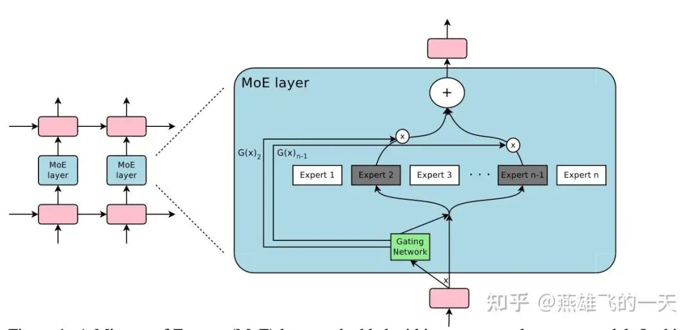

整体架构：混合专家（MoE）层由一组$$n$$个expert networks 和一个“gating network” 组成，其中门控网络的输出是一个稀疏的$$n$$维向量。图上图展示了该 MoE 模块的架构概览。

这些“expert”本身也是 networks，且每个专家都拥有各自独立的参数，并要求这些专家能够接收相同尺寸的输入并产生相同尺寸的输出。

形式定义：对于给定的输入 x，我们用 G（x）表示门控网络的输出，用 E_i（x）表示第 i个专家网络的输出，MoE 模块的输出 y可以写成如下形式：

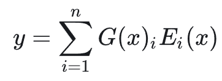

其中，门控网络的结构如下：保留 topk 个输出，其余赋值为负无穷，经过 softmax 后权重为 0。

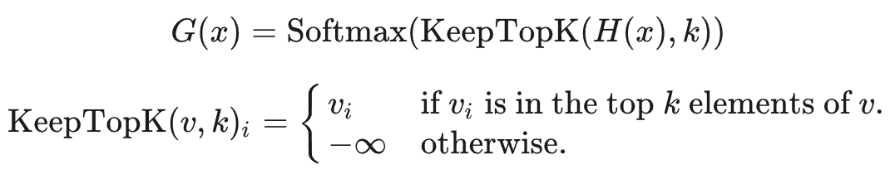

（2）负载均衡

负载均衡是 moe 架构训练中最核心的难点之一，Gating Network 在训练早期往往会倾向于给少数几个特定的“expert”分配很高的权重。

如果某个 expert 被选中的次数多，它得到的训练机会就多，它的性能提升就比其他“休息”的 expert 快，因为这个 expert 变强了，gating network 下次就更愿意选它。

最终导致只有少数几个 expert 在干活，而成千上万的其他 expert 根本没机会参与训练，变成了“僵尸 expert”，这极大地浪费了模型的参数容量。

目前有两种在顶尖开源模型经过验证的负载均衡策略，一种是 aux_loss（qwen 系列等），一种是 aux_loss_free（deepseek 系列等）。

aux_loss：2022 年，还是由 Google 团队大佬 Noam Shazeer 提出影响力极大的 switch transformer[2]，提出的负载均衡策略沿用至今。

核心是设计了一个辅助 loss 来确保所有 expert 处理的 Token 数量大致相等：

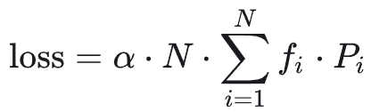

其中，f_i（实际分配比例）在当前这一 Batch 中，实际上有多少比例的 token 被分给了第 i个 expert。

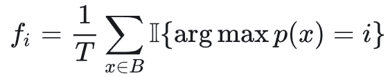

其中，P_i（预测概率比例）gating network 对第 i个 expert 的“平均偏好”程度。

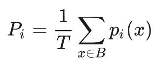

无论是实际分配还是预测概率，目标是让每个专家都分到 1/N的 token，因此这个 loss 最小值 1。

aux_loss_free：2024 年，由 DeepSeek 团队提出 deepseek v3 的核心组件策略 loss-free balancing，无需在 loss 里面增加辅助项，也就不会影响模型性能。

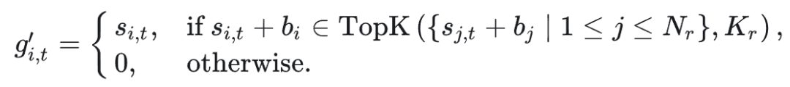

其中， s_i，t是第 i个 expert 原始的 gating score（未 topk 选择之前）；s_j，t + b_i是加上 bias 的得分。

可以看出这个：选 Top-K的时候，看的是加了偏置后的分数；但在计算输出（权重）的时候，依然用原始 gating score。

b_i更新是根据前一个 batch 的负载情况动态更新调节。

## 02 训练难点

难点一：负载均衡与模型性能的权衡

在 MoE 架构训练中，辅助损失（Auxiliary Loss）的权重调节是核心挑战。

虽然增加 aux_loss 能强制专家负载均匀分布，但由于其梯度会干扰主任务的学习逻辑，权重过大会导致模型性能（Eval Loss）显著下降。

模型性能：实验数据显示，aux_loss 权重越小，模型收敛效果越好（如图中蓝色实线所示）。

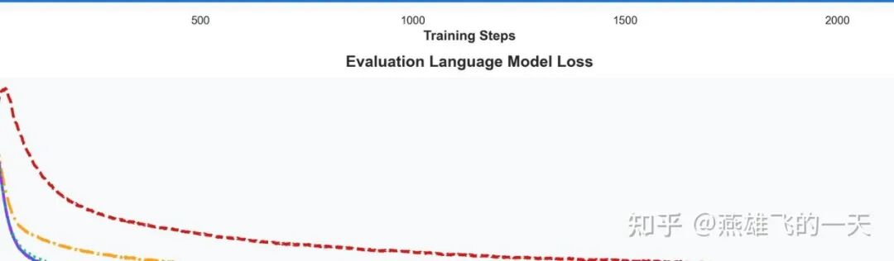

负载均衡：通过相对负载均衡 metric 来衡量平衡效果，实验数据显示，aux_loss 权重越小，模型越不平衡（部分 expert 过载，部分 expert 闲置）。

实际专家负载：某个专家在训练集上处理的 token 数。

理论均衡负载：如果所有专家均匀分配任务，每个专家应处理的 token 数（即总 token 数 ÷ 专家数）

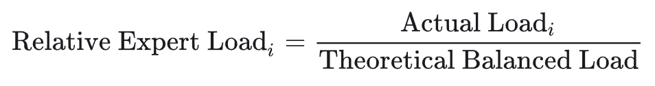

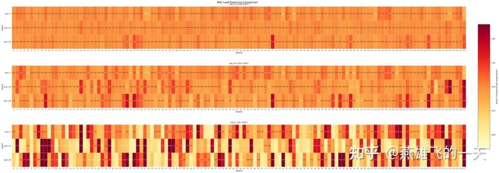

综合权衡性能与均衡度，超参设为 0.001 是较为理想的平衡点。

难点二：RL 阶段训练不稳定

RL 训练通常面临“奖励-梯度不匹配”的问题（序列级奖励 vs. Token 级更新），（具体可见[3]证明）其本质源于两大差异：

训练-推理差异：由于底层基础设施（如计算 kernel 不同、推理端为了吞吐量关闭了 batch-invariant kernels、FP8 推理 vs BF16 训练）导致的数值误差

策略滞后性：Rollout 策略与当前优化策略之间的差异，这通常由 Off-policy 更新（大 Batch 拆分为 mini-batch 多次更新）引起

对于MoE 模型，上述微小差异会被显著放大：

路由不一致：即使输入相同，训练和推理引擎的数值微小差异可能导致选中的专家完全不同，极大放大了训练-推理差异

专家漂移：策略更新不仅改变参数，还改变路由选择，加剧策略滞后性

解决方案：Routing Replay技术。

Vanilla Routing Replay（R2）：

在梯度更新时，重放训练引擎中 Rollout 策略选中的专家

主要减少策略滞后性

Rollout Routing Replay（R3）：

在训练引擎中重放推理引擎中选中的专家

主要减少训练-推理差异

最佳实战：（具体实验参考[3]）

On-policy/小 Off-policy：推荐 MiniRL + R2 (Vanilla Routing Replay) 。此时 Bias 较小，R2 足以稳定训练。

大 Off-policy：推荐 MiniRL + R3 (Rollout Routing Replay) 。此时稳定性压倒一切，R3 能更强力地消除差异。

难点三：专家并行的考量

参考 megatron-bridge 中关于专家并行的核心参数解释[4][6]，expert_model_parallel（EP）和 expert_tensor_model_parallel（ETP）是专门针对 Mixture-of-Experts（MoE）模型设计的并行策略。

EP：将模型中的多个专家分配到不同的 GPU 上

ETP：将每一个专家权重进一步切分，分布在多个 GPU 上

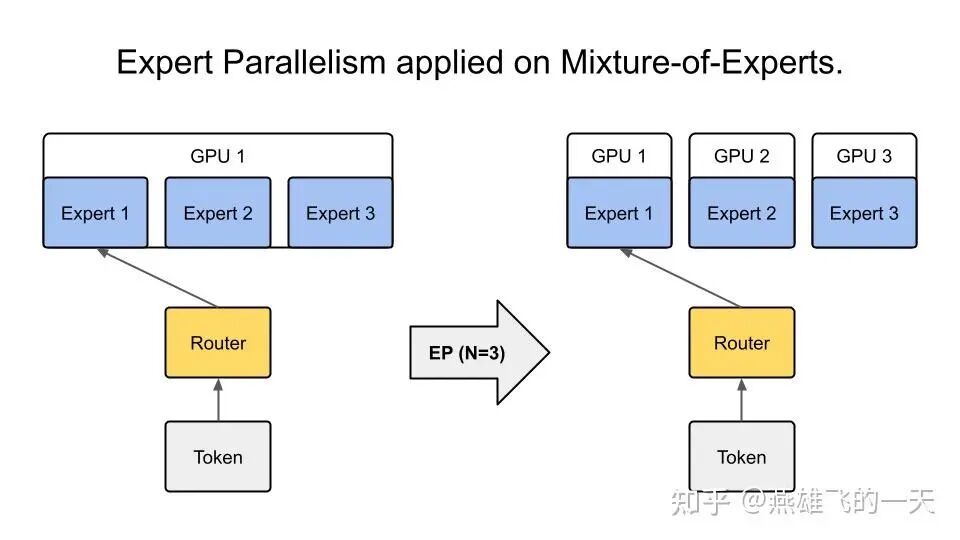

如果你发现单个专家（Hidden Size 很大）塞不进卡里，你就调大 ETP；如果你发现专家太多了（比如 256 个），你就调大 EP。

工具推荐

MOE-Patch 是一个专为 MoE 模型设计的深度监测工具。

它通过 Monkey Patch 机制，在不侵入原始训练或推理框架（如 verl，ms-swift，vllm 等）源码的前提下，实时捕获并分析路由分布、专家负载、Token 丢弃率等关键指标[5]，弥补当前训练或者推理框架缺乏 moe 细粒度监测能力。

reference：

[1] Shazeer, Noam, et al. "Outrageously large neural networks: The sparsely-gated mixture-of-experts layer." arXiv preprint arXiv:1701.06538 (2017).

[2] Fedus, William, Barret Zoph, and Noam Shazeer. "Switch transformers: Scaling to trillion parameter models with simple and efficient sparsity." Journal of Machine Learning Research 23.120 (2022): 1-39.

[3] Zheng, Chujie, et al. "Stabilizing reinforcement learning with llms: Formulation and practices." arXiv preprint arXiv:2512.01374 (2025).

[4]https://docs.nvidia.com/nemo/megatron-bridge/latest/parallelisms.html

[5]https://github.com/direction-yxf/moe_patch

[6]https://swift.readthedocs.io/en/latest/Megatron-SWIFT/Command-line-parameters.html

作者：燕雄飞的一天

来源：https://zhuanlan.zhihu.com/p/2018018879109091590
