# 碾压GRPO？On-Policy Distillation成新主流

说实话，每次看到 GRPO 训了好几天、用了十几倍的 token，最后提升还没 SFT 显著，心里真的有点不是滋味。

RL 理论上很美，实践里总是烦人：reward 太稀疏、credit assignment 没法细粒度、group 里全错了梯度直接归零。

SFT 省力，但训出来的模型在推理时碰到自己没见过的分布，容易信心爆棚、错得挺离谱的。

2025 年下旬，Thinking Machines Lab 提出一个折中方案：On-Policy Distillation。让学生先生成自己的轨迹，再用 teacher 的分布去纠正。

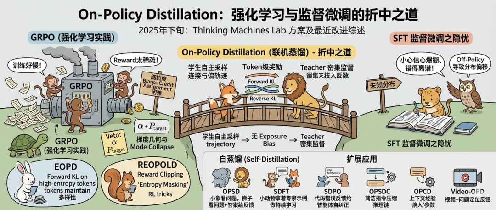

保留了 on-policy 的零 exposure bias，又用上了 teacher 密集的 token 级监督。

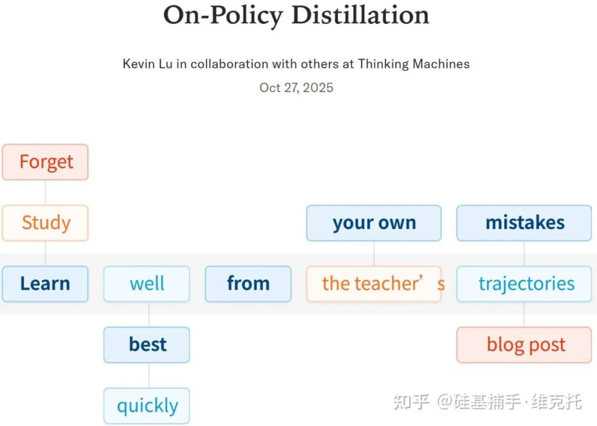

最近半年时间里，不少人也针对这个方向有不少改进工作。今天，我整理了 9 篇相关工作，分 3 个方向来总结一下。

## 01 汇总：几篇论文的关键点

先做一个全部汇总：

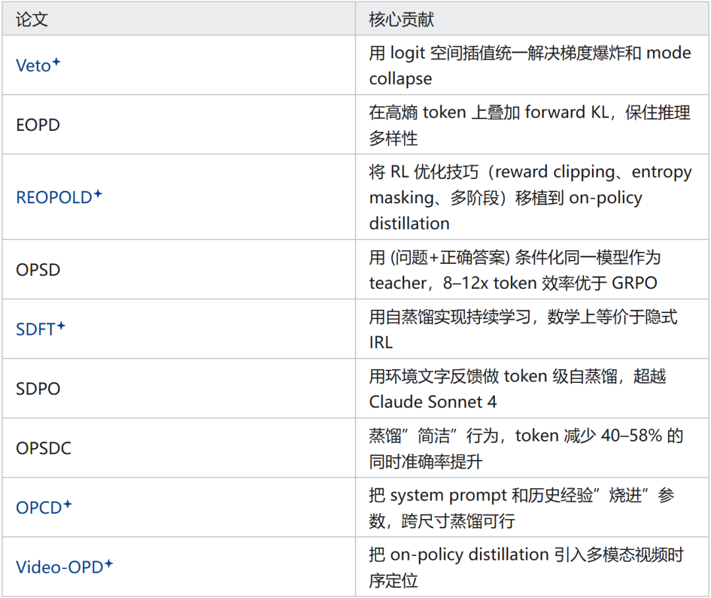

## 02 稳定性与多样性：On-Policy KD 的基础难题

On-policy distillation 的核心思路是让学生在自己采样的轨迹上接受 teacher 分布的指导。但“谁是 teacher、用什么散度、怎么选 token”——每步都藏着坑。

1. Veto：从梯度几何的角度修复训练崩溃

论文：Stable On-Policy Distillation through Adaptive Target Reformulation（arXiv 2601.07155）

问题出在哪？Forward KL 会让梯度在”无知 token”上爆炸。

那些 teacher 概率 P_T ＞ 0.1但学生概率P_S ＜0.01的位置，梯度量级直接冲到 10^7，一训练就崩。

Reverse KL 又走向另一个极端：mode-seeking，模型只学到 teacher 最高概率的那条路，多样性彻底没了。

Veto 的思路：不是在数据层面做 mixing，而是直接在 logit 空间里构建一个”过渡分布”。

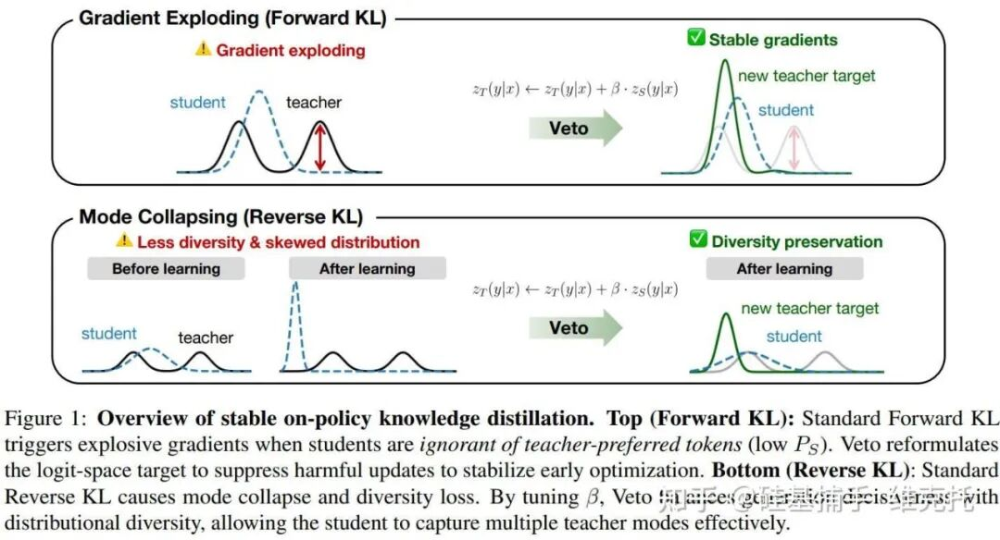

用一个可调参数α，在 teacher 和 student 之间做几何插值，作为新的优化目标：

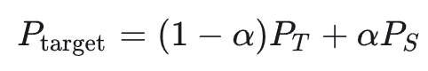

这个α 有两重作用：

一方面，在 forward KL 场景下，它把无知 token 上的梯度压回正常范围；

另一方面，在 reverse KL 场景下，它变成一个”决策旋钮”，控制熵正则化的强度，在 mode-seeking 和 diversity 之间取平衡。

结论：Veto 表明，on-policy KD 不稳定的根源不是数据质量或模型架构，而是散度目标本身的几何结构。一个标量参数α就能同时解决梯度爆炸和 mode collapse。

2. EOPD：在高熵 token 上加一把 Forward KL

论文：Entropy-Aware On-Policy Distillation of Language Models（arXiv 2603.07079）

问题：Reverse KL 把多样性杀死了。

作者用 Qwen3-8B teacher 和 Qwen3-1.7B student 做实验。在 AIME24/25 的 prompt 上，teacher 有 18.5% 的 token 处于高熵状态，而 reverse KL 训练的学生只保留了 6.8%。

高熵位置恰恰是推理的关键分叉点，student 在这里坍缩，直接导致多样性丢失。

一个控制实验说明了问题有多严重：用 80 个 token、5 个 mode 的 teacher 分布做玩具实验，高熵场景下 top-1 预测变换次数高达 84.0± 16.7，低熵只有 7.3 ± 1.6 ——学生连收敛都做不到。

EOPD 的解法：

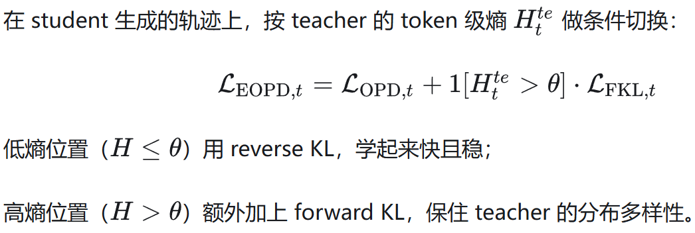

效果：在 MATH500、AIME24/25、AMC23 等 6 个数学推理 benchmark 上，相比 baseline OPD：

Qwen3-0.6B：Avg@8 +1.16，Pass@8 +1.37

Qwen3-1.7B：Avg@8 +0.99，Pass@8 +2.39

Qwen3-4B：Avg@8 +1.80，Pass@8 +5.05

增益随模型规模增大，说明这个问题在更大模型上更显著。

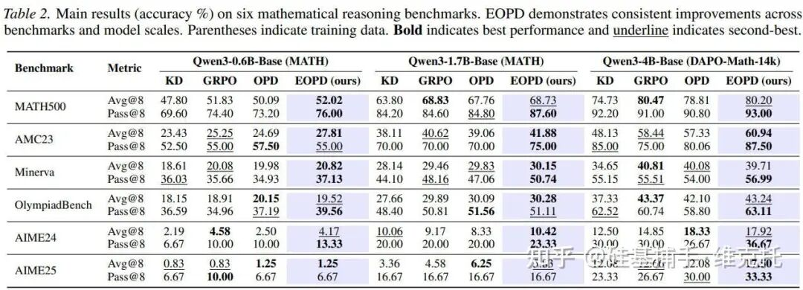

3. REOPOLD：把 RL 技巧搬进 On-Policy Distillation

论文：Scaling Reasoning Efficiently via Relaxed On-Policy Distillation（arXiv 2603.11137）

一个重要等价关系：作者形式化地证明了：带 stop-gradient 的 on-policy distillation，在理论上等价于 on-policy policy gradient 优化。

teacher-student log-likelihood 之比就是 token 级的 reward。

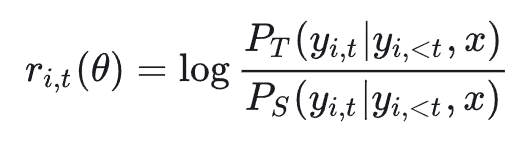

这个等价性让我们可以直接把现代 RL 优化技巧搬进来用。

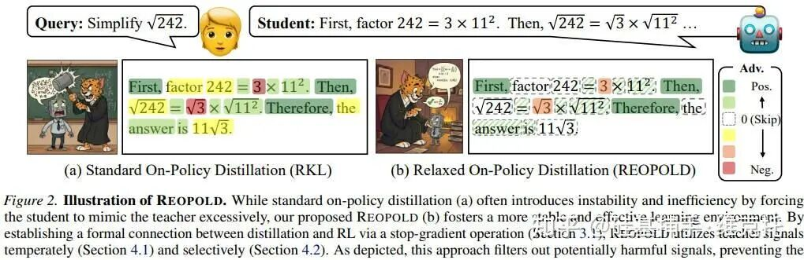

三个核心组件

① 混合 reward clipping

不像 PPO 裁剪重要性采样比，REOPOLD 直接裁剪 reward 本身：

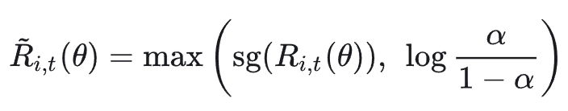

防止重尾负 reward 主导梯度。

② 熵引导的 token 级动态采样

用熵作为信息密度的代理，只在每批熵排名 top-（1-ρ）的 token 上计算梯度。低熵 token 直接过滤掉，去除零 reward 噪声。

③ 探索→精炼的多阶段训练

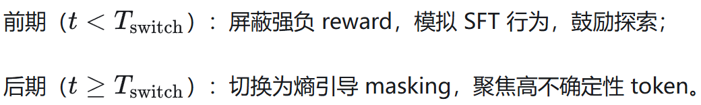

效果：AIME-25 上，REOPOLD 的 Pass@1 约 32–34%，相比 ProRL、Still-3-1.5B 等 RL 方法，样本效率提升 6.7–12 倍。

在视觉推理任务，3B 学生接近 32B teacher 的表现，推理速度 3.3 倍（Geometry3K）和 2.2 倍（MathVerse）。

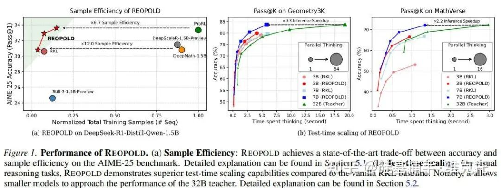

## 03 自蒸馏与特权信息：不需要外部 Teacher

前面三篇都假设有一个外部的、更强的 teacher。

这一节的四篇论文走了不同的路：用模型自身作为 teacher，通过在 prompt 里注入特权信息来构造有效监督信号。

1. OPSD：自己教自己，8–12 倍 Token 效率提升

论文：Self-Distilled Reasoner: On-Policy Self-Distillation for Large Language Models（arXiv 2601.18734）

核心观察：如果模型在 prompt 里看到了正确答案 y*，它就能”倒推”推理过程，为当前错误的轨迹提供密集的 token 级监督。

于是出现了一个巧妙的角色分离：

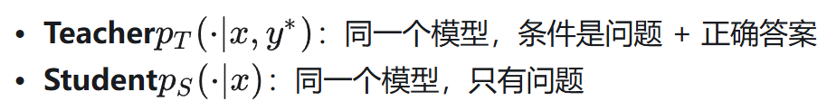

训练目标是最小化 teacher 和 student 在 student 自己采样轨迹上的散度：

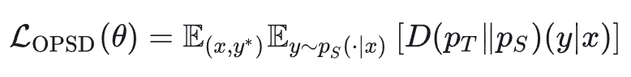

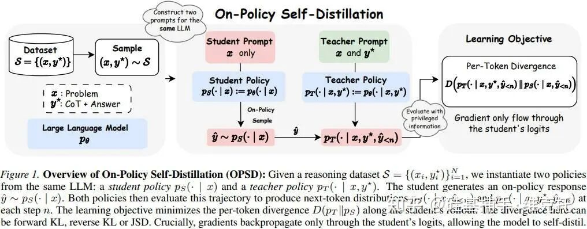

Token 效率的巨大差距：OPSD 把生成长度限制在 1,024 tokens；GRPO 用的是 16,384 tokens。

两者最终精度相当，但OPSD 的 token 效率是 GRPO 的 8–12 倍。

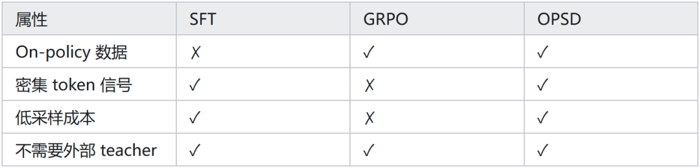

上面表格说明 OPSD 同时具备所有理想属性，而 GRPO 和 SFT 各自有明显短板。

2. SDFT：用自蒸馏解决持续学习的灾难性遗忘

论文：Self-Distillation Enables Continual Learning（arXiv 2601.19897）

问题背景：模型学新技能就忘旧技能，这在 LLM 的持续学习中几乎是”默认设定”。

RL 可以缓解遗忘，但需要显式 reward 函数，很多场景没有；SFT 用示例数据训练，但它是 off-policy 的，遗忘问题很严重。

SDFT 的设计：把专家示例 c变成模型的 in-context 特权信息，用模型自身的 ICL 能力构造 on-policy 学习信号：

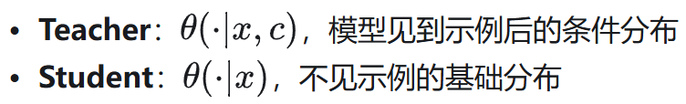

训练目标是 student rollout 上的 reverse KL：

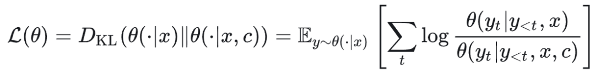

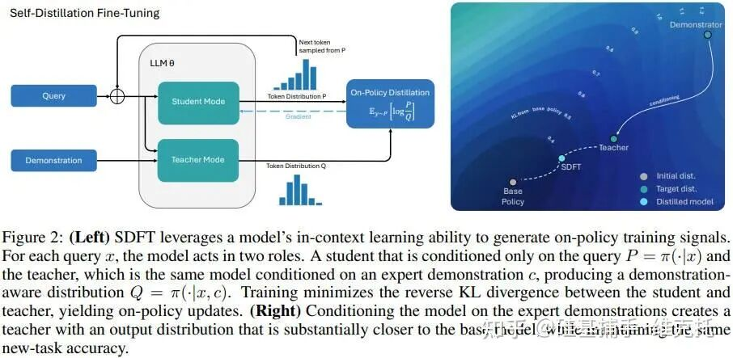

数学上等价于隐式 IRL：这个目标等价于最大化一个隐式 reward：

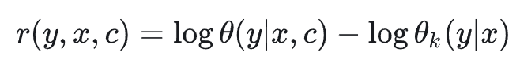

结构和 RLHF 完全一样，但不需要单独训 reward 模型——reward 已经被编码在 teacher 的对数概率里了。

持续学习实验：

依次训练三个任务：工具使用 → 科学问答 → 医疗问答。

SDFT：三个任务训完后，每个任务的性能基本没有下降。

SFT：每开始训下一个任务，上一个任务的性能就大幅崩溃。

Teacher 在示例条件下达到 100% 成功率，与 base model 的 KL 散度仅 0.68 nats（SFT 则是 1.26 nats），这种”贴近基础分布”的特性正是遗忘减少的核心原因。

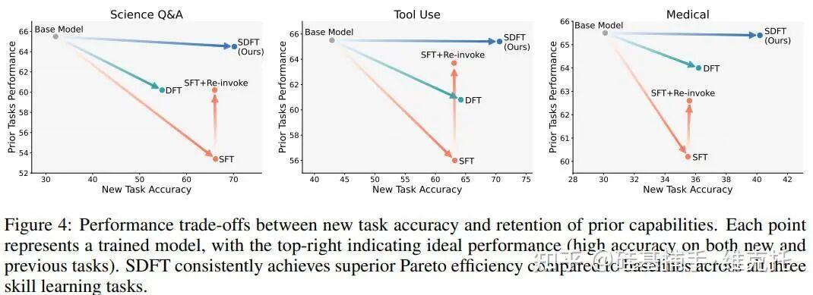

3. SDPO：用环境反馈做自蒸馏，超越 Claude Sonnet 4

论文：Reinforcement Learning via Self-Distillation（arXiv 2601.20802）

新问题定义：标量 reward 的 RL（如GRPO）浪费了太多信息。

代码执行失败时，报错信息里其实已经说清楚”哪一行出了什么问题”，但 GRPO 只取一个 0/1。

本文的想法是，智能体收到的是 tokenized 的文字反馈 f（如运行错误、失败测试用例、评判评语等），而不仅仅是标量。

SDPO 的核心做法：不需要采样新轨迹——让同一个模型在看到反馈 f之后，对自己原来生成的轨迹重新打分：

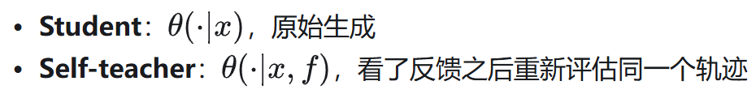

每个 token 的优势函数：

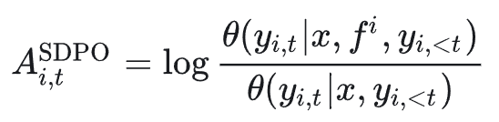

额外计算开销仅 +5.8%（只需重算 log-prob，不需要额外生成）。

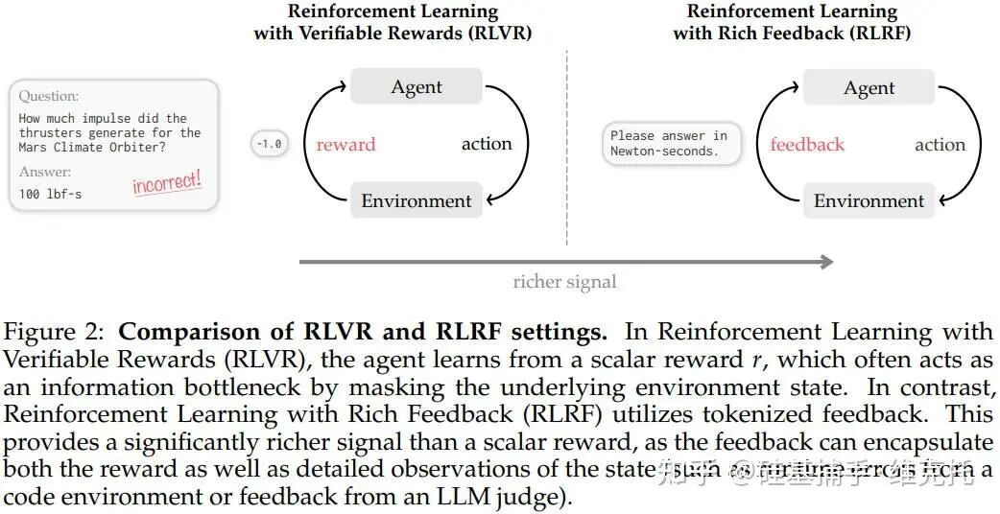

最终效果：SDPO 达到 GRPO 最终精度所需的生成次数减少了 4 倍。

在化学任务上，Olmo3-7B 用 SDPO 在 30 分钟内达到 GRPO 跑 5 小时才能达到的精度，接近10倍加速。

SDPO 生成的回答比 GRPO 短 3–7 倍，精度还更高。

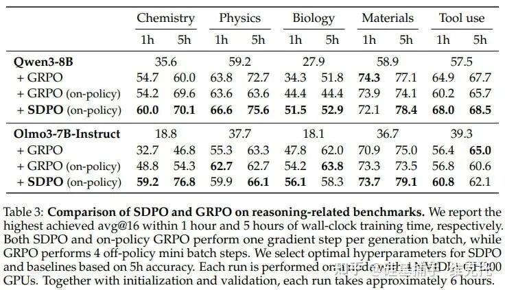

4. OPSDC：越想越错，压缩 token 反而提升了准确率

论文：On-Policy Self-Distillation for Reasoning Compression（arXiv 2603.05433）

一个反直觉的发现：我们都以为推理 token 越多越好，但现代推理模型（如o1、DeepSeek-R1、Qwen3）在简单问题上也会生成几千个 token 的内部独白——这些不必要的 token 不只是浪费，它们还是潜在的错误来源。

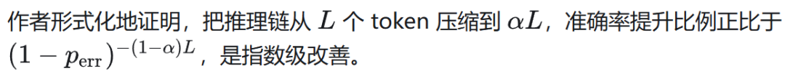

OPSDC 怎么做：不需要正确答案，不需要 reward，只需要一个”请简洁”的指令 c：

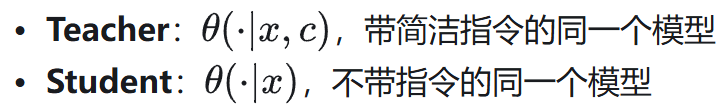

在 student 轨迹上做 reverse KL：

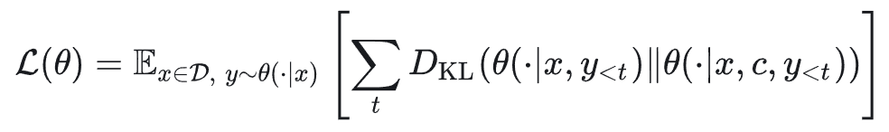

每隔 M = 50步把 teacher 权重同步为最新的 student，构成一个渐进压缩的目标。

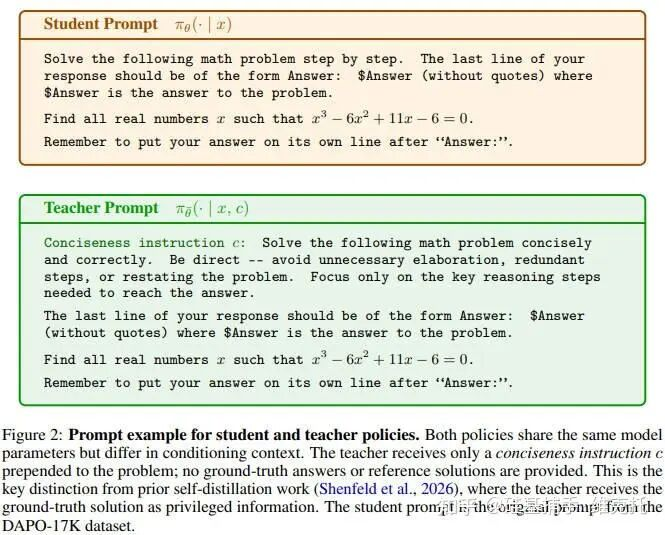

为什么选 Reverse KL 而不是 Forward KL？

作者实验表明，Forward KL 在每次 teacher 刷新后都会触发一轮精度崩溃，到第 190 步时 Qwen3-14B 的 AIME 精度差距超过 23%。Reverse KL 完全不受影响。

实验结果：在 30K token budget 下，OPSDC 少想了 40–58% 的 token，准确率反而高了 10–16 个百分点。

难题自适应也很优雅：MATH-500 上压缩了 56–58%，AIME 2025 只压缩了 35%——模型自动对难题”少压缩”，因为难题下即使 teacher 也需要充分推理。

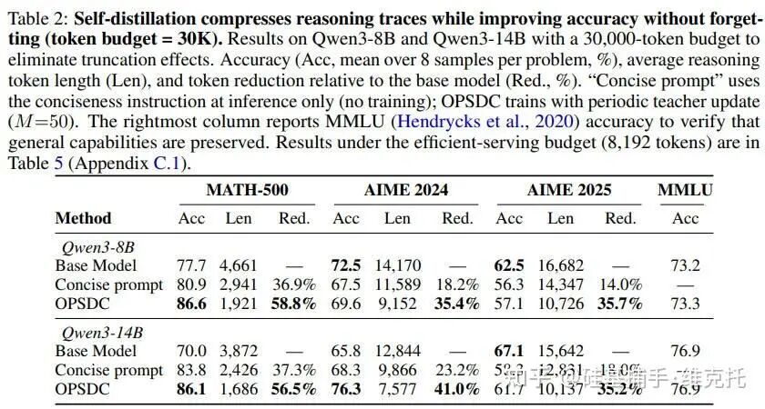

## 04 场景扩展：从纯文本到多模态，从问答到情境知识

1. OPCD：把上下文知识永久写进模型参数

论文：On-Policy Context Distillation for Language Models（arXiv 2602.12275）

问题很实际：你花了很长时间 prompt engineering，写了一个让模型表现很好的 system prompt；或者你有一批历史解题记录，里面藏着很多”经验教训”。

问题是——这些信息只在上下文存在时才有效，一旦 context 清空就什么都没了。

Context Distillation 的目标是把这些上下文知识”烧进”模型参数，让模型不需要看 context 也能有同样的行为。

为什么需要 On-Policy？Off-policy 的 context distillation 有两个问题：

Exposure bias：训练时喂 teacher 生成的序列，推理时模型要生成自己的序列，分布对不上。

Forward KL 的幻觉问题：mode-covering 让 student 在本没有能力覆盖的 token 上也赋予概率质量。

OPCD 的做法：Student 生成轨迹，teacher（带上下文 c）在这条轨迹上评分，用 reverse KL 更新：

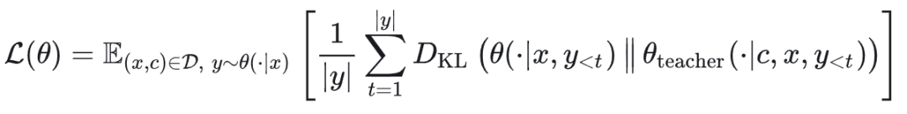

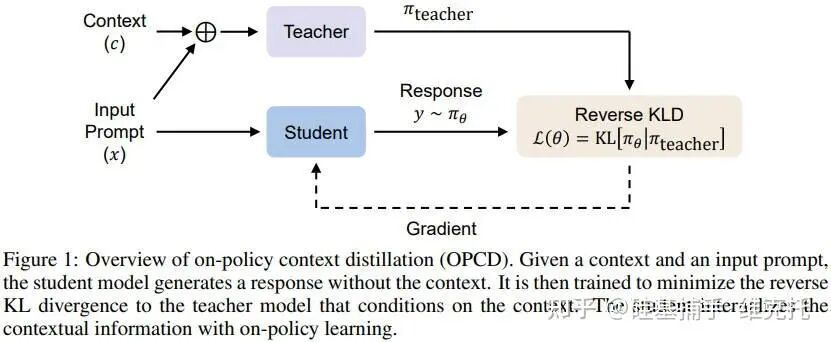

跨尺寸蒸馏：一个有意思的发现：把 Qwen3-8B 的经验知识直接放进 1.7B/4B 模型的 context 里，反而会降低性能。

但 OPCD 成功把 8B 的经验知识蒸馏到 1.7B/4B 的参数里，效果显著提升。

系统 prompt 蒸馏（医疗任务）：

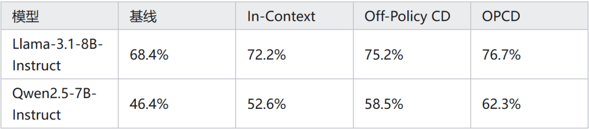

OPCD 不仅超过 off-policy 方案，某些情况下甚至超过了 in-context 本身。

此外，蒸馏安全系统 prompt 时，OPCD 相比 off-policy CD 在 OOD 医疗任务上高约 4 个点。

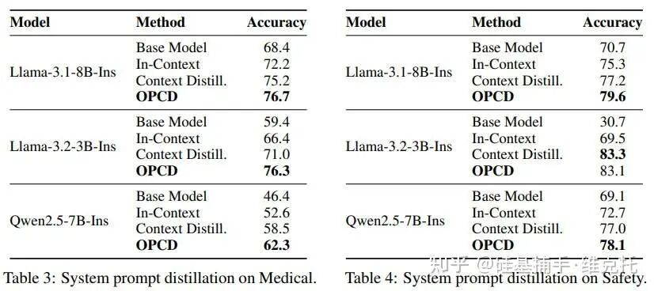

2. Video-OPD：把 On-Policy Distillation 带进视频时序定位

论文：Video-OPD: Efficient Post-Training of MLLMs for Temporal Video Grounding via On-Policy Distillation（arXiv 2602.02994）

任务背景：给一段视频和一个自然语言问题，模型需要输出一个时间段 [t_s，t_e]。这叫做 Temporal Video Grounding（TVG）。

GRPO 在这个任务上的两个问题：

每条轨迹只有一个 scalar reward（0/1），信号极度稀疏，无法细粒度定位”哪个时间段预测错了”。

每次采样都要处理很长的视觉上下文，多条 rollout 的计算开销巨大。

Video-OPD 的设计：用一个强 teacher（Qwen3-VL-32B，经 GRPO 训练）对 student（Qwen3-VL-8B）的轨迹进行 token 级评分：

每个 token 的奖励：

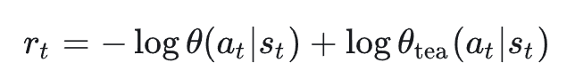

teacher 只做评分，不做生成，保证 student 轨迹的 on-policy 特性。每个样本只需要一次 rollout。

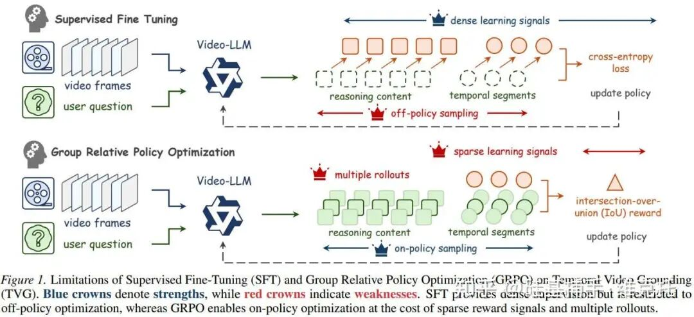

TVDF 课程学习：在 Video-OPD 之上设计了一个轻量训练课程：

Teacher Reliability Pre-Validation（TRPV）：用 ground-truth IoU 过滤 teacher 预测不可靠的样本。

Disagreement-Based Trajectory Prioritization（DBTP）：在可靠样本中，优先训练 teacher-student 分歧最大的那些——这些是学习潜力最大的地方。

三个主流 TVG Benchmark 结果：

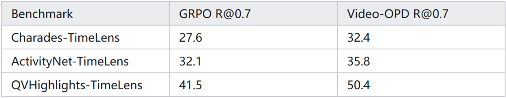

Video-OPD 跨三个 benchmark 的平均提升超过 17%，GRPO 约 12%。

在 R@0.7（精细时间对齐）上的增益最大，恰恰说明 token 级 credit assignment 在需要精确时序定位的地方最有用。

Video-OPD 超过了 GPT-4o、GPT-5 和 Gemini-2.0-Flash，接近 Gemini-2.5-Flash。

## 05 我的感受

on-policy distillation 解的是一道以前没有好答案的题：把 RL 的 on-policy 特性和 SFT 的密集监督真正结合起来。

这个思路已经不只在论文里了。小米的 MiMo 系列、Hugging Face 推的“Unlocking On-Policy Distillation for Any Model Family”，都是这个方向在落地。

teacher 模型越来越强、算力门槛比 GRPO 低、自蒸馏路线不依赖外部 teacher——后续会越来越实用。

作者：硅基捕手·维克托，已获作者授权发布

来源：https://zhuanlan.zhihu.com/p/2020191969205306820
