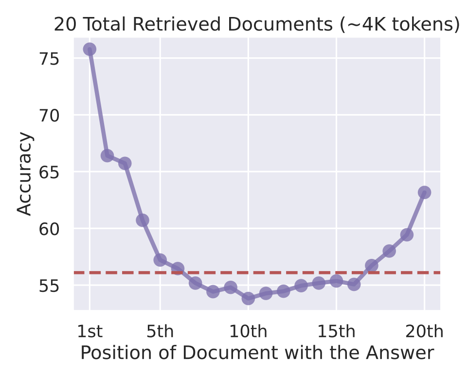
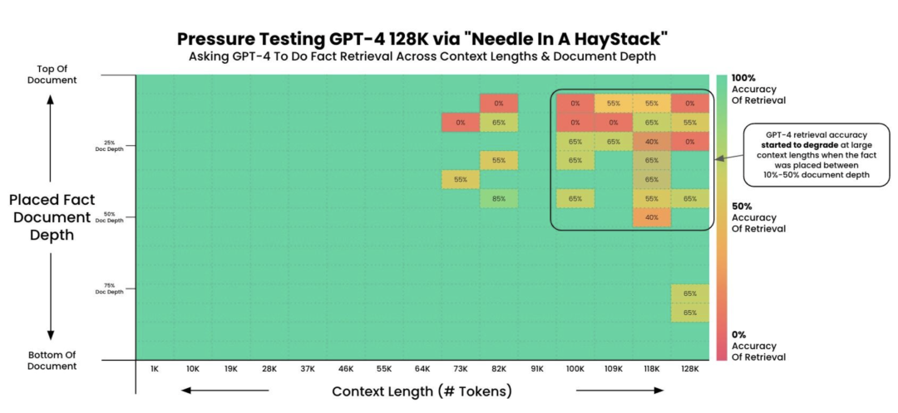

# LLM无限上下文了，RAG还有意义吗？

今天我们来聊一道特别容易“翻车”的面试题。为什么说容易翻车呢？因为很多同学一听到这题，第一反应是“那肯定还有意义啊”，然后就开始罗列 RAG 的好处，说完发现面试官面无表情——因为你没有真正回应他的核心质疑。

这道题的原题是：“当 LLM 的上下文做到无限大，RAG 还有存在的必要吗？”你得先接住这个的假设，再去拆解，不能上来就否定。我们一步步来看怎么答。

首先你得明确一个立场：RAG 依然有意义，而且短期内不可替代。但你不能只说结论，你得把“为什么”讲清楚。我们从三个层面来展开。

第一个层面，所谓的“无限上下文”到底是不是真的无限。

很多人看到 Gemini 1.5 Pro 支持百万 token、Kimi 做到 200 万 token，就觉得上下文问题已经解决了。

但你仔细看技术实现就会发现，这些所谓的超长上下文本质上是“动态压缩”，通过分块处理和注意力机制优化把长文本折叠成可计算的向量序列。它不是真的把所有信息等权重地“记住”了。

这里有一个非常经典的问题叫“Lost in the Middle”，就是说模型对上下文头部和尾部的信息关注度高，中间的信息会被严重忽略。

实测数据显示，当关键信息放在长上下文的中段时，准确率可以下降 10 到 20 个百分点甚至更多。

Llama-4 在 Fiction.LiveBench 的测试里，16K 上下文时召回率直接暴跌到 22%，比随机猜还差。

所以“无限上下文”更像是一个 marketing 概念，工程上它有非常明确的精度天花板。

第二个层面，我们来看 RAG 解决的核心问题到底是什么。

很多人对 RAG 的理解停留在“私有知识库问答”这个层面，觉得它就是个检索工具。

但 RAG 本质上解决的是三个问题：一是精准定位，二是时效性，三是成本控制。

精准定位这个好理解。你有一个百万 token 的文档塞进去，模型要自己在里面“大海捞针”，注意力机制天然会衰减。

但 RAG 是先通过向量检索把最相关的几个 chunk 捞出来，只把这几百个 token 喂给模型，模型在一个小而精的上下文里做推理，准确率反而更高。

有实验对比显示，RAG 增强模式的信息完整性能做到 88%，而纯长上下文模式只有 60% 左右。

时效性这个点很关键。LLM 的知识是 frozen 的，它有训练截止日期。哪怕你上下文窗口做到无限大，模型本身也不知道昨天发生了什么。

RAG 可以实时连接外部知识库，做到增量更新，这是上下文窗口再大也解决不了的问题。

成本控制这个在工程里是最现实的。你把 100 万 token 全塞进去，推理一次的费用和延迟是线性增长的。

而 RAG 只检索相关的几个片段，可能只需要几千 token 就够了，成本能省 90% 以上。在生产环境里，这不是一个可以忽略的差距。

第三个层面，也是最容易让面试官眼前一亮的点。

从技术本质上看，所谓的“无限上下文”和 RAG 其实不是对立关系，它们解决的是不同层次的问题。

有一个很有意思的观点是，Google 有篇 Infini-attention 论文里实现的所谓无限上下文，本质上就是在 QKV 矩阵的粒度上做了一次召回——只不过传统 RAG 是在自然语言粒度做检索，而它是在模型内部的向量空间做检索。从这个角度看，“无限上下文”本身就是一种隐式的 RAG。

所以最终的回答框架应该是这样的：即使上下文窗口趋近无限，RAG 依然有意义，因为它解决的不仅仅是“装不下”的问题，更是“找得准”“跟得上”“花得少”的问题。

而且在可预见的未来，最优的生产架构一定是长上下文和 RAG 的混合方案——用长上下文处理需要全局理解的复杂推理任务，用 RAG 来做精准的知识定位和实时信息注入。

最后补一句，如果面试官追问“那有没有 RAG 真的会被替代的场景”，你可以说：对于那些数据量小、更新频率低、且对精度要求不极端的场景。

比如个人笔记问答，确实可以直接塞进长上下文搞定，不需要额外搭 RAG pipeline。这样回答显得你的独特见解，还有工程判断力。好，这道面试题就讲到这里。
