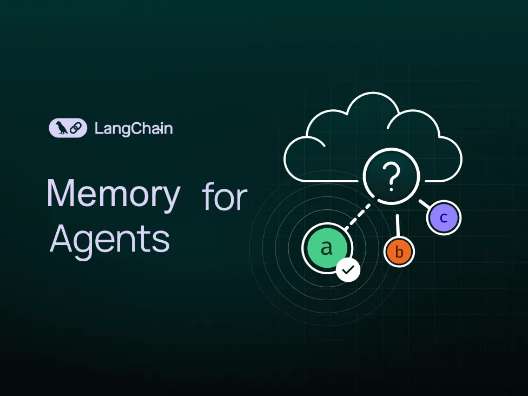
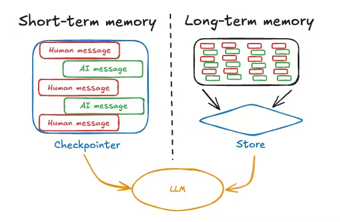
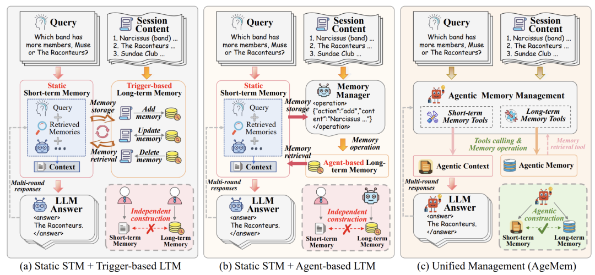

# 美团二面：Agent长期/短期记忆怎么设计？

前几个月的春招有个学员面美团的大模型应用岗，二面聊到 Agent 架构设计，面试官直接抛了一句：“聊聊 Agent 的记忆机制吧，长期和短期你会怎么设计？”

学员当时答得比较散，回来复盘的时候我带他一起梳理了一遍，我觉得这个题非常典型，值得好好拿出来讲。我们来看怎么把它答得有结构、有深度。

## 01 为什么 Agent 需要记忆？

首先你得明确一点：为什么 Agent 需要记忆？

这不是废话，这是你回答的逻辑起点。LLM 本身是无状态的，context window 是有限的，而且每次推理的 token 成本摆在那里。

一个没有记忆的 Agent，每次对话都像失忆患者，用户刚说完订单号，两轮之后它就忘了。

所以记忆系统本质上是在解决两个问题：

一是当前会话内的上下文连贯性

二是跨会话的知识持久化

这两个问题分别对应短期记忆和长期记忆。

好，我们先说短期记忆。

短期记忆其实就是当前 session 内的工作记忆，它的载体就是 LLM 的 context window。

你在一次对话中产生的所有消息——用户输入、模型回复、工具调用结果——全部塞在这个窗口里，直接参与下一次推理。

这个概念本身不复杂，难点在于管理策略。因为对话一长，token 就爆了，你不可能无限往里塞。

所以业界现在主流的做法是三种上下文工程策略：

第一种叫上下文缩减，就是对历史消息做摘要或者只保留前 N 个字符的预览，把细节丢掉换空间。

第二种叫上下文卸载，比缩减更优雅一点——你把完整内容存到外部存储里，context 里只留一个引用 ID，需要的时候再拉回来，信息不丢。

第三种叫上下文隔离，通过多 Agent 架构把任务拆给子 Agent，每个子 Agent 只拿到自己那份精简指令，主 Agent 只收结果，这样每个 Agent 的 context 都很小。

Google ADK 用的是压缩窗口机制，LangChain 用 SummarizationMiddleware 做摘要，AgentScope 更激进一些，搞了个 AutoContextMemory，内置六种渐进式压缩策略，从轻到重逐级触发。

接下来我们说长期记忆，这才是这道题的重头戏。

长期记忆的核心定义是：从短期记忆中提炼出来的、可以跨会话持久化的信息。它存的是什么？用户偏好、历史事实、领域经验、工具使用模式这些东西。

长期记忆的技术架构，你可以用一个“Record 加 Retrieve”的双向流程来概括。

Record 阶段，就是在每轮对话结束后，用 LLM 从短期记忆里做事实提取，然后通过 Embedding 模型向量化，存入向量数据库，复杂的关系还可以同步写入图数据库。

Retrieve 阶段，就是下一次用户提问时，先把 query 向量化，去向量库里做语义检索，拿到 top-k 结果，可能再过一遍 Reranker 重排序，最后把检索到的记忆注入到当前的短期记忆里辅助推理。

## 02 跟 RAG 有什么区别？

你可能会问，这跟 RAG 有什么区别？

好问题。技术栈确实高度重叠——都是向量化、都是检索、都是注入上下文。

但本质区别在于：RAG 检索的是静态的外部知识库，内容是预先灌入的；而长期记忆检索的是动态积累的用户交互历史，它是实时更新的、以用户为中心的。

而且长期记忆有一套完整的生命周期管理——巩固、更新、遗忘，不是存进去就完事了。

在工程实现上，长期记忆通常作为独立组件存在。目前业界比较成熟的开源方案是 Mem0，基本成了事实标准，各大 Agent 框架都支持通过 API 集成它。

另外还有 Zep、ReMe 等选择。Agent 框架本身一般不自己实现长期记忆的完整逻辑，而是提供集成接口。

最后提一个前沿方向，就是今年初ArXiv上的 AgeMem 这篇工作。

它的核心思路是把长期记忆和短期记忆的管理统一成 Agent 自己的 tool action——存储、检索、更新、摘要、丢弃，全部暴露为工具调用，然后用强化学习端到端训练 Agent 自己学会什么时候该存、什么时候该忘。

这比之前靠启发式规则或者外挂控制器的方案要优雅得多，代表了记忆系统从“手动设计”走向“自主学习”的趋势。

## 03 总结

总结一下，面试时你可以这样组织答案：先说短期记忆就是 context window 内的工作记忆，管理策略是缩减、卸载、隔离三板斧；

再说长期记忆是跨会话的持久化知识，架构是 Record 加 Retrieve 双向流程，底层依赖向量数据库加 LLM 提取；

最后点一下前沿趋势——用 RL 让 Agent 自主管理记忆。这样答下来，既有工程落地的扎实感，又有学术前沿的视野，面试官基本会满意。
