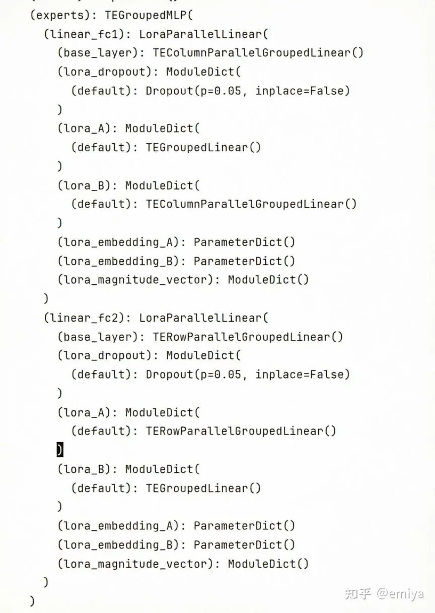
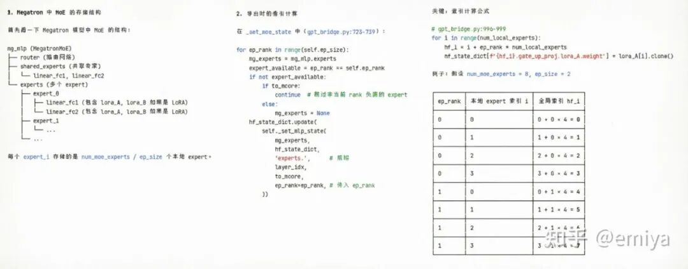
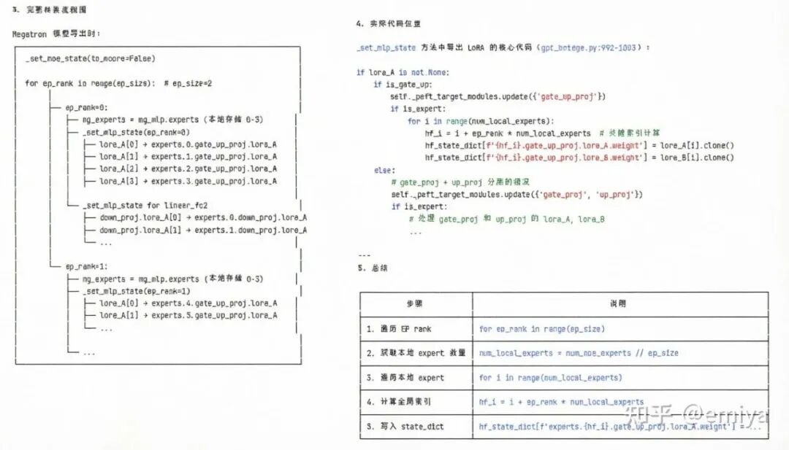

# ms-swift训练Qwen3.5 MoE的一些小技巧~

截止目前，如果希望使用 ms-swift 进行 LoRA 训练 qwen3.5 的 MoE 模型（的 MoE 部分），必须使用 megatron 来进行训练。（如果 transformers 升级了的话）

## 01 为什么必须使用 megatron？

（1）不使用 megatron 的问题

目前，transformers 升级到 5.3.0 以后，Qwen3_5MoeExperts 对于专家（expert）的参数不再是 nn.Linear ，而是将所有的专家的 linear 参数放在了一个大的 nn.Parameter 当中：

classQwen3_5MoeExperts(nn.Module):"""Collection of expert weights stored as 3D tensors."""def__init__(self, config):super().__init__()self.num_experts = config.num_expertsself.hidden_dim = config.hidden_sizeself.intermediate_dim = config.moe_intermediate_sizeself.gate_up_proj = nn.Parameter(torch.empty(self.num_experts,2*self.intermediate_dim,self.hidden_dim))self.down_proj = nn.Parameter(torch.empty(self.num_experts,self.hidden_dim,self.intermediate_dim))self.act_fn = ACT2FN[config.hidden_act]

相比之下，对于 qwen3_5 的 MLP 实现还是使用的 nn.Linear：

classQwen3_5MLP(nn.Module):def__init__(self, config: Qwen3_5Config, intermediate_size:int):super().__init__()self.config = configself.hidden_size = config.hidden_sizeself.intermediate_size = intermediate_sizeself.gate_proj = nn.Linear(self.hidden_size,self.intermediate_size, bias=False)self.up_proj = nn.Linear(self.hidden_size,self.intermediate_size, bias=False)self.down_proj = nn.Linear(self.intermediate_size,self.hidden_size, bias=False)self.act_fn = ACT2FN[config.hidden_act]

qwen3_5 的这种实现方式会导致如果直接对 model = AutoModelForImageTextToText.from_pretrain(..) 创建的模型，调用 peft 的 get_peft_model（model, peft_config）。

peft 是无法找到 self.gate_up_proj 和 self.down_proj 参数的。

（2）megatron 训练为什么可以解决这个问题？

众所周知，megatron 在训练的过程中，为了使用 TP/EP，会做一个这样的事情：

网络结构重写

加载原始的模型权重

而 swift 支持了对 megatron 转换过的模型的 MoE 部分套用 LoRA：

话说回来，要怎么对一个 megatron 切分过得东西套用 lora，想想还挺有意思的。

因此，如果希望使用 ms-swift 进行 Qwen3.5 MoE 模型的 lora 训练，必须要使用 megatron（暂时）。

（3）ms-swift 的 MoE-LoRA 训练的实现过程

这里稍微的看一下源码，看一下模型是怎么从 hf 格式变成 mcore 格式的。

megatron 的 sft 会使用 MegatronTrainer 类：

classMegatronTrainer(BaseMegatronTrainer):

而 BaseMegatronTrainer 在初始化的时候会创建模型：

classBaseMegatronTrainer(ABC):def__init__(self, args, template: Template):self.args = argsself.template = template# bridge 是非常重要的，进行hf格式和 mcore 格式的权重转换的工具self.bridge = args.megatron_model_meta.bridge_cls(args)self.prepare_model()defprepare_model(self):args =self.argsself.wrapped_models = []# 创建一个 mcore 格式的 model# 根据 torch.distributed.run 启动，每张卡（进程）上获得的 model （的结构和参数）是不一样的self.unwrapped_models = get_mcore_model(args,self.template.config)# 注意这里 : 如果启用了 lora 训练，创建 peft model 的过程是对 mcore_model 创建的self.peft_models =self._prepare_peft_model(self.unwrapped_models)self.wrapped_models = wrap_model(args,self.unwrapped_models)def_prepare_peft_model(self, models):args =self.argsifargs.mcore_modelisNone:# 可以看到 bridge 可以允许将一个 hf 格式的权重 load 到 一个 mcore model 当中self.bridge.load_weights(models, args.model_dir)peft_models = [prepare_mcore_model(args, model)formodelinmodels]ifargs.tuner_type =='lora'andargs.adaptersandargs.mcore_adapterisNone:assertlen(args.adapters) ==1,'Currently only support one adapter.'# 可以看到 ， bridge 也可以加载 adapter 格式（lora weight）到 model 当中# 即可以允许加载 lora参数并继续训练 lora 部分# 注意执行到这一步前已经执行了 prepare_mcore_model，这一步会调用 get_peft_model 将 mcoremodel变成一个 PeftModelself.bridge.load_weights(models, args.adapters[0], is_peft_format=True, adapter_name='default')returnpeft_modelsdefprepare_mcore_model(args, model):ifargs.tuner_type =='full':...elifargs.tuner_type =='lora':model.prepare_inputs_for_generation =None# fix errormodel = prepare_adapter(args, model)returnmodel

## 02 模型的导出和模型合并的相关配置

对 qwen3.5 基于 megatron 进行 LoRA 训练，并希望将所训练的模型进行导出，这个过程是有一些小小的坑的：

首先，我们在训练过程中可能会希望只保存 lora 部分的参数，以期望能够节省磁盘空间，因此训练配置文件可能设置为：

// 一定要设置这个// 设置后 megatron 才会保存 hf 格式的数据"save_safetensors":true,// 如果 merge_lora = True, 出来的直接就是merge 的结果// 如果设置了 merge_lora: false , 就只会保存 lora 部分的参数"merge_lora":false,

看上去结果很美好：

(vllm-update) root@jupyter:/260324-qwen3.5-moe/v2-20260320-174254/checkpoint-1000# ls-lhtotal4.8G-rw-r--r-- 1 root root 1.1K 3月 24 09:25 adapter_config.json-rw-r--r-- 1 root root 4.8G 3月 24 09:25 adapter_model.safetensors-rw-r--r-- 1 root root 67 3月 24 09:25 additional_config.json-rw-r--r-- 1 root root 16K 3月 24 09:25 args.jsondrwxr-xr-x1root root4.0K3月2409:25iter_0001000-rw-r--r-- 1 root root 4 3月 24 09:25 latest_checkpointed_iteration.txt

没有保存合并后的模型，获得了 adapter_config.json、adapter_model.safetensors。

但是，这个 adapter_model.safetensors 想要合并回到 qwen3.5 的权重当中，会有很多的问题。

（1）首先，这个 adapter_model.safetensors 和 adapter_config.json 对不上

adapter_config.json 导出的时候显示：

"target_modules":"^(model\\.language_model(?=\\.).*\\.(out_proj|in_proj_qkv|in_proj_b|in_proj_a|k_proj|down_proj|in_proj_z|shared_expert_gate|v_proj|gate_proj|o_proj|q_proj|up_proj))$",

注意到这里是没有 gate_up_proj 和 down_proj 的。

因此，你如果希望直接使用 swift export --adapter checkpoint-1665 --merge_lora true 是不行的！

事实上，ms-swift 的 megatron 训练了 MoE 部分的参数的 lora，并且也保存了下来。

可以看到，保存下来了 , 且 gate_proj 和 up_proj 是拆分的

但是 megatron 默认是按照 experts.xx 的格式保存的

fromsafetensors.torchimportload_filefrompprintimportpprintstate_dict =load_file('adapter_model.safetensors')pprint([ _for_instate_dict.keys()if'expert'in_ ][:10])----['base_model.model.model.language_model.layers.0.mlp.experts.0.down_proj.lora_A.weight','base_model.model.model.language_model.layers.0.mlp.experts.0.down_proj.lora_B.weight','base_model.model.model.language_model.layers.0.mlp.experts.0.gate_proj.lora_A.weight','base_model.model.model.language_model.layers.0.mlp.experts.0.gate_proj.lora_B.weight','base_model.model.model.language_model.layers.0.mlp.experts.0.up_proj.lora_A.weight','base_model.model.model.language_model.layers.0.mlp.experts.0.up_proj.lora_B.weight','base_model.model.model.language_model.layers.0.mlp.experts.1.down_proj.lora_A.weight','base_model.model.model.language_model.layers.0.mlp.experts.1.down_proj.lora_B.weight','base_model.model.model.language_model.layers.0.mlp.experts.1.gate_proj.lora_A.weight','base_model.model.model.language_model.layers.0.mlp.experts.1.gate_proj.lora_B.weight']

这里涉及到 mmbridge 的保存逻辑了，这里我给出大模型写的结果，不一定准，大概可以看看。

简单的来说，可以认为 gpt_bridge 做了这么一个事情：

我们在训练过程中创建的是一个 mcore_model 所对应的 peft model

gpt_bridge 会获取到这些 peft_model 当中的 lora 参数，然后尝试保存成 hf 可以理解的形式

但是 gpt_bridge 现在默认保存成了 experts.xx 的格式，这个数据无法被 新的 transformers 直接加载

（2）加载 megatron 训练的 lora 权重的正确方法

看了很多代码，中间的痛苦不说了，总的来说就是，解铃还须系铃人， gpt_bridge 导出的结果还得靠 gpt_bridge 来加载。

注意到前面我们 1.3 小节介绍的逻辑：

你可以构造一个 mcore_model , 利用 gpt_bridge 加载 hf 格式的数据

然后再转换成一个 peft_model , 并加载 adapter 的数据

注意，这里，参数已经被成功加载到 mcore_model 当中。

我们可以直接对于 mcore_model （此时是一个PeftModel）执行：

mg_model = peft_model.merge_and_unload()

这样就获得了合并后的参数

再进行：

bridge.save_weights([mg_model], output_dir, is_peft_format=False,...)

就可以保存成合理的格式了。

而这些步骤已经被 megatron export 实现了，你只需提供自己的配置：

{"model_type":"qwen3_5","model":"/mnt/pretrain_models/Qwen3.5-35B-A3B",// 添加参数，他会先基于参数 构造 mcore model// 然后构建 peft_model (针对 megatron 的模型)"tuner_type":"lora","lora_rank":32,"lora_alpha":64,"target_modules":["all-linear"]// 然后加载 adapters 参数"adapters":"260324-qwen3.5-moe/v2-20260320-174254/checkpoint-2423",// 最后保存在 output dir 当中，并设置 merge_lora = true, 即保存 hf格式的合并好的权重"output_dir":"260324-qwen3.5-moe/v2-20260320-174254/merged","merge_lora":true,"to_hf":true,}

## 03 ms-swift 训练 qwen3.5 的一些小技巧

（1）transformer_engine 提示找不到 cudnn

可能是因为 cudnn 环境是通过 pip/uv 安装的，需要手动添加到 LD_LIBRARY_PATH：

LD_LIBRARY_PATH=/.../conda/envs/vllm-update/lib/python3.12/site-packages/nvidia/cudnn/lib:$LD_LIBRARY_PATH

（2）如果希望使用 tp，需要配置 SWIFT_USE_MCORE_GDN=1

配置后会使用 megatron 的 qwen3.5 实现：

try:fromtransformers.models.qwen3_5_moe.modeling_qwen3_5_moeimportQwen3_5MoeGatedDeltaNetas_Qwen3_5MoeGatedDeltaNetexceptImportError:_Qwen3_5MoeGatedDeltaNet =objectclassQwen3_5MoeGatedDeltaNet(_HuggingFaceModule, _Qwen3_5MoeGatedDeltaNet):def__init__(self, config: TransformerConfig, submodules: SelfAttentionSubmodules, layer_number:int, **kwargs):assertconfig.context_parallel_size ==1,'Qwen3_5 currently does not support context parallel.'assert_Qwen3_5MoeGatedDeltaNetisnotobject,'please update the `transformers` version.'_Qwen3_5MoeGatedDeltaNet.__init__(self, config, layer_number)self.config = configextra_kwargs = _get_extra_te_kwargs(config)self.to(dtype=extra_kwargs['params_dtype'], device=extra_kwargs['device'])use_mcore_gdn = get_env_args('SWIFT_USE_MCORE_GDN',bool,False)ifnotuse_mcore_gdn:register_megatron_model(MegatronModelMeta(MegatronModelType.qwen3_5,[ModelType.qwen3_5,ModelType.qwen3_5_moe,],bridge_cls=Qwen3_5Bridge,visual_cls=Qwen3_5Vit,loader=Qwen3_5Loader,))

（3）如果使用了 EP/开启了 TP，就必须同时开启 CP（sequence_paralleL= True）

这是由于 EP 需要进行all-gather，所以需要你的数据正好被切分到各个卡当中，不能有卡有重复数据。

另外，ep 的实现包含了两个参数：

expert_model_parallel_size

expert_tensor_parallel_size

我的 4 卡训练配置如下：

"tensor_model_parallel_size":2,// moe 模型，使用了 tp 就必须要加上 sp// tp + sp 才能够保证数据被平均的切分到所有的卡上，使得 moe 做 all gather 可以正好获取到所有的数据"sequence_parallel":true,// 这里可以再配置一个 ep(expert tensor model parallel) ，进一步减少使用// ep 的配置包含了 expert model parallel 和 expert tensor parallel"expert_model_parallel_size":4,// 这个参数搭配 moe 的 并行参数使用, 默认是1， 两个相乘是 ep 的数量， num_gpu / ep = moe 阶段的 dp 数量..."expert_tensor_parallel_size":1,"attn_impl":"flash_attn","padding_free":true

作者：emiya，已获作者授权发布

来源：https://zhuanlan.zhihu.com/p/2020072000211677265
