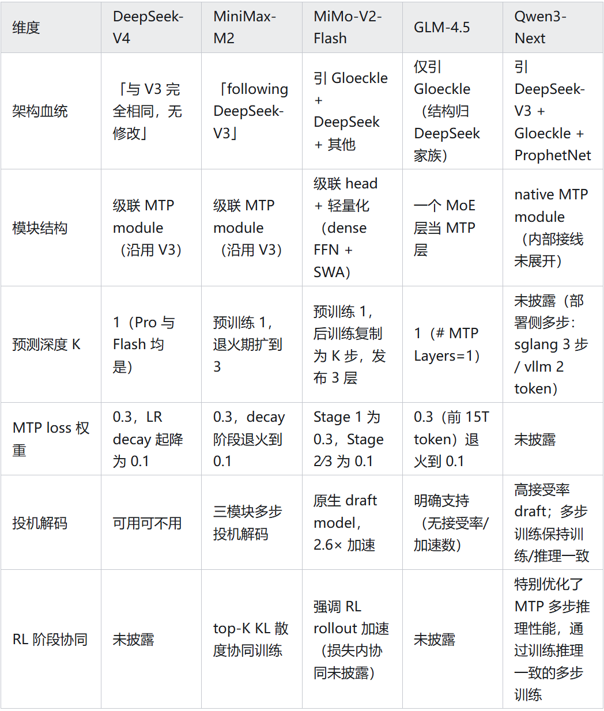
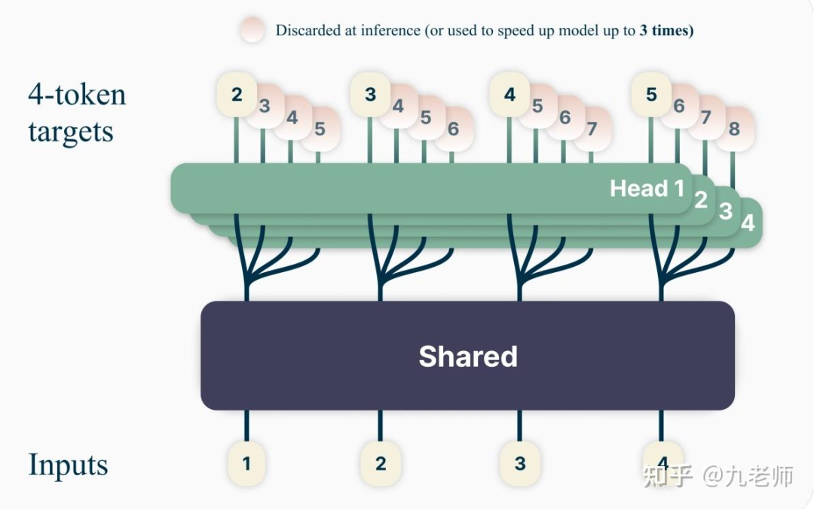
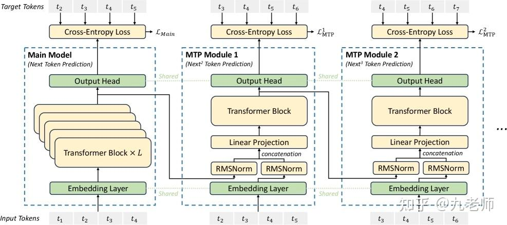
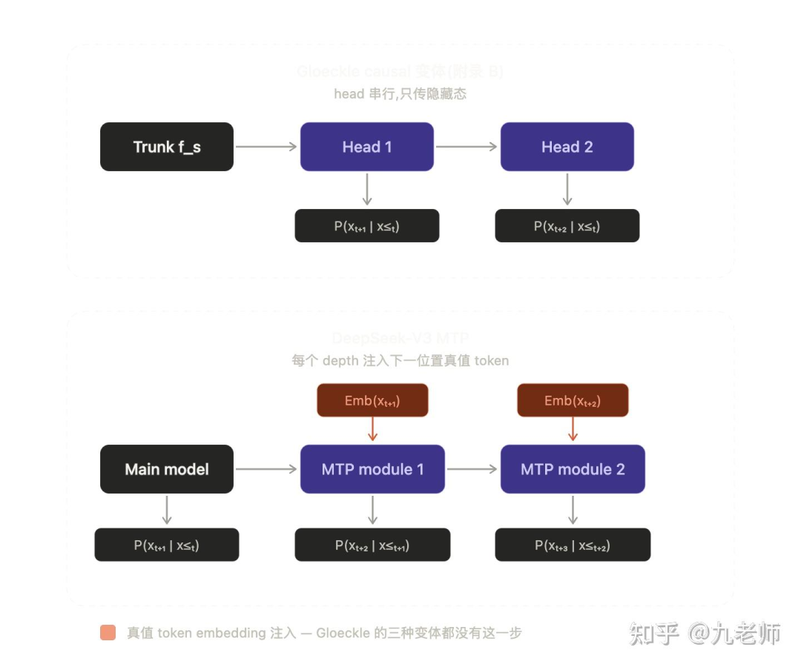
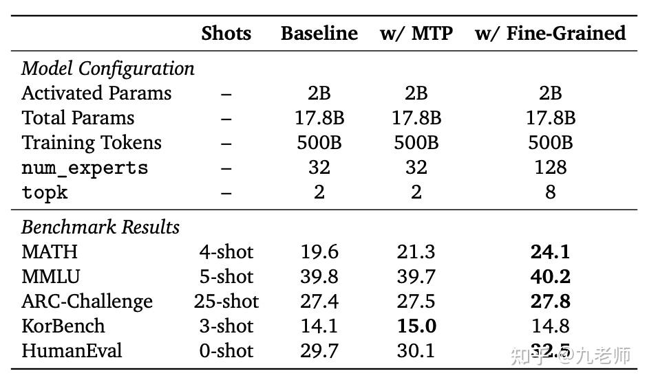
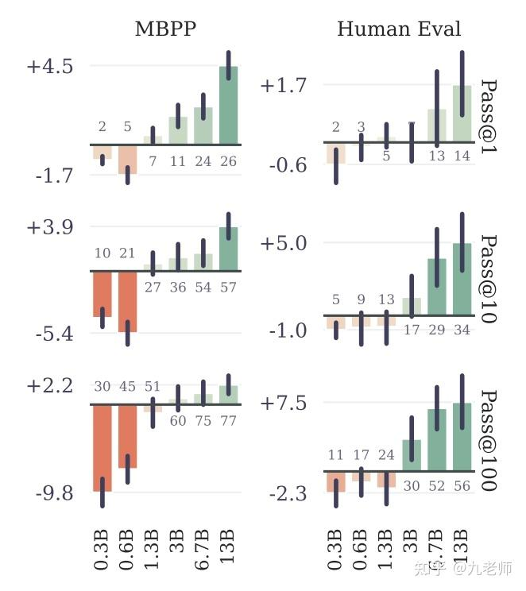
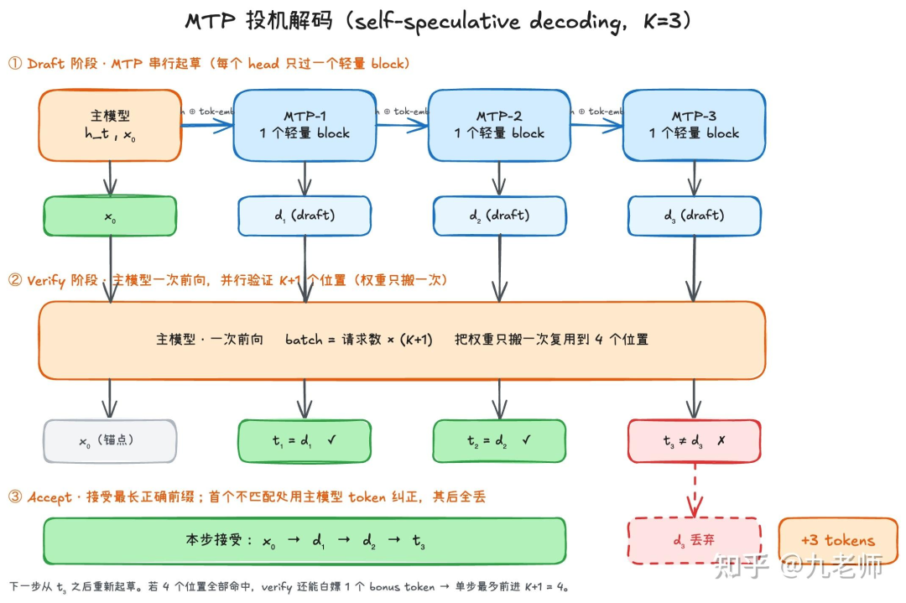
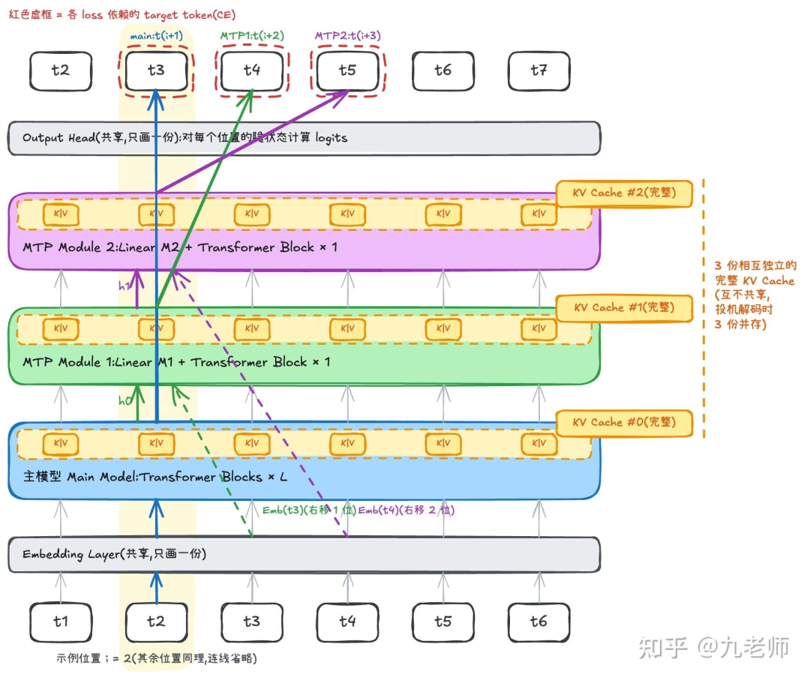

# DeepSeek-V4、Qwen3为什么选择了MTP？

在 DeepSeek-V4，MiMo-V2，Minimax-M2，Qwen3-Next，GLM-4.5 的最新技术报告里，有一个被共同采用的技术模块 MTP（Multi-Token Prediction）。

它不仅作为预训练的辅助 loss，提升了模型效果，又能作为 draft model 进行投机解码推理加速，实现了多快好省，变成了 LLM 标配之选。

## 01 训练提效

最早听说还是 DeepSeek-V3 的技术报告里，看到名字的第一眼，以为是一个 token 输入，同时并行输出多个位置 token 的概率，有这个误解也很正常。

最早的时候，MTP 在 LLM 领域就是在 Meta 的 paper “Better & Faster Large Language Models via Multi-token Prediction”中被定义的。

这个论文里确立了 2 点：

teacher forcing 下的 NTP 容易陷入在局部模式上、忽略”难的决策”，样本效率低，所以 MTP 的引入是为了辅助训练，提升效果的。

MTP 模块本身是 self-speculative decoding，一个 token 输入，过了主 Transformer 后，并行多个 head 输出后面 k 个 token，每一个 head 都是一个 Transformer block。

这在 decode 的时候，可以充当 draft model，获得 3 倍加速。

meta 论文里的并行 MTP

这是一个很符合直觉的设计，但到了 DeepSeek-V3，这两个作用依旧存在，但MTP 的模型架构发生了很大的变化。

DeepSeek-V3 paper 里有一句很明确的对比：

“Different from Gloeckle et al. (2024), which parallelly predicts D additional tokens using independent output heads, we sequentially predict additional tokens and keep the complete causal chain at each prediction depth.”

DeepSeek-v3 的图

meta 的 paper 里，实际也对比了并行架构和 casual 架构，结论是效果持平，他们选择了投机解码性能更好的并行架构。但实际上，名字都是 casual，实际确大不同。

如图，meta 的 casual 是仅仅传递上一个 block 的 hidden state，没有把解码后的下一个 token embedding 放进输入。

DeepSeek 的 MTP 每个 depth 都是干净的 fully-conditioned next-token 任务，这在 decoding 时更复杂，因为要把 next-one token 解码出来，才能估计出 next-two。

但是 DeepSeek 主要是使用它来提升 pre-train 的效率，Draft Model 是他的可选项。

Our MTP strategy mainly aims to improve the performance of the main model, so during inference, we can directly discard the MTP modules and the main model can function independently and normally.

为什么 MTP 有效，DeepSeek 的解释是能把训练信号变得稠密，提升数据效率，提前规划未来 token 预估。但用了两个“may”显得非常的严谨和不自信。

On the one hand, an MTP objective densifies the training signals and may improve data efficiency. On the other hand, MTP may enable the model to pre-plan its representations for better prediction of future tokens.

MiniMax 说法是“提供更丰富的训练信号”，并给了 ablation study。

加 MTP 后 MATH 、KorBench 14.1→15.0、HumanEval有提升，而 MMLU和 ARC-Challenge 基本持平，他们的结论是 MTP 在各 benchmark 上一致有提升，且 reasoning-heavy 任务收益最大。

Meta 的 paper 有个非常有趣的 insight，MTP 有效性与参数量相关。小容量的模型反而有害，突破阈值之后收益扩大，且模型 size 越大增益越明显。

## 02 推理加速

先说一下 MTP 的投机解码是怎么做的，以及为什么会有价值。

在 LLM decode 阶段，NTP 每次吐一个 token，这带来了一个问题，decode 阶段是极度 memory-bound，它要不断地去拉取 prefill 的 KV Cache，但计算的 batch 却是请求数 x 1 token。

MTP 作为 draft model，每一个 token 预估只过一个 Transformer block，它以更快的速度解码 K 个 token。

然后组成一个请求数 x k 的 batch 给到主模型做一次前向算出概率，MTP 猜对了就接受，MTP 猜错了就仅接受第一个 token，然后从下一个 token 位置继续这个循环。

乍一看，猜错的代价很高，不仅额外跑了 MTP，还有一次主模型前向。

但语言的特点就是充满了低熵的 token，MTP 接受率在 85%～90%，少数情况走了冤枉路，额外浪费了算力，大多数情况下，因为 MTP 的轻量加上大 Batch 多 token 计算，主模型突破 memory-bound 而获得额外加速。

比如，MiMo 获得了 2.6 倍的加速。

各家在预训练阶段都是 K=1，即设置一个 block 的 Transformer 做 MTP，loss 权重设置为 0.3，退火到 0.1。

但 Minimax 和 MiMo 使用 MTP 作为 draft model 进行投机解码，均为 K=3，额外的两份权重哪里来呢？

答案是复制，但是复制的细节不同，MiMo 的 MTP 和主模型异构，采用了轻量化（dense FFN + SWA）结构，每个 block 仅 0.33B，它是复制预训练时的那个 k=1 的 block。

而 Minimax 的 MTP 和主模型（FFN+Attention）完全同构，它选择复制的是主模型的最后一层，而非预训练的那个 MTP。

复制的时机也不同，MiMo 是在后训练开始的时候才复制，Minimax 在退火时就复制了权重，先冻结主模型直到 loss 稳定，再打开联合训练。

而它们在 post-train 的 RL 里都做了联合的训练，即 MTP 参与了 RL 的 Rollout 里，避免接受率会随分布漂移而崩。

## 03 结构细节

再讲讲 MTP 的模型结构细节，很多人说它像一个 RNN——每一个 MTP block 向后传递 hidden state，也输入上一个 token的 embedding。确实很像，这把我住了了 MTP 的基本输入输出。

反而容易被忽略的，是它仍然是一个内部结构非常标准的 Transformer，比如 MiMo 的模型在 MTP 中仅用了 SWA（Sliding Window Attention），它有独立的 KV Cache。

之所以仅用 SWA 是作为 draft model，在解码的时候可以少取 KV Cache，进一步减缓 memory-bound。它独立于主模型，可以自由地选择它的 Attention 策略。

准确的说法是分两个轴看：沿深度（k=1, 2, 3）像一条级联 RNN，每一级吃上一级的输出；而在同一个 k 内、跨序列位置，它就是标准 Transformer，带自注意力和 KV。

把经典的 MTP 图纵向堆叠，以 t2 位置为 Case，一次前向的的流出如图所示。

主模型在预估 t3，MTP-1 在预估 t4，额外输入了 t3 的 token embedding，MTP-2 在预估 t5，额外输入了 t4 的 embedding。

token embedding 和 hidden state 的融合采用了 RMSNorm 和 Linear Projection。输出的 Output Head 共享，输入 embedding 共享。

最后，用多快好省来形容 MTP 非常贴切：

多：multi-token predict 就是一次前向多个 token。

快：作为投机解码的 draft model 使用，1.8～3 倍加速。

好：作为 pre-train 的辅助 loss，提升了 coding 及复杂推理任务效果。

省：把 decode memory-bound 的算力浪费给省了回来。

reference：

Better & Faster Large Language Models via Multi-token Prediction

DeepSeek-V3 Technical Report

The MiniMax-M2 Series: Mini Activations Unleashing Max Real-World Intelligence

MiMo-V2-Flash Technical Report

DeepSeek-V4: Towards Highly Efficient Million-Token Context Intelligence

作者：九老师

来源：https://zhuanlan.zhihu.com/p/2049155123906188091
