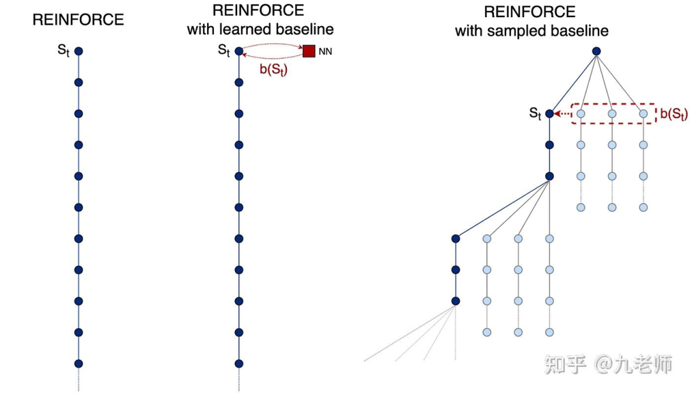

# GLM-5.2为什么不用GRPO了？

GLM-5.2 一开源，社区就炸了——不是因为性能，而是因为它悄悄放弃了 GRPO。

这个曾被 DeepSeek 捧上神坛的算法，为何被弃？我们来看知乎上九老师的回复，他给出了非常犀利的答案。

GLM 文章里有一份他的解释，这个暂且按下不表。

我觉得研究为什么不再用 GRPO 的原因，应该追溯为什么在 LLM 的 RL 上开始可以用 GRPO，而之前那么久的强化学习研究中，GRPO（Self-Ctritic）方法都是一个相对小众的存在。

能开始用 GRPO 的原因如果不再成立或足够有优势，那么就是回归 PPO 的原因。

我对 GRPO 的理解，始于这篇 19 的 blog，Understanding Baseline Techniques for REINFORCE：

https://medium.com/@fork.tree.ai/understanding-baseline-techniques-for-reinforce-53a1e2279b57

它的核心插图如下，这是一眼理解 GRPO 和 PPO 的好图：

它的引用包括：

Rennie, S. J., Marcheret, E., Mroueh, Y., Ross, J., & Goel, V. (2017). Self-criticalsequence training for image captioning. In Proceedings of the IEEE Conference on Computer Vision and Pattern Recognition (pp. 7008–7024).

Kool, W., van Hoof, H., & Welling, M. (2018). Attention, Learn to Solve Routing Problems!. arXiv preprint arXiv:1803.08475.

Kool, W., Van Hoof, H., & Welling, M. (2019). Stochastic Beams and Where to Find Them: The Gumbel-Top-k Trick for Sampling Sequences Without Replacement. arXiv preprint arXiv:1903.06059.

Kool, W., van Hoof, H., & Welling, M. (2019). Buy 4 REINFORCE Samples, Get a Baseline for Free!

第一篇是开山之作，但它用的是用贪心作为 baseline，而非随机的 baseline，也没有 group 的概念。

最后一篇，已经说了采样 4 条，用均值做 baseline，4 条都不要丢，都可以用于训练，这就是买 4 赠送了一个 baseline！这已经 80% 和 GRPO 相似了。

所以 GRPO 刚出来的时候，我同事跟我讲，我几乎几秒钟就懂了，因为我 19 年的时候看过这个方法，并且在业务中使用了。

但我去翻 GRPO 的 DeepSeekMath 的论文，没有找的这些引用。我不知道作者是无知不小心的，还是故意为之的。

再绕回主题，这篇 blog 里清晰地分析了 Learning a NN as baseline（PPO） 和 sampled baseline（GRPO） 的优劣势。

Learned Value Function 就是 Actor-Critic 里的 Critic，它是用一个 NN 来拟合迭代中的 Value Function。

这个过程中，Policy 在迭代变化，它产生的数据通过 TD 方法迭代的 Value Function，还要被 NN 拟合，这是一套复杂的流程，每一步都在积累偏差。

blog 提到它的缺点是“追逐移动目标（following a moving target）”。因为策略在不断更新，价值网络也会随之过时，从而产生偏差（biased）。

这里再补充说明下：

Deadly triad 是 Sutton & Barto 在《Reinforcement Learning: An Introduction》里点名的一个组合：当以下三个要素同时出现时，值函数的迭代可能不稳定甚至发散。

Function approximation（函数逼近）：用参数化模型（NN、线性特征)而非 tabular 表示 value。参数更新一个 state 会牵动一大片 state 的估计。

Bootstrapping：target 里含自己的估计,如 TD 的 r+γV(s′)r+\gamma V(s') r+γV(s′)。区别于 MC 用真实 return。误差会顺着 target 回传累积。

Off-policy training：更新分布（behavior policy 采样的 state 分布）与被评估策略的分布不一致。replay buffer、importance sampling 都属此类。

PPO 命中两元。

而 sampled baseline 它提供了一个无偏（unbiased）且最新（up-to-date）的价值估计，解决了价值网络“追逐移动目标”的偏差问题。

又因为（25 年以前）LLM 的轨迹相比玩游戏实在是短（rollout 成本与方差低），并且有清晰的最终 return，加上节省显存的巨大优势，那便成为了有利的方案了。

所以我一直的一个理解（不一定对），GRPO 是一个低偏差高方差的算法，虽然采样多个轨迹做 Group 就是为了降低方差，但方差随着 rollout 的长度而积累。

PPO 类的方法，是一个过程中存在高偏差但低方差的算法，需要更好的 tune 来让算法 work，因为following a moving target 永远是机器学习里的难题。

关于确定性 vs 随机性环境。

作者在文章开篇就明确指出，大多数对比研究只关注确定性环境，而他们的核心贡献之一是“随着我们向环境中添加随机性，分析这些方法的相对优势”。

在存在随机性的情况下，采样基线为了获得准确的估计，对环境交互次数的消耗会更加成倍放大，此时学习价值函数（Learned Baseline）在交互效率上的优势就会体现出来。

PPO 因为可以同时训练一个价值函数，它能逐渐学会给出某些状态下的“期望值”或“平均价值”（expected/averaged value），随机环境下表现更好。

所以，我的理解当任务偏长，方差开始变大，要解决 GRPO 的 token credit assignment（所有 token 被最终 Reward 的一致地惩罚或奖励）带来的高方差，也要付出额外的努力，那不如退回到 PPO。

以及 Agentic 任务是在一个开放环境中，虽然它是确定的，但对 Agent 来讲，这是一个充满未知与噪声的随机环境。

这不就是常说的 harness 对 Agent 表现影响非常大，这里面就有环境随机的贡献吧。

你不觉得，现在的长程 Agentic 任务，非常像打游戏了么，最终通过有奖励，过程中做对一部分也有奖励，调用错一个函数也有惩罚！这不原本就是 PPO 擅长的吗？

文章说的 compaction 问题是个表象，是因为这个要解决 GRPO 的劣势不如好好调调 PPO ，那就不如换掉。

当然，GRPO 搭配一个好的 Process Reward Model，我觉得也能解决问题，而且 DeepSeek MathV2 就是这么干的。

作者：九老师

链接：https://www.zhihu.com/question/2052108642686706557/answer/2052672000330670160
