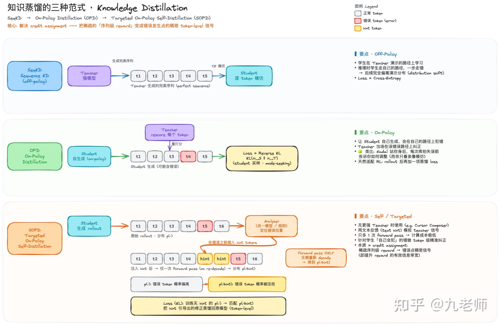
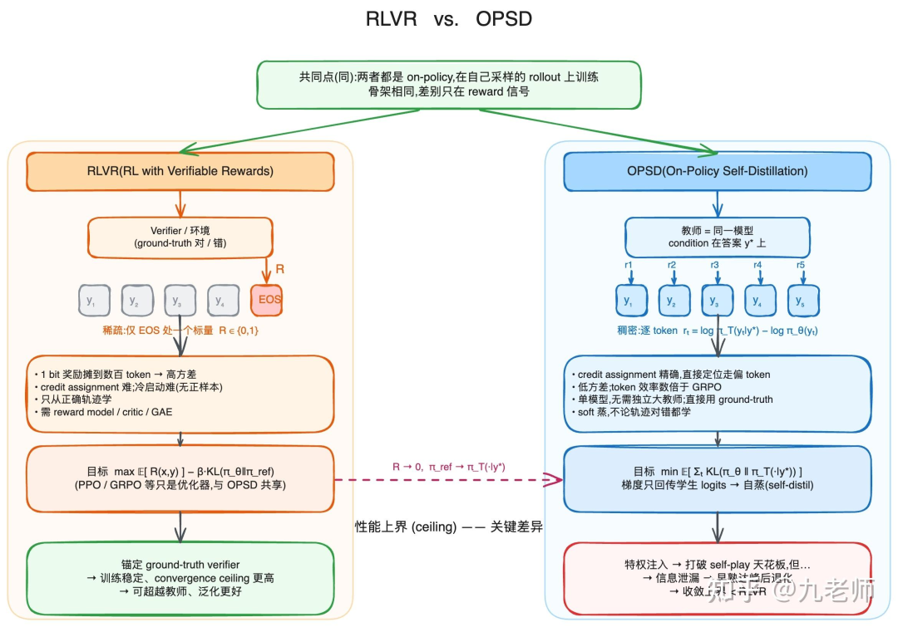
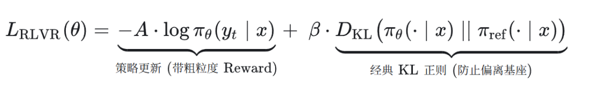
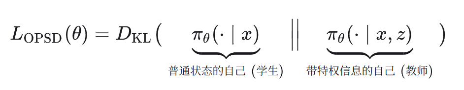

# 面试官突然问我：OPSD和RL有什么不同？

最近 DeepSeek V4 的多专家整合方案采用了 OPD（On-Policy Distillation），在工业级项目上证明了 OPD 在后训练中占据一席之地。

而它的进阶版本 OPSD（On-Policy Self-Distillation）也在 Cursor 的模型训练上大规模使用，并且展现出在利用隐式反馈数据，定向纠错和持续学习上的潜力。

文章包括：

知识蒸馏的 3 种范式：KD，OPD，OPSD。

RLVR 的信用分配问题与稀疏 Reward 问题，OPSD 能联合弥补，定向纠错

OPSD 不局限于显式的人类标注（RLHF），有潜力利用文本隐式用户反馈持续学习。

Sequence-level KD 是 off-policy 的，指的是训练的数据是采样自 Teacher，然后 Student 在这份数据分布上基于 cross entropy 进行训练，这也是所谓的“硬蒸”。这就像老师讲，你把他讲的背下来。

OPD（On-Policy Distillation）是让 Student 采样，Teacher 对每一个 token 计算概率，用 KL 更新。这就像学生来讲，老师逐字纠正。

举个例子，如果老师教英语，但是有很强的口音，学生不光学会了英语，也继承了口音，这就是模式覆盖。

而 OPD 是学生用标准的口音讲错误的英语，老师逐 token 纠正的是英文的语法，OPD 使得 Student 能学到新的知识，并且不产生对过去能力的覆盖。

因为 Teacher 采样的数据中很少包含学生的常见错误路径，Student 在自回归中会进入 Teacher 没有产生的分布，持续累积误差，这也正是经典自回归生成中常被诟病的 Exposure Bias（曝光偏差）问题。

而 On-Policy 基于 Student 的自回归采样，所有错误都暴露出来，也就消除了 Teacher forcing 带来的 Exposure Bias。

而 OPSD（On-Policy Self-Distillation）是在 OPD 基础上，不再需要一个更强的 Teacher，取而代之的是一个看过特权信息的 Student 作为 Teacher。

所谓特权信息（privileged information）是解题的关键步骤提示，甚至是答案。

相当于用“开卷考试的你”去训练“闭卷考试的你”。Student 看过了答案和关键过程，它的解题步骤也变得简洁清晰了，然后通过蒸馏使得自己在不看特权信息的情况下也能完成。

能力足够强的大模型和人一样，有一个天然的特性：后觉（Rationalization）比先知（Generation）容易得多。让它看着答案去写解释，其准确率和逻辑质量会远远高于让它盲猜。

它的流程是这样的，Student 做 rollout 拿到序列，在序列前插入 hint（privileged information） 信息，重新跑一次前向拿到 logits，进行 KL 更新。

它的本质是 LLM 强大的 In-Context Learning 能力，插入特权信息使得模型参与固化的情况下，用 KV 参数的改变影响了后续输出的概率。

“Self-Distilled Reasoner”的主题是拿 OPSD 和 RLVR 做对比，OPSD 在特定问题上获得了相同的效果，但 token 样本效率提升了 4～8 倍。

RLVR 的痛点是 credit assignment：一条几百个 token 的推理轨迹,最后只拿到一个 bit（对/错），这个标量要被摊到所有 token 上。

后果是：

方差极高，需要大量 rollout 才能把 advantage 估准；

冷启动困难——难题上学生几乎从不成功，梯度信号近乎为零；

一条错误轨迹里，真正出错的”分叉 token”和无辜的 token 拿到同样的惩罚。

而 OPSD 并不依赖 Reward，它相当于把 Reward 对应的特权信息放在 Context 中，改变了 KV 参数，进而改变了对于原始问题答案的概率分布，做到逐 token 的纠正。

OPSD 更像是对已经学到知识的分布调整，就像是你已经学会了基础英文知识，但你讲的不够熟练，不断地在提示下练习，以至于在没有提示下可以流利地讲英文。

但存在一个天然的上界，如果在一个新领域知识上，Teacher 的 In-Context Learning 的能力不足，也就无从保障无特权信息的 Student 了。

并且，特权信息本质是一种信息泄露，存在一个互信息鸿沟不可达，会出现 early gain，后期饱和甚至退化。

RLVR 和 OPSD 都是 On-Policy，有抗遗忘的作用，甚至在更新公式上都类似，OPSD 相当于去掉了 RLVR 里的策略更新，仅保留类 KL 正则，但把其中的参考模块换成了有特权信息的自己。

砍掉基于 Reward 的策略更新，并将参考模块替换为“带特权信息的自己”。论文说可以是 forward KL、reverse KL 或 JSD 均可：

那一个自然的想法，这两种方法的 loss 既然相近，能联合使用吗？

RLSD（RLVR with Self-Distillation），用 RLVR 决定梯度的方向，用 OPSD 决定梯度的模长。

PPO 额外带一个 Value Network 才起到了 per-token credit 分配的作用，OPSD 仅一次 forward，近乎免费。

SRPO（Sample-Routed Policy Optimization）不是做 loss 上的融合，而是样本级的路由到 RLVR（GRPO）和 SDPO。

在同一个样本上强行做 Loss 层面的融合，往往会遭遇严重的梯度干扰，正确且高效的样本直接走 GRPO（探索拉高上限）；错误但有明确报错的样本走 SDPO（进行手把手的纠偏）。

HDPO 提出混合蒸馏策略优化。在数理推理 RL 训练中，如果一道题太难，模型的所有 Rollout 全部得 0 分，没有正向信号，GRPO 也就无从学习。

它的解法，每个训练 Step 中，先识别出那些所有 Rollout 都失败的 prompt，针对他们赋予模型特权信息，让模型在这种“开卷”状态下强行生成正确的推理轨迹，筛选出 Reward=1 的轨迹后，通过 OPSD 更新自身参数。

综合看，RLVR 是以极高的成本去拉升模型的上限，是通过 Rollout 去碰到正确的样本从中学习，但存在 Reward 稀疏难冷启和 token 级别信用分配难题；

而 OPSD 是以极低的成本，依靠特权信息弥补 Reward 稀疏问题，per-token 的概率分布充当了信用分配，但也强烈依赖模型 ICL 能力，更适合从错误中学习如何修补。两者可以互补。

OPSD 相比 RLVR，实际更像 RLHF。

形式上，他们都隐式地达成了 per-token 的 credit 分配。经典的 RLHF 依赖 Reward Model 和 PPO，其中 Critic 网络通过 GAE 迭代得到 per-token 的 advantage，隐式拟合出 per-token credit。而 OPSD 天然能得到 Teacher 的 per-token 概率分布。

目的上，RLHF 完成人类偏好对齐，它是基于人类标注先训练得到一个 Reward Model，人类偏好是借由标注→RM→RL 注入的。

OPSD 可以把人类的文字评判与纠错当成 Context 喂给模型，改变它后续的输出分布，然后借 On-Policy 蒸馏把 In-Context Learning 的获得的能力烧写进模型权重。

同样是偏好对齐与纠错，RLHF 是初代的人教模型，它其实一个不太自然的绕路方式注入。

而 OPSD 需要足够强的基础模型，可以依赖文本的评判的和充满噪声的用户反馈。

## 01 定向纠错

如果你发现模型总是会调用一个不存在的命令，它总是先盲目地试，再由报错信息调整，但正确的方式应当是查询命令列表，再直接正确地调用。

也许更充分地 RLVR 能解决问题，但是它也是高成本的，并且它不能高优先地定向解决这个问题。

RLHF 是可以的，但要补一批人工标注的打分数据，然后重新训练 Reward Model，再执行 RL，这个流程是繁重的。

Cursor 的 Composer 2.5 blog 中说，随着 rollout 可能跨越数十万个 token，当奖励是基于整个 rollout 计算时，模型往往很难判断究竟是哪个具体决策让结果变好或变坏。

RLVR 的最终奖励能告诉你出了问题，但对于具体是在什么地方出错，它只是一个噪声很大的信号。

OPSD 的框架下，Cursor 核心思路是在轨迹中模型本可以表现得更好的位置，直接提供反馈。

对于目标模型消息，构造一条描述期望改进的简短提示，将这条提示插入局部上下文中，并将由此得到的模型分布作为教师。

回答开始的问题，OPSD 是直接把“先查命令列表的专家演示作为特权信息放进Context”，依靠 Context-Learning 能力，改变后续的模型的输出分布，再蒸馏进模型的自身权重。

Teacher 模式的输入：[初始问题 X] + [模型的调用错误信息] + [先查命令 list 再调用的指示]，并附带指令：“既然你已经看到了完整的调用链，你会如何重新规划命令？”

Student 模式的输入：仅有 [初始问题 X]。

Student 做 decode 生成命令轨迹，把轨迹放入 Teacher 一次前向获得概率分布，KL 更新 Student，这样就轻巧地实现了定向纠错。

## 02 持续学习

LLM 在后训练阶段如何像人类一样持续学习新技能？这里面巨大的挑战是灾难性遗忘。

SFT 会造成灾难性遗忘，关键在于数据是 Off-Policy（learning from data from off policy）的。整个学习过程中，80% 的模型参数都在动，是灾难性遗忘的源头。

而 On-Policy，意味着学习数数据是要更新的 LLM 自身产生的，它的数据和 LLM 的概率分布接近，不易产生灾难性遗忘，有 paper 讲 RL 中仅 5%～30% 的参数在动。

OPSD 也是借模型原本的 Context-Leanring 能力，把新知识注入到 Context 中，不仅仅是数据 On-Policy，Teacher 和 Student 是一个模型，它产生的Target 概率分布和原策略分布也是接近的，灾难性遗忘自然不会发生。

这个方案也有它的局限，那就是新知识分布差异巨大，On-Policy 的更新实际很难有效。

这时候可以 SFT 一个新的专家模型，它发生灾难性遗忘没有关系，再 On-Policy Distillation 回主模型即可，主模型能学到新知识，又不会发挥灾难性遗忘。

这篇 blog 讲述了一个最小化代码编辑实验，分别通过 SFT 和 RL 特化一个专家，SFT Teacher 出现了明显的灾难性遗忘（在通用代码集 LiveCodeBench 上能力大幅退化），而 RL Teacher 没有。

再分别 OPD 回主模型，他理所当然地认为 RL 的会更好，实际两者区别不大，Student 都略微超越 Teacher，并且没有灾难性遗忘。

类似的，OPD 已经是 DeepSeek V4 的多专家整合方案。而 OPSD 虽然还只是在学术 paper 中，但它更符合持续学习的定义，有巨大的潜力。

## 03 数据飞轮

如何利用 LLM Chatbox 的海量用户数据中隐式的反馈，建立起数据飞轮。

我对数据飞轮的理解始于推荐系统，通过用户数据的学习建立模型，模型越强用户越多反馈越多，迭代出更强的模型。

而推荐系统最初是依赖显式 Rating 的，后来一步一步地发展成以隐式反馈（如 CTR）为主体的方案。

头部 LLM 有海量的用户反馈，这里面包含了用户对模型输出的评判，甚至是用户对模型的指导（如 skill）。如何利用这些 in-house 数据建立起数据飞轮十分关键。

OPSD 是一个高潜力的方案，“Self-Distillation Enables Continual Learning”提到 OPSD 可以利用丰富的用户交互反馈：模型可以通过复盘真实的、包含纠错信息的多轮用户对话（事后学习）来提升自身表现。

OPSD 允许我们把整个多轮对话的“未来记录”作为一种特殊的 Context 喂给 Teacher 模式下的模型。

Teacher 模式的输入：[初始问题 X] + [模型原本的错误回答 Y] + [用户后续的纠错反馈 Z]，并附带指令：“既然你已经看到了完整的对话，你会如何重新回答第一条消息？”

Student 模式的输入：仅有 [初始问题 X]。

在 Teacher 模式下，强大的基础大模型能够利用自身的 In-Context Learning 能力，吸收用户的后续反馈，生成一个修正后的、更高质量的回答分布。

OPSD 具备天然的“相关性门控”与梯度稳定。这是 OPSD 能在充满噪声的日志中直接端到端训练的关键。

OPSD 的优化目标是拉近 Student 与 Teacher 的分布，这种机制在物理意义上天然具备鉴别反馈质量的能力：

当用户反馈有效时（有价值的纠错）：Teacher 吸收了反馈，意识到原本的回答有问题，其生成的输出分布会发生显著偏移，与 Student 盲猜的分布产生较大的差距。

这种差异会转化为强烈的梯度信号，驱动模型权重更新，完成自我纠错的学习。

当用户反馈无效时（废话或无关联）：Teacher 虽然看到了这些废话，但 In-Context Learning 机制判断这些信息对改进回答毫无帮助。

因此 Teacher 的输出分布 π_teacher基本等同于原本的 π_student在 ICL 能正确忽略无关信息的前提下，梯度趋近于 0，模型不会进行无效的参数更新。从而极大地保证了训练的稳定性，避免了灾难性遗忘。

作者：九老师

来源：https://zhuanlan.zhihu.com/p/2052148485491790036
