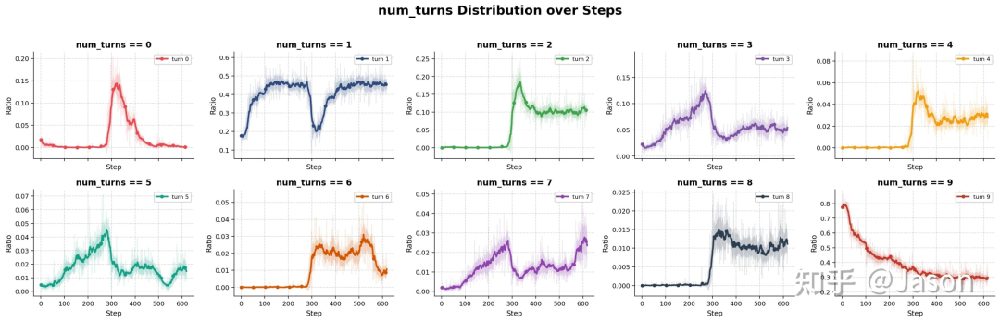
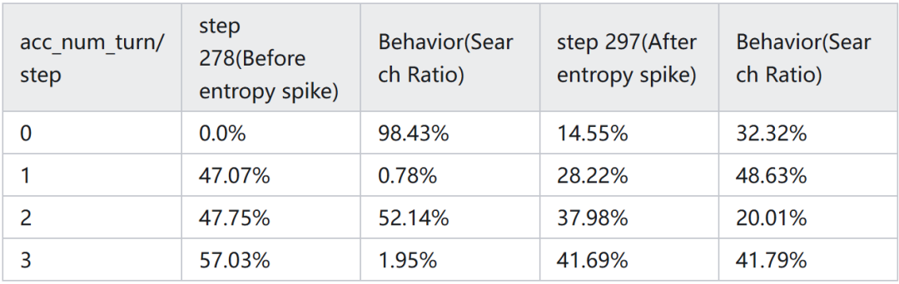
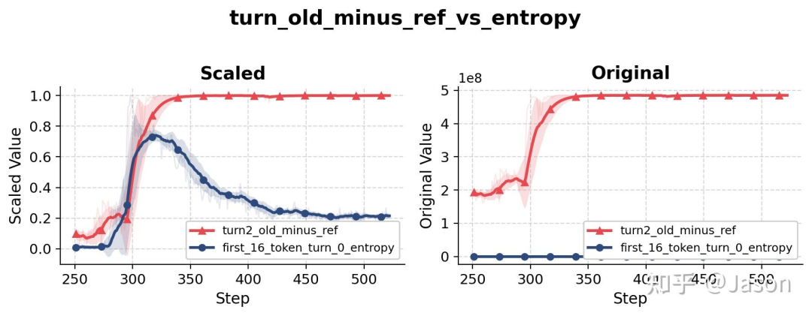
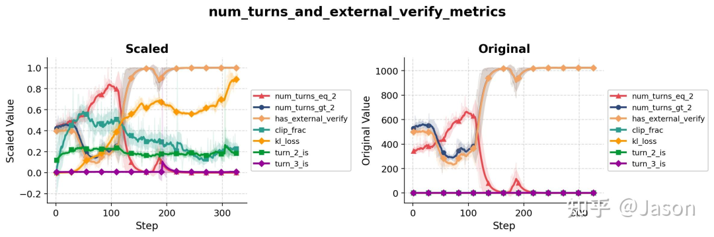

# Agentic RL到底和传统RLVR有什么区别？

过去一段时间里，我一直在思考一个问题：Agentic RL 到底和传统 RLVR 有什么本质区别？

最容易想到的答案当然是工具调用。传统 RLVR 往往围绕单轮回答展开，模型生成一个 response，环境返回 reward，然后整个 episode 结束。

即使策略不断更新，模型未来回答的分布会发生变化，但环境本身并不会因为模型刚才的动作而改变。

对于同一个问题，模型始终面对的是同样的上下文、同样的任务定义，以及相对固定的状态空间。

Agentic RL 不太一样。模型不再只是生成一个最终答案，而是在不断决定自己接下来要看到什么。

它是否调用搜索工具、搜索什么 query、是否继续阅读更多文档、是否调用 verifier、是否提前终止，这些动作都会改变未来轨迹中出现的 observation。

换句话说，模型不仅在学习如何回答问题，也在学习如何获取信息，而获取信息的方式又会反过来影响它之后如何回答问题。

这就带来了一个在传统 RLVR 中不太明显的反馈回路：一个看似很小的策略更新，可能不会明显改变当前这一步的 token 分布，却可能改变未来整条 trajectory 的展开方式。

一次 search 是否发生、检索到了什么内容、模型是否继续探索、是否提前 answer，这些差异最终都可能让当前策略生成的 trajectory 与 rollout policy 当时采样出来的 trajectory 变得非常不同。

基于这样的直觉，我一直认为 Agentic RL 应该比传统 RLVR 更容易受到 off-policy staleness 的影响。

随着轨迹变长，rollout policy 与 current policy 之间的差异会不断积累，而这种差异最终可能成为训练稳定性的主要问题。这个推理听起来足够自然，以至于很长一段时间里我几乎默认它是正确的。

后来在复现 Search-R1 的过程中，我决定试着验证这个猜想。Search-R1 是一个相对适合做这件事的环境：训练 pipeline 是开源的，检索数据库是固定的，环境本身也不会像 live web search 一样不断变化。

相比生产级 deep research agent，它当然简单很多，但正因为简单，很多训练过程中的行为变化反而更容易被看清楚。

实验设置本身并不复杂。除非特别说明，下面的实验使用 Qwen2.5-7B-Instruct 或 Qwen3-8B-NoThinking 作为 base model，使用 GRPO 作为 RL 算法，reward 使用 Exact Match，train batch size 为 128，rollout group size 为 8。

在最基础的 Search-R1 设置中，模型的高层动作空间也相对简单：大多数时候，它本质上是在“直接回答”和“调用搜索”之间做选择。

一开始，一切看起来都很正常。训练 reward 在上升，evaluation accuracy 也在上升。

从常见 dashboard 来看，这几乎就是一次普通的、健康的 RL 训练过程。如果只看这些指标，我大概不会觉得里面有什么特别值得分析的现象。

真正让我产生疑问的是 rollout。

有一天在翻看训练轨迹的时候，我突然发现模型似乎不怎么搜索了。准确地说，并不是完全不搜索。搜索工具依然在被调用，最终准确率也没有立刻崩掉。

但轨迹看起来和之前不太一样了。很多原本应该以 search 开头的问题，开始先直接尝试回答，然后才决定是否继续搜索。

刚开始我以为这只是随机波动，但随着训练继续进行，这种现象越来越明显。

更奇怪的是，这种变化发生得非常快。对于一个已经训练了数百步的策略来说，我们通常会期待行为是缓慢演化的，而不是突然跳到另一种模式。

但这里的情况更像是模型在很短时间内放弃了一种长期稳定的行为模式，转而采用另一种新的策略。

也正是这个现象，让我重新回到了最初的问题：我原本想研究的是 off-policy staleness，但眼前发生的事情似乎并不能完全被这个解释覆盖。

## 01 一个看起来很正常的指标

最开始吸引我注意的并不是行为本身，而是一个非常普通的指标：随着训练进行，平均交互轮数在不断下降。

第一眼看到这个现象时，我并没有觉得有什么问题。事实上，如果只看表面，这甚至像是一个好信号。一个更强的模型理应需要更少的工具调用。

如果模型变得更擅长识别有用信息，或者更快确定答案，那么平均 turn 数下降完全符合直觉。

更何况当时 reward 和 evaluation accuracy 都在上升，所以我一开始并没有把它当成异常现象。

但 rollout inspection 改变了这个判断。

当我逐条阅读轨迹时，发现平均 turn 数下降并不是因为模型变得更高效了，而是因为模型开始变得更愿意“猜”。

在训练大约进行到 step 300 左右时，越来越多 trajectory 开始在调用搜索之前直接尝试回答问题。

在此之前，大多数轨迹遵循的模式大致是：Question → Search → Answer。

而在行为变化之后，越来越多轨迹开始变成：Question → Guess → Search → Answer。

这里最有意思的地方在于，模型并没有忘记如何搜索，搜索工具也没有停止工作。

真正发生变化的是模型对于自身 prior knowledge 的信任程度。它开始越来越倾向于相信自己也许已经知道答案，因此愿意先尝试给出一个 answer，再根据情况决定是否需要继续调用 search。

这种变化不仅能从单条 rollout 中看到，也能在 aggregate statistics 中观察到。

如果我们统计完全没有 search turn 的 trajectory 占比，会发现它在同一时期突然上升。

也就是说，这不是几个样本的偶然波动，而是整个策略在高层行为上发生了明显改变。

此时一个非常自然的解释是：也许模型确实变强了。如果它真的知道答案，那么不搜索当然是更高效的策略。很多时候，人类回答问题也不需要每次都查资料。

因此，模型减少 search call 本身并不一定是坏事。真正的问题在于，它减少搜索之后，答案质量到底有没有提高。但数据并不支持这个乐观解释。

对比行为切换前后的 checkpoint 可以看到，guess-first 策略实际上显著降低了准确率。

在 step 278，也就是 entropy spike 之前，四轮交互的准确率大约是 57.03%；而在 step 297，也就是行为变化之后，同样指标下降到了 41.69%。

这说明模型并不是因为掌握了更多知识所以减少搜索，而是在还没有足够证据的情况下更早地尝试回答。

从用户体验角度来看，这并不难理解。对于需要外部知识的问题，一个错误答案之后再去搜索，通常不如先搜索再回答。

尤其是在 deep research 场景中，用户期待的往往不是模型先根据记忆猜一个结论，而是先收集证据、再形成判断。

因此，这次行为变化并不是 efficiency gain，而更像是模型探索到了一种更差的策略。

真正让我困惑的是后续的发展。

如果这是一种坏策略，那么训练是否会因此崩掉？答案是否定的。训练没有崩，evaluation curve 也没有崩。

经过短暂波动之后，accuracy 重新恢复增长，而 search-first 行为也逐渐回归。

模型似乎发现了一条更差的路径，在上面探索了一段时间，然后又离开了这条路径。

这和我原本设想的 failure mode 并不一样。我原本以为，如果 multi-turn off-policy staleness 真的是核心问题，那么它可能会表现为训练过程本身的不稳定，比如 reward 大幅波动、optimization 失控，或者策略持续偏离后无法恢复。

但这里发生的事情更加微妙：optimization 过程看起来仍然健康，真正变化的是模型解决问题的方式。

## 02 Entropy spike 解释不了全部问题

在观察到 rollout 变化之后，我开始回头看训练过程中记录的其他指标。

上一篇文章里我曾经提出过一个猜想：工具返回的外部 observation 会引入额外的不确定性，因此 Agentic RL 中某些位置的 token entropy 可能会比传统单轮 RLVR 更高。为了验证这个想法，我记录了每个 turn 开头若干 token 的 entropy。

结果很快出现了一个明显信号：在行为切换发生的同一时期，早期 token 的 entropy 出现了显著上升。

更有意思的是，这种上升并不是均匀发生在所有 turn 上。按照 turn index 拆开之后可以看到，有些 turn 的 entropy 会突然升高，而另一些 turn 的变化则相对平缓。

最初我对这个结果有些兴奋，因为它看起来像是在支持原来的假设：tool observation 确实带来了更高的不确定性。但当我把 entropy curve 和 rollout trace 对齐之后，事情变得没有那么简单。

很多 entropy spike 发生的位置，在行为切换之前对应的是基于搜索结果生成的回答；而在行为切换之后，同样位置越来越多地变成了模型不依赖外部证据、直接根据 prior knowledge 生成的回答。

这意味着 entropy 上升很可能不是行为变化的原因，而是行为变化的结果。

模型不再以检索到的证据为条件生成答案，而是在更不确定的状态下依赖自身知识进行回答，于是 entropy 自然升高。

这个区别看似细微，但对理解整个现象很重要。如果 entropy 只是行为变化留下的痕迹，那么它并不能解释行为为什么会发生变化。

它告诉我们“这里发生了什么不一样的事情”，但无法回答“为什么策略会突然切换到另一种模式”。

于是问题又回到了原点。如果不是 entropy 本身驱动了这个变化，那么是什么导致了策略突然转向 guess-first？

## 03 我原本以为会看到 off-policy staleness

既然最初的问题是 off-policy staleness，那么最直接的下一步就是去看策略漂移相关指标。

如果 multi-turn trajectory 正在变得越来越 stale，那么 current policy 和 rollout policy 之间的 mismatch 应该会在某些统计量上体现出来。

PPO 和 GRPO 这类算法本身就依赖 importance sampling correction，因此我原本期待 importance weight 或 clip fraction 会在行为切换附近出现明显变化。

结果有些出乎意料。Clip fraction 确实在行为变化之前有所上升，这说明 token-level correction 在同一时期变得更加活跃。

但这个变化幅度并不夸张，至少远远不足以解释 rollout behavior 中观察到的剧烈切换。

换句话说，从 token-level clipping 的角度看，训练并没有出现特别异常的情况。

更敏感的指标反而是 KL divergence，尤其是 turn-level 或 trajectory-level 上相对于 reference policy 的 divergence。

这个指标回答的是一个更高层的问题：当模型生成一个完整 turn 时，它和原始 SFT policy 相比到底偏离了多远？

这里真正有意思的不是 KL 会升高。任何有效的 RL 训练都应该让策略逐渐偏离 reference policy，否则模型就没有真正学到新行为。

真正值得注意的是，KL 的变化与 rollout behavior 的变化高度相关。每当策略开始向新的行为模式移动时，KL 往往会提前出现上升；而在 rollout trace 中明显看到行为变化，通常已经是之后的事情了。

这让我开始改变对整个问题的理解。

我原本以为 off-policy staleness 会表现为 optimization failure，也就是训练本身不稳定。但实际观察到的现象更像是 behavioral instability。

reward curve 没有崩，evaluation accuracy 没有崩，optimization 过程本身也没有明显发散。真正发生变化的是模型在任务中的行动方式。

随着越来越多 rollout 被分析，我越来越不愿意把这个现象简单称为“训练崩塌”。

它并不像传统意义上的 collapse，因为模型并没有永久失去能力，也没有陷入无法恢复的坏状态。

它更像是在训练过程中短暂进入了另一种行为模式，而这种模式可能更差，也可能只是一次探索。

## 04 Search-R1 可能太简单了

一个自然的质疑是：Search-R1 的环境太简单。模型只有少数几个有意义的动作，大多数时候只是在“搜索”和“回答”之间做选择。

在这样的环境里，即使出现了行为切换，恢复也比较容易，因为策略空间本身并不复杂。

为了验证这种现象是否只是 Search-R1 的特例，我们扩展了工具集合。除了原始 search 工具之外，我们额外加入了两个工具：一个允许模型继续读取更多 document chunks，另一个用于对候选答案进行 external verification。

这样一来，模型面对的决策过程就不再只是“要不要搜索”，而变成了“如何搜索、何时继续收集证据、何时验证、何时结束”。

这个环境更接近现代 deep research agent。模型不仅需要找到相关信息，还需要判断信息是否足够、是否需要补充上下文、是否需要验证中间结论。

动作空间变复杂之后，行为模式也变得更加丰富，而这正好让我们有机会观察类似现象是否会再次出现。

结果是，它确实再次出现了。

在训练初期，verification 工具几乎不被使用。大多数 trajectory 仍然是 search 之后直接 answer。

然后在某个训练阶段，verification 使用率开始快速上升，并在很短时间内接近一种几乎 deterministic 的行为。换句话说，模型突然学会了把 verification 纳入自己的默认工作流。

从 rollout dynamics 的角度看，这次变化与之前的 guess-first 非常相似。

两者都是一种稳定行为在短时间内被另一种行为取代，切换速度都明显快于我们对“渐进式 policy update”的直觉预期。

但从 reward 的角度看，两者却完全不同。guess-first 降低了准确率，而 verification 的广泛采用提高了准确率。

这正是让我觉得“behavior collapse”这个词不完全准确的地方。第一次现象看起来像 collapse，是因为新行为更差；

第二次现象看起来像 capability emergence，是因为新行为更好。但如果只看行为模式的变化方式，它们其实非常相似。

因此，更广义的现象也许不是 collapse，而是 behavioral transition。Agentic RL 在训练过程中可能会快速重组自己的工具使用策略。

有些重组是有益的，有些重组是有害的，但它们在 rollout 层面可能表现出非常相似的动态。

## 05 这些指标到底能看到什么

当多个行为切换都出现之后，一个很自然的问题是：现有 RL 指标到底能不能检测到这些变化？

答案并不简单。

KL divergence，尤其是相对于 reference model 的 KL，似乎能比较稳定地捕捉到 major behavioral transition。每当策略开始向一种新的行为模式移动时，KL 通常会提前发生变化。

这并不意味着 KL 能告诉我们这种变化是好是坏，但它至少能提醒我们：策略正在离开原来的行为分布。

相比之下，importance sampling statistics 的表现要弱很多。即使工具使用方式发生了明显变化，token-level 或 turn-level importance weights 很多时候仍然相对稳定。

这一点有些反直觉，因为我们通常会以为大的策略变化应该伴随着大的 importance weight。

但这些实验显示，高层行为变化并不一定会以 token-level correction 容易捕捉的方式出现。

这可能是 Agentic RL 里一个很关键的问题：策略可以在局部看起来变化不大，却在全局上采用了完全不同的解题方式。

单个 token 的概率分布也许没有偏移到足以触发强烈 clipping，但由这些 token 组成的高层 action sequence 已经发生了质变。

这也解释了为什么 reward curve 往往看不出全部问题。模型不是简单地变好或变差，而是在改变自己解决问题的方式。

两个策略可能得到相近的 reward，但一个策略是系统地搜索、阅读、验证，另一个策略则可能是先猜、再补救。仅仅看最终 reward，很难区分这两种情况。

## 06 我现在怎么看这件事

回头看这次实验，我觉得最有意思的部分并不是 entropy spike，也不是 KL divergence 的变化，更不是某个具体指标是否能够提前预警行为崩塌。

真正改变我想法的是另外一件事。

一开始我始终把整个问题理解成一个 optimization 问题。我关心的是 off-policy staleness 是否会导致训练失稳，importance sampling correction 是否足够有效，以及 PPO 或 GRPO 的 clipping 是否能够控制策略漂移。换句话说，我一直在用传统 RL 的视角理解 Agentic RL。

但随着越来越多 rollout 被分析，我开始怀疑这种视角是否足够。因为从训练曲线来看，很多东西其实都很正常。

reward 在上升，evaluation accuracy 在上升，optimization 过程也没有出现明显发散。如果只看这些指标，很难认为训练发生了什么特别值得关注的问题。

真正发生变化的是行为。

模型突然开始相信自己的 prior knowledge，不再急着搜索；后来又逐渐放弃这种行为，重新回到 search-first 的模式。

引入 verification 工具之后，模型又在很短时间内学会了新的探索策略。整个过程中，策略似乎不断在不同的行为模式之间切换，而这些变化并不总是能够从 reward 曲线中直接看出来。

从这个角度来看，我越来越觉得 Agentic RL 的核心挑战未必只是优化问题。

它更像是一个行为演化问题。在传统 RLVR 中，我们关心的是模型能否学会正确答案；而在 Agentic RL 中，我们还需要关心模型学会的是一种什么样的工作方式。

两个策略最终得到相同的 reward，并不意味着它们采用了相同的方法。一个策略可能系统地收集证据、验证结论，另一个策略则可能依赖猜测和运气。仅仅观察最终 reward，很难区分这两种情况。

这也是为什么我越来越关注 rollout 本身，而不仅仅是训练指标。Reward 告诉我们模型是否成功，trajectory 告诉我们模型是如何成功的。在 Agentic RL 里，这两者并不总是一致。

当然，这篇文章里的实验仍然相对简单。Search-R1 的轨迹长度有限，可用工具也不算多。

随着 reasoning model 的普及，未来 agent 的轨迹可能会长得多，思维链也会复杂得多。

大量 thinking tokens 未必直接贡献最终答案，但它们可能改变策略搜索空间，也可能改变 token-level optimization 与 trajectory-level behavior 之间的关系。

今天观察到的行为切换，究竟会在 thinking mode 下被长程推理稀释，还是会因为轨迹更长、动作更多而变得更加严重，目前还很难判断。

另一个我很感兴趣的问题是如何区分“好的探索”和“坏的探索”。

Verification 的广泛使用显然是一种有益探索，而 guess-first 更像是一种利用训练目标漏洞的投机行为。

最直接的方法是人为定义规则，例如对于 deep research 类任务，如果模型在第一轮没有进行搜索就尝试回答，则直接判定错误并终止轨迹。

这种方法简单直接，也很容易控制，但它的问题同样明显：它非常依赖人工规则，容易过拟合某一类任务，也很难泛化到更复杂的工具生态。

更自然的方向也许是引入 model-based monitor。与其手工规定“必须先搜索”，不如让另一个模型判断当前行为是否合理。

对于某些问题，直接回答也许是合理的；对于另一些问题，没有外部证据就直接给结论则明显不可靠。

如果 monitor 能够根据任务类型、trajectory history 和已获得证据来判断当前行为是否属于 bad shortcut，那么训练过程就有机会惩罚投机取巧的策略，同时保留真正有价值的探索。

我原本是为了研究 off-policy staleness 才开始这些实验的。但走到最后，我越来越觉得真正值得研究的东西可能并不是 staleness 本身，而是 Agentic RL 中那些突然发生、难以预测、却又持续改变模型工作方式的行为相变。

如果 Agentic RL 不是一个平滑优化过程，而更像是一系列 behavioral phase transitions，那么未来训练系统可能需要的不只是 token-level clipping、reward shaping 或更稳定的 optimizer。

我们可能还需要能够理解 trajectory 的监控机制：不仅判断最终答案是否正确，也判断模型是否以一种合理、稳健、可泛化的方式得到这个答案。

作者：Jason，已获作者授权发布

来源：https://zhuanlan.zhihu.com/p/2050794185909876253
