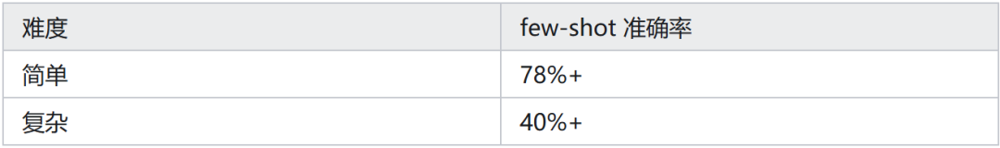
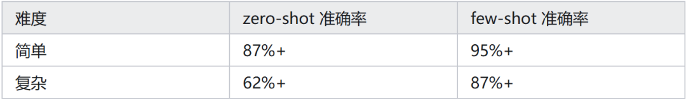

# Qwen2.5-32B微调实践：4bit+LoRA

本文将分享一个医疗数据分析领域的 Text2SQL 项目。这是我第一个 Text2SQL 项目，算是这个场景中的新手，踩了不少坑，刚好和大家分享。

## 01 背景

客户内部有几十个业务数据库，分析师每天要写大量 SQL。需要构建自然语言转 SQL 的工具——用户用中文提问，系统自动生成 SQL 查询。

由于数据库 schema 中包含患者信息、诊断记录、用药数据等，合规上不允许任何包含数据库结构的 prompt 发到外部 API。因此只能本地部署模型，用开源模型 + 微调。

## 02 难点分析与训练设计

项目中最大的挑战是客户的数据库跟公开数据集差异很大——表名是拼音缩写，字段命名不规范，还有大量业务特有的 JOIN 逻辑。

我们的场景中，有客户的数据库和历史查询日志（带结果），但缺少自然语言问题到 SQL 的配对标注。让分析师手动标注成本太高，标一条要 5-10 分钟。

这正好适合用 GRPO（DeepSeek-R1 同款训练方法）：不需要人工标注，让模型自己生成 SQL，在数据库上执行，跑对了就奖励、跑错了就惩罚。只要有数据库和标准答案就能自动训练。

模型选择了 Qwen2.5-Coder-32B-Instruct，4bit 量化 + LoRA，8 张 H100 能快速跑起来。

## 03 奖励函数设计

我设计了 5 个奖励信号，分为两类：

Ground truth 奖励（不可替代）：

执行正确性：生成的 SQL 在数据库上执行，结果跟标准答案是否一致。这是唯一能反映"SQL 写对了没有"的信号。

采用 F1 软评分——部分匹配的 SQL 也能拿到 0~1 之间的分数，而不是非 0 即 1。

这样一条返回了 100 行中 99 行正确的 SQL 能拿到 0.99 分，而不是跟完全写错的一样拿 0 分。

代理奖励（辅助平滑梯度）：

格式规范：输出是否按要求的 XML 标签格式（<reasoning> + <answer>）

语法正确：SQL 能不能被 parser 解析

Schema 匹配：用到的表名列名跟标准答案的 Jaccard 相似度

N-gram 相似度：跟标准 SQL 的 bigram 重合度

为什么要代理奖励？因为执行正确性虽然是最重要的信号，但它太稀疏了——大部分生成的 SQL 执行结果都是错的，reward=0。

如果只有这一个信号，模型很难知道"往哪个方向改"。Schema 匹配和 N-gram 提供了连续的梯度：即使 SQL 执行结果不对，但表名选对了、结构接近了，也能拿到部分奖励，引导模型朝正确方向走。

权重分配上，执行正确性的权重远高于其他四个（3.0 vs 0.1~0.5），确保模型优先学"写对 SQL"，而不是"写得像标准答案"。

## 04 踩过的坑

首次踩坑（工程）：没有真实反馈，RL 就是在自嗨

前几轮实验，我同时跑了几种 GRPO 变体（Dr.GRPO、DAPO、REINFORCE++ 等），想对比哪个算法最好。

跑了一晚，看 metrics 曲线，schema 匹配度从 0.50 涨到 0.65，ngram 相似度也在涨。看起来模型在学。

但仔细一看——执行正确性始终是 0。

原因很蠢：训练脚本里数据库路径配错了，SQL 根本没有真正执行过。模型收到的反馈全部来自代理奖励，也就是"生成的 SQL 跟标准答案长得像不像"。

schema 匹配度涨了，只是模型学会了"看到这种问题就用这几张表"，是模式匹配，不是理解。

这恰好验证了上面奖励函数设计的一个关键点：代理奖励能引导方向，但不能替代 ground truth。

没有执行奖励的 RL 训练，本质上退化成了低效版 SFT——在模仿标准答案的表面模式，而不是学习写出语义正确的 SQL。

教训很简单：RL 的核心价值是 ground truth 奖励。如果你的奖励函数不能反映真实目标，那 RL 训练就是在优化一个错误的目标。

第二个坑（也是工程）：一条 SQL 搞崩训练

修好数据库路径后，终于有了真正的执行奖励。模型生成 SQL → 在真实数据库上执行 → 对比结果。

训练跑起来了，execution reward 从 0 开始涨，一切看起来很美好。

然后，在训练到 22% 的时候，整个 8 卡训练突然挂了。

查日志，看到这行：

WorkNCCL(SeqNum=7034, OpType=_ALLGATHER_BASE)ranfor1800063ms before timing out

翻译：某个 GPU 在一个同步操作上卡了 30 分钟，其他 7 张卡等不住了，集体超时退出。

根因：模型生成了一条带笛卡尔积的 SQL，类似 SELECT * FROM A, B, C WHERE ...，三张大表做交叉连接，结果集是天文数字。SQLite 老老实实地算，直到超时。

这张卡在执行这条 SQL，其他卡早就算完了在等它同步。等了 30 分钟，NCCL watchdog 判定超时，SIGABRT 杀掉所有进程。

DDP 训练的致命弱点：一个 rank 卡住 = 全部卡住。

作为 Text2SQL 领域的新手，修了三次才搞定：

第一次用 signal.alarm(30) 设超时——失败。SIGALRM 只能发给主线程，DDP 的 worker 线程收不到。

第二次用 threading.Timer——失败。SQLite 的连接不是线程安全的，跨线程关闭连接会 segfault。

第三次用 ThreadPoolExecutor：把 SQL 执行扔到独立线程池，用 .result(timeout=30) 等结果。超时就放弃，返回 reward=0。终于稳了。

executor=ThreadPoolExecutor(max_workers=1)try:result=executor.submit(run_sql, db,sql).result(timeout=30)exceptTimeoutError:result=None# reward=0

教训：RL 训练里跑外部程序（SQL 执行、代码运行、API 调用），一定要加超时。尤其是多卡 DDP 环境，一个 rank 的阻塞会传染给所有 rank。

第三个坑（算法）：算法选错，KL 散度爆炸 38 倍

GRPO 的几个比较有名的变体，我都无脑试了一波：

Dr.GRPO去掉了组内标准差归一化，相当于给梯度加了杠杆。效果是学得特别快——前期 reward 蹭蹭涨。

但到了中后期，KL 散度（衡量模型偏离原始策略多远）从 0.00028 飙到 0.0108，涨了 38 倍。模型已经跑偏了，开始生成一些语法正确但语义荒谬的 SQL。

REINFORCE++走另一个极端，特别保守。KL 稳如老狗，但 reward 也纹丝不动——太稳了，稳到什么都没学会。

最后还是选 DAPO（Dynamic Sampling Policy Optimization）作为基础，加上几个关键调整：

Cosine LR schedule：前期正常学，后期自动降低学习率，防止 KL 发散

KL 约束 β=0.01：给策略漂移加个软上限

num_generations 从 4 调到 8：每个问题生成 8 个答案做组内比较，而不是 4 个。数学上，4 个答案时有 15.5% 的概率全对或全错（组内无差异 = 这步白算），8 个答案降到 1.7%

这个组合兼顾了学习速度和稳定性。

## 05 推理侧：两层 RAG Agent 补最后一块拼图

模型训练完之后，zero-shot 准确率已经有了明显提升。但在客户的实际场景中，还有一个问题：客户有几十个数据库、上百张表，模型需要先知道"这个问题该查哪些表"，才能写出正确的 SQL。

光靠把所有表的 schema 塞进 prompt 是不现实的——几十个库的 schema 拼起来远超上下文窗口。

所以在推理侧加了一个两层 RAG Agent：

第一层：业务路由。根据用户问题识别业务领域（比如"门诊量统计"→ 门诊系统库，"药品库存"→ 药房管理库），缩小到 1-2 个目标数据库。这一层用关键词匹配 + embedding 相似度，很轻量。

第二层：Schema 检索。在目标数据库内，用问题去检索最相关的表和字段。把检索到的 schema + 从历史日志中找到的相似查询作为 few-shot 示例，一起拼进 prompt。

这样模型拿到的 prompt 是精准的：只包含相关的 schema 和几个参考示例，而不是整个数据库的全量信息。

效果上，RAG Agent 主要解决了复杂查询的准确率——简单查询模型本来就能搞定，但涉及多表 JOIN、子查询的复杂场景，few-shot 示例的引导作用非常明显。

## 06 最终结果

Base model（Qwen2.5-Coder-32B）+ RAG Agent 的 few-shot 执行准确率：

GRPO 训练后 + RAG Agent：

几个值得注意的点：

训练后的 zero-shot 87.3% 已经超过了训练前的 **few-shot 78%**，说明 GRPO 确实让模型学到了东西，而不只是靠 few-shot 示例撑着

复杂查询的提升最大（40% → 87%），这正是 RL 的价值——模型学会了处理多表 JOIN 和嵌套子查询的逻辑，而不只是模式匹配

few-shot 在训练后仍然有 ~8% 的额外提升，说明 RAG Agent 和模型能力是互补的

这是我在 Text2SQL 项目中的主要经验。总结三个最值钱的教训：

奖励函数决定一切：ground truth 奖励（执行正确性）不可替代，代理奖励只是辅助。先确认核心奖励信号正常，再开大规模训练。

RL + 外部执行要防御性编程：SQL 执行、代码运行这类操作必须加超时，DDP 环境下一个 rank 卡住会拖垮全部。

算法选择要平衡激进与保守：学得快的容易崩（Dr.GRPO），太稳的学不动（REINFORCE++），DAPO + cosine LR + KL 约束是个不错的起点。

作者：亚马逊AWS数据科学家刘明

来源：https://zhuanlan.zhihu.com/p/2015523496889964219
