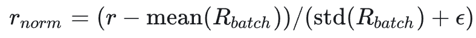
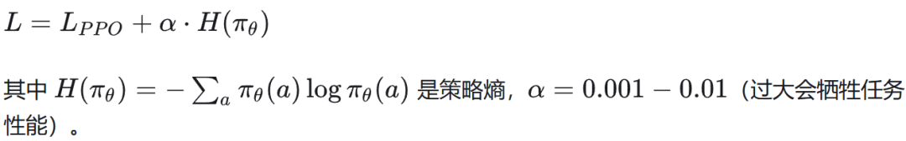
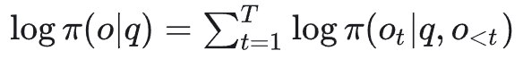
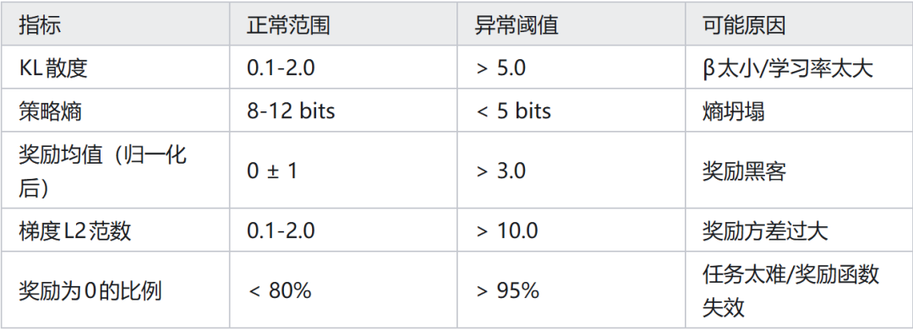

# RLHF/GRPO/PPO训练老是炸，我人都麻了...

## 01 背景

强化学习训练 LLM（RLHF/GRPO/PPO）在实践中常出现严重的训练不稳定问题：奖励曲线周期性崩溃、KL 散度突然爆炸、损失函数出现 NaN/Inf、模型输出退化为重复文本或乱码。

与监督学习不同，RL 的训练动态是非线性的——策略的微小改变会引发奖励分布、价值估计和梯度信号的连锁变化。

理解不稳定的根本原因并建立系统化诊断流程，是保障 LLM 强化学习实验成功的核心工程能力。

## 02 不稳定性的典型表现与根本原因

1. KL 散度爆炸

现象：训练过程中 KL(π_θ || π_ref) 突然从正常范围（0.1-2.0）跳升至 20+，之后奖励迅速下降，模型输出质量崩溃。

根本原因：

KL 惩罚系数 β 过小：β < 0.01 时，KL 约束几乎不起作用，策略可以自由偏离参考模型

学习率过大：单步梯度更新导致策略分布发生质变

奖励偶发高分：若某类奇异输出意外获得极高奖励，策略会迅速收窄到该分布

诊断方法：在训练日志中每 10 步记录 KL 散度值，设置阈值警报（KL > 5.0）；同时记录每个批次的最大奖励样本的输出文本，检查是否出现异常格式。

2. 奖励塌陷（Reward Collapse）

现象：奖励曲线先快速上升，然后突然下降并维持在低水平，模型输出趋于高度相似（模式坍塌）或无意义重复。

根本原因：

奖励黑客：模型发现并利用了奖励函数的漏洞（如极长输出、特定格式），奖励分数虚高；当奖励模型更新时，之前的策略失效

熵坍塌（Entropy Collapse）：策略熵过低，模型输出多样性下降，陷入局部最优

Critic 过估计：PPO 的 Critic 网络过高估计状态价值，导致优势估计为负，策略异常保守

诊断方法：监控策略熵（对每个 token 的预测分布计算熵）；若熵值连续下降且低于 5 bits（LLM 正常范围约 8-12 bits），说明熵坍塌开始。

3. 梯度 NaN/Inf

现象：训练中途损失函数出现 NaN，后续参数全变 NaN，训练彻底失败。

根本原因：

长序列 PPO 的 log 概率数值问题：PPO 中需要计算 logπ_θ(o|q)，对极长序列（1000+ tokens），累积 log 概率可能下溢到 -∞

奖励方差过大：未归一化的奖励信号（如 Raw PPO 分数从 -100 到 +100 的跨度）产生极大梯度

行为：不截断的概率比：PPO 的 r_t(θ) = π_θ / π_old，若序列分布差异极大，可能产生数百倍的概率比，梯度爆炸

## 03 系统化解决方案

方案 1：自适应 KL 控制

标准固定 β 有时无法应对动态的 KL 变化，自适应 KL 控制器在训练中动态调整 β：

ifKL > target_KL * 1.5:β = β * 1.5# 增大KL惩罚elifKL < target_KL / 1.5:β = β / 1.5# 减小KL惩罚

target_KL 通常设为 0.1-0.5（数学推理任务）或 0.5-1.0（对话任务）。自适应 KL 控制在 PPO 和 GRPO 中均适用，可将 KL 维持在目标区间内而不完全阻止策略改善。

方案 2：奖励归一化与裁剪

序列级归一化：在同一批次内对奖励进行 Z-score 归一化（均值 0，标准差 1），消除批次间奖励尺度差异：

奖励裁剪：在 [-5, +5] 范围内裁剪归一化后的奖励，防止极端样本主导梯度。

重要注意：GRPO 的组内归一化（用组均值和标准差）已经内置了归一化机制，但若组内所有奖励相同（全对或全错），std=0，此时需要将优势设为 0 而非 NaN。

方案 3：熵正则化

在 PPO 目标中加入熵奖励，鼓励策略保持多样性：

当策略熵连续 5 步低于阈值时，将 α 动态提升（×2），熵恢复后恢复正常值。

方案 4：数值稳定性工程

序列级 log 概率的数值稳定：对长序列不直接相乘 token 概率，而是在 log 空间求和：

对每个 token 的 log 概率裁剪到 [-20, 0]，防止极低概率 token 产生极端梯度。

混合精度的 BF16 处理：RL 计算的奖励和价值函数在 FP32 精度中进行，仅模型前向传播使用 BF16，避免 BF16 的动态范围不足导致溢出。

方案 5：渐进式训练课程

训练不稳定往往在以下阶段爆发：

训练早期：策略随机，生成的 rollout 质量极差，奖励信号极端

能力跃迁期：策略突然学会某项技能（如格式输出），奖励分布发生质变

难度课程学习（Curriculum Learning）可以平滑这两个阶段的冲击：从简单问题（2-5 步推理）开始，随训练步数增加逐渐引入难问题（10-20 步推理）。

这样训练初期奖励信号稳定（简单题有效奖励比高），避免早期梯度极端。

方案 6：Checkpoint 监控与回滚

实现自动 Checkpoint 评估-回滚机制：

每 N 步保存一个 Checkpoint

在保留集（held-out evaluation set）上验证当前策略性能

若性能连续 3 个 Checkpoint 下降，自动回滚到最佳 Checkpoint 并降低学习率（×0.5）

关键监控指标：

工程实践建议：

RL 训练必须配备完善的监控仪表盘：至少记录 KL、熵、奖励分布、梯度范数，每 10 步打点

训练早期使用保守超参数：学习率 1e-7（比 SFT 低 10 倍），β=0.1，稳定后再逐步调整

GRPO 的 std 保护：在计算组内归一化时，若 std < 1e-6，跳过该批次更新而非除以近零标准差

定期可视化输出样本：每 100 步随机抽取 5 条输出，人工或 LLM 评判质量，及早发现奖励黑客

参考文献：

Ziegler et al., Fine-Tuning Language Models from Human Preferences, arXiv 2019

Schulman et al., Proximal Policy Optimization Algorithms, arXiv 2017

DeepSeek-AI, DeepSeek-R1: Incentivizing Reasoning Capability in LLMs via RL, 2025

Gao et al., Scaling Laws for Reward Model Overoptimization, ICML 2023

作者：硅基趣玩喵

来源：https://zhuanlan.zhihu.com/p/2013646301737287977
