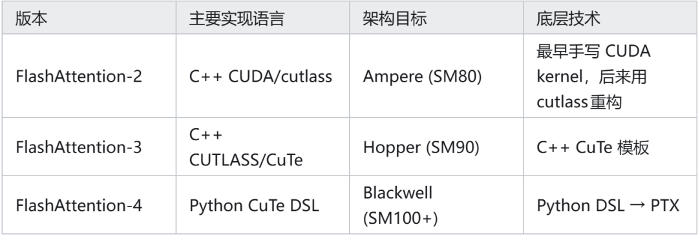
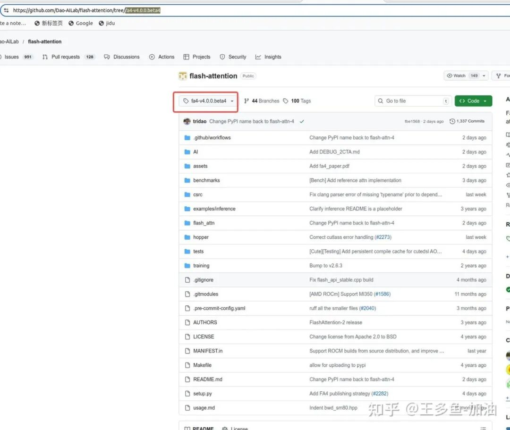
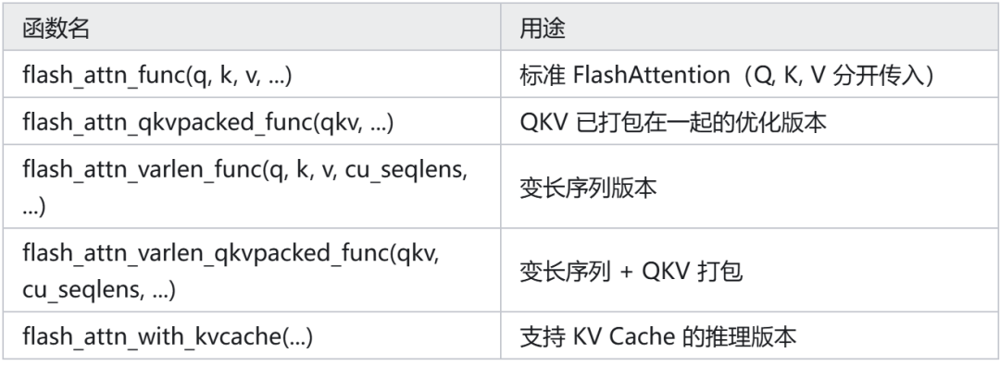
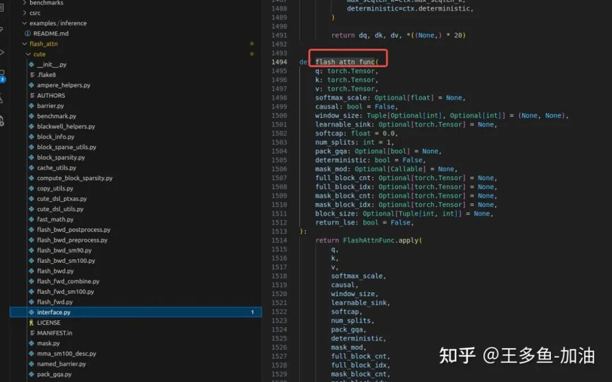
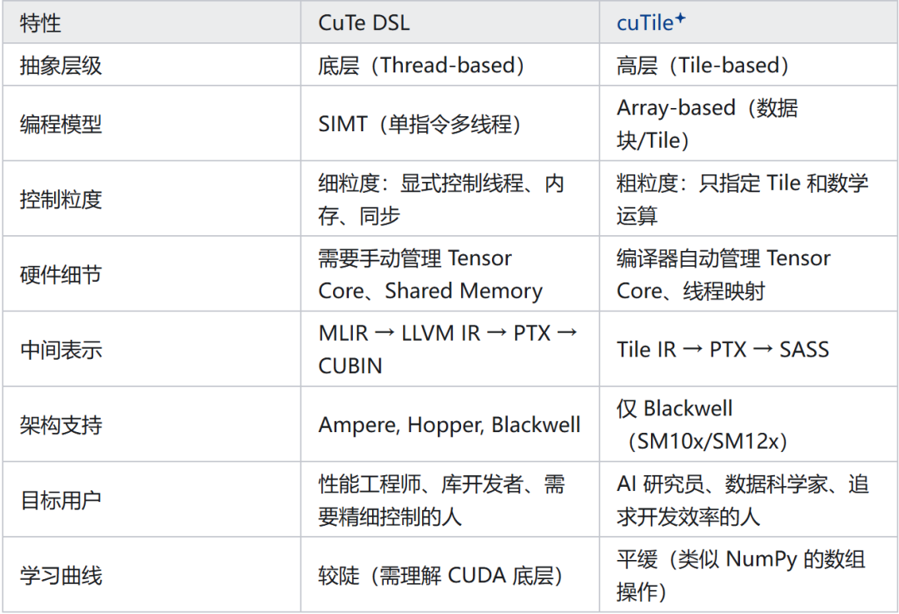
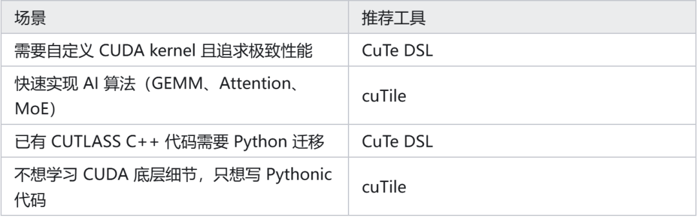

# FlashAttention-4实测：为什么这么快？

## 01 前言

这里记录一下我测试 flashattn4 的一些文字。我看了一些资料都说 falsh attn 的性能已经接近了 gemm 的操作了，flashattn4 获得完整性能收益（1605 TFLOPs/s），我也好好学习一下，具体的优化点是什么。

我自己感觉 tri dao flashattn 倾向与使用 python 暴露对外接口，借助 cutlass 和 cute 的 cpp 接口/cute dsl 接口的基础能力来进行 flashattn 的优化。

其中 flashattn2 和 flashattn3 倾向暴露 python 接口，但是使用 c++ cutlass/cute 来实现算子；flash atnn4 直接使用 cute dsl 来实现算子，底层是 mlir 降低到 ptx 指令。

flashatnn2 主要是针对安培架构，flashattn3 主要是针对 hopper 架构，flashattn4 主要是针对 blackwell 架构。

使用的底层支持能力也从 cutlass cpp->cute->cute python dsl 逐渐转变。

FA4 完全使用 Python 编写的 CuTe DSL 来实现，主要是针对 blackwell 架构以及 hopper 架构，即 sm 是 sm90 sm100 等几个 sm。

FA2 (C++ CUDA/cutlass) → FA3 (c++ CuTe )→ FA4 (Python CuTe DSL)↓ ↓ ↓Ampere Hopper Blackwell(SM80) (SM90) (SM100+)



我们需要说明的是 python cute dsl 和 cute 的 python 接口不是一个东西，也没有上下层的调用依赖关系。

## 02 论文阅读

原始参考链接：FlashAttention-4: Algorithm and Kernel Pipelining Co-Design for Asymmetric Hardware Scaling

https://arxiv.org/abs/2603.05451

// 论文解读 todo 中。我用 ai 翻译了一篇。

## 03 源码解读

3.1 源码拉取

代码仓库地址是：

https://github.com/Dao-AILab/flash-attention

我用的 tage 是 fa4-v4.0.0.beta4。



3.2 入口文件分析

入口文件结构

FlashAttention-4 的入口文件和函数分布在以下几个关键位置：

1. 包级入口：flash_attn/__init__.py

这是用户导入时的主要入口点，导出核心函数：

fromflash_attnimportflash_attn_qkvpacked_func, flash_attn_func

2. 核心接口文件：flash_attn/flash_attn_interface.py

这是 FA4 的主要接口实现文件，包含以下关键函数：



3. CuTe DSL 核心实现：flash_attn/cute/interface.py

这是 FA4 特有的 Python CuTe DSL 接口层，负责：

定义 kernel 的 DSL 实现

处理架构特定的调度（SM90/SM100）

管理 JIT 编译和缓存

4. FlexAttention 集成入口

PyTorch FlexAttention 使用 FA4 作为后端时的入口：

fromtorch.nn.attention.flex_attentionimportflex_attentionflex_flash = torch.compile(partial(flex_attention, kernel_options={"BACKEND":"FLASH"}),dynamic=False)

1）函数调用链

用户调用↓flash_attn_func() / flash_attn_qkvpacked_func()[flash_attn_interface.py]↓_flash_attn_forward() / _flash_attn_backward()[Python 层]↓CuTe DSL Kernel (JIT 编译)[flash_attn/cute/*.py]↓PTX → SASS (GPU 机器码)

2）关键架构特定入口

在 flash_attn/cute/ 目录下，有架构特定的实现入口 ：

flash_fwd_sm100.py：Blackwell (SM100) 前向实现入口

flash_fwd_sm90.py：Hopper (SM90) 前向实现入口

flash_bwd.py：反向传播实现入口

pipeline.py：异步流水线管理入口

5.总结

FA4 的主要入口函数是：

flash_attn_func(q, k, v, ...)：最常用入口，支持标准 attention

flash_attn_qkvpacked_func(qkv, ...)：当 QKV 已融合时的优化入口

flash_attn_varlen_func(...)：处理变长序列的入口

这些函数定义在 flash_attn/flash_attn_interface.py，但实际计算通过 flash_attn/cute/interface.py 调度到 CuTe DSL 实现的 kernel，最终 JIT 编译为 GPU 代码执行。

3.2 example flash attn 4

flashattn/example 的例子还没有，但是 comming soon。可以参考的是 cute 目录的 readme。

FlashAttention-4is a CuTeDSL-based implementation of FlashAttentionforHopperandBlackwell GPUs.## Installation```shpip install flash-attn-4```## Usage```pythonfrom flash_attn.cute import flash_attn_func, flash_attn_varlen_funcout = flash_attn_func(q, k, v, causal=True)```## Development```shgit clone https://github.com/Dao-AILab/flash-attention.gitcd flash-attentionpip install -e "flash_attn/cute[dev]"pytest tests/cute/```

所以我们跟踪一下 flash_attn_func 函数。

定义在 interface.py 文件里。



我们一路跟踪下来我们就发现最后调用的 cute dsl 的接口。所以下一章节我们要分析一下 cute dsl 都支持哪些接口。

整体 flashatnn4 的优化逻辑就在 flashattn/cute/目录的这些 python 文件，最后调用了 cute 提供的 api。

详细的源码分析，施工中，todo 中。

## 04 cute dsl

4.1 暴露的编程接口

https://zhuanlan.zhihu.com/p/2013901356235239764

官方接口说明文档：NVIDIA CUTLASS Documentation

https://docs.nvidia.com/cutlass/latest/media/docs/pythonDSL/cute_dsl_api.html

CuTe DSL 的设计目标是与 CuTe C++ 保持一致，同时提供 Python 的易用性，支持从 Ampere 到 Blackwell 的多代 GPU 架构。目前看他比基于模板的cute 的编译时间降低了很多。

4.1.1 cute dsl 和 cu-tile dsl 的区别

其实这里也解释了有了 cute-dsl 后，为啥还要有 cu-tile dsl。

1）不同点



2）为什么需要两者共存？

1. 不同用户群体的需求

CuTe DSL：面向需要"speed-of-light"极致性能的用户。

例如 FlashAttention-4 使用 CuTe DSL 实现，因为需要精细控制 Warp Specialization、TMEM、异步流水线等硬件特性。

cuTile：面向 "good performance with minimal effort" 的用户。

例如快速原型验证 MoE kernel，86 行 Python 代码生成 1,900 行 PTX，编译器自动处理屏障、退避策略、leader election 等复杂逻辑。

2. 不同的编译路径

cuTe DSL 路径（传统 SIMT）： Python → MLIR (cute dialect) → LLVM IR → PTX → SASS

cuTile 路径（全新 Tile 抽象）： Python → Tile IR → PTX → SASS

Tile IR 是关键创新：它是比 PTX 更高层的虚拟 ISA，专门用于 Tile-based 编程，可以自动适配不同代 Tensor Core，实现前向兼容性。

3. 生态位差异



3）总结

NVIDIA 推出两者是为了 "加深 CUDA 护城河"：

CuTe DSL：巩固现有 CUDA 生态，让 CUTLASS C++ 用户平滑迁移到 Python，同时保持对硬件的完全控制。

cuTile：应对 Triton 的竞争 。Triton 的成功证明了 Tile-based 编程模型的市场需求，cuTile 是 NVIDIA 的正面回应，且通过 Tile IR 实现了比 Triton 更深的硬件集成。

"NVIDIA 现在有五款不同的 Python DSL（OpenAI Triton、CuTe Python、cuTile Python、Numba、Warp），NVIDIA 团队现在在用多个不同的 DSL 相互竞争"。

CuTe DSL 不会取代 cuTile，反之亦然：

如果你需要像 FlashAttention-4 那样榨干 Blackwell 的每一滴性能，使用 CuTe DSL。

如果你只是想快速实现一个 GEMM 或 Attention 变体，不想关心线程调度，使用 cuTile。

4.2 cute dsl 的编译过程

CuTe DSL 的编译流程分为三个阶段：

Python源码↓Pre-Staging(AST重写) → 插入回调捕获控制流结构↓Meta-Staging(Python解释器) → 执行并生成MLIRIR↓Object-Staging(MLIR编译器) →Lower到PTX/SASS

生成的 MLIR 使用CuTe 方言和标准 MLIR 方言（如scf,cf,gpu等），例如：

!memref_gmem_f16 = !cute.memref<f16, gmem,"(128,256):(256,1)">func.func@cutlass_kernel_Epilogue(%A: !memref_gmem_f16,%B: !memref_gmem_f16,%C: !memref_gmem_f16) {scf.for ... {%fA= cute.slice ...%fB= cute.slice ...%fC= cute.slice ...cute.gemm(%fA,%fB,%fC)}}

虽然可以通过上述方式查看 MLIR，但 CuTe DSL 的 MLIR 方言编译器本身目前还不是开源软件。

和 triton 类似，编译过程文件存在 .cache 目录：.cache/cutedsl。

## 05 测试

5.1 5090 测试

// todo 单独写文章

5.2 b200 测试

我自己测试到不了 1700 tflops，只能到 1300。并且我测试的大尺寸 gemm 也才 1500，我先分析一下，感觉我哪里有问题。

// todo 单独写文章

## 06 总结

1）学 mlir 可能有用，因为 flashattn4 基于 cute dsl 的性能除了这这部分 python 代码看 layout 和 piple 的设计，你可能也好看看 .cache 目录的编译中间文件。

2）暂时没有总结。感兴趣的人多，我就熬夜看代码有动力了。

作者：王多鱼-加油

来源：https://zhuanlan.zhihu.com/p/2013890106080142740
