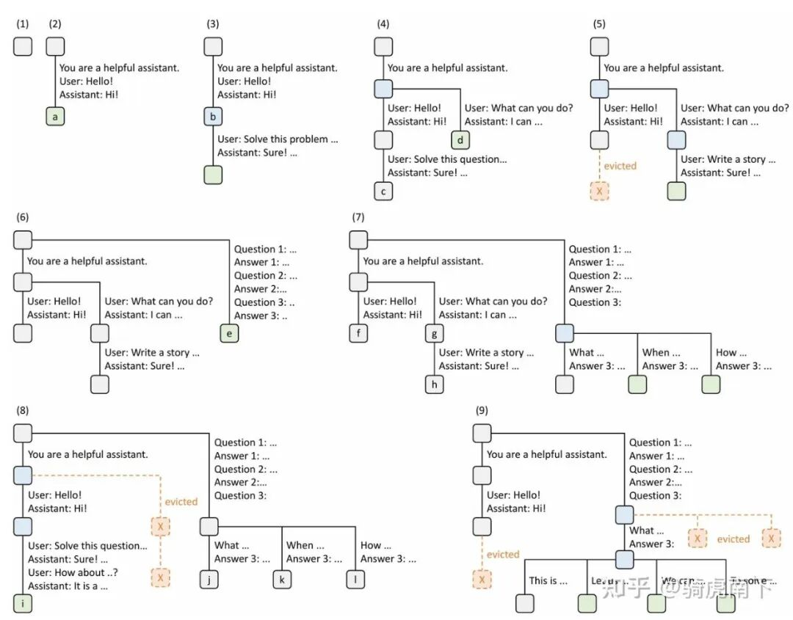

# Prefix Cache为什么能让推理速度翻倍？

本文，分三个模块简要介绍 Prefix Cache 技术，分为，什么是 Prefix Cache 技术，SGLang 论文中关于 Prefix Cache 技术的介绍 ，以及 SGLang 中针对 Prefix Cache 的实现逻辑。

## 01 什么是 Prefix Cache

假设有 Request 0，Request 1，Request 2，Request 3 四个请求，Prompt 分别为如图示。

蓝色字体是四个请求重复的 Token，紫色字体是 Request 1，Request 2，Request 3 之间重复的 Token，红色字体是 Request 1，Request 3 之间重复的 Token。

根据之前的文章，大模型推理的 KV Cache 优化，我们知道 KV Cache 存储的就是之前 Token 的 K 值与 V 值。

根据之前的文章，大语言模型推理的 Packing 优化，我们知道除去 Attention 模块，其余算子都是 Token Wise 操作。

对于有重复 Token 的不同请求之间，我们可以复用这些重复 Token 的 KV Cache，以减少 Prefill 阶段的计算量。

这就是 Prefix Cache！

## 02 SGLang 论文中的 Prefix Cache

RadixAttention 是 SGLang 的核心缓存管理技术，Radix Attention 实现就是 Prefix Cache 功能。它的核心思想就是利用基数树结构在请求之间高效地存储和复用 KVCache。

通过识别相同的 Token 序列，RadixAttention 消除了冗余计算，显著加速了响应时间，特别是在具有重复提示词或对话上下文的工作场景中。

如上图是论文中展示的基数树在处理多个输入请求时的动态维护过程（九个时间节点），涉及两个对话会话、一批少样本学习查询和一次自一致性采样。

树的每条边标记子一串 Token 序列，可以理解为一个请示的 Prompt 再加 Decode 生成的 Token 序列。

节点通过颜色区分状态：

绿色表示新添加节点；

蓝色表示当前时间节点访问的缓存节点；

红色表示已淘汰节点。

其中每个节点可以理解为每个请求的 Block，这个 Block 就是 Paged Attention 的 Page 大小。

步骤（1）中基数树初始为空；

步骤（2）中服务器处理用户消息 “Hello” 并返回 LLM 输出 “Hi”，将系统提示 “You are a helpful assistant”、用户消息 “Hello!” 和 LLM 回复 “Hi!” 串起来作为树的一条边，链接到新节点；

步骤（3）中接收新的请求，服务器在基数树中找到前面步骤（2）中前缀提示，并复用其 KV 缓存，将新轮次追加为新节点；

步骤（4）中启动新对话会话，拆分步骤（3）中的节点 “b”，使两个对话会话可共享“You are a helpful assistant”这个系统提示的 KVCache；

步骤（5）中第二个对话会话继续推理，由于内存限制，淘汰步骤（4）中的节点 “c”，在节点 “d” 后追加新新请求的 Context 做作新一条边；

步骤（6）中接收少样本学习查询的请求，由于与现有节点无任何可共享前缀 Prompt，所以拆分根节点并插入新的一条边；

步骤（7）中接收一批额外的少样本学习查询请求，这些请求共享相同的少样本示例，因此拆分步骤（6）中的节点 “e” 以支持前缀共享；

步骤（8）中接收第一个对话会话的新消息，淘汰第二个对话会话的所有节点（“g” 和 “h”），因其为这个是最近最少使用的节点；

步骤（9）中接收为步骤（8）中节点 “j” 的问题采样更多答案的请求（可能用于自一致性提示），为腾出空间，淘汰步骤（8）中的节点 “i”、“k” 和 “l”。

## 03 SGLang 源码的 Prefix Cache

整个 SGLang 中关于 Prefix Cache 源码实现在目录 sglang-main\python\sglang\srt\mem_cache 中。

如上图中实现的逻辑，主要有以下几个模块功能，包括前缀匹配策略，插入新节点（新请求）与更新节点，显存不够时驱逐节点策略。

1. 前缀匹配策略

当新请求到达时，RadixAttention 通过遍历基数树来识别已缓存的最长 Token 序列，从而执行前缀匹配。

如果能够匹配部分 Prompt 可以避免对匹配 Token 的 KV Cache 计算，直接检索加载缓存的 KV Cache。

匹配操作遵循递归树遍历：

从根节点开始匹配。

将传入的 token 与子节点的 Key 进行比较，每个节点以 Block 大小为单位。

跟随匹配分支，直到分叉或结束，找到最长的匹配路径。

返回匹配长度、设备索引和引用的节点，再根据节点去加载已经存储的 KV Cache。

其源码的主要逻辑如下：

defmatch_prefix(self, params: MatchPrefixParams) -> MatchResult:"""在radix树中查找键的最长缓存前缀。前缀匹配的逻辑命名空间由token id序列和RadixKey携带的可选extra_key共同决定。共享相同前导token ids但具有*不同*extra_key值的条目被有意地保持分离，从不共享前缀节点。这对于以下情况很有用：* 隔离不同LoRA/适配器ID的KV缓存行* 通过提供不同的extra_key来分离有意不应共享状态的请求（例如，不同的采样盐、缓存版本或检索增强上下文）Args:params (MatchPrefixParams): 包含查找键的参数，键包含token id列表和可选的extra_key命名空间标签。如果page_size > 1，长度会在内部截断为page_size的倍数后再进行匹配。传递空键会返回空结果，根节点作为最后一个节点。Returns:MatchResult: device_indices是对应于最长缓存前缀（可能长度为0）的连接KV缓存索引的1-D torch.int64张量。last_device_node和last_host_node（目前相同）是表示匹配前缀终端节点的树节点对象。如果匹配在存储段内结束，此方法可能会通过分裂现有节点来改变内部结构。内部更新：* 刷新访问元数据（时间戳），供配置的驱逐策略使用* 如果查找在存储段内结束，节点会被分裂一次以暴露精确边界；这种结构优化提高了后续匹配效率且不会重复数据"""key = params.keykey, _ =self.maybe_bigram_convert(key)defempty_match_result():returnMatchResult(device_indices=torch.empty((0,),dtype=torch.int64,device=self.device,),last_device_node=self.root_node,last_host_node=self.root_node,)ifself.disableorlen(key) ==0:returnempty_match_result()ifself.page_size !=1:page_aligned_len =len(key) //self.page_size *self.page_sizekey = key[:page_aligned_len]iflen(key) ==0:returnempty_match_result()value, last_node =self._match_prefix_helper(self.root_node, key)ifvalue:value = torch.cat(value)else:value = torch.empty((0,), dtype=torch.int64, device=self.device)returnMatchResult(device_indices=value,last_device_node=last_node,last_host_node=last_node,)def_match_prefix_helper(self, node: TreeNode, key: RadixKey):"""匹配前缀的辅助函数，返回匹配的值列表和最后一个节点"""access_time = time.monotonic()node.last_access_time = access_timechild_key =self.get_child_key_fn(key)value = []whilelen(key) >0andchild_keyinnode.children.keys():child = node.children[child_key]child.last_access_time = access_timeprefix_len =self.key_match_fn(child.key, key)ifprefix_len <len(child.key):# 如果匹配长度小于子节点键长度，需要分裂节点new_node =self._split_node(child.key, child, prefix_len)value.append(new_node.value)node = new_nodebreakelse:# 完全匹配，继续向下搜索value.append(child.value)node = childkey = key[prefix_len:]iflen(key):child_key =self.get_child_key_fn(key)returnvalue, node

2. 插入或者更新节点

新请求在生成完成所有 Token 后，触发 KV Cache 插入，系统将新序列与现有树结构以一定规则合并，并在必要时创建中间节点以保留共享前缀。

插入过程主要处理以下几种情况：

如果能精确匹配到基数树中某条路径，那就复用现有节点，但是可能会更新优先级。

如果是部分匹配，拆分匹配分叉开始位置的节点，如上图（4）所示，拆分后共享父节点。

如果没有任何路径匹配，从根节点创建新分支。

其源码的主要逻辑如下：

definsert(self, params: InsertParams) -> InsertResult:"""插入新的KV缓存到radix树中"""ifself.disable:returnInsertResult(prefix_len=0)key = params.keyvalue = params.valuepriority = params.priorityifvalueisNone:value = torch.tensor(key.token_ids, dtype=torch.int64)key, value =self.maybe_bigram_convert(key, value)prefix_len =self._insert_helper(self.root_node, key, value, priority)returnInsertResult(prefix_len=prefix_len)def_insert_helper(self, node: TreeNode, key: RadixKey, value, priority:int=0):"""插入KV缓存的辅助函数"""# 将None优先级转换为0ifpriorityisNone:priority =0access_time = time.monotonic()node.last_access_time = access_time# 沿路径更新优先级（取最大值以传播更高优先级）node.priority =max(node.priority, priority)iflen(key) ==0:return0child_key =self.get_child_key_fn(key)total_prefix_length =0whilelen(key) >0andchild_keyinnode.children.keys():node = node.children[child_key]node.last_access_time = access_timeprefix_len =self.key_match_fn(node.key, key)total_prefix_length += prefix_lenkey = key[prefix_len:]value = value[prefix_len:]ifprefix_len <len(node.key):# 如果匹配长度小于节点键长度，分裂节点new_node =self._split_node(node.key, node, prefix_len)new_node.priority =max(new_node.priority, priority)node = new_nodeelse:# 完全匹配，更新优先级node.priority =max(node.priority, priority)iflen(key):child_key =self.get_child_key_fn(key)iflen(key):# 创建新节点new_node = TreeNode(priority=priority)new_node.parent = nodenew_node.key = keynew_node.value = value.clone()node.children[child_key] = new_nodeself.evictable_size_ +=len(key)self._update_leaf_status(node)self._update_leaf_status(new_node)# 哈希值将在事件发射期间延迟计算self._record_store_event(new_node)returntotal_prefix_length

3. 驱逐策略

RadixAttention 实现了复杂的驱逐策略，以在保证有价值 KV Cache 能缓存住，同时维持还要维持最佳的内存利用率，系统支持多种可由调度器配置的驱逐策略。

整个驱逐过程如下：

（1）收集可驱逐节点

系统遍历 Radix Tree，筛选出所有 evictable_leaves（可驱逐的叶子节点）

只有满足条件的节点才能被驱逐：lock_ref == 0（未被任何请求锁定）且是叶子节点

（2）构建驱逐优先级堆

使用 LRU 策略计算每个节点的优先级：node.last_access_time

时间戳越早，优先级越高，越先被驱逐

将所有候选节点按优先级放入最小堆（min-heap）

（3）逐个驱逐节点

从堆中弹出优先级最高（最久未使用）的节点

释放该节点占用的 KV Cache 物理内存：token_to_kv_pool_allocator.free(x.value)

从 Radix Tree 中删除该叶子节点：_delete_leaf(x)

更新驱逐计数器

（4）递归驱逐父节点

如果删除叶子节点后，其父节点变成了新的叶子节点（len(parent.children) == 0）

且父节点未被锁定（parent.lock_ref == 0）

将父节点也加入驱逐堆，继续驱逐

（5）重复直到满足需求

持续驱逐直到释放足够的 token 空间（num_evicted >= num_tokens）

或者没有更多可驱逐的节点

其源码的主要逻辑如下：

inc_lock_ref(node)：锁定节点及其所有祖先，防止正在推理的请求被驱逐

dec_lock_ref(node)：解锁节点，使其重新变为可驱逐状态

每个节点是否可驱逐，有引用计数器控制。

defevict(self, params: EvictParams) -> EvictResult:"""执行缓存驱逐操作"""ifself.disable:returnEvictResult()start_time = time.perf_counter()num_tokens = params.num_tokensleaves =list(self.evictable_leaves)eviction_heap = [(self.eviction_strategy.get_priority(node), node)fornodeinleaves]heapq.heapify(eviction_heap)num_evicted =0whilenum_evicted < num_tokensandlen(eviction_heap):_priority, x = heapq.heappop(eviction_heap)self.token_to_kv_pool_allocator.free(x.value)num_evicted +=len(x.value)self._delete_leaf(x)iflen(x.parent.children) ==0andx.parent.lock_ref ==0:new_priority =self.eviction_strategy.get_priority(x.parent)heapq.heappush(eviction_heap, (new_priority, x.parent))self._record_remove_event(x)self.update_eviction_metrics(num_evicted, start_time)returnEvictResult(num_tokens_evicted=num_evicted)definc_lock_ref(self, node: TreeNode):"""增加节点的锁引用计数"""ifself.disable:return0delta =0whilenode !=self.root_node:ifnode.lock_ref ==0:self.evictable_size_ -=len(node.key)self.protected_size_ +=len(node.key)delta -=len(node.key)node.lock_ref +=1self._update_leaf_status(node)node = node.parentreturndeltadefdec_lock_ref(self, node: TreeNode):"""减少节点的锁引用计数"""ifself.disable:return0delta =0whilenode !=self.root_node:ifnode.lock_ref ==1:self.evictable_size_ +=len(node.key)self.protected_size_ -=len(node.key)delta +=len(node.key)node.lock_ref -=1self._update_leaf_status(node)ifnode.parentisNone:assert(nodeisself.root_node),f"This request holds the node from another tree"node = node.parentreturndelta

这里只是简单介绍 Radix Attention 的基本逻辑，在 SGLang 源码还有 Hi Cache 的 Prefix Cache 策略，该策略主要通分层管理 KV Cache 的方式实现 Prefix Cache。

主要源码位置在 sglang-main\python\sglang\srt\mem_cache\hiradix_cache.py。

作者：骑虎南下

来源：https://zhuanlan.zhihu.com/p/1932812233219502671
