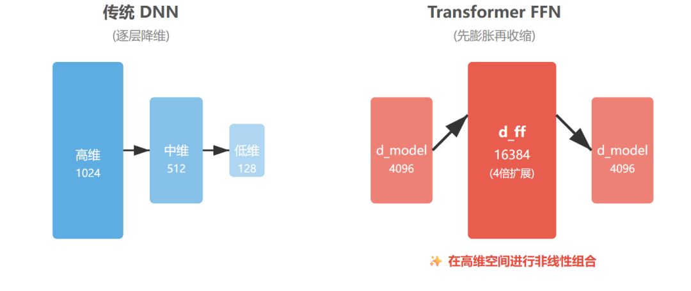

# Transformer里的FFN全换成Self-Attention会怎么样？

这是我一个学员在复盘面试大厂算法岗碰到的问题。面试官当时聊到模型架构设计，顺手就问了一句："如果把 Transformer 里的 FFN 全换成 Self-Attention，你觉得会发生什么？"

这个问题一听挺简单的，但其实很多人在这里会卡壳。下面我们就来仔细拆解一下。

首先你得搞清楚面试官问这题的意图是什么。面试官不是在考你是不是真的懂 Transformer 结构，而是想看你有没有真正理解 FFN 和 Self-Attention 这俩模块各自在干嘛、为什么缺一不可。所以答题的时候，核心思路是要把两者的功能差异讲透。

我们来看一下 FFN 到底在干什么。

标准 Transformer Block 里，FFN 是两层线性变换中间夹一个非线性激活函数，维度先升后降。

这里有个很关键的点：FFN 处理 token 的时候是逐位置独立的，每个 token 自己过自己的 MLP，互不干扰。

而 Self-Attention 呢，它的本质是在做 token 之间的信息交互和聚合，建模序列内的依赖关系。

所以你看，这两个模块分工其实非常明确：Self-Attention 负责"看上下文、做融合"，FFN 负责"在每个位置上做深度的非线性特征变换"。

有研究把 FFN 比喻成一种 key-value memory，存储的是模型在预训练阶段学到的知识。

换句话说，Attention 管的是怎么组合信息，FFN 管的是信息本身的深度加工。

好，接下来我们正面回答：如果真把 FFN 全换成 Self-Attention 会怎样？

第一个问题是表达能力会大打折扣。FFN 靠的是非线性变换来提升模型的拟合能力，经典 MLP 理论告诉我们，带隐藏层的 FFN 本身就是 universal function approximator。

你换成 Self-Attention 以后，虽然多了一堆 QKV 的 attention 操作，但你失去的是逐位置的深度非线性映射能力。模型对复杂模式的学习能力会明显下降。

第二个问题是训练稳定性会出问题。有实验专门测过，把 FFN 的线性层数从标准的 2 层减到 1 层甚至 0 层，模型在训练初期 loss 会更高、收敛更慢，甚至更容易出现梯度消失。

FFN 起到的其实还有一个隐性作用，就是为深层网络的训练提供更好的梯度流。

第三个问题，也是很现实的一点：参数效率会变差。标准 Transformer Block 里，FFN 的参数量其实比 MHA 还多，大概是 8:3 的比例。

但 FFN 的计算是逐位置并行的，复杂度是 O(n)，而 Self-Attention 的复杂度是 O(n²)。

你把 FFN 换成 Attention，相当于把所有计算都变成了 sequence-level 的交互，既慢又贵，还不一定能学到更好的东西。

所以结论是什么？

Self-Attention 和 FFN 在 Transformer 里其实是互补的。Attention 负责位置间的信息路由，FFN 负责位置内的特征深加工。

把 FFN 全换成 Attention，看起来你是在强化"交互能力"，但实际上你是在削弱模型对每个 token 独立做非线性变换的能力，最终效果大概率是变差的——loss 上升、训练变慢、模型质量下降。

面试的时候你可以最后补一句：正是因为这俩模块各司其职，Transformer 才能在各种任务上表现得这么强，"Attention is all you need"这句话其实有点“误导”，FFN 在 Transformer 里的作用被严重低估了。

这样收尾，既展示了你对架构的理解，也体现了一些批判性的思考，相比于纯背八股，给面试官的印象会好很多。
