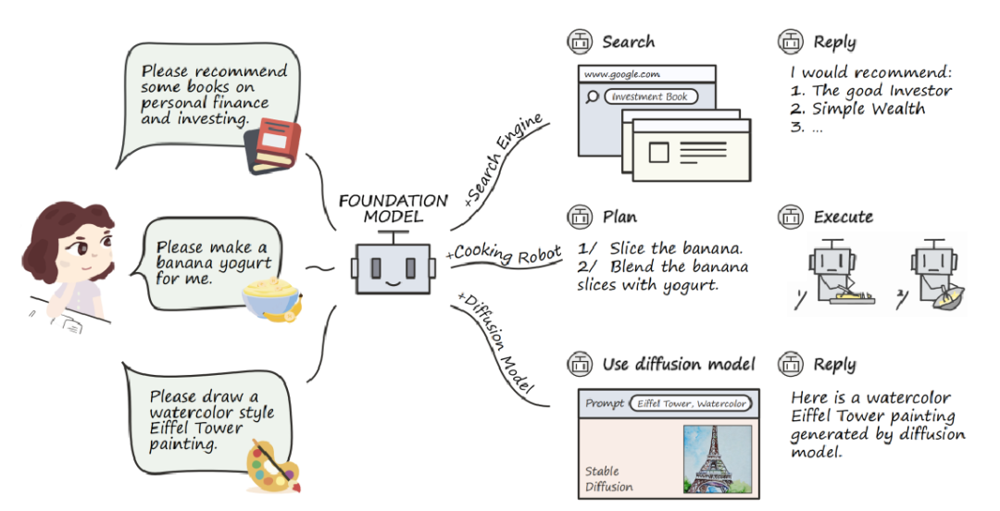
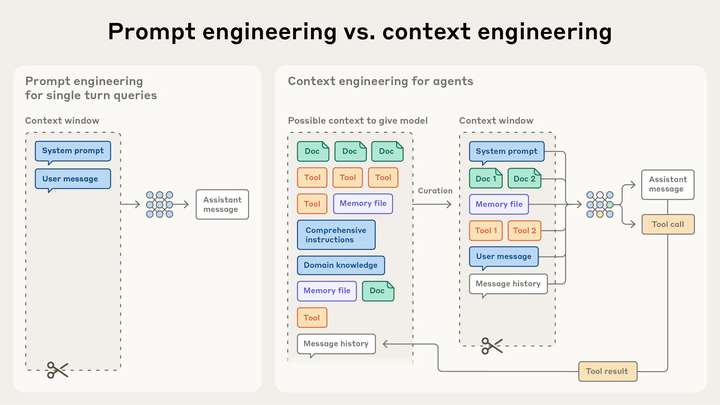
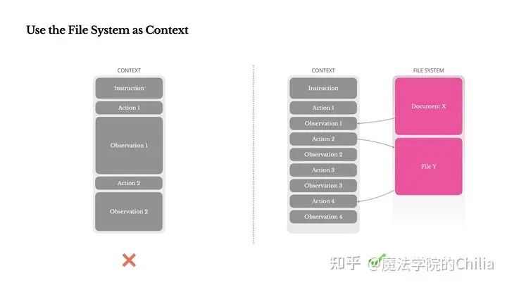
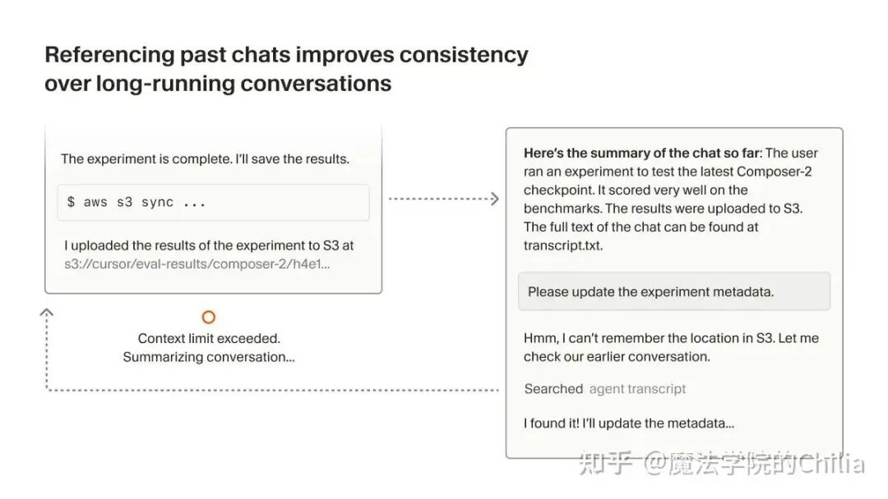
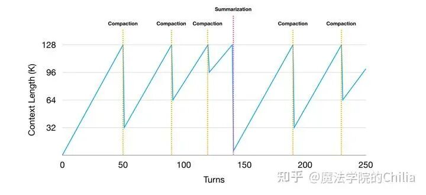
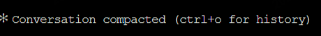
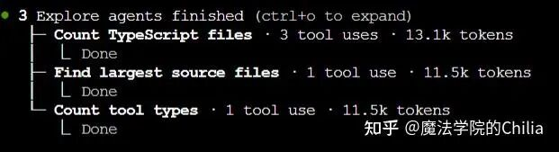
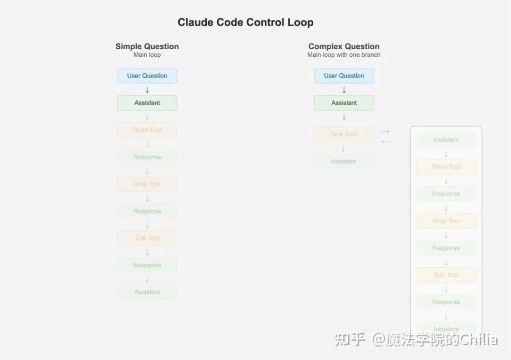
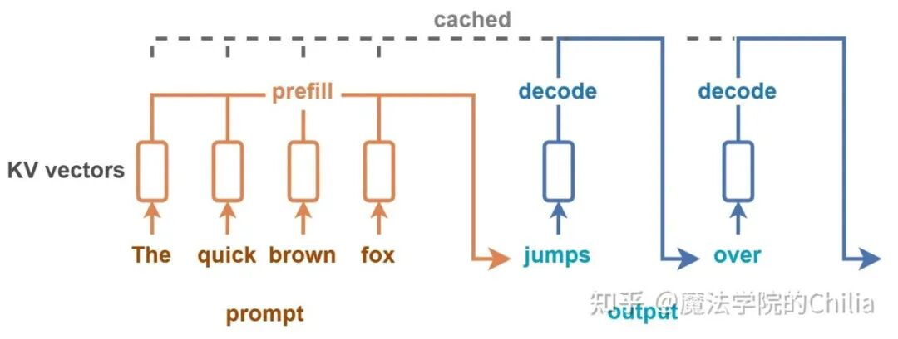
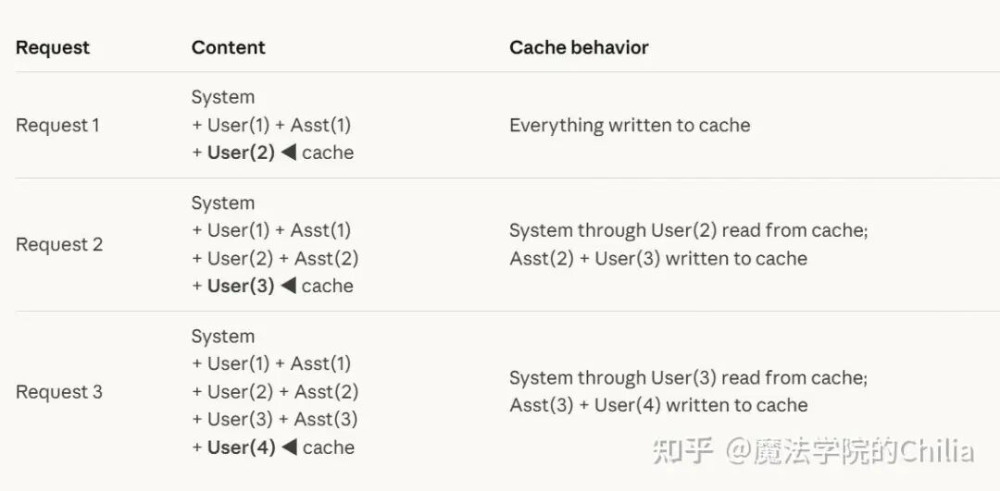

# 万字长文：讲透Agent上下文管理策略

今年春节前后，至少 9 家国内的厂商密集地发布了他们旗舰版本的模型（比如GLM5、MiniMaxM2.5、Qwen3.5），可以发现大模型领域的竞争焦点从通用能力转向了 Agent 落地、编程能力这两大方向。

随着 Claude Code、OpenClaw 等 Agent Scaffold 的爆火，各大厂商也纷纷将自己的定位锁定在 Agentic Engineering 上，从“chatbots that respond” 转向 “agents that act”。

不知道大家有没有尝试使用 Claude Code、OpenClaw 这样的 agent 框架，有没有开发出一些有趣的功能呢？反正我现在已经是重度依赖 Claude Code 了。

现在每天登上服务器的第一件事就是把 Claude Code 召唤出来，然后安全感满满~这就像是有好几个高级工程师在一旁毫无怨言地帮助我写代码一样。

因为我平时接触的各种代码框架都非常复杂，自己看起来确实学习的成本相当高。

Claude Code 不仅可以帮助我快速地理清各个模块的实现原理，还可以帮我实现一些新的 feature。

我常想，如果当年上学的时候有这种工具的话，那是不是“奋战三星期，造台计算机”、造编译器 、造路由器、造操作系统就不用那么痛苦了？（逃

话虽这么说，但是我还是不太建议学生过度依赖这些工具的。

对于一些进阶的复杂任务用它来帮助当然无可厚非（比如我有一个能力很强的实习生，他用这些工具也很熟练，所以工作效率非常高）。

但是对于那些涉及到基础编程的——比如数据结构、操作系统，作为学生还是应该在打基础的阶段锻炼自身的能力。

只依赖于工具、而缺乏自身对代码的理解，对于算法/软件工程师来说是万万不能的。

前一阵和同事聊天的时候，同事说他确实遇到过这样的人，在修改复杂框架的时候只用 Claude Code 然后无脑 accept，最后把框架改得乱七八糟的😵。

所以我们一致认为，自身编程能力过硬+能够有效利用 code agent 的人，才是这个时代最需要的。

今年我和我的团队一个重要的工作项就是：提升我们自研模型的 agentic coding 的能力，使我们的模型 API 能够接入 Claude Code/OpenCode 等框架，能够起到辅助开发者的作用。

因此，我打算新开一个 LLM Agent 的专题，不定期地更新一些内容。

之前已经写过一篇 agent 的基础知识了，适合零基础的小伙伴看：

https://zhuanlan.zhihu.com/p/2000210358820946463

这个系列的文章不会局限于如何使用，而是会介绍一些更加深入的框架设计层面的理解。当然也不会特别底层，以理解 Agent 框架的核心设计思路为主。

作为本系列的第二篇，这篇文章我们会介绍 Agent 的上下文管理策略，即如何组织 Agent 的短期记忆、如何管理长期记忆，这也是在 Agent 设计中比较重要的一点。

这篇文章是我最近写知乎花的精力最多、写得最费力的一篇，因为很多中文资料确实都像是用大模型 Agent 生成的一样，或者就是国外 blog 的机翻，很少有比较系统清晰的总结；官方的 doc 又非常长，且比较抽象。

所以这篇文章试图做一个系统性的介绍，并提供一些我实际使用 Claude-Code 中的例子帮助理解。当然，也只能是粗略地理解，毕竟具体框架的实现还是很复杂的。

好了，我们话不多说，开始今天的内容吧！

“人们分散到世界的四面八方，彼此成了仇敌。但他们的记忆仍留下了他们见过的事情，永不磨灭。”——《太古和其他的时间》，奥尔加 · 托卡尔丘克

## 01 背景

（1）什么叫上下文工程（Context Engineering）？

“上下文工程”简单来说，就是在一些 LLM 的约束下（如上下文窗口大小、注意力长度的限制），优化上下文 token 的效用，从而持续获得理想输出的工程实践。

一个好的 context engineering 追求用最少的、信号最强的 token 集合，最大化期望输出的概率。

因为随着 Agent 不断地运行，会不断产生新的数据，这些数据可能对下一轮推理有用，因此必须放到上下文中，作为模型的“短期记忆”。

Context engineering 就是从不断变化的信息中，精心挑选出能放入有限上下文窗口的内容。

如果说之前早期的"Prompt Engineering"适用于单轮文本生成任务；那么"Context Engineering"就适用于需要多轮推理、长时间运行的智能体，需管理不断演变的上下文状态。

prompt engineering 和 context engineering 的区别：context engineering（右）上下文工程需要从海量信息（文档、工具、记忆文件等）中筛选，形成最优上下文窗口

（2）为什么 Context Engineering 对构建一个强大智能体来说至关重要？

Agent 每调用一次工具，就会返回一个工具的 Observation，这个结果会被追加到聊天记录中。

生产环境中的 Agent 可能会进行长达数百轮的对话，因此随着时间的推移，历史记录 message 会越来越长。

而且，工具调用的 Observation 经常会特别长：比如模型执行 Read 命令，读取了一个文件的部分内容；或者执行 Bash 命令，输出了很长的 log。

这样长的 Observation 不断地拼接到上下文 message 中，最后很有可能超过了模型最长能够接受的上下文长度（比如 128K~1M）。

虽然现在的 LLM 能够接受越来越长的序列了，但它们和人类一样，会随着上下文增长而出现注意力涣散的现象，模型准确回忆信息的能力会下降，而且推理也会变慢。这种现象被称为 “上下文腐败”（context rot）。

虽然不同模型的性能下降曲线不同，但所有模型都存在这个特点，会在远低于能接受的最长序列长度时就出现 context rot 的现象（比如最长支持 1M token，但是在 200K token 的时候就已经开始 context rot 了）。

导致这种现象的原因包括：

注意力分散：每个token都关注上下文中的所有其他token，形成了 n²级别的两两关系。当 n 变大时，这种关注力被摊薄，导致注意力分散。

训练数据偏差：模型在训练时接触的长序列远少于短序列，因此对长距离依赖关系的处理经验不足。

位置编码插值等技术可以让模型适应更长的序列，但通常会牺牲一定的精度。

## 02 上下文工程

在上面一节我们说到，上下文工程的指导原则是：找到能够最大化期望输出概率的最小高信号 token 集合。那么这一部分，我们就介绍一些常见的上下文管理方式。

（1）上下文卸载与检索（Context Offload & Retrieval）：将信息转移到文件系统中

因为上下文窗口是有限的，所以我们不能将所有信息都塞进 Agent 的短期记忆（上下文窗口）中，而应将其“卸载”到外部存储，并在需要时精确检索。

这种思想催生了多种工程实践，下面会结合 Manus、Cursor、Claude Code 等案例进行详细介绍。

一种最粗暴的解决上下文过长的方式当然就是截断了。在处理过长的输出（如Shell 命令结果、MCP 返回）时，如果简单采取截断的方式，就可能导致关键信息永久丢失掉。

例如，一个报错信息可能在日志的末尾，截断后 Agent 就无法定位到问题；或者一个长列表的中间几行恰好包含了我们需要的重要线索，截断后就无法获取到了。

更根本的问题是：Agent 需要基于所有先前状态预测下一步动作，但我们无法提前预判哪个观察结果在十步之后会变得至关重要。所以，任何不可逆的压缩都带有风险。

(a) 将上下文卸载到文件系统（紧凑化，Compaction）

Manus 提出了一个核心理念：将文件系统视为终极上下文。这是因为文件系统天然具有无限容量、持久化、可随机访问的特性，Agent 可以像人类一样通过路径、文件名、时间戳等元数据来组织信息。最关键的是，这样的压缩策略是可逆的。

例如：

当 Agent 访问一个网页时，只要保留 URL，就可以将网页内容从上下文中移除。后续需要时，Agent 可以重新请求该 URL。

当处理文档时，只要保留文件路径，就可以省略文档内容，需要时再用 cat 或 tail 读取。

在日志中，完整的输出 content 可以被移除，只保留一个 path 路径。

这种“可逆压缩”确保上下文长度缩减的同时，信息并未真正丢失——它们只是被卸载到文件系统中了，随时可以重新加载进来。

https://manus.im/en/blog/Context-Engineering-for-AI-Agents-Lessons-from-Building-Manus：把上下文的一些很长的信息卸载到文件系统中

同时，Manus 也鼓励 Agent 主动将中间结果写入文件。例如，执行一个复杂查询后，将结果保存到 output.log，然后上下文中只保留一句话：“结果已写入 /tmp/query_result.json”。

Agent 后续可以通过 head、tail、grep 等命令渐进式地查看，或一次性读取整个文件。这种方式既减少了上下文占用，又保留了完整信息。

(b) 检索：推理前检索 vs. "Just-in-time"检索

很多早期的 Agent 都依赖于 RAG（Retrieval-Augmented Generation）这样的"推理前检索（pre-inference retrieval）"方式来获取信息——预先对知识库的文本进行向量化，然后在推理前预先检索相关片段。

但 Manus、Claude Code 这些新锐 Agent Scaffold 则采取了不同的方法：弱化甚至抛弃 RAG，转而让 LLM 自己生成搜索命令，像人类一样主动探索大文件或者代码库，即"just-in-time"检索。

为什么要弱化 RAG 呢？

因为 RAG 包含的组件太多，太复杂了。我们要考虑的事情也会变得很复杂，某个步骤稍有差池，就会导致整体的效果受影响。

比如说，如何对代码进行合理分块，按函数、按行数，还是按语法结构？选择什么 embedding 模型、如何计算相似度？而且，对于一些非结构化数据比如 PDF、图片，RAG 很难有效处理。

如果说我们从 Claude Code 等 SOTA 的 agent 框架中学到了什么的话，那就是"Keep Things Simple，Dummy"：我们要让框架的逻辑尽可能地简单，把有难度的事情交给模型本身。

"Just-in-time"检索的优势：以 Claude Code 为例

Claude Code 在处理大型的数据时，会生成一些复杂的 Bash 命令进行查询（如 ripgrep、jq、find 等），利用自己对代码的深刻理解，使用精细而复杂的正则表达式定位相关代码块，无需将大段大段的数据加载进上下文。

这也模仿了人类认知，我们不会去记忆所有的信息，但是我们知道什么时候该查找、知道去哪里查找信息。

这种方式的优势在于：

灵活性：搜索的内容可以根据当前需求动态调整，不受预索引的限制。RAG 索引需要定期更新，而直接搜索始终反映最新状态。

渐进式寻找：例如在 debug 的时候，Agent 可以像人类一样，先 grep 查找函数定义，再搜索调用这个函数的位置，然后打开某个文件查看上下文——每一步都基于前一步的结果。

（2）上下文摘要（Context Summarization）

“他们沉回了来时的大地。而他们的孩子则被留了下来，对黄金时代—— 时间出现前的那个时代，只剩模糊的记忆。” ——《人之涛》，刘宇昆

当上下文窗口即将被填满，且没有办法进一步做紧凑化的时候，我们不得不采用另一种手段：摘要化。这是一种有损压缩，它会将对话历史浓缩成一段摘要，从而释放空间。

但这必然会导致信息的模糊和丢失——模型无法再访问精确的代码行或工具输出的完整内容。因此，摘要化只能作为上下文窗口即将耗尽时的最后手段。

而且摘要化必须设计得可恢复，让 Agent 在必要时也能找回丢失的细节。具体的做法就是将完整的对话历史 dump 到一个持久化文件中。这个文件就像一个黑匣子，保留了所有原始消息、工具调用及其结果。

Agent 在后续交互中，如果发现摘要中缺少关键细节，可以通过工具（如grep、Read）主动检索这个历史文件，找回丢失的信息。

左：超过了context limit，右：做压缩。但是压缩之后发现有信息丢失，所以再从之前的对话记录中搜索找回。

为了确保模型能够平滑地继续工作，通常还会保留最后几次完整的工具调用及其结果。

这样，模型可以清楚地知道自己从何处中断，保持风格和语气的连贯性，避免因上下文重置而失忆。

那么，什么时候使用紧凑化，什么时候使用摘要化呢？

我们应当优先采用可逆的紧凑化策略（如将大文件输出写入磁盘，只保留路径）。

但当已经无法再紧凑化，而且上下文也确实即将耗尽时，再使用带备份的摘要化——完整 dump 聊天记录，然后再摘要，这样就可以让有损的压缩变得可恢复。

这两种手段结合起来，Agent 理论上就能够处理无限长的任务，而无需无限大的上下文窗口，同时保留了关键信息，在有限中创造无限。

Agent 优先使用 Compaction，如果已经无法再继续做紧凑化了，才转而使用 Summary。Summary是最后手段

下面以 Claude Code 的压缩流程为例，介绍压缩的过程。

有两种情况会触发 Claude Code 的压缩机制：

一是自动触发：Claude Code 会监控当前上下文的 token 使用量。当对话内容接近模型的上下文窗口上限时，系统自动触发压缩。

二是手动触发：用户也可通过/compact 命令主动执行压缩。

这里给出我在 Claude Code 中对话时实际运行了/compact命令之后的打屏输出。

具体的内容因为涉及到我的聊天记录，所以脱敏了。只看整个 skeleton 就可以了解它的工作原理。

Compact summary⎿ This sessionisbeing continuedfroma previous conversation that ranoutofcontext. The summary below covers the earlierportionoftheconversation.Summary:1.PrimaryRequestandIntent:用户在上一轮对话（xxxx）结束后，对 xxxx产生了好奇，连续提出了四个问题：......2.Key Technical Concepts:......3.FilesandCode Sections:......4.Errorsandfixes:xxxx, 我把它们搞混了5.Problem Solving:......6.Allusermessages: ###用户所有的input......7.Pending Tasks:-无明确待办任务。上一轮关于xxxx的任务已完成，用户表示会验证，但尚未反馈验证结果。8.CurrentWork:最后回答的问题是：xxxx。回答要点：......9.Optional Next Step:无明确下一步任务。用户的问题已全部回答，且没有新的待办事项。如有需要可继续讨论 xxx，或回到上一轮的 xxx文档验证工作。If you needspecificdetailsfrombefore compaction (likeexact code snippets, error messages,orcontent you generated), read thefulltranscriptat:/root/.claude/projects/PATH/SESSION_ID.jsonl

在返回摘要文本后，用这段摘要替换掉旧的对话历史，腾出空间。

而且我们从这个摘要的输出就可以看到，原始对话被完整地保存到了本地的 JSONL 文件 /root/.claude/projects/PATH/SESSION_ID.jsonl 中。

如果需要精确的代码片段或变量名，Agent 完全可以按照摘要的提示，主动读取 JSONL 文件中的相应部分来“回忆”。这种方式虽然牺牲了即时访问的便利性，但确保了信息的可恢复性。

（3）上下文隔离（多智能体架构）

面对一个复杂的任务，我们可以将任务分解，然后由主智能体协调多个专门化的子智能体（sub-agents）来处理具体任务。

每个子智能体都拥有干净的上下文窗口，并且运行在自己的上下文窗口中，拥有独立的 system prompt 和工具使用权限（tool access）。

主 Agent 会根据每个 subagent 的功能描述，自动决定什么时候该把什么任务委托（delegate）给哪个合适的 subagent。当然，用户也可以直接显式地要求使用特定的 subagent。

使用这种多智能体架构的几个好处是：

节省主 Agent 的上下文：因为 subagent 的上下文和主 agent 是隔离的，所以子智能体当然可以深入探索，产生较多的 token 也不要紧，反正它不会污染主对话的上下文。

它只返回精简的摘要给主 Agent，这样主 Agent 的上下文也不会变得很长。

权限控制：限制 subagent 可用的工具（如某些 Agent 只能执行只读操作）。比如。

Claude-Code 中就有一个专门的内置 subagent 叫 Explore，它就是一个只读 agent，专门用于搜索和分析代码库；而 General-Purpose 则是一个全能型的 subagent，因此可以使用所有的工具。

特定领域专业化：为特定领域编写专门的系统提示，提高任务质量。

例如 Claude-Code 就有很多内置的 subagent，包括专门负责代码库探索的 Explore、负责理解代码库并进行规划的 Plan 、适用于同时进行探索和修改的全能型 Agent General-Purpose 等。

节约调用成本：可以把某些简单的任务路由到更快、更便宜的模型。

例如，Claude-Code 中，Explore 这个任务比较简单，所以使用的是快速、低成本的 Haiku；而 Plan 和 General-purpose 比较复杂且重要，所以是继承的主 Agent 模型（通常是 Sonnet 或 Opus）

多智能体架构对于上下文管理的贡献是什么呢？

重点就在于，每个 subagent 拥有完全独立的上下文窗口，不会与主对话共享历史。

subagent 看不到主对话的早期交互（除非显式传递信息），主对话的上下文也不会被 subagent 的输出污染。

举个例子，有一些会产生大量输出的任务（如运行测试、获取文档、处理日志），那么主 agent 就把它委托给 subagent，让详细的输出留在 subagent 上下文中，只将摘要返回主对话，从而保持主对话上下文的简洁。

下面是多智能体架构的一些分类：

按运行模式分：

前台运行模式：subagent 运行时阻塞主对话，用户必须等待它完成才能继续与主 Agent 交互。所以运行时每个操作的 permission 会实时传递给用户，用户需要实时决定要不要 accept 不同的操作。

后台运行模式：subagent 在后台运行，用户可以在它执行的同时继续与主 Agent 进行其他对话。因为这个 subagent 在后台运行，用户没法实时决定各个操作是否要 accept，所以在启动 subagent 之前就会收集所需的权限，运行中自动拒绝未批准的操作请求，然后自动运行就可以了。

按调用关系分：

并行调用：多个 subagent 同时独立运行，彼此之间没有依赖关系。例如，可以同时让多个 subagent 分别分析不同模块，最后由主 Agent 汇总结果。

Claude-Code 示例：同时调用三个 Explore subgent

链式调用：多个 subagent 顺序执行，后一个 subagent 依赖于前一个的输出。

例如，先用 code-reviewer 找出性能问题，再用 optimizer 根据 review 的结果进行优化。

下面以 Claude Code 为例，介绍 subagent 运行的示例。

Claude Code 采用了极简的设计，这正是“Keep Things Simple, Dummy”的典范。

当遇到需要分解为多个子任务的情况时，主 Agent 生成自己的克隆作为子 Agent。

但是，每个子 Agent 不能再派生出更多子 Agent，这是为了避免无限递归和过度复杂的嵌套。

每个子 Agent 执行完毕后，其结果以工具响应的形式返回主历史，主 Agent 继续推进。

此外，主 Agent 内部有一个 TODO list，跟踪需要完成的子任务，始终关注着最终目标。

简单问题：主循环直接通过迭代调用工具解决。复杂问题：主 Agent 创建一个自己的克隆子 Agent 来处理子任务。子任务完成后，结果返回给主 Agent 上下文，主 Agent 继续推进。

下面是一个调用 subagent 的例子。

我输入的问题：

"分析 opencode 项目的 agent 系统：找出关键入口文件、核心数据结构、以及 sub-agent 是怎么被调用的，用中文写一份分析报告存到/tmp/agent-analysis.md"

之后，主 Agent 调用了一个 General-Purpose 的 subagent，这个 subagent 在后台运行：

● Agent(Analyze opencode agent system)⎿ Backgrounded agent ##表明是后台运行的subagent⎿ Prompt: ###给subagent的任务描述请分析 opencode 项目的 agent 系统实现。具体要做的事：1.用 Glob 找到 agent 相关的源文件（在 packages/opencode/src/ 下）2.用 Grep 搜索关键词：subagent、spawn、AgentTool 等，找到 sub-agent 调用3.读取核心文件，理解：-agent 的入口在哪里-agent 的核心数据结构是什么-sub-agent 是如何被创建和管理的4.把分析结果用中文写成一份报告，存到 /tmp/agent-analysis.md报告格式：opencode Agent 系统分析1.关键文件列表2.核心数据结构3.Sub-agent 调用机制4.与 Claude Code 的对比推测请认真探索，不要只猜测，要基于实际读到的代码。● Agent 已在后台运行，实时看它的进度：

之后，它就在后台运行了，这个任务会触发：Glob → Grep → 多次 Read → Write 等多种工具。

过了大概两分钟后它就完成了，于是屏幕上出现：Agent "Analyze opencode agent system" completed，之后，就可以看到它已经把报告帮助咱们生成好了。

（4）上下文缓存

什么是 KV Cache（KV 缓存）？

Transformer 模型在生成每个 token 时，需要计算所有之前 token 的 Key 和 Value 向量，用于注意力机制的计算，这些 KV 向量就构成了上下文的状态。

KV Cache 就是将这些中间计算结果保存下来，当后续请求包含相同的前缀时，可以直接复用，避免重复计算。

名词解释：Prefill（预填充）

Prefilling 是只在生成第一个输出 token 之前，模型对所有输入 token 进行并行处理的阶段。

在这个阶段，模型计算每个输入 token 的 Key 和 Value 向量，构建用于后续解码的 KV Cache。

prompt 是"The quick brown fox", 在生成下一个 token("jumps")之前，先对输入 prompt 进行 prefill 操作

为什么缓存对 agent 来说至关重要？

Agent 的工作流程通常是多轮工具调用的重复：用户输入 → agent 根据当前上下文选择一个动作 → 执行动作，得到 Observation → 将 Observation 追加到上下文，继续下一轮

随着轮次增加，上下文不断增长，而每次模型的输出长度相对较短。有统计表明，平均 Agent 的输入输出 token 比高达 100:1。

这意味着每轮推理的大部分时间都花在处理历史上下文上。如果没有缓存，每次请求都要从头计算所有历史 token，导致延迟、成本剧增。

KV Cache 能复用相同 prefix 的结果。例如在多轮对话中，前几轮的历史内容可以作为 prefix 被缓存，后续请求只需处理新追加的内容。

这样，即使上下文很长，TTFT（Time to First Token，首字延迟）仍能保持很低。

而且命中缓存和未命中缓存的调用成本也相差甚远：以 Claude Sonnet 为例，缓存的输入 token 价格为 0.30 美元/百万 token，而未缓存的则高达 3 美元/百万 token，相差 10 倍！

KV 缓存的 Agent 设计——以 Claude Code 为例

缓存命中要求新请求的前缀与已缓存的内容完全一致，哪怕多一个空格、换行符，或者 JSON 键的顺序不同，都会导致缓存失效。所以，我们要做的就是保持 prompt prefix 的绝对稳定。

核心原则就是上下文只追加，不修改。不要试图在 system prompt 开头加入时间戳、会话 ID 等变化的内容，而是始终以追加方式添加新内容。如果需要对历史进行修正，就使用新的消息，而不是直接修改已有记录。

确保序列化确定性：许多编程语言在序列化 JSON 时不保证键顺序，导致相同内容产生不同哈希值。

例如 Python 的 json.dumps(obj) 默认键无序，而 sort_keys=True 可保证稳定顺序。

Claude Code 中有自动缓存和手动缓存两种模式。

自动缓存就是在请求顶层添加一个 cache_control 字段，系统就会自动将最后一个可缓存的内容块作为缓存断点，将整个请求 prefix（从开头到该块）存入缓存。

默认的缓存生命周期是 5 分钟，每次命中缓存会自动刷新，延长 5 分钟。当然，通过付费也可以将这个时间延长到 1 小时。

{"cache_control":{"type":"ephemeral","ttl":"1h"}}

配置自动缓存的方式很简单，就像这样：

curl https://api.anthropic.com/v1/messages \-H "content-type: application/json" \-H "x-api-key: $ANTHROPIC_API_KEY" \-H "anthropic-version: 2023-06-01" \-d '{"model":"claude-opus-4-6","max_tokens":1024,"cache_control": {"type":"ephemeral"}, ###放在这里"system":"You are a helpful assistant that remembers our conversation.","messages": [{"role":"user","content":"My name is Alex. I work on machine learning."},{"role":"assistant","content":"Nice to meet you, Alex! How can I help with your ML work today?"},{"role":"user","content":"What did I say I work on?"}]}'

自动缓存的示例，缓存的断点随着上下文的增长而不断后移

除了自动缓存之外，我们还可以对稳定性极高的内容（如 system prompt、工具定义）使用显式断点，确保它们被缓存。

Claude Code 允许最多 4 个缓存断点（包括显式和自动缓存）。自动缓存会占用其中一个槽位，因此如果已经设置了 4 个显式断点，自动缓存将失败。

自动缓存和显示缓存的结合示例如下：

{"model":"claude-opus-4-6","max_tokens":1024,"cache_control":{"type":"ephemeral"},// 自动缓存"system":[{"type":"text","text":"You are a helpful assistant.","cache_control":{"type":"ephemeral"}// 显式断点}],"messages":[{"role":"user","content":"What are the key terms?"}]}

本文参考：

https://www.anthropic.com/engineering/effective-context-engineering-for-ai-agents

https://minusx.ai/blog/decoding-claude-code/#21-use-claudemd-for-collaborating-on-user-context-and-preferences

https://manus.im/en/blog/Context-Engineering-for-AI-Agents-Lessons-from-Building-Manus

https://platform.claude.com/docs/en/build-with-claude/prompt-caching

作者：魔法学院的Chilia，已获作者授权转载

来源：https://zhuanlan.zhihu.com/p/2012088406826562496
