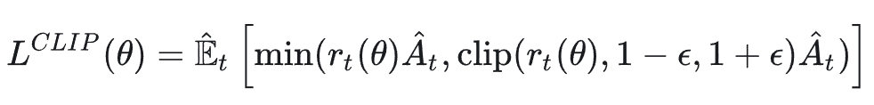
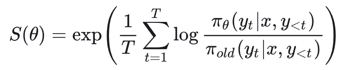
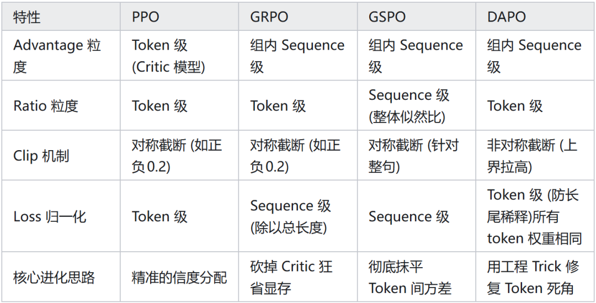

# PPO，GRPO，GSPO，DAPO再次思考

最开始学习这四个经典的 RL 算法，算是死记硬背，并没有深刻理解其中的思路，最近在和 LLM 问答过程中发现了这个这种思考的方式，遂总结下来，算是笔者自己的思考。

PPO 有四个模型，分别是 actor，critic，ref，reward，PPO 的损失函数可以写为：

这里的 A 也就是 GAE，在 PPO 中计算的方法为多步时序差分误差，由于 value model 会给每个 token 的状态给出一个 value，因此这里每个 token 都有不同的 GAE，important ratio 也是不同的。

GRPO 直接抛弃 PPO 中的 critic model，转而使用了组内平均的方式来计算 GAE。

这就引出了一个问题，就是每一个特定的 token 没有了独自的 GAE，只有一个最终的 reward 传导给每一个 token，但是 important ration 还是不同的。

因此这里的每个 token 都有相同的 GAE，important ratio 是不同的。

这种总 reward 直接分配个每个 token 的做法容易造成较大的梯度噪声，同时逐 token 的 clip 会使模型在输出长度较长的时候由于扰动的累计后面 token 的 important ratio 变大，更容易被裁剪，导致长序列的后半段学不到东西。

GSPO 针对 GRPO 做了进一步的改进，GSPO 的设计哲学是，既然 reward 是针对整个序列给的，那么触发 Clip 的 important ratio 也应该在整句话的层面上进行。

在传统的 token 级别算法中，我们想看到一整个序列的 important ratio，需要连乘概率比，在长度变长时，可能会导致长度爆炸或者归零，GSPO 引入了长度归一化的比。

在这个式子中，如果长尾 token 出现偏移（也就是后续 token 的 important ratio 变大），会被总长度给稀释掉，序列级别的比值不会有特别大的变化。

因此这里的每个 token 有相同的 GAE 并且 important ratio 也是相同的。

DAPO 也是针对 GRPO 的一种改进，其主要改进总结为以下四点：

Clip higher 在正方向提高clip ratio，让模型灵光一现的正确答案可以得到更新，保持模型的探索性和多样性，缓解“熵崩塌”

Dynamic sampling

Token-level loss 由于 sequence level 是每个句子求和除以句子长度，再和其他句子加在一起，那么本身较长的回答梯度就会被稀释，不利于长 cot 的学习。Tokenlevel loss 是对每个句子一视同仁，先直接全部加起来

Overlong Filtering & Soft Punishment 防止模型输出过长，直接被截断的话不会计算模型的损失，防止引入奖励噪声，并且设置软惩罚，阻止模型进行无意义的堆砌

如何理解 Clip higher？GRPO 由于 token level loss 以及针对每条序列长度的归一化导致“长尾崩溃”问题。

长尾崩溃的原因是新旧策略的差异随着长度的变长不断累积，最终在长尾部分崩溃，DAPO 为了减缓这一崩溃，主动提高了大于 1 的 clip ratio，防止长尾部分优秀高分推理被直接截断导致梯度为 0。

作者：源稚生，已获作者授权发布

来源：https://zhuanlan.zhihu.com/p/2010802004981732887
