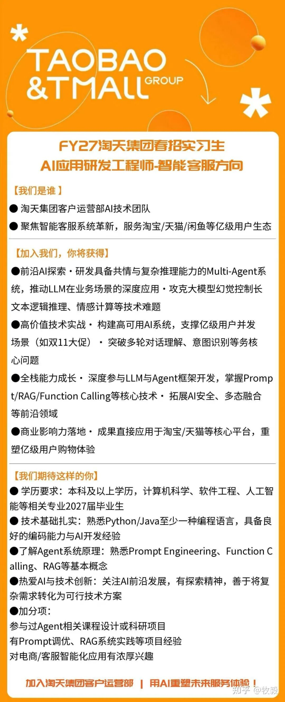

# 淘天AI岗JD拆解：27届阿里春招变了~

阿里淘天集团针对 27 届毕业生的春招实习生通道已经悄然开启。

很多同学可能还在死磕传统的八股文、刷算法题，但如果你仔细看一眼今年淘天 “AI 应用研发工程师” 的 JD，你会立刻感受到一股强烈的技术代差——传统的纯 CRUD（增删改查）或者纯算法模型微调，已经不足以打动面试官了。现在的核心战场，叫作 Multi-Agent（多智能体）系统。

下面是笔者拿到一份典型 JD：

阿里淘天客户运营部的 AI 应用研发工程师 JD

见微知著，今天我们就借着这份热乎的 JD，深度扒一扒阿里 27 届春招背后的技术风向标。

## 01 核心信号一：全面拥抱大模型应用层，Agent 成为绝对主角

看 JD 的【加分项】和【加入我们，你将获得】这两栏，出现频率最高的词是什么？

是 Multi-Agent、Prompt、RAG（检索增强生成）、Function Calling（函数调用）。

如果你对这几个词还停留在“听过”的阶段，那春招大概率是要陪跑了。

阿里目前的战略非常清晰：底层大模型（通义千问等）由核心基建团队搞定，而淘天这种离交易、离钱最近的业务部门，核心任务是“用好大模型”。

构建一个具备共情能力、复杂推理能力的 Multi-Agent 系统，是目前解决复杂业务场景的最优解。

这就要求候选人不能只是一个“调包侠”，而是要深度参与到 LLM 与 Agent 框架的开发中。

在开源社区中，类似 LangChain、LlamaIndex 等框架的热度居高不下，大厂现在需要的正是能熟练运用甚至重构这些理念，将复杂业务需求转化为可行 AI 方案的人。

## 02 核心信号二：技术栈的现实主义——Python 与 Java 的交汇，工程化是硬道理

在【技术基础】要求中，明确写了“熟悉 Python/Java 至少一种编程语言”。

在传统的后端时代，Java 在阿里是绝对的统治地位；但在 AI 时代，Python 凭借其极其丰富的 AI 生态、开源社区的支持以及在处理 LLM 交互时的便捷性，已经成为了不可或缺的核心语言。

但请注意 JD 里的这句话：“支撑亿级用户并发场景（如双 11 大促）”。

这意味着，即便你用 Python 写出了一个绝妙的 Agent 逻辑，如果它不能在 Docker 容器化部署后，扛住双 11 级别的极端高并发，那它就是个玩具。

大厂要的不仅仅是 AI 原型的开发者，更需要具备深厚系统级理解（比如对 Linux 系统性能优化、高可用架构设计有概念）的“AI + 工程化”复合型人才。

控制大模型幻觉、优化长文本逻辑推理的延迟，这些都是极具挑战的工程难题。

## 03 核心信号三：业务逻辑为王——为什么重仓“智能客服”？

很多人一听“客服”觉得低端，但在电商领域，客服是直接挂钩转化率和退款率的核心环节。

对于像阿里巴巴（BABA）这样体量的电商巨头来说，在当前的消费大环境下，利用 AI 重塑亿级用户的购物体验，是降本增效、提升核心商业竞争力的关键一招。

智能客服早已不是当年那种只会说“亲，在的呢”的智障机器人。现在的目标是：多轮对话理解、精准意图识别、甚至情感计算（安抚愤怒的消费者）。这是一场将前沿 AI 技术直接转化为巨大商业利润的硬核实战。

## 04 给 27 届同学的硬核备战建议：如何拿下顶级大厂 Offer？

立刻从“学理论”转向“造轮子”：不要只停留在看论文上。自己动手用 Python 写一个接入 LLM 的智能体。

比如，做一个能自动抓取并分析A股市场研报资料的 Agent，或者一个基于本地文档库的 RAG 问答系统。

死磕 RAG 和 Function Calling：这是目前大厂落地应用最成熟、最急需的技术组合。

你要清楚 RAG 的召回率怎么优化，Function Calling 在面对复杂多模态融合时如何保证稳定性。

拥抱开源：如果你的简历上能有一个参与过知名开源 Agent 框架（或其周边工具）贡献的经历，哪怕只是修过几个 Bug，在面试官眼里都会比你在学校实验室里跑几个水论文的模型要亮眼得多。

恶补“高可用”概念：就算你是做 AI 的，也要去了解一下当流量洪峰到来时，系统是如何做限流、降级和缓存的。将你的 AI 认知与大厂的工程基因结合起来。

## 05 总结一下

27 届的春招，是 AI 原生开发者的一场盛宴。企业不再为单纯的“AI 概念”买单，而是为“AI 能解决什么复杂业务问题”买单。

把 Prompt 调优练到极致，把 RAG 摸透，带着你的极客精神和实战项目，去拿下属于你的高薪 Offer 吧！

作者：牧毅，已获作者授权发布

来源：https://zhuanlan.zhihu.com/p/2017230158562603191
