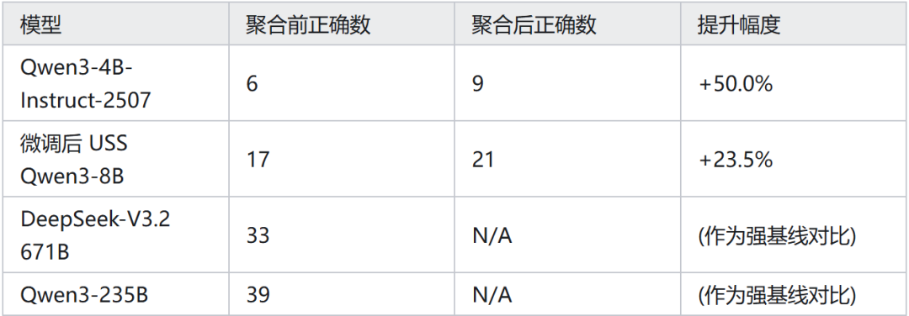

# 垂直领域Agent落地：自蒸馏与自聚合

这次更新，想和大家聊聊垂直领域 Agent 落地过程中，我最近实践过的两项技术——自蒸馏（Self-Distillation）和自聚合（Self-Aggregation）。

主要工作其实在春节前就已完成，今天不谈晦涩的公式，主要分享基于第一手工程实践的“体感”和基本结论。

## 01 结论优先

自蒸馏 vs 直接 SFT：确实能显著缓解灾难性遗忘，训练更稳。相比直接 SFT（有监督微调），常见的那种“学会唱歌忘跳舞，学会吟诗忘唱歌”的震荡问题，在自蒸馏中明显改善。

代价：非常慢！在同等数据规模下，训练时长是 SFT 的 15.2 倍。这是算力成本的直接挑战。

自聚合：这是一种“空间换智能”的策略，能在一定程度上抬升小模型推理上限，弥补其先天不足。

代价：天下没有免费的午餐。Token 消耗量和响应延迟（Latency）会增加 10 倍以上。

下面我抛砖引玉，粗略介绍这两项技术的原理与工程概要。

## 02 自蒸馏（Self-Distillation）

1. 基本思路（工程视角）

传统的知识蒸馏（Knowledge Distillation，KD）通常需要一个巨大的 Teacher 模型来教 Student 模型。

但在垂直领域，我们面临如下痛点：

私域的高价值数据，并不存在于通用的 Teacher 模型中。

在垂直领域里，“教师”并不一定存在——因为你要蒸馏的正是你自己的私域知识。

每次都带一大段背景 + 5-shot 示例很贵（2k~8k tokens 是常态），而且也影响输出格式稳定性。目前工程界的主流解法是 RAG（检索增强生成）等上下文工程（Context Engineering）。如果直接强行用通用模型蒸馏垂域知识，往往效果寥寥。

自蒸馏（Self-Distillation）提供了一种新思路，一句话概括：让“带私域示例上下文的同一个模型”当 teacher，让“不带示例的同一个模型”当 student，把 ICL 学到的行为偏置压进参数。

也可以理解为：把 Prompt/ICL 的收益“固化”成权重中的能力，用训练时间换推理成本。

2. 工程实现

具体思路非常简单：

Teacher 输入：[系统提示词 + 私域背景 + few-shot 示例 + 当前问题]

Student 输入：[系统提示词 + 当前问题]（不带私域示例）

Teacher 生成答案：作为“软标签/目标行为”

Student 学习复现 teacher 行为：训练目标从工程上更接近“让 student 收敛到 teacher 的主要模式”，实践中比直接做常规 KD 更稳定

核心改动：与传统 KD 使用前向 KL 散度不同，这里将 Loss 替换为反向 KL 散度（Reverse KL Divergence）。（“更偏 mode-seeking 的目标形式”，直观效果就是 student 更愿意贴近示例格式与规则，输出熵更低、格式更稳）

除了训练速度极慢（15.2 倍耗时），整个训练过程较为顺滑，对额外的调参黑魔法依赖相对较低。

3. 最终效果

自蒸馏后的模型：

将私域能力从“基底模型 + ICL 才能触发”

变成“基底模型（无 ICL）也能稳定表现”

在某些低熵任务上，甚至能超过原先 ICL（主要来自：格式约束更强、输出更稳定、少跑偏）

4. 适用场景选型建议

这种方法本质是“用训练时间换取推理效率”。

个人推荐的场景：

对推理速度/成本敏感：原本 ICL 需要带 2k~8k tokens 的 Examples 和背景知识，现在可以省掉，显著降低首字延迟（TTFT）和推理成本。

训练数据需快速规模化：不需要人工逐条标注，也不需要在这个垂域比它更强的 Teacher 模型。可以快速利用现有私域数据。

低熵、高确定性任务：例如要求输出严格的 JSON 格式。基底模型可能喜欢啰嗦：“好的，我来查一下…结果是 JSON”，蒸馏后能迅速对齐到“直接输出 JSON”的风格。

需保持通用能力：也就是前文提到的，防止灾难性遗忘。

不推荐的场景：

高熵（High Entropy）的发散性任务：（创意写作、风格多样诗歌、剧情脑洞等），自蒸馏会把分布“收窄”，多样性下降。

ICL 收益本身就很低的任务：如果 Few-Shot 没用，蒸馏也没用。这种可能需要大规模预训练（Pre-training）来保证数据覆盖。

离线批处理任务：如果不在乎推理速度，那就继续用 ICL/RAG，未必值得花训练成本。

知识覆盖/改写：试图用蒸馏去纠正模型原有的错误知识点（Hallucination correction），效果通常一般。

## 03 自聚合：以时间换智商

1. 核心逻辑

自聚合（Self-Aggregation）适用于私域模型参数规模有限（比如 4B/8B），但是业务问题又确实需要一定推理深度时，自聚合提供了一个很工程化的“临时补丁”。

既然模型“智商”不够，我们就用“时间”来凑：不训练模型，靠多轨迹推理 + 迭代反思聚合，提高最终答案质量。

这是一种类似 System 2（慢思考）的工程实现，本质上属于“测试时计算（test-time compute）换效果”的路线。

2. 落地流程

完全不需要重新训练模型，纯推理阶段的工程优化：

发散：针对当前问题，让模型生成多个推理轨迹（Reasoning Trajectories）。

聚合：从中随机选出几个，聚合成一个参考上下文。（直接拼接，或者先摘要再拼接）

反思：让模型自我评价选出的候选推理，进行修改，生成新的轨迹。

迭代：重复上述过程，直到结果收敛或达到最大轮数，输出最终结果。

3. 实测数据

数据集：

MathArena/hmmt_feb_2025

MathArena/hmmt_nov_2025

合计 60 道数学题。

4.代价：token 与时延上涨 10×+

自聚合的代价非常直观：

多轨迹生成：token 线性增加

多轮迭代：token 再乘迭代次数

总时延：如果没有并行/批处理优化，会非常难看

因此它更适合：

离线任务

低 QPS 但高价值问题

或者“宁可慢一点也要更稳”的关键链路（例如审核、合规、复杂决策辅助）

## 04 总结与展望

以上是我近期在垂域落地中的蜻蜓点水式总结，仅仅是抛砖引玉：

自蒸馏解决了“私域知识内化”与“遗忘”的矛盾，代价是高昂的训练时间。

自聚合解决了“小模型推理弱”的痛点，代价是高昂的推理 Token。

深挖下去，这里面还涉及很多工程权衡（Trade-off）。个人主观看法：对于垂直领域的私域模型，我对“小模型+特定工程优化”的路线越来越看好。

后面有新的尝试，再来和大家共享。欢迎大家交流共享填坑经验，一起来让垂直领域 AI 工程落地变得简单有趣！

作者：老陈

链接：https://zhuanlan.zhihu.com/p/2012174236312171669
