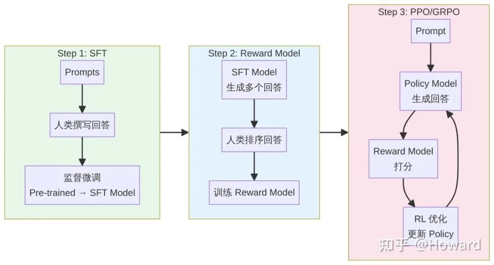
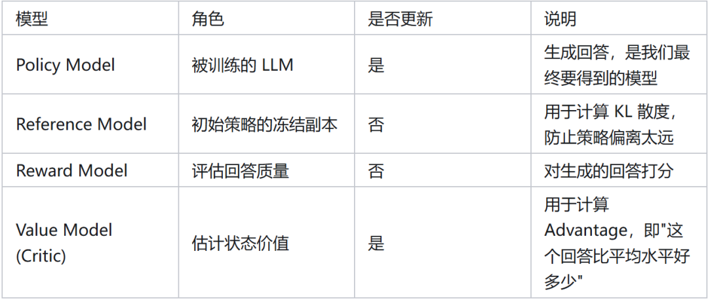
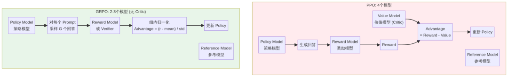
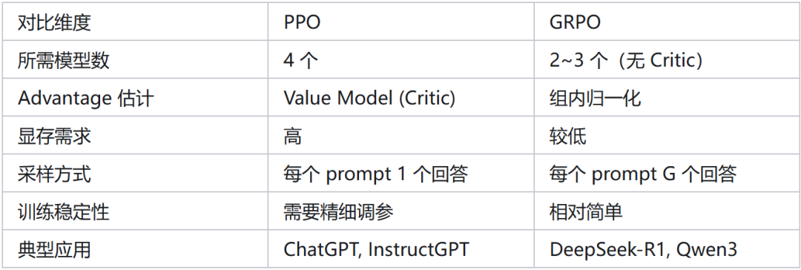
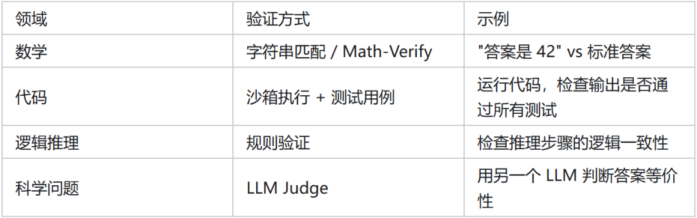
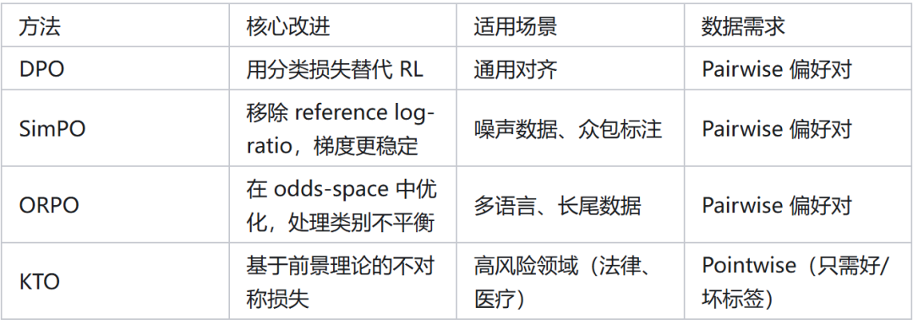
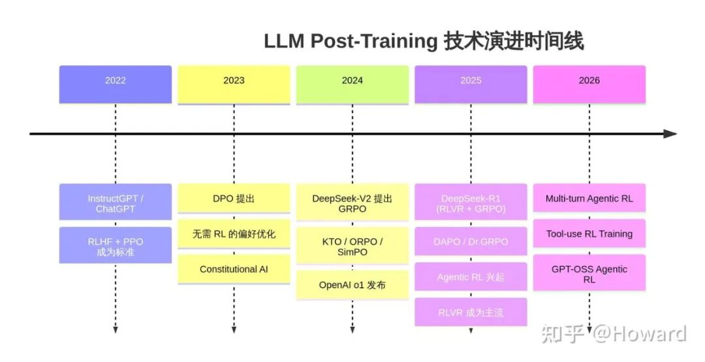

# LLM后训练全解析：RLHF→GRPO→Agentic RL

作者：Haohe，Meta FAIR 研究科学家

来源：https://zhuanlan.zhihu.com/p/2012909606771400823

## 01 引言：什么是 Post-Training？

大语言模型（LLM）的训练通常分为两个大阶段：预训练（Pre-training） 和 后训练（Post-training）。

预训练阶段通过海量无标注文本让模型学会语言的基本规律和世界知识，产出的是一个"什么都知道一点、但什么都不太好用"的基座模型。

而 Post-training 则是将这个"毛坯房"精装修成真正好用的产品的过程——让模型学会遵循指令、与人类偏好对齐、具备推理能力，甚至能使用工具完成复杂任务 。

从 2022 年 ChatGPT 横空出世至今，Post-training 技术经历了爆发式的演进。

如果用一句话概括当前的格局：SFT 教模型"说什么"，偏好优化教模型"怎么选"，而 RL 教模型"怎么想" 。

本文将以直观的方式，系统梳理这一领域的核心方法和最新进展，特别适合之前没怎么接触过 RL 的读者。

## 02 直觉建立：一个餐厅的类比

在深入技术细节之前，让我们用一个餐厅培训厨师的类比来建立直觉：

想象你开了一家餐厅，招了一个天赋异禀的厨师（Pre-trained Model）。

这个厨师读过所有的菜谱书（预训练数据），知道各种食材和烹饪技法，但从没真正为客人做过菜。

SFT（监督微调） 就像是让资深厨师手把手教他做几道招牌菜——"这道菜应该这样做"。学完之后，他能按照标准流程做出不错的菜品。

RLHF（基于人类反馈的强化学习） 则更进一步：让食客品尝他做的多道菜并排序——"这道比那道好吃"。

然后根据食客的偏好反复调整口味。这里的"食客评分系统"就是 Reward Model，而厨师根据评分不断改进的过程就是 PPO/GRPO 等 RL 算法在做的事。

DPO（直接偏好优化） 则是一种更简洁的方式：不需要单独训练一个评分系统，而是直接从"A 菜比 B 菜好"的对比数据中学习，省去了中间环节。

RLVR（基于可验证奖励的 RL） 适用于有标准答案的场景，比如做数学题——答案对就是对、错就是错，不需要人来打分。

这就像是让厨师参加烹饪比赛，评判标准完全客观（比如"蛋糕是否在 30 分钟内烤熟且内部温度达标"）。

Agentic RL 则是最新的方向：不仅要求厨师会做菜，还要会查菜谱、去市场采购、协调后厨——像一个完整的"主厨智能体"一样工作。

## 03 技术深潜：核心方法详解

3.1 SFT：监督微调——一切的起点

监督微调（Supervised Fine-Tuning）是 Post-training 最基础也最直观的方法。

其核心思路是：收集高质量的（prompt，response）数据对，然后用标准的交叉熵损失函数对预训练模型进行微调 。

SFT 的数据通常包括指令跟随数据（如 Alpaca、ShareGPT 格式的对话）、特定领域的专业数据、以及多轮对话数据。

近年来，合成数据（Synthetic Data）在 SFT 中扮演着越来越重要的角色——用更强的模型（如 GPT-4）生成训练数据来教较小的模型，这种做法被称为 知识蒸馏（Knowledge Distillation）。

SFT 的常见实现方式包括全参数微调（Full Fine-tuning）和参数高效微调（PEFT），后者以 LoRA 和 QLoRA 最为流行。

LoRA 通过在模型权重矩阵旁边添加低秩分解矩阵来实现高效训练，通常只需要训练原始参数量的 0.1%~1% 。

关键认知：SFT 教会模型"输出的格式和风格应该是什么样的"，但它本质上是在模仿，无法让模型学会超越训练数据的能力。这就是为什么我们需要 RL。

3.2 RLHF：基于人类反馈的强化学习——对齐的经典范式

RLHF 是 InstructGPT 和 ChatGPT 背后的核心技术，由 OpenAI 在 2022 年的论文中系统阐述 。

其完整流程分为三步：

Step 1：监督微调（SFT）。首先收集人类撰写的高质量回答，对预训练模型进行监督微调，得到一个初始的 SFT 模型。这一步是后续 RL 训练的前提条件。

Step 2：训练 Reward Model。对于每个 prompt，让 SFT 模型生成多个（通常 4 个）不同的回答，然后由人类标注者对这些回答进行排序。

利用这些排序数据，训练一个 Reward Model（奖励模型），使其能够对任意回答给出一个标量分数，反映该回答的质量 。

Step 3：PPO 优化。使用训练好的 Reward Model 作为奖励信号，通过 PPO 算法对 SFT 模型进行进一步优化。

在这个过程中，模型不断生成回答、获得奖励、更新策略，逐步学会生成更符合人类偏好的内容。

RLHF 的一个重要变体是 RLAIF（Reinforcement Learning from AI Feedback），其核心区别在于用 AI 模型（而非人类）来提供偏好反馈，从而大幅降低标注成本 。Anthropic 的 Constitutional AI 就是这一思路的典型代表。

3.3 PPO：RL 的主力算法

PPO（Proximal Policy Optimization）是 RLHF 中最经典的 RL 优化算法 。

要理解 PPO 在 LLM 训练中的角色，需要先明确几个概念：在 RL 的语境下，LLM 就是 策略（Policy），它根据输入的 prompt（状态）生成 token 序列（动作）。

PPO 的核心目标是：在每次更新中，让策略朝着获得更高奖励的方向改进，但又不能改变太大（通过 clipping 机制约束），以保证训练的稳定性。

PPO 在 LLM 训练中需要同时维护四个模型：

PPO 的损失函数核心是 clipped surrogate objective：

L = min(r(θ) · A, clip(r(θ), 1-ε, 1+ε) · A)

其中 r(θ) 是新旧策略的概率比，A 是 advantage（优势函数），ε 是 clip 范围（通常 0.1~0.2）。这个 clip 机制确保每次更新的幅度不会太大，是 PPO 稳定性的关键 。

PPO 的主要问题在于：需要同时加载四个模型，显存开销巨大；训练过程中需要在生成（rollout）和更新之间反复切换，工程复杂度高；超参数敏感，调参困难。

3.4 GRPO：去掉 Critic 的轻量级 RL

GRPO（Group Relative Policy Optimization）由 DeepSeek 团队在 2024 年提出 ，是当前开源推理模型训练中最流行的 RL 算法。

GRPO 的核心创新在于：用组内相对排名来替代 Value Model 估计 advantage，从而完全去掉了 Critic 模型。

GRPO 的工作流程如下：对于每个 prompt，采样 G 个（通常 8~64 个）回答，分别获得奖励分数 r₁, r₂, ..., r_G。

然后对这组奖励进行归一化：

Advantage_i = (r_i - mean(r)) / std(r)

这样，组内表现好于平均水平的回答获得正的 advantage（被鼓励），差于平均水平的获得负的 advantage（被抑制）。

这种方式不需要单独训练一个 Value Model，大幅降低了资源需求。

3.5 RLVR：可验证奖励——推理模型的关键

RLVR（Reinforcement Learning with Verifiable Rewards）是 2025 年最重要的技术趋势之一。

与 RLHF 使用学习得到的 Reward Model 不同，RLVR 使用 基于规则的确定性验证器 来提供奖励信号。

RLVR 的适用场景是那些答案可以被客观验证的领域：

RLVR 的奖励设计通常包含两部分：准确性奖励（答案是否正确）和格式奖励（输出是否符合要求的格式，如 <think>...</think><answer>...</answer>）。DeepSeek-R1 就是使用 GRPO + RLVR 训练的典型代表。

关键认知：RLVR 之所以重要，是因为它解决了 RLHF 中 Reward Model 的两大痛点——reward hacking（模型学会欺骗 Reward Model 而非真正变好）和标注成本高。在可验证领域，规则就是最好的奖励函数。

3.6 DPO 及其变体：不需要 RL 的偏好优化

DPO（Direct Preference Optimization）在 2023 年横空出世，提供了一种完全不同的思路：直接从偏好数据中优化策略，不需要训练 Reward Model，也不需要 RL 训练循环 。

DPO 的核心洞察是：RLHF 的最优解可以被重新参数化为一个简单的分类损失函数。

给定一对 (preferred response, rejected response)，DPO 直接最大化 preferred response 的对数概率相对于 rejected response 的优势，同时通过 reference model 进行正则化。

然而，随着实践的深入，DPO 暴露出一些局限性，催生了一系列变体：

值得注意的是，DPO 系列方法属于 offline 方法——它们使用预先收集的静态数据进行训练，不需要在训练过程中让模型生成新的回答。

这使得它们比 PPO/GRPO 等 online RL 方法更简单、更稳定，但也意味着它们无法从模型自身的探索中学习，在提升推理能力方面不如 online RL 方法有效。

3.7 DeepSeek-R1：纯 RL 训练推理模型的里程碑

DeepSeek-R1 是 2025 年初最具影响力的工作之一，它首次证明了 纯 RL 训练（不需要 SFT）就能让模型涌现出强大的推理能力。

DeepSeek-R1 的训练分为两条路线：

R1-Zero（纯 RL 路线）：直接在预训练的 DeepSeek-V3 基座模型上，使用 GRPO + RLVR 进行训练，完全跳过 SFT 阶段。

令人惊讶的是，模型在训练过程中自发涌现出了复杂的推理行为——包括自我反思（"Wait, let me reconsider..."）、问题分解、多路径探索等。

这些行为并非被显式编程，而是 RL 训练过程中自然产生的，被称为 "Aha moment"。

R1（完整路线）：在 R1-Zero 的基础上，加入了 SFT 数据进行冷启动（cold start），然后再进行 RL 训练。

这种方式产出的模型在格式规范性和可读性上优于 R1-Zero，同时保持了强大的推理能力。

DeepSeek-R1 的训练过程中还有一个重要发现：随着 RL 训练的推进，模型生成的回答长度会自然增长——模型学会了"多想一会儿"来解决更难的问题。这本质上是 inference-time scaling 的训练端体现。

3.8 GRPO 的改进：DAPO、Dr.GRPO 和工程技巧

原始的 GRPO 在大规模训练中存在一些微妙的问题，催生了一系列改进工作：

Entropy Collapse（熵坍塌） 是最严重的问题：随着训练推进，策略的熵快速下降，模型对同一个 prompt 采样出的 G 个回答变得几乎完全相同，失去了探索能力。这在 RL 中是经典的 exploration vs. exploitation 困境。

DAPO（Decoupled Alignment Policy Optimization） 针对这些问题提出了四个关键改进 ：

第一，Clip-Higher：对正 advantage 的回答放宽 clipping 上界（从 1+ε 提高到 1+ε'，其中 ε' > ε），鼓励模型更大胆地探索好的方向，同时保持对坏方向的严格约束。

第二，Dynamic Sampling：过滤掉那些 G 个回答全对或全错的 prompt。全对意味着这个问题太简单、没有学习价值；全错意味着太难、当前学不会。只保留有区分度的 prompt 进行训练。

第三，Overlong Filtering：对超过最大长度限制的回答，不给予惩罚（设 reward 为 0），而不是像原始 GRPO 那样给负奖励。这避免了模型学会"为了不被惩罚而生成短回答"的不良行为。

第四，Token-level Loss：按 token 而非 sequence 计算损失，避免长序列在梯度中被过度加权。

Dr.GRPO 则发现了 GRPO 中 length normalization 引入的 length bias 问题，并通过移除这一归一化来修复。

## 04 全局视角：技术如何协同工作

理解了各个组件之后，让我们看看它们如何在一个完整的 Post-training pipeline 中协同工作。

以当前主流的推理模型训练流程为例：

阶段一：SFT 冷启动。使用高质量的指令跟随数据和推理数据（包含 chain-of-thought）对基座模型进行监督微调。这一步的目标是让模型学会基本的输出格式和推理模式。

阶段二：RL 推理训练（RLVR）。在数学、代码等可验证领域，使用 GRPO（或其改进版本 DAPO）进行大规模 RL 训练。这一步是推理能力提升的核心。

阶段三：偏好对齐。使用 DPO 或 RLHF 对模型进行最终的偏好对齐，确保模型的输出风格、安全性和有用性符合要求。

阶段四：拒绝采样 + 蒸馏（可选）。用训练好的大模型生成高质量的推理数据，蒸馏到更小的模型中。DeepSeek-R1 就是通过这种方式将推理能力蒸馏到 1.5B~70B 的小模型中。

## 05 前沿方向：2025-2026 年的新趋势

5.1 Agentic RL：从"回答问题"到"完成任务"

传统的 RLHF/RLVR 训练的是单轮问答能力，而 Agentic RL 则训练模型在多步骤任务中交替进行推理和工具调用。

例如，Search-R1 训练模型学会"什么时候该搜索、搜索什么、如何利用搜索结果"；ReTool 训练模型学会在推理过程中调用计算器、代码解释器等工具。

Agentic RL 面临的核心挑战包括：多轮交互中的 credit assignment（哪一步决策导致了最终的成功或失败）、稀疏奖励（只有任务完成时才有反馈）、以及推理与工具使用之间的 资源竞争。

5.2 Reward Model 的演进

Reward Model 正在从简单的标量打分模型演进为更复杂的形式：

Process Reward Model（PRM）对推理的每一步进行评分，而非只看最终答案；

Generative Reward Model 用 LLM 本身作为 judge 来评估回答质量；

Multi-objective Reward 同时优化多个维度（准确性、安全性、简洁性等）。

5.3 Synthetic Data 的角色

合成数据在 Post-training 中的重要性持续上升。当前的最佳实践是：用强模型生成大量候选回答，通过 verifier 筛选出正确的，再用这些数据进行 SFT 或作为 RL 的 warm-up。这种 "生成-验证-训练" 的循环正在成为标准范式。

## 06 总结与关键要点

LLM Post-training 是一个快速演进的领域，但其核心逻辑可以归纳为以下几点：

第一，SFT 是基础但不够。SFT 教会模型输出的格式和风格，但无法让模型学会超越训练数据的推理能力。对于对齐和推理，我们需要更强大的训练信号。

第二，RL 是提升推理能力的关键。从 PPO 到 GRPO，RL 算法在不断简化和高效化。

GRPO 去掉了 Critic 模型，DAPO 进一步解决了熵坍塌等工程问题。DeepSeek-R1 证明了纯 RL 就能涌现推理能力。

第三，奖励信号的设计至关重要。从 RLHF（人类反馈）到 RLAIF（AI 反馈）再到 RLVR（可验证奖励），奖励信号的获取方式在不断演进。

RLVR 在可验证领域（数学、代码）表现出色，但如何将其扩展到开放域任务仍是开放问题。

第四，Online RL vs. Offline Preference Optimization 各有所长。DPO 等 offline 方法简单稳定，适合偏好对齐；PPO/GRPO 等 online 方法能从探索中学习，更适合提升推理能力。实践中通常两者结合使用。

第五，Agentic RL 是下一个前沿。从单轮问答到多轮工具使用，Post-training 正在向训练完整的"智能体"方向发展。

7. 参考文献：

[1] Tie, G. et al. "A Survey on Post-training of Large Language Models." arXiv:2503.06072, 2025.

[2] Fahey, J. "DPO Isn't Enough: The Modern Post-Training Stack." Medium, Oct 2025.

[3] "A Deep Dive Into the Role of Synthetic Data in Post-Training." ICML 2025.

[4] Ouyang, L. et al. "Training language models to follow instructions with human feedback." NeurIPS 2022.

[5] Lee, H. et al. "RLAIF: Scaling Reinforcement Learning from Human Feedback with AI Feedback." arXiv:2309.00267, 2023.

[6] Schulman, J. et al. "Proximal Policy Optimization Algorithms." arXiv:1707.06347, 2017.

[7] Raschka, S. "The State of Reinforcement Learning for LLM Reasoning." Ahead of AI, Apr 2025.

[8] Shao, Z. et al. "DeepSeekMath: Pushing the Limits of Mathematical Reasoning in Open Language Models." arXiv:2402.03300, 2024.

[9] "Reinforcement Learning with Verified Rewards (RLVR )." Emergent Mind, 2025.

[10] Guo, D. et al. "DeepSeek-R1: Incentivizing Reasoning Capability in LLMs via Reinforcement Learning." arXiv:2501.12948, 2025.

[11] Rafailov, R. et al. "Direct Preference Optimization: Your Language Model is Secretly a Reward Model." NeurIPS 2023.

[12] Yu, Q. et al. "DAPO: An Open-Source LLM Reinforcement Learning System at Scale." arXiv:2503.14476, 2025.

[13] Wolfe, C. "GRPO++: Tricks for Making RL Actually Work." Deep (Learning ) Focus, Jan 2026.

[14] "Reasoning and Tool-use Compete in Agentic RL." arXiv:2602.00994, 2026.

[15] "Unlocking Agentic RL Training for GPT-OSS." Hugging Face Blog, Jan 2026.
