# AI Infra面试常考：FlashAttention系列

最近面试又被拷打了一下，才发现之前对于 FlashAttention 学习的太浅，这篇文章重点来讲一下这几个问题：

FlashAttention 算法的核心思想是什么？

FlashAttention 切分的是什么维度？怎样切分能更好的利用 SM？

在 prefill 阶段和 decode 阶段有什么不同的优化点？

个人理解学习 FlashAttention 要先从 online softmax 入手，理解了公式的推导过程之后，再结合代码，看看共享内存和全局内存实际储存了哪些矩阵，外循环和内循环的区别，计算 N*d 的 Q、K、V 矩阵一共需要循环几次。

之后再看看 FlashAttention-2 提出了哪些提升。本文不涉及 3、4 的改进。

## 01 FlashAttention-1 算法

标准的缩放点积注意力（Scaled Dot-Product Attention）公式如下：

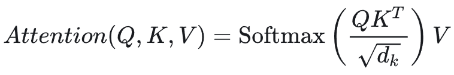

在硬件执行层面，这个公式通常被分解为以下步骤：

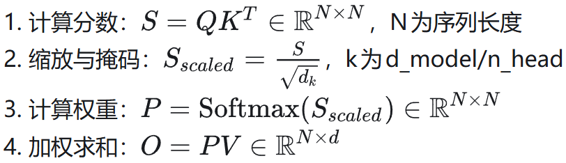

在标准实现中，S 和 P的矩阵大小是 N× N。当序列长度 N = 64k 时，这个中间矩阵会占用巨大的显存，且频繁地在 GPU 高速显存（HBM）和计算单元（SRAM）之间来回读写，导致计算单元大部分时间在等待数据传输。

Flash Attention 并不改变公式的数学结果，而是改变了计算过程。它主要通过两个手段：

Tiling（分块）：将大矩阵拆分成小块，使其能放入 SRAM（极快但空间小的片上缓存）。

算子融合（Kernel Fusion）：在一个 GPU Kernel 中完成所有计算，不再写回中间矩阵 S 和 P。

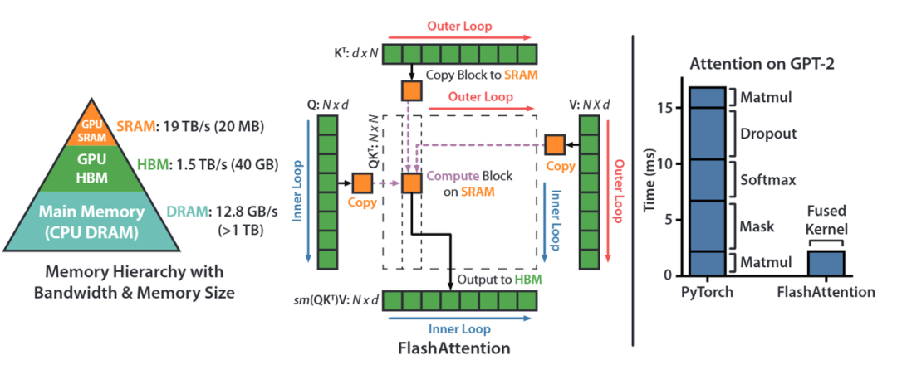

FlashAttention 是一种重新排序注意力计算并利用分块和重新计算来显著加速并减少内存使用（从序列长度的二次方降至线性）的算法。

我们使用分块将输入块从 HBM（GPU 内存）加载到 SRAM（快速缓存），对该块执行注意力计算，并更新 HBM 中的输出。

通过不将大型中间注意力矩阵写入 HBM，我们减少了内存读写量，从而使实际时间加快 2-4 倍。

此处展示了 FlashAttention 正向传播的示意图：通过分块和 softmax 重缩放，我们以块为单位进行操作，避免从 HBM 读取/写入，同时获得正确的输出而没有近似值。

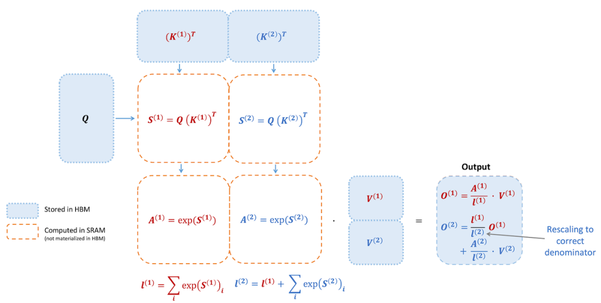

实现分块计算最大的难点在于Softmax，因为要计算序列中任意一个位置的 Softmax 值，你必须先知道整个序列中的最大值和所有数值的指数和。

（1）online softmax

Native softmax：

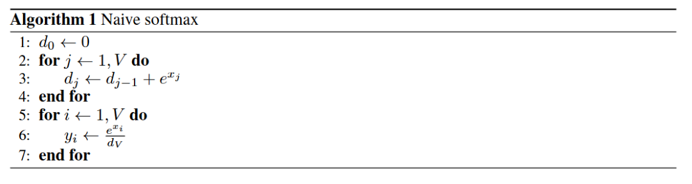

由于在实际的计算中，指数计算exp存在不稳定性，比如数值容易溢出，超过一定范围计算精度会下降等问题

Safe softmax：

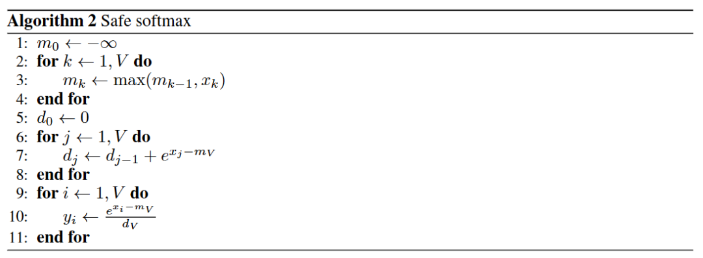

计算时每个数减去数组中的最大值，与Naive版本相比，不会出现数值溢出，但是多了一次寻找最大值的遍历。一共需要三次遍历。

Online softmax

Online Softmax 提出了一种增量更新的策略。具体实现策略如下：

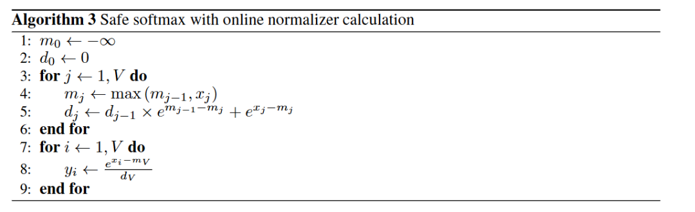

使得我们可以在不知道全局最大值的情况下，开始计算和存储中间结果。

允许将巨大的 Attention 矩阵切分成小块放入 SRAM（共享内存）中计算，这是FlashAttention能够减少显存访问（HBM Access）并提升速度的数学基础。

（2）算法流程

FlashAttention-1其实是按照 batch 和 Heads 维度做并行的，每个 block 计算一个 [N,head_dim] 的 Q、K、V 矩阵的 attention 计算结果。

由下图可以清晰的看到计算过程中每个分块的大小：

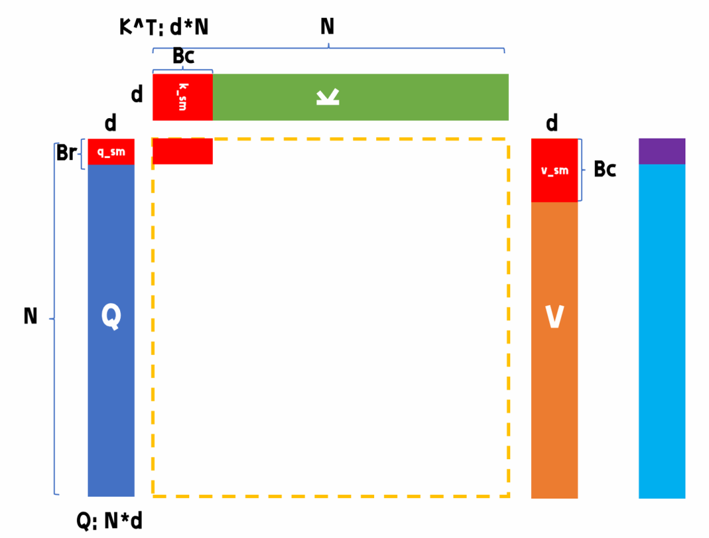

图片来源：B 站@比飞鸟贵重的多_HKL

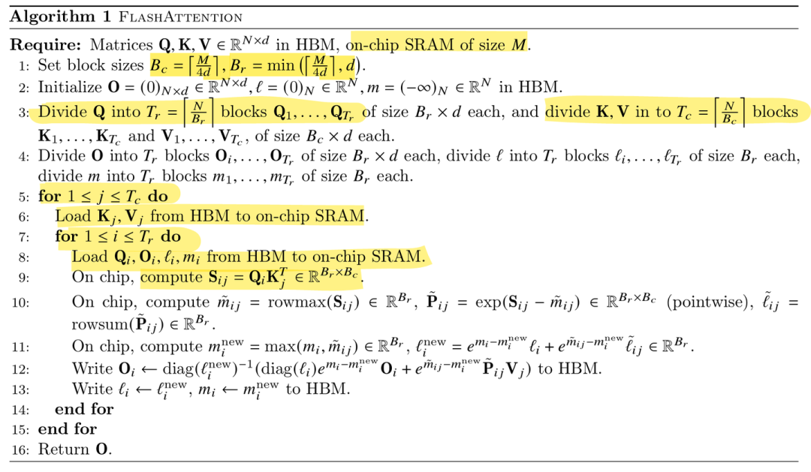

关键变量定义：

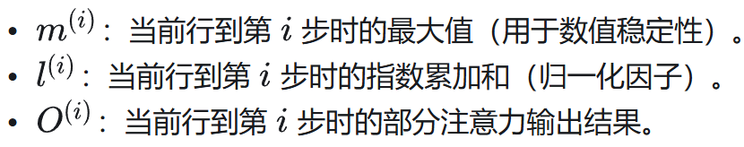

这三个变量与 online softmax 有关，储存在全局内存中：

tile_size = Bc * d：每个分块（Qi、Kj、Vj、 S）占用的共享内存大小

其中 S 是得分矩阵，由于要继续和V进行运算，所以存储在共享内存中，减少读写次数

Bc 和 Br 的值根据共享内存大小确定，保证 tile_size*4 < M

Q 矩阵块 [Br, d]，所以一共要循环 Tr = N/Br 次

K,V 矩阵块 [Bc, d]，所以一共要循环 Tr = N/Bc 次

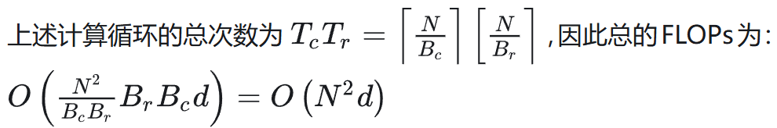

## 02 FlashAttention-2

相比于 FA1，FA2 的改进主要集中在并行维度、算法开销和任务划分这三大块：

（1）减少非矩阵乘法（Non-matmul）开销

GPU 最擅长做矩阵乘法（Matmul），而做指数运算、缩放等操作相对较慢。

公式优化：FA2 改进了在线 Softmax（Online Softmax）的计算逻辑。

在 FA1 中，每一步循环都要对输出 O 进行重缩放。FA2 则通过数学技巧，将部分缩放操作移到了循环结束处，减少了大量不必要的计算。

1、去掉了什么缩放？

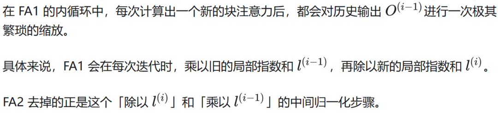

2、为什么能去掉？

这得益于 FA2 改变了循环的嵌套顺序：

FA1 的循环顺序：外循环是 K，V，内循环是 Q，O。因为 O 在内循环中会被不断换入换出显存（HBM），为了保证写入 HBM 的数据不会因为数值过大而溢出，且符合标准的 Attention 定义，FA1 选择每次都把 O 算成已经归一化的最终形态写回 HBM。

FA2 的循环顺序：外循环是 Q，O，内循环是 K，V。在这个设计下，当前处理的 Q 块和它的输出结果 O 会一直停留在超快的 SRAM 和寄存器中，直到遍历完所有的 K，V 才写回显存。

结论：既然中间结果不需要写回显存，我们完全可以在寄存器里维护一个未归一化（Unnormalized）的中间累加值，等所有循环跑完，最后再做一次除法进行归一化即可。

3、数学推导

为了防止指数爆炸，我们维护两个全局变量（也就是之前代码里的 m 和 l）：

全局最大值更新：

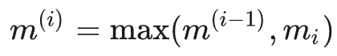

全局分母（指数和）更新：

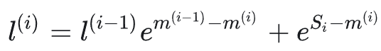

FlashAttention-1 的更新公式（繁琐缩放）：

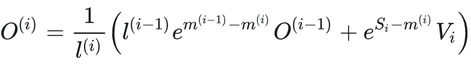

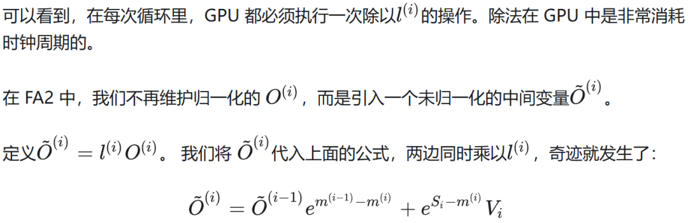

推导结果：

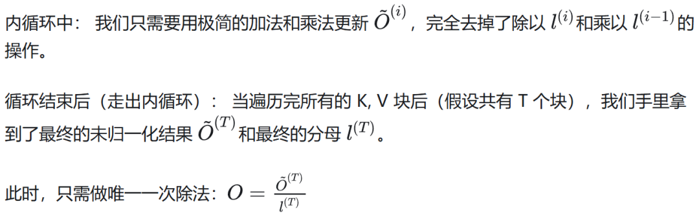

（2）算法流程

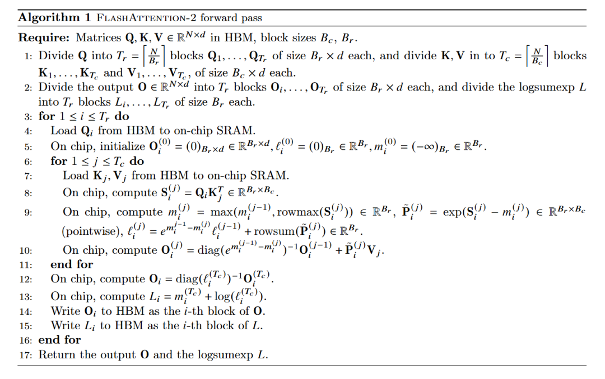

（3）更强的并行化

FA1 的局限：主要在 Batch（批次）和 Heads（头数）维度上并行。如果 Batch 很小或者 Head 很少（比如在处理超长文本时），GPU 的成千上万个核心就会“闲死”。

FA2 的改进：在 Batch (B)、Head (H) 的基础上，新增了 序列维度 (N) 的并行。

即使只有 1 个 Head，FA2 也能把长序列拆成多个块，分给不同的 GPU 流处理器（SM）去跑，大幅提高了 GPU 的“满载率”。

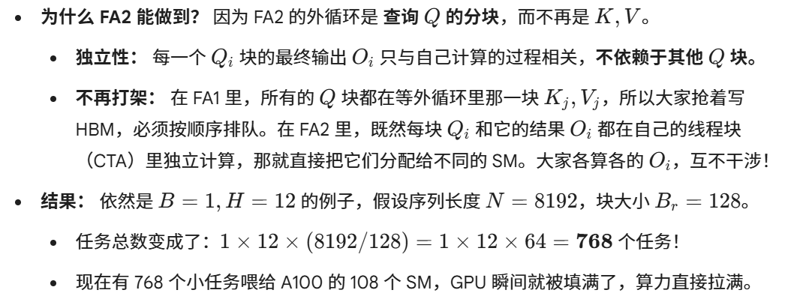

（4）优化 Warp 级任务划分

在 GPU 内部，32 个线程组成一个 Warp。FA2 重新设计了 Warp 之间的分工，减少了它们通过共享显存（Shared Memory）交换数据的次数，从而降低了通信延迟。

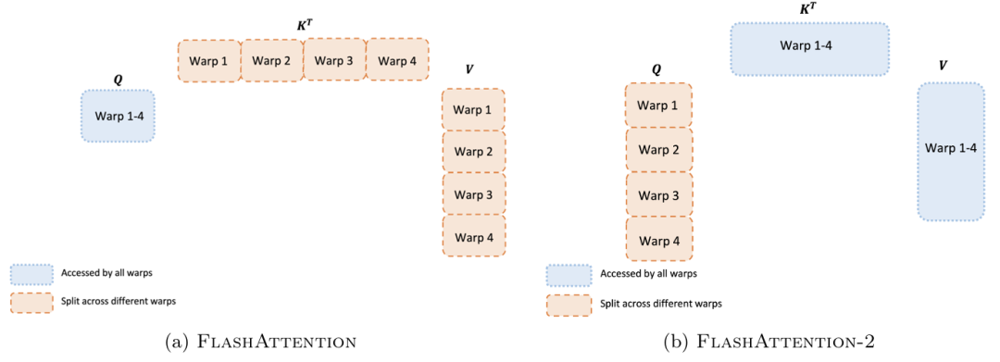

## 03 Flash-Decoding

参考文章：FlashAttenion-V3: Flash Decoding 详解

https://zhuanlan.zhihu.com/p/661478232

上面提到 FlashAttention 对 batch size 和 query length 进行了并行化加速，Flash-Decoding 在此基础上增加了一个新的并行化维度：keys/values 的序列长度。

即使 batch size 很小，但只要上下文足够长，它就可以充分利用 GPU。

与 FlashAttention 类似，Flash-Decoding 几乎不用额外存储大量数据到全局内存中，从而减少了内存开销。

在训练（Prefill）阶段，Q 是一个长矩阵，我们可以像上一节说的那样在 Q 的序列维度上并行。

但在 Decoding（生成） 阶段，每次只输入 1 个 Token，这意味着 Q 的长度 N_q = 1。

在 FA2 中，并行度主要来自 Batch * Heads * (Nq / Br)。由于 N_q = 1，分块数变成了 1，导致并行任务数骤降。

当 KV Cache 非常长（比如 128K）时，GPU 绝大部分时间都在从显存里搬运那巨大的 K，V 矩阵，而计算逻辑却只能在一个 SM 上跑。

Flash-Decoding 的核心优化：KV 维度并行化 Flash-Decoding 引入了“分而治之”的思想，将 KV Cache 沿序列长度方向切开，强行增加并行度。

它的三步走流程：

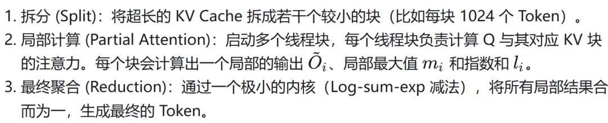

第一步：寻找全局最大值（Global Max）

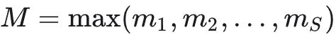

第二步：统一量纲（Rescaling）

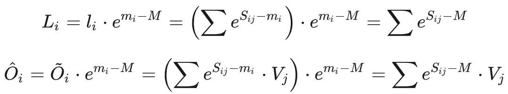

第三步：全局求和与归一化

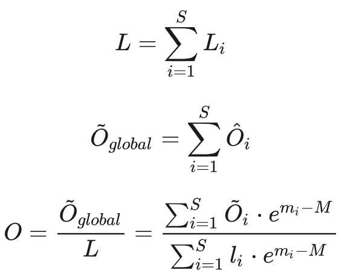

针对 Decode 阶段的好处：

速度极大提升：在长文本推理下，Flash-Decoding 比 FA2 快了 8-10 倍。

突破显存带宽瓶颈：通过增加并行度，让更多的 SM 参与搬运和计算，更接近 GPU 的理论带宽极限。

作者：砂川同学，已获作者授权发布

来源：https://zhuanlan.zhihu.com/p/2015196808893192187
