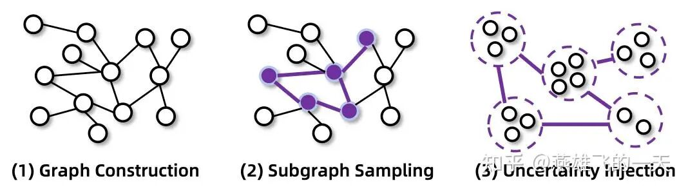
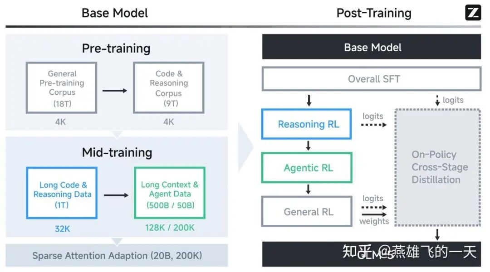
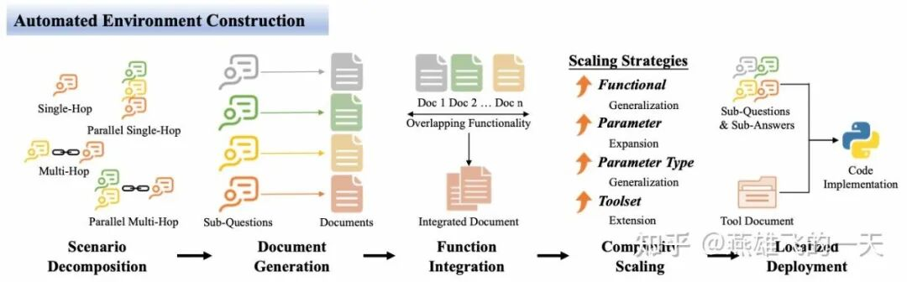
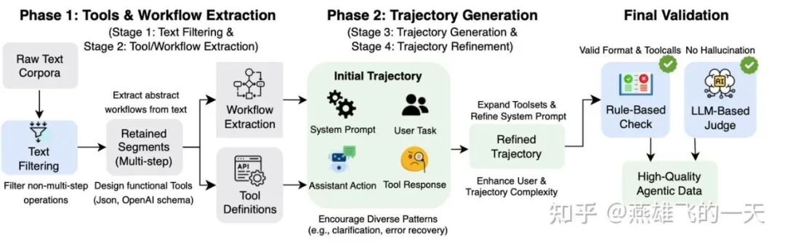

# 总结Agentic训练的最近几篇工作

从 2025 年底至今，汇总了四篇较为有影响力的 agentic 训练的工作，分别是阿里的 tongyi deepreaserch、智谱的 glm-5、美团的 GEM、字节的 ABE 四篇。

其中 tongyi 和 glm-5 较为简略的介绍 agentic 整体训练链路，并认为 agentic 训练的关键在于合成数据的质量和训练环境的稳定性。

因此进一步地，字节的 ABE 专门解决训练环境的自动化构建，美团的 GEM 专门解决 agentic 级别的数据自动合成链路。

TL;DR：

agentic 训练的关键在于合成数据的质量和训练环境的稳定性

mid-training 对于 agentic 模型效果提升至关重要，由于 agentic 数据分布（long-horizon）和常见的 task 不一致

环境的不稳定和高成本，可通过构造仿真的 python 代码和工具集极大缓解

agentic 数据的复杂度至关重要，一般在初始合成后进一步 refine 增加轨迹的复杂度

[1]Team, Tongyi DeepResearch, et al. "Tongyi deepresearch technical report." arXiv preprint arXiv:2510.24701 (2025).

[2]Zeng, Aohan, et al. "GLM-5: from Vibe Coding to Agentic Engineering." arXiv preprint arXiv:2602.15763 (2026).

[3]Xu, Zhihao, et al. "Unlocking Implicit Experience: Synthesizing Tool-Use Trajectories from Text." arXiv preprint arXiv:2601.10355 (2026).

[4]Ye, Junjie, et al. "Feedback-Driven Tool-Use Improvements in Large Language Models via Automated Build Environments." arXiv preprint arXiv:2508.08791 (2025).

## 01 Basic

首先，我们快速回顾一下 Agentic 重要的基础框架：ReAct，在每个时间步有以下三个组件：

Thought：agent 的内部认知过程。包括分析当前 context、从记忆中检索信息、规划后续步骤、以及通过自我反思来调整其策略。

Action：agent 为了与环境交互而执行的外部操作。动作空间通常需要配备一系列多功能工具，使其能够与广泛的信息源进行交互（例如 Search、Visit、Python Interpreter、Google Scholar、File Parser）。

Action 包括所有中间工具调用以及最终回复。在 trajectory 中，中间 Action 表现为工具调用，而最终 Action 则是向用户提供的最终回复。

Observation：执行 Action 后从环境中接受到的反馈。这些信息被用于更新 agent 的内部状态，并未下一步 Thought 提供依据。

Yao, S., “ReAct: Synergizing Reasoning and Acting in Language Models”, <i>arXiv e-prints</i>, Art. no. arXiv:2210.03629, 2022. doi:10.48550/arXiv.2210.03629.

## 02 Tongyi DeepResearch

2025 年 11 月，通义团队推出专为 long-horizon、deep information-seeking research 任务的 agentic 大模型。

1、提出 mid-training 训练阶段对于 agentic 能力的重要性，通过 mid-training 培养模型内在的 agentic 偏好，再通过 multi-turn-rl 释放潜力。

2、设计自动且高扩展的数据合成 pipeline，涵盖 mid-training 和 post-training 两个阶段。

上图是 post-training 阶段的 agentic 数据合成 pipline：

Graph Construction：通过 Random Walks 获取 Web 中真实世界的知识，构建一个高度互联的知识图谱

Subgraph Sampling：从构建的知识图谱中，抽取 Subgraph，生成初步的 QA pairs

Uncertainty Injection：引入“原子操作”，例如合并具有相似属性的实体，增加 Q 的不确定性，提高任务难度；并基于集合论对信息搜索问题进行形式化建模，减少推理过程中的 shortcut 和结构荣誉

3、构建支持跨阶段的定制化环境，涵盖 prior world models、simulated environments 和 real-world interactive contexs，将环境建模为三种形式，应用在不同训练阶段。

Prior World Environment：该环境提供任务要素、工具和状态定义，允许 agent 基于预训练知识自主挖掘交互轨迹，而无需接受实际的环境响应。

具有极佳的稳定性、0 交互成本和无限的可扩展性，但缺乏真实世界的反馈信号。

Simulated Environment：该环境在本地构建可控、可复现的真实世界交互副本。

提供了稳定性、快速响应和低成本，能够实现快速迭代和因果归因分析。然而，其数据覆盖范围固有地受限，表现出明显的“sim-to-real gap”。

Real-world Environment：该环境提供最真实的数据分布和反馈信号，是检验智能体能力的终极试金石。

其优势在于绝对的数据分布中保真度；而代价则是昂贵的交互成本以及探索过程中的风险。

## 03 GLM-5

2026 年 2 月，智谱团队开源新一代旗舰模型 GLM-5，尤其 agentic 能力提升显著，我们单独提出和 agentic 更相关的内容。

1、mid-training：与 tongyi deepresearch 一样，同样提出在 mid-training 阶段混入 long context & agent data 的重要性。

2、SFT：支持以下三种不同的思维格式。

Interleaved Thinking：模型在每一次回复和工具调用之前都会进行思考，从而提升指令遵循能力和生成质量。

Preserved Thinking：在 coding 场景下，模型会自动跨多轮对话保留所有 thinking blocks，复用现有的推理过程而非从头推导，这减少了信息丢失和不一致性、非常适合 long-horizon、complex 任务。

Turn-level Thinking：模型支持在同一会话中对推理进行逐轮控制——对于轻量级请求可以禁用思维模式以降低延迟和成本，对于复杂任务则开启该模式以提高准确性和稳定性。

3、Agentic RL：应用了一系列 RL 训练稳定性的优化技术，基本都是比较常见的，比如异步的 RL 框架、分词的稳定性、重要性采样等。

## 04 ABE

2025 年 9 月，复旦和 seed 团队提出一种 Automated Build Environments（ABE），极大降低与环境交互成本，提升 RL 稳定性。

1、automated environment construction：自动化环境构建 pipeline，确保了 tool-use 训练的可扩展性、稳定性和可验证性。

Scenario Decomposition：为了确保训练环境的多样性，考虑子问题之间不同的逻辑关系，定义四种工具使用场景：single-hop（仅包含一个子问题）、parallel single-hop（被拆分为多个相互独立的子问题，可以并行解决）、multi-hop（被拆分一系列有依赖关系的子问题，每个后续问题的解决都依赖前一个问题的答案）、parallel multi-hop（同时包含独立和相互依赖的子问题）。

Document Generation：为每个子问题生成对应的工具文档来确保可解性，每个 document 都包含一个专门为解决该子问题而设计的函数和参数集，从而在子问题与工具接口之间建立精确的一一映射关系。

Function Integration：为每个子问题生成独立工具有助于全覆盖，但往往导致工具集的冗余，为了减少重复，分析并合并了功能重叠的 document。

整合后的工具集具有更好的模块化特性和更高的效率，同时保持了与原始任务的逻辑一致性。

Complexity Scaling：通过 4 个关键策略增强工具的复杂度：functional generalization（功能泛化）、parameter expansion（参数扩展）、parameter type generalization（参数类型泛化）、toolset extension（工具集补充）。

Localized Deployment：将工具文档映射的 python 函数部署到本地。相关的子问题和答案被用作先验条件，以确保函数在接收有效参数时返回正确输出，并在接收错误输入时产生适当的错误消息。

2、verifiable reward mechanism：可验证的奖励机制，能够综合评估生成结构的 precision 和 completeness。

## 05 GEM

2026 年 1 月，人大和美团提出一种从 text 自动合成 tool-use 的数据合成链路 GEM，极大缓解 agentic 数据构造难度。

stage 1：text filtering：为了确保生成的 trajectories 具有高质量和真实性，初始阶段会过滤没有 multi-step operations 的原始文本。

stage 2：workflow&tool extraction：首先，从原始文本识别所有 workflow 并列举其中的具体步骤（例如先搜索），并鼓励去识别 workflow 的复杂性，包括顺序依赖、条件逻辑和唯一性约束，从而增强输出内容的丰富性和实际应用关联；然后，按照 openai schema 标准设计一套工具集合。

stage 3：trajectory generation：直接基于 stage 2 返回的原始文本、workflow 和 tool，利用强大的模型直接单次生成初始轨迹，每条 trajectory 包括：系统提示词、用户任务、助手回复、工具响应。

stage 4：refinement：通过增加所有工具的多样性、提升环境响应的真实感、增加用户请求的歧义和复杂性，提升 trajectories 的复杂性。

作者：燕雄飞的一天，已获作者授权发布

来源：https://zhuanlan.zhihu.com/p/2010761900250646173
