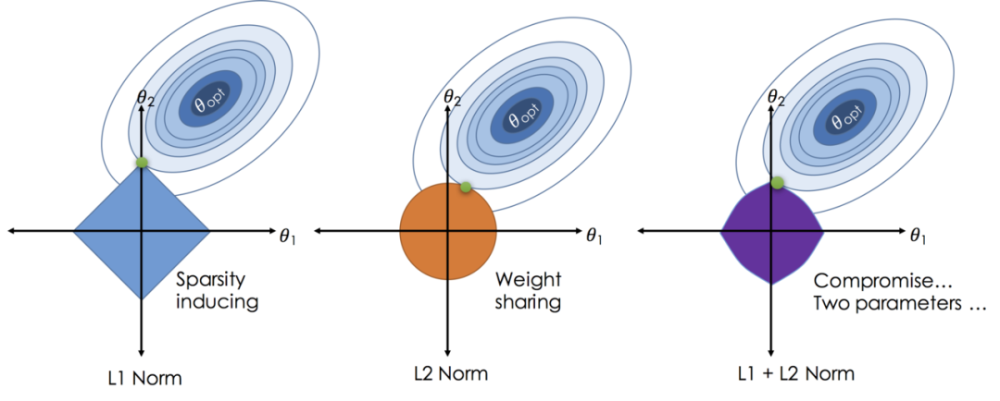
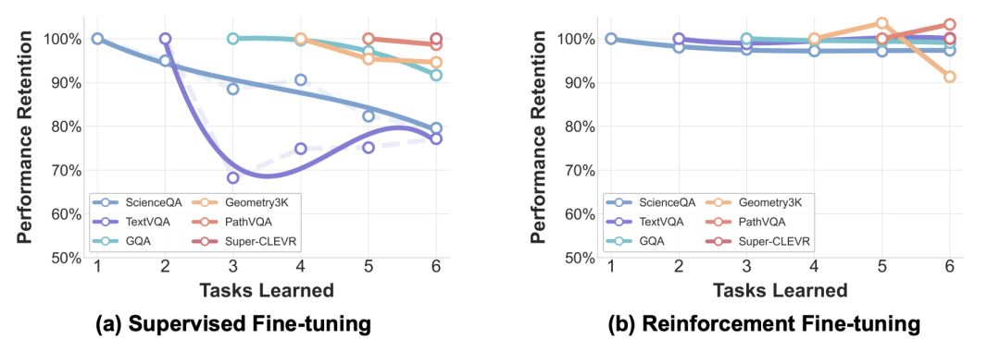
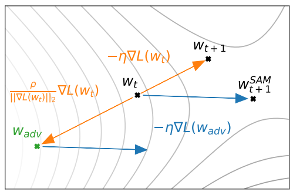

# SFT学完就忘，真的麻了~

LLM 后训练如何高效注入新知识并抑制灾难性遗忘？这道题是我最近在辅导学员时遇到的高频题，已经连续三个学员在不同公司的面试中被问到了。

很多同学第一反应是答 LoRA、数据混合，但面试官往往会追问“为什么 RL 比 SFT 更抗遗忘”，“怎么量化评估遗忘程度”，这时候就容易答得不够深入。

这道题的难点在于，它不是单纯考某个技术点，而是考你对 LLM 后训练全链路的系统性理解，以及对灾难性遗忘这个核心矛盾的解决思路。今天我们就来系统拆解一下这道题该怎么答。

## 01 先理解问题本质

我们来看一下，这道题实际上包含两个关键点。第一个是"高效注入新知识"，第二个是"抑制灾难性遗忘"。

这两个目标其实是相互矛盾的——你想让模型快速学会新东西，就得大幅度更新参数；但参数更新太激进，模型就容易把之前学的东西忘掉。所以这道题的核心，就是在问你如何在这两个目标之间找到平衡点。

灾难性遗忘是什么？简单说就是模型在学习新任务时，之前掌握的能力会快速退化。

比如你在医疗领域数据上微调一个通用大模型，结果发现它的代码能力、数学推理能力都明显下降了，这就是典型的灾难性遗忘。

根据 2025 年的研究数据，小模型在领域微调中遗忘率能达到 35-45%，这个问题相当严重。

那为什么会遗忘呢？从机制上看，主要有三个原因：

第一是参数干扰，Transformer 的参数是高度共享的，新任务的梯度更新会直接覆盖旧任务学到的权重配置。

第二是数据分布偏移，微调数据和预训练数据的分布差异越大，遗忘越严重。

第三是优化目标冲突，SFT 用的是负对数似然损失，这是个 mode-covering 目标，模型必须给数据集里的每个样本都分配足够概率，否则损失会指数级上升，这就导致参数更新特别激进。

## 02 核心解决方案框架

好，接下来我们进入正题，看看业界主流的解决方案。我把它们归纳成四大类，你在回答的时候可以按这个框架来组织。

第一类：数据层面的 Replay 机制

最直接的思路就是在训练新任务时，混入一部分旧任务的数据。这个方法简单粗暴但确实有效。

具体来说有两种做法，一种是真实数据回放，你保留一个 replay buffer，存储预训练阶段或之前任务的代表性样本，微调时按一定比例混入新数据里。

另一种是合成数据回放，如果原始数据拿不到或者有隐私问题，你可以让模型自己生成一批符合旧任务分布的样本。

这个方法的优点是 retention 效果好，实现起来也不复杂。但缺点也很明显，首先是存储和计算开销，你得维护一个 buffer，训练时数据量也变大了。

其次是数据权限问题，很多预训练数据是有版权的，不能随便存。所以在实际项目中，你需要权衡一下成本和收益。

有个细节值得注意，replay 数据的采样策略很关键。你不能随机采样，而是要选那些信息量大、代表性强的样本。

比如可以用梯度范数、模型不确定性这些指标来筛选重要样本，或者用聚类方法保证样本的多样性覆盖。

第二类：正则化约束参数更新

如果 replay 不可行，那就从优化目标入手，给损失函数加约束项，限制参数偏离预训练状态太远。

最基础的是 L2 正则化，在损失函数里加一个参数与预训练参数之间的平方差惩罚项。但 L2 有个问题，它对所有参数一视同仁，没有区分哪些参数更重要。

更高级的是弹性权重整合 EWC，它会先用 Fisher 信息矩阵估计每个参数对旧任务的重要性，然后在微调时给重要参数加更强的约束。

公式上就是在损失函数里加一项，系数是 Fisher 矩阵乘以参数偏移的平方。这样重要参数就被"冻住"了，不重要的参数可以自由更新去适应新任务。

还有知识蒸馏，你保留一个预训练模型作为 teacher，微调时不仅要拟合新数据,还要让输出分布尽量接近 teacher 的输出。

这样就能保持模型的行为一致性。具体做法是在损失函数里加一个 KL 散度项，约束 student 和 teacher 的 logits 分布。

这类方法的优点是不需要存储旧数据，适合 rehearsal-free 的场景。缺点是引入了额外的计算开销，比如 EWC 需要计算和存储 Fisher 矩阵，对于百亿参数的大模型来说这个开销不小。

而且正则化强度是个超参数，需要仔细调，太强会限制新任务学习，太弱又起不到保护作用。

第三类：参数隔离的高效微调

这个思路更激进，干脆把参数分开，旧任务用一套参数，新任务用另一套参数，这样就不会相互干扰了。

最典型的就是 LoRA 和 Adapter 这类 PEFT 方法。你把 backbone 冻住，只训练插入的小模块。

LoRA 是在注意力层的权重矩阵上加低秩分解，Adapter 是在每层之间插入小型前馈网络。这样新任务只更新这些小模块的参数，原始参数完全不动，自然就不会遗忘。

更进一步，你可以用正交约束或者路由机制来增强隔离性。正交约束是让不同任务的 LoRA 矩阵尽量正交，减少子空间重叠。

路由机制是训练一个 router，根据输入动态选择激活哪些 adapter，这样不同任务可以走不同的计算路径。

这类方法的优点非常明显，参数效率高，遗忘抑制效果好，而且可以支持多任务并存。

缺点是模块数量会随任务增长，推理时需要选择或组合模块，增加了系统复杂度。另外，如果任务之间有共性知识需要迁移，完全隔离反而不利于知识共享。

第四类：优化算法层面的改进

最后一类是从优化算法本身入手，让训练过程天然地抵抗遗忘。

这里最重要的发现是 RL 比 SFT 更抗遗忘。2025 年有几篇重磅论文专门研究了这个现象，结论非常清晰：用 GRPO 这类 RL 方法做 continual post-training，遗忘率能控制在 2-3%，而 SFT 的遗忘率高达 10% 以上。

为什么 RL 更抗遗忘？核心原因在于训练目标的差异。SFT 最小化的是 forward KL，这是个 mode-covering 目标，模型必须给数据集里每个样本都分配高概率,否则负对数似然损失会爆炸。这就导致参数更新非常激进。

而 RL 最大化的是 on-policy 样本的 reward，等价于最小化 reverse KL，这是个 mode-seeking 目标，模型只需要找到高 reward 的输出模式就行，不用覆盖所有可能性。这种目标天然就更保守,对旧知识的破坏性更小。

另外，RL 用的是 on-policy 数据，每次迭代都从当前模型采样新数据，这本身就起到了一定的 replay 作用。模型会自然地生成一些旧任务相关的样本，相当于隐式地在做数据混合。

除了 RL，还有 Sharpness-Aware Minimization 这类优化技巧。SAM 不是找 loss 最低的点，而是找一个 flat 的区域，让模型参数在一个邻域内都表现良好。这种 flat minima 对参数扰动更鲁棒,也就更抗遗忘。

实际应用中，你可以把 RL 作为主要训练方式,再配合适当的 replay 或正则化，效果会更好。

比如用 GRPO 做 continual instruction tuning，同时保留一个小的 instruction 数据 buffer 做混合训练，这样既能高效学习新任务，又能最大程度保留旧能力。

## 03 实践中的关键细节

说完方法论,我再强调几个实践中的关键点,这些是面试官可能会追问的。

第一是学习率调整。降低学习率是最简单有效的抗遗忘手段之一。2025 年有研究发现，把 learning rate 降到预训练时的 1/10 甚至 1/20，可以显著减少遗忘，同时不影响新任务学习效果。原理很简单，小步更新参数，不容易破坏原有的权重结构。

第二是分层微调策略。Transformer 不同层的作用不一样，底层提取通用特征,顶层处理任务特定信息。

你可以只微调顶层，或者给不同层设置不同的学习率，底层用很小的 lr 甚至冻住，顶层用正常 lr。这样既能适应新任务，又能保护底层的通用表示。

第三是评估体系要全面。不能只看新任务的指标，还要持续监控一组 reference tasks，覆盖通用能力、推理能力、安全对齐等各个维度。

定义两个核心指标，一个是 Average Accuracy，衡量所有任务的平均表现；一个是 Forgetting Measure，衡量每个任务相比最佳状态的性能下降。只有这两个指标都达标，才算成功的 continual learning。

第四是要警惕"虚假遗忘"。最近有研究发现，很多看起来像遗忘的现象，其实是 instruction misalignment，不是知识真的丢了，而是模型不知道怎么按你的指令格式输出了。

这种情况下，你只需要加一小部分 instruction format 的样本做对齐，就能恢复性能，不需要大动干戈。

好,最后我们总结一下面试时的回答框架：

首先点明问题本质，这是一个多目标优化问题，需要在新知识学习和旧知识保留之间找平衡。然后说明灾难性遗忘的机制,参数干扰、分布偏移、优化目标冲突。

接着展开四大类解决方案。数据层面用 replay 机制，混入旧任务样本；正则化层面用 EWC 或知识蒸馏，约束参数更新；架构层面用 LoRA 等 PEFT 方法，隔离参数空间；优化层面用 RL 替代 SFT，利用其天然的抗遗忘特性。

每类方案都说清楚原理、优缺点和适用场景。比如 replay 适合有数据的情况，PEFT 适合多任务场景，RL 适合有明确 reward signal 的任务。

最后补充实践细节，学习率调整、分层微调、全面评估、警惕虚假遗忘。如果面试官问你实际项目中会怎么做，你可以说会组合多种方法，比如 RL + 小规模 replay + 降低学习率，这样既有理论支撑，又有工程可行性。

这道题答到这个深度，基本上就能展现出你对 LLM 后训练的系统性理解了。

记住，面试不是背答案，而是展示你的思考框架和问题分解能力。把原理讲清楚，把 trade-off 说明白，再结合最新的研究进展，这样的回答才有说服力。
