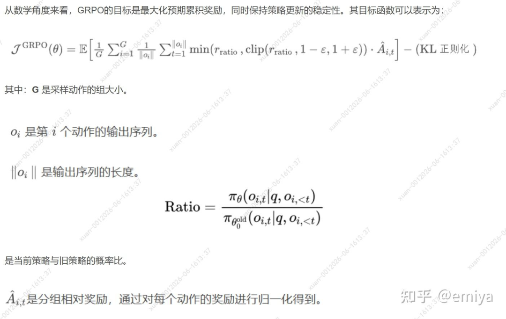
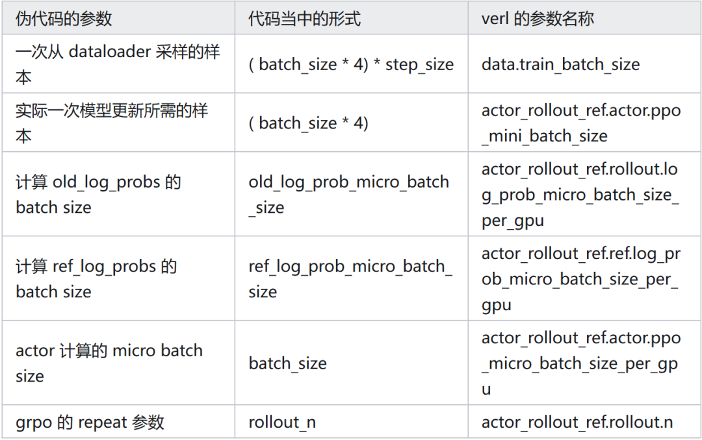

# Verl训练实战：流程+配置详解~

verl 训练过程中会配置很多的训练参数，这里记录其中常用的一些数据部分的训练参数的含义，避免每次忘掉都需要重新查询...

verl 的源代码是非常复杂的，直接阅读源代码反而不好去理解这些参数的含义，因此，这里我们先从标准的训练流程触发，逐步对应到 verl 当中的参数。

在介绍强化学习训练之前，我们先回顾最基础的训练:

## 01 一个标准的训练流程

一个标准的深度学习训练流程大致如下：

# 第一步，准备训练数据dataloader = DataLoader(batch_size = bs)# 第二步，准备 batch 的训练数据，然后计算 loss ，进行训练forepochinrange(epochs):fordataindataloader:loss = model(data)loss.backward()optim.step()optim.zero_grad()

上述的这个训练流程是没有 gradient accumulate 的，现在我们稍微改造一下，加入 gradient accumulate。

假设我希望 gradient accumulate = 4（每 4 组数据更新一次模型）：

# 第一步，准备训练数据dataloader= DataLoader(batch_size = batch_size *4) # 注意这里，我一次性加载了4份数据# 第二步，准备 batch 的训练数据，然后计算 loss ，进行训练forepoch in range(epochs):fordata in dataloader:micro_batch_data_list= data.split( n =4) # 将数据 split 到4份formicro_batch in micro_batch_data_list :loss= model(data)# 这里，每次梯度更新以后不立即更新模型的参数，而是做一个梯度累积loss.backward()optim.step()optim.zero_grad()

## 02 引入 rollout

注意，上述的流程是一个一般性质的流程，当我们来到了 RL 的算法，流程就会有一些不同。

首先，我们这里需要引入 rollout，对于 RL 算法来说，dataset 的每条数据只有 problem 和 solution，至于模型的回复是需要 rollout 出来的，而 GRPO，还会要求一条样本 rollout n 条回复：

# 第一步，准备训练数据dataloader = DataLoader(batch_size = batch_size *4)# 注意这里，我一次性加载了4份数据# 第二步，准备 batch 的训练数据，然后计算 loss ，进行训练forepochinrange(epochs):fordataindataloader:data= data.repeat( n = rollout_n )# 这时候，实际的 global_batch_size = batch_size * gradient_acc * rollout_ndata= generate_response(data)# 为每条数据生成 responsemicro_batch_data_list = data.split( n =4)# 将数据 split 到 4 份formicro_batchinmicro_batch_data_list :loss = model(data)# 这里，每次梯度更新以后不立即更新模型的参数，而是做一个梯度累积loss.backward()optim.step()optim.zero_grad()

## 03 引入重要性采样

由于强化学习训练过程中，rollout 比较慢，因此，可能会需要一次性生成多组 global_batch_size 的训练数据，并利用这些数据进行训练。

同时，引入重要性采样避免分布偏差：先写一个不考虑重要性采样的伪代码，重点是一次性采样多组样本。

假设我一次对 2 组训练样本的数据进行 rollout（下面的 step_size）：

# 第一步，准备训练数据dataloader = DataLoader(batch_size = ( batch_size *4) * step_size )# 注意这里，是原来的 step_size 倍数据# 第二步，准备 batch 的训练数据，然后计算 loss ，进行训练forepochinrange(epochs):fordataindataloader:# 一次性为这些数据产生 rolloutdata= data.repeat( n = rollout_n )data= generate_response(data)# 为每条数据生成 response# 将数据分成 step_size 组, 每一组做一次 optim.step()mini_batch_data_list = data.split( n = step_size )formini_batchinmini_batch_data_list:micro_batch_data_list = mini_batch .split( n =4)# 将数据 split 到 4 份formicro_batchinmicro_batch_data_list :loss = model(data)loss.backward()optim.step()optim.zero_grad()

现在，你会看到出现了几个概念：

batch：对应一次用于 rollout 的数据

mini_batch：对应一组需要用来做 optim.step() 的训练数据

micro_batch：受限于显卡容量，对数据分成一个一个可以处理的小 batch 进行推理

上述过程中，我们总结了大致的训练流程，但是还没有引入重要性采样。

假设我们称 rollout 的时候的模型是 π_old，当前的模型是 π_θ 由于一旦进行了 optim.step()，当前的 actor 模型的分布会偏离 rollout 模型，因此计算 loss 时需要引入重要性采样：

注意，这里其实 π_old，π_θ 实际上是同一个 actor 模型，只不过由于做了很多次 optim.step()，模型参数会发生变化，所以叫做不同的名字。

总的来说，我需要：

rollout 结束以后，计算一下当时的 actor 模型输出每一个token 的 log prob

每一次 actor 更新的时候，计算一下当前的 actor 输出的每一个token 的 log prob

所以，伪代码的流程就变成了这样：

# 第一步，准备训练数据dataloader = DataLoader(batch_size = ( batch_size *4) * step_size )# 注意这里，是原来的 step_size 倍数据# 第二步，准备 batch 的训练数据，然后计算 loss ，进行训练forepochinrange(epochs):fordataindataloader:# 一次性为这些数据产生 rolloutdata= data.repeat( n = rollout_n )data= generate_response(data)# 为每条数据生成 response# 此时 actor 未更新, 和 rollout 是同一个模型old_log_probs = []formicro_batch_for_old_log_probindata.split( n = log_prob_micro_batch_size )old_log_prob_micro_batch = model.compute_log_prob(micro_batch_for_old_log_prob )old_log_probs .extend(old_log_prob_micro_batch )# 这里这些名字和 verl 不是对应的，主要是理解这个意思data.update(old_log_probs = old_log_probs )# 将数据分成 step_size 组, 每一组做一次 optim.step()mini_batch_data_list = data.split( n = step_size )formini_batchinmini_batch_data_list:micro_batch_data_list = mini_batch .split( n =4)# 将数据 split 到 4 份formicro_batchinmicro_batch_data_list :# loss = model(data) ， 这里我们可以把 loss 计算展开log_probs = model.compute_log_prob(micro_batch )ratio = calculate_ratio( micro_batch.old_log_probs , log_probs )pg_loss = ...# 这里名字变更成 pg_loss, 区分 kl 散度 losspg_loss.backward()optim.step()optim.zero_grad()

## 04 引入 KL 散度

在GPRO 计算过程中，还需要计算 KL 散度，KL 散度的计算使用的是 π_ref。

这是一个完全没有经过训练的基础模型（最开始的模型），类似的，我们需要在 verl 当中引入一个阶段，去计算。

π_ref模型的 log_prob，这个部分放哪里其实都可以：

# 第一步，准备训练数据dataloader = DataLoader(batch_size = ( batch_size *4) * step_size )# 注意这里，是原来的 step_size 倍数据# 第二步，准备 batch 的训练数据，然后计算 loss ，进行训练forepoch in range(epochs):fordata in dataloader:# 一次性为这些数据产生 rolloutdata = data.repeat( n = rollout_n )data = generate_response(data)# 为每条数据生成 response# 先算一下 old_log_probsold_log_probs = []formicro_batch_for_old_log_prob in data.split( n = old_log_prob_micro_batch_size )old_log_prob_micro_batch = model.compute_log_prob(micro_batch_for_old_log_prob )old_log_probs .extend(old_log_prob_micro_batch )# 这里这些名字和 verl 不是对应的，主要是理解这个意思data.update(old_log_probs = old_log_probs )# 再计算一下 KL lossref_log_probs = []formicro_batch_for_ref_log_prob in data.split( n = ref_log_prob_micro_batch_size )ref_log_prob_micro_batch = model.compute_log_prob(micro_batch_for_ref_log_prob )ref_log_probs .extend(ref_log_prob_micro_batch )# 这里这些名字和 verl 不是对应的，主要是理解这个意思data.update(ref_log_probs = ref_log_probs )# 将数据分成 step_size 组, 每一组做一次 optim.step()mini_batch_data_list = data.split( n = step_size )formini_batch in mini_batch_data_list:micro_batch_data_list = mini_batch .split( n =4)# 将数据 split 到 4 份formicro_batch in micro_batch_data_list :# loss = model(data) ， 这里我们可以把 loss 计算展开log_probs = model.compute_log_prob(micro_batch )ratio = calculate_ratio( micro_batch.old_log_probs , log_probs )pg_loss = ...# 这里名字变更成 pg_loss, 区分 kl 散度 loss# 这里引入 kl losskl_loss = calculate_kl_loss( micro_batch.ref_log_probs , log_probs )loss = pg_loss + kl_coeff * kl_lossloss .backward()optim.step()optim.zero_grad()

## 06 引入多卡训练 （ray worker ）

刚刚的训练我们没有涉及到多卡训练的逻辑，verl 当中是：

主进程控制整体训练流程

具体计算分发到各个 worker（粗略的可以认为一个 GPU 是一个 worker）

其实就是有一个 dispatch（数据分发）和 gather（结果搜集）的过程：

# 第一步，准备训练数据dataloader = DataLoader(batch_size = ( batch_size *4) * step_size )# main process# 第二步，准备 batch 的训练数据，然后计算 loss ，进行训练forepochinrange(epochs):fordataindataloader:# 一次性为这些数据产生 rollout# main process 的 dataloader 获取到一次训练所需要的 sampledata= data.repeat( n = rollout_n )data= generate_response(data)# 为每条数据生成 response# dispatch: 每一个 GPU 拿到 ( batch_size * 4) * step_size / num_gpu 个样本> actor.compute_log_prob(per_gpu_batch)# n = old_log_prob_micro_batch_size> ref.compute_log_prob(per_gpu_batch)# n = ref_log_prob_micro_batch_size# dispatch : 每一个 GPU 拿到 ( batch_size * 4) * step_size / num_gpu 个样本# 以下行为都是针对每一个 GPU 所拿到的 per_gpu_batch> mini_batch_data_list = per_gpu_batch.split( n = step_size )>formini_batchinmini_batch_data_list:> micro_batch_data_list = mini_batch .split( n =4)# 将数据 split 到 4 份>formicro_batchinmicro_batch_data_list :># loss = model(data) ， 这里我们可以把 loss 计算展开> log_probs = model.compute_log_prob(micro_batch )> ratio = calculate_ratio( micro_batch.old_log_probs , log_probs )> pg_loss = ...# 这里名字变更成 pg_loss, 区分 kl 散度 loss># 这里引入 kl loss> kl_loss = calculate_kl_loss( micro_batch.ref_log_probs , log_probs )> loss = pg_loss + kl_coeff * kl_loss> 模型是基于 fsdp 或者 megatron 的， backward() 的时候会自动做梯度的同步> loss .backward()> optim.step()> optim.zero_grad()

## 07 参数对应

到这里我们就讲完了整个 verl 强化学习训练的大致流程，现在可以将上面涉及到的几个参数对应到。

verl 的训练参数了：

到这里就写完了，如果对这种形式感兴趣，也可以留言看看还希望介绍哪些参数。

作者：emiya

链接：https://zhuanlan.zhihu.com/p/2050167743803135955
