# 从各家技术文章看26年Agentic RL Infra优化方向

趁着春节有空，自己调研了一些目前 Agentic RL 场景下对 Infra 的一些需求，主要内容都来自于各家大厂的文章。

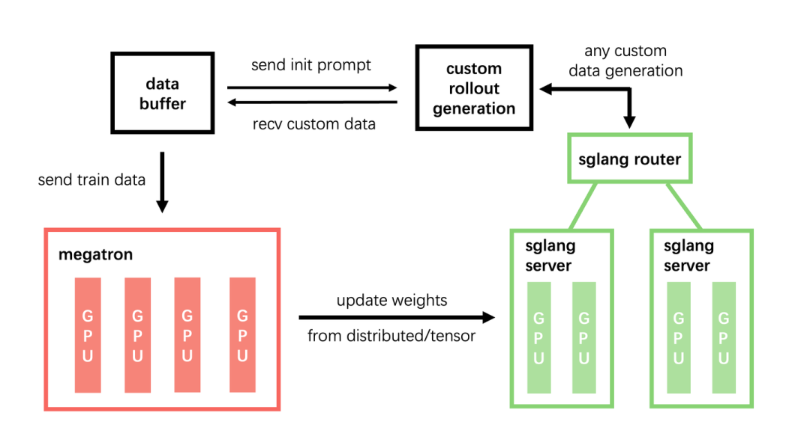

值得一提的是除了最后一篇 Seer 的文章外，其他 3 篇都是春节期间发布的，LLM 还是太卷了。

## 01 Minimax-ForgeRL

原文为：Forge：大规模原生 Agent RL 系统

https://zhuanlan.zhihu.com/p/2005742716252861435

Agent 框架实现

首先是将 Agent 独立出一个单独的 Server 模块，这是一个比较直观的抽象

原来的数据流为RLFramework(Verl/Slime) ->RolloutEngine=>[AsyncBuffer] ->Trainer加一个中间层变为RLFramework(Verl/Slime) -> [AgentServer<->RolloutEngine] => [AsyncBuffer] ->Trainer

整体架构是这样的：

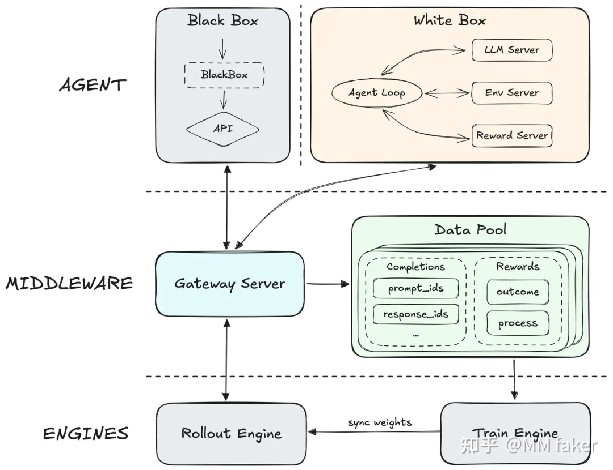

而对于 AgentServer 实际上又有两种情况：

黑盒 Agent：比如如果想要专门训练 ClaudeCode+LLM 的表现，那么在 AgentServer 中的 sandbox 中起一个 ClaudeCode。

ClaudeCode 和 RolloutEngine 不断交互产生 trajectory，然后丢到 AsyncBuffer 里面，后面就是正常 RL 的流程：计算 Reward -> 计算优势函数 -> 计算 Loss。

白盒 Agent：这一部分一开始读的一头雾水，于是在v上请教了一下岳老师背景知识

首先在 multi-turns 场景下，对于 context 过长的情况一定需要一些手段来清除掉一些上下文（Context Management）。

比如在 DeepSeek V32 技术报告中提到的对于 thinking 模型的做法是一旦当用户消息到达时，会清除掉 Thinking 的内容避免上下文过长。

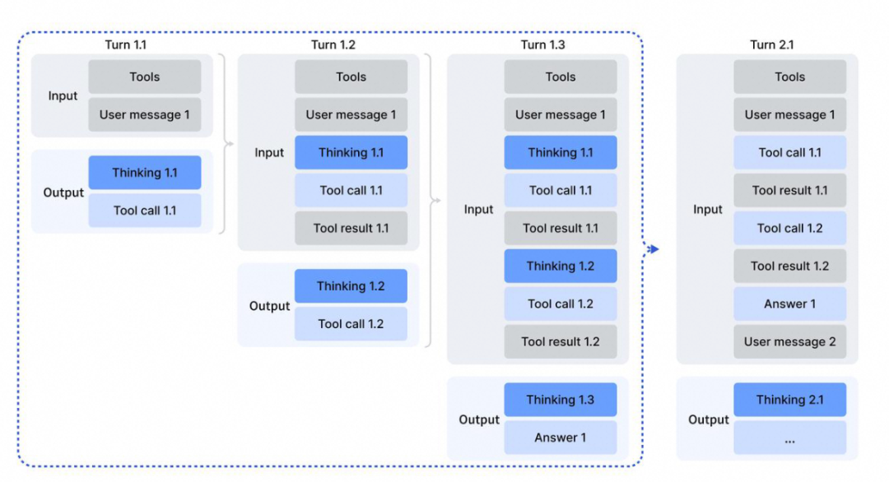

而对于 SearchAgent（例如 BrowseComp），目前几家（ClaudeCode opus4.5/DS v32/Kimi K2.5/GLM 50 都是采用了 discard-all 策略。

即 token 阈值超过 80% 时 reset 掉整个上下文窗口，ClaudeCode 给出的 API 大概长这样。

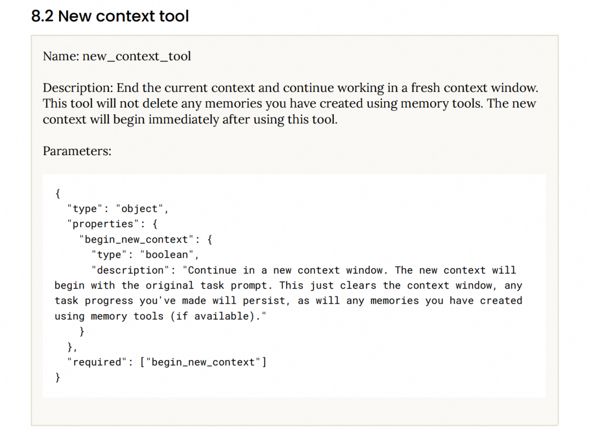

在 ForgeRL 中会将 Context Management 建模为 agent action，显式的在训练中告知模型上下文的变化情况，从而让模型在训练阶段就能感知到 CM 的变化，进而在 CM 变化时更加关注 State-critical Token。

## 02 RL 调度策略

目前主流的 RL 框架基本都是异步实现，因此一定会产生 off-policyness 的问题，这里的 trade off 在于：

如果只取最新鲜的数据来进行训练，而对于旧版本的数据直接丢弃，那么会导致训练的样本更多的是 "快而简单"的样本

如果只取最旧的数据来进行训练，由于 Rollout 的长尾效应，会导致系统吞度量下降。

但是具体到调度策略的设计也是一个没有银弹的事情，ForgeRL 提出的是一种基于滑动窗口的算法：在窗口内可以任意取 trajectory 进行训练，但必须等待窗口内的旧数据完成后才会推进窗口。

具体的算法如下，原文讲的比较详细：

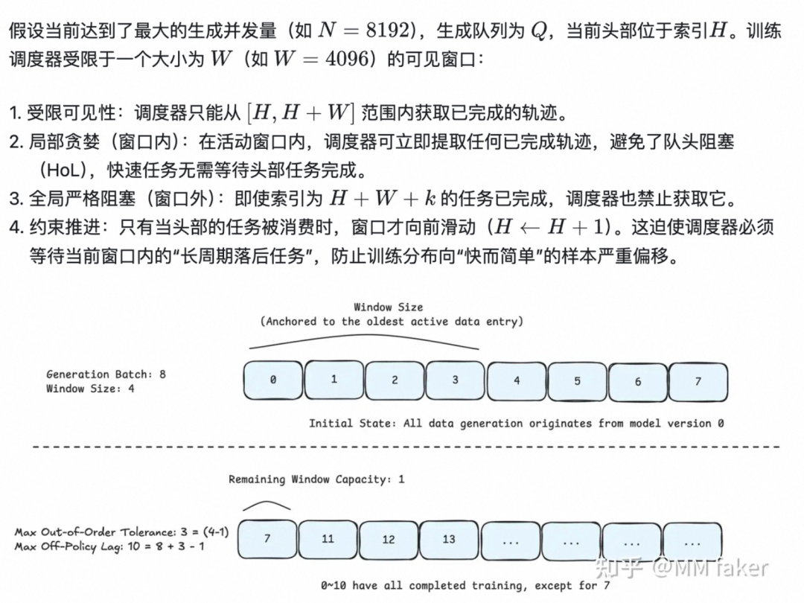

## 03 Prefix Tree Merging

对于 Group-Based RL（例如 GRPO）的一大特点是对于一个 Prompt，会生成 n 个 Completions（例如 20 个）。

这些 Completions 大多有相同的前缀，在推理时可以借助 SGLang PrefixCache 的能力来尽可能的复用 KVCache。

而这项工作的核心是在 Megatron 训练时也用上前缀的方式，具体的实现是先将 Completions 组织成树的形式，然后借助 MagiAttention 来进行实现。

实际上 MagiAttention 本身是为了做 CP 并行设计的，但是其提供了 AttentionMask 的语义（也就是说可以控制每个 seq 的可见范围）从而来实现 TreeAttention 的计算。

蚂蚁 AReal 团队也提了一种类似的 TreeAttention 的方案，使用 DFS 来算 Attention。

详细可见论文：AREAL-DTA：Dynamic Tree Attention for Efficient Reinforcement Learning of Large Language Models。

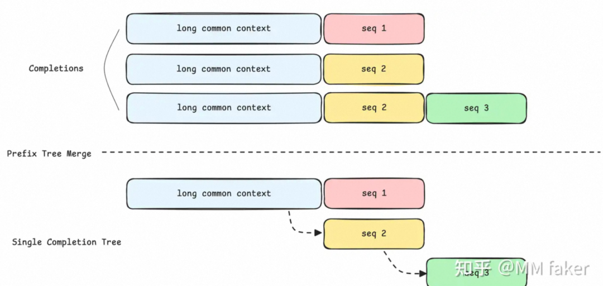

（1）推理加速

这一部分原文写的很清楚，索性直接摘抄过来。

对于 Dynamic MTP，这块之前和 MMX 合作搞了一些，比较了解，目前最新的进展是说对于多层 MTP，实际上现有的 Eagle 算法并不能直接支持，而是要采用一种叫做 Vanilla 的变种算法。

这一块在 SGLang 中由 liangsheng 大佬做了实现#15207，但是目前是每一层 MTP 单独跑了一个 cuda graph，这里可以优化为多层 MTP fuse 到一个 cuda graph，这块阿里云的同学在帮忙支持，估计年后不久会有 PR。

Dynamic MTP：首先我们引入 MTP 进行推理加速，同时为了保证训练过程中维持 draft model 的高接受率，我们通过 Top-K KL Loss 在 RL 过程中持续训练 detached MTP Head，与 RL policy 保持对齐。

Rollout 侧的 PD 分离：PD 分离可以消除 MoE 调度中的 PD 干扰，为每个实例提供独立的并行和生成策略，在最大化吞吐量的同时优化长尾样本的延迟，防止极端样本阻塞 FIFO scheduler，并带来较高的 offpolicy。

全局 L3 KV Cache Pool：在多轮和超长上下文的 agent 场景下，请求间拥有极高的共享前缀比例，但是局部的 kv cache 受容量限制，无法达到满意的 prefix cache 命中率。

甚至在 RL batch size 极大的情况下，会发生大量由于驱逐导致的重计算，因此需要支持全局的 L3 KV cache。

同时，Forge 还通过 scheduler cost-aware 的调度机制，权衡排队延迟和缓存传输时间来动态路由请求，在不使实例超载的前提下最大化缓存局部性。

（2）复杂 Reward 函数

由于 Agentic RL 基本都是 multi-turns 的调用，因此只对最终结果做奖励（Sparse Reward）容易让模型养成偷工减料的习惯，因此需要设计一种 dense reward 机制来对每一轮的调用都进行打分。

这块对于 infra 来说倒没什么难的，大概只需要在 RewardServer 中实现一个新的类就可以，但是在算法侧怎么设计可能比较讲究。

mmx 的原文如下，讲的也比较直白。

为了解决超长轨迹的信用分配问题并确保稳定，我们设计了一个由三部分组成的复合奖励：

过程奖励（Process Reward）：监督 agent 的中间行为（如惩罚语言混合或特定工具调用错误），提供密集反馈，而不只依赖最终结果。

任务完成时间奖励：将相对完成时间作为奖励信号。因为真实延迟不仅取决于 Token 生成，还受工具执行和子 Agent 调用影响，这能激励 Agent 主动利用并行策略、选择最短的执行路径来加速任务。

用于降低方差的后续奖励（Reward-to-Go）：长周期任务的稀疏奖励容易引发高梯度方差。我们使用 Reward-to-Go 来标准化回报，大幅提高了信用分配的精度，稳定了优化过程。

## 04 ROLL

原文为：苦涩的教训！ROLL 团队分享：Agentic RL 训练中的实践经验。

（1）Agent 环境实现

和 ForgeRL 类似，Roll 框架也实现了单独的 AgentServer：即采用 Rock 作为 Sandbox，启动内置了 iFlow Cli 作为 Agent 实现与模型的交互。

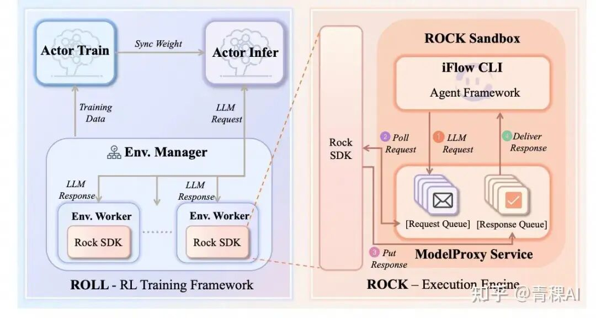

（2）Agent 环境处理

在 Agentic RL 训练时，由于 Agent 经常会留下中间产物（例如临时文件），这些临时产物可能会间接的提示模型，因此需要对严格环境进行管理，否则会导致模型经常"偷懒"，甚至会直接读取或修改测试脚本（例如在观测结果中看到测试脚本调用次数显著上升）。

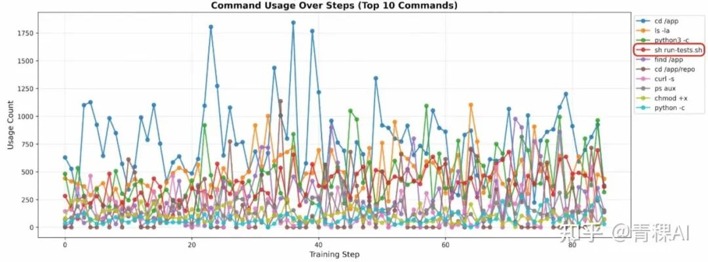

<1> 防止资源泄露与污染，Roll 进行严格的环境清理：

在 rollout 前主动清理环境初始化或 Agent 安装过程中产生的中间文件

测试文件仅在最终评估阶段上传，与训练阶段严格隔离

<2> 在环境中主动引入多样性：

不同版本的软件包；

不同镜像源；

不同的环境配置细节。

<3> 需要有意扰动甚至部分破坏环境：例如移除某个预装依赖或切换到不可用的镜像源头

（3）训练数据处理

这部分说的是数据处理的问题，即 Roll 团队发现有大量的测试数据存在 false positive（伪阳性）的问题：要么数据不完整，要么就是本身就是个错误数据。

因此在洗数据的时候就引入了一个 LLM-as-judge 验证模块，让多个 LML 审查每一组测试数据，只有对于通过验证的实例才会进入 RL 训练池。

具体来说会做两种检查：

Ground-truth 验证：如果 golden solution 无法通过全部测试，则丢弃该实例。

No-op 验证：如果在不执行任何有效操作的情况下也能通过测试，则丢弃该实例。

（4）Chunked MDP

对于 GRPO，其是在 Token Level 做重要性采样，对于 GSPO 是在 Sequence 级别。

这里提了一个 Chunked MDP，即将一次环境交互到下一次环境交互之间的连续片段叫做 Chunk，在 Chunk 级别计算 Reward 和重要性采样。

## 05 ThunderAgent

原文：ThunderAgent: A Simple, Fast and Program-Aware Agentic Inference System

春节期间看到 Kang Hao gg 在各大群里宣发自己的工作，同时自己正好在关注这部分，索性来拜读一番。

ThunderAgent 解决问题的思路非常直观：遇事不决加一层，ThunderAgent 就是在 AgentServer 与 RolloutEngine 之间加了一个代理层。

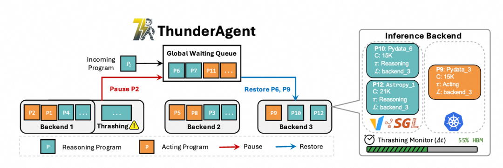

（1）program Abstraction

对于目前 AgentServer 与 Rollout，基本上都是每轮的交互看作是独立的推理任务，这样的坏处是无法实时追踪每个 Agent 任务的实时状态（例如已经用了多少 Token）

例如：一个编码智能体（SWE-Agent）正在修复 GitHub 上的 Bug，其交互流程大概如下：

传统请求感知系统（SGLang）：┌─────────────────────────────────────────────────────┐│ Step 1: 推理请求 ──→ vLLM（无状态，独立处理） ││ Step 2: 工具执行（编译器）──→ Kubernetes（无状态） ││ Step 3: 推理请求 ──→ vLLM（不知道Step1的存在） ││ Step 4: 工具执行（测试器）──→ Kubernetes（不知道历史）│└─────────────────────────────────────────────────────┘

而引入独立的 ThunerAgent 层后，就可以完成对 Agent 任务抽象的流程管理，例如：

┌─────────────────────────────────────────────────────┐│ P = ⟨ID="bug_fix_001", ││ c=15000 tokens, ← KV缓存占用 ││ T={Docker, Bash}, ← 工具资源 ││ L=backend_2, ← 绑定GPU节点 ││ τ=Reasoning, ← 当前推理阶段 ││ s=Active⟩ ← 调度状态 ││ ││ Step 1 → Step 2 → Step 3 → Step 4 ││ ↑___________同一个程序P持续存在___________↑ │└─────────────────────────────────────────────────────┘

（2）State-Aware Pausing

这里首先对任务的开销做了建模，这 5 项分别代表解码、预填充、重新计算、未使用容量和空闲缓存。

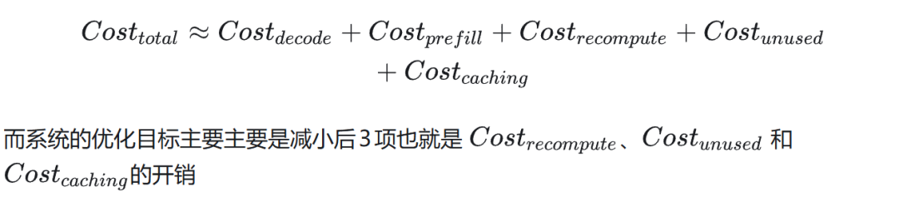

而对于 KVCache 接近阈值的情况，由于 ThunderAgent 可以捕获程序的运行状态，因此引入了两个新的操作：

Pause：暂停一个程序的执行，并释放其 KVCache

Restore：恢复一个程序的执行

有了这两种状态，ThunderAgenet 会基于一种周期性检测的方式，当显存水位比较高时会暂停一部分程序的执行，而当显存水位降低时会恢复程序执行。

那么到底需要驱逐哪些程序的？这里论文给了一个结论：优先驱逐占 KV Cache 最小的程序，因为 Attention 的计算复杂度为。

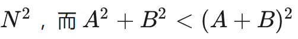

（3）Tool Resource Management

这里要解决的问题是 Agent 任务运行完成后环境被污染的问题，有两点设计：

Hook-based garbage collection：既然能够检测任务的状态，那么就等到任务达到 Terminated 状态时对环境资源进行清理

Asynchronous environment preparation：环境初始化的延迟（例如安装 Docker）可能会成为瓶颈，为解决该问题，ThunderAgent 监控全局队列，如果发现高优先级的程序接近恢复阈值时就提前 Prepare 初始化环境。

## 06 Kimi-Seer

原文为：Seer: Online Context Learning for Fast Synchronous LLM Reinforcement Learning

首先 Seer 这篇论文的研究场景主要是同步训练下的优化，但是笔者看到的几个 RL Case 基本上都是跑的异步训练，所以适用性还有待考证。

Divided Rollout（分段 Rollout）

背景：前文中提到，对于 GRPO 这种 Group-Based RL 算法，其会对同一个 prompt 生成 n 个 response，但是常见的调度算法会吧 n 个 reponse 的生成调度到同一台实例上执行。

这样会带来两个问题：

由于 Rollout 的长尾问题严重，因此会造成实例间负载不均衡。

单实例间的 KVCache 爆满触发抢占

因此论文中提出把请求切为 Chunk 粒度，每一个 Chunk 8K 长度，下面是 GPT 老师画的图，比较直观。同时 KV Cache 需要缓存到 Mooncake 中，这样迁移时无需重新 Prefill。

传统方式：Group →[req1, req2, ..., req8]→ 绑定到InstanceA，跑完为止↑长的拖死短的，无法迁移Seer的方式：Group → req1 → chunk1(8K) → chunk2(8K) → chunk3(8K) → ...↑ ↑ ↑调度到A调度到B调度回A（按负载动态选）

Context-Aware Scheduling（上下文感知调度）

要解决负载不均衡的问题，本质上还是要知道哪些 Request 是长尾 Request，也就是最好能知道 Response 的长度，因此有个很直观的想法是对于 GRPO 任务：

优先选第一条 Request 作为speculative request来优先调度

调度完成后以speculative request的长度作为组内 response 长度的估计

按照长任务优先的策略调度剩余的请求

大致流程为：

阶段1：Length Filtering（长度过滤）└─ 用SFS（ShortestFirst）调度所有Speculative Requests→ 短的很快完成，长的暴露为长尾候选阶段2：Length EstimationUpdate（长度估计更新）└─ Context Manager记录每个Group已完成请求的最大生成长度→ 作为该Group预期长度的在线估计阶段3：Approximate LFS调度└─ 对剩余请求按预测长度降序调度→ 长任务优先，与短任务并行执行，填满批次

Adaptive Grouped Speculative Decoding（自适应分组 Spec）

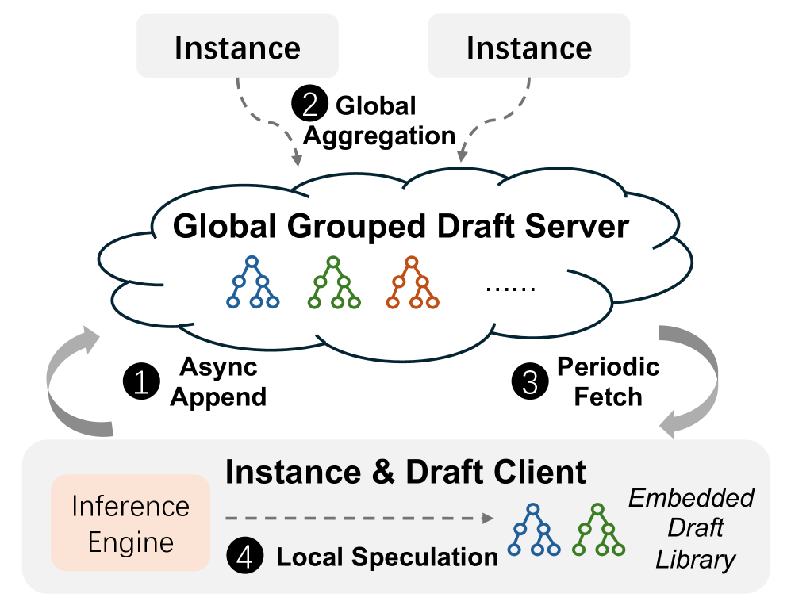

对于采用 Draft-Model 做 Spec 的方式，会时常由于 RL 在 Target Model 和 Draft Model 之间的权重更新不同步导致 DraftModel 的接受率降低。

对于传统的 N-Gram 算法，受限于单机执行，无法充分利用 GRPO 算法的特点。

因此这里提出了一种类似“分布式 NGram”的思路，即将不同 Group 内的 Response 产生的 Token 一起丢到一颗分布式的压缩后缀树中。

这样能够匹配的信息更多。

大致流程为：

┌──────────────────────────────────────────────────────────────┐│ Step 1: 异步Append（各实例独立） ││ Instance_A 生成了 req_0 的新token: [tok_a, tok_b, tok_c] ││ Step 2: 全局聚合（DGDS Server端） ││ ││ 收到来自不同实例的更新： ││ G1/req_0: [tok_a, tok_b, tok_c, ...] ─→ ┐ ││ G1/req_1: [tok_x, tok_y, tok_z, ...] ─→ ├→ Group G1's CST││ G1/req_2: [tok_p, tok_q, tok_r, ...] ─→ ┘ ││ ││ Step 3: 周期性Fetch（各实例拉取） ││ Instance_A 只拉取自己正在处理的group的CST ││ 支持增量同步：只传上次fetch之后的新增内容 │└──────────────────────────────────────────────────────────────┘

作者：attack204，已获作者授权发布

来源：https://zhuanlan.zhihu.com/p/2007250216227729670
