# TSRBench 项目主页中文版

<p align="center">
  
</p>

<h2 align="center">面向通用模型的综合多任务、多模态时间序列推理基准</h2>

> 本文是 [TSRBench 官方项目主页](https://tsrbench.github.io/)的中文整理版。<br>
> 论文：**TSRBench: A Comprehensive Multi-task Multi-modal Time Series Reasoning Benchmark for Generalist Models**<br>
> 会议：ICML 2026<br>
> 整理时间：2026-07-28

## 作者与机构

作者：

- Fangxu Yu
- Xingang Guo
- Lingzhi Yuan
- Haoqiang Kang
- Hongyu Zhao
- Lianhui Qin
- Furong Huang
- Bin Hu
- Tianyi Zhou（通讯作者）

机构：

1. University of Maryland, College Park
2. University of Illinois Urbana-Champaign
3. University of California, San Diego
4. Mohamed bin Zayed University of Artificial Intelligence

项目资源：

- [论文](https://arxiv.org/abs/2601.18744)
- [代码](https://github.com/tianyi-lab/TSRBench)
- [数据集](https://huggingface.co/datasets/umd-zhou-lab/TSRBench)
- [英文项目主页](https://tsrbench.github.io/)
- [论文中文精讲](TSRBench论文精讲.md)

## 项目概览

时间序列广泛存在于现实世界中，是能源管理、交通控制、金融、医疗和工业系统等关键应用的基础。因此，能否对时间序列进行推理，是通用模型解决复杂现实问题时不可缺少的能力。

但当前针对通用模型的 benchmark 很少系统评估这一维度。

为弥补这一缺口，作者提出了 **TSRBench**：一个综合多模态 benchmark，用于压力测试模型在时间序列感知、推理、预测和决策方面的完整能力。

TSRBench 包含：

- 来自 14 类领域的 **4,125 道题**；
- **4 个核心能力维度**：感知、推理、预测和决策；
- **15 项具体任务**；
- 文本、图像、图文交错和时间序列 embedding 四类输入方式；
- 对 LLM、VLM 和时间序列大模型 TSLLM 的统一评估。

TSRBench 不只是一个排行榜，也是一套标准化评估平台：它用于发现当前模型的能力盲区，并为后续时间序列推理模型的设计提供依据。

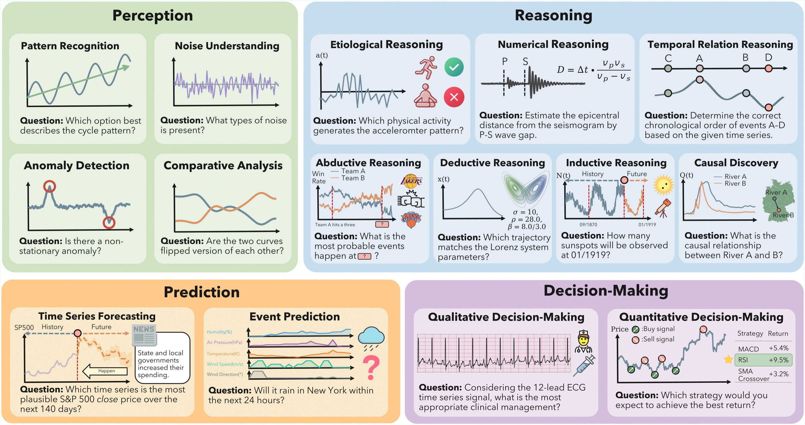

*图 1：TSRBench 从感知、推理、预测和决策四个维度评估通用模型。*

## TSRBench 的主要特点

### 1. 覆盖完整

TSRBench 用 15 项任务覆盖从基础模式识别到高级因果、数值和决策推理的完整能力链。

### 2. 原生多模态

同一条时间序列可以表示为：

- 数值文本；
- 曲线图；
- 数值文本与图像联合输入；
- 专用时间序列 embedding。

因此，它可以评估模型是否能处理不同表示，以及是否能真正融合跨模态信息。

### 3. 面向真实领域

数据来自能源、交通、金融、医疗等实际领域，避免 benchmark 只测抽象、脱离应用的序列模式。

## Benchmark 设计

### 四个核心维度

#### 1. 时间序列感知

该维度评估模型从时间序列中提取模式和信息的能力，包含四项任务：

1. 模式识别（Pattern Recognition）
2. 噪声理解（Noise Understanding）
3. 异常检测（Anomaly Detection）
4. 比较分析（Comparative Analysis）

#### 2. 时间序列推理

该维度评估模型结合时间模式和先验知识得出结论的能力，包含七项任务：

1. 成因推理（Etiological Reasoning）
2. 因果发现（Causal Discovery）
3. 溯因推理（Abductive Reasoning）
4. 时序关系推理（Temporal Relation Reasoning）
5. 数值推理（Numerical Reasoning）
6. 演绎推理（Deductive Reasoning）
7. 归纳推理（Inductive Reasoning）

#### 3. 时间序列预测

该维度包含：

1. 时间序列预测（Time Series Forecasting）
2. 事件预测（Event Prediction）

#### 4. 时间序列决策

该维度评估模型能否综合时间序列和上下文作出行动选择，包含：

1. 定性决策（Qualitative Decision-Making）
2. 定量决策（Quantitative Decision-Making）

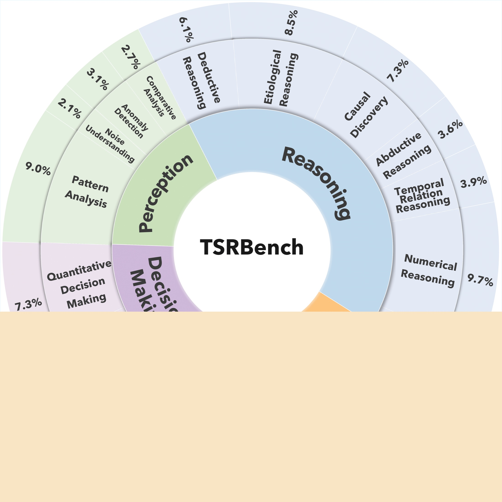

*图 2：TSRBench 中 15 项任务的样本占比。*

## 排行榜

官方主页的排行榜动态展示 15 项任务和总体准确率。下表将总体准确率最高的配置整理为静态 Markdown：

| 排名 | 模型 | 类别 | 输入形式 | 总体准确率 |
|---:|---|---|---|---:|
| 1 | GPT-5 | 闭源模型 | T+V | **55.6%** |
| 2 | GPT-5 | 闭源模型 | T | **55.5%** |
| 3 | GPT-5-mini-high | 闭源模型 | T+V | **54.1%** |
| 4 | o4-mini-high | 闭源模型 | T+V | **52.5%** |
| 5 | GPT-5 | 闭源模型 | V | **52.4%** |
| 6 | o4-mini | 闭源模型 | T+V | **48.2%** |
| 7 | o4-mini | 闭源模型 | T | **47.7%** |
| 8 | GPT-5-mini | 闭源模型 | T+V | **46.9%** |
| 9 | o4-mini | 闭源模型 | V | **46.6%** |
| 10 | GPT-5-mini | 闭源模型 | T | **46.6%** |
| 11 | Gemini-2.5-Flash | 闭源模型 | T+V | **46.5%** |
| 12 | GPT-5-mini | 闭源模型 | V | **46.0%** |
| 13 | Qwen3-VL-32B | 开源 VLM | V | **44.9%** |
| 14 | Qwen2.5-72B | 开源 LLM | T | **42.4%** |
| 15 | Llama-4-Scout-17B-16E | 开源 VLM | V | **42.3%** |

输入形式：

- `T`：数值文本；
- `V`：时间序列图像；
- `T+V`：数值文本和图像同时输入。

任务缩写：

| 维度 | 缩写 |
|---|---|
| 感知 | PR、NU、AD、CA |
| 推理 | ER、CD、AR、TR、NR、DR、IR |
| 预测 | TSF、EP |
| 决策 | QualDM、QuantDM |

## 核心发现

作者评测了 30 多个领先的闭源和开源 LLM、VLM 及 TSLLM，并总结出四条主要发现。

### 发现 1：除预测外，模型规模通常与时间序列能力正相关

在 LLM 和 VLM 中，模型规模增大通常会改善时间序列感知、推理和决策表现。

但时间序列预测是明显例外：模型更大，并不意味着数值或事件预测更准确。

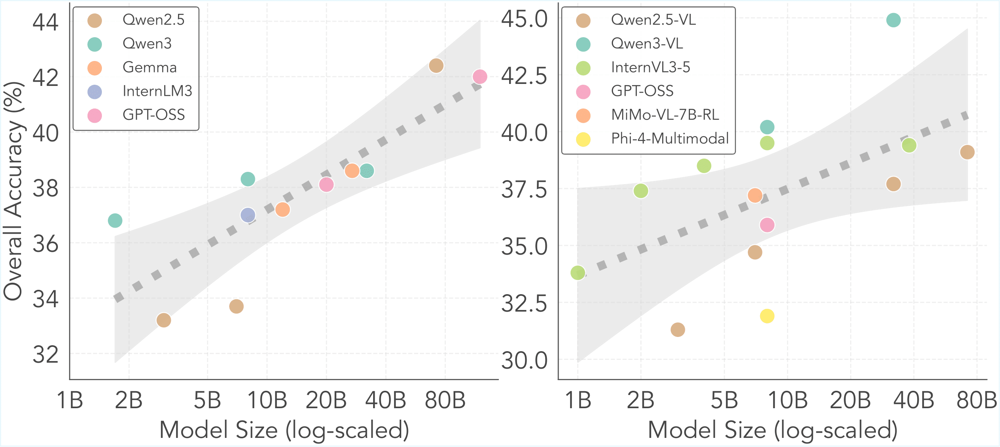

*图 3：横轴为对数尺度的模型参数量，纵轴为总体准确率；左图为 LLM，右图为 VLM。*

### 发现 2：感知、推理和决策高度相关，预测相对独立

模型如果擅长感知时间模式，通常也更擅长推理和决策。

但这些能力与预测任务的相关性很弱。这意味着模型即使能够正确解释时间序列，也未必能够精确预测未来。

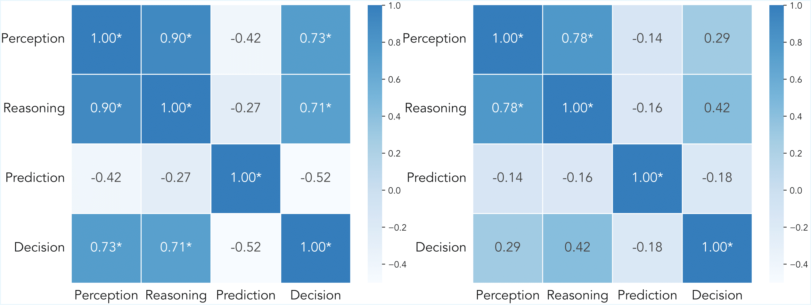

*图 4：四个核心维度之间的 Spearman 秩相关系数；星号表示 p 值不高于 0.05。*

### 发现 3：文本与视觉表示互补，但联合输入没有充分兑现收益

数值文本和曲线图的总体表现相近，但它们经常答对不同的题：

- 图像更适合识别趋势、形态和异常；
- 数值文本更适合精确读取和计算。

理论上，模型只要能联合利用两种模态，就应明显超过单模态。

但实验发现，T+V 输入的答案往往只是接近文本模型或视觉模型已有的答案，说明当前模型没有充分融合两种表示。

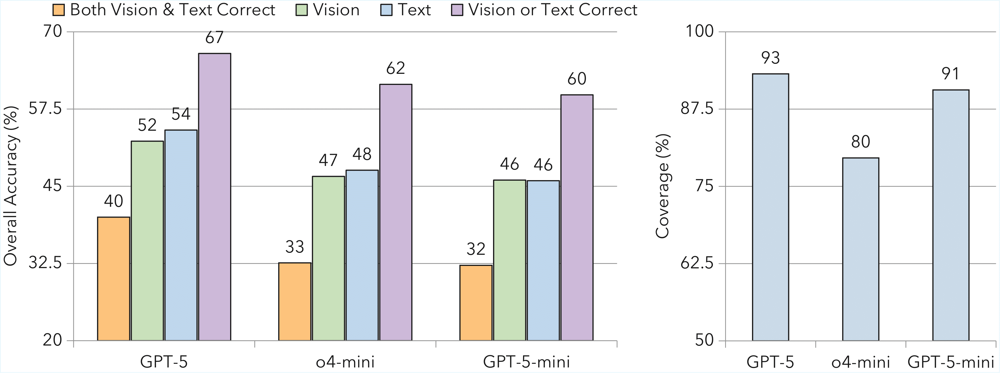

*图 5：左图比较文本、视觉、二者交集和并集的准确率；右图展示 T+V 答案与单模态答案重合的比例。*

### 发现 4：不同任务需要不同的改进路线

作者按照各任务的平均准确率和模型间方差，将任务分成两类：

1. **高方差任务**

   某些强模型表现很好、弱模型表现很差，例如溯因推理和事件预测。这类任务可能通过知识蒸馏，把强模型能力迁移给弱模型。

2. **低准确率、低方差任务**

   几乎所有模型都表现很差，例如定量决策和时间序列预测。这属于模型的共同盲区，仅靠模型蒸馏不够，更需要新的训练数据和时间序列监督。

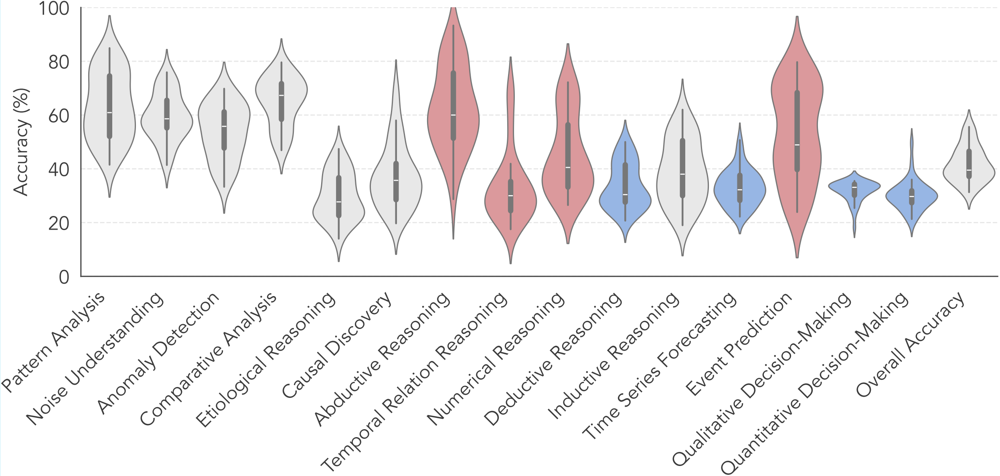

*图 6：红色任务的模型间差异较大；蓝色任务准确率低且模型间差异小。*

## 任务案例

下面是官方主页提供的九类案例图。

### 1. 模式识别

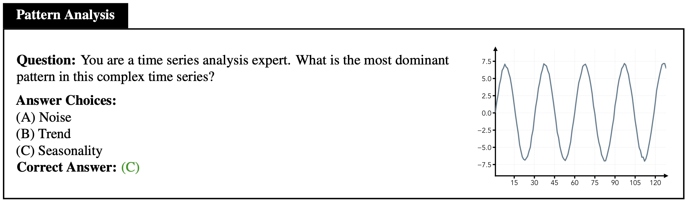

模型需要识别趋势、周期、平稳性等基本模式。

### 2. 异常检测

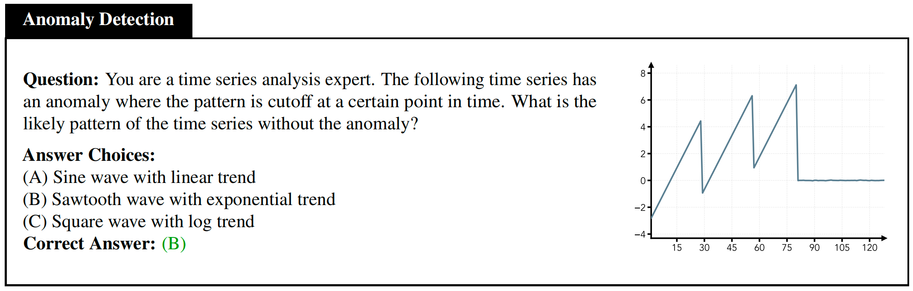

模型需要定位异常，并判断异常属于突变、反转、截断或其他类型。

### 3. 比较分析

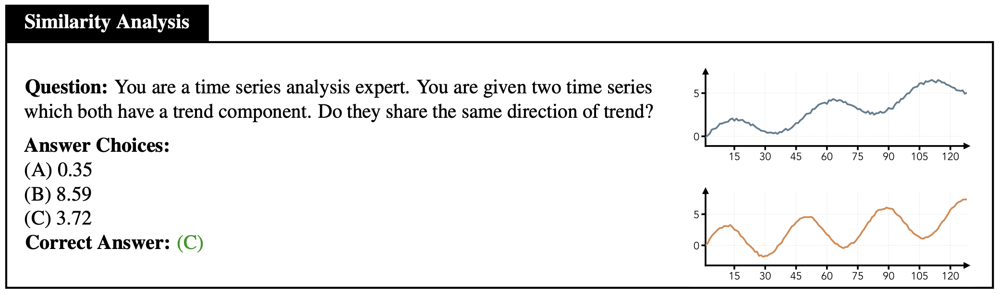

模型需要比较多个序列的分布、趋势、噪声或形态关系。

### 4. 成因推理

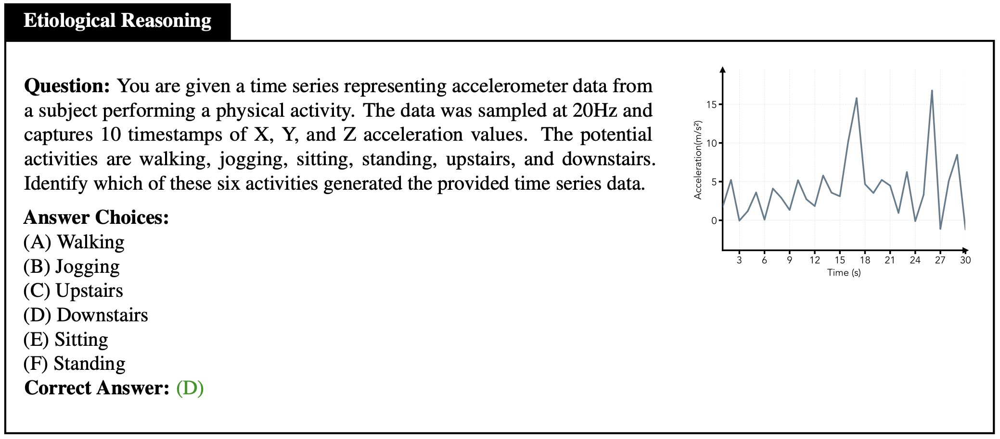

模型需要结合时间模式和领域知识，判断哪种活动或原因最可能产生给定序列。

### 5. 数值推理

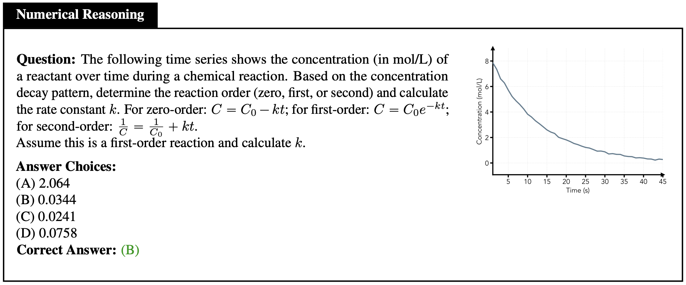

模型不仅要读取时间点和振幅，还要正确应用物理或数学公式完成计算。

### 6. 演绎推理

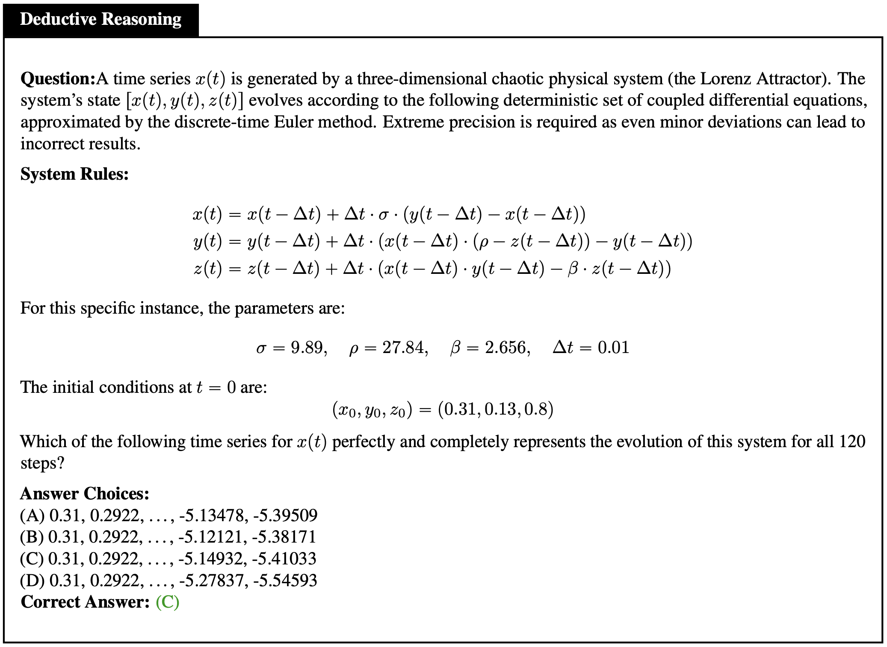

模型需要把预定义规则严格应用到时间序列，推出唯一结论。

### 7. 归纳推理

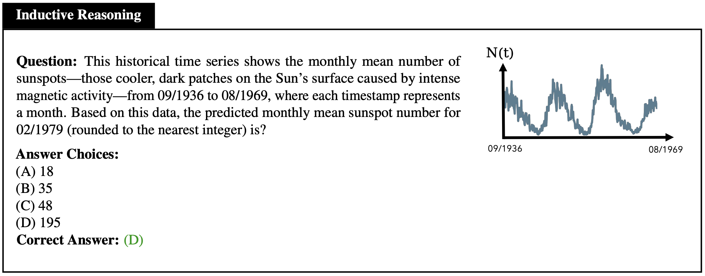

模型需要从历史观察中归纳周期或规则，再用于判断未来事件。

### 8. 因果发现

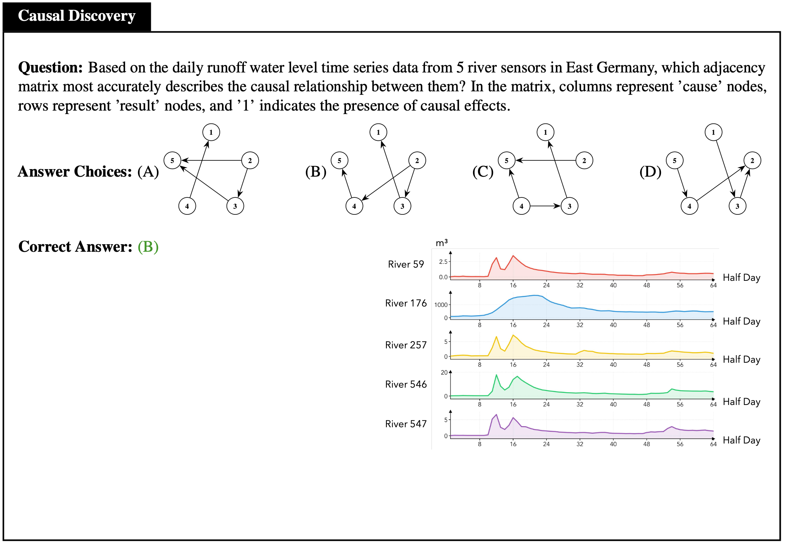

模型需要结合多变量序列和背景信息，确定是否存在因果关系及其方向。

### 9. 定性决策

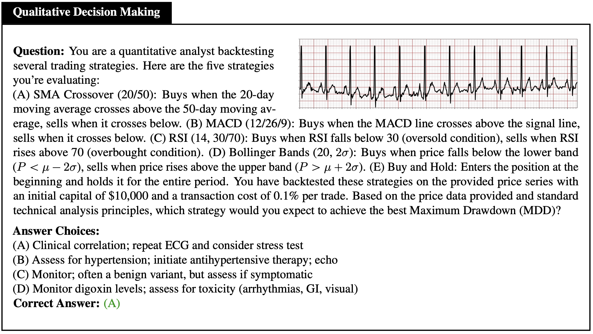

模型需要综合时间序列、上下文与领域规范，选择合适的行动。

## 如何理解这些结果

TSRBench 揭示的关键矛盾是：

> 通用模型的语义能力增长很快，但精确的时间序列预测、定量决策和跨模态融合仍然明显滞后。

这带来几项直接启示：

1. 不能把更大的语言模型直接等同于更好的时间序列模型。
2. 时间序列预测需要专门的数值和连续信号监督。
3. 图像和原始数值都应保留，但需要显式对齐二者。
4. 不同任务应使用不同改进路线：高方差任务适合蒸馏，共同弱项需要新数据。
5. 面向金融、医疗等高风险领域时，benchmark 准确率不能直接等价为部署可靠性。

## BibTeX

```bibtex
@article{yu2026tsrbench,
  title={TSRBench: A Comprehensive Multi-task Multi-modal Time Series Reasoning Benchmark for Generalist Models},
  author={Yu, Fangxu and Guo, Xingang and Yuan, Lingzhi and Kang, Haoqiang and Zhao, Hongyu and Qin, Lianhui and Huang, Furong and Hu, Bin and Zhou, Tianyi},
  journal={arXiv preprint arXiv:2601.18744},
  year={2026}
}
```

## 来源与说明

- 原始项目主页：https://tsrbench.github.io/
- 本文为便于中文阅读而做的翻译与结构化整理。
- 页面中的项目图片已下载到 `msxf/images/tsrbench-homepage/`，Markdown 使用仓库内相对路径，不依赖外部图片链接。
- 原项目主页采用 [CC BY-SA 4.0](https://creativecommons.org/licenses/by-sa/4.0/) 许可。
