# 开源金融时间序列数据集清单（替代 ChatTS 合成数据）

> 整理时间：2026-07-23
> 背景：ChatTS（arXiv 2412.03104）训练数据完全由「规则生成器 + GPT」合成，分布与真实市场存在差距（缺少跳空、波动率聚集、杠杆效应、节假日缺口、牛熊结构）。本清单汇总可公开获取、能直接用于时间序列 / 时序 LLM 实验的**真实金融时间序列**数据源，作为合成数据的替代或评测补充。

## 为什么需要真实金融数据

- ChatTS 合成数据的强项是「标签精确、模式可控、数量无限」，弱项是**分布不真实**，难以覆盖真实市场的厚尾、结构性断点与非平稳性。
- 真实金融时序天然具备上述特性，适合做：更可信的预训练/对齐数据、分布外评测、异常与相关性描述能力测试。
- 代价：真实数据**缺少 ChatTS 式的属性文本标签**。可行做法是「真实序列 + 自动派生属性」（用规则生成器给真实序列打 trend/seasonality/local-change 描述），套进 ChatTS 的 `<ts>` + 文本格式。

## 一、A 股 / 中国金融（最相关）

| 数据源 | 覆盖 | 接入方式 | 费用 | 链接 |
|---|---|---|---|---|
| **AKShare** | A股/港股/美股/期货/期权/基金/宏观(GDP/CPI/PMI)，日线+分钟线 | `pip install akshare`，无需注册 token | 免费 | https://github.com/akfamily/akshare |
| **Tushare Pro** | A股日线/财务/龙虎榜/北向，深度数据需积分 | 注册拿 token，HTTP/SDK | 免费档够用 | https://tushare.pro |
| **Baostock** | A股近 30 年日线 + 标准财报，规整度好 | `pip install baostock` | 免费 | http://baostock.com |

> 2025–2026 实测 AKShare 最稳、最省事（零 token）；Tushare 适合攒积分做深度基本面。

## 二、美股 / 全球（真实 OHLCV）

| 数据源 | 说明 | 链接 |
|---|---|---|
| **yfinance** | Yahoo Finance 全局股票/ETF/外汇日线与基本面，最常用 | https://github.com/ranaroussi/yfinance |
| **TroveLedger**（2025, HuggingFace） | 多分辨率(日/时/分) OHLCV，强调分钟级连续性，S&P500 / ESTOXX50 成分股 | https://huggingface.co/datasets/Traders-Lab/TroveLedger |
| **Kaggle S&P 500 上半年 2025** | 标普成分股 2025 上半年市场数据 | https://www.kaggle.com/datasets/codebynadiia/s-and-p-500-stocks-dataset-first-half-2025 |
| **Kaggle Apple 10 年日线** | AAPL 2015–2025 日线，Apache-2.0 | https://www.kaggle.com/datasets/yousufshah/10-year-daily-stock-data-of-apple-2015-to-2025 |

## 三、宏观 / 利率 / 外汇（纯时间序列天堂）

- **FRED**（美联储经济数据库）：几千条宏观/利率/汇率序列，免费 API key，是时间序列建模最干净的真实源 → https://fred.stlouisfed.org
- World Bank / IMF 数据：国别宏观面板

## 四、加密货币（开源、密度高）

- **Binance 公开数据**：逐笔 / 分钟 / K 线历史，完全公开 → https://github.com/binance/binance-public-data
- **CCXT** 库：统一接几十家交易所行情

## 五、时间序列基准库自带的金融子集（直接适配预测 / LLM 评测）

- **Time-Series-Library (TSLib)**：含 `Exchange Rate`、`ETT` 等金融/类金融序列 → https://github.com/thuml/Time-Series-Library
- **GluonTS / Darts**：内置 `exchange_rate` 等示例数据集 → https://github.com/awslabs/gluonts
- **Monash TS Archive**：多领域统一格式 → https://forecastingdata.org

## 如何接入 ChatTS 实验

1. **真实序列 + 自动派生属性**：用 AKShare 拉 A 股日线，再用规则生成器给真实序列打属性描述，套进 ChatTS 的 `<ts>` + 文本格式——既真实又有标签。
2. **做真实金融评测集**：把真实序列喂给 ChatTS-14B，测它描述趋势 / 异常 / 相关性的能力（对应 ChatTS 原版 Zenodo 评估集的思路）。

## 参考链接汇总

- AKShare: https://github.com/akfamily/akshare
- Tushare: https://tushare.pro
- Baostock: http://baostock.com
- yfinance: https://github.com/ranaroussi/yfinance
- TroveLedger: https://huggingface.co/datasets/Traders-Lab/TroveLedger
- Kaggle S&P500 2025: https://www.kaggle.com/datasets/codebynadiia/s-and-p-500-stocks-dataset-first-half-2025
- Kaggle Apple 10y: https://www.kaggle.com/datasets/yousufshah/10-year-daily-stock-data-of-apple-2015-to-2025
- FRED: https://fred.stlouisfed.org
- Binance public data: https://github.com/binance/binance-public-data
- TSLib: https://github.com/thuml/Time-Series-Library
- GluonTS: https://github.com/awslabs/gluonts
- Monash TS Archive: https://forecastingdata.org

## 备注

- 多数 Kaggle「股票数据集」本质是用 yfinance 从 Yahoo Finance 抓取的转储；程序化取数首选 AKShare（A股）、yfinance（美股）、FRED（宏观）。
- 真实数据接入 LLM 时序框架的关键缺口是「属性文本标签」，需自行派生或复用 ChatTS 规则生成器。
