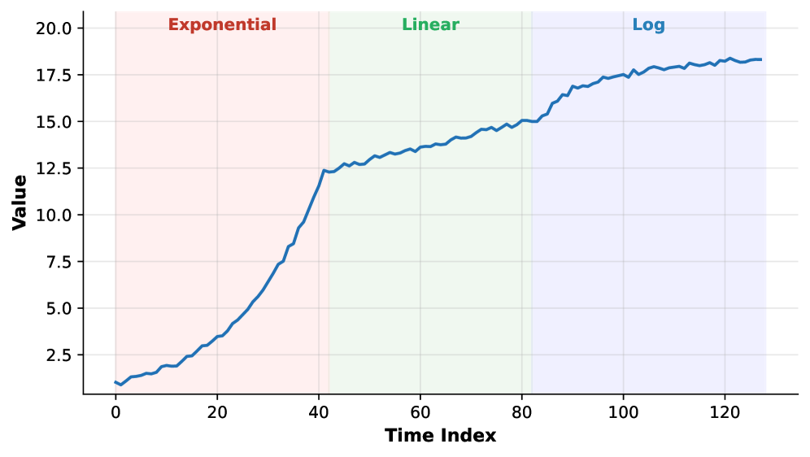
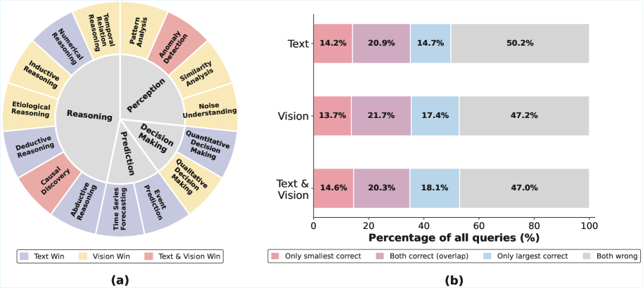
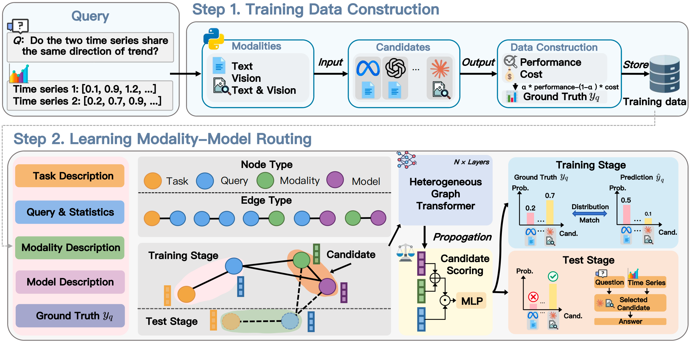
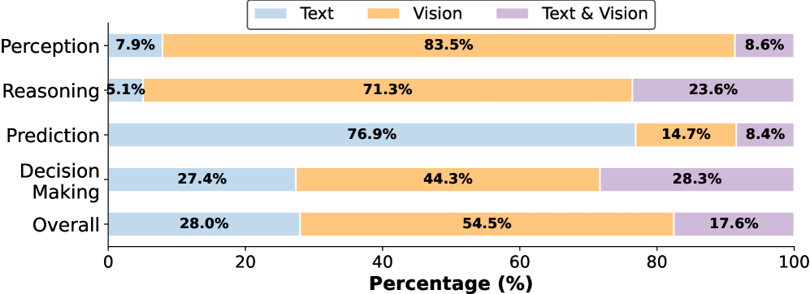
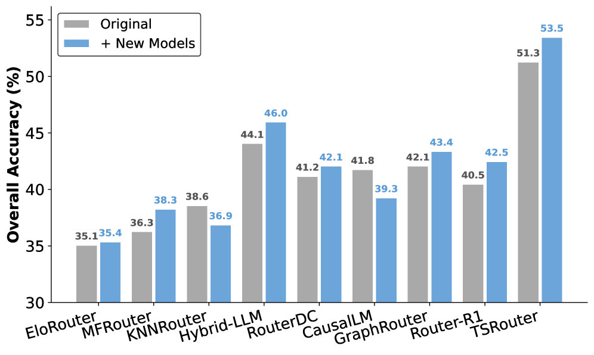
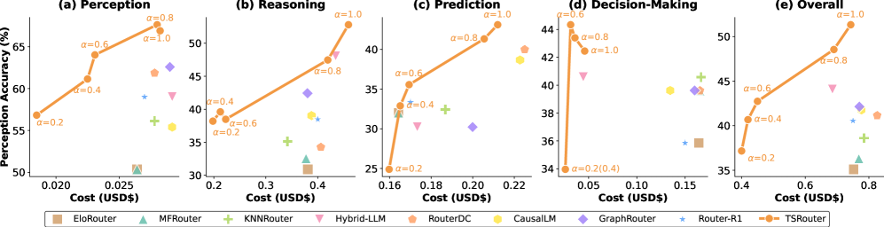

# TSRouter：为时间序列推理动态选择“输入模态 × 模型”

> Fangxu Yu, Tao Feng, Dehai Min, Lu Cheng, Ge Liu, Tianyi Zhou  
> *TSRouter: Dynamic Modality-Model Selection for Time Series Reasoning*  
> arXiv:2607.08940v2，COLM 2026  
> 论文：[arXiv](https://arxiv.org/abs/2607.08940) ｜ [HTML 全文](https://arxiv.org/html/2607.08940v2) ｜ [代码](https://github.com/tianyi-lab/TSRouter)

**一句话结论：** 对时间序列问题，最优方案往往不是固定使用某种输入形式，也不是永远调用最大的模型；TSRouter 学习为每条问题联合选择合适的**时间序列表示方式**和**基础模型**。

## 10 分钟时间安排

| 时间 | 内容 | 要让听众记住什么 |
|---|---|---|
| 0:00–1:00 | 问题与结论 | 文本和图像各有优势，模型之间也互补 |
| 1:00–2:30 | 两个动机观察 | “选模态”和“选模型”必须同时做 |
| 2:30–6:00 | TSRouter 方法 | 构图、HGT 聚合、候选打分、成本控制 |
| 6:00–8:30 | 实验 | 51.33% 总体准确率，强于所有路由基线 |
| 8:30–9:30 | 局限 | 绝对准确率、oracle 成本、泛化证据仍有限 |
| 9:30–10:00 | 总结 | 它是一种编排框架，而不是新的时间序列大模型 |

---

## 1. 研究问题：同一条时间序列应该“读数字”还是“看图”？（约 1 分钟）

设输入是一条时间序列和一个自然语言问题：

> 序列先快速上升，随后近似线性增长，最后逐渐变平。它经历了哪些趋势阶段？

现有基础模型通常采用三种输入方式：

| 输入模态 | 交给谁 | 优势 | 短板 | 更适合 |
|---|---|---|---|---|
| Text | LLM | 保留每个精确数值 | 序列很长；整体形状难识别 | 外推、插值、数值计算 |
| Vision | VLM | 趋势、拐点、周期一目了然 | 图像分辨率会损失精细数值 | 形状和趋势感知 |
| Text + Vision | VLM | 同时提供局部数值和全局结构 | token 和图像成本更高 | 复杂推理、决策 |



*论文 Figure 9。正确顺序是 Exponential → Linear → Log。论文附录报告：3 个 Text-LLM 全部答错，3 个 Vision-VLM 全部答对；加入文本后，两个原本答对的 VLM 反而答错。这个案例同时说明“模态互补”“更多输入未必更好”和“大模型未必逐题占优”。*

已有路由方法主要回答“用哪个模型”，但通常假定输入模态固定。本文认为，对时间序列而言，**输入表示本身就是路由决策的一部分**。

> **这一页可以直接讲：** LLM 像拿着数据表逐行读，VLM 像看折线图。一个擅长精确数值，一个擅长整体形状，所以不应该预先固定其中一种。

---

## 2. 两个关键观察（约 1.5 分钟）



*论文 Figure 1。左：15 个子任务各自最占优的模态；右：最小与最大模型答对样本的交集。*

### 观察 1：不同任务偏好的模态不同

- **Perception（感知）**：4 个子任务中有 3 个由视觉模态获胜，因为任务主要依赖曲线形状和全局结构。
- **Prediction（预测）**：文本模态更好，因为预测需要保留精确数值。
- **Reasoning / Decision-Making（推理 / 决策）**：没有一种模态始终占优，需要细化到单条 query。

### 观察 2：最大模型并不覆盖小模型的能力

Figure 1(b) 将问题分成“只有小模型答对”“两者都答对”“只有大模型答对”和“两者都错”。三种模态下，两种模型都答对的比例只有约 20%；同时存在相当数量“只有小模型答对”的问题。

因此，始终选择最大模型既不一定最准，也不一定经济。论文最终解决的是：

$$
q=(\text{time series},\ \text{question})
\quad\longrightarrow\quad
c^*=(\text{modality},\ \text{model})
$$

---

## 3. 整体框架：TSRouter 如何工作？（约 2 分钟）



*论文 Figure 2。上半部分构造监督信号，下半部分用异构图学习模态—模型路由。*

框架分为两个阶段。

### 阶段 A：构造训练数据（上半部分）

对每个训练问题，作者让所有合法的“模态 × 模型”候选都回答一次，并记录：

1. 是否回答正确；
2. 输入、输出 token 及 API 成本；
3. 在给定成本偏好下，每个候选的真实效用分数。

这实际上构造了一个 **oracle 路由数据集**：对于训练集中的每道题，事先知道哪些候选能答对、代价是多少。

### 阶段 B：学习路由（下半部分）

TSRouter 将历史交互组织成一张异构图：

| 节点类型 | 初始信息 |
|---|---|
| Task | 任务的范围、要求和能力需求描述 |
| Query | 问题文本 + 时间序列统计摘要 |
| Modality | Text、Vision、Text + Vision 的属性描述 |
| Model | 架构、参数规模、能力和调用成本描述 |

其中，Query 节点不直接编码完整原始序列，而是使用通道数、均值、标准差、最值、趋势方向等统计摘要，再与问题文本拼接。

图中包含 5 类边：

```text
Task ─ Query          同任务的问题共享任务级语境
Query ─ Query         连接 embedding 最相似的 k 个历史问题
Query ─ Modality      建模问题与输入表示的匹配关系
Query ─ Model         建模问题与模型能力的匹配关系
Modality ─ Model      表示合法的模态—模型组合
```

实验采用 $k=60$、两层 HGT、64 维隐藏表示。测试时，把新 Query 节点连接到训练图中的近邻，只需一次前向传播就能产生路由结果。

---

## 4. 核心计算：从异构图到候选排名（约 1.5 分钟）

### 4.1 节点初始化与信息传播

每个节点的文字描述先经过预训练文本 embedding 模型 $\phi$，再投影到统一空间：

$$
\mathbf h_v^{(0)}=\mathbf W\phi(\mathbf x_v)+\mathbf b
$$

Heterogeneous Graph Transformer（HGT）按节点类型和边类型做消息聚合，并加入残差连接：

$$
\mathbf h_v^{(l+1)}=\mathbf h_v^{(l)}+
\operatorname{HGTConv}\!\left(\{\mathbf h_u^{(l)}:(u,r,v)\in\mathcal E\}\right)
$$

直觉上，新问题不仅看自己的文本，还会参考：它属于什么任务、与哪些历史问题相似、不同模态有什么特点、各模型擅长什么。

### 4.2 给“模态 × 模型”候选打分

对问题 $q$、模态 $m$、模型 $\ell$，评分函数为：

$$
s(q,m,\ell)=\operatorname{MLP}\!\left[
\mathbf h_q^{(L)}\odot
\left(\mathbf h_m^{(L)}+\mathbf h_\ell^{(L)}\right)
\right]
$$

- $\mathbf h_m+\mathbf h_\ell$：组合“怎么呈现数据”和“由谁回答”；
- 与 $\mathbf h_q$ 逐元素相乘：衡量这个组合与当前问题的匹配程度；
- MLP 输出候选分数，测试时选择分数最高者。

### 4.3 用一个参数控制准确率与成本

训练标签不是单纯的“答对 / 答错”，而是候选效用：

$$
e(q,c)=\alpha I(q,c)-(1-\alpha)\widetilde{\operatorname{cost}}(q,c)
$$

| 符号 | 含义 |
|---|---|
| $c=(m,\ell)$ | 一个模态—模型候选 |
| $I(q,c)$ | 答对为 1，答错为 0 |
| $\widetilde{\operatorname{cost}}$ | 在候选间 min-max 归一化后的推理成本 |
| $\alpha$ | 用户对准确率的偏好；越大越重视效果 |

- $\alpha=1$：只追求准确率；
- $\alpha$ 较小：更多选择便宜模型；
- 作者将所有候选的效用经过 softmax 得到**软排名标签**，再以 KL 散度训练预测分布，而不是只监督唯一的 top-1 候选。

> **方法部分的核心话术：** 它不是预测“这题属于哪一类”，而是在图中学习“这类题、这种表示和这个模型过去如何相互作用”，最后给所有可用组合排序。

---

## 5. 实验设置与主结果（约 1.5 分钟）

### 数据与模型

- 主实验：TSRBench，共 **4,125** 个样本、4 类任务、15 个子任务；按任务进行 7:1:2 的训练/验证/测试划分。
- 4 类任务：Perception、Reasoning、Prediction、Decision-Making。
- 初始 LLM：Qwen3-8B、Qwen3-32B、Llama-3.3-70B-Turbo。
- 初始 VLM：Qwen3-VL-8B、Qwen3-VL-32B、GLM-4.5V。
- 未见新模型：Qwen3.5-397B-A17B、Kimi-K2.5。
- 主要基线：Largest LLM/VLM、KNNRouter、GraphRouter、Hybrid LLM、RouterDC、CausalLM、Router-R1 等；所有基线都被适配为在“模态 × 模型”候选之间选择。

### 主结果

| 方法 | Perception | Reasoning | Prediction | Decision | Overall | 测试集成本（USD） |
|---|---:|---:|---:|---:|---:|---:|
| Largest LLM | 48.92 | 33.15 | 31.56 | 34.91 | 35.59 | 0.74 |
| Largest VLM | 64.03 | 38.76 | 24.44 | 38.68 | 39.10 | 0.59 |
| GraphRouter | 62.58 | 42.42 | 30.22 | 39.62 | 42.13 | 0.77 |
| Hybrid LLM | 58.99 | 48.03 | 30.22 | 40.57 | 44.07 | 0.76 |
| **TSRouter** | **67.63** | **52.81** | **43.11** | **42.45** | **51.33** | **0.73** |

最强基线 Hybrid LLM 的总体准确率是 44.07%，TSRouter 为 51.33%，即提升 **7.26 个百分点 / 约 16.5% 相对提升**。作者所称的“16%–46%”是相对于不同路由基线的相对提升范围。

一个需要诚实说明的结论是：**路由显著改善了结果，但 51.33% 的绝对准确率并不高，时间序列通用推理仍然很难。**

---

## 6. 模型真的学会“按题选模态”了吗？（约 1 分钟）



*论文 Figure 4。颜色分别表示 Text、Vision 和 Text + Vision。*

- Perception：**83.5%** 路由到 Vision；
- Reasoning：**71.3%** 路由到 Vision，23.6% 使用混合模态；
- Prediction：**76.9%** 路由到 Text；
- Decision-Making：三种模态分布最均衡。

这与论文开头的动机一致：看整体形状时偏视觉，精确数值外推时偏文本，而决策问题常同时需要两者。

### 新模型即插即用



*论文 Figure 3。灰色为原始模型池，蓝色为加入两个训练阶段未见模型后的结果。*

将 Qwen3.5-397B-A17B 和 Kimi-K2.5 作为新节点加入后，TSRouter 无需重新训练，准确率从 **51.3% 提升到 53.5%**。部分基线加入新模型后反而下降，说明它们无法可靠判断新候选的能力。

论文还在两个未见任务上测试：

| 方法 | 相关性预测 Accuracy ↑ | 插值 MSE ↓ | 插值 MAE ↓ |
|---|---:|---:|---:|
| 最强基线 | 29.59 | 0.60 | 0.46 |
| **TSRouter** | **31.38** | **0.56** | **0.43** |

这里的“零样本泛化”依赖任务/模型的文字描述 embedding 和已学到的图结构关系，而不是获得了新模型的真实历史正确率。

---

## 7. 成本控制、消融与效率（约 1 分钟）



*论文 Figure 5。橙色折线为不同 $\alpha$ 下的 TSRouter；其余散点为基线。*

随着 $\alpha$ 减小，路由器逐渐选择更便宜的候选，成本明显下降、准确率适度下降。作者报告 TSRouter 在各类任务上形成了优于基线的准确率—成本前沿。

### 哪些组件最重要？

| 变体 | Overall | 相对完整模型下降 |
|---|---:|---:|
| **完整 TSRouter** | **51.33** | — |
| 将异构图改为同构图 | 46.25 | -5.08 |
| 去掉 Query–Query 近邻边 | 48.55 | -2.78 |
| 用点积替代 MLP 评分头 | 46.52 | -4.81 |
| 合并 Modality–Model 节点结构 | 47.33 | -4.00 |

消融结果说明，性能主要来自**显式建模多种关系的图结构和候选交互**，而不只是文本 embedding。附录中即便去掉 LLM 生成的详细节点描述，总体准确率也只从 51.21% 降到 50.50%。

### 路由器本身的效率

| 路由器 | 每条 query 延迟 | 显存 |
|---|---:|---:|
| CausalLM | 910.78 ms | 33,400 MiB |
| Hybrid LLM | 27.65 ms | 29,299 MiB |
| GraphRouter | 4.02 ms | 1,433 MiB |
| **TSRouter** | **3.21 ms** | **576 MiB** |

这些数字只统计“选择候选”的路由开销，不包括被选中 LLM/VLM 的生成时间。

---

## 8. 如何评价这篇论文？（约 1 分钟）

### 我认为它做得好的地方

1. **问题定义有价值**：第一次把“选输入模态”和“选模型”统一成一个 query-level 路由问题。
2. **方法与问题匹配**：任务、问题、模态和模型天然是多实体、多关系结构，异构图比单独的 query 分类器更自然。
3. **工程上轻量**：不用重新训练基础模型，路由器延迟和显存很低，还能通过 $\alpha$ 调节成本。
4. **实验链条比较完整**：主结果、成本曲线、新模型、新任务、消融和效率均有覆盖。

### 需要保留意见的地方

1. **绝对效果仍有限**：51.33% 说明它更像“改善调用策略”，而不是解决时间序列推理。
2. **构造 oracle 的前期成本高**：训练前要让每个候选跑过所有训练问题；模型池越大，组合数量和评测成本越高。
3. **泛化验证规模较小**：新模型只有 2 个，新任务只有 2 个，尚不足以证明在快速变化的大模型生态中稳定即插即用。
4. **主实验集中在一个 benchmark**：真实金融、医疗、工业场景的序列噪声、缺失和分布漂移更复杂。
5. **视觉表示较单一**：论文统一使用 100 PPI 折线图；对 K 线、频谱图、事件图或不同绘图风格的鲁棒性没有充分检验。
6. **统计置信度不充分**：主结果表以单点数值为主，缺少多次运行方差或显著性检验。

---

## 9. 结束页：三句话带走（约 30 秒）

1. **模态是模型能力的一部分**：同一数据用数字还是图像呈现，会改变模型能否答对。
2. **最大模型不等于每题最优模型**：模型之间存在明显的样本级互补，值得动态路由。
3. **TSRouter 的核心贡献是联合编排**：用异构图学习 Task–Query–Modality–Model 的关系，在准确率和成本之间选择最佳候选。

> **推荐结束语：** 这篇论文没有再造一个时间序列大模型，而是换了一个系统视角：当已有模型各有所长时，真正重要的问题可能不是“哪个模型最强”，而是“面对当前这道题，应该把数据变成什么形式，再交给谁”。

---

## 备选问答

### Q1：为什么不用一个同时接收文本和图像的统一大模型？

统一模型的训练和部署成本更高，而且混合输入并不对每道题都有帮助。TSRouter 的定位是复用现成模型，根据问题按需选择。

### Q2：为什么一定要用图神经网络？

这不是数学上的必需，但任务、问题、模态和模型本身构成多类型实体关系。消融中改成同构图后，总体准确率由 51.33% 降到 46.25%，说明区分关系类型确实有贡献。

### Q3：新模型完全不评测就能可靠路由吗？

不能保证。论文通过模型公开描述的 embedding 推断其能力，实验证明两个新模型上有效，但这仍是有限证据；真实部署中最好先用少量探测样本校准。

### Q4：这个框架最适合什么场景？

适合同时拥有多个 LLM/VLM、请求量较大、模型成本差异明显，并且可以离线积累候选表现数据的系统。若只有一个模型或调用量很小，维护路由器未必划算。

### Q5：为什么总体准确率只有 51.33%，还值得研究？

因为论文比较的是相同候选模型池下的调用策略：不改变基础模型，仅靠路由便将最强基线的 44.07% 提升到 51.33%。它说明模型组合中仍有未被利用的互补能力，但也提醒我们不要把路由提升误解为任务已经解决。

---

## 图表与数据出处

- 文中 Figure 1–5 均来自论文原图；框架图使用作者代码仓库提供的高清版本。
- 主实验数据：论文 Table 3。
- 新任务泛化数据：论文 Table 4。
- 消融数据：论文 Table 5 和 Appendix Table 7。
- 效率数据：论文 Appendix Table 8。
- 本文档依据 arXiv v2（2026-07-18）整理。
