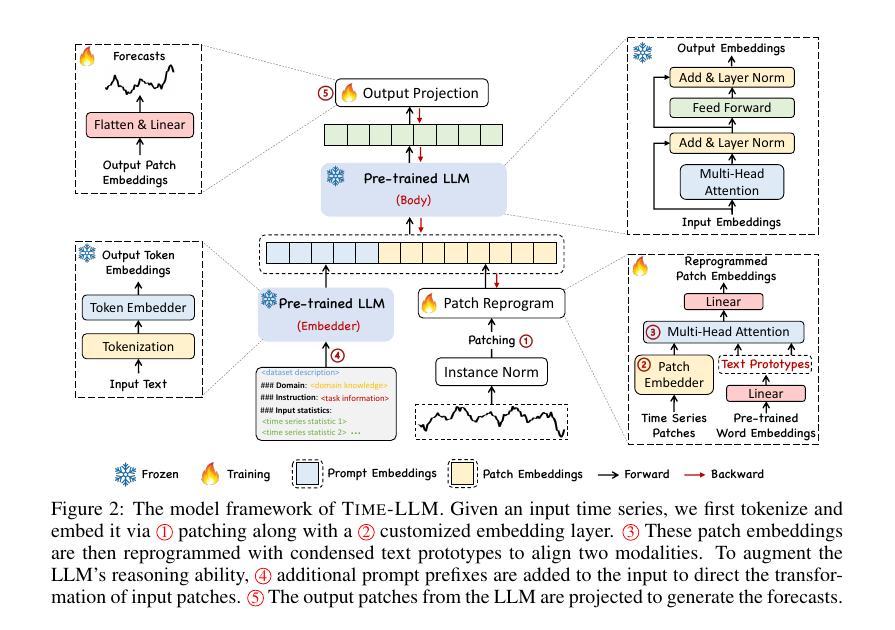
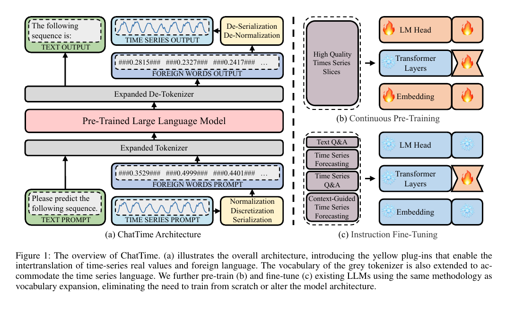
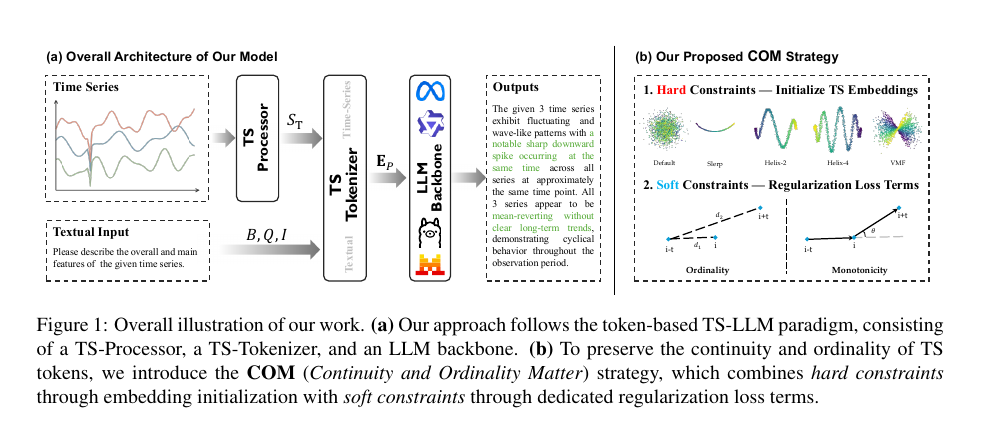
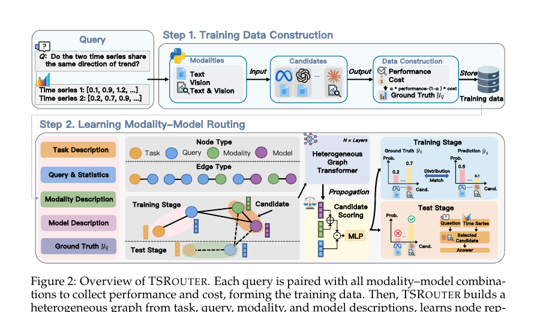

# 时序大模型技术路线与下一步计划

> 汇报时间：2026-08-25  
> 主题：多模态时序编码、纯文本数值建模、数字词表扩展与动态路由

## 一页结论

当前“时序 + 大语言模型”大致存在两条主路线：

1. **时序编码器路线**：时间序列先经过 patching、时序编码器或 projector，转换为少量 LLM-compatible embeddings，再与文本 token 一起进入 LLM。优点是适合长序列和多变量数据、能压缩上下文；缺点是需要额外的跨模态对齐，且 encoder 可能损害数值精度、输出成功率或推理效率。
2. **纯文本路线**：把数值按固定格式直接序列化进 prompt，完全沿用原始 tokenizer 和 LLM。优点是实现简单、数值透明、零样本可用；缺点是 token 开销大，对数值格式、tokenizer 和噪声非常敏感，长序列很快触及上下文与 KV-cache 上限。

建议把两个 TODO 合并成一条连续演进路线：

- **第一阶段：数字扩词表。** 复现 ChatTime 的“一值一 token”，再引入 COM 的连续性/序数约束，解决普通 vocabulary expansion 随机初始化破坏数值结构的问题。
- **第二阶段：双表示路由。** 先做 `raw numeric text` 与 `TS encoder tokens` 的两专家路由；验证成立后，再把“一值一 token”的数值词表路径加入，形成从“精确但昂贵”到“压缩但有损”的三档表示。
- **研究定位不能只写“按长度设置阈值”。** 更有说服力的表述是：在同一共享 LLM 内，根据真实 token 成本、任务语义、信号复杂度和系统预算，动态选择数值文本或压缩时序表示，并最小化相对逐样本 Oracle 的质量-成本 regret。

一个必须提前处理的风险是：**TSRouter 已是 COLM 2026 论文名**，且已经研究了时序文本/图像/混合模态与模型的联合路由。建议项目暂用 `DualRep-TS`、`RepRoute-TS` 或 `TimeSwitch`，不要继续用 `TS-Router` 作为论文名。

---

## 1. 研究问题与分类口径

本文把“多模态时序模型”限定为：**数值时间序列和自然语言使用不同的输入前端，时间序列经独立编码或投影后，以 embedding/token 形式与文本共同进入 LLM。** 这一定义包含 Time-LLM、TEST、ChatTS、OpenTSLM、CALF 等；不把仅借用 Transformer 架构、但不使用语言权重或文本能力的纯时序基础模型算作同一类。

三种表示可以放在同一个“信息率-压缩率”坐标上：

| 表示 | 单个时间点的输入成本 | 数值精度 | 长序列能力 | 需要训练 | 典型方法 |
| --- | --- | --- | --- | --- | --- |
| 原始数值文本 | 与位数、符号、分隔符和 tokenizer 有关，通常最高 | 高，可保留原字符串 | 弱 | 可不训练 | LLMTime、PromptCast、LSTPrompt |
| 数值专用 token | 通常约 1 token/值 | 取决于量化粒度 | 中 | 需扩展 embedding/LM head | ChatTime、COM；Chronos 是相邻参照 |
| TS encoder latent | 与 patch 数或固定 latent 数有关，压缩率最高 | 由 encoder/对齐决定 | 强 | 需 encoder 与跨模态对齐 | TEST、Time-LLM、ChatTS、OpenTSLM |

这张表也是后续 router 的核心：路由不是简单选择“哪个模型更强”，而是在不同表示率、信息损失和系统成本之间做样本级选择。

---

## 2. 路线一：时间序列单独经过时序编码器

### 2.1 通用架构

典型流程为：

```text
Time Series
  -> normalization / patching
  -> TS encoder / patch embedder / projector
  -> LLM-compatible temporal tokens
  -> concatenate or cross-attend with text tokens
  -> frozen or lightly tuned LLM
  -> text answer / numerical forecast
```

这条路线真正的技术难点不是“加一个 encoder”，而是三层对齐：

1. **输入分布对齐**：让 temporal embeddings 落入 LLM 可处理的数值范围与表示空间；
2. **中间特征对齐**：避免时序 token 经过多层 LLM 后逐渐偏离文本语义空间；
3. **输出目标对齐**：预测、分类、问答和解释需要不同的 head 或生成协议。

### 2.2 代表工作

| 工作 | 主要机制 | LLM 使用方式 | 与本项目的关系 |
| --- | --- | --- | --- |
| [One Fits All / GPT4TS, NeurIPS 2023](https://proceedings.neurips.cc/paper_files/paper/2023/hash/86c17de05579cde52025f9984e6e2ebb-Abstract-Conference.html) | patch embedding 接入冻结的预训练 Transformer 主体 | 冻结 self-attention/FFN，训练输入输出层 | 早期“把 LLM 当通用序列骨干”的基线 |
| [Time-LLM, ICLR 2024](https://arxiv.org/abs/2310.01728) | patch embedding 经 cross-attention 重编程到文本原型，并加入 Prompt-as-Prefix | 冻结 LLM 主体，训练重编程层和输出投影 | 编码器/重编程路线的经典架构 |
| [TEST, ICLR 2024](https://proceedings.iclr.cc/paper_files/paper/2024/hash/a4352e2c9d93582898a2a20e1f514e8f-Abstract-Conference.html) | 独立 TS tokenizer 与 encoder；通过 instance、feature、text-prototype contrast 对齐 | 冻结 LLM，加入 soft prompt | 与“时间序列单独过 encoder”定义最吻合 |
| [UniTime, WWW 2024](https://doi.org/10.1145/3589334.3645434) | domain instruction + Language-TS Transformer | 联合建模领域文本与时序特征 | 强调跨领域统一预测 |
| [AutoTimes, NeurIPS 2024](https://proceedings.neurips.cc/paper_files/paper/2024/hash/dcf88cbc8d01ce7309b83d0ebaeb9d29-Abstract-Conference.html) | 把时序片段投影到语言 token 空间并自回归生成未来片段 | 冻结 decoder-only LLM，仅训练少量参数 | 保留 LLM 原生 next-token 机制，支持可变预测长度 |
| [CALF, AAAI 2025](https://ojs.aaai.org/index.php/AAAI/article/view/34082) | temporal target branch 与 textual source branch 做输入、层间特征和输出三级对齐 | cross-modal fine-tuning | 提醒我们不能只做输入 projector |
| [ChatTS, PVLDB 2025](https://arxiv.org/abs/2412.03104) | patch 后使用 5-layer MLP 编码到文本 embedding 空间，并插入对应文本位置 | 与文本指令联合训练 | 适合做时序推理 encoder 分支的直接基线 |
| [OpenTSLM, 2026](https://arxiv.org/abs/2510.02410) | SoftPrompt 或 Flamingo cross-attention，把任意长度时序作为原生模态 | 多模态推理 LLM | 已给出短序列/长序列的架构交叉证据 |



*图 1：Time-LLM 的 patching、reprogramming、Prompt-as-Prefix 与输出投影。来源：[Time-LLM Figure 2](https://arxiv.org/abs/2310.01728)，论文原图节选。*

### 2.3 优势与问题

优势：

- **上下文压缩**：输入 token 数由原始字符串长度变为 patch/latent 数，适合长序列、多变量和高采样率信号。
- **结构归纳偏置**：专用 encoder 更容易学习周期、趋势、局部形态、跨变量相关性。
- **便于接入文本上下文**：时序 embeddings 与问题、事件、报告、元数据等文本共同进入 LLM。

问题：

- **对齐成本高**：仅把维度投影到 `d_model` 并不等于 LLM 真正理解了时序表示；CALF 的结果说明深层特征分布也可能失配。
- **精确数值可能丢失**：patch/压缩对全局形态友好，但对精确索引、局部极值和原始数值问答未必友好。
- **LLM 贡献需要单独验证**：[Are Language Models Actually Useful for Time Series Forecasting?, NeurIPS 2024](https://proceedings.neurips.cc/paper_files/paper/2024/hash/6ed5bf446f59e2c6646d23058c86424b-Abstract-Conference.html) 在三个代表方法上发现，移除 LLM 或换成简单 attention 往往不降反升。因此不能只用 forecasting MSE 证明“LLM 有效”，还要证明文本交互、跨任务泛化或推理能力来自语言模型。
- **工程实现可能不占优**：额外 encoder 路径未必能直接复用成熟的 LLM 推理 kernel，压缩 KV-cache 不等于端到端更快。

---

## 3. 路线二：把数值序列直接拼接到 prompt

### 3.1 通用架构

```text
[0.123, 0.217, 0.351, ...]
  -> scaling / rounding / delimiter design
  -> ordinary text tokenizer
  -> LLM next-token prediction or instruction following
  -> parse generated numbers / answer
```

这条路线没有独立时序 encoder，模型看到的是普通文本 token。它的关键不在复杂网络，而在**数值规范化、精度、分隔符、tokenizer 和输出解析协议**。

### 3.2 代表工作

| 工作 | 主要做法 | 价值 | 主要限制 |
| --- | --- | --- | --- |
| [PromptCast, TKDE 2023](https://arxiv.org/abs/2210.08964) | 把历史值与预测问题改写为 sentence-to-sentence 任务 | 建立 prompt-based TS forecasting 范式 | 依赖模板与语言生成，数值表示未专门优化 |
| [LLMTime, NeurIPS 2023](https://arxiv.org/abs/2310.07820) | 数字按字符序列化；对 GPT 用空格强制逐 digit tokenization；采样多个续写形成概率预测 | 证明纯文本零样本预测可行，并强调 tokenizer 决定成败 | token 成本高；上下文仅能容纳有限观测；校准和噪声鲁棒性不足 |
| [LSTPrompt, Findings of ACL 2024](https://aclanthology.org/2024.findings-acl.466/) | 把预测拆成 short-term 与 long-term 子任务，使用不同提示规则 | 说明 prompt 也可以显式注入时序机制 | 仍未解决长数值串的上下文成本 |
| [TimeOmni-1, ICLR 2026](https://arxiv.org/abs/2509.24803) | 数值文本直接进入 Qwen，面向感知、因果、预测和决策任务进行 SFT/RL | 与当前“纯文本时序推理”场景最接近 | 数字格式与 token 数强相关；极长和高维输入仍受限 |
| [Revisiting LLMs as Zero-Shot Time-Series Forecasters, ACL 2025](https://aclanthology.org/2025.acl-short.71/) | 系统测试纯 prompt 零样本预测的噪声敏感性 | 给出重要负结果与稳健性测试协议 | 表明“零训练直接预测”不能作为唯一主线 |

LLMTime 给出的典型处理是：固定精度、去掉冗余小数点、用逗号分隔时间步，并针对不同 tokenizer 决定是否给 digit 加空格。例如：

```text
0.123, 1.23, 12.3, 123.0
-> "1 2, 1 2 3, 1 2 3 0, 1 2 3 0 0"
```

这说明“序列长度”不能只按时间步 `T` 衡量。真正决定上下文和 KV-cache 的是：

```text
actual_input_tokens = tokenizer(serialized_time_series + question + metadata)
```

### 3.3 优势与问题

优势：

- 无需新增 encoder，训练和部署链路最简单；闭源 API 也可直接使用。
- 原始数值、缺失符号、单位和文字背景都可放在同一 prompt 中。
- 非常适合作为短序列、精确数值问答和 router 的低门槛专家。

问题：

- 一个数值可能被切成多个不稳定 token；轻微数值变化会触发完全不同的 BPE 分词。
- token 数与小数位、正负号、科学计数法、分隔符和 tokenizer 强耦合。
- LLMTime 在其设置中约只能放入约 300 个观测点；ACL 2025 的复现实验进一步显示，小噪声就可能显著破坏零样本预测。
- 对长序列的全局周期和形态理解通常弱于专用 encoder 或图像/压缩表示。

---

## 4. TODO 3.1：把数字扩展到词表

### 4.1 ChatTime：把时间序列当成一门“外语”

[ChatTime, AAAI 2025](https://ojs.aaai.org/index.php/AAAI/article/view/33384) 对连续值做 normalization、uniform discretization 和 serialization，把 `[-1, 1]` 划分为 10K 个 bins，并把每个 bin 的中心值作为带 `###` 标记的专用词加入 tokenizer vocabulary；同时加入 `###Nan###` 处理缺失值。扩展 embedding layer 与 LM head 后，模型既能输入/输出时序 token，也能保留文本生成能力。

论文中的示例显示，对 4 个四位小数，普通 GPT tokenizer 需要 34 tokens、LLaMA 需要 22 tokens，而 ChatTime 需要 7 tokens（含分隔）；其核心效果是把复杂度从“每个数字的多个字符 token”降到“约每个值一个专用 token”。



*图 2：ChatTime 的 expanded tokenizer、连续预训练与指令微调。来源：[ChatTime Figure 1](https://arxiv.org/abs/2412.11376)，论文原图节选。*

这条路线比纯文本更紧凑，但有四个必须正面处理的问题：

1. **量化误差**：一值一 token 的代价是把连续域离散化；bin 数越大，embedding/LM head 增量越大。
2. **尺度与越界**：只依据历史窗口做缩放时，未来值可能超出历史范围，需要 buffer、clipping 或动态 scale token。
3. **新 token 冷启动**：随机初始化的 TS token embeddings 不包含“相邻数值应相近”的先验。
4. **数值输出约束**：生成任务要限制模型只在合法 TS token 范围内采样，否则会混入普通文本或非法格式。

### 4.2 COM：扩词表还不够，embedding 必须连续且有序

你给出的第二篇论文 [Continuity and Ordinality Matter（COM）, arXiv:2605.28866](https://arxiv.org/abs/2605.28866) 正好指出 ChatTime 类方法的下一层问题：时间序列 token 与普通词不同，天然具有**连续性**和**序数性**。若新 token 使用独立高斯随机初始化，数值相近的 token 在 embedding 空间可能相距很远，数值大小顺序也可能被打乱。

COM 的做法分为两部分：

- **硬约束初始化**：把 TS embeddings 初始化到连续、有序、低维的 manifold 上，例如 PCA 主轴、Slerp 或 Helix；
- **软约束训练**：加入 ordinality loss 与 monotonicity loss，使相邻数值的距离和位移方向保持有序、平滑。

其总损失可概括为：

$$
\mathcal{L}=\mathcal{L}_{CE}+\lambda_{ord}\mathcal{L}_{ord}+\lambda_{mono}\mathcal{L}_{mono}.
$$



*图 3：COM 的 token-based TS-LLM 与硬/软几何约束。来源：[COM Figure 1](https://arxiv.org/abs/2605.28866)，论文原图节选。*

COM 在 TSQA 初始化对比中报告：PCA-Main 平均准确率为 91.23%，随机默认初始化为 50.04%；打乱 PCA-Main 的 token 顺序后降到 50.71%。这组结果强烈支持“序数性是关键”，但它目前是 2026 年 arXiv 预印本，数值应表述为该论文特定数据和设置下的结果，不能直接外推为所有时序任务上的固定增益。

### 4.3 推荐实现

最小版本建议直接采用：

```text
raw value
  -> robust scaling（记录 scale/offset）
  -> uniform or learned quantization
  -> <ts_0000> ... <ts_9999>
  -> ordered manifold initialization
  -> CE + local/global ordinality regularization
  -> constrained decoding
```

必须做的消融：

- 普通 digit text vs ChatTime-style TS tokens；
- 1K / 4K / 10K bins；
- random init vs PCA-Main/Slerp init；
- 无正则 vs ordinality vs monotonicity vs 两者；
- 同一原序列在不同 scale、offset、精度和噪声下的鲁棒性；
- 预测任务与 TSQA/推理任务分开评估。

[Chronos, TMLR 2024](https://mlanthology.org/tmlr/2024/ansari2024tmlr-chronos/) 可作为相邻基线：它同样把缩放、量化后的时序值映射到固定词表并用交叉熵训练 T5 架构，但目标是训练时序基础模型，不强调保留预训练文本 LLM 的双模态能力。

---

## 5. TODO 3.2：短序列走文本，长序列走时序编码器

### 5.1 为什么这个方向合理

两条路径存在明确的结构性互补：

| 维度 | 文本路径 | Encoder 路径 |
| --- | --- | --- |
| 精确数值 | 强，字符串可直接检查 | 取决于 patch/压缩，可能丢失细节 |
| 全局形态 | 长序列时较弱 | 强，具备时序归纳偏置 |
| 上下文成本 | 随真实 token 数线性增长 | 可固定为 K 个 latent tokens |
| 训练成本 | 可零训练或直接 SFT | 需要 encoder、projector 与 alignment |
| 工程成熟度 | 可直接使用 LLM serving | 需额外 kernel/批处理优化 |
| 适合任务 | 短序列、精确值、简单问答 | 长/多变量、全局模式、复杂形态 |

OpenTSLM 已给出相邻证据：SoftPrompt 对短序列更简单，但其内存随序列增长；Flamingo cross-attention 在长序列上保持稳定内存并取得更好表现。SciTS/TimeOmni 则面向长度从 $10^0$ 到 $10^7$ 的科学时序，在 encoder 内部按输入规模选择不同 patch expert。这些工作支持“表示应随规模变化”，也意味着**仅用 raw length 设一个阈值已经偏增量**。

### 5.2 现有 TimeOmni-1 对比给出的真实信号

TimeOmni-1 Appendix F.3 在同一 Qwen2.5-Instruct-14B 基座上比较了 text-based 与从头训练的 ChatTS-style embedding encoder。选取几项关键结果：

| 指标 | Text | Encoder | 结论 |
| --- | ---: | ---: | --- |
| Task 1 ID ACC | 74.2 | 88.5 | Encoder 在这一感知任务更强 |
| Task 2 ID ACC | 49.5 | 40.3 | Text 更强 |
| Task 4 ID ACC | 38.9 | 18.2 | Text 明显更强 |
| Task 4 OOD 有效回答率 | 99.0% | 51.9% | Encoder 存在严重 instruction-following/输出失败 |
| 平均推理时间/样本 | 7.07 s | 22.01 s | 当前实现中 encoder 约慢 3.11 倍 |
| 峰值显存 | 51.77 GB | 32.04 GB | Encoder 节省 19.73 GB |

这组结果说明**存在质量与系统成本的互补**，但不能推出“长度决定赢家”：Task 1 平均长度约 316.3，encoder 最强；Task 4 长度固定为 48，却是 encoder 退化最明显的任务。任务类型、输出格式、alignment 数据量与工程实现同时变化，必须在同一任务内做长度控制实验。

### 5.3 必须规避的直接先例：TSRouter

[TSRouter: Dynamic Modality-Model Selection for Time Series Reasoning](https://arxiv.org/abs/2607.08940) 于 2026 年 7 月更新，已被 COLM 2026 接收。它为每个查询动态选择：

- 输入模态：数值文本、时序图像或文本+图像；
- 模型：不同 LLM/VLM；
- 目标：正确率与归一化推理成本的加权效用。

方法把 task、query、modality、model 建成异构图，用 Heterogeneous Graph Transformer 编码，并用候选评分与 soft target 学习路由。论文报告相对多种基线有 16%–46% 的相对提升。



*图 4：COLM 2026 TSRouter 的训练数据构建和异构图路由。来源：[TSRouter Figure 2](https://arxiv.org/abs/2607.08940)，论文原图节选。*

与我们设想的差异仍然清楚：

| COLM 2026 TSRouter | 拟做的 DualRep-TS |
| --- | --- |
| 候选是文本/图像/混合模态与不同外部模型 | 候选是同一共享 LLM 内的 raw text 与 TS encoder latent |
| 主要针对时序 reasoning 的模态和模型选择 | 主要研究精确数值与长序列压缩的 crossover |
| 查询图、模型描述和 API 成本驱动 | 真实 token 数、任务、信号复杂度和显存/延迟预算驱动 |
| 不直接研究 encoder 压缩损失 | 显式评估 representation rate-distortion 与 Oracle regret |

因此“做路由”本身不能作为创新；创新必须落在**共享 backbone 的双表示选择、精确性-压缩率权衡、逐样本 crossover 证据和预算感知目标**上。

### 5.4 推荐架构：Feasibility-first Dual-Representation Router

#### 第一层：不可学习的可行性保护

先用最终 tokenizer 计算实际输入 token 数。若文本路径会超过上下文、KV-cache 或延迟预算，直接进入 encoder：

$$
n_{text}+n_{question}+n_{output\_reserve}>C_{context}
\quad\text{or}\quad
\widehat{M}_{text}>B_{memory}
\Rightarrow Encoder.
$$

这一步必须基于 `actual token count`，不能只看 raw time steps。

#### 第二层：学习型路由

候选专家：

- **Text expert**：固定精度与分隔符的原始数值文本；
- **Encoder expert**：预训练/充分对齐的 TS encoder + projector/resampler，压到固定 `K` 个 tokens；
- **Hybrid expert（可选）**：encoder tokens + 少量任务相关原始点、极值、变点或统计量；仅在低置信度时 fallback。

router 输入特征：

- 规模：真实 text tokens、`T`、通道数 `M`、数字精度、缺失率；
- 信号：总变差、谱熵、主要周期、变点密度、异常密度；
- 任务：question embedding、是否要求精确数值/索引、预测或全局形态理解；
- 系统：context、显存、延迟、吞吐与并发预算。

对每个专家定义统一效用：

$$
U_e=Q_e-\lambda_L\widetilde{Latency}_e
-\lambda_M\widetilde{Memory}_e
-\lambda_N\widetilde{Tokens}_e.
$$

离线运行全部专家，以

$$
p_e^*=\operatorname{softmax}(U_e/\tau)
$$

作为 soft oracle target 训练轻量 router。第一版优先使用决策树/XGBoost或两层 MLP，不需要一开始就上图网络或强化学习。

### 5.5 最小可证伪实验

#### Phase 0：先证明专家互补

对每个验证样本同时运行 Text 与 Encoder，统计：

- 两者都对；
- 仅 Text 对；
- 仅 Encoder 对；
- 两者都错；
- invalid rate、输入 tokens、端到端延迟和峰值显存。

计算逐样本 Oracle 相比最佳单专家的提升。**若 Oracle 几乎没有增益，应停止路由方向；若 Oracle 有增益但长度阈值没有增益，说明赢家主要由任务或信号内容决定。**

#### Phase 1：最小基线

1. Text-only；
2. Encoder-only；
3. raw-length threshold；
4. actual-token-count threshold；
5. always-hybrid；
6. learned router；
7. per-sample Oracle 上界。

#### Phase 2：识别长度效应

- 每个任务内部按 actual text tokens 分箱，不把不同任务混成一条长度曲线；
- 对同一原始序列构造裁剪、重采样和延长的 paired variants；
- 覆盖 `≤1K / 1–4K / 4–16K / >16K` token，单变量/多变量，以及精确值、全局模式、预测、决策四类任务；
- 留出未见长度区间、任务或领域测试 OOD 路由泛化。

#### 核心指标

- 任务：all-case accuracy/F1；预测用带失败惩罚的 all-case loss；同时报告有效回答率与条件指标；
- 系统：实际 tokens、encoder/prefill/decode/端到端 p50/p95、吞吐、峰值显存、KV-cache；
- 路由：Oracle hit rate、per-sample regret、ECE、fallback 比例、各长度/任务桶的路径分布；
- 总结：质量-延迟-显存 Pareto 前沿，而不是只报平均准确率。

---

## 6. 推荐的项目叙事

### 6.1 最小版本

> **DualRep-TS：同一 LLM 内的双表示时序路由。** 对短且需要精确数值的输入使用 raw numeric text；对超长、多变量或全局模式任务使用压缩 TS latent；路由器联合考虑真实 token 数、任务语义、信号复杂度和系统预算。

### 6.2 升级版本

把数字扩词表作为中间表示，形成三个专家：

```text
Raw Text     : exact, highest token cost
TS Vocabulary: one token per quantized value, medium cost
TS Encoder    : fixed/low token count, highest compression
```

此时论文问题不再是“长短序列二分”，而是：

> 在不同任务和系统预算下，如何从三种时序表示率中选择最小成本、足够准确的表示？

这一版本能够把 3.1 和 3.2 统一为**任务感知、预算感知的时序表示 rate-distortion routing**，也更容易与现有 TSRouter、OpenTSLM 和 SciTS-TimeOmni 区分。

---

## 7. 近期 TODO

### 优先级 P0：两周内得到是否值得做的答案

1. 固定同一 LLM、同一训练集和输出协议，得到 Text/Encoder 两专家的逐样本结果；
2. 统计 Oracle gap、四象限互补、invalid rate、tokens、延迟与显存；
3. 比较 raw length threshold 与 actual-token threshold；
4. 若 Oracle gap 不显著，不继续训练 router。

### 优先级 P1：数字词表原型

1. 复现 ChatTime 10K-bin vocabulary expansion；
2. 加入 COM 的 PCA-Main/Slerp 初始化和 ordinality loss；
3. 在 tokenizer 成本、数值 QA、趋势/周期/异常理解和预测上对比 digit text；
4. 加噪声、缩放、offset、越界和缺失值压力测试。

### 优先级 P2：学习型路由与论文证据

1. 以 soft oracle utility 训练轻量 router；
2. 加 task embedding、signal statistics 和系统预算，并做逐项消融；
3. 加 Hybrid fallback 和置信度校准；
4. 在 TSR-Suite、TSRBench、SciTS 及自建 matched-length 数据上验证 OOD；
5. 完整报告 Pareto 前沿和路由开销。

---

## 8. 参考文献

1. Zhang et al. [Large Language Models for Time Series: A Survey](https://arxiv.org/abs/2402.01801). IJCAI 2024 survey.
2. Zhou et al. [One Fits All: Power General Time Series Analysis by Pretrained LM](https://proceedings.neurips.cc/paper_files/paper/2023/hash/86c17de05579cde52025f9984e6e2ebb-Abstract-Conference.html). NeurIPS 2023.
3. Jin et al. [Time-LLM: Time Series Forecasting by Reprogramming Large Language Models](https://arxiv.org/abs/2310.01728). ICLR 2024.
4. Sun et al. [TEST: Text Prototype Aligned Embedding to Activate LLM's Ability for Time Series](https://proceedings.iclr.cc/paper_files/paper/2024/hash/a4352e2c9d93582898a2a20e1f514e8f-Abstract-Conference.html). ICLR 2024.
5. Liu et al. [UniTime: A Language-Empowered Unified Model for Cross-Domain Time Series Forecasting](https://doi.org/10.1145/3589334.3645434). WWW 2024.
6. Liu et al. [AutoTimes: Autoregressive Time Series Forecasters via Large Language Models](https://proceedings.neurips.cc/paper_files/paper/2024/hash/dcf88cbc8d01ce7309b83d0ebaeb9d29-Abstract-Conference.html). NeurIPS 2024.
7. Liu et al. [CALF: Aligning LLMs for Time Series Forecasting via Cross-modal Fine-Tuning](https://ojs.aaai.org/index.php/AAAI/article/view/34082). AAAI 2025.
8. Xie et al. [ChatTS: Aligning Time Series with LLMs via Synthetic Data for Enhanced Understanding and Reasoning](https://arxiv.org/abs/2412.03104). PVLDB 2025.
9. Xue and Salim. [PromptCast: A New Prompt-based Learning Paradigm for Time Series Forecasting](https://arxiv.org/abs/2210.08964). TKDE 2023.
10. Gruver et al. [Large Language Models Are Zero-Shot Time Series Forecasters](https://arxiv.org/abs/2310.07820). NeurIPS 2023.
11. Liu et al. [LSTPrompt: Large Language Models as Zero-Shot Time Series Forecasters by Long-Short-Term Prompting](https://aclanthology.org/2024.findings-acl.466/). Findings of ACL 2024.
12. Tan et al. [Are Language Models Actually Useful for Time Series Forecasting?](https://proceedings.neurips.cc/paper_files/paper/2024/hash/6ed5bf446f59e2c6646d23058c86424b-Abstract-Conference.html). NeurIPS 2024.
13. Park et al. [Revisiting LLMs as Zero-Shot Time-Series Forecasters: Small Noise Can Break Large Models](https://aclanthology.org/2025.acl-short.71/). ACL 2025.
14. Ansari et al. [Chronos: Learning the Language of Time Series](https://mlanthology.org/tmlr/2024/ansari2024tmlr-chronos/). TMLR 2024.
15. Wang et al. [ChatTime: A Unified Multimodal Time Series Foundation Model Bridging Numerical and Textual Data](https://ojs.aaai.org/index.php/AAAI/article/view/33384). AAAI 2025.
16. Li et al. [Continuity and Ordinality Matter](https://arxiv.org/abs/2605.28866). arXiv 2026.
17. Guan et al. [TimeOmni-1: Incentivizing Complex Reasoning with Time Series in Large Language Models](https://arxiv.org/abs/2509.24803). ICLR 2026.
18. Wu et al. [SciTS: Scientific Time Series Understanding and Generation with LLMs](https://arxiv.org/abs/2510.03255). ICLR 2026.
19. Langer et al. [OpenTSLM: Time-Series Language Models for Reasoning over Multivariate Medical Text- and Time-Series Data](https://arxiv.org/abs/2510.02410). arXiv 2026.
20. Yu et al. [TSRouter: Dynamic Modality-Model Selection for Time Series Reasoning](https://arxiv.org/abs/2607.08940). COLM 2026.

---

> 图片说明：本文仅保留 4 张与技术路线直接相关的论文原图节选，用于内部学术汇报；版权归原论文作者所有。
