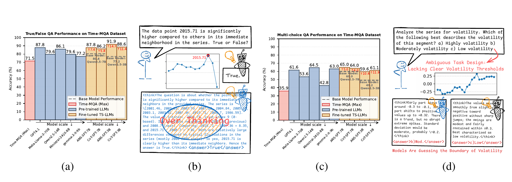
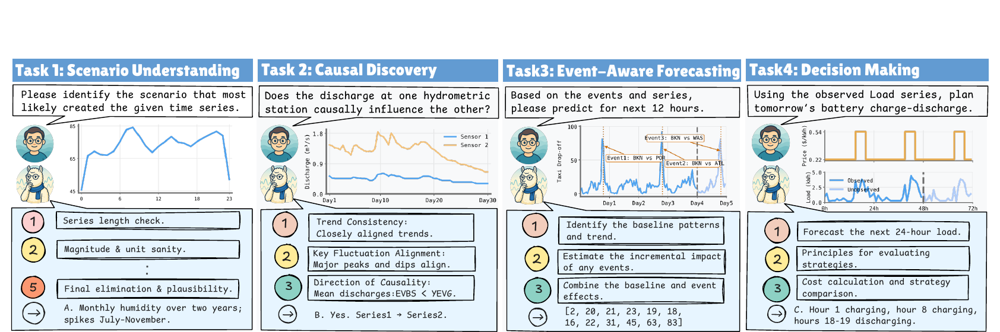
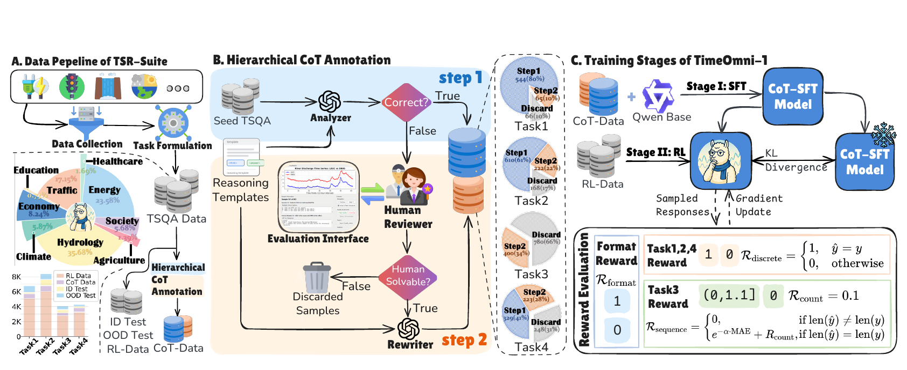
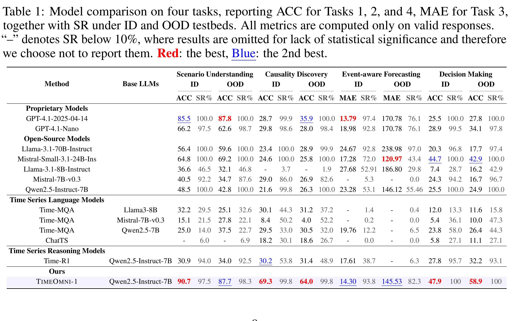

# TimeOmni-1：让大模型对时间序列进行复杂推理

> 论文：**TimeOmni-1: Incentivizing Complex Reasoning with Time Series in Large Language Models**  
> Tong Guan et al.，ICLR 2026  
> [arXiv](https://arxiv.org/abs/2509.24803) · [代码](https://github.com/AntonGuan/TimeOmni-1)

## 1. 一句话概括

这篇论文想解决的不是“让 LLM 看懂一条曲线”这么简单，而是让它沿着 **感知 → 外推 → 决策** 的链条，理解时间序列、结合外部事件预测未来，并在约束下作出行动。

作者为此做了两件事：构建时间序列推理数据集 **TSR-Suite**，并在 Qwen2.5-Instruct-7B 上训练统一模型 **TimeOmni-1**。

## 2. 为什么现有时间序列问答不够

作者认为，很多已有题目存在两种问题：

- **太简单：** 不推理也能答对，强行生成 CoT 反而容易 over-thinking。
- **信息不足：** 题目没有提供足够上下文，模型只能猜答案。

因此，好的时间序列推理题应满足两条原则：

1. **推理是必要的**：会推理的模型应明显优于直接作答的模型。
2. **上下文是充分的**：输入序列和背景信息必须足以唯一支持答案。

*图 1：原文 Figure 1 截图。*

## 3. TSR-Suite：四项任务

TSR-Suite 包含 **23,605 个样本、10 个领域**，用四项任务覆盖三层能力：

| 能力 | 任务 | 核心问题 |
|---|---|---|
| 感知 | 场景理解 | 根据形态、周期和尺度判断序列来自什么场景 |
| 感知 | 因果发现 | 结合多条序列的滞后关系和背景知识判断因果方向 |
| 外推 | 事件感知预测 | 根据历史序列及未来事件预测后续数值 |
| 决策 | 决策制定 | 综合负荷、价格和电池约束选择行动策略 |

*图 2：原文 Figure 2 截图。*

## 4. 方法：先 SFT，再 RL

TimeOmni-1 采用两阶段训练：

1. **CoT-SFT：注入时间序列先验。** 作者用 2,339 条人工引导的分层 CoT，教模型如何识别模式、分析事件和检查决策约束。
2. **GRPO 强化学习：用结果奖励精炼。** 离散任务使用答案正确性奖励，预测任务根据 MAE 和输出长度给奖励，同时检查 `<think>`、`<answer>` 格式。

论文发现，不能跳过第一阶段直接做 RL：以决策任务为例，基础模型准确率为 **25.5%**，直接 RL 降到 **20.2%**，完整两阶段训练则达到 **47.9%**。直观上，SFT 先告诉模型“该怎样思考”，RL 再优化“最终是否做对”。

*图 3：原文 Figure 3 截图。*

## 5. 主要结果

与 GPT-4.1 相比，TimeOmni-1 的优势主要集中在较依赖时间先验的任务：

- **因果发现 OOD：** 64.0% vs 35.9%，高 28.1 个百分点。
- **决策 OOD：** 58.9% vs 27.8%，高 31.1 个百分点。
- **场景理解 OOD：** 87.7% vs 87.8%，基本持平。
- **事件预测 ID：** MAE 14.30 vs 13.79，GPT-4.1 略好。
- **事件预测 OOD：** TimeOmni-1 的 MAE 为 145.53，但 Mistral-Small-3.1-24B 的 120.97 更好。

*表 1：原文 Table 1 截图。*

> **指标提醒：** ACC/MAE 只在格式有效、答案可提取的样本上统计，因此必须和 SR（Success Rate）一起看，不能只比较 ACC 或 MAE。

## 6. 我认为最重要的贡献

- 它先定义“什么题真正需要推理”，再考虑如何训练模型。
- 它把时间序列能力从单一预测扩展为“理解—外推—决策”的完整链条。
- 它验证了少量高质量 CoT 与大规模结果奖励可以互补，而不是只靠堆监督数据。

## 7. 局限

- “因果发现”主要依据河流上下游关系，范围比一般因果发现窄。
- 决策任务仍是从候选策略中选择，不是开放式连续控制。
- 文本序列化只在有限长度和维度上验证，高频、超长、多变量序列仍是开放问题。
- 可读的 CoT 不等于每一步都忠实反映模型的真实决策过程。
- 联合训练并非所有 OOD 划分都提升：决策 OOD 上单任务模型为 63.6%，联合模型为 58.9%。

## 8. 结论

TimeOmni-1 最有价值的地方，不只是训练了一个 7B 模型，而是给出了一条完整路线：**先构造真正需要推理且信息充分的任务，再用高质量 CoT 建立时间先验，最后用可验证的结果奖励强化。**

如果迁移到金融，可以借鉴这种任务链：**识别市场状态 → 分析事件和跨资产关系 → 条件预测 → 在成本与风险约束下决策**。但论文并没有验证真实交易能力，仍需要金融专用数据和严格回测。

---

### 分享时可以直接用的收尾句

> 这篇论文真正推进的，不只是时间序列预测，而是让模型从“看见变化”走向“理解变化、推断未来并采取行动”。
