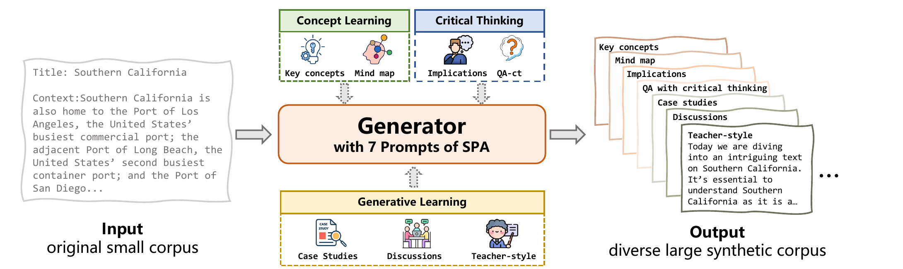
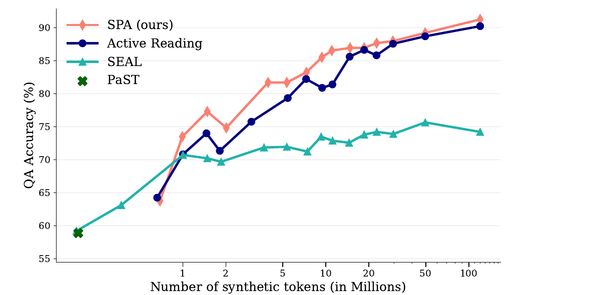

# SPA：一个简单却难以击败的知识注入基线

> **5 分钟汇报｜论文**：[Tang et al., ICML 2026](https://arxiv.org/abs/2603.22213)  
> **一句话结论**：与其把知识注入做成复杂的 RL 或多阶段生成系统，不如用一组经过设计的提示词，把小语料改写成**足够多、足够多样**的合成训练数据；这个简单基线在三个任务上击败了强基线。

---

## 0. 讲述节奏（5:00）

| 时间 | 要讲什么 | 只需让听众记住 |
|---:|---|---|
| 0:00–0:35 | 问题与结论 | 小领域语料少，直接继续训练容易“背表面形式”；SPA 是意外强的简单方案。 |
| 0:35–1:15 | SPA 怎么做 | 用 7 类学习策略提示词，反复把同一小语料改写为多样的大语料。 |
| 1:15–2:05 | 一个合成例子 | 同一段原文被改写成概念、推理与教学等不同样本，随后混合训练。 |
| 2:05–3:30 | 实验结果 | 三个基准上最优；数据规模越大，优势越明显。 |
| 3:30–4:25 | 作者的解释 | RL 方法在大规模时会产生“多样性坍塌”；多阶段方法的中间策略不稳定。 |
| 4:25–5:00 | 评价与 takeaway | SPA 应是今后知识注入研究必须比较的强基线，但还不是最终方案。 |

---

## 1. 它要解决什么问题？（0:00–0:35）

LLM 的通识知识来自海量预训练文本，但医学、金融、法律等领域常只有一小批内部或稀缺文档。若直接对这些小语料继续预训练：

- 语料规模和表达变体都不足；
- 模型容易记住原句的表面形式，而不是可迁移的知识；
- 遇到换一种问法或需要跨文档推理时，效果会变差。

已有方案大致走两条路：

1. **RL 生成**（如 SEAL）：用下游性能做奖励，迭代训练数据生成器；
2. **多阶段提示**（如 EntiGraph、Active Reading）：先产生“阅读/学习策略”，再根据策略生成数据。

**本文的挑战**：这些方案是否真的比“认真写提示词 + 大规模合成”更好？

---

## 2. SPA 是什么？（0:35–1:15）

SPA = **Scaling Prompt-engineered Augmentation**，即“规模化的提示工程数据扩增”。

流程很朴素：

1. 人工设计一组固定的提示词模板；
2. 对每篇原始文本，分别用这些模板反复调用生成模型；
3. 每个模板分配近似相等的 token 预算，合并生成结果；
4. 用合成语料对目标模型做 continued pretraining。

论文使用 **7 个模板**，灵感来自认知科学与教育心理学：

| 学习层次 | 模板 | 生成的知识形态 |
|---|---|---|
| 概念学习 | Key concepts、Mind map | 关键实体、属性与关系结构 |
| 批判性思维 | Implications、QA-ct | 推论、比较、解释逻辑、“假如……会怎样” |
| 生成式学习 | Case studies、Discussions、Teacher-style | 案例迁移、对话讨论、教师式讲解 |

**关键不在某一条神奇 prompt，而在互补的 prompt 池。**

---

## 3. 一个合成样本是怎样产生的？（1:15–2:05）

下面是按论文模板做的**简化示意**（为讲清流程而编写，不是论文中的逐字样本）。假设原始小语料中只有一段：

> **原文**：`港口 A 是该国最繁忙的集装箱港；相邻的港口 B 排名第二；港口 C 服务另一座沿海城市。`

对**完全相同的原文**，生成器会按不同模板分别生成。下面只展示 3 个模板，实际会使用完整的 7 个：

| 步骤 | 输入给生成器的任务 | 得到的一条合成训练样本 | 它让模型学什么 |
|---|---|---|---|
| ① Key concepts | “找出关键概念及其关系。” | `关键实体：港口 A、港口 B、港口 C。关系：A 与 B 相邻；A 的吞吐排名高于 B；C 服务不同城市。` | 实体、属性、关系 |
| ② QA with critical thinking | “只依据原文，提出一个需要比较/推理的问题并作答。” | `问：为何不能仅用“相邻”判断两个港口的重要性？答：相邻仅说明地理关系；原文还给出了 A 和 B 的吞吐排名，重要性应由该属性判断。` | 从事实到理由的推理 |
| ③ Teacher-style | “像老师一样向初学者解释原文，并指出容易混淆处。” | `这段话同时描述了地理关系与业务地位。不要把“服务沿海城市”的 C 与 A、B 的排名关系混为一谈。` | 可迁移的解释与区分 |

**接下来发生什么：**

1. 每一篇原文会在每个模板下重复生成许多条不同表述；
2. 7 类样本按近似相等的 token 预算混合，形成大规模合成语料；
3. 目标模型对这些文本做普通的**下一个 token 预测**继续预训练；
4. 推理时不给原文，模型仍要能回答诸如“哪两个港口相邻？”或“为什么 C 不能据此排在第二？”的问题。

所以 SPA 不是“拿原文换个说法”，而是让同一知识经历**结构化、推理、应用、讨论、讲解**等互补的重表达。给定总预算 $\tilde D$，7 个模板各生成约 $\tilde D/7$ token，最后拼为训练集；整个过程没有训练专门的生成策略，也没有多阶段中间产物。

---

## 4. 实验怎么做？（2:05–2:25）

作者尽量只改变**数据生成策略**，并让各方法的训练 token 数匹配。测试不提供原始文档，考察知识是否已写进模型参数。

| 基准 | 考察能力 | 最大合成规模 |
|---|---|---:|
| SQuAD | Wikipedia 单文档问答 | 120M tokens（原始语料约 4000×） |
| QuALITY | 长文档理解 | 455M tokens（约 350×） |
| MultiHop-RAG | 多跳知识推理 | 15M tokens |

---

## 5. 结果：简单方法在规模上反而更强（2:25–3:30）

### 最终准确率

| 数据集 / 设置 | 代表强基线 | SPA | 结论 |
|---|---:|---:|---|
| SQuAD，Qwen2.5-7B | Active Reading 90.25；SEAL 74.23 | **91.27** | 优于复杂多阶段与 RL 方法 |
| QuALITY，Llama-3-8B | EntiGraph 56.22；Active Reading 51.75 | **57.03** | 用较便宜生成器仍胜出 |
| MultiHop-RAG，Qwen2.5-7B | EntiGraph 85.42；Active Reading 83.33 | **86.64** | 多跳推理也可迁移 |
| MultiHop-RAG，Llama-3-8B | Active Reading 84.44；EntiGraph 84.31 | **88.36** | 跨模型族依然领先 |

### 最有说服力的一张图：扩增规模越大，SPA 越占优

- 低 token 预算时，带下游奖励的 SEAL 可以更高效；
- 规模扩大后，SEAL 明显饱和；
- SPA 一路上升，120M token 时达到 **91.27%**，几乎等于“测试时直接给原文”的 91.38%。

---

## 6. 为什么复杂方法会输？（3:30–4:25）

### 发现 1：RL 生成会发生“多样性坍塌”

SEAL 会不断选择更能提高当前奖励的数据类型，结果生成文本逐渐收敛到少数重复模式。作者用压缩率、自重复率、Self-BLEU、词性序列压缩率衡量，SEAL 在 SQuAD 上四项多样性指标都明显更差；这解释了它的扩展曲线为何早早饱和。

### 发现 2：多阶段 pipeline 的第一步并不稳定

Active Reading 为每篇文档自动先生成“学习策略”，再按该策略扩增。逐文档检查显示：部分自动策略很有效，但不少策略只带来微弱提升，甚至低于基础模型。SPA 的人工 prompt 虽固定，却平均更稳定，并避免了低质量中间策略的误差传递。

### 消融支持“组合效应”

在 SQuAD 的 22M token 设置下，任一单独模板都不如完整 7 模板 SPA，单独使用的相对性能下降 **2.16%–8.73%**。甚至最弱的 `Key concepts`，从完整池中移除后仍会使准确率下降 **1.62%**。

---

## 7. 我的评价与结论（4:25–5:00）

**这篇论文的价值不只是一个方法，而是重新校准比较标准：**

1. 对“小语料知识注入”，应先用一个强的、token 对齐的 prompt-augmentation baseline，再宣称复杂系统有效；
2. “生成质量”不能只看单条样本或小规模收益，**可扩展的多样性**更关键；
3. 更复杂的 RL / 多阶段设计依然可能有价值，但必须在大规模、同预算下证明它们带来的增益超过提示工程本身。

**边界与局限**：论文主要覆盖英文的单文档 QA、长文理解、多跳问答；对强数值推理、快速变化知识、不同语言/专业领域，以及任务已知时如何选择最优 prompt 子集，尚未充分验证。并且它是 2026 年预印本/ICML 论文，结论仍值得在真实垂域上复现。

> **收尾一句**：当知识源很小、训练预算很大时，胜负未必在“能否学会生成策略”，而在“能否持续提供足够多样、彼此互补的学习视角”。SPA 把这件事做得极简单，但足以成为很难绕开的基线。

---

## 备选问答

**Q：这和 RAG 有什么区别？**  
RAG 在推理时检索并提供外部文本；SPA 的目标是把语料知识通过继续预训练写入参数，推理时不访问原文。

**Q：为什么不只生成 QA？**  
QA 是强基线，但只覆盖一种表达/学习形态。SPA 的结果和消融表明，概念结构、推理、案例、讨论、教学式解释的组合更有效。

**Q：能直接用于金融吗？**  
思路可以：将研报、制度、公告等小规模高价值语料扩增后继续训练。但必须特别测数值计算、时效性、事实幻觉和合规性；论文没有直接证明金融场景效果。

---

## 来源

- 论文：[SPA: A Simple but Tough-to-Beat Baseline for Knowledge Injection](https://arxiv.org/abs/2603.22213)，Kexian Tang, Jiani Wang, Shaowen Wang, Kaifeng Lyu，ICML 2026。
- 代码与全部 prompt 模板：[Tangkexian/SPA](https://github.com/Tangkexian/SPA)。
- 本目录的 `SPA.pdf` 是用于截图和核对的论文原文；两张图均从原文 Figure 1、Figure 2 截取。
