# 0.  前言

本文档是大语言模型的常问常考的面试真题，包含答案详解和提示。作者&#x4E3A;**互联网大厂阿里员工**&#x548C;**南京大学硕士**，24年初0基础转行大模型，秋招面试方向：**大模型/多模态大模型/搜广推算法**，拿&#x5230;**多家互联网大厂ssp+，头部计划offer 阿里星，快star，商汤先锋，中兴蓝剑等**。

可按重要等级进行复习。重要等级：**非常重要 ， 重要 ， 一般**。**Transformer章节**&#x662F;大模型的根基重点复习，尤&#x5176;**注意力机制**(单独列了一个章节)，**大模型高效微调尤其是Lora部分**&#x91CD;点复习，如果研究方向是多模态，**多模态大模型章节**&#x4F5C;为非常重要章节复习，否则降低为重要。**推理Reason章节deepseek篇**&#x662F;接下来的热点，重点复习。其他章节根据研究方向来调整重要等级，比如方&#x5411;**agent**，该章节作为非常重要复习，但是其他方向也要有基础的理解。

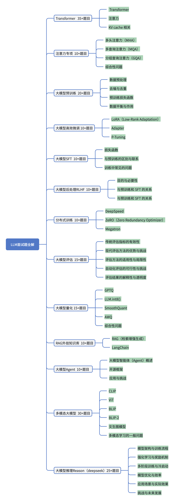

# 1. 提示版

## 1.1 Transformer   35+题目    非常重要

### 1.1.1  Transformer

1. **Transformer模型的基本结构是什么？**

   * 提示：简要描述Transformer模型的整体架构，重点讲解Encoder和Decoder部分的结构和功能。

2. **Transformer为何能够有效地处理长距离依赖问题？与传统RNN和LSTM相比有哪些优势？**

   * 提示：讨论RNN和LSTM的局限性，并解释Transformer是如何通过自注意力机制解决长距离依赖问题的。

3. **decoder-only是encoder，decoder的哪个部分？有什么区别？**

   * 提示：解释"decoder-only"模型的工作原理，并与标准的encoder-decoder结构进行对比，重点讲解两者的区别。

4. **多头注意力的作用是什么？**

   * 提示：解释多头注意力机制的工作原理，讨论它如何通过并行处理多个注意力头来增强模型的表示能力。

5. **能不能手写下self-attention？**

   * 提示：手写self-attention的数学公式，**解释如何计算Query、Key和Value的关系**，并通过这些计算得到注意力权重。

6. **Transformer模型的自注意力机制如何实现并行处理？**

   * 提示：讨论Transformer如何通过自注意力机制实现高效的并行计算，为什么这使得Transformer在长序列上比RNN和LSTM更高效。

7. **在Transformer模型中，位置编码（Position Encoding）的作用是什么，它是如何工作的？**

   * 提示：解释位置编码的必要性，并描述其在Transformer中如何通过加到输入嵌入中来表示序列中的位置信息。

8. **Transformer模型如何处理变长输入序列？**

   * 提示：描述Transformer如何通&#x8FC7;**填充（padding）和掩码（masking）机制**&#x5904;理变长的输入序列。

9. **Transformer模型的缩放点积注意力（Scaled Dot-Product Attention）是什么，其重要性在哪里？**

   * 提示：解释缩放点积注意力的计算过程，并讨论为什么缩放因素是必要的以及&#x5B83;**如何解决梯度消失**&#x7684;问题。

10. **Transformer模型在实践中如何优化以处理超长序列？**

    * 提示：讨论在处理超长序列时常见的优化策略，如局部注意力机制、分段处理、长序列的分布式计算等。

11) **如何理解 Transformer 模型中的“softmax”层？它在模型中起什么作用？**

    * 提示：解释softmax函&#x6570;**如何将注意力权重转换为概率分布**，并讨论它在Transformer中的重要性。

12) **Transformer模型中的自注意力机制在计算效率和表示能力之间是如何权衡的？**

    * 提示：讨论自注意力机制计算&#x7684;**时间复杂度（O(n²)）**&#x5982;何影响模型的效率，并如何通过优化策略提升效率。

13. **Transformer模型的参数共享策略对模型性能有何影响？**

    * 提示：讨论在Transformer中是否以及如何实现参数共享，分析这种策略如何影响模型的表达能力和训练效率。

14. **Transformer encoder和decoder的区别？**

    * 提示：描述Encoder和Decoder的结构差异，特别是Decoder中额外&#x7684;**自回归机制和Masked Attention**&#x7684;作用。

15) **Transformer模型中的前馈网络（Feed-Forward Networks）的作用是什么？**

    * 提示：解释前馈网络在Transformer中的角色，它如何增强模型&#x7684;**非线性表达能力**，以及它如何与自注意力机制配合工作。

16) **Pre-norm和post-norm有什么区别？**

    * 提示：讨论前置归一化（Pre-norm）和后置归一化（Post-norm）在Transformer中的应用，分析它们&#x5728;**训练稳定性和效果上的差异。**

17. **Transformer网络很深，是怎么避免过拟合问题的？**

    * 提示：讨论Transformer如何通过正则化方法（如Dropout、早停）以及层数设计来避免过拟合。

18. **Transformer 的两个mask机制是什么？**

    * 提示：讨论两个mask机制：1) Padding Mask 2) Lookahead Mask，解释它们分别解决的问题和应用场景。

19) **Layer Normalization 和 Batch Normalization 的区别，为什么在 Transformer 中使用 Layer Normalization？**

    * 提示：比较Layer Normalization与Batch Normalization的差异，讨论为什么在Transformer中更倾向于使用Layer Normalization。

20) **Encoder和decoder是如何进行交互的？**

    * 提示：解释在Transformer模型中，Encoder和Decoder之间是如何通过注意力机制进行交互的，**重点讲解cross-attention的过程。**

21. **在多头注意力中，为什么要将每个头的输出连接在一起而不是直接求和？**

    * 提示：讨论将每个注意力头的输出连接在一起的设计原因，解释这种设计如何帮助模型学习不同的表示，并提高信息的多样性。

### 1.1.2 **注意力**

* **如何提高Transformer模型中自注意力机制的计算效率？**

  * 提示：讨论自注意力机制计算的时间复杂度（O(n²)）以及如何通过优化策略，**如稀疏注意力、低秩近似等**，来提高计算效率。

* **为什么self-attention要除以根号N？有方法不用处理根号N的吗？**

  * 提示：解释为何在计算注意力权重时需要除以根号N，讨论这样做的原因&#x662F;**为了避免梯度消失或梯度爆炸问题**，并探讨是否有其他方法能够替代。

* **Transformer模型中注意力权重如何解释模型的决策？**

  * 提示：讨论如何通过注意力权重的可视化来解释Transformer模型在特定任务中的决策过程，分析模型关注输入序列的哪些部分来做出预测。

* **如何在自注意力机制中平衡局部信息和全局信息的捕获？**

  * 提示：讨论自注意力机&#x5236;**如何通过不同策略（如局部窗口注意力、长短期记忆结合等）**&#x6765;平衡捕获局部和全局信息。

* **基于attention有哪些代表性的改进方法？分别针对的是什么问题**

  * 提示：分析一些基于attention的改进方法（如Linformer、Reformer等），讨论这些改进如何解决自注意力机制中的计算瓶颈、内存消耗或长序列处理等问题。

* **如何结合注意力机制与其他类型的神经网络模块，比如卷积神经网络(CNN)或循环神经网络(RNN)？**

  * 提示：讨论如何将注意力机制与CNN和RNN结合，提升模型的性能，探索它们如何互补地解决不同任务中的局限性，例如在图像处理、语音识别等任务中的应用。

### 1.1.3  **KV cache 相关**

31. **什么是Inference KV Cache，它在Transformer模型的推理过程中有什么作用？**

    * 提示：讨论Inference KV Cache的概念及其在推理过程中的作用，尤其是如何通过缓存键（K）和值（V）&#x6765;**避免在每次步骤中重新计算**，从而提升推理速度和效率。

32. **Inference KV Cache如何与动态解码策略结合？**

    * 提示：解释如何在推理过程中使用Inference KV Cache结合动态解码策略（如自回归生成、束搜索等），并讨论这如何提高生成任务的效率和效果。

33. **&#x20;在Transformer模型中，KV缓存的键（K）和值（V）的维度如何影响检索性能和模型质量？**

    * 提示：讨论KV缓存的键（K）和值（V）的维度对检索效率和模型质量的影响，如何通过调整维度来平衡计算效率和模型性能。

34. **KV缓存是否可以针对多模态Transformer模型中的交叉注意力机制进行优化，如果可以，应该如何实现？**

    * 提示：探讨如何在多模态Transformer模型中优化KV缓存，特别是针对交叉注意力机制进行优化的策略，如共享或分开缓存，不同模态之间的交互和数据处理等。

35. **概率数据结构在Transformer模型操作非常长的序列或大批量大小时，如何扩展KV缓存？**

    * 提示：讨论如何利用概率数据结构（如Bloom Filter、Count-Min Sketch等）扩展KV缓存，以应对处理长序列或大批量数据时的内存和计算挑战。

36. **&#x20;数据库索引技术如何应用于改进Transformer模型中KV缓存的查找和更新操作？**

    * 提示：讨论如何借鉴数据库中的索引技术（如B树、哈希索引等）来改进Transformer中KV缓存的查找和更新操作，提升性能和存储效率。

37. **Transformer模型的注意力机制有哪些改进空间？分别代表的模型有哪些？**

    * 提示：探讨Transformer的注意力机制的改进空间，**讨论一些代表性模型（如Linformer、Reformer、Longformer等）**&#x5982;何在不同方面优化注意力机制以提升效率和处理能力。

## 1.2 注意力专项   10+题目    非常重要

### 1.2.1 多头注意力（MHA）

1. **多头注意力机制的基本原理是什么？**

   * 提示：请解释多头注意力如何通过多个注意力头并行处理信息，从而增强模型的表达能力。

2. **在多头注意力中，为什么要将每个头的输出连接在一起而不是直接求和？**

   * 提示：讨论这种设计如何帮助模型捕捉输入序列的不同特征。

3. **多头注意力的计算复杂度如何？如何优化其效率？**

   * 提示：**分析多头注意力的时间和空间复杂度**，并讨论可能的优化策略。

### 1.2.2 多查询注意力（MQA）

4. **多查询注意力（MQA）与传统的多头注意力（MHA）有何区别？**

   * 提示：请比较两者在键（Key）和值（Value）矩阵的共享策略上的差异，以及这些差异对模型性能的影响。

5. **在多查询注意力中，如何通过共享键和值矩阵来减少显存占用并提升计算效率？**

   * 提示：讨论这种共享策略如何影响模型的内存使用和计算速度。

6. **多查询注意力在实际应用中有哪些优势和局限性？**

   * 提示：请分析在不同任务和模型规模下，MQA的表现如何，以及可能的改进方向。

### 1.2.3 分组查询注意力（GQA）

7. **分组查询注意力（GQA）的基本概念是什么？**

   * 提示：请解释GQ&#x41;**如何通过将查询头分组来共享键和值矩阵**，从而在性能和效率之间取得平衡。

8. **在GQA中，如何确定每组查询头的数量？这种选择对模型性能有何影响？**

   * 提示：讨论分组策略的设计原则，以及如何在性能和计算效率之间进行权衡。

9. **GQA在大型语言模型中的应用效果如何？与MHA和MQA相比，有何优势和劣势？**

   * 提示：请结合实际案例，分析GQA在不同模型中的表现，以及与其他注意力机制的比较。

### 1.2.4 综合性问题

10. **在处理长序列输入时，如何选择适合的注意力机制？**

    * 提示：请根据序列长度、计算资源和任务需求，讨论MHA、MQA和GQA的适用场景。

11. **如何在现有的多头语言模型中引入多查询注意力（MQA）或分组查询注意力（GQA）？**

    * 提示：请描述迁移学习或微调的策略，以及可能面临的挑战和解决方案。

12. **在实际应用中，如何评估不同注意力机制的性能？**

    * 提示：请讨论评估指标、实验设计和结果分析的方法，以比较MHA、MQA和GQA的效果。

## 1.3 大模型预训练   20+题目    重要

### 1.3.1 数据预处理

1. **在大模型预训练中，数据预处理的主要步骤有哪些？**

   * 提示：**请简述数据清洗、去噪、去重等预处理步骤**，以及它们对模型训练的影响。

2. **如何处理多语言数据，以确保模型在多语言任务中的表现？**

   * 提示：讨论多语言数据的收集、预处理和编码策略，以及如何避免语言偏差。

3. **在预训练数据中，如何处理长文本和短文本的比例，以优化模型性能？**

   * 提示：分析长短文本的处理方法，以及它们对模型训练的影响。

### 1.3.2 去噪与去重

4. **在大规模预训练数据中，如何有效去除噪声数据？**

   * 提示：讨论噪声数据的定义、识别方法，以及去噪对模型性能的影响。

5. **数据去重的策略是什么？如何平衡去重粒度与数据多样性？**

   * 提示：**探讨去重的粒度选择**，以及如何在去重和数据多样性之间取得平衡。

6. **如何评估去噪和去重策略的有效性？**

   * 提示：讨论评估指标和方法，以衡量去噪和去重对模型性能的影响。

### 1.3.3 预训练损失函数

7. **在大模型预训练中，常用的损失函数有哪些？**

   * 提示：请列举并简要说明常用的损失函数，**如交叉熵损失等。**

8. **如何选择适合的损失函数，以优化模型的预训练效果？**

   * 提示：讨论损失函数的选择原则，以及如何根据任务需求进行调整。

9. **损失函数的设计对模型训练的稳定性和收敛速度有何影响？**

   * 提示：分析损失函数设计对训练过程的影响，**包括收敛速度和稳定性。**

### 1.3.4 数据平衡与作用

10. **在预训练数据中，如何处理类别不平衡问题？**

    * 提示：讨论数据重采样、加权损失等方法，以解决类别不平衡问题。

11. **如何评估预训练数据的质量，以确保模型的泛化能力？**

    * 提示：探讨数据质量评估指标和方法，以及如何确保数据的代表性和多样性。

12. **预训练数据的多样性对模型性能有何影响？**

    * 提示：分析数据多样性对模型泛化能力和适应性的作用。

13. **如何处理预训练数据中的敏感信息，以保护隐私？**

    * 提示：讨论数据去标识化、差分隐私等技术，以保护数据隐私。

14. **在预训练过程中，如何平衡计算资源与数据量，以优化训练效率？**

    * 提示：探讨数据量、批次大小、学习率等超参数的调整，以平衡计算资源和训练效率。

15. **如何利用数据增强技术，提升预训练数据的多样性和质量？**

    * 提示：讨论数据增强方法，如回译、同义词替换等，以丰富训练数据。

16. **在预训练数据中，如何处理噪声标签和错误标注？**

    * 提示：探讨噪声标签的识别和处理方法，以提高数据质量。

17. **如何设计预训练数据的采样策略，以避免模型对某些模式的过拟合？**

    * 提示：**讨论采样策略，如重要性采样、温度采样等**，以避免过拟合。

18. **在预训练数据中，如何处理重复样本，以避免模型记忆化？**

    * 提示：**探讨去重策略和技术**，以防止模型对重复样本的过度拟合。

19. **如何评估预训练数据的覆盖度，以确保模型学习到全面的知识？**

    * 提示：讨论覆盖度评估指标和方法，以确保数据的全面性。

20. **在预训练数据中，如何处理低质量或无关的样本，以提高训练效率？**

    * 提示：**探讨低质量样本的识别和过滤方法**，以提高训练效率。

## 1.4 大模型高效微调   10+题目    非常重要

### 1.4.1 LoRA（Low-Rank Adaptation）

1. **LoRA 解决了哪些问题？**

   * 提示：LoRA 通过在预训练模型&#x4E2D;**引入低秩矩阵，减少了微调时需要训练的参数数量**，从而降低了计算和内存开销。&#x20;

2. **LoRA 的初始化方式是什么？**

   * 提示：在 LoRA 中，**新增的低秩矩阵通常采用高斯分布进行初始化和0初始化，为什么？**

3. **LoRA 中有哪些关键参数？**

   * 提示：LoRA 的关键参数包括低秩矩阵的秩（r），以及用于降维和升维的矩阵 A 和 B。&#x20;

4. **如何将 LoRA 权重合并到原始模型中？**

   * 提示：在微调完成后，可以使用特定的工具或方法，将 LoRA 的权重合并回原始模型，以便在推理时直接使用。&#x20;

### 1.4.2 Adapter 

5. **Adapter 微调方法的原理是什么？**

   * 提示：Adapter 通过在预训练模型&#x7684;**各层之间插入小型可训练模块（适配器）**，在微调过程中仅训练这些适配器的参数，而保持原始模型参数不变。&#x20;

6. **Adapter 的优势和局限性是什么？**

   * 提示：Adapter 的优势在于参数高效，适用于小数据集；局限性可能包括适配器的设计和选择可能影响性能。&#x20;

### 1.4.3 P-Tuning

7. **P-Tuning 微调方法的核心思想是什么？**

   * 提示：P-Tuning 通过引入可学习的提示（Prompt），&#x5728;**预训练模型的输入中添加可训练的嵌入向量**，以引导模型生成特定任务的输出。

8. **P-Tuning 的优势和局限性是什么？**

   * 提示：P-Tuning 的优势在于减少了微调时需要训练的参数数量；局限性可能包括提示设计的复杂性和对特定任务的适应性。

9. **P-Tuning v2 相较于 P-Tuning 有何改进？**

   * 提示：P-Tuning v2 通过在每一层都加&#x5165;**提示 tokens**，增强了模型对任务的适应性和性能。&#x20;

10. **如何评估 LoRA、Adapter 和 P-Tuning 的微调效果？**

    * 提示：可以通过在特定任务上的性能指标，**如准确率、F1 分数等**，来评估这些微调方法的效果。&#x20;

## 1.5 大模型SFT   10+题目    重要

### 1.5.1 损失函数

1. **SFT阶段常用的损失函数是什么？**

   * 提示：在SFT阶段，通常使&#x7528;**交叉熵损失函数**&#x6765;评估模型预测与真实标签之间的差异。&#x20;

2. **SFT中的损失函数与预训练阶段有何不同？**

   * 提示：预训练阶段的损失函数通常是自监督学习任务，如掩码语言模型（MLM）或因果语言模型（CLM），而SFT阶段使用监督学习的交叉熵损失函数。

### 1.5.2 与预训练的区别与联系

3. **预训练和SFT操作有什么不同？**

   * 提示：预训练阶段，模型在大量未标注的数据上学习语言的通用特征；而SFT阶段，模型在特定任务的标注数据上进行微调，以适应特定应用场景。&#x20;

4. **SFT如何利用预训练模型的知识？**

   * 提示：SFT通过在预训练模型的基础上，利用任务特定的标注数据，调整模型参数，使其更好地适应特定任务。&#x20;

### 1.5.3 训练中常见的问题

5. **在SFT过程中，如何避免过拟合？**

   * 提示：可以通&#x8FC7;**正则化技术、数据增强、早停等方法**&#x6765;防止模型在特定任务上的过拟合。&#x20;

6. **SFT训练中，如何处理类别不平衡问题？**

   * 提示：可以采&#x7528;**加权损失函数、过采样或欠采样等策略**&#x6765;处理类别不平衡问题。&#x20;

7. **SFT训练时，如何选择合适的学习率？**

   * 提示：可以通&#x8FC7;**学习率预热、学习率衰减等策略，结合验证集性能，动态调整学习率**。&#x20;

8. **SFT训练中，如何处理长文本输入？**

   * 提示：可以通&#x8FC7;**截断、滑动窗口或分段处理等方法**&#x6765;处理长文本输入。&#x20;

9. **SFT训练中，如何评估模型性能？**

   * 提示：可以通&#x8FC7;**准确率、F1分数、AUC等指标**&#x6765;评估模型在特定任务上的性能。&#x20;

10. **SFT训练中，如何处理多标签分类问题？**

    * 提示：可&#x4EE5;**采用多标签损失函数，如二元交叉熵损失，结合适当的阈值策略**&#x6765;处理多标签分类问题。&#x20;

## 1.6 大模型后处理RLHF   10+题目    重要

### 1.6.1 目的与必要性

1. **RLHF 的主要目的是什么？**

   * 提示：RLHF 旨在通过引入人类反馈，优化模型的行为，**使其更符合人类的偏好和价值观**，从而提升模型的实用性和安全性。&#x20;

2. **为什么在大模型训练后需要进行 RLHF？**

   * 提示：尽管预训练和监督式微调（SFT）可以使模型掌握语言的基本结构和任务特定的知识，**但它们可能无法充分捕捉人类的主观偏好和复杂的价值观。RLHF 通过直接利用人类反馈，进一步调整模型输出，使其更符合人类期望。 **

### 1.6.2 与预训练和 SFT 的关系

3. **RLHF 与预训练和 SFT 有何区别和联系？**

   * 提示：预训练阶段，模型在大规模未标注数据上学习通用语言特征；SFT 阶段，模型在特定任务的标注数据上进行微调；而 RLHF 阶段，模型通过人类反馈进一步优化输出，以更好地满足人类偏好。三者相辅相成，共同提升模型性能。

### 1.6.3 训练过程中的常见问题

4. **在 RLHF 训练过程中，如何有效收集和利用人类反馈？**

   * 提示：有效的策略包括设计清晰的反馈机制、确保反馈的多样性和代表性，以及利用众包平台收集大量高质量的反馈数据。&#x20;

5. **如何避免 RLHF 训练中引入的偏差？**

   * 提示：可以通&#x8FC7;**多样化反馈来源、定期评估和调整奖励模型，以及引入去偏差技术来减少偏差的影响。**&#x20;

6. **RLHF 训练中，如何平衡模型的泛化能力和对人类偏好的适应性？**

   * 提示：需要在训练过程中监控模型在不同任务和数据集上的表现，适时调整训练策略，以避免过拟合人类反馈数据。&#x20;

7. **RLHF 训练中，如何处理奖励模型的不确定性和噪声？**

   * 提示：可以通&#x8FC7;**多次采样、模型集成和引入不确定性估计方法**&#x6765;缓解奖励模型的不确定性和噪声影响。&#x20;

8. **在 RLHF 训练中，如何评估模型输出的质量和符合度？**

   * 提示：可以通过人工评估、自动化指标（如 BLEU、ROUGE）以及用户反馈等多种方式综合评估模型输出的质量和符合度。

9. **RLHF 训练中，如何处理模型可能产生的有害或不准确输出？**

   * 提示：可以通过引入安全性约束、对抗训练和后处理技术来减少模型产生有害或不准确输出的风险。&#x20;

10. **如何在 RLHF 训练中处理多模态数据（如文本和图像）？**

    * 提示：需要设计适合多模态数据的奖励模型，并采用联合训练策略，以确保模型能够有效地处理和生成多模态输出。&#x20;

## 1.7 分布式训练   10+题目    重要

### 1.7.1 DeepSpeed

1. **DeepSpeed 的主要功能和优势是什么？**

   * 提示：DeepSpeed 是微软开发的开源深度学习优化库，旨在提高大规模模型训练的效率和可扩展性。它通过多种技术手段来加速训练，包&#x62EC;**模型并行化、梯度累积、动态精度缩放、本地模式混合精度**&#x7B49;。

2. **DeepSpeed 如何支持混合精度训练？**

   * 提示：DeepSpeed 提供了自定义混合精度训练处理，包括动态精度缩放和混合精度优化器，以降低内存消耗并加速训练过程。

3. **DeepSpeed 的 ZeRO 优化器如何工作？**

   * 提示：ZeRO（Zero Redundancy Optimizer）通过在数据并行维度上分割模型状态（**如参数、梯度和优化器状态**），减少内存占用并提高训练效率。&#x20;

4. **DeepSpeed 如何实现模型并行和数据并行的结合？**

   * 提示：DeepSpeed 支持模型并行、数据并行和流水线并行的组合，允许开发者根据模型和硬件的特点选择合适的并行策略，以优化训练性能。&#x20;

### 1.7.2 ZeRO（Zero Redundancy Optimizer）

5. **ZeRO 的不同阶段（Stage 1、2、3）分别解决了哪些问题？**

   * 提示：ZeRO 分为三个阶段： &#x20;

     * **Stage 1：对优化器状态进行分片，减少内存占用。**

     * **Stage 2：在 Stage 1 的基础上，对梯度进行分片，进一步降低内存消耗。**

     * **Stage 3：在 Stage 2 的基础上，对模型参数进行分片，实现内存占用与数据并行度的线性关系**。&#x20;

6. **ZeRO-3 的内存优化效果如何？**

   * 提示：在 ZeRO-3 中，模型参数被平均分配到每个 GPU 中，内存消耗量与数据并行度成线性反比关系，但通信量会有些许增加。&#x20;

7. **ZeRO-Offload 的作用是什么？**

   * 提示：**ZeRO-Offload 允许将数据、梯度和优化器状态卸载到 CPU 或 NVMe 存储器中**，进一步降低 GPU 内存占用。&#x20;

### 1.7.3 Megatron

8. **Megatron 的主要特点和优势是什么？**

   * 提示：Megatron 是 NVIDIA 开发的用于训练大规模 Transformer 模型的框架，**采用了模型并行、流水线并行和张量并行等技术**，以提高训练效率和扩展性。&#x20;

9. **Megatron 如何实现模型并行和流水线并行？**

   * 提示：Megatron 通过将模型按层拆分实现模型并行，并通过将模型层划分为多个阶段实现流水线并行，从而提高训练效率。&#x20;

10. **Megatron-LM 与 DeepSpeed 的 ZeRO 优化器有何关系？**

    * 提示：**Megatron-LM **&#x662F; NVIDIA 开发的大规模语言模型训练框架，结合了 DeepSpeed 的 ZeRO 优化器，以进一步提高训练效率和内存利用率。&#x20;

11. **提示：Megatron-DeepSpeed 如何结合模型并行和数据并行？**

    * Megatron-DeepSpeed 结合了 Megatron 的模型并行和 DeepSpeed 的数据并行策略，允许开发者根据硬件和模型的特点选择合适的并行策略，以优化训练性能。&#x20;

12. **提示：在使用 DeepSpeed 和 Megatron 进行分布式训练时，如何选择合适的并行策略？**

    * 选择合适的并行策略应考虑模型的大小、硬件资源、通信带宽和训练任务的特点。通常，结合模型并行、数据并行和流水线并行的混合策略可以获得最佳的训练性能。&#x20;

## 1.8 大模型评估   15+题目    重要

### 1.8.1 **传统评估指标的有效性**

1. **准确率（Accuracy）在评估大模型时的适用性如何？在多分类任务中，准确率是否足够反映模型的性能？**

   * 提示：讨论准确率在不同任务中的适用性，特别是**在多分类任务中的表现**。考虑数据不平衡对准确率的影响，并探讨是否存在其他评估指标能更好地反映模型性能，如宏平均F1或加权准确率。

2. **BLEU分数在机器翻译任务中的应用广泛，但其局限性也被指出。您认为BLEU分数在评估生成模型时存在哪些不足？**

   * 提示：分析BLEU分数的优点和局限性，尤其是在评估生成任务（**如机器翻译、文本生成**）时的问题。讨论BLEU分数如何忽略语义相似性、多样性和流畅性等因素，并探索其他评估方法（如ROUGE、METEOR）如何弥补这些不足。

3. **F1-score作为精确率和召回率的调和平均数，在不平衡数据集上表现如何？在大模型评估中，F1-score的使用场景有哪些？**

   * 提示：讨论F1-score在处理不平衡数据集时的优势，**尤其是当正负样本严重不均衡时**，F1-score如何平衡精确率和召回率。探讨F1-score在大模型评估中的应用场景，**如信息检索、二分类任务和多分类任务中的角色。**

### 1.8.2 **现代评估方法的优势与挑战**

* **利用大型语言模型（如GPT）进行自动评估的优势是什么？与传统指标相比，这种方法能提供哪些额外的洞见？**

  * 提示：讨论使用大型语言模型（如GPT）进行自动评估的优势，特别是在语义理解和上下文推理方面的表现。与传统评估指标（如BLEU、F1）相比，GPT等模型如何提供更细粒度的评估，能够捕捉到生成文本中的复杂性、流畅性和语义一致性。

* **在使用GPT等模型进行评估时，如何确保评估结果的客观性和一致性？是否存在系统性偏见的风险？**

  * 提示：探讨如何确保GPT等模型的评估结果在不同任务和数据集上保持一致性与客观性。讨论是否存在系统性偏见的风险，尤其是GPT等模型可能受到训练数据的偏差影响，如何通过策略（如多样化评估者、标注规范等）缓解这一问题。

* **GPT等模型在评估生成内容时，如何处理多样性和创造性等主观因素？**

  * 提示：讨论GPT等模型在评估生成内容时如何平衡多样性和创造性等主观因素。分析这些模型如何评估文本的创新性、流畅性与多样性，以及如何避免过于机械地依赖固定的标准，从而提高对生成内容的综合评估。

### 1.8.3 **评估方法的适用性与局限性**

* **在特定任务（如文本生成、代码生成）中，传统评估指标和现代评估方法各自的适用性如何？**

  * 提示：讨论传统评估指标（**如BLEU、ROUGE、准确率等**）在文本生成和代码生成任务中的适用性，分析它们的优缺点。探讨现代评估方法（如基于GPT的自动评估、多样性评估、语义相似性等）的优势，并讨论何时选择这些方法。

* **对于开放域生成任务，传统的n-gram基指标（如BLEU、ROUGE）是否足够有效？是否需要引入新的评估标准？**

  * 提示：分析n-gram基评估指标在开放域生成任务中的局限性，尤其是在处理多样性和创造性方面的问题。讨论是否需要引入新的评估标准（如语义评估、流畅性、创新性、使用GPT等模型的评估）来更好地衡量开放域生成任务的质量。

* **在评估多模态模型时，如何综合考虑不同模态的评估指标，以全面衡量模型性能？**

  * 提示：讨论在多模态任务中（如图像生成、视觉问答等）如何综合考虑不同模态的评估指标。探讨如何在视觉、语言、音频等模态之间进行平衡，制定合适的评估方案，以全面衡量模型在不同任务中的表现。

### 1.8.4 **自动化评估的可行性与挑战**

* **自动化评估在大模型开发和部署中的作用是什么？如何平衡自动评估与人工评估的比例？**

  * 提示：讨论自动化评估在大模型开发和部署中的重要性，尤其是在加速开发周期、提高评估一致性和可重复性方面的优势。探讨如何平衡自动化评估与人工评估，确保评估的全面性和准确性。

* **在自动化评估中，如何处理模型的偏见、幻觉等问题，以确保评估结果的可靠性？**

  * 提示：探讨如何识别并解决模型在自动评估过程中可能存在&#x7684;**偏见（如性别、种族偏见）和幻觉（即模型产生不准确或虚构的输出）**&#x95EE;题。讨论在评估过程中采用哪些策略（如多样化数据集、算法调整、后处理步骤）来提高评估结果的可靠性。

* **随着大模型的快速发展，现有评估方法是否需要更新或改进？您认为未来的评估方法应具备哪些特性？**

  * 提示：讨论现有评估方法在大模型快速发展中的适用性，分析它们在处理复杂任务时的不足。展望未来评估方法的发展方向，探讨新的评估标&#x51C6;**（如语义一致性、创造性评估、模型透明度）**&#x4EE5;及如何适应大模型的多样性和规模。

### 1.8.5 **评估结果的解释性与透明度**

* **在评估大模型时，如何提高评估结果的可解释性，以便开发者理解模型的优缺点？**

  * 提示：讨论如何通过可视化方法（如特征重要性图、模型决策路径等）或解释性工具（如LIME、SHAP等）提高评估结果的可解释性。分析如何通过这些方法帮助开发者识别模型的优势与局限，促进模型的改进。

* **对于复杂的评估指标，如何设计可视化工具或报告，以帮助非专业人员理解评估结果？**

  * 提示：探讨如何&#x5C06;**复杂的评估指标（如多层次的F1分数、BLEU分数等）**&#x901A;过简明的可视化形式呈现，使非专业人员能够理解。例如，可以使用图表、热力图或交互式仪表盘等方式帮助理解不同指标的含义和影响。

* **在评估过程中，如何确保评估标准的透明度，以便不同团队或研究者能够复现和验证结果？**

  * 提示：讨论如何确保评估标准的透明性，特别是如何公开评估方法、数据集、超参数设定等细节，以便不同团队或研究者可以复现并验证评估结果。分析透明度在提高科研可信度和模型改进方面的作用。

## 1.9 大模型量化   15+题目    一般

### 1.9.1 GPTQ（Generalized Post-Training Quantization）

1. **GPTQ 的基本原理是什么？**

   * 提示：GPTQ 是一种训练后量化方法，**通过利用二阶信息来优化量化误差，旨在减少量化对模型性能的影响。 **

2. **GPTQ 如何处理量化误差？**

   * 提示：GPTQ 通&#x8FC7;**二阶优化方法，利用海森矩阵的逆来调整量化参数**，从而有效地减少量化引入的误差。

3. **GPTQ 在实际应用中有哪些优势和局限性？**

   * 提示：GPTQ 能够&#x5728;**不需要额外训练的情况下**，显著提高量化模型的性能，但其计算复杂度相对较高，可能导致量化过程较慢。&#x20;

### 1.9.2 LLM.int8()

4. **LLM.int8() 的核心思想是什么？**

   * 提示：LLM.int8() 通&#x8FC7;**对模型权重和激活进行混合精度量化，针对离群特征使用高精度计算，而对其他部分使用低精度计算**，从而在保持性能的同时减少计算量。

5. **LLM.int8() 如何处理离群特征？**

   * 提示：LLM.int8() 识别出模型中的离群特征，对其进行高精度计算，而对其他特征使用低精度计算，以减少量化误差。

6. **LLM.int8() 在大模型量化中的应用效果如何？**

   * 提示：LLM.int8() 在大模型量化中表现出色，**能够在显著降低计算量的同时，保持模型的性能。**&#x20;

### 1.9.3 SmoothQuant

7. **SmoothQuant 的主要贡献是什么？**

   * 提示：SmoothQuant 提出了平滑量化的方法，**通过引入平滑函数，减少量化过程中的梯度不连续性**，从而提高量化模型的性能。

8. **SmoothQuant 如何改进量化训练过程？**

   * 提示：SmoothQuant 通过平滑量化函数，缓解了传统量化方法中梯度不连续性的问题，使得量化训练过程更加稳定。

9. **SmoothQuant 在实际应用中有哪些优势？**

   * 提示：SmoothQuant 能够在训练后量化中提供更好的性能，尤其是在低比特量化的场景下，表现出色。

### 1.9.4 AWQ（Activation-Aware Weight Quantization）

10. **AWQ 的基本原理是什么？**

    * 提示：AWQ 通过考虑激活分布，识别出对模型性能影响较大的权重通道，优先对其进行量化，从而提高量化模型的性能。&#x20;

11. **AWQ 如何选择需要量化的权重通道？**

    * 提示：AWQ 根据激活分布，识别出与大激活幅度相关的权重通道，**这些通道对模型性能影响较大，因此优先对其进行量化。**

12. **AWQ 在大模型量化中的应用效果如何？**

    * 提示：AWQ 在大模型量化中表现出色，能够在显著降低计算量的同时，保持模型的性能。&#x20;

### 1.9.5 综合性问题

13. **在大模型量化中，如何平衡量化精度和计算效率？**

    * 提示：需要根据具体应用场景，选择合适的量化方法和精度，**以在保证性能的前提下，最大程度地提高计算效率。**

14. **量化后模型的性能评估指标有哪些？**

    * 提示：常用的评估指标包&#x62EC;**准确率、F1 分数、推理速度和内存占用等**。

15. **在实际应用中，如何选择合适的量化方法？**

    * 提示：应根据模型的特性、应用场景和硬件平台，综合考虑量化精度、计算效率和实现复杂度，选择最适合的量化方法。

## 1.10 RAG外挂知识库   10+题目    重要

### 1.10.1 RAG（检索增强生成）

1. **RAG 的基本原理是什么？**

   * 提示：RAG 结合&#x4E86;**信息检索和生成模型的优势**，首先从外部知识库检索与用户查询相关的内容片段，然后基于这些检索到的内容生成自然语言输出，以提供更准确和全面的回答。&#x20;

2. **RAG 在实际应用中有哪些优势？**

   * 提示：RAG 能够将外部知识库的最新信息引入生成模型，解决了大模型知识更新困难的问题，减少了模型在回答问题时的幻觉问题，并使模型的回答可以附带相关的来源和参考。&#x20;

3. **RAG 的主要组成部分有哪些？**

   * 提示：RAG 主要包&#x62EC;**自定义知识库、分块处理、嵌入模型、向量数据库、检索器、生成器和后处理模块等。 **

4. **如何构建一个基于本地知识库的 RAG 应用？**

   * 提示：**可以通过准备本地知识库数据，使用嵌入模型将文本转化为向量，存储在向量数据库中，然后利用检索器从中获取相关信息，最后通过生成器生成回答。**&#x20;

### 1.10.2 LangChain

5. **LangChain 的主要功能和优势是什么？**

   * 提示：LangChain 是一个用于开发大语言模型（LLM）应用的框架，提供了丰富的抽象和工具，简化了与外部数据源的连接，支持构建上下文感知和推理能力的应用。

6. **LangChain 如何支持与外部数据源的集成？**

   * 提示：LangChain 提供了多种工具和接口，**支持与数据库、API、文件系统等外部数据源的交互**，方便开发者构建复杂的应用。

7. **LangChain 在构建 RAG 应用中有哪些优势？**

   * 提示：LangChain 提供了模块化的组件，方便开发者构建和管理 RAG 流程，包括数据加载、检索、生成和后处理等步骤，提升了开发效率和可维护性。&#x20;

8. **如何使用 LangChain 构建一个简单的 RAG 应用？**

   * 提示：可以通过定义数据加载器、检索器和生成器等组件，使用 LangChain 提供的接口将它们组合起来，实现从外部知识库检索信息并生成回答的功能。&#x20;

9. **LangChain 如何处理多模态数据？**

   * 提示：LangChain 支持处理文本、图像、音频等多种数据类型，提供相应的工具和接口，方便开发者构建多模态的 RAG 应用。&#x20;

10. **LangChain 的最新发展和功能有哪些？**

    * 提示：LangChain 不断更新和扩展，最近引入了对 Pytest 和 Vitest 的集成，支持更方便的评估和测试，以及对 LangChain 表达式语言（LCEL）的支持，提供声明式的操作定义方式。&#x20;

## 1.11 大模型Agent   10+题目    一般

### 1.11.1 大模型智能体（Agent）概述

1. **什么是大模型智能体（Agent）？**

   * 提示：大模型智能体是构建于大型语言模型（LLM）之上的人工智能实体，**具备环境感知、自主理解、决策制定和执行行动的能力，能够模拟独立思考过程，灵活调用各类工具**，逐步达成预设目标。&#x20;

2. **大模型智能体的核心组成部分有哪些？**

   * 提示：大模型智能体通常包括以下核心模块：&#x20;

     * **规划（Planning）：** 负责任务分解、目标设定和路径规划。

     * **记忆（Memory）：** 存储信息，包括短期记忆和长期记忆。

     * **工具（Tools）：** 调用外部工具或资源来执行任务。

     * **行动（Action）：** 执行具体的行动或决策。

### 1.11.2 开源框架

3. **目前有哪些开源框架支持大模型智能体的构建？**

&#x20;**LangChain**
&#x20;一个用于开发大语言模型应用的框架，提供了丰富的抽象和工具，简化了与外部数据源的连接，支持构建上下文感知和推理能力的应用。&#x20;

**AutoGPT**
&#x20;一个基于大语言模型的自主智能体系统，旨在实现对任务的有效管理，能够自动化执行复杂任务。&#x20;

**ModelScope-Agent**
&#x20;一个基于开源大语言模型的通用可定制智能体框架，提供了用户友好的系统库，支持多种模型训练和与常见API的无缝集成。&#x20;

&#x20;**Agents**
&#x20;一个开源框架，旨在支持自主语言智能体的构建，提供了规划、记忆、工具使用、多智能体通信等功能，适用于研究和开发。&#x20;
&#x20;一个大语言模型智能体操作系统，旨在优化资源分配，促进智能体之间的上下文切换，支持异构智能体的集成。

4. **LangChain 框架的主要功能和优势是什么？**

   * 提示：LangChain 提供了丰富的抽象和工具，简化了与外部数据源的连接，支持构建上下文感知和推理能力的应用。

5. **AutoGPT 的工作原理是什么？**

   * 提示：AutoGPT **通过将任务分解为子任务，利用大语言模型进行推理和决策，自动化执行复杂任务。**

6. **ModelScope-Agent 框架如何支持大模型智能体的构建？**

   * 提示：ModelScope-Agent 提供了用户友好的系统库，支持多种模型训练和与常见API的无缝集成，方便构建可定制的智能体系统。&#x20;

7. **Agents 框架的设计理念和功能特点是什么？**

   * 提示：Agents 框架旨在支持自主语言智能体的构建，提供了规划、记忆、工具使用、多智能体通信等功能，适用于研究和开发。

8. **AIOS 操作系统如何优化大模型智能体的性能？**

   * 提示：AIOS 通过优化资源分配，促进智能体之间的上下文切换，支持异构智能体的集成，提升智能体的效率和性能。&#x20;

### 1.11.3 应用与挑战

9. **大模型智能体在实际应用中面临哪些挑战？**

   * 提示：大模型智能体在实际应用中可能面临以下挑战：&#x20;

     * **资源消耗：** 大模型需要大量计算资源，可能导致高昂的成本。

     * **实时性：** 处理复杂任务时，可能存在响应延迟。

     * **安全性：** 需要确保智能体的行为符合预期，避免潜在风险。

     * **可解释性：** 智能体的决策过程可能不透明，难以理解其内部机制。

10. **如何评估大模型智能体的性能？**

    * 提示：评估大模型智能体的性能可以从以下方面进行：&#x20;

      * **任务完成度：** 智能体是否能够成功完成预定任务。

      * **效率：** 完成任务所需的时间和资源消耗。

      * **准确性：** 智能体的输出结果与预期的匹配程度。

      * **用户满意度：** 用户对智能体表现的主观评价。

## 1.12 大模型推理Reason（deepseek）   25+题目    非常重要

### 1.12.1 **模型架构与训练流程**

1. **DeepSeek-R1模型的整体架构是怎样的？与传统的大模型架构相比，有哪些创新之处？**

   * 提示：探讨DeepSeek-R1的架构设计，重点分析其创新模块（如多任务学习、注意力机制优化、信息融合方式）以及与传统架构（如Transformer、BERT）的对比。

2. **在训练过程中，DeepSeek-R1经历了哪些关键阶段？每个阶段的主要目标和方法是什么？**

   * 提示：分析DeepSeek-R1的训练流程，包括预训练、微调及优化阶段，讨论每个阶段的目标和所采用的训练技巧。

3. **DeepSeek-R1的训练数据来源是什么？如何确保数据的多样性和质量？**

   * 提示：探讨数据收集和清洗过程，如何确保训练数据的多样性（如领域广泛覆盖、语言多样性）和质量（如数据标注准确性、去噪处理）。

4. **在训练过程中，如何平衡模型的推理能力和语言规范性？**

   * 提示：分析如何通过正则化、损失函数设计、以及模型调整来平衡推理能力（生成准确性）和语言规范性（语法和语义一致性）。

### 1.12.2 **强化学习与奖励机制**

* **DeepSeek-R1在训练中采用了哪些强化学习策略？具体使用了哪些算法？**

  * 提示：探讨DeepSeek-R1在训练过程中使用的强化学习策&#x7565;**，GRPO算法**。

* **模型的奖励机制是如何设计的？如何确保奖励信号的有效性和稳定性？**

  * 提示：讨论DeepSeek-R1的奖励函数设计，如何平衡短期和长期奖励，以及如何通过策略调整或损失函数的优化来确保奖励信号的有效性和稳定性。

* **在强化学习过程中，如何避免模型出现过拟合或奖励黑客问题？**

  * 提示：分析避免过拟合的方法，如正则化、数据增强或防止奖励黑客的措施（如奖励稀疏化、随机化奖励等策略）。

* **GRPO（Group Relative Policy Optimization）算法在DeepSeek-R1中的应用效果如何？**

  * 提示：**探讨GRPO算法在DeepSeek-R1中的具体应用，分析其对优化策略的效果，如提升收敛速度、提高训练稳定性等方面的优势**。

### 1.12.3 **多阶段训练与冷启动**

* **DeepSeek-R1的多阶段训练流程具体是怎样的？每个阶段的作用和实现方法是什么？**

  * 提示：探讨DeepSeek-R1的多阶段训练流程，**包括初始预训练、逐步微调、最终优化等阶段**。分析每个阶段的目标（如学习通用特征、专注任务特定特征）以及采用的具体方法（如迁移学习、层次微调等）。

* **冷启动数据在训练中的作用是什么？如何选择和构建这些数据？**

  * 提示：**讨论冷启动数据在训练初期的重要性**，如何选择合适的初始数据集（如通用文本、开放领域数据）来保证模型能够在没有足够任务特定数据的情况下启动，**并描述数据构建和增强的方法**。

* **在多阶段训练中，如何评估每个阶段的效果，并决定是否进入下一个阶段？**

  * 提示：探讨评估方法（如验证集性能、损失函数收敛性等）和阶段间的评估标准。分析如何通过定量和定性指标（如准确率、稳定性、生成质量等）判断模型是否已经达到该阶段的训练目标。

* **多阶段训练对模型性能的提升有何具体贡献？**

  * 提示：分&#x6790;**多阶段训练对DeepSeek-R1性能的具体提升**，例如通过逐步优化提高模型的泛化能力、减少过拟合、加速收敛等。

### 1.12.4 **模型优化与效率**

* **DeepSeek-R1在训练和推理过程中，如何优化计算效率，降低资源消耗？**

  * 提示：分析DeepSeek-R1在训练和推理阶段采用的优化方法，如模型量化、剪枝、分布式训练、低精度计算（如混合精度训练）等，讨论这些方法如何帮助降低计算资源消耗。

* **在硬件资源有限的情况下，如何调整模型参数和训练策略，以获得最佳性能？**

  * 提示：探讨如何根据硬件限制（如内存、计算能力）调整模型架构（如减少层数、降低参数量）和选择高效训练策略（如小批量训练、梯度累积等）以实现性能与资源消耗的平衡。

* **DeepSeek-R1在推理速度和准确性方面的表现如何？与同类模型相比，有何优势？**

  * 提示：分析DeepSeek-R1的推理速度和准确性，比较与同类模型（如GPT、BERT等）的表现，探讨其在推理效率、延迟、响应速度等方面的优势。

* **在模型优化过程中，如何平衡模型的复杂度和实际应用需求？**

  * 提示：讨论如何根据实际应用需求（如实时性要求、部署资源限制）在保持足够的性能的同时，简化模型结构，减轻计算负担，避免过度复杂的模型设计。

* **应用场景与实际效果**

  * 提示：探讨DeepSeek-R1在实际应用中的表现，分析其在不同场景下的效果（如文本生成、自然语言理解、推荐系统等），并评估模型的实际应用价值和效果。

### 1.12.5  **应用场景与实际效果**

* **DeepSeek-R1在实际应用中，表现如何？能否举例说明其在特定任务中的应用效果？**

  * 提示：分析DeepSeek-R1在不同实际应用中的表现，举例说明其在任务如文本生成、机器翻译、语义理解等领域的具体应用效果，评估其表现如何优于其他同类模型。

* **在处理复杂推理任务时，DeepSeek-R1的表现如何？是否能够有效解决实际问题？**

  * 提示：探讨DeepSeek-R1在复杂推理任务中的效果，**如多轮对话、推理推导、知识图谱问答等，分析其如何利用多阶段训练、强化学习等策略来提高推理能力，解决实际问题。**

* **DeepSeek-R1在多模态任务中的应用效果如何？是否能够处理图像、文本等多种数据类型？**

  * 提示：评估DeepSeek-R1在处理多模态任务时的表现，**分析其如何融合图像、文本、视频等多种数据类型来执行任务，并与传统多模态模型相比，展示其独特优势**。

* **在实际应用中，如何评估DeepSeek-R1的性能，并进行相应的优化？**

  * 提示：探讨评估DeepSeek-R1性能的标准，如精度、推理速度、资源消耗、用户体验等，并分析如何通过技术手段（如调参、模型微调、量化等）优化性能，以满足实际应用需求。

### 1.12.6 **挑战与未来发展**

* **在DeepSeek-R1的开发过程中，遇到了哪些主要挑战？是如何克服的？**

  * 提示：讨论DeepSeek-R1开发过程中的技术难题，如训练数据不足、模型收敛慢、计算资源消耗过高等，并分析采用的解决策略（如数据增强、优化算法、分布式训练等）来克服这些挑战。

* **DeepSeek-R1在推理能力和语言规范性方面，是否存在权衡？如何处理这种权衡？**

  * 提示：探讨DeepSeek-R1如何在推理能力（生成的准确性、创意）和语言规范性（语法、语义一致性）之间找到平衡，并分析使用的技术手段，如正则化、损失函数设计、优化策略等。

* **未来DeepSeek-R1模型的发展方向是什么？是否计划引入新的技术或方法？**

  * 提示：提预测DeepSeek-R1未来的发展方向，是否计划采用新的技术（如自监督学习、多模态学习、强化学习等），以及如何适应不断变化的技术需求和应用场景。

* **在未来的研究中，如何进一步提升DeepSeek-R1的推理能力和应用范围？**

  * 提示：探讨未来研究中，如何通过改进模型架构、数据处理技术、训练策略等，进一步提升DeepSeek-R1的推理能力，并扩展其在更广泛领域（如多语种支持、更复杂任务等）的应用范围。

# 2. 详解版

## 2.1 Transformer   35+题目     非常重要

### 2.1.1  Transformer                                                                                                              

1. **Transformer模型的基本结构**

   Transformer模型的核心架构包括编码器（Encoder）**和**解码器（Decoder）两部分。每部分由多个相同的层组成，编码器和解码器通过自注意力机制和前馈神经网络（Feed-Forward Neural Network）共同完成任务。

   > **Encoder部分：**
   >
   > * **输入**：接收输入序列（如文本），每个词嵌入（Embedding）后传入编码器。
   >
   > * **结构**：每个编码器层由两部分组成：&#x20;
   >
   >   1. **自注意力（Self-Attention）**：计算序列中每个词与其他词的关系（基于注意力机制）。这使得模型能够捕捉输入序列中的长距离依赖关系。
   >
   >   2. **前馈神经网络**：对每个位置的表示进行进一步处理，通常包括两个全连接层。
   >
   > * **输出**：编码器的输出是对输入序列每个位置的表征，供解码器使用。

   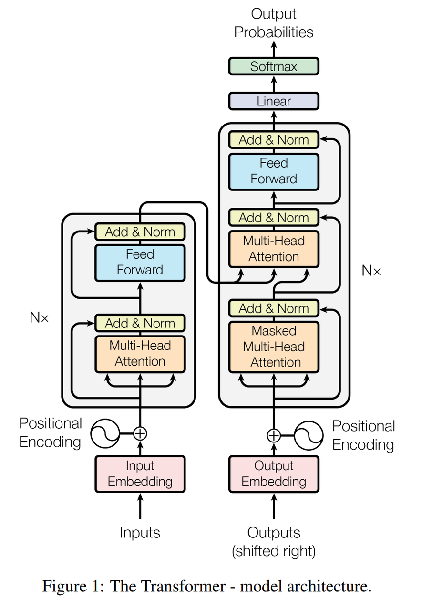

   > **Decoder部分：**
   >
   > * **输入**：解码器接受来自编码器的输出，以及解码器自己的输入（通常是前一步的输出或目标序列的部分）。
   >
   > * **结构**：每个解码器层有三部分：&#x20;
   >
   >   1. **自注意力（Self-Attention）**：通过对当前解码器状态的注意力机制获取信息。
   >
   >   2. **编码器-解码器注意力（Encoder-Decoder Attention）**：这一层帮助解码器与编码器的输出进行交互。
   >
   >   3. **前馈神经网络**：同样是用于处理每个位置的表示。
   >
   > * **输出**：解码器输出最终的生成结果，通常是词的概率分布，用于生成下一步的词。

2. **Transformer为何能够有效地处理长距离依赖问题？与传统RNN和LSTM相比有哪些优势？**

   传统的RNN和LSTM在处理长序列时容易遇到梯度消失或梯度爆炸的问题，从而导致无法有效捕捉长距离依赖关系。这是因为它们的计算是顺序进行的，每一步的隐藏状态依赖于前一步的计算。

   而**Transformer**通过**自注意力机制**（Self-Attention）解决了这个问题。在自注意力机制中，每个位置的输出可以直接与其他所有位置进行交互，不再依赖于前一时间步的状态。这使得Transformer能够在单步计算中捕捉长距离依赖关系，避免了传统RNN和LSTM的局限。

   此外，Transformer是并行计算的，每个输入的位置都可以同时处理，而RNN和LSTM则是逐步计算的，因此Transformer在处理长序列时有更高的效率。

3. **decoder-only是encoder，decoder的哪个部分？有什么区别？**

   

   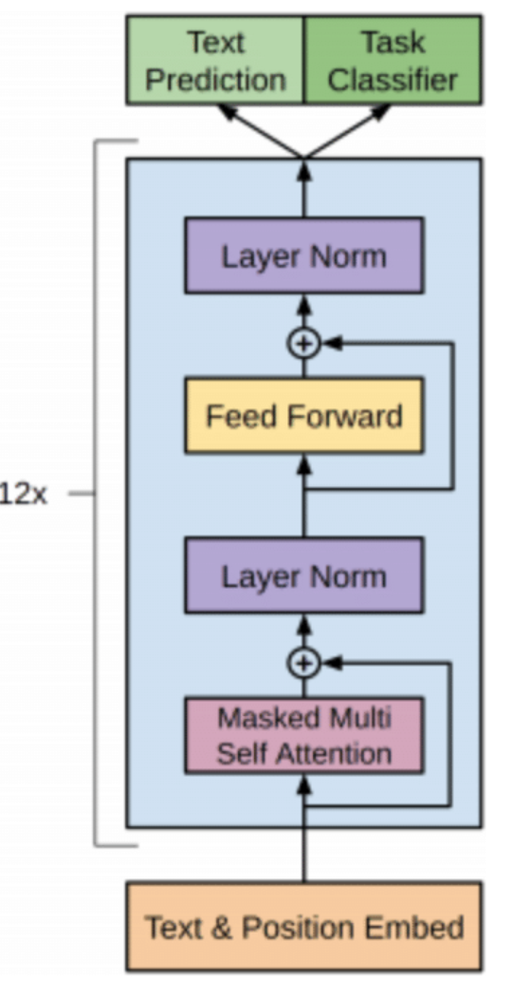

   "**Decoder-only**"模型只使用Transformer的**解码器部分，代码实现是Encoder部分，区别attention变成masked attention**。与标准的**编码器-解码器**结构不同，**Decoder-only**结构省略了编码器，直接从输入的部分序列生成输出。典型的例子包括GPT模型系列。

   > 区别在于：
   >
   > * **编码器-解码器结构**：编码器处理输入序列，生成一组表示，解码器使用这些表示来生成目标序列。编码器和解码器之间通过**编码器-解码器注意力**进行交互。
   >
   > * **Decoder-only结构**：只使用解码器生成输出，通常在生成式任务中使用，解码器依赖前一步的输出进行下一步生成，而不需要编码器的帮助。

4. **多头注意力的作用是什么？**

   多头注意力机制通过并行处理多个注意力头，使得模型能够从多个角度来学习序列中的不同关系。每个注意力头有独立的参数，通过对输入的不同线性变换来捕捉不同的特征。

   具体来说：

   * 每个注意力头分别计算不同的注意力值，关注输入序列的不同部分。

   * 最后，将所有注意力头的输出拼接起来，再通过线性变换得到最终的表示。

   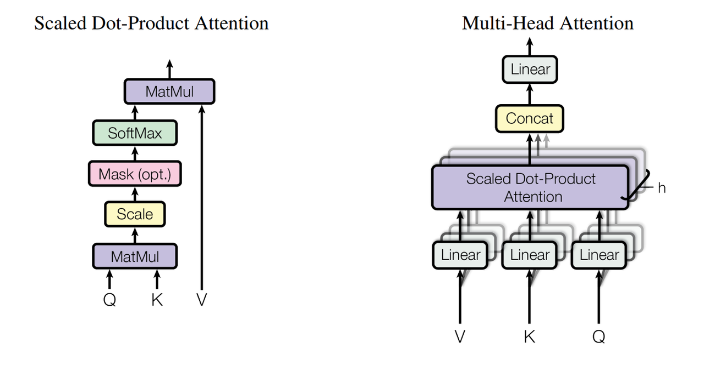

   这种机制能够增强模型的表示能力，允许模型在多个子空间中学习数据的不同特征，提高了模型的表达能力和性能。

5. **能不能手写下self-attention？**

   > 自注意力的数学计算过程如下：
   >
   > * **输入表示**：假设输入序列为 $$
   >   X = [x_1, x_2, \dots, x_n]$$，每个$$x_i
   >   $$是一个向量。
   >
   > * **线性变换**：将输入$$X$$ 映射到查询（Query）、键（Key）和值（Value）：
   >
   >   $$Q = XW^Q, \quad K = XW^K, \quad V = XW^V$$
   >
   > 其中，$$W^Q$$、$$
   > W^K$$ 和 $$W^V$$ 是学习到的权重矩阵。
   >
   > * **计算注意力权重**：计算查询和键的点积，得到注意力权重矩阵：
   >
   >   $$A=softmax(QKTdk)A = \text{softmax}\left( \frac{QK^T}{\sqrt{d_k}} \right)$$
   >
   > 其中 $$d_k $$ 是键的维度，用于缩放点积，避免过大的值导致梯度消失。
   >
   > * **加权求和**：将注意力权重矩阵与值矩阵相乘，得到最终的输出：
   >
   >   $$\text{Output} = A \times V$$
   >
   > * **残差连接**：在实际操作中，输出通常与输入进行残差连接，并通过一个前馈神经网络进一步处理。

   通过这种方式，Transformer可以在每个时间步有效地聚焦于序列中相关的不同部分，从而捕捉长距离依赖关系。

6. **Transformer模型的自注意力机制如何实现并行处理？**

Transformer模型的自注意力机制通过同时计算每个词与其他所有词的关系，从而实现了高效的并行处理。与RNN和LSTM的顺序计算方式不同，Transformer的自注意力机制无需按时间步逐一处理序列。具体来说，**每个输入位置的查询、键和值可以在同一时间并行计算**，并通过矩阵操作实现。由于没有顺序依赖，所有的位置都能同时进行计算，使得Transformer在处理长序列时相比RNN和LSTM更加高效。

* **在Transformer模型中，位置编码（Position Encoding）的作用是什么，它是如何工作的？**

  > 由于Transformer不具有处理序列顺序的天然机制，因此需要引入**位置编码（Position Encoding）来标识序列中每个词的相对位置。位置编码通过与输入嵌入（Word Embeddings）相加的方式，赋予每个词一个位置信息，从而使得模型能够感知顺序。常用的做法是使用正弦和余弦函数**计算的位置编码，公式为：
  >
  > $$\text{Attention}(Q, K, V) = \text{softmax}\left(\frac{QK^T}{\sqrt{d_k}}\right) V$$
  >
  >
  >
  > $$PE_{(pos, 2i)} = \sin\left(\frac{pos}{10000^{2i/d}}\right), \quad PE_{(pos, 2i+1)} = \cos\left(\frac{pos}{10000^{2i/d}}\right)$$
  >
  >
  >
  > 其中，pospos表示位置，ii表示维度，dd是嵌入的维度。这样，每个位置的编码都是一个具有周期性的向量，能够提供全局的位置信息。

* **Transformer模型如何处理变长输入序列？**

  Transformer通过填充（padding）**和**掩码（masking）机制来处理变长输入序列。对于输入长度不一致的序列，短序列会通过填充特殊的“padding”符号来补齐。**掩码**用于确保模型在计算时不会考虑这些填充位置。具体来说：

  * **Padding Mask**：在计算注意力时，避免模型关注填充的部分。

  * **Lookahead Mask**：在解码过程中，防止模型看到未来的信息，确保自回归的生成过程。

* **Transformer模型的缩放点积注意力（Scaled Dot-Product Attention）是什么，其重要性在哪里？**

  缩放点积注意力的计算过程如下：

  $$\text{Attention}(Q, K, V) = \text{softmax}\left(\frac{QK^T}{\sqrt{d_k}}\right) V$$

  其中，$$Q$$、$$K$$、$$V$$分别是查询、键、值， $$d_k
  $$是键的维度。**缩放因子$$\sqrt{d_k}$$**&#x7684;引入是为了避免点积结果过大导致梯度消失或爆炸。通过缩放，确保注意力权重在计算时更加稳定，从而提高训练的效率和稳定性。

* **Transformer模型在实践中如何优化以处理超长序列？**

  处理超长序列时，Transformer的计算复杂度是 $$O(n^2)
  $$，这对于超长序列来说非常高。为了解决这个问题，可以采用以下优化策略：

  * **局部注意力机制（Local Attention）**：将注意力计算限制在局部窗口内，减少计算量。

  * **分段处理（Chunking）**：将长序列拆分成多个小段，分别进行处理。

  * **分布式计算**：将超长序列拆分到多个计算节点上，进行并行处理。

* **如何理解 Transformer 模型中的“softmax”层？它在模型中起什么作用？**

> 在Transformer模型中，**softmax**函数通常用于将注意力权重转换为概率分布。具体来说，Softmax函数通过将每个位置的注意力得分转化为一个概率值，使得所有位置的权重和为1。这个过程确保了模型能够根据注意力的强度来聚焦于输入序列中最相关的部分。

`softmax` 函数通常用于多类分类问题，它可以将一个向量中的元素转化为概率分布。每个元素的值都会在 $$0≤pi≤10 \leq p_i \leq 1$$之间，且所有元素的和为1。下面是 PyTorch 中实现 softmax 的代码示例：

Softmax 计算公式：

$$\text{softmax}(z_i) = \frac{e^{z_i}}{\sum_{j} e^{z_j}}$$

其中$$z_i$$是输入向量中的元素，$$z_j$$是该向量中所有元素的值。

**PyTorch 实现 softmax**

解释：

* `input_tensor`: 这个是你希望计算 softmax 的输入张量。

* `dim`: 这是指定在什么维度上计算 softmax，通常是对每个样本的每一行进行 softmax 计算，因此通常指定 `dim=-1` 或者 `dim=1`，表示在最后一个维度（即每一行）上进行 softmax。

如果你想手动实现 softmax，可以使用如下代码：

这种方法通过先减去 `torch.max()` 来避免溢出问题，确保数值稳定性。

* **Transformer模型中的自注意力机制在计算效率和表示能力之间是如何权衡的？**

自注意力机制的时间复杂度是 $$O(n^2)$$，意味着它随着序列长度的增加，计算量会急剧增加。这种高计算复杂度限制了Transformer在处理超长序列时的效率。然而，自注意力机制提供了非常强的表示能力，它能有效捕捉长距离依赖关系，并通过并行计算提高效率。因此，在模型优化中，通常会选择一些策略（如局部注意力、稀疏注意力等）来在计算效率和表示能力之间找到平衡。

* **Transformer模型的参数共享策略对模型性能有何影响？**

Transformer模型中的参数共享策略主要体现在编码器和解码器的多层结构上。通常，Transformer模型会共享相同的权重矩阵，这意味着每一层都使用相同的参数来进行计算。参数共享有助于减小模型的复杂度，并减少训练参数的数量，同时也能提高模型的训练效率。

* **Transformer encoder和decoder的区别？**

  Transformer的编码器（Encoder）和解码器（Decoder）在结构上有一些显著的区别：

  * **Encoder**：每层由两部分组成：自注意力和前馈神经网络（FFN）。输入数据经过自注意力层进行处理，再通过FFN进一步处理，最后输出序列表示。

  * **Decoder**：每层包含三个主要部分：自注意力、编码器-解码器注意力（cross-attention）和FFN。Decoder不仅关注输入序列的表示（通过cross-attention），还具有**自回归机制**（即当前输出依赖于之前的输出），并且使用**Masked Attention**确保生成序列的正确顺序。

* **Transformer模型中的前馈网络（Feed-Forward Networks）的作用是什么？**

Transformer中的前馈神经网络（FFN）负责对每个位置的表示进行非线性变换，从而增强模型的表达能力。前馈网络通常由两个全连接层和一个激活函数组成。它能够有效地增强模型在每个位置上的特征表示，并与自注意力机制相结合，提升模型的性能。

* **Pre-norm和post-norm有什么区别？**

  **Pre-norm**和**Post-norm**指的是在每一层中进行归一化的不同时机：

  * **Pre-norm**：在进行注意力计算或前馈网络计算之前进行归一化。

  * **Post-norm**：在计算之后进行归一化。

  Pre-norm可以加速训练并提高模型的稳定性，因为它在每一层计算之前就确保了梯度的稳定性，而Post-norm则在计算后进行归一化，通常表现出较好的训练效果，但训练稳定性可能稍差。

**Pre-Norm** 和 **Post-Norm** 是在 Transformer 和自注意力模型中常见的归一化方法。它们的区别主要体现在归一化操作的位置：

> * **Pre-Norm**：在残差连接之前应用归一化。
>
> * **Post-Norm**：在残差连接之后应用归一化。

* **Pre-Norm (归一化先于残差连接)**

在这种结构中，输入首先通过层归一化（LayerNorm），然后经过子层（如自注意力或前馈网络），最后再加上残差连接。

**公式**:

$$\text{output} = \text{LayerNorm}(x + \text{Sublayer}( \text{LayerNorm}(x)))$$

* **Post-Norm (归一化在残差连接后)**

在这种结构中，先通过子层（如自注意力或前馈网络），然后加上残差连接，最后再应用层归一化。

**公式**:

$$\text{output} = \text{LayerNorm}(x + \text{Sublayer}(x))$$

**代码实现**

* Pre-Norm

* Post-Norm

> ### **主要区别**
>
> * **Pre-Norm**:&#x20;
>
>   * `LayerNorm` 先应用，确保每一层的输入先进行归一化，再进行后续操作。
>
>   * 可以使得模型在训练时更加稳定，尤其是在较深的网络中。
>
> * **Post-Norm**:&#x20;
>
>   * `LayerNorm` 应用于残差连接后，保持原始的输入和输出之间的尺度。
>
>   * 在一些情况下，`Post-Norm` 可能会有较好的训练效果，尤其是浅层模型。
>
> ### **总结**
>
> * **Pre-Norm** 更有利于训练深层模型，因为归一化先行避免了梯度爆炸/消失问题。
>
> * **Post-Norm** 在实际应用中可能稍微提高了模型的表现，尤其是在小规模的模型和训练数据时。
>
> 两种结构的选择通常取决于模型的规模和训练难度。

* **Transformer网络很深，是怎么避免过拟合问题的？**

  Transformer通过多种正则化手段来避免过拟合问题：

  * **Dropout**：在训练过程中随机丢弃部分神经元，有助于防止过拟合。

  * **早停（Early Stopping）**：监控验证集的损失，提前停止训练，避免过度拟合训练集。

  * **层数设计**：通常选择较合适的层数，使模型在足够表达的同时不会过于复杂。

* **Transformer 的两个mask机制是什么？**

  Transformer使用两种主要的mask机制：

  * **Padding Mask**：用于掩盖输入序列中的填充位置，避免模型将填充部分作为有效信息。

  * **Lookahead Mask**：用于防止在生成过程中，模型提前看到未来的词（用于解码阶段），确保自回归生成的正确性。

* **Layer Normalization 和 Batch Normalization 的区别，为什么在 Transformer 中使用 Layer Normalization？**

**Batch Normalization (BN)** 和 **Layer Normalization (LN)** 都是常见的归一化技术，但它们在处理数据的方式上有所不同。

> **Batch Normalization (BN)**:
>
> * BN 是对一个 mini-batch 内的每个特征进行归一化，即对每个特征在 batch 维度上进行标准化。它对每个通道（或特征）计算均值和方差。
>
> * 适用于卷积神经网络（CNN）和具有强烈批次依赖的模型。
>
> **公式**: 对每一维度（特征）进行标准化：
>
> $$\hat{x} = \frac{x - \mu_{\text{batch}}}{\sqrt{\sigma_{\text{batch}}^2 + \epsilon}}$$
>
> 其中：
>
> * $$\mu_{\text{batch}}$$ 是该特征在一个 batch 中的均值。
>
> * $$\sigma_{\text{batch}}^2$$是该特征在一个 batch 中的方差。
>
> * $$\epsilon$$ 是防止除零错误的一个小常数。
>
> 然后，使用可训练的缩放（$$\gamma$$）和偏移$$\beta$$来调整标准化后的结果：
>
> $$y = \gamma \hat{x} + \beta$$
>
> **Layer Normalization (LN)**:
>
> * LN 是对输入的每一个样本（而非整个 batch）进行归一化。对于每个样本，它对所有特征进行标准化，而不是仅对某个维度（例如通道或特征）。
>
> * 更适用于递归神经网络（RNN）等任务，因为它不依赖于 mini-batch 大小，特别是在 batch size 很小或为 1 时效果更好。
>
> **公式**: 对每个输入样本的所有特征进行标准化：
>
> $$\hat{x} = \frac{x - \mu_{\text{layer}}}{\sqrt{\sigma_{\text{layer}}^2 + \epsilon}}$$
>
> 其中：
>
> * $$\mu_{\text{layer}}$$是该样本所有特征的均值。
>
> * $$\sigma_{\text{layer}}^2$$ 是该样本所有特征的方差。
>
> * $$\epsilon$$是防止除零错误的一个小常数。
>
> 然后，使用可训练的缩放（$$\gamma$$）和偏移（$$\beta$$）来调整标准化后的结果：
>
> $$y = \gamma \hat{x} + \beta$$

**代码实现**

* **Batch Normalization**

PyTorch 中实现 Batch Normalization 的代码非常简单，可以通过 `torch.nn.BatchNorm1d`、`BatchNorm2d` 等模块实现。以下是一个 1D 的示例：

对于 2D 数据（例如图像数据），可以使用 `BatchNorm2d`：

* **Layer Normalization**

Layer Normalization 通常用于 Transformer 或 RNN 等结构。以下是一个实现 Layer Normalization 的代码示例：

**总结**

* **Batch Normalization**：对一个 batch 中的特征进行归一化，适用于 CNN 等需要处理批量数据的网络。

* **Layer Normalization**：对每个样本的特征进行归一化，适用于需要逐样本处理的模型，如 RNN、Transformer。

两者的选择通常取决于网络架构和任务的需求。

* **Encoder和decoder是如何进行交互的？**

在Transformer中，**Encoder**和**Decoder**通过**cross-attention（编码器-解码器注意力）进行交互。Decoder的每一层都包含一个cross-attention**层，用于将Encoder的输出和Decoder的输入进行结合，从而在生成过程中参考输入序列的相关信息。这一机制确保了Decoder能够利用Encoder编码后的信息进行生成。

* **在多头注意力中，为什么要将每个头的输出连接在一起而不是直接求和？**

将每个头的输出连接而非求和的原因是为了增加模型的表示能力。每个注意力头从不同的子空间中学习信息，因此将它们连接起来可以保留更多的语义信息。这样，模型可以在多个不同的表示子空间中学习到更丰富的特征，有助于提升最终的生成能力和表现。

### 2.1.2 **注意力                                                                                                                          **

* **如何提高Transformer模型中自注意力机制的计算效率？**

  自注意力机制的计算复杂度为O(n²)，随着序列长度n的增加，计算和内存需求也显著增加。为提高计算效率，可采用以下策略：

  > * **稀疏注意力（Sparse Attention）**：通过限制每个查询（Query）仅与部分键（Key）进行交互，减少计算量。例如，Reformer模型采用局部敏感哈希（LSH）方法，将查询和键映射到相同的桶中，仅在同一桶内进行注意力计算。&#x20;
  >
  > * **低秩近似（Low-Rank Approximation）**：通过将注意力矩阵分解为低秩矩阵，减少计算复杂度。Linformer模型采用低秩近似方法，将注意力矩阵近似为低秩矩阵，从而降低计算和内存需求。&#x20;
  >
  > * **FlashAttention**：一种新型的注意力算法，通过内存优化和算子融合，减少内存访问和计算开销。FlashAttention将多个操作融合在一起，仅从内存加载一次数据，执行融合的算子操作，然后将结果写回内存，从而提高计算效率。&#x20;

* **为什么self-attention要除以根号N？有方法不用处理根号N的吗？**

  在自注意力机制中，计算注意力权重时，查询（Q）和键（K）的点积结果可能会随着维度N的增加而增大，导致softmax函数的输入值过大，梯度消失或梯度爆炸，影响模型训练的稳定性。

  为解决这一问题，通常在点积结果除以根号N（即缩放因子），使得点积结果的方差保持在适当范围内，避免梯度问题。

  如果不进行缩放，可能需要对Q和K的初始化进行调整，以确保点积结果的方差适中。例如，可以在初始化时将Q和K的权重除以根号N，以达到类似的效果。&#x20;

* **Transformer模型中注意力权重如何解释模型的决策？**

  注意力权重表示模型在处理输入序列时，对各个部分的关注程度。通过可视化注意力权重，可以直观地了解模型在特定任务中的决策过程。

  例如，在机器翻译任务中，注意力权重可以显示模型在生成目标语言的每个词时，关注源语言输入的哪些部分。

  这种可视化有助于理解模型的行为，发现潜在的偏差或错误，并为模型改进提供指导。

* **如何在自注意力机制中平衡局部信息和全局信息的捕获？**

  自注意力机制能够捕获全局信息，但在处理长序列时，计算和内存开销较大。为平衡局部和全局信息的捕获，可采用以下策略：

  * **局部窗口注意力（Local Window Attention）**：将输入序列划分为多个局部窗口，每个窗口内进行自注意力计算，捕获局部信息。例如，Longformer模型采用滑动窗口注意力机制，在每个窗口内进行自注意力计算，同时通过全局注意力捕获全局信息。&#x20;

  * **长短期记忆结合（Combining LSTM and Attention）**：将长短期记忆网络（LSTM）与自注意力机制结合，利用LSTM捕获局部信息，利用自注意力机制捕获全局信息。这种结合可以在不同层次上捕获信息，提高模型的表达能力。

* **基于attention有哪些代表性的改进方法？分别针对的是什么问题**

  针对自注意力机制的计算瓶颈、内存消耗和长序列处理等问题，提出了以下改进方法：

  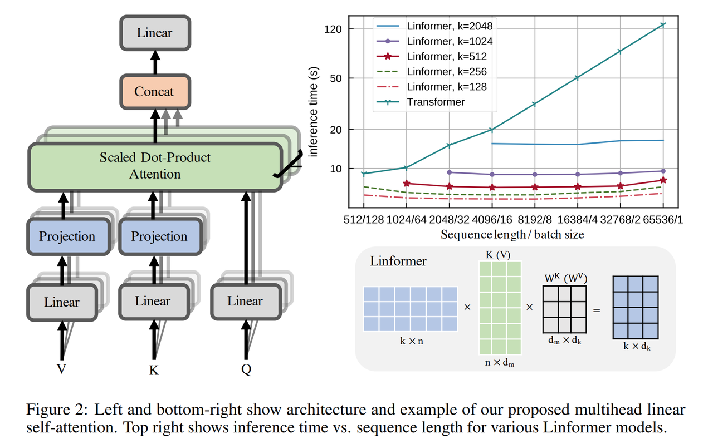

  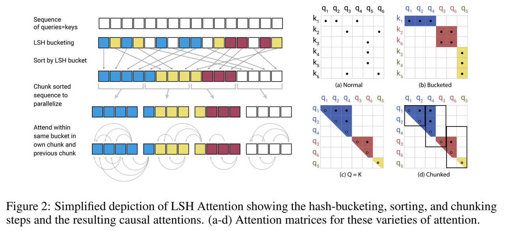

  * **Linformer**：通过低秩近似，将注意力矩阵近似为低秩矩阵，降低计算和内存需求。&#x20;

  * **Reformer**：采用局部敏感哈希（LSH）方法，为每个查询选择键值对，减少计算量。&#x20;

  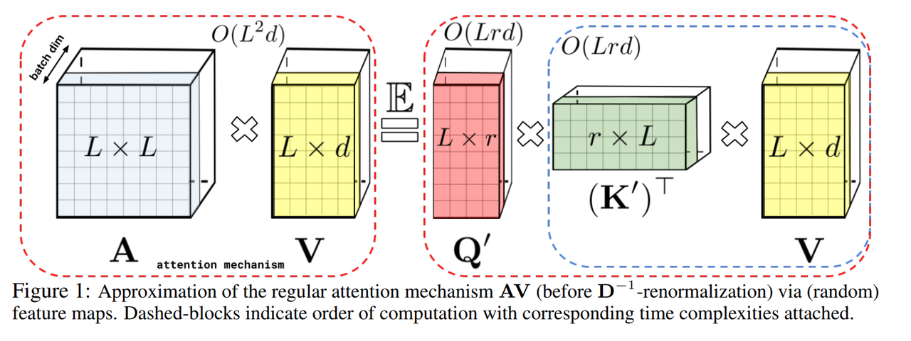

  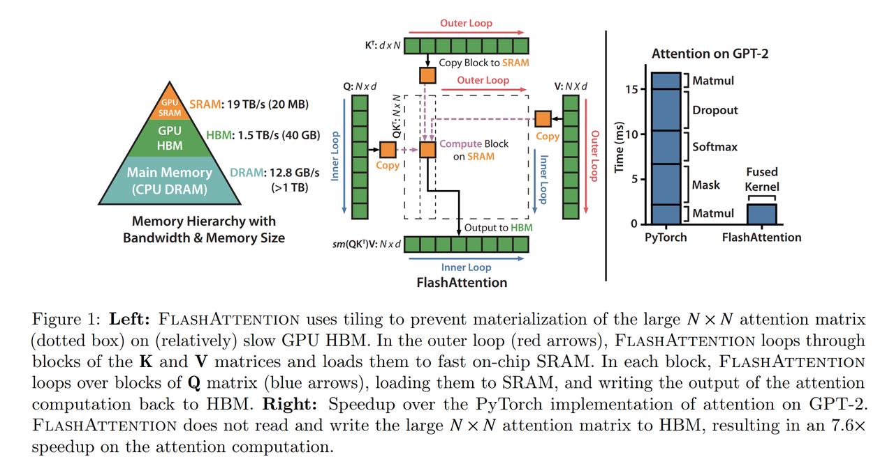

  * **Performer**：通过正态化特征映射，将自注意力机制的计算复杂度从O(n²)降低到O(n)，提高效率。

  * **FlashAttention**：通过内存优化和算子融合，减少内存访问和计算开销，提高计算效率。&#x20;

* **如何结合注意力机制与其他类型的神经网络模块，比如卷积神经网络(CNN)或循环神经网络(RNN)？**

  将注意力机制与CNN或RNN结合，可以充分利用各自的优势，提升模型性能：

  > * **与CNN结合**：在CNN的特征提取层后，加入自注意力机制，增强模型对全局信息的捕获能力。例如，视觉Transformer（ViT）模型在CNN的基础上，加入了自注意力机制，提升了图像处理能力。
  >
  > * **与RNN结合**：在RNN的隐藏状态更新过程中，加入自注意力机制，使模型能够动态地关注输入序列的不同部分，提升序列建模能力。例如，Transformer模型本身就是将自注意力机制与RNN的思想相结合，取得了优异的性能。

  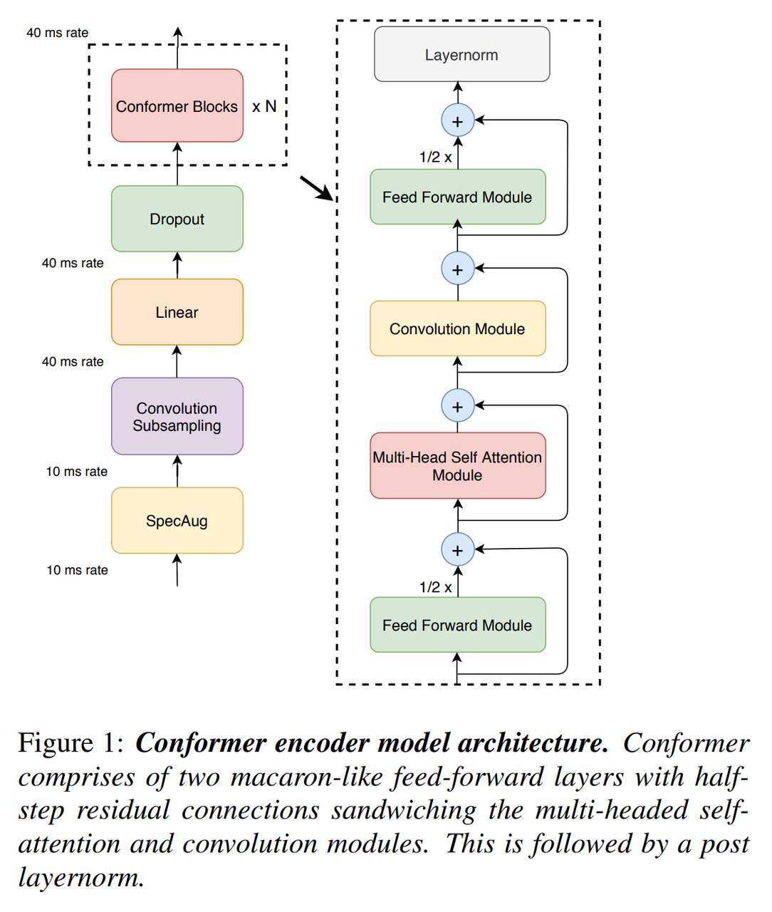

### 2.1.3 **KV cache 相关                                                                                                            **

* **什么是Inference KV Cache，它在Transformer模型的推理过程中有什么作用？**

Inference KV Cache（推理键值缓存）是Transformer模型在推理阶段用于存储已计算的键（Key）和值（Value）向量的机制。 在自回归生成任务中，每生成一个新的token，模型需要基于之前生成的所有tokens来计算注意力权重。 如果每次都重新计算这些键值对，将导致计算量和内存消耗的平方级增长。 通过使用KV Cache，模型可以缓存之前计算的键值对，在生成新token时直接从缓存中获取，避免了重复计算，从而显著提升推理速度和效率。&#x20;

在 Transformer 模型的推理阶段，**键值缓存（KV Cache）** 是一种常用的优化技术，旨在加速自回归生成过程。通过缓存先前计算的键（Key）和值（Value），模型可以避免在每次生成新词时重复计算，从而提高推理效率。

1. **KV Cache 的工作原理**

在自回归生成过程中，模型逐步生成每个词元。每生成一个新词元时，模型需要计算当前输入的查询（Query）与所有先前生成的词元的键值对的注意力权重。如果不使用 KV Cache，每次生成新词元时都需要重新计算所有先前词元的键和值，这会导致计算量和时间的增加。而使用 KV Cache 后，模型只需计算当前词元的键和值，并将其添加到缓存中，后续生成时直接从缓存中获取先前的键值对，避免了重复计算。

1. **KV Cache 的公式**

在每一层的自注意力机制中，假设输入为查询（Query）、键（Key）和值（Value，则注意力输出的计算公式为：

$$A = \text{softmax}\left(\frac{QK^T}{\sqrt{d_k}}\right) V$$

其中，$$d_k $$ 是键的维度。

在推理阶段，使用 KV Cache 时，模型会缓存每一层的键和值。对于第 tt 步生成的词元，模型计算当前查询 $$Q_t 
$$与缓存的键 $$K_{1:t-1} $$ 的注意力权重，然后将当前的键值对 $$K_t $$ 和$$V_t$$ 添加到缓存中。下次生成时，模型直接使用缓存的键值对进行计算。

**代码实现**

以下是一个基于 PyTorch 的简化示例，展示了如何在自回归生成过程中使用 KV Cache：

在上述代码中：

* `TransformerWithKVCache` 类定义了一个包含多层自注意力机制的 Transformer 模型，并提供了 `use_cache` 参数来控制是否使用 KV Cache。

* `forward` 方法接受当前输入 `x` 和可选的 `past_key_values` 参数。如果 `past_key_values` 为 `None`，则表示这是第一次生成，需要计算并缓存键值对。在后续的生成步骤中，模型会使用缓存的键值对来加速计算。

* `past_key_values` 是一个列表，包含每一层的键值对缓存。每一层的缓存是一个元组 `(k, v)`，分别表示键和值。

1. **KV Cache 的内存占用分析**

使用 KV Cache 会增加内存占用，因为需要存储每一层的键值对。假设每个键值对的维度为$$d_k$$，每层有 $$h$$个头，模型有$$L$$ 层，批次大小为 $$B$$，序列长度为 $$S$$，则 KV Cache 的内存占用量 $$M$$ 可以近似计算为：

$$M = 2 \times B \times L \times S \times d_k \times 2 \times \text{float16}$$

其中，乘以 2 是因为每个键值对包含键和值，乘以 2 是因为使用 `float16` 数据类型，每个元素占用 2 字节。例如，对于一个具有 7B 参数的模型，隐藏维度为 4096，堆叠 32 层，最大推理步长为 4096，批次大小为 2，KV Cache 的内存占用约为 4GB。

32. **Inference KV Cache如何与动态解码策略结合？**

在推理过程中，动态解码策略（如自回归生成、束搜索等）与KV Cache紧密结合，以提高生成任务的效率和效果。 例如，在自回归生成中，模型逐步生成每个token，每次生成时，新的键值对被计算并添加到缓存中。 在束搜索中，多个候选序列同时生成，模型需要维护每个序列的KV Cache，以便在后续步骤中快速访问和更新。 这种结合使得模型能够高效地处理长序列生成任务，减少计算冗余，提高生成质量。

33. **在Transformer模型中，KV缓存的键（K）和值（V）的维度如何影响检索性能和模型质量？**

KV缓存的键（K）和值（V）的维度直接影响模型的计算效率和性能。 较大的维度可以捕捉更丰富的特征信息，但会增加计算量和内存占用。 较小的维度则可能导致信息丢失，影响模型的表达能力。 因此，需要在维度大小和计算资源之间进行权衡，以平衡检索效率和模型质量。

34. **KV缓存是否可以针对多模态Transformer模型中的交叉注意力机制进行优化，如果可以，应该如何实现？**

在多模态Transformer模型中，交叉注意力机制用于处理不同模态之间的交互。 针对交叉注意力机制的KV缓存优化可以通过以下方式实现：

> * **共享缓存**：对于相同模态的交叉注意力层，可以共享KV缓存，以减少内存占用。
>
> * **分开缓存**：对于不同模态的交叉注意力层，使用独立的KV缓存，以避免信息混淆。
>
> * **动态调整**：根据不同模态的特性，动态调整KV缓存的大小和更新策略，以优化性能。 这些策略有助于提高多模态模型的推理效率和效果

35. **概率数据结构在Transformer模型操作非常长的序列或大批量大小时，如何扩展KV缓存？**

在处理非常长的序列或大批量数据时，KV缓存的内存占用可能成为瓶颈。 此时，可以利用概率数据结构（如Bloom Filter、Count-Min Sketch等）来扩展KV缓存：

> * **Bloom Filter**：用于快速判断某个元素是否存在于集合中，适用于需要快速查询但允许一定误差的场景。
>
> * **Count-Min Sketch**：用于估计元素的频率，适用于需要统计频率信息但对精度要求不高的场景。 通过引入这些数据结构，可以在内存有限的情况下，处理更长的序列或更大的批量数据。&#x20;

36. **数据库索引技术如何应用于改进Transformer模型中KV缓存的查找和更新操作？**

数据库中的索引技术（如B树、哈希索引等）可以借鉴到Transformer模型的KV缓存管理中：

> * **B树**：适用于需要范围查询的场景，可以用于KV缓存中键的有序存储和快速查找。
>
> * **哈希索引**：适用于需要快速精确查找的场景，可以用于KV缓存中键的快速定位。 通过引入这些索引结构，可以提高KV缓存的查找和更新效率，减少内存访问延迟。

37. **Transformer模型的注意力机制有哪些改进空间？分别代表的模型有哪些？**

Transformer模型的注意力机制在以下方面有改进空间：

> * **计算效率**：通过减少计算复杂度，提高处理长序列的能力。
>
> * **内存占用**：通过优化内存使用，降低对硬件资源的需求。
>
> * **模型性能**：通过改进注意力机制，提升模型的表达能力和泛化能力。 代表性的改进模型包括：
>
> * **Linformer**：通过低秩近似，减少注意力计算的复杂度。
>
> * **Reformer**：通过局部敏感哈希（LSH）和可逆层，降低内存占用。
>
> * **Longformer**：通过滑动窗口和全局注意力机制，处理长序列。

## 2.2 注意力专项     10+题目     非常重要

### 2.2.1 多头注意力（MHA）

1. **多头注意力机制的基本原理是什么？**

多头注意力机制（Multi-Head Attention）是Transformer模型的核心组件之一，其基本原理是通过并行计算多个独立的注意力头，捕捉输入序列中不同子空间的语义关联。 具体而言，输入的查询（Query）、键（Key）和值（Value）矩阵会被线性变换为多个子空间表示，每个子空间独立地计算注意力权重和加权求和。 然后，将所有头的输出拼接在一起，经过线性变换，得到最终的多头注意力输出。 这种机制使得模型能够从多个角度并行地关注输入序列的不同部分，增强了模型的表达能力。&#x20;

* **在多头注意力中，为什么要将每个头的输出连接在一起而不是直接求和？**

将每个头的输出连接在一起而不是直接求和，主要是为了保留每个头独立学习到的特征表示。 如果直接求和，可能会导致不同头学习到的特征相互抵消，无法充分利用每个头的独特信息。 通过连接操作，模型能够在后续的线性变换中融合各个头的特征，从而获得更丰富的表示能力。&#x20;

* **多头注意力的计算复杂度如何？如何优化其效率？**

多头注意力的计算复杂度主要取决于输入序列的长度和模型的维度。 在标准的多头注意力机制中，计算复杂度为O(n²)，其中n是序列长度。 这种复杂度在处理长序列时可能导致计算和内存消耗过大。 为优化效率，研究者提出了多种改进方法，如：

> * **稀疏注意力**：通过限制每个位置只能关注部分位置，减少计算量。
>
> * **低秩近似**：通过对注意力矩阵进行低秩分解，降低计算复杂度。
>
> * **局部敏感哈希（LSH）**：通过哈希技术，将相似的查询和键映射到相同的桶中，减少计算量。 这些方法在不同程度上降低了多头注意力的计算复杂度，提高了模型的效率。

### 2.2.2 多查询注意力（MQA）

* **多查询注意力（MQA）与传统多头注意力（MHA）的区别：**

- **键和值矩阵的共享策略：**

  > * **MHA：** 每个注意力头都有独立的键和值矩阵，这使得每个头可以从不同的角度关注输入数据的不同特征。
  >
  > * **MQA：** 所有注意力头共享同一组键和值矩阵，每个头仅保留独立的查询（Query）矩阵。

- **对模型性能的影响：**

  > * **MHA：** 由于每个头都有独立的键和值矩阵，模型能够捕捉输入序列中丰富的特征，适用于对性能要求高的场景。
  >
  > * **MQA：** 共享键和值矩阵虽然减少了参数量和计算复杂度，但可能导致模型在捕捉输入序列不同特征方面的能力有所下降。

在 Transformer 模型中，**多头注意力（MHA）**、**多查询注意力（MQA）** 和 **分组查询注意力（GQA）** 是三种常见的注意力机制变体。它们在查询（Query）、键（Key）和值（Value）的处理方式上有所不同，旨在优化模型性能和计算效率。

多头注意力（MHA）

**公式**：

多头注意力机制将输入的查询、键和值分别通过不同的线性变换映射到多个子空间，然后在这些子空间上并行计算注意力，最后将结果拼接并通过线性变换得到输出。

具体步骤如下：

> **线性变换**：将输入的查询、键和值分别映射到多个子空间。
>
> $$Q_i = X W_{Q_i}, \quad K_i = X W_{K_i}, \quad V_i = X W_{V_i} \quad \text{for} \quad i = 1, \dots, h$$
>
> 其中，$$h
> $$ 是头的数量，$$W_{Q_i}$$、$$W_{K_i}$$、$$W_{V_i}$$ 是对应的权重矩阵。
>
> **计算注意力**：对每个头，计算注意力权重并加权求和。
>
> $$\text{Attention}_i = \text{softmax}\left( \frac{Q_i K_i^T}{\sqrt{d_k}} \right) V_i$$
>
> 其中，$$d_k $$ 是键的维度。
>
> **拼接和线性变换**：将所有头的输出拼接，并通过线性变换得到最终输出。
>
> $$\text{Output} = \text{Concat}(\text{Attention}_1, \dots, \text{Attention}_h) W_O$$
>
> 其中，$$W_O$$ 是输出的权重矩阵。

**代码实现**：

以下是基于 PyTorch 的多头注意力机制的简化实现：

多查询注意力（MQA）

> **公式**：
>
> 在多查询注意力机制中，所有的查询共享同一组键和值。具体步骤如下：
>
> **线性变换**：将输入的查询映射到多个子空间。
>
> $$Q_i = X W_{Q_i} \quad \text{for} \quad i = 1, \dots, h$$
>
> **共享键和值**：所有头共享同一组键和值。
>
> $$K = X W_K, \quad V = X W_V$$
>
> **计算注意力**：对每个头，计算注意力权重并加权求和。
>
> $$\text{Attention}_i = \text{softmax}\left( \frac{Q_i K^T}{\sqrt{d_k}} \right) V$$
>
> **拼接和线性变换**：将所有头的输出拼接，并通过线性变换得到最终输出。
>
> $$\text{Output} = \text{Concat}(\text{Attention}_1, \dots, \text{Attention}_h) W_O$$

**代码实现**：

以下是基于 PyTorch 的多查询注意力机制的简化实现：

* **通过共享键和值矩阵减少显存占用并提升计算效率：**

- **内存使用：**

  * 在传统MHA中，每个注意力头都有独立的键和值矩阵，随着头数的增加，内存占用也线性增长。

  * 在MQA中，所有头共享同一组键和值矩阵，显著减少了内存占用，特别适合长序列输入和大规模模型的应用场景。&#x20;

- **计算速度：**

  * 共享键和值矩阵减少了计算量，提升了推理速度，尤其在解码器推理期间，能够有效降低内存消耗，提高推理效率。 &#x20;

* **多查询注意力在实际应用中的优势和局限性：**

- **优势：**

  * **计算效率：** 通过共享键和值矩阵，减少了计算量和内存占用，提升了推理速度。

  * **适用于长序列：** 在处理长序列时，MQA能够有效降低内存消耗，适合需要快速处理长文本的任务。

- **局限性：**

  * **表达能力下降：** 由于所有头共享同一组键和值矩阵，模型可能在捕捉输入序列的不同特征方面的能力有所下降。

  * **性能损失：** 在某些任务中，MQA可能导致模型性能的轻微下降，尤其是在需要细粒度特征表示的场景。

### 2.2.3 分组查询注意力（GQA）

7. **分组查询注意力（GQA）的基本概念是什么？**

分组查询注意力（Grouped Query Attention，GQA）是一种介于多头注意力（MHA）和多查询注意力（MQA）之间的注意力机制。 在GQA中，查询头被划分为多个组，每个组共享一组键（Key）和值（Value）矩阵。 这种设计旨在平衡模型的表达能力和计算效率：

> * **性能提升：** 通过共享键和值矩阵，减少了内存占用和计算量。
>
> * **表达能力：** 相比于MQA，GQA能够更好地捕捉输入序列的不同特征，提升模型性能。

GQA（Grouped Query Attention）是一种在大型语言模型中介于多查询注意力（MQA）和多头注意力（MHA）之间的注意力机制。 它通过将查询头分组，每组共享键（Key）和值（Value），在保持模型质量的同时，显著降低计算和内存需求。

**GQA的原理：**

在标准的多头注意力（MHA）中，每个查询头都有独立的键和值。 而在GQA中，查询头被划分为多个组，每组共享相同的键和值。 这种方式减少了键和值的数量，从而降低了计算和内存开销。

**PyTorch实现：**

以下是GQA的简化PyTorch实现示例：

**代码说明：**

* **初始化：**

  * `embed_dim`：嵌入维度。

  * `num_heads`：注意力头的数量。

  * `num_groups`：查询头的组数。

  * `head_dim`：每个头的维度。

* **线性变换：**

  * `query_proj`、`key_proj`和`value_proj`分别用于将输入映射到查询、键和值的空间。

* **重塑张量：**

  * 使用`einops`库的`rearrange`函数，将张量重塑为适合多头注意力的形状。

* **计算注意力：**

  * 计算查询和键的点积，得到注意力分数。

  * 对注意力分数进行softmax归一化，得到注意力权重。

  * 使用注意力权重对值进行加权求和，得到注意力输出。

* **输出投影：**

  * 通过`out_proj`线性层，将注意力输出映射回原始嵌入空间。

* **在GQA中，如何确定每组查询头的数量？这种选择对模型性能有何影响？**

在GQA中，确定每组查询头的数量是一个关键设计决策。 一般而言，查询头的数量应根据以下原则进行选择：

> * **任务需求：** 对于需要捕捉复杂特征的任务，可能需要更多的查询头，以提升模型的表达能力。
>
> * **计算资源：** 更多的查询头会增加计算量和内存占用，因此需要在性能和资源之间进行权衡。

选择合适的查询头数量对模型性能有重要影响：

> * **过多的查询头：** 可能导致计算资源的浪费，且性能提升有限。
>
> * **过少的查询头：** 可能无法充分捕捉输入序列的多样性，导致模型性能下降。

因此，需要根据具体任务和资源限制，进行实验和调优，以确定最佳的查询头数量。

* **GQA在大型语言模型中的应用效果如何？与MHA和MQA相比，有何优势和劣势？**

在大型语言模型中，GQA作为MHA和MQA之间的折中方案，具有以下应用效果：

> * **优势：**
>
>   * **平衡性能和效率：** GQA能够在保持较高性能的同时，减少计算量和内存占用，适合大型模型的推理需求。
>
>   * **灵活性：** 通过调整查询头的分组策略，GQA可以根据具体任务需求，灵活地在性能和效率之间进行权衡。
>
> * **劣势：**
>
>   * **参数共享限制：** 虽然GQA通过共享键和值矩阵减少了参数量，但这种共享可能限制了模型在捕捉输入序列不同特征方面的能力，导致性能略有下降。
>
>   * **设计复杂性：** 确定每组查询头的数量需要根据具体任务和资源限制进行实验和调优，增加了模型设计的复杂性。

与MHA和MQA相比，GQA在以下方面表现突出：

> * **与MHA相比：** GQA在减少计算量和内存占用的同时，保持了接近MHA的性能，适用于需要平衡性能和效率的场景。
>
> * **与MQA相比：** GQA在训练稳定性和性能上优于MQA，适用于需要高质量生成的任务。

### 2.2.4 综合性问题

* **在处理长序列输入时，如何选择适合的注意力机制？**

在处理长序列输入时，选择适合的注意力机制需要综合考虑序列长度、计算资源和任务需求。以下是三种常见注意力机制的适用场景：

> * **多头注意力（MHA，Multi-Head Attention）：** 标准的多头注意力机制，每个查询（Query）都有独立的键（Key）和值（Value）。 在处理长序列时，MHA的计算复杂度为O(n²)，其中n是序列长度，这可能导致内存和计算资源的高消耗。 因此，MHA适用于序列长度适中且计算资源充足的场景。&#x20;
>
> * **多查询注意力（MQA，Multi-Query Attention）：** 在MQA中，所有查询共享同一组键和值，从而减少了内存和计算的消耗。 这使得MQA在处理长序列时更为高效，适用于对推理速度要求较高的任务，如自回归解码。&#x20;
>
> * **分组查询注意力（GQA，Grouped-Query Attention）：** GQA将查询头分成多个组，每组共享一组键和值。 这种折中方法在保持推理速度的同时，尽量减少性能损失。 GQA适用于需要在推理速度和模型性能之间取得平衡的场景。&#x20;

* **如何在现有的多头语言模型中引入多查询注意力（MQA）或分组查询注意力（GQA）？**

  要在现有的多头语言模型中引入MQA或GQA，可以采用迁移学习或微调策略。具体步骤如下：

  > 1. **模型修改：** 根据所选的注意力机制，修改模型的注意力层结构。对于MQA，需使所有查询共享同一组键和值；对于GQA，需要将查询头分组，每组共享一组键和值。
  >
  > 2. **微调策略：** 在修改后的模型上进行微调，使用原始模型的预训练权重作为初始化。微调时，使用目标任务的数据进行训练，以适应新的注意力机制。
  >
  > 3. **挑战与解决方案：** 引入新的注意力机制可能导致模型性能下降。为解决这一问题，可以采用以下策略：
  >
  >    * **逐步训练：** 先在小规模数据集上进行训练，逐步扩大训练规模，以稳定模型性能。
  >
  >    * **正则化技术：** 使用正则化方法，如权重衰减或dropout，防止模型过拟合。
  >
  >    * **超参数调整：** 根据新结构调整学习率、批量大小等超参数，以优化训练过程。

* **在实际应用中，如何评估不同注意力机制的性能？**

评估不同注意力机制的性能可以通过以下方法：

> 1. **评估指标：** 根据任务类型，选择适当的评估指标。例如，在文本生成任务中，可使用BLEU、ROUGE等指标；在分类任务中，可使用准确率、F1分数等。
>
> 2. **实验设计：** 设计对比实验，确保在相同的数据集和训练条件下，比较不同注意力机制的模型性能。
>
> 3. **结果分析：** 对实验结果进行统计分析，评估不同注意力机制在性能上的差异。可以使用t检验等方法，判断性能差异是否具有统计学意义。
>
> 4. **消融实验：** 通过消融实验，分析不同注意力机制对模型性能的具体影响，帮助理解其作用机制。

通过上述方法，可以全面评估不同注意力机制的性能，指导模型的优化和选择。

## 2.3 大模型预训练  20+题目                                                           重要

### 2.3.1 数据预处理

1. **在大模型预训练中，数据预处理的主要步骤有哪些？**

**推荐的开源项目**

以下是一些在大模型预训练中常用的数据预处理开源项目：

> &#x20;**Data-Juicer**
> &#x20;一个用于大规模文本数据预处理的框架，提供了质量过滤、去重、转换等功能。&#x20;
>
> &#x20;**Firefly**
> &#x20;一个用于大规模模型训练的工具，提供了数据预处理、模型训练等功能。&#x20;
>
> **MiniMind**
> &#x20;一个从零开始训练小参数模型的项目，提供了数据预处理、模型训练等功能。&#x20;
>
> &#x20;**OpenCoder**
> &#x20;一个完全开源的代码大模型，提供了数据预处理、模型训练等功能。&#x20;
>
> &#x20;**RefineCode**
> &#x20;一个高质量的代码预训练数据集，提供了预处理、去重、过滤等功能。

在大模型预训练中，数据预处理是确保模型性能的关键步骤。以下是详细的预处理流程，包括代码示例和推荐的开源项目：

**数据收集**

首先，收集大量且多样化的文本数据。常见的数据源包括：

* **网页数据**：如 Common Crawl 数据集。

* **维基百科**：提供高质量的百科全书式内容。

* **书籍和论文**：如 BookCorpus 和 arXiv 数据集。

**数据清洗**

清洗数据以去除低质量和无关内容，常见步骤包括：

* **去除 HTML 标签**：使用正则表达式或 HTML 解析库去除网页中的 HTML 标签。

* **去除特殊字符和多余空格**：清理文本中的特殊字符和多余的空格。

* **语言识别**：筛选出目标语言的文本。

**代码示例**

使用 Python 的 `BeautifulSoup` 库去除 HTML 标签：

**数据去重**

去除重复内容，避免模型过度拟合。常用方法包括：

* **哈希去重**：计算文本的哈希值，去除重复的文本。

* **相似度去重**：使用文本相似度算法，如 MinHash，去除相似度高的文本。

**代码示例**

使用 Python 的 `hashlib` 库进行哈希去重：

**数据标注**

根据预训练任务的需求，可能需要对数据进行标注，如：

> * **语言模型训练**：无需标注，直接使用文本。
>
> * **分类任务**：为文本添加标签。

**数据增强**

通过数据增强技术增加数据多样性，如：

> * **同义词替换**：替换文本中的同义词。
>
> * **回译**：将文本翻译为其他语言，再翻译回来。

**数据分割**

将数据划分为训练集、验证集和测试集。

**数据存储与管理**

使用高效的数据存储格式，如：

> * **TFRecord**：TensorFlow 推荐的高效数据存储格式。
>
> * **Parquet**：适用于大规模数据的列式存储格式。

**数据加载和预处理**

使用高效的数据加载器，如：

> * **TensorFlow 的 `tf.data` API**：用于构建高效的数据输入管道。
>
> * **PyTorch 的 `DataLoader`**：用于批量加载数据。

**代码示例**：

使用 PyTorch 的 `DataLoader` 加载数据：

* **如何处理多语言数据，以确保模型在多语言任务中的表现？**

处理多语言数据时，需考虑以下策略：

> * **数据收集**：从多种语言的来源收集数据，如维基百科、新闻网站等。确保数据覆盖多种语言，以增强模型的多语言理解能力。&#x20;
>
> * **预处理和编码策略**：对不同语言的数据进行适当的预处理，如分词、去除停用词等。采用统一的编码方式（如UTF-8）处理不同语言的文本，以避免编码不一致导致的问题。&#x20;
>
> * **避免语言偏差**：通过平衡各语言的数据量，避免模型偏向数据量大的语言。可以采用平衡采样或加权采样等方法，确保模型在多语言任务中的公平性和准确性。&#x20;

* **在预训练数据中，如何处理长文本和短文本的比例，以优化模型性能？**

处理长短文本的比例时，可考虑以下方法：

> * **数据平衡**：根据任务需求，调整长短文本的比例。过多的长文本可能导致模型偏向长文本的特征，而过多的短文本可能导致模型忽视长文本的上下文信息。适当的平衡有助于模型更好地理解不同长度文本的特征。&#x20;
>
> * **分段处理**：对于过长的文本，可以将其分割成多个段落或句子进行处理，以避免信息丢失。同时，确保每个段落或句子包含足够的上下文信息，以保持语义的完整性。&#x20;
>
> * **加权策略**：在训练过程中，对不同长度的文本赋予不同的权重，以平衡模型对长短文本的关注度。这有助于模型在处理不同长度文本时，保持良好的性能。&#x20;

通过以上策略，可以有效地处理多语言数据和不同长度的文本，提升大模型在多语言任务中的表现和泛化能力。

### 2.3.2 去噪与去重

1. **在大规模预训练数据中，如何有效去除噪声数据？**

噪声数据指的是错误、不准确或与任务无关的数据，可能来源于数据采集、处理或标注过程中的误差。噪声数据的存在会干扰模型的学习过程，降低其泛化能力。

> * **噪声数据的识别方法**：可以通过统计分析、异常检测算法或人工审查来识别噪声数据。例如，使用统计方法检测数据中的异常值，或通过模型预测与实际标签的差异来发现标注错误。
>
> * **去噪方法**：一旦识别出噪声数据，可以采取删除、修正或标记为低质量数据等策略。对于标注错误的数据，可以尝试重新标注或使用鲁棒的学习算法来减轻其影响。
>
> * **去噪对模型性能的影响**：去除噪声数据有助于提高模型的准确性和泛化能力。然而，过度去噪可能导致数据量不足，影响模型的学习效果，因此需要在去噪和数据量之间取得平衡。

* **数据去重的策略是什么？如何平衡去重粒度与数据多样性？**

数据去重旨在消除重复或高度相似的数据，以防止模型过拟合和提高训练效率。

> * **去重粒度的选择**：去重可以在不同粒度上进行，如句子级、文档级或数据集级。在句子级别，可以删除包含重复单词和短语的句子；在文档级别，可以依靠单词或n元词组的重叠等表层特征来衡量文档的相似度。通常，先在数据集和文档级别进行去重，然后在句子级别进行更精细的去重。
>
> * **匹配方法**：去重过程中，可以使用精确匹配或近似匹配算法。精确匹配通常使用后缀数组来匹配完全相同的子串；近似匹配可以采用局部敏感哈希（LSH）算法，如最小哈希（MinHash）来实现。实际操作中，通常结合多种匹配方法，以平衡去重效率和效果。
>
> * **平衡去重与数据多样性**：过度去重可能导致数据多样性不足，影响模型的泛化能力。因此，需要根据任务需求和数据特性，合理选择去重粒度和策略，确保去重的同时保留足够的数据多样性。

* **如何评估去噪和去重策略的有效性？**

评估去噪和去重策略的有效性，主要通过以下方法：

> * **评估指标**：常用的评估指标包括准确率、召回率、F1值等。这些指标可以衡量模型在去噪和去重后的数据集上的表现。需要注意的是，不同的评估指标对应不同的误差计算方法，可能导致不同的比较结论，因此需要结合业务场景选择最有意义的指标体系。&#x20;
>
> * **交叉验证**：通过交叉验证方法，将数据集划分为多个子集，轮流使用不同的子集进行训练和验证，以评估去噪和去重策略对模型性能的影响。
>
> * **对比实验**：将应用去噪和去重策略的数据集与原始数据集进行对比，观察模型性能的变化。如果模型在去噪和去重后的数据集上表现更好，说明策略有效。

需要注意的是，去噪和去重策略的有效性评估应结合具体任务和数据特性，综合考虑模型性能和数据质量。

### 2.3.3 预训练损失函数

1. **在大模型预训练中，常用的损失函数有哪些？**

在大模型预训练中，常用的损失函数包括：

> * **交叉熵损失（Cross-Entropy Loss）**：用于分类任务，衡量模型预测的概率分布与真实标签分布之间的差异。
>
> * **均方误差（Mean Squared Error, MSE）**：用于回归任务，计算预测值与真实值之间差的平方的平均值。
>
> * **负对数似然损失（Negative Log-Likelihood Loss）**：用于概率模型，衡量模型预测的概率分布与真实标签分布之间的差异。
>
> * **对比损失（Contrastive Loss）**：用于度量学习任务，衡量相似样本和不相似样本之间的距离差异。
>
> * **KL散度损失（Kullback-Leibler Divergence Loss）**：用于衡量两个概率分布之间的差异，常用于模型蒸馏等任务。

**交叉熵损失（Cross-Entropy Loss）**

**公式**：

* **二分类交叉熵损失**：

$$\text{Loss} = - \left( y \cdot \log(p) + (1 - y) \cdot \log(1 - p) \right)$$

* 其中，$$y$$ 是真实标签，$$p$$ 是模型预测的概率。

* **多分类交叉熵损失**：

$$\text{Loss} = - \sum_{i=1}^{C} y_i \cdot \log(p_i)
$$

* 其中，CC 是类别数，$$y_i$$ 是真实标签的独热编码，$$p_i$$ 是模型预测的概率。

**代码实现**：

* **PyTorch**：

* **TensorFlow**：

**均方误差（Mean Squared Error, MSE）**

**公式**：

$$\text{Loss} = \frac{1}{N} \sum_{i=1}^{N} (y_i - \hat{y}_i)^2$$

其中，NN 是样本数，$$y_i$$是真实值，$$\hat{y}_i$$ 是预测值。

**代码实现**：

* **PyTorch**：

* **TensorFlow**：

**负对数似然损失（Negative Log-Likelihood Loss）**

**公式**：

$$\text{Loss} = - \sum_{i=1}^{N} y_i \cdot \log(p_i)$$

其中，$$y_i$$ 是真实标签的独热编码，$$p_i$$ 是模型预测的概率。

**代码实现**：

* **PyTorch**：

* **TensorFlow**：

**4. 对比损失（Contrastive Loss）**

**公式**：

$$\text{Loss} = \frac{1}{2N} \sum_{i=1}^{N} \left[ y_i \cdot D^2 + (1 - y_i) \cdot \max(0, m - D)^2 \right]$$

其中，$$D$$ 是样本对的欧氏距离，$$y_i$$ 是标签（相似为 1，不相似为 0），$$m$$ 是边际阈值。

**代码实现**

* **PyTorch**：

* **TensorFlow**：

**5. KL 散度损失（Kullback-Leibler Divergence Loss）**

**公式**：

$$\text{Loss} = \sum_{i=1}^{N} p_i \cdot \log\left(\frac{p_i}{q_i}\right)$$

其中，$$p_i$$和 $$q_i$$分别是两个概率分布的概率值。

**代码实现**：

* **PyTorch**：

* **TensorFlow**：

请注意，以上代码示例中的 `predictions` 和 `targets` 分别表示模型的预测值和真实标签，具体实现可能需要根据实际情况进行调整。

* **如何选择适合的损失函数，以优化模型的预训练效果？**

选择适合的损失函数应考虑以下原则：

> * **任务类型**：根据任务是分类、回归还是其他类型，选择相应的损失函数。例如，分类任务常用交叉熵损失，回归任务常用均方误差。
>
> * **模型架构**：不同的模型架构可能对损失函数的选择有不同的适应性。
>
> * **数据特性**：数据的分布和特性可能影响损失函数的选择。例如，对于类别不平衡的数据，可能需要使用加权的损失函数。
>
> * **优化目标**：明确模型训练的具体目标，如提高准确率、召回率或其他指标，选择能够有效优化这些指标的损失函数。

* **损失函数的设计对模型训练的稳定性和收敛速度有何影响？**

损失函数的设计对模型训练有以下影响：

> * **训练稳定性**：损失函数的平滑性和数值稳定性直接影响训练过程的稳定性。
>
> * **收敛速度**：合适的损失函数可以加速模型的收敛，而不适当的损失函数可能导致训练过程缓慢或无法收敛。
>
> * **梯度传播**：损失函数的设计影响梯度的传播，进而影响模型参数的更新效率。

因此，设计损失函数时需要综合考虑任务需求、模型特性和训练过程的稳定性，以确保模型能够高效、稳定地训练。

### 2.3.4 数据平衡与作用

1. **在预训练数据中，如何处理类别不平衡问题？**

类别不平衡会导致模型偏向于预测样本量大的类别，影响模型的泛化能力。

> * **数据重采样**：通过对少数类进行过采样或对多数类进行欠采样，平衡各类别的样本数量。过采样可能导致过拟合，而欠采样可能丢失重要信息，因此需谨慎使用。
>
> * **加权损失函数**：在损失函数中对少数类样本赋予更高的权重，增加模型对少数类的关注度。例如，使用加权交叉熵损失函数。
>
> * **合成数据**：使用生成对抗网络（GAN）等方法生成少数类的合成样本，增加少数类的样本量。

* **如何评估预训练数据的质量，以确保模型的泛化能力？**

高质量的预训练数据对于模型的泛化能力至关重要。

> * **完整性**：检查数据是否完整，缺失值的比例。
>
> * **准确性**：验证数据的准确性，错误值的比例。
>
> * **一致性**：确保数据的一致性，不一致数据的比例。
>
> * **代表性和多样性**：数据应覆盖任务相关的各种情况，避免偏向某些特定模式。
>
> * **数据清洗**：去除重复、错误或无关的样本，提升数据质量。

* **预训练数据的多样性对模型性能有何影响？**

数据的多样性直接影响模型的泛化能力和适应性。

> * **泛化能力**：多样化的数据使模型能够学习到更多的特征，提升对未见数据的泛化能力。
>
> * **适应性**：多样性的数据帮助模型适应不同的场景和任务，提高在多任务学习中的表现。

* **如何处理预训练数据中的敏感信息，以保护隐私？**

保护数据隐私是预训练过程中的重要考虑。

> * **数据去标识化**：去除或替换数据中的个人身份信息，如姓名、地址等。
>
> * **差分隐私**：在数据或模型训练过程中引入噪声，确保无法从模型输出中推断出单个数据点的信息。
>
> * **同态加密**：在加密状态下对数据进行处理，确保数据隐私。
>
> * **安全多方计算**：在多个参与方之间进行联合计算，确保各方数据隐私。

* **在预训练过程中，如何平衡计算资源与数据量，以优化训练效率？**

平衡计算资源和数据量对于训练效率至关重要。

> * **批次大小**：根据计算资源调整批次大小，过大的批次可能导致内存溢出，过小的批次可能导致训练效率低下。
>
> * **学习率调整**：根据批次大小和数据量调整学习率，避免训练过程中的震荡或收敛过慢。
>
> * **数据预处理**：对数据进行预处理，如降维、特征选择等，减少计算量。
>
> * **分布式训练**：利用多机多卡进行分布式训练，提升训练速度。

* **如何利用数据增强技术，提升预训练数据的多样性和质量？**

数据增强可以有效提升数据的多样性和质量。

> * **回译**：将文本翻译为另一种语言，再翻译回原语言，生成新的句子。
>
> * **同义词替换**：用同义词替换文本中的词汇，生成新的样本。
>
> * **随机插入和删除**：随机插入或删除文本中的词汇，增加数据多样性。
>
> * **数据合成**：使用生成模型合成新的数据样本。

* **在预训练数据中，如何处理噪声标签和错误标注？**

噪声标签和错误标注会影响模型的训练效果。

> * **数据清洗**：通过人工审查或自动化方法识别并修正错误标注。
>
> * **鲁棒训练**：采用对噪声标签不敏感的损失函数，如对数损失函数。
>
> * **模型正则化**：引入正则化项，减少模型对噪声的敏感性。

* **如何设计预训练数据的采样策略，以避免模型对某些模式的过拟合？**

合理的采样策略可以防止模型过拟合。

> * **重要性采样**：根据样本的重要性进行采样，避免模型过度关注某些模式。
>
> * **温度采样**：通过调整采样温度，控制样本的多样性，避免模型对某些模式的过拟合。
>
> * **平衡采样**：确保各类别样本的平衡，防止模型偏向某些类别。

在大模型预训练中，处理重复样本和评估数据覆盖度对于提升模型的泛化能力和性能至关重要。以下是针对您提出的相关问题的详细回答：

1. **在预训练数据中，如何处理重复样本，以避免模型记忆化？**

重复样本可能导致模型过度记忆训练数据，影响泛化能力。

> * **去重策略**：采用去重技术，如MinHash等模糊哈希方法，识别并移除重复或高度相似的样本。研究表明，适当去重可以提高模型的泛化能力，减少对训练数据的记忆。&#x20;
>
> * **去重粒度**：根据任务需求，选择适当的去重粒度，如句子级、文档级或数据集级。过度去重可能导致数据多样性不足，影响模型性能。因此，需要在去重和数据多样性之间取得平衡。&#x20;

* **如何评估预训练数据的覆盖度，以确保模型学习到全面的知识？**

数据的覆盖度直接影响模型的知识广度和泛化能力。

> * **领域覆盖率**：评估数据集是否涵盖了目标任务或领域的各个方面，确保模型能够学习到全面的知识。
>
> * **多样性指标**：使用多样性指标，如Shannon熵，衡量数据集的多样性程度。高多样性有助于模型学习到丰富的特征。
>
> * **评估方法**：通过下游任务的性能评估，间接衡量数据覆盖度对模型的影响。如果模型在多样化的任务上表现良好，说明数据覆盖度较高。

* **在预训练数据中，如何处理低质量或无关的样本，以提高训练效率？**

低质量或无关的样本会影响模型训练效率和效果。

> * **质量过滤**：使用启发式规则或自动化方法，识别并移除低质量或无关的样本。例如，利用文本质量评估指标，如困惑度（Perplexity），筛选出表达不自然的句子。&#x20;
>
> * **数据清洗**：去除重复、错误或无关的样本，提升数据质量。研究表明，去除重复数据可以提高模型的泛化能力。&#x20;
>
> * **自动化工具**：利用自动化工具，如Data-Juicer等，进行数据清洗和预处理，提高效率。&#x20;

通过上述方法，可以有效处理预训练数据中的重复样本、评估数据覆盖度，并清理低质量或无关的样本，从而提升模型的泛化能力和训练效率。

## 2.4 大模型高效微调     10+题目     非常重要

### 2.4.1 LoRA（Low-Rank Adaptation）

1. **LoRA 解决了哪些问题？**

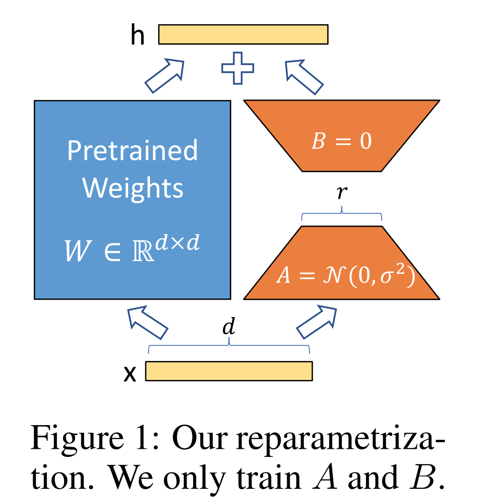

LoRA 通过在预训练模型中引入低秩矩阵，减少了微调时需要训练的参数数量，从而降低了计算和内存开销。

具体而言，LoRA 通过在模型的权重矩阵上添加低秩矩阵分解，使得微调时只需训练新增的低秩矩阵参数，而无需调整原始模型的所有参数。这种方法显著减少了训练所需的计算资源和存储空间，同时保持了预训练模型的性能。&#x20;

在PyTorch中，您可以通过以下方式在线性层中应用LoRA（低秩适应）：

在上述代码中，`LoraLinear`类继承自`nn.Module`，并在其构造函数中定义了LoRA相关的参数：

* `lora_A`和`lora_B`：可训练的低秩矩阵，分别具有形状`(out_features, rank)`和`(rank, in_features)`。

* `scaling`：用于缩放LoRA权重的因子，通常设置为`alpha / rank`。

* `weight`和`bias`：原始线性层的权重和偏置。

- **LoRA 的初始化方式是什么？**

**默认初始化方式：**

LoRA的默认初始化方法是将矩阵 A 随机初始化（通常使用高斯分布），而将矩阵 BB初始化为零矩阵。&#x20;

**其他初始化方法：**

研究人员提出了不同的初始化策略，以提高微调效果。例如，北京大学的PiSSA方法使用主奇异值和奇异向量来初始化适配器矩阵 AA 和 BB，从而显著提升了微调性能。

**影响：**

初始化方式影响LoRA模型的微调动态和性能。例如，研究表明，将矩阵 BB 初始化为零矩阵，矩阵 AA 随机初始化的方式，通常能获得更好的微调效果。 总之，LoRA的初始化方式对微调效果有显著影响，选择合适的初始化策略对于模型性能至关重要。

* **LoRA 中有哪些关键参数？**

LoRA 的关键参数包括：

> * **低秩矩阵的秩（r）**：决定了低秩矩阵的维度，影响模型的适应能力和训练效率。
>
> * **用于降维和升维的矩阵 A 和 B**：矩阵 A 用于将原始权重映射到低维空间，矩阵 B 用于将低维表示映射回原始空间。这两个矩阵的组合实现了对原始权重的低秩近似。

在LoRA（Low-Rank Adaptation）模型中，主要的参数有以下几类：

> 1. **rank**：低秩矩阵的秩值，决定了模型中适应性调整的能力。较高的rank值允许更多的参数调整，但可能会增加计算开销。常见的值是8、16、32等。
>
> 2. **alpha**：是缩放因子，控制了低秩矩阵的影响大小。它通常用来调节LoRA调整部分的强度。较高的alpha值意味着更强的调整效应。
>
> 3. **dropout**：用于控制正则化，防止模型过拟合。通过随机丢弃一部分网络连接来提高模型的泛化能力。
>
> 4. **lora\_dropout**：LoRA特有的dropout参数，通常是应用于低秩适应部分的dropout。它有助于进一步增强模型的鲁棒性。
>
> 5. **merge**：如果你使用的是LoRA + Pretrained模型架构，merge参数可以用于决定是否在训练结束后将低秩适应部分合并到主模型中，减少推理时的计算开销。
>
> 6. **target\_modules**：用于指定哪些模块或层需要应用LoRA适应。可以选择全模型，也可以仅对特定层（如Attention层或Linear层）进行LoRA调整。
>
> 7. **bias**：有时可以选择是否调整模型中的偏置（bias）参数。通过是否将LoRA应用于偏置来影响模型的细节。

这些参数在不同的实现中可能会有所不同，具体细节取决于你使用的库（例如HuggingFace的Transformers或其他的LoRA库）。你可以根据需要进行微调，以优化模型的适应性和性能。

* **如何将 LoRA 权重合并到原始模型中？**

在微调完成后，可以使用特定的工具或方法，将 LoRA 的权重合并回原始模型，以便在推理时直接使用。具体而言，可以通过将微调后的低秩矩阵 A 和 B 与原始模型的权重矩阵 W 相乘，得到更新后的权重矩阵 W'，即：

$$W' = W + A × B$$

这种合并方式使得在推理时，模型可以直接使用更新后的权重矩阵 W'，无需额外的计算开销。&#x20;

### 2.4.2 Adapter

* **Adapter微调方法的原理**

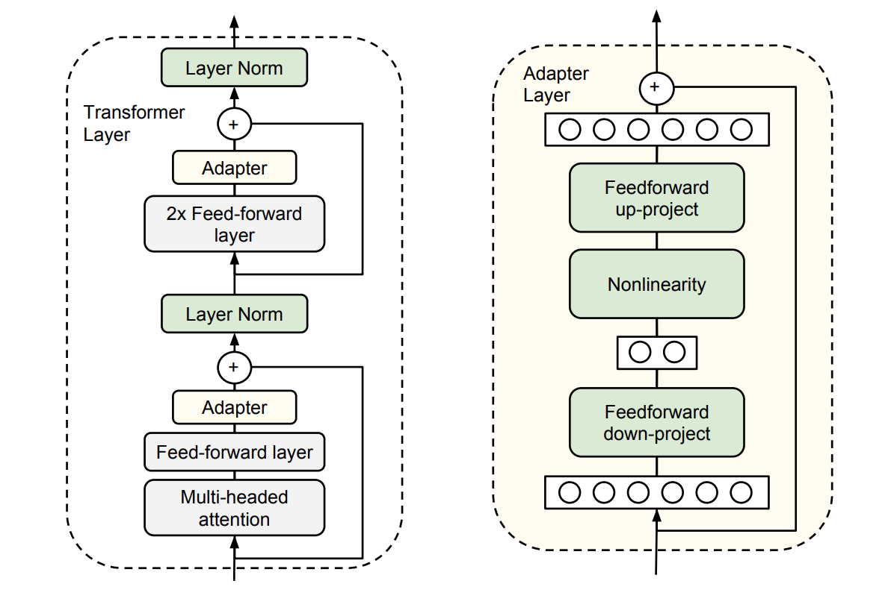

Adapter微调是一种高效的迁移学习方法，通过在预训练模型的各层之间插入小型可训练模块（称为适配器），在微调过程中仅训练这些适配器的参数，而保持原始模型参数不变。

具体而言，适配器模块通常由以下部分组成：

> 1. **下采样层（Down-Projection）**：将输入特征从高维空间投影到低维空间，以减少计算复杂度。
>
> 2. **非线性激活层**：引入非线性变换，增强模型的表达能力。
>
> 3. **上采样层（Up-Projection）**：将低维特征映射回高维空间，以与原始模型的输出维度匹配。

以下是一个在PyTorch中实现Adapter的示例代码：

在上述代码中：

* `Adapter` 类定义了一个适配器模块，包括一个下采样层（`adapter_down`）、一个激活函数和一个上采样层（`adapter_up`）。

* `AdapterLayer` 类将适配器与基础层（如线性层）结合，输出为基础层输出与适配器输出的和。

要将适配器添加到现有模型中，您可以在模型的各个层之间插入 `AdapterLayer`。 例如，假设您有一个简单的前馈神经网络：

在这个模型中，`Adapter` 被添加到 `layer1` 和 `layer2` 之间。 在训练时，您可以选择冻结 `layer1` 和 `layer2`，仅训练 `adapter1`，从而实现高效的微调。

请注意，适配器的设计和插入位置可以根据具体任务和模型架构进行调整。 此外，Hugging Face 的 `transformers` 库提供了对适配器的支持，您可以参考其文档以获取更多信息。

6. **Adapter的优势和局限性**

**优势：**

> 1. **参数高效**：通过仅训练适配器模块的参数，显著减少了需要调整的参数数量，降低了计算和存储开销。
>
> 2. **适用于小数据集**：由于适配器模块的参数量较少，适合在数据量有限的情况下进行微调。
>
> 3. **避免灾难性遗忘**：冻结原始模型的参数，避免了在微调过程中对原始知识的遗忘。

**局限性：**

> 1. **适配器设计影响性能**：适配器模块的结构和参数选择可能对模型性能产生影响，需要精心设计。
>
> 2. **推理延迟**：在推理阶段，适配器模块的引入可能导致额外的计算开销，影响推理速度。
>
> 3. **适应性有限**：对于某些任务，适配器模块可能无法充分捕捉任务特定的特征，导致性能提升有限。

综上所述，Adapter微调方法在提高微调效率和适应性方面具有显著优势，但在设计和应用时需要权衡其局限性。

### 2.4.3 P-Tuning

1. **P-Tuning 微调方法的核心思想**

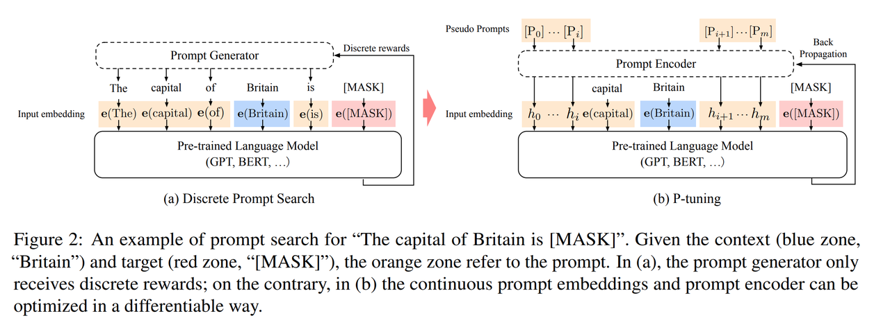

P-Tuning 是一种高效的微调方法，旨在通过引入可学习的提示（Prompt），在预训练模型的输入中添加可训练的嵌入向量，以引导模型生成特定任务的输出。

具体而言，P-Tuning 在输入序列前添加一段可训练的连续提示嵌入（soft prompt），这些嵌入在训练过程中被优化，以适应特定任务的需求。 与传统的手工设计离散提示不同，P-Tuning 通过学习连续的提示嵌入，使模型能够更灵活地适应各种任务。

P-Tuning（Prompt Tuning）是一种高效的预训练模型微调方法，通过引入可学习的提示（prompt）来调整模型的行为，而无需修改模型的其他参数。

以下是一个在PyTorch中实现P-Tuning的示例代码：

在上述代码中：

* `PromptEncoder` 类用于生成可学习的提示嵌入，并通过一个简单的前馈神经网络对其进行编码。

* `PTuningModel` 类将基础模型与提示编码器结合，在输入数据前添加生成的提示。

要将P-Tuning应用于现有模型，您可以将`PTuningModel`与您的基础模型进行组合。

例如，假设您有一个简单的前馈神经网络：

您可以将其与P-Tuning结合：

在训练时，您只需微调`PromptEncoder`部分的参数，而保持`SimpleModel`的参数冻结，从而实现高效的微调。

* **P-Tuning 的优势和局限性**

**优势：**

> 1. **参数高效**：P-Tuning 仅需训练少量的提示嵌入参数，显著减少了微调时需要调整的参数数量。
>
> 2. **适用于小数据集**：由于训练的参数量较少，P-Tuning 在数据量有限的情况下也能有效提升模型性能。
>
> 3. **避免灾难性遗忘**：通过仅调整提示嵌入，P-Tuning 保持了原始模型的参数不变，避免了对原始知识的遗忘。

**局限性：**

> 1. **提示设计的复杂性**：虽然 P-Tuning 使用可训练的提示嵌入，但如何设计和初始化这些嵌入仍然是一个挑战。
>
> 2. **对特定任务的适应性**：P-Tuning 在某些任务上可能无法达到全参数微调的性能，特别是在任务复杂度较高的情况下。
>
> 3. **P-Tuning v2 相较于 P-Tuning 的改进**

P-Tuning v2 在 P-Tuning 的基础上进行了多项改进，主要包括：

> 1. **深度提示调整（Deep Prompt Tuning）**：在每一层的输入中都添加可训练的提示嵌入，而不仅仅是在输入层。
>
> 2. **多任务学习**：通过在不同任务上共享提示嵌入，增强了模型的泛化能力。
>
> 3. **优化的提示编码器**：采用更有效的提示编码器，如多层感知机（MLP）或长短期记忆网络（LSTM），以更好地建模提示嵌入之间的关系。

这些改进使得 P-Tuning v2 在不同规模的模型和多种下游任务上都能取得与全参数微调相媲美的性能。&#x20;

> 1. **如何评估 LoRA、Adapter 和 P-Tuning 的微调效果**
>
> 评估 LoRA、Adapter 和 P-Tuning 的微调效果，通常通过以下性能指标：
>
> 1. **准确率（Accuracy）**：衡量模型在分类任务中的正确预测比例。
>
> 2. **F1 分数**：综合考虑精确率和召回率的指标，适用于类别不平衡的任务。
>
> 3. **精确率（Precision）和召回率（Recall）**：分别衡量模型的预测准确性和对正类样本的识别能力。
>
> 4. **损失函数值（Loss）**：训练过程中损失函数的值，反映模型的训练效果。

通过在特定任务上比较这些指标，可以评估不同微调方法的效果。

## 2.5 大模型SFT     10+题目     重要

### 2.5.1 损失函数

1. **SFT阶段常用的损失函数**

在SFT（Supervised Fine-Tuning，监督微调）阶段，通常使用交叉熵损失函数来评估模型预测与真实标签之间的差异。&#x20;

交叉熵损失函数（Cross-Entropy Loss）广泛应用于分类问题中，用于衡量模型预测的概率分布与真实标签分布之间的差异。

**公式：**

对于二分类问题，交叉熵损失函数的公式为：

$$L = - \left( y \cdot \log(p) + (1 - y) \cdot \log(1 - p) \right)$$

其中，$$y$$ 为真实标签（0 或 1），$$p$$ 为模型预测的正类概率。

对于多分类问题，交叉熵损失函数的公式为：

$$L = - \sum_{i=1}^{C} y_i \cdot \log(p_i)$$

其中，CC 为类别数，$$y_i$$为真实标签的 one-hot 编码，$$p_i$$为模型预测的第 $$i$$类的概率。

**PyTorch 实现：**

在 PyTorch 中，`nn.CrossEntropyLoss` 类用于计算交叉熵损失。&#x20;

需要注意的是，`nn.CrossEntropyLoss` 函数内部已包含了 softmax 操作，因此输入的 `logits` 应为未经 softmax 处理的原始输出。&#x20;

此外，`nn.CrossEntropyLoss` 还提供了其他参数，如 `weight`、`ignore_index` 和 `reduction`，用于处理类别不平衡、忽略特定类别和指定损失计算方式等。&#x20;

通过使用 `nn.CrossEntropyLoss`，可以方便地在多分类任务中计算交叉熵损失。

* **SFT中的损失函数与预训练阶段的区别**

都是交叉熵损失函数。&#x20;

### 2.5.2 与预训练的区别与联系

1. **预训练和SFT操作的不同**

预训练（Pre-training）和监督微调（Supervised Fine-Tuning，SFT）是训练大型语言模型的两个关键阶段，各自具有不同的目标和操作方式：

* **预训练阶段**：

  > * **目标**：使模型学习语言的通用特征和结构。
  >
  > * **数据**：使用大量未标注的文本数据，如书籍、文章和网页。
  >
  > * **任务**：通常采用自监督学习任务，如掩码语言模型（Masked Language Model，MLM）或因果语言模型（Causal Language Model，CLM）。
  >
  > * **参数更新**：模型的所有参数都可能被更新，以学习语言的通用特征。
  >
  > * **资源需求**：需要大量的计算资源和存储空间，因为要处理的数据量巨大。
  >
  > * **应用范围**：预训练后的模型可以用于多种不同的下游任务，具有较好的通用性。

* **SFT阶段**：

  > * **目标**：使模型适应特定任务或领域。
  >
  > * **数据**：使用特定任务的标注数据，如情感分析、机器翻译或问答数据集。
  >
  > * **任务**：采用监督学习任务，模型根据输入和对应的标签或输出进行训练，以最小化预测误差。
  >
  > * **参数更新**：通常只有部分参数会被更新，特别是与任务相关的顶层或特定层的参数，以适应特定任务。
  >
  > * **资源需求**：相对较小，因为使用的是特定任务的较小数据集。
  >
  > * **应用范围**：微调后的模型更擅长处理特定的任务或领域，但可能在其他任务上表现不佳。

总的来说，预训练是构建强大语言模型的基础，而SFT是使这些模型适应具体应用的关键步骤。&#x20;

* **SFT如何利用预训练模型的知识**

SFT通过在预训练模型的基础上，利用任务特定的标注数据，调整模型参数，使其更好地适应特定任务。

具体而言，SFT利用预训练模型在大量无标注数据上学习到的通用语言特征和结构，通过在特定任务的标注数据上进行微调，使模型能够捕捉到任务特定的模式和特点。

这种方法使得模型能够在特定任务上表现得更好，同时保留了预训练阶段学到的通用知识。

### 2.5.3 训练中常见的问题

* **在SFT过程中，如何避免过拟合？**

在SFT（Supervised Fine-Tuning，监督微调）过程中，避免过拟合是确保模型泛化能力的关键。以下方法可有效防止过拟合：

> * **正则化技术**：
>
>   * **L2正则化（权重衰减）**：通过在损失函数中添加权重的L2范数惩罚项，限制模型参数的过大增长，防止过拟合。
>
>   * **Dropout**：在训练过程中随机丢弃部分神经元，减少神经元之间的依赖关系，增强模型的泛化能力。
>
> * **数据增强**：
>
>   * 通过对训练数据进行随机裁剪、旋转、翻转等变换，生成新的训练样本，增加数据的多样性，帮助模型更好地泛化。
>
> * **早停法（Early Stopping）**：
>
>   * 在验证集性能不再提升时，提前停止训练，防止模型在训练集上过度拟合。
>
> * **模型复杂度控制**：
>
>   * 选择适当的模型规模，避免过于复杂的模型导致过拟合。
>
> * **交叉验证**：
>
>   * 通过交叉验证评估模型性能，确保模型在不同数据子集上的表现一致，减少过拟合风险。

综合应用上述方法，可有效降低SFT过程中模型的过拟合风险。

* **SFT训练中，如何处理类别不平衡问题？**

类别不平衡是SFT训练中常见的问题，处理不当可能导致模型偏向于预测多数类。以下策略可有效应对类别不平衡：

> * **加权损失函数**：
>
>   * 在损失函数中为不同类别分配不同的权重，使模型在训练时更加关注少数类样本。
>
> * **过采样（Oversampling）**：
>
>   * 通过复制少数类样本或生成合成样本，增加少数类的样本数量，平衡数据集。
>
> * **欠采样（Undersampling）**：
>
>   * 减少多数类样本的数量，平衡数据集，但可能导致信息丢失。
>
> * **SMOTE（Synthetic Minority Over-sampling Technique）**：
>
>   * 通过在特征空间中生成少数类样本的合成样本，增加少数类样本的多样性。
>
> * **集成学习**：
>
>   * 使用集成方法，如随机森林或XGBoost，结合多个模型的预测结果，提高对少数类的识别能力。

根据具体任务和数据特点，选择适合的策略处理类别不平衡问题。

* **SFT训练时，如何选择合适的学习率？**

选择合适的学习率对SFT训练至关重要，以下策略可帮助确定最佳学习率：

> * **学习率预热（Learning Rate Warm-up）**：
>
>   * 在训练初期，逐步增加学习率，避免模型在初始阶段因学习率过大而导致的不稳定。
>
> * **学习率衰减（Learning Rate Decay）**：
>
>   * 随着训练的进行，逐步降低学习率，帮助模型在训练后期更精细地调整参数。
>
> * **学习率范围测试（Learning Rate Range Test）**：
>
>   * 在训练初期，尝试不同的学习率，观察损失函数的变化，选择损失下降最快的学习率。
>
> * **验证集性能监控**：
>
>   * 在训练过程中，定期评估验证集上的性能，根据验证集的表现动态调整学习率。

综合应用上述策略，可帮助选择适合的学习率，提升SFT训练效果。

* **SFT训练中，如何处理长文本输入？**

处理长文本输入时，可采用以下方法：

> * **截断（Truncation）**：
>
>   * 将文本截断为固定长度，丢弃超出部分，但可能丢失重要信息。
>
> * **滑动窗口（Sliding Window）**：
>
>   * 将长文本划分为多个重叠的窗口，分别输入模型，最后合并结果。
>
> * **分段处理（Segmentation）**：
>
>   * 将长文本划分为多个段落或句子，逐一处理，最后合并结果。
>
> * **长序列模型**：
>
>   * 使用支持长序列的模型，如Transformer-XL或Longformer，直接处理长文本。

选择适合的方法处理长文本输入，确保模型能够有效捕捉文本信息。

* **SFT训练中，如何评估模型性能？**

在SFT（Supervised Fine-Tuning，监督微调）训练中，评估模型性能是确保其有效性的关键步骤。

常用的评估指标包括：

> * **准确率（Accuracy）**：衡量模型预测正确的样本比例。
>
> * **精确率（Precision）**：衡量模型预测为正类的样本中，实际为正类的比例。
>
> * **召回率（Recall）**：衡量实际为正类的样本中，模型预测为正类的比例。
>
> * **F1分数**：精确率和召回率的调和平均数，综合衡量模型性能。
>
> * **AUC-ROC曲线**：评估模型在不同阈值下的分类性能，反映模型的区分能力。

此外，针对特定任务，还可采用任务特定的评估指标，如BLEU分数用于机器翻译，ROUGE分数用于文本摘要等。

评估时，建议使用独立的验证集或交叉验证方法，以确保评估结果的可靠性和泛化能力。

* **SFT训练中，如何处理多标签分类问题？**

在SFT训练中，处理多标签分类问题时，可采用以下策略：

> * **多标签损失函数**：使用适合多标签任务的损失函数，如二元交叉熵损失（Binary Cross-Entropy Loss），对每个标签独立计算损失。
>
> * **阈值策略**：模型输出每个标签的概率值后，设置适当的阈值，将概率值高于阈值的标签视为预测为正类。阈值的选择可通过验证集调优。
>
> * **标签平滑（Label Smoothing）**：在标签上引入平滑项，减少模型对某些标签的过度自信，提升模型的泛化能力。
>
> * **数据增强**：通过生成新的训练样本，增加多标签数据的多样性，帮助模型更好地学习标签之间的关系。

综合应用上述策略，可有效提升SFT训练中多标签分类任务的性能。

## 2.6 大模型后处理RLHF     10+题目     重要

### 2.6.1 目的与必要性

1. **RLHF 的主要目的是什么？**

RLHF（Reinforcement Learning with Human Feedback，基于人类反馈的强化学习）旨在通过引入人类反馈，优化模型的行为，使其更符合人类的偏好和价值观，从而提升模型的实用性和安全性。

具体而言，RLHF 通过以下步骤实现这一目标：

> 1. **监督微调（Supervised Fine-Tuning，SFT）**：在大量未标注的数据上训练模型，使其掌握语言的基本结构和任务特定的知识。
>
> 2. **奖励模型训练**：利用人类反馈，训练一个奖励模型，用于评估模型输出与人类偏好的符合程度。
>
> 3. **强化学习优化**：通过强化学习算法，结合奖励模型，进一步调整模型参数，使其生成更符合人类期望的输出。

通过上述过程，RLHF 能够使模型在复杂的任务中更好地对齐人类的价值观和偏好，提升其在实际应用中的表现。&#x20;

1. **为什么在大模型训练后需要进行 RLHF？**

尽管预训练和监督式微调（SFT）可以使模型掌握语言的基本结构和任务特定的知识，但它们可能无法充分捕捉人类的主观偏好和复杂的价值观。

RLHF 通过直接利用人类反馈，进一步调整模型输出，使其更符合人类期望。

具体原因包括：

> * **对齐人类偏好**：预训练和 SFT 主要关注语言结构和任务特定知识的学习，可能无法充分捕捉人类的主观偏好和复杂的价值观。
>
> * **提升模型实用性和安全性**：通过引入人类反馈，RLHF 能够使模型生成更符合人类期望的输出，提升其在实际应用中的表现。
>
> * **解决复杂任务**：对于目标复杂、定义不明确或难以精准表述的任务，RLHF 能够通过人类反馈来指导模型的学习过程，使其更好地符合人类的偏好和期望。&#x20;

因此，RLHF 在大模型训练后扮演着关键角色，确保模型的输出更符合人类的期望和价值观。

### 2.6.2 与预训练和 SFT 的关系

1. **RLHF 与预训练和 SFT 的区别和联系**

预训练（Pre-training）、监督微调（Supervised Fine-Tuning，SFT）和基于人类反馈的强化学习（Reinforcement Learning from Human Feedback，RLHF）是训练大型语言模型的三个关键阶段，各自具有独特的目标和方法，但又相互关联，共同提升模型性能。

**预训练阶段：**

> * **目标**：使模型学习语言的通用特征和结构。
>
> * **方法**：在大规模未标注的文本数据上进行训练，模型通过自监督学习任务（如掩码语言模型或因果语言模型）来捕捉语言规律。
>
> * **结果**：模型获得了广泛的语言理解能力，但可能缺乏对特定任务或人类偏好的深入理解。

**SFT阶段：**

> * **目标**：使模型适应特定任务或领域。
>
> * **方法**：在特定任务的标注数据上对预训练模型进行微调，通常采用监督学习方法。
>
> * **结果**：模型在特定任务上表现出色，但可能未能充分捕捉人类的主观偏好和复杂的价值观。

**RLHF阶段：**

> * **目标**：通过人类反馈，进一步优化模型输出，使其更符合人类的偏好和价值观。
>
> * **方法**：在SFT的基础上，利用人类对模型输出的评价，训练奖励模型，并通过强化学习算法（如PPO）调整模型参数。
>
> * **结果**：模型的输出更符合人类期望，提升了实用性和安全性。

**区别：**

> * **数据来源**：预训练使用未标注的文本数据，SFT使用特定任务的标注数据，而RLHF依赖于人类对模型输出的反馈。
>
> * **训练方法**：预训练和SFT主要采用监督学习方法，RLHF则结合了强化学习和人类反馈。
>
> * **关注点**：预训练关注语言的通用性，SFT关注任务的特定性，RLHF关注人类偏好的对齐。

**联系：**

三者是连续的训练阶段，共同作用于模型的优化：

> 1. **预训练**：为模型提供语言的基础能力。
>
> 2. **SFT**：在预训练的基础上，使模型适应特定任务。
>
> 3. **RLHF**：在SFT的基础上，通过人类反馈，进一步调整模型输出，使其更符合人类期望。

通过这三个阶段的训练，模型能够在语言理解、任务适应性和人类偏好对齐方面取得平衡，提升整体性能。

例如，在对话系统的训练中，预训练使模型掌握语言的基本结构，SFT使其能够理解和生成特定任务的对话内容，而RLHF则通过人类反馈，优化模型的对话质量，使其更符合用户的期望。

综上所述，预训练、SFT和RLHF各自发挥着独特的作用，三者相辅相成，共同推动模型性能的提升。

### 2.6.3 训练过程中的常见问题

1. **在 RLHF 训练过程中，如何有效收集和利用人类反馈？**

在 RLHF（Reinforcement Learning from Human Feedback）训练中，收集和利用人类反馈是关键步骤。有效的策略包括：

> * **设计清晰的反馈机制**：建立明确的反馈流程，确保人类评估者能够直观地提供反馈，如通过评分、排名或直接编辑模型输出。
>
> * **确保反馈的多样性和代表性**：从不同背景和观点的评估者处收集反馈，以覆盖广泛的偏好和价值观，避免模型学习到单一的偏见。
>
> * **利用众包平台收集大量高质量的反馈数据**：通过众包平台，快速收集大量反馈数据，提升训练效率和模型的泛化能力。

通过上述策略，可以有效地收集和利用人类反馈，提升模型的性能和对人类偏好的对齐度。

* **如何避免 RLHF 训练中引入的偏差？**

在 RLHF 训练中，避免引入偏差至关重要。以下方法可有效减少偏差的影响：

> * **多样化反馈来源**：从不同背景、文化和观点的评估者处收集反馈，确保模型学习到多元化的偏好，避免单一偏见的引入。
>
> * **定期评估和调整奖励模型**：持续监控奖励模型的表现，及时发现并纠正可能的偏差，确保模型输出符合预期。
>
> * **引入去偏差技术**：采用去偏差算法和技术，如公平性约束和去偏差训练方法，减少模型输出中的偏见。

通过这些措施，可以有效降低 RLHF 训练中引入的偏差，提升模型的公平性和可靠性。

* **RLHF 训练中，如何平衡模型的泛化能力和对人类偏好的适应性？**

在 RLHF 训练中，平衡模型的泛化能力和对人类偏好的适应性是一个挑战。以下策略可帮助实现平衡：

> * **监控模型在不同任务和数据集上的表现**：定期评估模型在多样化任务和数据集上的性能，确保其具有良好的泛化能力。
>
> * **适时调整训练策略**：根据评估结果，动态调整训练策略，如调整奖励模型的权重或训练数据的分布，以平衡泛化能力和对人类偏好的适应性。
>
> * **避免过拟合人类反馈数据**：通过正则化技术、数据增强和早停等方法，防止模型过度拟合人类反馈数据，保持其泛化能力。

通过这些策略，可以在 RLHF 训练中实现模型泛化能力和对人类偏好的适应性的平衡。

* **RLHF 训练中，如何处理奖励模型的不确定性和噪声？**

奖励模型的不确定性和噪声可能影响 RLHF 训练的效果。以下方法可缓解其影响：

> * **多次采样**：对同一输入进行多次采样，平均结果，以减少单次评估的噪声影响。
>
> * **模型集成**：结合多个奖励模型的输出，利用集成学习方法，提升评估的稳定性和准确性。
>
> * **引入不确定性估计方法**：在奖励模型中引入不确定性估计，如贝叶斯方法，量化评估结果的不确定性，指导模型训练过程。

通过这些方法，可以有效处理奖励模型的不确定性和噪声，提升 RLHF 训练的稳定性和效果。

* **在 RLHF 训练中，如何评估模型输出的质量和符合度？**

评估模型输出的质量和符合度是 RLHF 训练中的重要环节。以下方法可用于评估：

> * **人工评估**：由人工评估者对模型输出进行质量评分和符合度评估，提供直观的反馈。
>
> * **自动化指标**：使用自动化评估指标，如 BLEU、ROUGE 等，量化模型输出的质量和与参考答案的相似度。
>
> * **用户反馈**：收集实际用户对模型输出的反馈，评估其在真实场景中的表现和符合度。

通过综合应用这些评估方法，可以全面评估模型输出的质量和符合度，指导 RLHF 训练的优化。

* **RLHF 训练中，如何处理模型可能产生的有害或不准确输出？**

在 RLHF 训练中，处理模型可能产生的有害或不准确输出是确保模型安全性和可靠性的关键。以下方法可用于处理：

> * **引入安全性约束**：在训练过程中，加入安全性约束，限制模型生成有害或不准确输出的可能性。
>
> * **对抗训练**：通过对抗训练，增强模型对潜在攻击和异常输入的鲁棒性，减少有害输出的生成。
>
> * **后处理技术**：对模型输出进行后处理，如过滤、重写等，去除或修正有害或不准确的内容。

通过这些方法，可以有效减少 RLHF 训练中模型产生有害或不准确输出的风险，提升模型的安全性和可靠性。

1. **如何在 RLHF 训练中处理多模态数据（如文本和图像）？**

在 RLHF（Reinforcement Learning from Human Feedback）训练中处理多模态数据（如文本和图像）需要特别设计，以确保模型能够有效地理解和生成多模态输出。以下策略可用于处理：

> * **设计适合多模态数据的奖励模型**：构建能够处理多模态输入的奖励模型，如联合训练模型，以同时处理文本和图像数据。
>
> * **采用联合训练策略**：在训练过程中，使用联合训练方法，使模型能够同时学习文本和图像的特征，提升多模态理解能力。
>
> * **引入事实增强的 RLHF（Factually Augmented RLHF）**：通过附加事实信息（如图像标题和真实多选选项）来增强奖励模型，减轻 RLHF 中的奖励黑客现象，并进一步提高性能。&#x20;
>
> * **利用多模态数据集**：使用包含文本和图像的多模态数据集进行训练，确保模型能够处理和生成多模态输出。

通过这些策略，可以在 RLHF 训练中有效处理多模态数据，提升模型的多模态理解和生成能力。

## 2.7 分布式训练     10+题目     重要

### 2.7.1 DeepSpeed

1. **DeepSpeed 的主要功能和优势是什么？**

DeepSpeed 是微软开发的开源深度学习优化库，旨在提高大规模模型训练的效率和可扩展性。 它通过多种技术手段来加速训练，包括：

> * **模型并行化**：将模型的不同部分分布到多个设备上，以处理超大规模模型。
>
> * **梯度累积**：在多个小批次上累积梯度，减少通信开销，提升训练效率。
>
> * **动态精度缩放**：根据训练过程中的数值稳定性，动态调整数值精度，以优化性能。
>
> * **本地模式混合精度**：在单个设备上使用混合精度训练，降低内存消耗并加速训练过程。

此外，DeepSpeed 还提供了分布式训练管理、内存优化和模型压缩等辅助工具，帮助开发者更好地管理和优化大规模深度学习训练任务。

* **DeepSpeed 如何支持混合精度训练？**

DeepSpeed 提供了自定义的混合精度训练处理，包括：

> * **动态精度缩放**：根据训练过程中的数值稳定性，动态调整数值精度，以优化性能。
>
> * **混合精度优化器**：DeepSpeed 提供了高效的混合精度优化器，支持 FP16 和 FP32 混合精度训练，降低内存消耗并加速训练过程。&#x20;

这些功能使得在训练过程中能够同时使用 FP16（半精度浮点数）和 FP32（单精度浮点数）两种精度的技术，从而减少内存占用，加速训练过程。&#x20;

* **DeepSpeed 的 ZeRO 优化器如何工作？**

ZeRO（Zero Redundancy Optimizer）通过在数据并行维度上分割模型状态（如参数、梯度和优化器状态），减少内存占用并提高训练效率。 具体而言，ZeRO 将模型的参数、梯度和优化器状态在不同的 GPU 之间进行分割，每个 GPU 只存储一部分数据，从而减少了内存占用。

ZeRO 具有多个阶段，每个阶段针对不同的内存优化策略：

> * **ZeRO Stage 1**：优化器状态的分割。
>
> * **ZeRO Stage 2**：优化器状态和梯度的分割。
>
> * **ZeRO Stage 3**：优化器状态、梯度和模型参数的分割。

通过这些阶段，ZeRO 实现了显著的内存优化，使得在有限的内存资源下训练更大的模型成为可能。&#x20;

* **DeepSpeed 如何实现模型并行和数据并行的结合？**

DeepSpeed 支持模型并行、数据并行和流水线并行的组合，允许开发者根据模型和硬件的特点选择合适的并行策略，以优化训练性能。 具体而言，DeepSpeed 实现了三种并行方法的灵活组合：

> * **数据并行**：将数据划分为多个子集，每个子集在不同的设备上进行处理。
>
> * **模型并行**：将模型的不同部分分布到多个设备上，以处理超大规模模型。
>
> * **流水线并行**：将模型划分为多个阶段，每个阶段在不同的设备上并行处理。

这种 3D 并行性适应了不同工作负载的需求，使得训练具有万亿参数的超大型模型成为可能。&#x20;

通过这些并行策略的组合，DeepSpeed 能够在多种硬件配置下实现高效的训练，提升模型训练的速度和可扩展性。

### 2.7.2 ZeRO（Zero Redundancy Optimizer）

1. **ZeRO 的不同阶段（Stage 1、2、3）分别解决了哪些问题？**

ZeRO（Zero Redundancy Optimizer）是 DeepSpeed 提供的内存优化技术，旨在通过分割模型状态来减少内存占用，支持训练更大规模的模型。 ZeRO 分为三个阶段，每个阶段针对不同的内存优化策略：

> * **Stage 1：优化器状态分片**
>
>   * **解决的问题**：在数据并行训练中，每个设备都需要存储优化器状态（如 Adam 优化器的动量和方差），这会导致内存冗余。Stage 1 通过将优化器状态在设备间分片，使每个设备只存储一部分，从而减少内存占用。
>
>   * **效果**：每个设备的内存占用减少了约 4 倍，通信量与数据并行度相同。&#x20;
>
> * **Stage 2：梯度分片**
>
>   * **解决的问题**：在 Stage 1 的基础上，梯度仍然在每个设备上完整存储，导致内存占用较高。Stage 2 通过将梯度在设备间分片，使每个设备只存储一部分梯度，进一步减少内存占用。
>
>   * **效果**：每个设备的内存占用进一步减少，通信量与数据并行度相同。&#x20;
>
> * **Stage 3：模型参数分片**
>
>   * **解决的问题**：在 Stage 2 的基础上，模型参数仍然在每个设备上完整存储，导致内存占用较高。Stage 3 通过将模型参数在设备间分片，使每个设备只存储一部分参数，实现内存占用与数据并行度的线性关系。
>
>   * **效果**：每个设备的内存占用与数据并行度成线性反比关系，通信量与数据并行度相同。&#x20;

* **ZeRO-3 的内存优化效果如何？**

在 ZeRO-3 中，模型参数被平均分配到每个 GPU 中，内存消耗量与数据并行度成线性反比关系。 具体而言，随着数据并行度的增加，每个 GPU 上的内存占用会相应减少，从而支持训练更大规模的模型。 然而，这种内存优化可能会导致通信量的增加，因为每个设备需要与其他设备交换更多的信息。 因此，在使用 ZeRO-3 时，需要在内存优化和通信开销之间进行权衡，以获得最佳的训练性能。&#x20;

* **ZeRO-Offload 的作用是什么？**

ZeRO-Offload 是 DeepSpeed 提供的技术，允许将模型的参数、梯度和优化器状态卸载到 CPU 或 NVMe 存储器中，从而进一步降低 GPU 内存占用。 具体而言，ZeRO-Offload 将模型状态从 GPU 内存转移到 CPU 或 NVMe 存储器中，只有在需要时才将其加载回 GPU。 这使得可以在有限的 GPU 内存下训练更大规模的模型，尤其适用于 GPU 内存有限的情况。 然而，使用 ZeRO-Offload 可能会增加数据传输的延迟，因此需要在内存优化和训练速度之间进行权衡。&#x20;

### 2.7.3 Megatron

1. **Megatron 的主要特点和优势是什么？**

Megatron 是 NVIDIA 开发的用于训练大规模 Transformer 模型的框架，旨在提高训练效率和扩展性。其主要特点和优势包括：

> * **高效的并行化策略**：Megatron 采用了模型并行、流水线并行和张量并行等技术，以提高训练效率和扩展性。&#x20;
>
> * **支持超大规模模型**：Megatron 能够训练包含数百亿甚至数千亿参数的模型，如 GPT-3（1750 亿参数）和 Megatron-Turing NLG（5300 亿参数）。&#x20;
>
> * **灵活的架构设计**：Megatron 不仅支持语言模型预训练，还可以用于图像生成任务（如 Vision Transformer 模型）。&#x20;

* **Megatron 如何实现模型并行和流水线并行？**

Megatron 通过以下方式实现模型并行和流水线并行：

> * **模型并行**：将模型的不同部分分布到多个设备上，以处理超大规模模型。
>
> * **流水线并行**：将模型划分为多个阶段，每个阶段在不同的设备上并行处理。

这种组合策略使得 Megatron 能够在多 GPU 和多节点配置下高效利用算力，显著提高训练速度。&#x20;

* **Megatron-LM 与 DeepSpeed 的 ZeRO 优化器有何关系？**

Megatron-LM 是 NVIDIA 开发的大规模语言模型训练框架，结合了 DeepSpeed 的 ZeRO 优化器，以进一步提高训练效率和内存利用率。

ZeRO 优化器通过在数据并行维度上分割模型状态（如参数、梯度和优化器状态），减少内存占用并提高训练效率。&#x20;

将 ZeRO 优化器与 Megatron-LM 结合，使得在训练超大规模模型时，能够有效降低内存消耗，提升训练速度。&#x20;

* **Megatron-DeepSpeed 如何结合模型并行和数据并行？**

Megatron-DeepSpeed 结合了 Megatron 的模型并行和 DeepSpeed 的数据并行策略，允许开发者根据硬件和模型的特点选择合适的并行策略，以优化训练性能。

具体而言，Megatron-DeepSpeed 通过以下方式实现并行化：

> * **模型并行**：将模型的不同部分分布到多个设备上，以处理超大规模模型。&#x20;
>
> * **数据并行**：将数据划分为多个子集，每个子集在不同的设备上进行处理。

这种组合策略使得在多 GPU 和多节点配置下，能够高效利用算力，显著提高训练速度。&#x20;

* **在使用 DeepSpeed 和 Megatron 进行分布式训练时，如何选择合适的并行策略？**

选择合适的并行策略应考虑以下因素：

> * **模型的大小**：对于超大规模模型，可能需要结合模型并行和数据并行，以有效分配计算和内存资源。
>
> * **硬件资源**：根据可用的 GPU 数量和内存容量，选择适合的并行策略。
>
> * **通信带宽**：在多节点训练时，通信带宽可能成为瓶颈，需要选择能够减少通信开销的并行策略。
>
> * **训练任务的特点**：不同的任务可能对并行策略有不同的要求，需要根据具体情况进行调整。

通常，结合模型并行、数据并行和流水线并行的混合策略可以获得最佳的训练性能。&#x20;

## 2.8 大模型评估     15+题目     重要

在自然语言处理（NLP）中，评估模型性能的指标多种多样。以下是一些常见的评价指标及其公式和代码示例：

**1. 准确率（Accuracy）**

准确率用于衡量模型预测正确的样本占总样本的比例。

**公式：**

$$\text{Accuracy} = \frac{\text{正确预测的样本数}}{\text{总样本数}}$$

**代码示例：**

**2. 精确率（Precision）**

精确率衡量模型预测为正类的样本中，实际为正类的比例。

**公式：**

$$\text{Precision} = \frac{TP}{TP + FP}$$

$$FP$$

其中，$$TP$$ 为真正例数，$$FP$$ 为假正例数。

**代码示例：**

**3. 召回率（Recall）**

召回率衡量实际为正类的样本中，模型成功预测为正类的比例。

**公式：**

$$\text{Recall} = \frac{TP}{TP + FN}$$

其中，$$FN$$为假负例数。

**代码示例：**

**4. F1 分数（F1-Score）**

F1 分数是精确率和召回率的调和平均数，用于综合评估模型的性能。

**公式：**

$$F1 = 2 \times \frac{\text{Precision} \times \text{Recall}}{\text{Precision} + \text{Recall}}$$

**代码示例：**

**5. BLEU 分数（Bilingual Evaluation Understudy）**

BLEU 分数用于评估机器翻译的质量，衡量生成文本与参考文本之间的 n-gram 重叠度。

**公式：**

$$\text{BLEU} = BP \times \exp\left( \sum_{n=1}^{N} w_n \times \log p_n \right)$$

其中，$$BP$$ 为简短惩罚因子，$$p_n$$ 为 n-gram 精确率，$$w_n$$ 为权重。

**代码示例：**

**6. ROUGE 分数（Recall-Oriented Understudy for Gisting Evaluation）**

ROUGE 分数用于评估自动摘要的质量，主要衡量召回率。

**公式：**

$$\text{ROUGE-N} = \frac{\sum_{n} \text{Recall}_n}{\sum_{n} \text{Reference}_n}$$

**代码示例：**

**7. METEOR 分数（Metric for Evaluation of Translation with Explicit ORdering）**

METEOR 分数综合考虑了精确率、召回率、同义词匹配和词序等因素。

**公式：**

$$\text{METEOR} = \frac{10 \times P \times R}{R + 9 \times P}$$

其中，$$P
$$ 为精确率，$$R

$$ 为召回率。

**代码示例：**

**8. Perplexity（困惑度）**

困惑度用于评估语言模型的性能，衡量模型对测试集的预测能力。

**公式：**

$$\text{Perplexity} = 2^{H(p)}$$

其中，$$H(p)$$ 为模型的交叉熵损失。

**代码示例：**

这些指标在不同的 NLP 任务中具有广泛的应用，选择合适的评估指标对于模型性能的全面评估至关重要。

### 2.8.1 **传统评估指标的有效性**

1. **准确率（Accuracy）在评估大模型时的适用性如何？在多分类任务中，准确率是否足够反映模型的性能？**

准确率是分类任务中常用的评估指标，表示模型正确预测的样本数占总样本数的比例。 然而，在多分类任务中，尤其是数据不平衡的情况下，准确率可能无法全面反映模型性能。 例如，当某一类别的样本占据主导地位时，即使模型将所有样本预测为该类别，准确率仍可能很高，但模型的实际性能可能较差。 因此，建议结合其他评估指标，如宏平均 F1 分数或加权准确率，以更全面地评估模型性能。 这些指标能够考虑各类别的表现，尤其在类别不平衡的情况下，提供更可靠的评估。

* **BLEU分数在机器翻译任务中的应用广泛，但其局限性也被指出。您认为BLEU分数在评估生成模型时存在哪些不足？**

BLEU（Bilingual Evaluation Understudy）分数是评估机器翻译质量的常用指标，主要通过计算生成文本与参考文本之间的 n-gram 匹配程度来衡量翻译质量。 然而，BLEU 分数存在以下局限性：

* **忽略语义和句法**：BLEU 主要关注表面词语匹配，无法评估翻译的语义准确性和流畅性。&#x20;

* **对词序敏感**：词序变化可能导致分数下降，即使语义相同。&#x20;

* **短句问题**：在处理短句时，BLEU 分数可能不可靠。&#x20;

为弥补这些不足，研究者提出了其他评估方法，如 ROUGE、METEOR 和 BERTScore 等，这些方法在一定程度上考虑了语义相似性、多样性和流畅性等因素。 例如，ROUGE 主要用于评估自动摘要的质量，METEOR 通过计算词义匹配和同义词匹配来评估翻译质量，而 BERTScore 则利用预训练语言模型的嵌入来衡量文本相似性。

* **F1-score作为精确率和召回率的调和平均数，在不平衡数据集上表现如何？在大模型评估中，F1-score的使用场景有哪些？**

F1-score 是精确率（Precision）和召回率（Recall）的调和平均数，定义为：

$$F1=2×Precision×RecallPrecision+RecallF1 = 2 \times \frac{Precision \times Recall}{Precision + Recall}$$

在不平衡数据集上，F1-score 能够综合考虑精确率和召回率，避免单独使用准确率可能导致的偏差。 例如，在垃圾邮件分类任务中，负样本远多于正样本，单纯依赖准确率可能导致模型将所有邮件预测为非垃圾邮件，从而忽视了正样本的识别。 而 F1-score 能够平衡精确率和召回率，提供更可靠的评估。

在大模型评估中，F1-score 的使用场景包括：

> * **信息检索**：评估搜索引擎返回结果的相关性。
>
> * **二分类任务**：如垃圾邮件分类、疾病预测等。
>
> * **多分类任务**：在多分类问题中，F1-score 可以通过宏平均或加权平均来综合各类别的表现。

总之，F1-score 是处理不平衡数据集时的重要评估指标，能够提供更全面的模型性能评估。

### 2.8.2 **现代评估方法的优势与挑战**

1. **利用大型语言模型（如GPT）进行自动评估的优势是什么？与传统指标相比，这种方法能提供哪些额外的洞见？**

大型语言模型（LLM），如 GPT，能够深入理解文本的语义和上下文，提供比传统指标更细致的评估。

> * **语义理解和上下文推理**：LLM 能够捕捉文本的深层含义，评估生成内容的逻辑性和一致性。
>
> * **细粒度评估**：与 BLEU、F1 等传统指标不同，LLM 可以评估文本的流畅性、创新性和语义一致性，提供更全面的质量评估。
>
> * **适应性强**：LLM 能够处理多样化的任务和数据集，适应性强，能够评估不同类型的生成内容。

* **在使用GPT等模型进行评估时，如何确保评估结果的客观性和一致性？是否存在系统性偏见的风险？**

在使用 GPT 等模型进行评估时，确保评估结果的客观性和一致性至关重要。

> * **多样化评估者**：通过引入多种评估模型，减少单一模型可能带来的偏见，确保评估结果的多元性和客观性。
>
> * **标注规范**：制定明确的评估标准和规范，确保评估过程的一致性，减少人为因素的干扰。
>
> * **偏见检测与纠正**：定期对评估结果进行分析，识别潜在的偏见，并采取措施进行纠正，以提高评估的公正性。

需要注意的是，GPT 等模型可能受到训练数据的偏差影响，存在系统性偏见的风险。 例如，GPT-4 在评估不同模型表现时可能存在偏见，改变模型答案的顺序可能影响评估结果。&#x20;

* **GPT等模型在评估生成内容时，如何处理多样性和创造性等主观因素？**

GPT 等模型在评估生成内容时，能够综合考虑多样性和创造性等主观因素。

> * **多样性评估**：通过分析生成内容的多样性，评估模型在生成不同风格和主题内容方面的能力。
>
> * **创造性评估**：评估生成内容的新颖性和独特性，判断模型在创新方面的表现。
>
> * **综合评估**：结合流畅性、语法正确性和语义一致性等因素，全面评估生成内容的质量。

然而，GPT 等模型在评估时可能存在过于依赖固定标准的风险，可能忽视生成内容的多样性和创造性。 因此，结合人工评估和多样化的评估标准，能够更全面地评估生成内容的质量。

综上所述，利用大型语言模型进行自动评估具有显著优势，但在实际应用中需要注意模型的偏见和评估标准的多样性，以确保评估结果的公正性和全面性。

### 2.8.3 **评估方法的适用性与局限性**

1. **在特定任务（如文本生成、代码生成）中，传统评估指标和现代评估方法各自的适用性如何？**

在文本生成和代码生成任务中，传统评估指标和现代评估方法各有其适用性和局限性。

**传统评估指标：**

> * **BLEU（Bilingual Evaluation Understudy）**：主要用于评估机器翻译质量，通过计算生成文本与参考文本之间的 n-gram 匹配程度来衡量翻译质量。
>
> * **ROUGE（Recall-Oriented Understudy for Gisting Evaluation）**：用于评估自动摘要的质量，衡量生成文本与参考文本之间的召回率。&#x20;
>
> * **准确率（Accuracy）**：衡量模型预测正确的比例，适用于分类任务，但在生成任务中可能不足以全面评估模型性能。

**优点：**

> * **计算效率高**：这些指标计算简单，易于实现，适用于大规模评估。
>
> * **标准化**：为不同模型和任务提供了统一的评估标准，方便比较。

**缺点：**

> * **忽视语义和上下文**：这些指标主要关注表面形式，可能无法捕捉生成文本的深层语义和上下文信息。
>
> * **对多样性和创造性评估不足**：在开放域生成任务中，传统指标可能无法有效评估生成文本的多样性和创造性。

**现代评估方法：**

> * **基于预训练模型的评估**：利用大型预训练语言模型（如 GPT）对生成文本进行评估，能够捕捉文本的语义和上下文信息。
>
> * **多样性评估**：通过计算生成文本的多样性指标，如多样性得分，评估模型生成内容的丰富性。
>
> * **语义相似性评估**：使用语义相似性度量，如 BERTScore，评估生成文本与参考文本之间的语义相似度。

**优点：**

> * **捕捉深层语义**：能够评估生成文本的语义一致性和上下文相关性。
>
> * **评估多样性和创造性**：能够衡量生成文本的多样性和创新性，适用于开放域生成任务。

**缺点：**

> * **计算复杂度高**：需要更多的计算资源，评估速度可能较慢。
>
> * **依赖于预训练模型**：评估结果可能受到预训练模型质量的影响。

**选择建议：**

> * **文本生成任务**：可以结合传统指标和现代评估方法，全面评估生成文本的质量。
>
> * **代码生成任务**：传统指标如 BLEU 和 METEOR 已被改造以适应代码生成场景，但仍需结合人工评估以确保准确性。
>
> 1. **对于开放域生成任务，传统的 n-gram 基指标（如 BLEU、ROUGE）是否足够有效？是否需要引入新的评估标准？**

在开放域生成任务中，传统的 n-gram 基指标存在以下局限性：

> * **忽视语义相似性**：这些指标主要关注表面形式，可能无法捕捉生成文本与参考文本之间的语义相似性。
>
> * **对多样性评估不足**：无法有效评估生成文本的多样性和创新性。

因此，需要引入新的评估标准，如：

> * **语义相似性评估**：使用预训练模型计算生成文本与参考文本之间的语义相似度。
>
> * **多样性评估**：计算生成文本的多样性指标，如多样性得分，评估模型生成内容的丰富性。

这些方法能够更全面地衡量生成文本的质量，特别是在开放域生成任务中。

* **在评估多模态模型时，如何综合考虑不同模态的评估指标，以全面衡量模型性能？**

在多模态任务（如图像生成、视觉问答等）中，需要综合考虑不同模态的评估指标：

> * **视觉模态评估**：使用图像质量评估指标，如结构相似性指数（SSIM）、峰值信噪比（PSNR）等，评估生成图像的质量。
>
> * **语言模态评估**：使用文本生成评估指标，如 BLEU、ROUGE、METEOR 等，评估生成文本的质量。
>
> * **跨模态一致性评估**：评估生成文本与图像之间的语义一致性，如使用图像-文本相似性度量。

综合考虑这些指标，能够全面衡量多模态模型的性能，确保模型在不同模态下的表现均衡。

综上所述，评估生成模型的质量需要综合考虑传统指标和现代评估方法，结合任务特点和数据特性，选择合适的评估标准，以全面衡量模型性能。

### 2.8.4 **自动化评估的可行性与挑战**

1. **自动化评估在大模型开发和部署中的作用是什么？如何平衡自动评估与人工评估的比例？**

**自动化评估的重要性：**

> * **加速开发周期**：自动化评估能够快速、持续地评估模型性能，减少人工评估的时间消耗，加速模型的迭代和优化过程。
>
> * **提高评估一致性和可重复性**：自动化评估消除了人为因素的干扰，确保评估过程的一致性和结果的可重复性。
>
> * **降低成本**：通过自动化评估，减少了对人工评估的依赖，降低了评估过程的成本。

**平衡自动评估与人工评估：**

> * **自动评估**：适用于大规模的初步筛选和性能监测，能够快速发现模型的明显问题。
>
> * **人工评估**：对于复杂的任务和细节，人工评估能够提供更深入的洞察，识别模型可能忽视的潜在问题。

在实际应用中，应根据任务的复杂性和评估的需求，合理平衡自动评估与人工评估的比例，以确保评估的全面性和准确性。

* **在自动化评估中，如何处理模型的偏见、幻觉等问题，以确保评估结果的可靠性？**

**处理模型偏见：**

> * **多样化数据集**：使用多样化和均衡的数据集进行训练和评估，减少模型对特定群体或特征的偏见。
>
> * **算法调整**：在模型训练和评估过程中，采用去偏见算法，调整模型的学习过程，减少偏见的影响。

**处理模型幻觉：**

> * **数据清洗和预处理**：在训练数据中去除噪声和不一致的信息，确保模型学习到准确的知识。
>
> * **后处理技术**：在模型输出后，应用后处理技术，如事实验证和纠错机制，减少模型生成幻觉的可能性。

通过上述策略，可以有效地识别并解决模型在自动评估过程中可能存在的偏见和幻觉问题，提高评估结果的可靠性。

* **随着大模型的快速发展，现有评估方法是否需要更新或改进？您认为未来的评估方法应具备哪些特性？**

**现有评估方法的局限性：**

> * **处理复杂任务的不足**：传统评估方法可能无法有效评估大模型在复杂任务中的表现，如多模态理解和生成。
>
> * **缺乏对模型透明度的评估**：现有方法可能忽视模型的可解释性和透明度，无法全面评估模型的内部机制。

**未来评估方法的特性：**

> * **语义一致性评估**：能够评估模型生成内容与真实世界知识的一致性，确保模型输出的准确性和可靠性。
>
> * **创造性评估**：衡量模型在生成任务中的创新性和多样性，评估模型的创造能力。
>
> * **模型透明度评估**：评估模型的可解释性和透明度，确保模型的决策过程对用户和开发者都是可理解的。

随着大模型的快速发展，评估方法需要不断更新和改进，以适应新的挑战和需求。未来的评估方法应具备上述特性，全面衡量模型的性能和可靠性。

### 2.8.5 **评估结果的解释性与透明度**

1. **在评估大模型时，如何提高评估结果的可解释性，以便开发者理解模型的优缺点？**

提高评估结果的可解释性对于开发者理解模型的优缺点至关重要。以下方法可有效提升评估结果的透明度：

> * **特征重要性图**：通过可视化模型对各输入特征的关注程度，帮助开发者识别哪些特征对模型预测影响最大。
>
> * **模型决策路径可视化**：展示模型在做出特定预测时的内部决策过程，揭示模型如何处理输入数据。
>
> * **解释性工具**：使用如LIME（局部可解释模型-依赖性解释）和SHAP（SHapley Additive exPlanations）等工具，提供对单个预测的局部解释，帮助开发者理解模型在特定输入下的行为。

通过这些方法，开发者可以深入了解模型的工作原理，识别其优势和局限，从而为模型的改进提供依据。

* **对于复杂的评估指标，如何设计可视化工具或报告，以帮助非专业人员理解评估结果？**

将复杂的评估指标以直观的方式呈现，能够帮助非专业人员理解评估结果。以下策略可有效实现这一目标：

* **图表和热力图**：使用柱状图、折线图等直观展示指标的变化趋势和差异，热力图则可显示不同指标之间的相关性。

* **交互式仪表盘**：设计用户友好的仪表盘，允许用户通过点击、筛选等交互方式深入了解不同指标的含义和影响。

* **简明报告**：编写易于理解的报告，结合可视化元素，解释复杂指标背后的含义和对模型性能的影响。

通过这些方式，非专业人员可以更容易地理解评估结果，促进跨领域的沟通和协作。

* **在评估过程中，如何确保评估标准的透明度，以便不同团队或研究者能够复现和验证结果？**

确保评估标准的透明度对于结果的复现性和验证性至关重要。以下措施可有效提升透明度：

* **公开评估方法**：详细描述评估流程、使用的指标和计算方法，确保其他团队或研究者可以理解和复现评估过程。

* **共享数据集和超参数设置**：公开使用的数据集、预处理步骤和模型超参数设置，确保评估条件的一致性。

* **文档化评估过程**：对评估过程进行详细记录，包括任何假设、限制和可能的偏差，提供完整的评估背景信息。

通过上述措施，可以提高评估标准的透明度，促进不同团队或研究者对评估结果的复现和验证，增强科研工作的可信度和可靠性。

## 2.9 大模型量化     15+题目     一般

### 2.9.1 GPTQ（Generalized Post-Training Quantization）

GPTQ（Generative Pre-trained Transformer Quantization）是一种针对生成预训练变换器（GPT）模型的后训练量化方法，旨在通过减少模型权重的位宽来降低存储和计算成本，同时尽量保持模型的性能。

**公式：**

GPTQ的核心思想是通过最小化量化引入的输出误差，实现高精度低比特量化。具体来说，GPTQ在后量化过程中，针对每一层的权重矩阵，利用一小部分校准数据，计算出海森矩阵的近似值，然后根据这些信息来确定量化参数。&#x20;

具体的数学公式和推导过程较为复杂，涉及到海森矩阵的计算和优化方法。

**代码实现：**

GPTQ的实现通常包括以下步骤：

> 1. **计算海森矩阵的近似值：** 在每一层的前向传播后，使用校准数据来计算海森矩阵的近似值。
>
> 2. **确定量化参数：** 根据计算得到的海森矩阵，确定每一层权重的量化参数，以最小化量化引入的误差。
>
> 3. **应用量化：** 将权重矩阵量化为低位宽表示，并在推理时进行反量化。

以下是一个简化的代码示例，展示了如何使用AutoGPTQ库对模型进行量化：

在上述代码中，`AutoGPTQForCausalLM`是AutoGPTQ库提供的用于量化的模型类。`BaseQuantizeConfig`用于配置量化参数，包括量化位宽、是否按通道量化、是否对称量化以及是否使用均方误差。通过调用`model.quantize(quantize_config)`，模型的权重将被量化为指定的位宽。

1. **GPTQ 的基本原理是什么？**

GPTQ（Gradient-based Post-training Quantization）是一种后训练量化方法，旨在在不需要额外训练的情况下，通过优化量化误差来减少量化对模型性能的影响。

* **GPTQ 如何处理量化误差？**

GPTQ通过二阶优化方法，利用海森矩阵的逆来调整量化参数，从而有效地减少量化引入的误差。

* **GPTQ 在实际应用中有哪些优势和局限性？**

**优势：**

> * **无需额外训练数据**：GPTQ仅使用训练后的模型即可进行量化，无需额外的训练数据。
>
> * **精度损失较小**：相较于传统的直接量化方法（如固定比特宽度量化），GPTQ的精度损失较小，特别适合复杂模型。&#x20;

**局限性：**

> * **计算复杂度较高**：GPTQ的计算复杂度相对较高，可能导致量化过程较慢。
>
> * **硬件要求**：量化过程依赖于GPU，且对GPU内存带宽有较高要求。
>
> * **精度要求**：GPTQ当前只支持基于4位的整数量化，对某些复杂计算精度可能略有影响。&#x20;

综上所述，GPTQ是一种有效的后训练量化方法，能够在不需要额外训练的情况下，显著提高量化模型的性能，但其计算复杂度相对较高，可能导致量化过程较慢。

### 2.9.2 LLM.int8()

1. **LLM.int8() 的核心思想是什么？**

LLM.int8() 是一种针对大型语言模型（LLM）的量化方法，其核心思想是通过混合精度量化策略，在保持模型性能的同时，显著降低计算量和内存占用。

具体而言，LLM.int8() 对模型的权重和激活值进行量化处理：

> * **常规特征量化**：对于大多数常规特征，采用 8 位整数（int8）量化，以减少存储和计算需求。
>
> * **离群特征处理**：对于绝对值异常大的离群特征，采用 16 位浮点数（FP16）计算，以避免量化误差对模型性能的影响。

这种混合精度量化策略使得 LLM.int8() 能够在不显著降低模型性能的情况下，减少计算量和内存占用。&#x20;

* **LLM.int8() 如何处理离群特征？**

LLM.int8() 通过以下步骤处理离群特征：

> 1. **识别离群特征**：在模型的权重和激活值中，识别出绝对值异常大的特征，这些特征通常对模型性能有重要影响。
>
> 2. **高精度计算**：对于识别出的离群特征，采用 16 位浮点数（FP16）进行计算，以保持其精度，避免量化误差对模型性能的影响。
>
> 3. **低精度计算**：对于其他常规特征，采用 8 位整数（int8）进行计算，以减少计算量和内存占用。

通过这种方式，LLM.int8() 能够有效地处理离群特征，确保模型性能的同时，降低计算和存储需求。&#x20;

1. **LLM.int8() 在大模型量化中的应用效果如何？**

LLM.int8() 在大模型量化中表现出色，能够在显著降低计算量和内存占用的同时，保持模型的性能。

具体而言，LLM.int8() 在以下方面具有优势：

> * **性能保持**：在对大型语言模型进行量化时，LLM.int8() 能够保持与全精度模型相当的性能，甚至在某些任务上有所提升。&#x20;
>
> * **计算和内存效率**：通过混合精度量化，LLM.int8() 显著降低了计算量和内存占用，使得在资源有限的设备上运行大型模型成为可能。

综上所述，LLM.int8() 是一种有效的大模型量化方法，能够在不显著降低模型性能的情况下，减少计算量和内存占用，具有广泛的应用前景。

### 2.9.3 SmoothQuant

1. **SmoothQuant 的主要贡献是什么？**

SmoothQuant 是一种训练后量化（PTQ）方法，旨在提高大规模语言模型（LLM）的量化精度和效率。

其主要贡献包括：

> * **平滑激活值分布**：通过对激活值进行平滑处理，减少了量化过程中由于激活值分布不均导致的精度损失。&#x20;
>
> * **统一的量化策略**：提出了一种统一的量化方法，适用于多种类型的 LLM，包括 OPT、BLOOM、GLM、MT-NLG、Llama-1/2、Falcon、Mistral 和 Mixtral 等模型。&#x20;
>
> * **高效的推理性能**：在量化后，SmoothQuant 显著提高了模型的推理速度和内存效率，使得在单节点上即可服务 530B 参数的 LLM。

* **SmoothQuant 如何改进量化训练过程？**

SmoothQuant 通过以下方式改进了量化训练过程：

> * **平滑激活值**：在量化前，对激活值进行平滑处理，使其分布更接近正态分布，从而减少量化误差。&#x20;
>
> * **权重调整**：在平滑激活值的同时，相应地调整权重，以保持模型的数学等价性。
>
> * **统一量化**：采用统一的量化策略，适用于多种类型的 LLM，简化了量化过程。&#x20;

* **SmoothQuant 在实际应用中有哪些优势？**

SmoothQuant 在实际应用中具有以下优势：

> * **高精度量化**：在训练后量化中，SmoothQuant 能够提供更好的性能，尤其是在低比特量化的场景下，表现出色。
>
> * **显著的性能提升**：在量化后，SmoothQuant 显著提高了模型的推理速度和内存效率，使得在单节点上即可服务 530B 参数的 LLM。
>
> * **广泛的适用性**：SmoothQuant 适用于多种类型的 LLM，包括 OPT、BLOOM、GLM、MT-NLG、Llama-1/2、Falcon、Mistral 和 Mixtral 等模型。&#x20;

综上所述，SmoothQuant 通过平滑激活值分布和统一的量化策略，显著提高了大规模语言模型的量化精度和效率，具有广泛的应用前景。

### 2.9.4 AWQ（Activation-Aware Weight Quantization）

AWQ（Activation-aware Weight Quantization）是一种针对大规模语言模型（LLM）的低比特权重量化方法，旨在通过动态调整量化精度来优化存储和计算效率，同时尽量保持模型性能。

**公式：**

AWQ的核心思想是通过观察激活值来确定权重的量化缩放因子，以保护对模型性能影响较大的权重。具体而言，AWQ通过计算每个通道的激活值的平均绝对值，来确定相应权重的缩放因子。

设输入张量为 XX，权重矩阵为 WW，量化后的权重为 Q(W)Q(W)，则量化过程可表示为：

$$Q(W) = \text{round}\left( \frac{W}{s} \right)$$

其中，$$s$$ 为根据激活值计算得到的缩放因子。

具体地，$$s$$ 的计算方法如下：

1. **计算激活值的平均绝对值：**

$$s_X = \frac{1}{N} \sum_{i=1}^{N} |X_i|$$

其中，$$N $$ 为输入张量$$X$$ 的元素数量，$$X_i$$ 为第 i 个元素。

* **计算缩放因子：**

$$s = s_X^\alpha$$

* 其中，$$\alpha$$ 是通过优化确定的超参数，用于平衡显著通道和非显著通道的量化误差。

通过上述方法，AWQ能够根据输入数据的特性动态调整量化精度，从而在降低模型存储和计算需求的同时，尽量保持模型性能。

**代码实现：**

以下是一个简化的AWQ量化过程的代码示例：

在上述代码中，`compute_activation_scale` 函数用于计算激活值的缩放因子，`quantize_weights` 函数用于量化权重。`AWQLayer` 类实现了一个包含量化权重的线性层。

需要注意的是，AWQ的具体实现可能因库和版本而异，建议查阅相关文档以获取最新的信息。

1. **AWQ 的基本原理是什么？**

AWQ（Activation-aware Weight Quantization）是一种针对大型语言模型（LLM）的低比特权重量化方法，其核心思想是通过分析激活值的分布，识别出对模型性能影响较大的权重通道，优先对其进行量化，从而提高量化模型的性能。&#x20;

* **AWQ 如何选择需要量化的权重通道？**

AWQ 通过以下步骤选择需要量化的权重通道：

1. **分析激活值分布**：在模型的每一层，分析激活值的分布特性。

2. **识别显著权重通道**：根据激活值的分布，识别出与大激活幅度相关的权重通道，这些通道对模型性能影响较大。

3. **优先量化显著权重**：对识别出的显著权重通道，优先进行低比特量化，以减少量化误差对模型性能的影响。

这种方法确保了在量化过程中，模型的关键部分得到保护，从而提高量化后的模型性能。&#x20;

* **AWQ 在大模型量化中的应用效果如何？**

AWQ 在大模型量化中表现出色，能够在显著降低计算量的同时，保持模型的性能。

具体而言，AWQ 在以下方面具有优势：

* **高精度量化**：通过激活感知的量化策略，AWQ 能够在低比特量化的情况下，保持模型的精度，尤其是在 4 位量化的场景下，表现出色。&#x20;

* **计算和内存效率**：AWQ 显著降低了模型的内存占用和计算需求，使得在资源有限的设备上运行大型模型成为可能。

* **广泛的适用性**：AWQ 适用于多种类型的 LLM，包括 OPT、BLOOM、GLM、MT-NLG、Llama-1/2、Falcon、Mistral 和 Mixtral 等模型。&#x20;

综上所述，AWQ 是一种有效的大模型量化方法，能够在不显著降低模型性能的情况下，减少计算量和内存占用，具有广泛的应用前景。

### 2.9.5 综合性问题

1. **在大模型量化中，如何平衡量化精度和计算效率？**

在大模型量化中，平衡量化精度和计算效率是关键。

为此，可采取以下策略：

> * **选择适当的量化精度**：根据应用场景，选择合适的量化位数。
>
>   * **8位量化（int8）**：在大多数任务中，8位量化能在精度和推理效率之间取得良好平衡。&#x20;
>
>   * **4位量化（int4）**：适用于内存受限的环境，但可能伴随一定的精度损失。&#x20;
>
> * **采用混合精度训练**：在训练过程中，结合高精度和低精度计算，以减少量化带来的精度损失。&#x20;
>
> * **量化感知训练（QAT）**：在训练阶段模拟量化过程，使模型适应低精度计算，从而在量化后保持较高的精度。&#x20;

通过上述方法，可在保证模型性能的前提下，最大程度地提高计算效率。

* **量化后模型的性能评估指标有哪些？**

量化后模型的性能评估指标主要包括：

> * **准确率（Accuracy）**：衡量模型预测正确的比例。
>
> * **F1 分数**：精确率和召回率的调和平均，综合评估模型的精度和召回能力。&#x20;
>
> * **推理速度**：评估模型在推理过程中的响应时间，通常以每秒处理的样本数（Throughput）表示。
>
> * **内存占用**：衡量模型在推理时所需的内存空间，通常以字节（Bytes）表示。

此外，还可根据具体应用场景，考虑其他指标，如模型大小、能耗等。

* **在实际应用中，如何选择合适的量化方法？**

选择合适的量化方法需综合考虑以下因素：

> * **模型特性**：不同模型对量化的敏感度不同。
>
>   * **稀疏模型**：对量化较为鲁棒，可采用较低精度的量化方法。
>
>   * **密集模型**：可能需要较高精度的量化，以保持性能。
>
> * **应用场景**：根据实际需求，选择适合的量化策略。
>
>   * **推理速度要求高**：可优先考虑加速推理的量化方法，如低比特量化。
>
>   * **内存受限环境**：可优先考虑减少内存占用的量化方法，如权重量化。
>
> * **硬件平台**：不同硬件对量化的支持程度不同。
>
>   * **支持低精度计算的硬件**：可采用低精度量化方法，如 int8 或 int4。
>
>   * **不支持低精度计算的硬件**：应选择高精度量化方法，如 float16。

综合考虑上述因素，选择最适合的量化方法，以在保证模型性能的前提下，实现计算效率和存储空间的优化。

## 2.10 RAG外挂知识库     10+题目     重要

常见的开源RAG框架：

&#x20;**Langchain**
&#x20;一个用于构建RAG模型的框架，利用Hugging Face的transformers库和DPR库，使构建和训练RAG模型变得更加简单和高效。

&#x20;**FlashRAG**
&#x20;一个高效且模块化的开源工具包，旨在帮助研究人员在统一框架内重现现有的RAG方法，并开发自己的RAG算法。&#x20;

**RAGFlow**
&#x20;基于深度文档理解构建的开源RAG引擎，提供精简的RAG工作流程，结合大语言模型（LLM）针对各种复杂格式数据提供可靠的问答和引用。&#x20;

**QAnything**
&#x20;支持任何格式文件或数据库的本地知识库问答系统，可断网安装使用，提供准确、快速、可靠的问答体验。&#x20;

&#x20;**GraphRAG**
&#x20;由微软开发并开源的基于图的RAG方法，通过结合LLM和图机器学习技术，从非结构化文本中提取结构化数据，构建知识图谱，以支持问答、摘要等多种应用场景。&#x20;

这些开源框架为开发者提供了多样化的工具和资源，支持构建和优化RAG系统。 选择合适的框架取决于具体的应用场景和需求。

### 2.10.1 RAG（检索增强生成）

1. **RAG 的基本原理是什么？**

检索增强生成（Retrieval-Augmented Generation，RAG）是一种结合信息检索和生成模型的技术。其基本原理是：

* **检索阶段**：从外部知识库中检索与用户查询相关的内容片段。

* **生成阶段**：基于检索到的内容，生成自然语言输出，以提供更准确和全面的回答。

在检索增强生成（Retrieval-Augmented Generation，RAG）模型中，通常将检索到的相关文档与用户查询拼接在一起，作为生成模型的输入。 这种拼接方式有助于生成模型更好地理解查询的上下文，从而生成更准确和相关的响应。

在上述伪代码中，`concatenate`函数用于将查询和相关文档拼接在一起，形成生成模型的输入。 这种拼接方式有助于生成模型更好地理解查询的上下文，从而生成更准确和相关的响应。 需要注意的是，实际实现中，拼接的具体方式可能会有所不同，取决于应用场景和使用的框架。

* **RAG 在实际应用中有哪些优势？**

RAG 在实际应用中具有以下优势：

> * **引入最新信息**：通过访问外部知识库，RAG 能够将最新信息引入生成模型，解决了大模型知识更新困难的问题。&#x20;
>
> * **减少幻觉问题**：利用外部知识，RAG 能有效减少模型在回答问题时的幻觉问题，提高回答的准确性。&#x20;
>
> * **提供可追溯的来源**：生成的回答可以附带相关的来源和参考，增强模型输出的透明度和可信度。&#x20;

* **RAG 的主要组成部分有哪些？**

RAG 主要包括以下组成部分：

> * **自定义知识库**：包含特定领域或组织的内部知识。
>
> * **分块处理**：将知识库中的文档分割成小块，以便于检索和处理。
>
> * **嵌入模型**：将文本转化为向量表示，便于计算相似度。
>
> * **向量数据库**：存储嵌入向量，支持高效的相似度搜索。
>
> * **检索器**：根据用户查询，从向量数据库中检索相关信息。
>
> * **生成器**：基于检索到的信息，生成自然语言回答。
>
> * **后处理模块**：对生成的回答进行优化和格式化。

* **如何构建一个基于本地知识库的 RAG 应用？**

构建一个基于本地知识库的 RAG 应用，通常包括以下步骤：

> 1. **准备本地知识库数据**：收集与应用场景相关的文档和信息。
>
> 2. **分块处理**：将收集到的文档分割成小块，以便于检索。
>
> 3. **嵌入表示**：使用嵌入模型将文本块转化为向量表示。
>
> 4. **存储向量**：将嵌入向量存储在向量数据库中。
>
> 5. **构建检索器**：实现从向量数据库中检索相关信息的功能。
>
> 6. **集成生成器**：将检索到的信息输入生成模型，生成回答。
>
> 7. **后处理**：对生成的回答进行优化和格式化。

通过以上步骤，可以构建一个基于本地知识库的 RAG 应用，实现特定领域的问答和信息生成。

### 2.10.2 LangChain  

1. **LangChain 的主要功能和优势是什么？**

LangChain 是一个用于开发大型语言模型（LLM）应用的框架，提供了丰富的抽象和工具，简化了与外部数据源的连接，支持构建上下文感知和推理能力的应用。&#x20;

* **LangChain 如何支持与外部数据源的集成？**

LangChain 提供了多种工具和接口，支持与数据库、API、文件系统等外部数据源的交互，方便开发者构建复杂的应用。&#x20;

* **LangChain 在构建 RAG 应用中有哪些优势？**

LangChain 提供了模块化的组件，方便开发者构建和管理 RAG 流程，包括数据加载、检索、生成和后处理等步骤，提升了开发效率和可维护性。&#x20;

* **如何使用 LangChain 构建一个简单的 RAG 应用？**

可以通过定义数据加载器、检索器和生成器等组件，使用 LangChain 提供的接口将它们组合起来，实现从外部知识库检索信息并生成回答的功能。&#x20;

* **LangChain 如何处理多模态数据？**

LangChain 支持处理文本、图像、音频等多种数据类型，提供相应的工具和接口，方便开发者构建多模态的 RAG 应用。&#x20;

* **LangChain 的最新发展和功能有哪些？**

LangChain 不断更新和扩展，最近引入了对 Pytest 和 Vitest 的集成，支持更方便的评估和测试，以及对 LangChain 表达式语言（LCEL）的支持，提供声明式的操作定义方式。

## 2.11 大模型Agent     10+题目     一般

### 2.11.1 大模型智能体（Agent）概述

1. **什么是大模型智能体（Agent）？**

大模型智能体（Agent）是构建在大型语言模型（LLM）基础上的人工智能实体，能够模拟人的思维、推理和决策过程。其核心特征是具备环境感知、自主理解和决策制定的能力，并能灵活调用各类工具来完成任务。大模型智能体通常能够通过持续与外部环境交互，实现逐步达成预设目标的能力。它可以根据输入的信息生成合适的输出，并通过反馈机制自我调整，表现出一定的自主性和智能。这样的智能体可以被应用于自动化任务、虚拟助手、智能推荐、对话系统等多种场景。

大模型智能体能够:

* 根据输入的任务要求分析问题，进行任务分解并规划合适的解决路径；

* 调用外部工具或资源，如API、数据库等，以完成目标；

* 执行任务和行动，并持续从反馈中进行学习和优化。

- **大模型智能体的核心组成部分有哪些？**

大模型智能体通常由以下核心模块构成：

> * **规划（Planning）**： 规划模块负责根据任务要求进行目标设定、任务分解和路径规划。它根据问题的复杂度和目标的具体需求，制定出合理的执行方案。这个模块类似于人类的大脑前额皮质，负责计划和决策。具体功能包括任务分解、子任务安排、优先级设定等。
>
> * **记忆（Memory）**： 记忆模块用于存储与任务相关的所有信息，分为短期记忆和长期记忆。短期记忆用于存储当前任务执行过程中的临时信息，而长期记忆则负责保存过往经验、历史记录和长期知识。记忆模块使智能体能够回忆起之前的经验，从而为未来任务的执行提供参考。
>
> * **工具（Tools）**： 工具模块提供智能体与外部资源的接口，允许智能体调用API、数据库、文件系统、传感器等外部工具来执行任务。这些工具帮助智能体扩展其能力，处理不在其内置模型范围内的任务。例如，智能体可以调用搜索引擎获取最新信息、使用计算资源进行复杂计算等。
>
> * **行动（Action）**： 行动模块负责执行具体的决策和行动，是智能体实现目标的关键。这个模块通过对计划结果的执行来进行实际操作，如通过API发送请求、控制机器人进行物理操作等。它是将智能体的计划和决策转化为具体行为的桥梁。

这四个模块共同作用，使大模型智能体具备较强的自主决策能力和任务执行能力，同时保持灵活性，能够根据实时反馈进行调整和优化。

### 2.11.2 开源框架 

* **目前有哪些开源框架支持大模型智能体的构建？**

&#x20;**LangChain**
&#x20;一个用于开发大语言模型应用的框架，提供了丰富的抽象和工具，简化了与外部数据源的连接，支持构建上下文感知和推理能力的应用。&#x20;

**AutoGPT**
&#x20;一个基于大语言模型的自主智能体系统，旨在实现对任务的有效管理，能够自动化执行复杂任务。&#x20;

**ModelScope-Agent**
&#x20;一个基于开源大语言模型的通用可定制智能体框架，提供了用户友好的系统库，支持多种模型训练和与常见API的无缝集成。&#x20;

&#x20;**Agents**
&#x20;一个开源框架，旨在支持自主语言智能体的构建，提供了规划、记忆、工具使用、多智能体通信等功能，适用于研究和开发。&#x20;
&#x20;一个大语言模型智能体操作系统，旨在优化资源分配，促进智能体之间的上下文切换，支持异构智能体的集成。

1. **LangChain 框架的主要功能和优势是什么？**

LangChain 是一个用于开发由语言模型驱动的应用程序的框架，旨在简化与外部数据源的连接，支持构建上下文感知和推理能力的应用。其主要功能和优势包括：

> * **多模型支持**：LangChain 支持多种流行的预训练语言模型，如 OpenAI GPT-3、Hugging Face Transformers 等，为用户提供了广泛的选择。
>
> * **易于集成**：提供简单直观的 API，方便与现有项目和工作流的集成，无需深入了解底层模型细节。
>
> * **强大的工具和组件**：内置多种工具和组件，如文档加载器、文本转换器、提示词模板等，帮助开发者处理复杂的语言任务。
>
> * **可扩展性**：允许开发者通过自定义工具和组件来扩展框架的功能，以适应特定的应用需求。
>
> * **性能优化**：考虑到性能优化，支持高效地处理大量数据和请求，适合构建高性能的语言处理应用。
>
> * **多语言支持**：提供 Python 和 Node.js 两种语言的支持，满足不同开发者的需求。

* **AutoGPT 的工作原理是什么？**

AutoGPT 是一个全自动化的 AI 代理系统，能够根据用户设定的目标，自动拆解为子任务，并自主执行，直至完成目标。其工作原理包括：

> * **任务定义**：用户通过自然语言描述目标，AutoGPT 将其转化为具体的任务。
>
> * **任务拆解**：利用大语言模型（LLM）对任务进行分析，拆解为多个子任务。
>
> * **自主执行**：自动执行子任务，包括访问互联网、调用 API 等操作。
>
> * **结果反馈**：根据执行结果进行反思和调整，优化后续任务执行。
>
> * **迭代优化**：通过持续的“思考+行动”循环，不断优化执行策略，直至完成预设目标。&#x20;

* **ModelScope-Agent 框架如何支持大模型智能体的构建？**

ModelScope-Agent 是一个可定制的、可扩展的智能体开发框架，支持多种模型训练和与常见 API 的无缝集成，方便构建可定制的智能体系统。其特点包括：

> * **简单的 Agent 实现流程**：仅需指定角色描述、LLM 名称、工具名列表，即可实现一个 Agent 应用，框架内部自动实现工具使用、规划、记忆等工作流的编排。
>
> * **丰富的模型和工具**：内置丰富的 LLM 接口，如 Dashscope、Modelscope 模型接口、OpenAI 模型接口等；内置丰富的工具，如代码运行、天气查询、文生图、网页解析等，方便定制专属 Agent。
>
> * **统一的接口和高扩展性**：框架具有清晰的工具、LLM 注册机制，方便用户扩展能力更丰富的 Agent 应用。
>
> * **低耦合性**：开发者可以方便地直接使用内置的工具、LLM、记忆等组件，而不需要绑定更上层的 Agent。

* **Agents 框架的设计理念和功能特点是什么？**

Agents 框架旨在支持自主语言智能体的构建，提供了规划、记忆、工具使用、多智能体通信等功能，适用于研究和开发。其设计理念和功能特点包括：

> * **自主性**：智能体能够自主发现问题、确定目标、构想方案、选择方案、执行方案、检查更新，体现了自主的发现问题、确定目标、构想方案、选择方案、执行方案、检查更新的特性
>
> * **模块化设计**：框架采用模块化设计，方便扩展新功能或适应不同规模的需求。
>
> * **实时响应**：智能体能够提供快速的实时响应，满足紧急任务的需求。
>
> * **多智能体协作**：支持多个智能体之间的协作，共同完成复杂任务。

* **AIOS 操作系统如何优化大模型智能体的性能？**

AIOS（大模型智能体操作系统）通过优化资源分配，促进智能体之间的上下文切换，支持异构智能体的集成，显著提升智能体的效率和性能。其优化方式包括：

> * **资源分配优化**：上承接应用，下管理硬件资源，有效优化资源分配，确保系统资源被高效利用。&#x20;
>
> * **上下文管理**：通过上下文管理和调度机制，促进智能体之间的上下文切换，提升运行效率。
>
> * **并发执行**：支持智能体的并发执行，提升系统的整体性能。
>
> * **异构智能体集成**：支持异构智能体的集成，满足不同应用场景的需求。
>
> * **工具服务提供**：为智能体提供工具服务，丰富其功能，提升应用场景的适应性。
>
> * **访问控制**：维护智能体的访问控制，确保系统的安全性和稳定性。

通过以上优化，AIOS 为大模型智能体的高效运行提供了坚实的基础。

### 2.11.3 应用与挑战 

1. **大模型智能体在实际应用中面临的挑战**

大模型智能体在实际应用中面临以下主要挑战：

> 1. **资源消耗**：大模型通常需要大量的计算资源和存储空间，这可能导致高昂的成本和能耗。例如，训练和部署大规模模型可能需要高性能的硬件支持，如GPU集群，这对资源有限的环境构成挑战。
>
> 2. **实时性**：处理复杂任务时，大模型可能存在响应延迟，影响实时性要求高的应用场景。例如，在自动驾驶或金融交易等需要快速决策的领域，延迟可能导致严重后果。
>
> 3. **安全性**：确保智能体的行为符合预期，避免潜在风险是一个重要挑战。大模型可能受到对抗性攻击，导致输出不可靠或有害的结果。此外，模型的“幻觉”现象，即生成不准确或虚假的信息，也是安全性方面的关注点。
>
> 4. **可解释性**：大模型的决策过程可能不透明，难以理解其内部机制。这使得用户和开发者难以信任模型的输出，尤其在医疗、法律等高风险领域，缺乏可解释性可能限制其应用。

* **如何评估大模型智能体的性能**

评估大模型智能体的性能可以从以下方面进行：

> 1. **任务完成度**：评估智能体是否能够成功完成预定任务。例如，使用基准测试来衡量模型在特定任务上的表现，如GLUE、SuperGLUE等自然语言处理基准测试平台。
>
> 2. **效率**：评估完成任务所需的时间和资源消耗。例如，评估模型在处理多步骤复杂任务时的工具使用能力，如T-Eval评测基准。&#x20;
>
> 3. **准确性**：评估智能体的输出结果与预期的匹配程度。例如，使用准确率、召回率、F1分数等指标来衡量模型的性能。&#x20;
>
> 4. **用户满意度**：评估用户对智能体表现的主观评价。例如，进行用户调查或收集反馈，以了解用户对模型输出的满意程度。

综合考虑这些评估指标，有助于全面了解大模型智能体的性能，并指导其在实际应用中的优化和改进。

## 2.12 大模型推理Reason（deepseek）     25+题目     非常重要

多头潜在注意力（MLA）机制是DeepSeek团队提出的一种创新方法，旨在通过低秩压缩技术减少推理过程中的内存占用，同时保持或提升模型性能。

MLA的核心思想是将传统多头注意力机制中的键（Key）和值（Value）压缩到一个低维的潜在空间，从而减少需要缓存的键值对数量。

具体而言，MLA通过以下步骤实现：

> 1. **输入映射：**
>
>    * 将输入的每个token映射到一个低维的潜在空间，生成潜在向量。
>
> 2. **低秩压缩：**
>
>    * 对每个token的潜在向量进行低秩压缩，得到压缩后的键值对。
>
> 3. **注意力计算：**
>
>    * 使用压缩后的键值对进行注意力计算，得到注意力权重。
>
> 4. **输出生成：**
>
>    * 根据注意力权重和输入的潜在向量，生成最终的输出。

通过上述步骤，MLA有效地减少了推理过程中的内存占用，特别是在处理长序列时，内存使用量仅为5%至13%，同时减少了键值缓存的需求，加速了推理过程。

以下是MLA机制的简化PyTorch实现示例：

在上述代码中：

* `query_proj`、`key_proj`和`value_proj`分别用于将输入映射到查询、键和值的空间。

* `key_proj`和`value_proj`的输出被压缩到低维的潜在空间，以减少内存占用。

* `attn_weights`表示注意力权重，通过对查询和压缩后的键的点积计算得到。

* `attn_output`是加权求和的结果，经过输出投影层得到最终输出。

### 2.12.1 **模型架构与训练流程**

1. **DeepSeek-R1模型的整体架构是怎样的？与传统的大模型架构相比，有哪些创新之处？**

DeepSeek-R1模型采用了混合专家（MoE）架构，结合了多任务学习、优化的注意力机制和信息融合方式。

> * **混合专家架构（MoE）**：DeepSeek-R1在其基础模型DeepSeek-V3的基础上，采用了MoE架构。MoE通过引入多个专家模型来提升性能，每个专家擅长处理特定类型的任务或数据，从而提高模型的泛化能力和效率。&#x20;
>
> * **多任务学习**：模型在训练过程中同时处理多个任务，促进了不同任务之间的知识共享和迁移，增强了模型的综合能力。
>
> * **优化的注意力机制MLA**：DeepSeek-R1对传统的注意力机制进行了优化，以更有效地捕捉长距离依赖关系和复杂的上下文信息。
>
> * **信息融合方式**：模型采用了先进的信息融合策略，将来自不同模态或任务的信息进行有效整合，提升了模型的表现。

与传统的大模型架构（如Transformer、BERT）相比，DeepSeek-R1在架构设计上进行了多项创新，特别是在MoE架构的应用和多任务学习的整合方面，显著提升了模型的性能和效率。

* **在训练过程中，DeepSeek-R1经历了哪些关键阶段？每个阶段的主要目标和方法是什么？**

DeepSeek-R1的训练过程包括四个关键阶段，分为两个强化学习（RL）阶段和两个监督微调（SFT）阶段：

> * **第一阶段：冷启动（SFT阶段）**
>
>   * **目标**：对基础模型进行初步的监督微调，提升模型的初步性能。
>
>   * **方法**：引入数千条高质量的长推理链数据，对模型进行微调，规范输出格式，提升可读性。&#x20;
>
> * **第二阶段：推理导向强化学习（RL）**
>
>   * **目标**：通过强化学习，提升模型在推理任务中的表现。
>
>   * **方法**：结合规则奖励（如答案准确性、语言一致性），优化模型在数学、编程等结构化任务中的表现。&#x20;
>
> * **第三阶段：通用对齐强化学习（RL）**
>
>   * **目标**：增强模型在开放域任务中的安全性和实用性。
>
>   * **方法**：融入人类偏好奖励模型（如有用性和无害性），确保模型生成的内容符合人类价值观。&#x20;
>
> * **第四阶段：性能对标**
>
>   * **目标**：评估模型在各类任务中的表现，确保其达到预期的性能标准。
>
>   * **方法**：在多个基准测试上进行评估，如MATH-500、Codeforces等，确保模型在推理和生成任务中表现出色。&#x20;

* **DeepSeek-R1的训练数据来源是什么？如何确保数据的多样性和质量？**

DeepSeek-R1的训练数据主要来源于以下几个方面：

* **高质量长推理链数据**：从多个领域收集了数千条高质量的长推理链数据，用于模型的初步微调。&#x20;

* **合成数据**：通过模型自生成数据，增加训练数据的多样性和覆盖面。

为确保数据的多样性和质量，DeepSeek团队采取了以下措施：

* **数据清洗**：对收集到的数据进行严格的清洗，去除噪声和不相关信息，确保数据的准确性和一致性。

* **多领域覆盖**：确保数据涵盖多个领域和任务，提升模型的泛化能力。

* **标注准确性**：对数据进行严格的标注，确保每条数据的标签准确无误。

- **在训练过程中，如何平衡模型的推理能力和语言规范性？**

在训练过程中，DeepSeek-R1通过以下策略平衡模型的推理能力和语言规范性：

* **正则化技术**：采用正则化方法，防止模型过拟合，提升其泛化能力。

* **损失函数设计**：在损失函数中引入语言一致性奖励，鼓励模型生成语法和语义一致的文本。

* **模型调整**：在训练过程中，动态调整模型参数，平衡推理能力和语言规范性，确保模型在生成任务中表现出色。

通过这些策略，DeepSeek-R1在推理能力和语言规范性之间达到了良好的平衡，提升了模型的整体表现。

### 2.12.2 **强化学习与奖励机制**

1. **DeepSeek-R1在训练中采用了哪些强化学习策略？具体使用了哪些算法？**

DeepSeek-R1在训练过程中采用了强化学习策略，特别是引入\*群体相对策略优化（GRPO）算法。

> * **群体相对策略优化（GRPO）**：与传统的强化学习方法（如近端策略优化PPO）不同，GRPO通过以下方式优化模型：&#x20;
>
>   * **组内奖励归一化**：对于每个输入提示，生成多个输出（组采样），计算组内相对奖励作为优势值，无需依赖价值网络。&#x20;
>
>   * **动态梯度正则化**：通过KL散度约束策略更新，确保训练稳定性。&#x20;

这种方法有效地提升了模型的推理能力，尤其在复杂推理任务中表现出色。

DeepSeek的GRPO（Group Relative Policy Optimization）算法是一种强化学习方法，旨在优化大规模语言模型的策略更新过程。 与传统的PPO（Proximal Policy Optimization）算法不同，GRPO通过组内相对奖励来估计优势函数，避免了对价值网络的依赖，从而降低了计算负担，提高了训练效率和稳定性。

**GRPO的核心思想：**

GRPO的核心思想是通过在每个状态下采样一组动作，然后根据这些动作的相对表现来调整策略，而不是依赖一个单独的价值网络来估计每个动作的价值。 具体而言，GRPO在每个状态下生成一组候选动作，并计算这些动作的奖励值。 然后，通过对这些奖励值进行归一化处理，得到相对优势，从而指导策略的更新。

**GRPO的优势：**

1. **减少计算负担：** 通过避免维护一个与策略模型大小相当的价值网络，GRPO显著降低了训练过程中的内存占用和计算代价。

2. **提高训练稳定性：** GRPO通过组内比较来估计优势函数，减少了策略更新的方差，从而确保了更稳定的学习过程。

3. **增强策略更新的可控性：** GRPO引入了KL散度约束，防止策略更新过于剧烈，从而保持了策略分布的稳定性。

**GRPO的算法流程：**

1. **采样动作组：** 对于每个输入状态 ss，从当前策略$$\Pi_{\theta}$$中采样一组动作 $$a_1, a_2, \dots, a_G$$。

2. **奖励评估：** 每个采样动作 $$a_i$$ 通过奖励函数 RR 进行评估，得到对应的奖励值$$r_i$$。

3. **计算相对优势：** 将每个动作的奖励值进行归一化处理，得到相对优势 $$\hat{A}_i$$。

4. **策略更新：** 根据计算得到的相对优势 $$\hat{A}_i$$，更新策略模型的参数 $$\theta$$。

**GRPO与PPO的对比：**

* **价值网络的使用：**

  * PPO：依赖于一个与策略模型大小相当的价值网络（critic model）来估计优势函数。

  * GRPO：完全摒弃了价值网络，通过组内相对奖励来估计优势函数。

* **奖励计算方式：**

  * PPO：使用广义优势估计（GAE）来计算优势函数，需要对每个动作的即时奖励和未来奖励的折扣总和进行估计。

  * GRPO：通过采样一组动作并计算它们的奖励值，然后对这些奖励值进行归一化处理，得到相对优势。

GRPO的这些改进使其在训练大规模语言模型时，能够有效提升模型的训练效率和稳定性，特别适用于复杂的推理任务。

* **模型的奖励机制是如何设计的？如何确保奖励信号的有效性和稳定性？**

DeepSeek-R1的奖励机制主要包括两种类型：

* **准确性奖励**：评估模型响应的正确性，例如数学问题的答案是否正确，编程问题的代码是否通过测试。&#x20;

* **格式奖励**：要求模型将推理过程包含在特定标签之间，确保输出格式规范。&#x20;

为了确保奖励信号的有效性和稳定性，DeepSeek-R1采取了以下措施：

* **奖励塑造**：通过设计合适的奖励函数，平衡短期和长期奖励，避免模型过度优化某一方面。&#x20;

* **动态调整**：根据训练进展，动态调整奖励机制，确保模型在训练过程中始终受到有效的引导。

- **在强化学习过程中，如何避免模型出现过拟合或奖励黑客问题？**

为避免过拟合和奖励黑客问题，DeepSeek-R1采取了以下策略：

* **正则化**：在训练过程中应用正则化方法，如Dropout，防止模型过度拟合训练数据。

* **数据增强**：通过生成多样化的训练数据，增加模型的泛化能力。

* **奖励稀疏化**：通过调整奖励函数，使奖励信号更加稀疏，减少模型对局部奖励的过度优化。

* **随机化奖励**：引入随机性，使模型难以通过简单的策略获得高奖励，避免奖励黑客现象。

这些措施有效地提升了模型的鲁棒性和泛化能力。

* **GRPO（Group Relative Policy Optimization）算法在DeepSeek-R1中的应用效果如何？**

GRPO算法在DeepSeek-R1中的应用效果显著：

* **提升收敛速度**：通过组内奖励归一化和动态梯度正则化，GRPO加速了模型的收敛过程。&#x20;

* **提高训练稳定性**：避免了传统强化学习方法中常见的训练不稳定性问题，确保了训练过程的稳定性。

* **增强推理能力**：在复杂推理任务中，GRPO使模型表现出色，提升了推理能力。

总体而言，GRPO算法在DeepSeek-R1中的应用，显著提升了模型的训练效率和推理能力。

### 2.12.3 **多阶段训练与冷启动**

DeepSeek-R1模型采用了多阶段训练策略，以逐步提升模型的推理能力和性能。 以下是对其多阶段训练流程的详细分析：

1. **多阶段训练流程：**

DeepSeek-R1的训练过程分为四个主要阶段：

> * **第一阶段：冷启动（Cold Start）监督微调（SFT）**
>
>   * **目标：**
>
>     * 使模型学习标准的推理格式和结构。
>
>   * **方法：**
>
>     * 使用高质量的思维链（CoT）数据对基础模型进行微调。
>
>     * 这些数据主要来源于大型模型生成的数据，经过人工筛选和处理，确保其质量和可读性。&#x20;
>
> * **第二阶段：推理强化学习（RL）**
>
>   * **目标：**
>
>     * 提升模型在复杂推理任务中的表现。
>
>   * **方法：**
>
>     * 引入基于规则的奖励系统，评估模型的推理路径。
>
>     * 采用组相对策略优化（GRPO）算法，优化模型的推理策略。&#x20;
>
> * **第三阶段：数据反哺（Data Augmentation）**
>
>   * **目标：**
>
>     * 扩充训练数据集，减少对人工标注的依赖。
>
>   * **方法：**
>
>     * 利用模型自生成高质量数据，丰富训练集。
>
>     * 结合人工标注的数据，形成多样化的数据集。
>
> * **第四阶段：人机融合（Human-in-the-Loop）强化学习**
>
>   * **目标：**
>
>     * 确保模型输出符合人类偏好和实际需求。
>
>   * **方法：**
>
>     * 引入人类反馈，作为奖励信号，指导模型优化。
>
>     * 结合多样化的提示分布，提升模型的泛化能力。

* **冷启动数据在训练中的作用及构建方法：**

- **作用：**

  * 在训练初期，冷启动数据为模型提供了标准的推理格式和结构，帮助模型快速适应推理任务。

- **构建方法：**

  * **数据来源：**

    * 从大型模型生成的数据，使用少样本提示技术（few-shot prompting）生成。

    * 人工标注员对生成的数据进行筛选和处理，确保其质量和可读性。&#x20;

  * **数据增强：**

    * 通过数据增强技术，生成多样化的训练样本，丰富数据集。

* **评估每个阶段效果的方法：**

- **评估指标：**

  * **定量指标：**

    * 验证集上的准确率、损失函数的收敛性等。

  * **定性指标：**

    * 模型输出的可读性、逻辑性和连贯性。

- **评估方法：**

  * 在每个阶段结束时，使用验证集评估模型性能。

  * 根据评估结果，判断模型是否达到预期目标，决定是否进入下一个阶段。

* **多阶段训练对模型性能的提升：**

- **提升泛化能力：**

  * 通过逐步优化，模型能够更好地适应不同的任务和数据分布。

- **减少过拟合：**

  * 多阶段训练使模型在不同阶段接触到多样化的数据，降低了对特定数据的依赖，减少了过拟合的风险。

- **加速收敛：**

  * 每个阶段的训练目标明确，模型能够更快地收敛到最优解。

通过上述多阶段训练策略，DeepSeek-R1模型在推理能力和性能上取得了显著提升。

### 2.12.4 **模型优化与效率**

1. **DeepSeek-R1的多阶段训练流程具体是怎样的？每个阶段的作用和实现方法是什么？**

DeepSeek-R1采用了多阶段训练策略，主要包括以下阶段：

* **预训练阶段**：在包含14.8万亿个token的多样化高质量数据集上进行训练，学习通用语言特征。&#x20;

* **监督微调（SFT）阶段**：使用高质量的长推理链数据对模型进行微调，提升模型在推理任务中的表现。&#x20;

* **强化学习（RL）阶段**：采用群体相对策略优化（GRPO）算法，通过规则奖励和语言一致性奖励，进一步提升模型的推理能力和语言规范性。&#x20;

每个阶段的目标和方法如下：

* **预训练阶段**：学习通用语言特征，为后续任务奠定基础。

* **SFT阶段**：专注于任务特定特征的学习，提升模型在特定任务上的表现。

* **RL阶段**：通过强化学习优化模型策略，提升推理能力和语言规范性。

- **冷启动数据在训练中的作用是什么？如何选择和构建这些数据？**

冷启动数据在训练初期用于初始化模型，使其能够在没有足够任务特定数据的情况下启动。

选择和构建这些数据时，应考虑以下因素：

* **数据多样性**：确保数据涵盖广泛的主题和领域，提升模型的泛化能力。

* **数据质量**：选择高质量的文本数据，确保模型学习到准确的语言特征。

构建方法包括：

* **数据收集**：从多个来源收集多样化的文本数据。

* **数据清洗**：去除噪声和不相关信息，确保数据质量。

* **数据增强**：通过生成对抗网络等方法，增加数据的多样性。

- **在多阶段训练中，如何评估每个阶段的效果，并决定是否进入下一个阶段？**

评估方法包括：

* **验证集性能**：在验证集上评估模型的准确性和泛化能力。

* **损失函数收敛性**：观察损失函数的变化趋势，判断模型是否收敛。

阶段间的评估标准：

* **准确率**：评估模型在特定任务上的准确性。

* **稳定性**：评估模型在不同数据上的表现一致性。

* **生成质量**：评估模型生成文本的流畅性和相关性。

通过定量和定性指标，判断模型是否达到预期目标，决定是否进入下一个阶段。

* **多阶段训练对模型性能的提升有何具体贡献？**

多阶段训练对DeepSeek-R1性能的提升体现在：

* **提高泛化能力**：通过逐步优化，模型能够更好地适应不同任务，提升泛化能力。

* **减少过拟合**：多阶段训练有助于避免模型在特定任务上的过拟合，提升其在新任务上的表现。

* **加速收敛**：通过逐步训练，模型能够更快地收敛，提升训练效率。

这些贡献使得DeepSeek-R1在推理能力和语言规范性方面表现出色。

### 2.12.5 **应用场景与实际效果**

* **DeepSeek-R1在实际应用中，表现如何？能否举例说明其在特定任务中的应用效果？**

DeepSeek-R1在多个实际应用中展现出卓越的性能，尤其在以下任务中表现突出：

> * **数学推理**：在AIME 2024数学竞赛中，DeepSeek-R1的Pass@1准确率从初始的15.6%提升至71.0%，多数投票后更达86.7%，与OpenAI的o1模型相当。&#x20;
>
> * **编程任务**：在LeetCode等编程挑战中，DeepSeek-R1能够生成高质量的代码解决方案，展现出强大的编程能力。&#x20;
>
> * **自然语言推理**：在复杂的逻辑推理和多步推理任务中，DeepSeek-R1能够有效地理解和生成符合逻辑的文本，展现出出色的语言理解能力。&#x20;

与其他同类模型相比，DeepSeek-R1在推理能力和生成质量上具有明显优势，尤其在复杂任务中表现出色。

* **在处理复杂推理任务时，DeepSeek-R1的表现如何？是否能够有效解决实际问题？**

DeepSeek-R1在复杂推理任务中展现出卓越的能力，能够有效解决实际问题：

* **多轮对话**：在多轮对话中，DeepSeek-R1能够保持上下文一致性，生成连贯且相关的回答，提升用户体验。

* **推理推导**：在需要多步推理的任务中，DeepSeek-R1能够逐步推导出正确答案，展现出强大的推理能力。

* **知识图谱问答**：在基于知识图谱的问答任务中，DeepSeek-R1能够准确地从知识库中提取信息，生成准确的回答。

通过多阶段训练和强化学习策略，DeepSeek-R1在这些复杂任务中表现出色，能够有效解决实际问题。

* **DeepSeek-R1在多模态任务中的应用效果如何？是否能够处理图像、文本等多种数据类型？**

DeepSeek-R1在多模态任务中展现出强大的能力：

* **图像描述生成**：能够根据输入的图像生成准确且富有创意的文本描述，展现出良好的图像理解和生成能力。

* **视频分析**：在视频内容分析中，DeepSeek-R1能够提取视频中的关键信息，生成相关的文本摘要。

* **跨模态检索**：在图像和文本的跨模态检索任务中，DeepSeek-R1能够有效地匹配图像和文本，提升检索准确性。

与传统多模态模型相比，DeepSeek-R1在处理多种数据类型时展现出更高的准确性和生成质量，具有独特的优势。

* **在实际应用中，如何评估DeepSeek-R1的性能，并进行相应的优化？**

评估DeepSeek-R1的性能时，可考虑以下标准：

* **精度**：在特定任务中的准确性，如数学推理的正确率。

* **推理速度**：模型生成结果的速度，影响用户体验。

* **资源消耗**：模型运行所需的计算资源，如内存和处理器使用率。

* **用户体验**：用户对模型生成结果的满意度和反馈。

为优化性能，可采取以下技术手段：

* **调参**：通过调整模型超参数，提升性能。

* **模型微调**：在特定任务数据上对模型进行微调，提升任务特定性能。

* **量化**：将模型参数转换为低精度表示，减少计算资源消耗。

通过这些方法，可根据实际应用需求，优化DeepSeek-R1的性能。

### 2.12.6 **挑战与未来发展**

1. **在DeepSeek-R1的开发过程中，遇到了哪些主要挑战？是如何克服的？**

在DeepSeek-R1的开发过程中，团队面临了以下主要挑战：

* **计算资源消耗过高**：训练大型模型需要大量的计算资源，导致高昂的成本。

* **模型收敛速度慢**：由于模型复杂性，训练过程可能出现收敛速度缓慢的问题。

* **训练数据不足**：缺乏足够的高质量训练数据，影响模型的性能。

为克服这些挑战，团队采取了以下策略：

* **优化算法**：采用先进的优化算法，如群体相对策略优化（GRPO），提高训练效率。&#x20;

* **分布式训练**：利用分布式训练技术，充分利用计算资源，加速模型训练过程。

* **数据增强**：通过数据增强技术，扩充训练数据集，提升模型的泛化能力。

- **DeepSeek-R1在推理能力和语言规范性方面，是否存在权衡？如何处理这种权衡？**

在推理能力和语言规范性之间，DeepSeek-R1确实存在一定的权衡。

为平衡这两者，团队采取了以下措施：

* **正则化技术**：引入正则化方法，防止模型过拟合，提升泛化能力。

* **损失函数设计**：设计综合考虑推理准确性和语言规范性的损失函数，引导模型在训练过程中平衡这两者。

* **多阶段训练**：通过多阶段训练策略，逐步优化模型的推理能力和语言规范性，确保模型在实际应用中的表现。

- **未来DeepSeek-R1模型的发展方向是什么？是否计划引入新的技术或方法？**

未来，DeepSeek-R1计划在以下方面进行改进：

* **自监督学习**：引入自监督学习方法，提升模型的自主学习能力，减少对人工标注数据的依赖。

* **多模态学习**：扩展模型的多模态处理能力，支持图像、视频等多种数据类型的输入，提升模型的应用范围。

* **强化学习**：进一步优化强化学习策略，提升模型在复杂任务中的推理能力。

通过引入这些新技术，DeepSeek-R1旨在适应不断变化的技术需求和应用场景，保持其在AI领域的领先地位。

* **在未来的研究中，如何进一步提升DeepSeek-R1的推理能力和应用范围？**

未来的研究将重点关注以下方面：

* **模型架构改进**：探索更高效的模型架构，提升推理速度和准确性。

* **数据处理技术**：采用先进的数据处理和增强技术，提升模型的泛化能力。

* **训练策略优化**：优化训练策略，提升模型在复杂任务中的表现。

#

