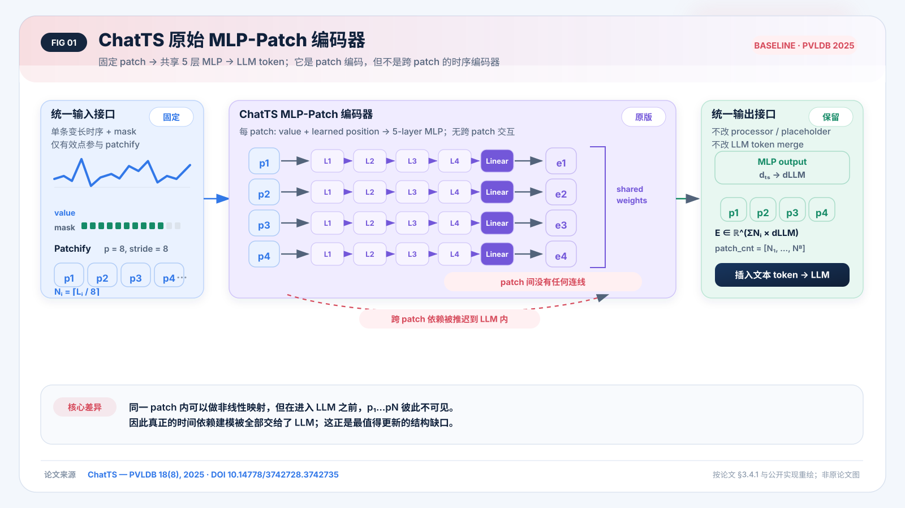
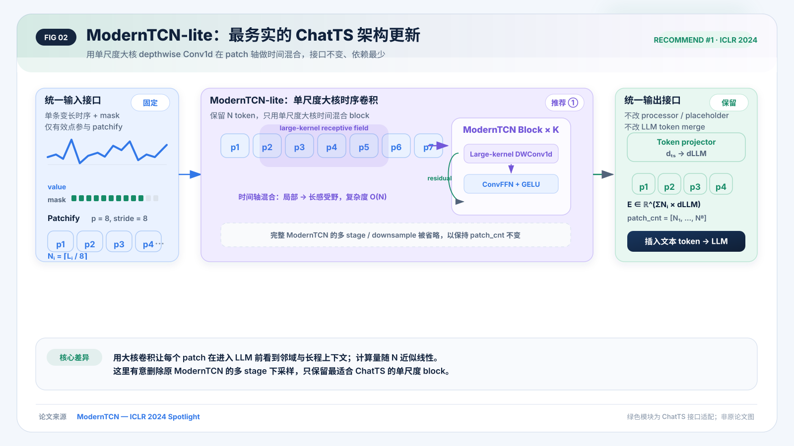
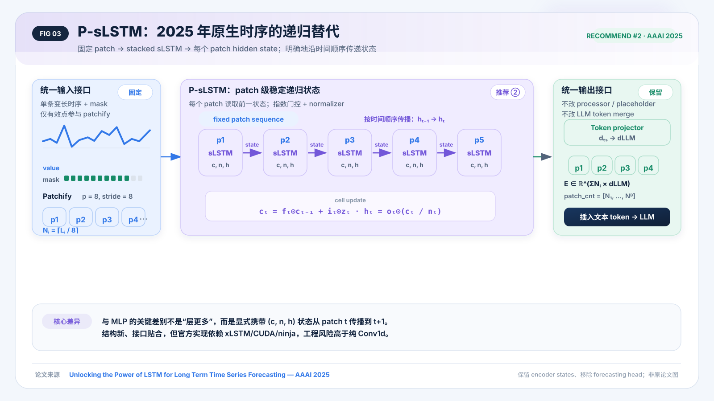
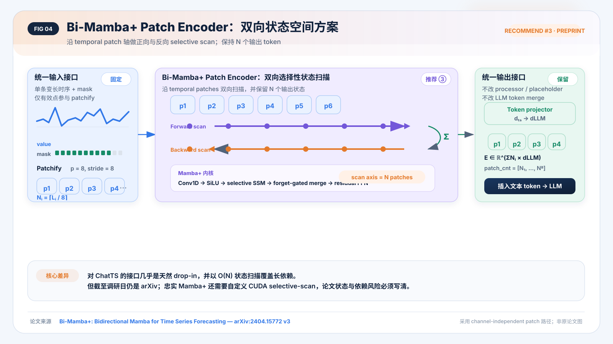
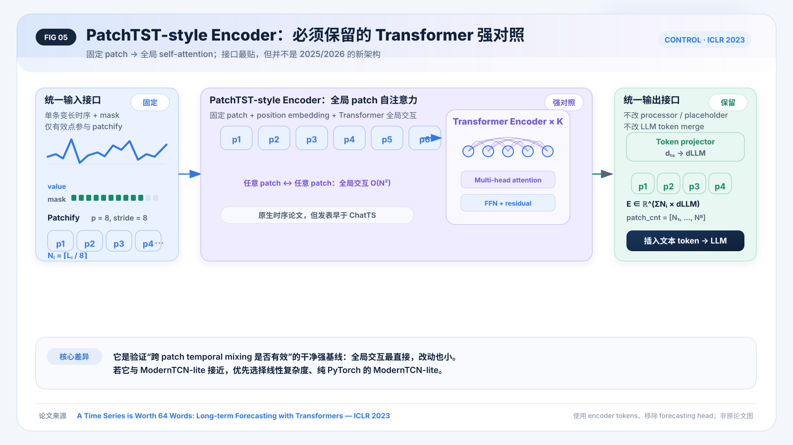
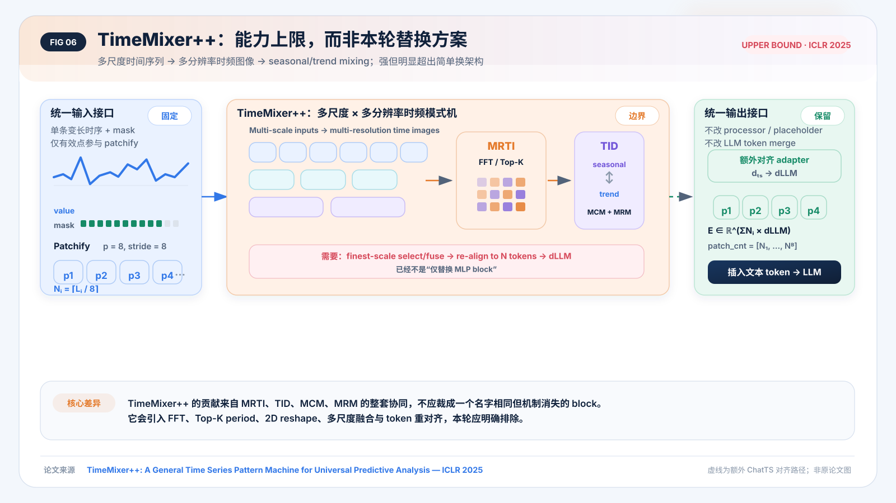
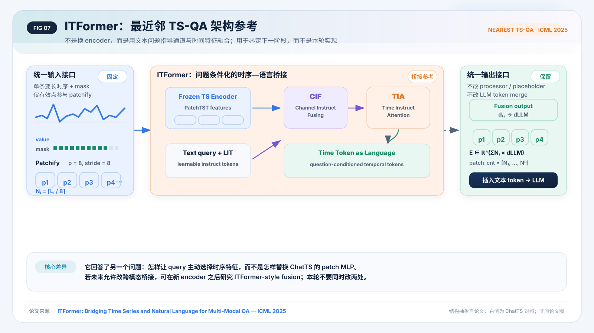

# ChatTS Time Encoder 架构更新调研

> 调研截止：2026-07-25
> 目标：只换架构，不改 tokenizer、patch 数、LLM token merge 或训练任务。
> 结论先行：**主线选 ModernTCN-lite；第二选择 P-sLSTM；Bi-Mamba+ 作为依赖与发表状态可接受时的高潜力方案。PatchTST 必须作为强对照。**

## 1. 先回答“这是不是时序编码”

ChatTS 原始结构确实接收时间序列数组，但在进入 LLM 前，它只把固定大小 patch 分别送进同一个 5 层 MLP。每个 patch 内有非线性变换，patch 之间却没有信息交换。因此更精确的叫法是“时间序列 patch 投影器”，而不是“显式跨 patch 时序编码器”。

论文原文在 §3.4.1 写明 fixed-size patches 与 5-layer MLP；限制部分也把更有效的多模态编码与融合列为未来方向：[ChatTS, PVLDB 2025](https://www.vldb.org/pvldb/vol18/p2385-xie.pdf)。本地公开实现也保持同一接口：有效长度 → Nᵢ=ceil(Lᵢ/p) → 尾 patch 补值 → 所有 patch 独立通过共享 MLP → 返回 features 与 patch_cnt。

[官方 ChatTS-8B 配置](https://huggingface.co/bytedance-research/ChatTS-8B/blob/main/config.json)进一步给出 p=8、5 层、hidden=4096、position embedding 开启。按公开维度计算，当前 time encoder（含位置表）约 67.8M 参数：它在机制上简单，但并不“小”。因此新 backbone 更适合先在 d_ts≈512 的窄空间建模，再投影一次到 d_LLM。

## 2. 架构选择结论

| 排位 | 架构 | 真正沿时间 patch 混合 | 保持 N 个 token | 工程复杂度 | 发表状态 | 本轮建议 |
|---:|---|---|---|---|---|---|
| 1 | ModernTCN-lite | 大核 depthwise Conv1d | 是 | 低 | ICLR 2024 Spotlight | **主方案** |
| 2 | P-sLSTM | patch 级递归状态 | 是 | 中 | AAAI 2025 | **现代替代** |
| 3 | Bi-Mamba+ Patch | 双向 selective scan | 是 | 中高 | arXiv v3 | **高潜力/有风险** |
| C | PatchTST-style | 全局 self-attention | 是 | 低中 | ICLR 2023 | **必须对照** |
| — | TimeMixer++ | 多尺度时频混合 | 否，需对齐 | 高 | ICLR 2025 | 暂不实施 |
| — | ITFormer | query-conditioned 跨模态融合 | 改融合接口 | 中高 | ICML 2025 | 下一阶段参考 |

这里的排序是“在当前 ChatTS 约束下的推荐顺序”，不是跨论文性能排名。尚无论文在完全相同的 ChatTS QA/推理训练设置中直接比较这些 encoder。

## 3. 推荐 ①：ModernTCN-lite

为什么是第一选择：

- 它补上的正是原 MLP 缺少的能力：patch 进入 LLM 前的时间依赖。
- 大核 depthwise Conv1d 在 patch 轴工作，复杂度随 token 数近似线性。
- 可用标准 PyTorch Conv1d、Norm、GELU 实现，不引入 Mamba CUDA kernel。
- [ModernTCN](https://proceedings.iclr.cc/paper_files/paper/2024/hash/86b1437c1e4c3b3c4debff98234a67e7-Abstract-Conference.html) 是原生通用时序论文，覆盖预测、分类、插补、异常检测等多任务证据。

本报告建议的是显式命名的 **ModernTCN-lite adaptation**，而不是照搬完整论文：保留单尺度大核 block，删除会改变 token 数的多 stage/downsample/upsample。建议起点：

~~~text
Patchify(p=8, stride=8)
→ Linear(p → d_ts=512)
→ [Large-kernel DWConv1d(k=7/9) → Norm → ConvFFN → Residual] × 4
→ Linear(512 → d_LLM)
→ 原 patch_cnt / token replacement
~~~

## 4. 推荐 ②：P-sLSTM

[P-sLSTM, AAAI 2025](https://ojs.aaai.org/index.php/AAAI/article/view/33303) 本身就是 fixed patch + channel-independent + stacked sLSTM 的原生时序结构。移除 forecasting head 后，每个 patch 的 hidden state 可以直接作为 ChatTS token。

它的价值在于明确的时间状态传播；风险在于 xLSTM/sLSTM 工程依赖、递归并行性与指数门控的数值稳定。若项目非常强调“2025 架构更新”的叙事，它比 PatchTST 更新、更容易解释；若强调最少工程风险，仍应排在 ModernTCN-lite 后。

建议起点：d_ts=512、2–3 层、保留每个 patch 的 hidden state、最后一次性投影到 d_LLM。

## 5. 推荐 ③：Bi-Mamba+ Patch Encoder

[Bi-Mamba+ v3](https://arxiv.org/abs/2404.15772) 的 channel-independent 路径把 patch 当作时间 token，并做前向与反向 Mamba+；输出 token 数不变，所以接口非常适合 ChatTS。官方实现见 [Bi-Mamba4TS repository](https://github.com/Leopold2333/Bi-Mamba4TS)。

但这条路线需要诚实标注两个风险：

- 截至调研日仍是 arXiv/CoRR，而不是正式会议或期刊。
- 忠实复现 Mamba+ 需要修改后的 CUDA selective scan；若只用标准双向 Mamba，工程更简单，但应写成“Bi-Mamba+-style adaptation”，不能暗示完整复现。

## 6. 必须对照：PatchTST-style Encoder

[PatchTST, ICLR 2023](https://iclr.cc/virtual/2023/poster/10876) 与 ChatTS 的 fixed patch 接口最贴。它能回答一个非常干净的问题：只要给 patch 加全局 self-attention，是否就能改善对趋势、周期、局部异常与跨段关系的理解？

它不够新，所以不建议作为 2026 工作的主要架构故事；但如果不做这个对照，就很难证明大核卷积、sLSTM 或 Mamba 的必要性。

## 7. 两个边界：为什么本轮不做 TimeMixer++ / ITFormer

### TimeMixer++：能力强，但已经是完整时频系统

[TimeMixer++, ICLR 2025](https://proceedings.iclr.cc/paper_files/paper/2025/hash/2b187165e28fdfdc0ffb34d1bfff2b0c-Abstract-Conference.html) 包含 MRTI、TID、MCM、MRM：FFT/Top-K 周期、2D time image、趋势/季节双轴注意力、多尺度上下行融合。它的优势来自整套系统；裁掉这些模块后不应继续称为 TimeMixer++。接入 ChatTS 还必须重对齐输出 token，明显违背“只换几层 MLP”。

### ITFormer：最相关的 TS-QA 后续，但改的是桥接

[ITFormer, ICML 2025](https://proceedings.mlr.press/v267/wang25av.html) 是本次检索中与 ChatTS 最接近的正式时间序列问答架构。它用文本 instruct tokens 引导 channel/time feature fusion，再连接冻结 LLM。它非常值得在 related work 中讨论，但若本轮同时改 encoder 与 cross-modal bridge，就无法把收益归因于“架构替换”。

## 8. 最小可发表、又不复杂的实验矩阵

建议只训练四条主线：

~~~text
ChatTS-MLP
vs PatchTST-style
vs ModernTCN-lite
vs P-sLSTM
(Bi-Mamba+ 作为资源允许时的附加组)
~~~

公平约束必须固定：

- patch size / stride 均为 8；
- 每条序列输出 Nᵢ=ceil(Lᵢ/8) 个 token；
- 统一 d_ts 与最终 d_ts→d_LLM projector；
- 尽量匹配 encoder 参数量，而不是让某个模型直接在 d_LLM 宽度堆多层；
- 相同数据、训练步数、LLM、token replacement 与损失；
- 先只比较架构，暂不加 FFT、动态周期、跨模态新 adapter 或额外预训练。

最低限度的分析不是“复杂新机制”，而是按结构回答：

1. no mixing（MLP）；
2. local/large receptive field（ModernTCN-lite）；
3. global all-to-all（PatchTST）；
4. recurrent state（P-sLSTM）；
5. selective state scan（可选 Bi-Mamba+）。

这样论文里的主张可以收敛为：**在 LLM 之前显式建模跨 patch temporal dependencies，是否比独立 patch projection 更适合时序理解与推理。**

## 9. 风险与写作边界

- 不能在没有 ChatTS 对照实验时写“某架构优于 MLP”；当前结论是适配性与证据排序。
- “只换 backbone”本身通常不足以构成强方法创新。更稳的论文叙事是发现并验证 ChatTS 的 pre-LLM temporal mixing 缺口，再系统比较不同 mixer 范式。
- 所有图均为本报告根据论文与公开实现重新绘制的结构解释图，不是复制论文原图；绿色模块表示 ChatTS-specific adaptation。
- S-Mamba、ms-Mamba、iTransformer 的主要 scan/token 轴不是时间 patch，本报告没有把它们误当成直接时序替代。

## 10. 证据包

- [候选论文表](literature-search-20260725-chatts-time-encoder/papers.md)
- [机器可读 CSV](literature-search-20260725-chatts-time-encoder/papers.csv)
- [检索与筛选记录](literature-search-20260725-chatts-time-encoder/search-notes.md)
