# ChatTS Time Encoder 架构更新调研

> 调研更新：2026-07-28；目标：只替换时间序列编码架构，保持 patch、token 数、文本占位符替换、LLM 和训练任务不变。
> 图像说明：本报告中的论文图均从原始论文 PDF 裁切，未重绘；图号、PDF 页码和链接见每图下方。

## 0. 结论先行

ChatTS 的输入确实是时间序列，但原始 time encoder 更准确地说是**共享的逐 patch MLP 投影器**：一个 patch 内部会经过非线性变换，不同 patch 在进入 LLM 之前没有信息交换。因此，这次更新真正应该补的是 **pre-LLM temporal mixing**，而不是简单增加 MLP 层数。

在“只换架构、不要复杂系统”的约束下，我的排序是：

| 排位 | 方案 | 核心时间机制 | 能否保持每 patch 一个 token | 工程复杂度 | 结论 |
| ---: | --- | --- | --- | --- | --- |
| 1 | **ModernTCN-lite** | 大核 depthwise Conv1d | 是 | 低 | 最稳妥主方案 |
| 2 | **InceptionTime-lite** | 多尺度并行 Conv1d | 是 | 低 | 2026 直接 LLM 证据支持的方案 |
| 3 | **P-sLSTM** | patch 级递归状态 | 是 | 中 | 更新感更强的正式论文方案 |
| 4 | **Bi-Mamba+ Patch** | 双向 selective state scan | 是 | 中高 | 高潜力，但依赖和发表状态有风险 |
| 对照 | **PatchTST-style** | 全局 self-attention | 是 | 低中 | 必须保留的强对照 |
| 边界 | TimeMixer++ | 多尺度时频混合 | 不能直接保证 | 高 | 不适合本轮 |
| 边界 | ITFormer | 问题条件化跨模态融合 | 会改融合接口 | 中高 | 适合下一阶段，不是单纯换 encoder |

最推荐的最小实验矩阵是：

```text
ChatTS-MLP
vs PatchTST-style
vs ModernTCN-lite
vs InceptionTime-lite
vs P-sLSTM

资源允许时再加 Bi-Mamba+。
```

这里的排序是**对 ChatTS 当前接口的适配排序**，不是跨论文性能排行榜。现有论文没有在完全相同的 ChatTS QA/推理训练设置下直接比较这些编码器。

---

## 1. ChatTS 原始 MLP-Patch：它为什么不算完整的时序编码器

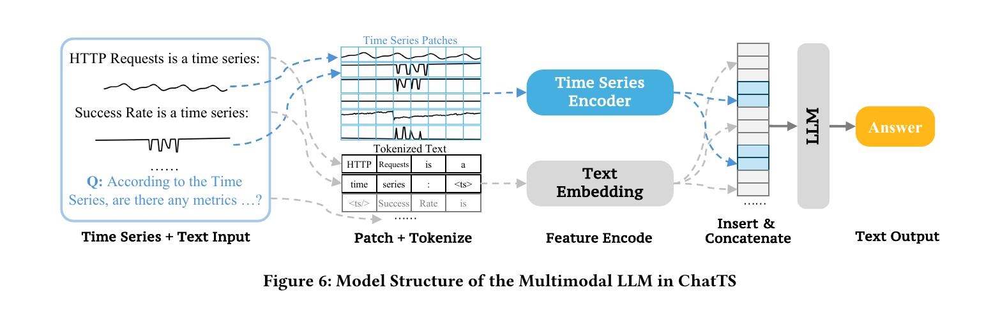

*原图来源：[ChatTS: Aligning Time Series with LLMs via Synthetic Data for Enhanced Understanding and Reasoning](https://www.vldb.org/pvldb/vol18/p2385-xie.pdf)，Figure 6，PDF 第 5 页（论文页码 2389），PVLDB 2025。*

### 原图怎么读

1. 左侧把时间序列和文本问题放在同一输入中。
2. 时间序列被切成固定大小 patch；文本走 tokenizer。
3. time-series patch 经过 Time Series Encoder，文本 token 经过 Text Embedding。
4. 两类 embedding 按占位符位置拼回同一个 token 序列，再送入 LLM。

图里没有画出 Time Series Encoder 的内部结构，但论文 §3.4.1 明确写的是：**每个 patch 由一个简单的 5 层 MLP 编码**。公开实现同样先计算

\[
N_i=\lceil L_i/p\rceil
\]

再补齐最后一个 patch，把所有 patch 独立送进共享 MLP，最后返回 features 与 `patch_cnt`。

### 真正的结构缺口

假设一条序列被切成 \(p_1,p_2,\ldots,p_N\)，原编码器实际执行的是

\[
e_i=\mathrm{MLP}(p_i+\mathrm{pos}_i).
\]

这里没有 \(e_i=f(p_1,\ldots,p_N)\) 这种跨 patch 关系。趋势、周期、前后异常呼应等依赖只能等 patch token 进入 LLM 后再学。

因此它当然处理的是时序数据，但更精确的命名是：

> **time-series patch projector，而不是显式 temporal encoder。**

### 这次替换必须保持的接口

- patch size 与 stride 不变，建议继续使用 8；
- 每条样本仍输出 \(N_i=\lceil L_i/8\rceil\) 个 token；
- 保留原 `patch_cnt`；
- 保留原 `<ts> ... <ts/>` token replacement；
- 不改 LLM、不改训练数据、不增加新的预训练目标；
- 新编码器先在较窄的 \(d_{ts}\) 空间建模，再用一次线性层投影到 \(d_{LLM}\)。

---

## 2. 推荐一：ModernTCN-lite

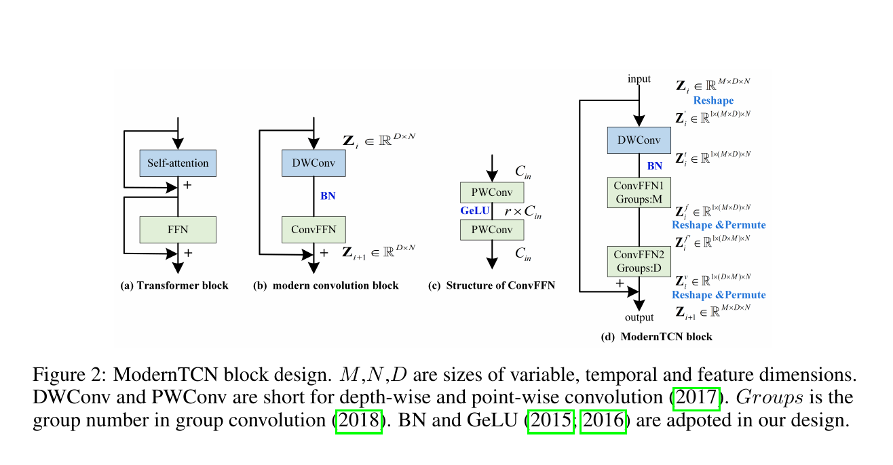

*原图来源：[ModernTCN: A Modern Pure Convolution Structure for General Time Series Analysis](https://proceedings.iclr.cc/paper_files/paper/2024/hash/86b1437c1e4c3b3c4debff98234a67e7-Abstract-Conference.html)，Figure 2，PDF 第 3 页，ICLR 2024 Spotlight。*

### 原图怎么读

Figure 2 从左到右给出了 ModernTCN block 的设计过程：

1. **Transformer block** 用 self-attention 做 token mixing，再用 FFN 做 feature mixing。
2. **modern convolution block** 用 DWConv 替代 self-attention，用 ConvFFN 替代普通 FFN。
3. **ConvFFN** 由 point-wise convolution、GeLU 和第二个 point-wise convolution组成。
4. **ModernTCN block** 先 reshape，把大核 DWConv 放在时间维 \(N\) 上；随后再次 reshape/permute，用分组 ConvFFN 分别混合变量与特征。

对 ChatTS 最重要的是 Figure 2(b) 的思想：

> DWConv 负责沿时间 token 交换信息，ConvFFN 负责每个 token 内的特征变换。

这正好补上原始 MLP 没有跨 patch temporal mixing 的缺口。

### 为什么它是第一选择

- 原生时间序列论文，不是把图像 backbone 生硬移植过来；
- 大核 Conv1d 能覆盖多个相邻 patch，计算复杂度随 token 数近似线性；
- 只依赖标准 PyTorch Conv1d、Norm、GELU；
- 没有 Mamba 自定义 CUDA，也没有 FFT、动态周期选择或多模态新桥接；
- ModernTCN 原论文覆盖预测、分类、插补和异常检测等多类时序任务。

### 如何最小化接入 ChatTS

原论文完整模型包含多 stage 和下采样。为了保持 ChatTS 的 token 数，不能原样照搬；应明确命名为 **ModernTCN-lite adaptation**：

```text
Patchify(p=8, stride=8)
→ Linear(8 → d_ts=512)
→ [Large-kernel DWConv1d(k=7 或 9)
   → Norm
   → ConvFFN
   → Residual] × 4
→ Linear(512 → d_LLM)
→ 原 patch_cnt / token replacement
```

关键约束是卷积使用 same padding，不做 temporal downsampling，输入 \(N\) 个 patch，输出仍是 \(N\) 个 token。

### 风险与边界

- “lite” 是本项目适配，不是原论文中的官方变体；
- 如果 patch 数很少，大到 51 的卷积核没有必要，建议先从 7/9 开始；
- ChatTS 常把多条单变量序列分别插入文本，因此第一版不要额外引入复杂的跨变量 mixing。

**我的判断：**这是最容易实现、最容易做公平消融、最不容易把论文故事搞复杂的主方案。

---

## 3. 推荐二：InceptionTime-lite——旧架构，但有 2026 年最贴近问题的直接证据

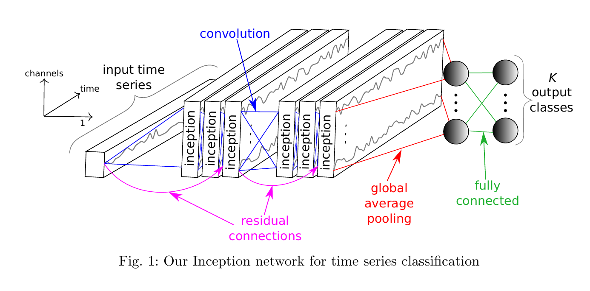

*原图来源：[InceptionTime: Finding AlexNet for Time Series Classification](https://arxiv.org/abs/1909.04939)，Figure 1，PDF 第 5 页；正式发表于 Data Mining and Knowledge Discovery 2020。*

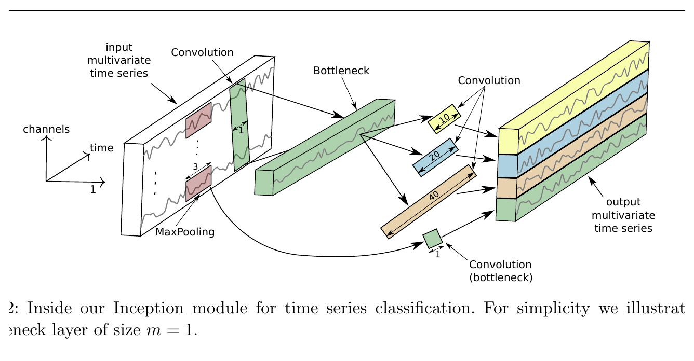

*同一论文 Figure 2，PDF 第 6 页：Inception module 内部结构。*

### 原图怎么读

Figure 1 展示了完整 InceptionTime：

1. 多个 Inception module 串联；
2. 每三个 module 加一次 residual connection；
3. 最后做 global average pooling；
4. 全连接层输出分类结果。

Figure 2 展示单个 Inception module：

1. 先用 \(1\times1\) bottleneck 压缩通道；
2. 并行运行多种长度的 1D 卷积，原图示例为 10、20、40；
3. 另设 MaxPooling + bottleneck 分支；
4. 把所有分支按 feature 维拼接。

它与 ModernTCN 的差别非常直观：

- ModernTCN：**一个大核**逐层扩大时间感受野；
- InceptionTime：**多个不同尺度的卷积核并行**看短、中、长模式。

### 为什么 2026 年仍值得认真做

2026 年预印本 *An Exploratory Study to Repurpose LLMs to a Unified Architecture for Time Series Classification* 专门比较了 Inception、MLP、Transformer、CNN、ResNet 与冻结 LLM 的组合：

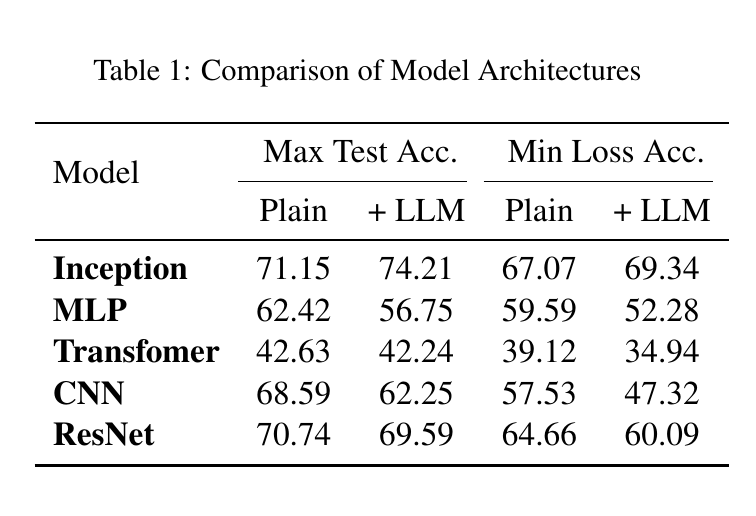

*原表来源：[An Exploratory Study to Repurpose LLMs to a Unified Architecture for Time Series Classification](https://arxiv.org/abs/2601.09971)，Table 1，PDF 第 4 页，arXiv 2026。*

在该论文自己的 UCR 分类设置中，Inception 是唯一在两种报告口径下接入 LLM 后都提升的编码器家族。这个结果**不能直接推出它在 ChatTS QA 上也会更好**，但它是目前最贴近“时间序列 encoder + LLM，究竟选什么 backbone”这一问题的 2026 直接证据。

### 如何最小化接入 ChatTS

原始 InceptionTime 的 global average pooling 会把时间维压成一个向量，不能直接用于 ChatTS。最小改法是：

```text
Patchify(p=8)
→ Linear(8 → d_ts)
→ [Inception1D(k=3/5/9) + MaxPool branch + Residual] × 2 blocks
→ 保留每个位置的 feature，不做 Global Average Pooling
→ Linear(d_ts → d_LLM)
```

所有并行分支使用 same padding，因此输入 \(N\) 个 patch，拼接并投影后仍输出 \(N\) 个 token。

### 风险与边界

- InceptionTime 本身不是新论文，新的只是 2026 年在 LLM 混合架构中的支持证据；
- 原论文对 raw timestep 做卷积，本报告建议对 patch token 轴做卷积，因此必须写成 InceptionTime-style/lite adaptation；
- 多分支卷积的显存和 kernel 调度比单个 ModernTCN block 略复杂，但仍远低于 TimeMixer++。

**我的判断：**如果你想在 2026 年的论文里体现“我们不是只凭感觉换 backbone”，它是很有价值的第二方案；如果只实现一个，仍优先 ModernTCN-lite。

---

## 4. 推荐三：P-sLSTM

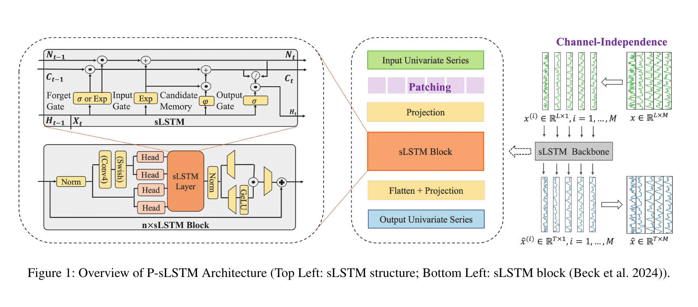

*原图来源：[Unlocking the Power of LSTM for Long Term Time Series Forecasting](https://ojs.aaai.org/index.php/AAAI/article/view/33303)，Figure 1，PDF 第 4 页，AAAI 2025。*

### 原图怎么读

右侧先把多变量序列按 channel 拆成多条单变量序列，共享同一个 sLSTM backbone。中间主路径是：

```text
Input Univariate Series
→ Patching
→ Projection
→ sLSTM Block
→ Flatten + Projection
→ Output Univariate Series
```

左上角是 sLSTM cell，除了 hidden state \(H_t\) 与 cell state \(C_t\)，还包含 normalizer state \(N_t\)。输入门和遗忘门可采用指数形式，增强状态更新范围。左下角展示 sLSTM block 内部的 Norm、卷积、多个 head、sLSTM layer、门控和 residual。

### 它与 MLP 的本质区别

MLP 对每个 patch 独立执行同一函数；P-sLSTM 的第 \(t\) 个 patch 会读取前一个 patch 的状态：

\[
(h_t,c_t,n_t)=\mathrm{sLSTM}(x_t,h_{t-1},c_{t-1},n_{t-1}).
\]

因此时间方向和信息流都非常明确，适合解释“为什么这是真正的时序编码”。

### 如何最小化接入 ChatTS

- 保留 patching 与 projection；
- 使用 2-3 层 sLSTM；
- 删除原 forecasting 的 `Flatten + Projection`；
- 保留每个 patch 对应的 hidden state \(h_1,\ldots,h_N\)；
- 最后统一投影到 \(d_{LLM}\)。

### 风险与边界

- xLSTM/sLSTM 依赖比标准 Conv1d 重；
- 递归状态的并行性不如卷积或 attention；
- 指数门控需要关注数值稳定性；
- 原论文是 forecasting，不是 QA。

**我的判断：**适合做“2025 架构更新”的正式论文方案，方法解释性很好，但工程优先级排在两个卷积方案之后。

---

## 5. 条件推荐：Bi-Mamba+ Patch Encoder

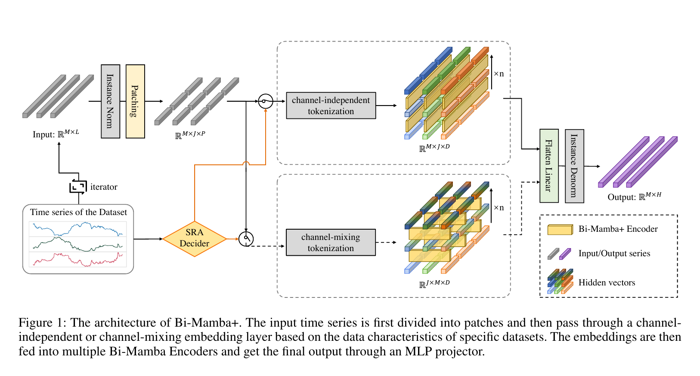

*原图来源：[Bi-Mamba+: Bidirectional Mamba for Time Series Forecasting](https://arxiv.org/abs/2404.15772)，Figure 1，PDF 第 3 页，arXiv v3。*

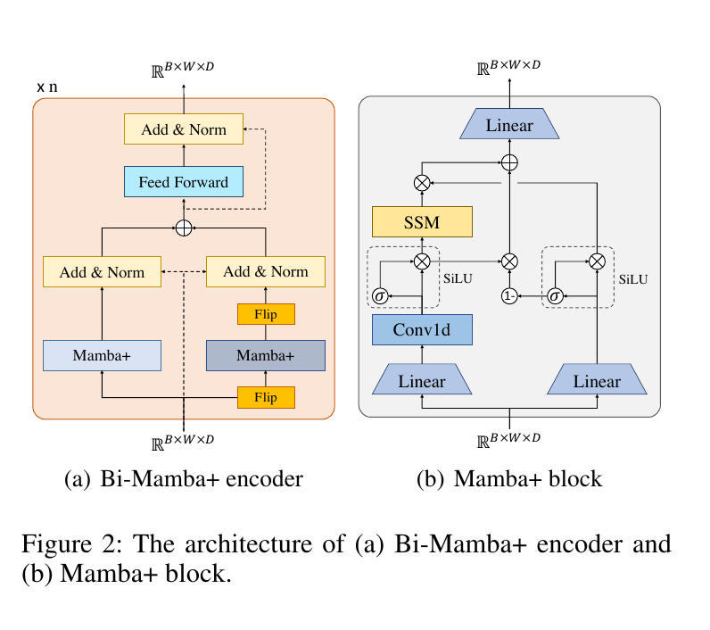

*同一论文 Figure 2，PDF 第 5 页：Bi-Mamba+ encoder 与 Mamba+ block。*

### 原图怎么读

Figure 1 先做 Instance Norm 和 Patching，再由 SRA Decider 在两种 tokenization 中选择：

- **channel-independent**：每个变量独立，patch 是时间 token；
- **channel-mixing**：混合变量维信息。

之后堆叠多个 Bi-Mamba+ Encoder，最后 Flatten Linear 产生预测。

Figure 2(a) 画出了双向结构：一条分支正向处理，一条分支先 Flip 再处理，反向结果翻转回来后相加，并经过 FFN 与 Add&Norm。Figure 2(b) 在普通 Mamba 的 SSM 分支外加入互补的 forget gate，用于组合新特征与历史特征。

### 为什么接口很合适

在 channel-independent 路径中，编码器内部张量是 \(B\times W\times D\)，其中 \(W\) 就是 patch token 数。删除最后的 forecasting head 后，可以直接把这 \(W\) 个 hidden vectors 投影成 ChatTS token。

### 最小接入方式

```text
Patchify(p=8)
→ Linear(8 → d_ts)
→ [Forward Mamba+ + Backward Mamba+ + Add&Norm + FFN] × 2
→ Linear(d_ts → d_LLM)
```

### 为什么只做条件推荐

- 本轮检索仍只确认到 arXiv/CoRR 版本，不能写成正式会议论文；
- 忠实实现 Mamba+ 需要修改后的 selective scan/CUDA；
- 如果只使用标准双向 Mamba，应明确写成 “Bi-Mamba+-style adaptation”；
- 对短 patch 序列，Mamba 的线性长序列优势可能不明显。

**我的判断：**有资源和 CUDA 经验时可作为高潜力附加组，不建议把它作为唯一主线。

---

## 6. 必须对照：PatchTST-style Encoder

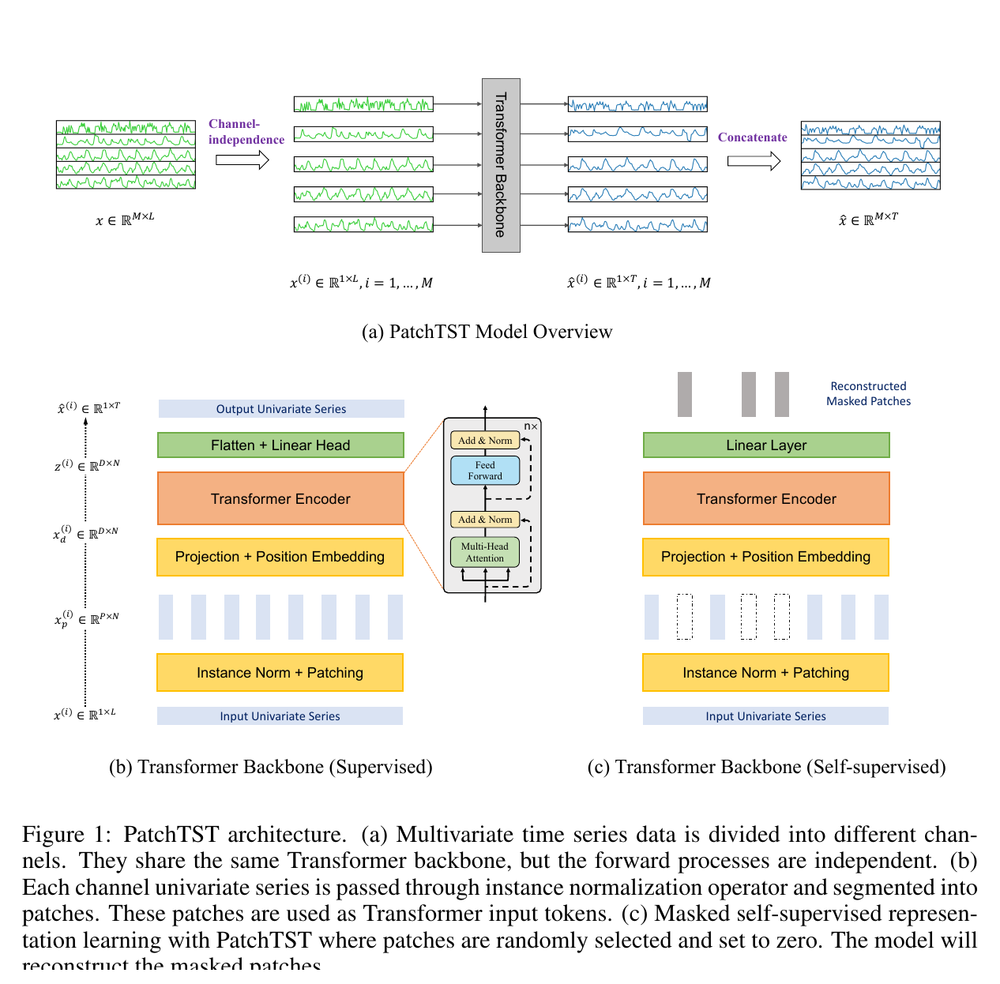

*原图来源：[A Time Series is Worth 64 Words: Long-term Forecasting with Transformers](https://arxiv.org/abs/2211.14730)，Figure 1，PDF 第 4 页，ICLR 2023。*

### 原图怎么读

Figure 1(a) 先把多变量时间序列拆成多个 channel，各 channel 独立共享同一个 Transformer backbone。Figure 1(b) 是监督预测路径：

```text
Instance Norm + Patching
→ Projection + Position Embedding
→ Transformer Encoder
→ Flatten + Linear Head
```

Figure 1(c) 是遮盖 patch 的自监督重建路径。

### 为什么它必须存在

PatchTST 与 ChatTS 的 patch 接口几乎完全同构。删除 Flatten/forecasting head，保留 Transformer Encoder 的 \(N\) 个输出 token 即可。

它回答一个非常干净的问题：

> 给 patch 加最普通的全局 self-attention，是否已经足以改善 ChatTS 的趋势、周期和跨段关系理解？

如果 ModernTCN、InceptionTime 或 P-sLSTM 没有明显超过这个基线，就很难证明更特殊 mixer 的必要性。

### 最小接入方式

```text
Patchify(p=8)
→ Linear(8 → d_ts) + Position Embedding
→ Transformer Encoder × 2-4
→ Linear(d_ts → d_LLM)
```

风险是 self-attention 复杂度为 \(O(N^2)\)，但 ChatTS 已经 patchify，\(N\) 通常不会像 raw timestep 那样大。它不够新，所以适合作为强对照，不适合作为 2026 论文的唯一架构故事。

---

## 7. 两个边界方案：为什么这轮不建议做

### 7.1 TimeMixer++：原生时序且很强，但已经不是“简单换 encoder”

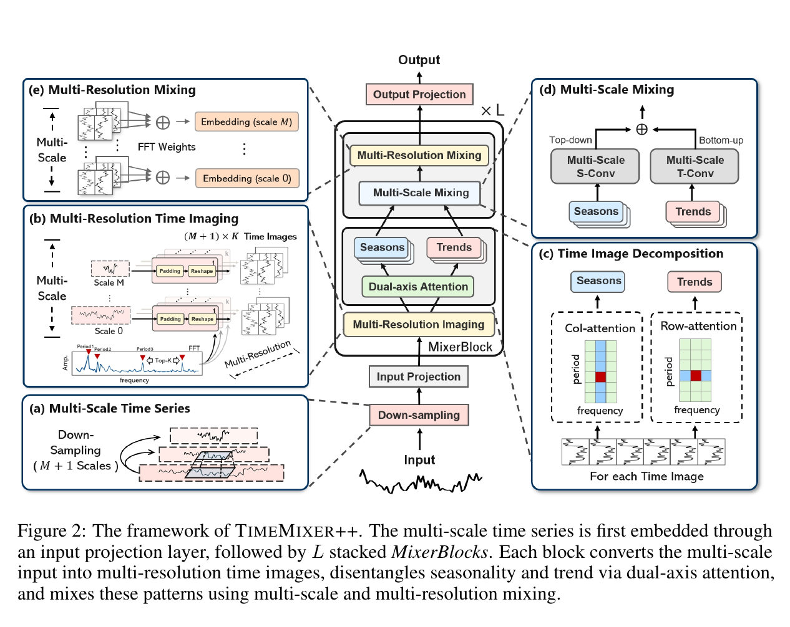

*原图来源：[TimeMixer++: A General Time Series Pattern Machine for Universal Predictive Analysis](https://proceedings.iclr.cc/paper_files/paper/2025/hash/2b187165e28fdfdc0ffb34d1bfff2b0c-Abstract-Conference.html)，Figure 2，PDF 第 4 页，ICLR 2025。*

原图包含五部分：

1. 多尺度时间序列下采样；
2. 基于 FFT 周期的 Multi-Resolution Time Imaging；
3. 双轴 attention 分解趋势与季节；
4. top-down / bottom-up Multi-Scale Mixing；
5. Multi-Resolution Mixing。

它的能力来自整套时频系统。接入 ChatTS 会遇到：

- 多尺度分支输出长度不同；
- 需要重新定义 \(N\) 个 LLM token 如何对齐；
- FFT/Top-K 周期与双轴 attention 引入多个新超参数；
- 裁掉大部分模块后不能再声称复现 TimeMixer++。

因此它适合未来完整方法升级，不符合本轮“只替换几层 MLP”的约束。

### 7.2 ITFormer：最接近 TS-QA，但它改的是跨模态桥接

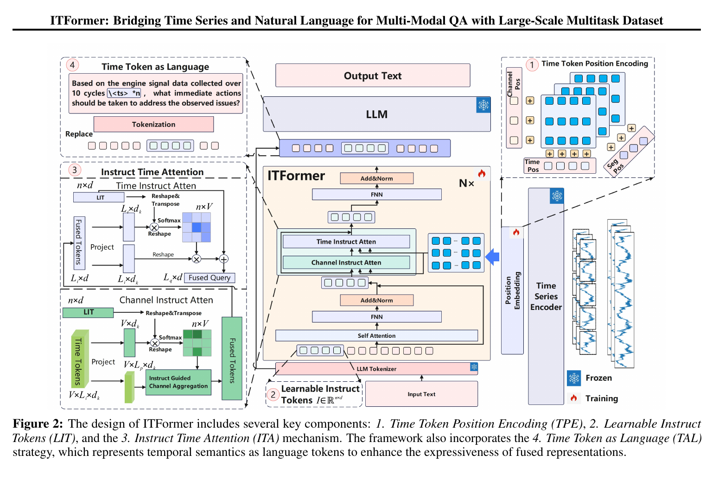

*原图来源：[ITFormer: Bridging Time Series and Natural Language for Multi-Modal QA with Large-Scale Multitask Dataset](https://proceedings.mlr.press/v267/wang25av.html)，Figure 2，PDF 第 4 页，ICML 2025。*

ITFormer 的四个关键模块是：

1. Time Token Position Encoding；
2. Learnable Instruct Tokens；
3. Channel/Time Instruct Attention；
4. Time Token as Language。

右侧时间序列先经过冻结的 time-series encoder，文本问题生成 instruct tokens，再由问题条件化 attention 融合时间与文本特征，最后送入冻结 LLM。

它与 ChatTS 的差异不是“用什么 temporal backbone”，而是“如何让问题主动查询时间特征”。如果本轮同时改 encoder 与融合桥接，实验收益无法归因到单一架构替换。

因此 ITFormer 非常值得写进 Related Work，也适合下一阶段研究，但不应放进本轮主实验。

---

## 8. 最小、干净、可解释的实现建议

### 8.1 统一接口

所有可替换编码器都实现：

```python
features, patch_cnt = time_encoder(timeseries, valid_lengths)
```

并满足：

```text
features.shape == [sum(patch_cnt), d_llm]
patch_cnt[i] == ceil(valid_length[i] / 8)
```

### 8.2 统一容量

建议统一：

- `patch_size = stride = 8`
- `d_ts = 512`
- 最终 `Linear(512, d_llm)`
- 深度 2-4 blocks
- same padding，禁止改变 token 数
- 尽量匹配参数量，而不是让某一模型直接在 4096 维堆层

### 8.3 公平对照

固定以下所有因素：

- 同一 ChatTS 数据；
- 同一 LLM 与 tokenizer；
- 同一训练步数、batch、优化器和学习率搜索预算；
- 同一 patch normalization；
- 同一 token replacement；
- 同一 loss；
- 不给某个架构额外预训练。

### 8.4 最重要的消融维度

| 组别 | 跨 patch 信息流 | 代表模型 |
| --- | --- | --- |
| No mixing | 无 | ChatTS MLP |
| Local/multi-scale convolution | 局部到长感受野 | ModernTCN-lite / InceptionTime-lite |
| Global all-to-all | 全局注意力 | PatchTST-style |
| Recurrent state | 顺序状态传播 | P-sLSTM |
| Selective state scan | 双向选择性状态 | Bi-Mamba+ |

这使论文主张能够收敛为：

> **在 LLM 之前显式建模跨 patch temporal dependencies，是否比独立 patch projection 更适合时间序列理解与推理？**

---

## 9. 最终建议

如果只做一个新架构：**ModernTCN-lite**。

如果做一篇结构干净的论文：

1. ChatTS-MLP：原基线；
2. PatchTST-style：全局 attention 对照；
3. ModernTCN-lite：主方法；
4. InceptionTime-lite：多尺度卷积与 2026 LLM 证据；
5. P-sLSTM：现代递归对照；
6. Bi-Mamba+：资源允许时追加。

论文里不要写“换成某架构必然优于 MLP”。在真正跑完 ChatTS 对照实验前，当前结论只是：

- ModernTCN-lite 的**接口适配性、工程简单度和正式时序证据**最好；
- InceptionTime-lite 有一条**2026 年最贴近 encoder+LLM 的直接经验信号**；
- P-sLSTM 的**时序状态解释最明确**；
- Bi-Mamba+ 的**长依赖机制最现代，但风险最高**；
- PatchTST 是不可省略的公平对照。

单纯“把 MLP 换成另一个 backbone”通常不足以构成强创新。更稳的论文叙事是：先指出 ChatTS 的 pre-LLM temporal mixing 缺口，再系统比较不同 mixer 范式，并用相同 token 接口控制变量验证。

---

## 10. 证据与文件

- [原论文图来源清单](SOURCE_MANIFEST.md)
- [候选论文与质量评分](literature-search-20260728-chatts-time-encoder/papers.md)
- [机器可读 CSV](literature-search-20260728-chatts-time-encoder/papers.csv)
- [检索、筛选与风险记录](literature-search-20260728-chatts-time-encoder/search-notes.md)
