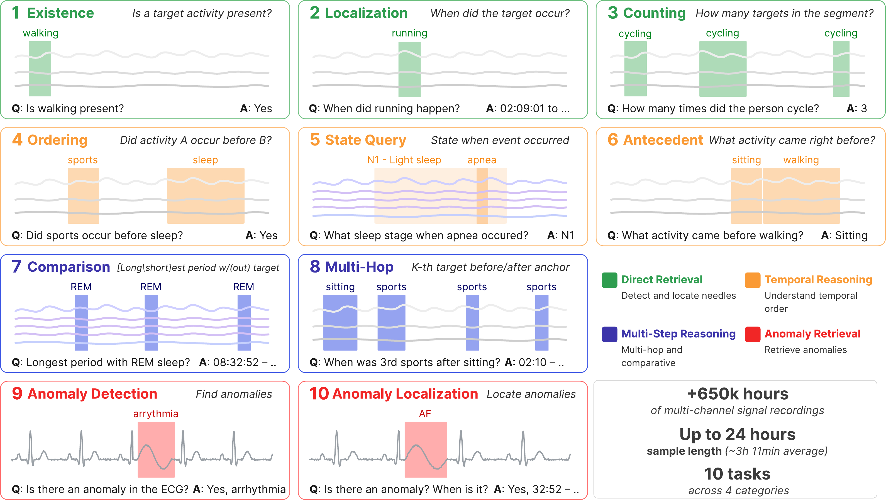

# TS-Haystack

### A Multi-Task Retrieval Benchmark for Long-Context Time-Series Reasoning

> **Update [03/02/2026]:** 🇧🇷 The workshop version of TS-Haystack was accepted to **ICLR TSLAM 2026!** This `main` branch hosts the extended full-paper code; the original workshop version is archived on the [`iclr-workshop`](https://github.com/AI-X-Labs/TS-Haystack/tree/iclr-workshop) branch.

<p align="center">
  
</p>

This repository contains the full **TS-Haystack** code: the benchmark-generation
pipeline, the time-series language model (TSLM) training/evaluation framework,
and **ARTS** — our agentic retrieval baseline.

**🤗 Datasets (Hugging Face):** https://huggingface.co/collections/nz00shuuuu/ts-haystack

---

## What is TS-Haystack?

TS-Haystack extends the needle-in-a-haystack paradigm to time series. It turns
long, expert-annotated recordings into **ten event-grounded question-answering
tasks** at controlled context lengths from **100 s to 24 h**, across four
domains:

| Category | Tasks |
|----------|-------|
| **Direct Retrieval** | Existence, Localization, Counting |
| **Temporal Reasoning** | Ordering, State Query, Antecedent |
| **Multi-Step Reasoning** | Comparison, Multi-Hop |
| **Anomaly Retrieval** | Anomaly Detection, Anomaly Localization |

The benchmark is built from four openly available source datasets:

| Source dataset | Modality | Channels | Rate | HF benchmark repo |
|----------------|----------|:--------:|------|-------------------|
| **Capture24** | Wrist accelerometer | 3 | 100 Hz | [`nz00shuuuu/capture24-ts-haystack-cot`](https://huggingface.co/datasets/nz00shuuuu/capture24-ts-haystack-cot) |
| **Sleep PSG** | Polysomnography | 13 | 100 Hz | [`nz00shuuuu/sleep_psg_ts_haystack`](https://huggingface.co/datasets/nz00shuuuu/sleep_psg_ts_haystack) |
| **LTAF** | 2-lead ECG | 2 | 128 Hz | [`nz00shuuuu/ltaf-haystack-fixed`](https://huggingface.co/datasets/nz00shuuuu/ltaf-haystack-fixed) |
| **UK-DALE** | Household mains power | 1 | ~0.17 Hz | [`nz00shuuuu/uk-dale-haystack`](https://huggingface.co/datasets/nz00shuuuu/uk-dale-haystack) |

Samples are generated with two protocols: *semi-synthetic needle insertion*
(Capture24, UK-DALE) and *natural-segment sampling* (Sleep PSG, LTAF).

## Methods evaluated

- **TSLMs** — ChatTS, ChatTime, OpenTSLM-Flamingo, and ITFormer, all on a
  Llama-3.2-1B backbone (Flamingo and ITFormer use a frozen Chronos-2 encoder).
- **ARTS (Agentic Retrieval for Time-Series)** — a GPT-5.4 orchestrator that
  reasons over a symbolic timeline produced by sweeping per-domain classifier
  tools over the recording, issuing `<bout>` tool calls to re-classify segments
  at full resolution. See [`src/models/ts_llm/arts/`](src/models/ts_llm/arts).
- **Reference baselines** — an *Oracle* (GPT-5.4 over the ground-truth
  annotation timeline) and a closed-form *Random* baseline.

---

## Installation

```bash
uv sync                      # or: pip install -e .
uv sync --group llm          # OpenAI orchestrator (ARTS / Oracle)
uv sync --group anthropic    # optional: Anthropic / Bedrock orchestrator
```

## Quick start

### 1. Download the benchmark

```bash
# Everything in the collection
python scripts/data/download_from_hf.py

# Or a single dataset
python scripts/data/download_from_hf.py --dataset ts-haystack-cot          # Capture24
python scripts/data/download_from_hf.py --dataset sleep-psg-ts-haystack     # Sleep PSG
python scripts/data/download_from_hf.py --dataset ltaf-haystack-fixed        # LTAF (ECG)
python scripts/data/download_from_hf.py --dataset uk-dale-haystack           # UK-DALE

python scripts/data/download_from_hf.py --list-subsets   # inspect available subsets
python scripts/data/download_from_hf.py --dry-run        # preview
```

### 2. Train a TSLM

Paper runs are configured under [`configs/paper/`](configs/paper):

```bash
python main.py --config configs/paper/flamingo_capture24_haystack_cot.yaml
python main.py --config configs/paper/itformer_sleep_psg_stages.yaml --no-wandb
```

### 3. Evaluate

```bash
# Run the latest checkpoint on the test split (dataset/model read from the config)
python scripts/evaluate.py --config configs/paper/flamingo_capture24_haystack_cot.yaml

# Aggregate a run's prediction logs into per-task / per-context metrics
python scripts/eval/eval_haystack_log.py results/<run_name>/output_logs/test_epoch_<N>.json
```

### 4. Run ARTS (agentic retrieval)

ARTS uses per-domain classifier tools. Download the pre-trained checkpoints
(bundled in `nz00shuuuu/arts-rlm-classifiers`) into the paths the scripts expect:

```bash
python scripts/download_classifiers.py              # all domains
python scripts/download_classifiers.py --domain ecg # or a single domain
```

Each ARTS domain in `src/models/ts_llm/arts/` is then a runnable module:

```bash
python -m src.models.ts_llm.arts.capture24  --tasks existence --context-lengths 100   # Capture24
python -m src.models.ts_llm.arts.sleep      ...                                        # Sleep PSG
python -m src.models.ts_llm.arts.ltaf       ...                                        # LTAF (ECG)
python -m src.models.ts_llm.arts.uk_dale_prepass ...                                   # UK-DALE
# Oracle pre-pass variants: arts.capture24_prepass, arts.sleep_prepass
```

### 5. (Optional) Train the ARTS classifier tools from scratch

Instead of downloading them, the per-domain classifier tools can be trained
under [`src/models/classifiers/`](src/models/classifiers):

```bash
python -m src.models.classifiers.capture24.train --epochs 50
python -m src.models.classifiers.sleep.train     --label-class sleep_stages
python -m src.models.classifiers.ecg.train_beat_htf ...
python -m src.models.classifiers.uk_dale.train   ...
```

---

## Repository structure

```
ts-haystack/
├── src/
│   ├── datasets/                # Benchmark generation + loaders (DATASET_REGISTRY)
│   │   ├── capture24/           #   Capture24 source + activity classification
│   │   ├── capture24_haystack/  #   Capture24 needle-insertion benchmark
│   │   ├── sleep_psg_haystack/  #   Sleep PSG natural-segment benchmark
│   │   ├── ltaf_haystack/       #   LTAF (ECG) natural-segment benchmark
│   │   └── uk_dale_haystack/    #   UK-DALE needle-insertion benchmark
│   ├── models/
│   │   ├── ts_llm/            # TSLM architectures (MODEL_REGISTRY)
│   │   │   ├── opentslm_flamingo/  chatTS/  chattime/  itformer/
│   │   │   └── arts/          #   ARTS: providers, query budget, bout_utils,
│   │   │                      #   + per-domain orchestrators (capture24, sleep, ltaf, …)
│   │   ├── classifiers/       # ARTS per-domain classifier tools — train here
│   │   │   ├── encoders.py    #   shared frozen encoders (Chronos-2, OxWearables)
│   │   │   └── capture24/ sleep/ ecg/ uk_dale/   (each: model + train.py)
│   │   ├── ts_encoder/        # Time-series encoders (ENCODER_REGISTRY)
│   │   └── projector/         # Encoder→LLM projectors
│   ├── backbones/             # LLM backbone (llama)
│   ├── training/  evaluation/  prompt/
├── scripts/
│   ├── data/                  # Download + benchmark generation
│   ├── eval/                  # ARTS metric aggregation + plots
│   ├── train.py  evaluate.py  run_paper_runs.py
├── configs/                   # YAML configs (paper/ holds the paper runs)
├── docs/                      # adding-datasets, adding-models, architecture
└── tests/
```

The pipeline reads as three stages: **`datasets/`** (build the benchmark) →
**`classifiers/`** (train the ARTS tools) → **`ts_llm/arts/`** (load the tools
and run the agentic orchestrator), alongside the four TSLMs.

## Extending the framework

- Add a dataset: [`docs/adding-datasets.md`](docs/adding-datasets.md)
- Add a model or backbone: [`docs/adding-models.md`](docs/adding-models.md)

## License

Code is released under the MIT License (see [`LICENSE`](LICENSE)).
